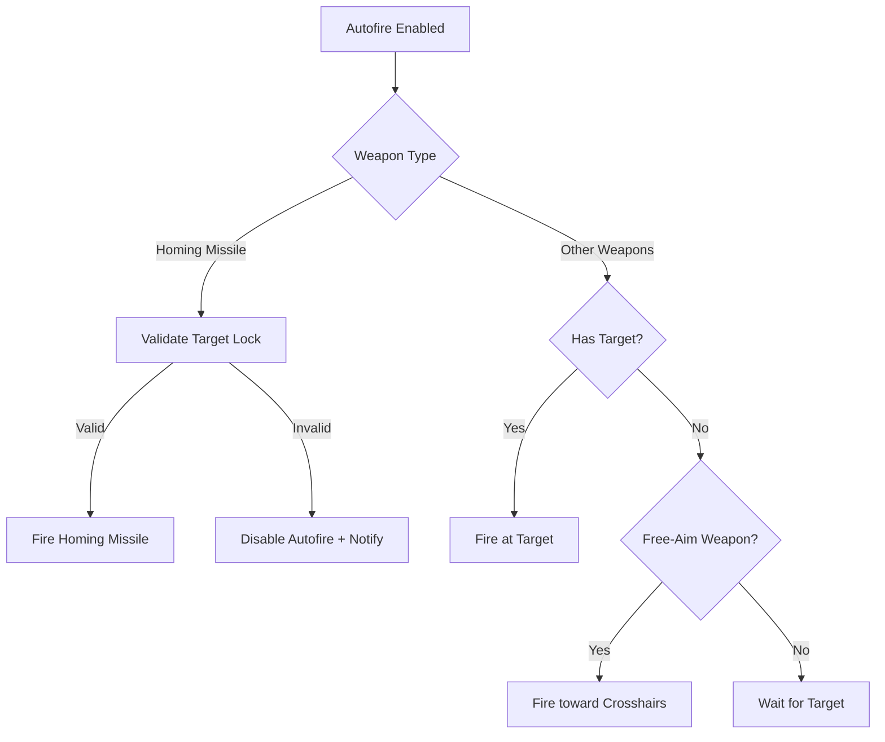

# Universal Autofire System Implementation

## Overview
Enhanced the autofire system to support all weapon types (lasers, missiles, torpedoes, mines) with specialized handling for homing missiles that require target lock validation.

## Key Features Implemented

### 1. 🎯 **Universal Autofire Support**
- **All Weapons**: Every weapon type now supports autofire (previously limited to specific weapons)
- **Weapon Definitions**: Updated `autofireEnabled: true` for all weapons in `WeaponDefinitions.js`
- **Level Requirement**: Maintains existing Level 3+ requirement for autofire availability

#### Updated Weapons:
```javascript
// ALL weapons now support autofire
laser_cannon: { autofireEnabled: true }
plasma_cannon: { autofireEnabled: true }
pulse_cannon: { autofireEnabled: true }
phaser_array: { autofireEnabled: true }
standard_missile: { autofireEnabled: true }
homing_missile: { autofireEnabled: true } // (already enabled)
photon_torpedo: { autofireEnabled: true }
proximity_mine: { autofireEnabled: true }
```

### 2. 🚀 **Enhanced Homing Missile Validation**
Specialized autofire logic for homing missiles with comprehensive target validation:

#### Target Validation Checks:
- ✅ **Existence**: Target still exists in game world
- ✅ **Range**: Target within weapon range
- ✅ **Vitality**: Target still alive (hull > 0)
- ✅ **Lock Status**: Valid target lock maintained

#### Auto-Disable on Failure:
```javascript
// Automatic autofire disable when homing missile can't fire
if (!this.validateHomingMissileTarget(weapon)) {
    this.isAutofireOn = false;
    this.showMessage('Autofire disabled: homing missile target lost', 3000);
}
```

### 3. 🎮 **Smart Weapon-Type Handling**
Different autofire behavior based on weapon characteristics:

#### Homing Missiles (`targetLockRequired: true` + `homingCapability: true`)
- **Requirement**: Must have valid target lock
- **Validation**: Continuous target validation
- **Failure**: Auto-disable autofire with user notification

#### Guided Weapons (`targetLockRequired: true` + `homingCapability: false`)
- **Behavior**: Fire at locked target
- **Fallback**: Standard target validation

#### Free-Aim Weapons (`targetLockRequired: false`)
- **Behavior**: Fire toward crosshairs if no target
- **Flexibility**: Can fire with or without target lock

### 4. 📊 **Enhanced User Feedback**
Comprehensive HUD messaging for autofire status:

#### Autofire Enable Messages:
- `"Autofire enabled: Laser Cannon (free-aim)"`
- `"Autofire enabled: Homing Missile (requires target lock)"`
- `"Autofire enabled: Photon Torpedo (guided weapon)"`

#### Failure Messages:
- `"Autofire unavailable: Weapon Level 2 (requires Level 3+)"`
- `"Autofire disabled: homing missile no target lock"`
- `"Autofire disabled: homing missile target lost"`

### 5. 🔄 **Intelligent Target Management**
Enhanced target tracking and validation:

#### Auto-Target Selection:
- Automatically finds closest target when autofire enabled
- Distance-based target selection within weapon range
- Prevents autofire on destroyed/invalid targets

#### Target Loss Handling:
- Detects when targets are destroyed
- Gracefully disables autofire with user notification
- Clears invalid target locks

## Technical Implementation

### Core Files Modified

#### `WeaponDefinitions.js`
```javascript
// Enable autofire for all weapons
autofireEnabled: true // Added to all weapon definitions
```

#### `WeaponSystemCore.js`
```javascript
// Enhanced autofire logic
updateAutofire(deltaTime) {
    if (weapon.targetLockRequired && weapon.homingCapability) {
        // Homing missile special handling
        if (this.validateHomingMissileTarget(weapon)) {
            // Fire homing missile
        } else {
            // Disable autofire for failed homing missiles
        }
    } else if (this.lockedTarget) {
        // All other weapons with target
    } else if (!weapon.targetLockRequired) {
        // Free-aim weapons without target
    }
}

// New validation method
validateHomingMissileTarget(weapon) {
    // Comprehensive target validation for homing missiles
}
```

### Autofire Flow Diagram



## Weapon-Specific Autofire Behavior

### Beam Weapons (Lasers, Plasma, etc.)
- **Autofire**: ✅ Supported
- **Target**: Optional (can fire toward crosshairs)
- **Validation**: Basic target existence check

### Non-Homing Projectiles (Torpedoes, Standard Missiles)
- **Autofire**: ✅ Supported  
- **Target**: Optional (fire toward crosshairs if no target)
- **Validation**: Basic range and existence check

### Homing Missiles
- **Autofire**: ✅ Supported with enhanced validation
- **Target**: Required (must have valid target lock)
- **Validation**: Comprehensive (existence, range, vitality, lock status)
- **Failure Handling**: Auto-disable with user notification

### Proximity Mines
- **Autofire**: ✅ Supported
- **Target**: Not required (deploy at current location)
- **Validation**: Basic deployment checks

## User Experience Improvements

### Clear Status Messages
- Weapon-specific autofire enable/disable messages
- Detailed failure reasons (level requirement, target loss, etc.)
- Weapon type identification (homing, guided, free-aim)

### Smart Behavior
- Automatic target selection for autofire
- Graceful handling of target destruction
- Weapon-appropriate firing behavior

### Enhanced HUD Integration
- Real-time autofire status updates
- Visual feedback for autofire availability
- Clear weapon type indicators

## Testing Scenarios

### Autofire Availability
- ✅ Level 1-2 weapons: Autofire unavailable (level requirement)
- ✅ Level 3+ weapons: Autofire available for all types
- ✅ No weapon equipped: Clear unavailability message

### Homing Missile Validation
- ✅ Target destroyed: Auto-disable autofire
- ✅ Target out of range: Auto-disable autofire  
- ✅ Target lock lost: Auto-disable autofire
- ✅ Valid target: Continue autofire

### Multi-Weapon Switching
- ✅ Switch between weapon types maintains appropriate autofire behavior
- ✅ Autofire status updates correctly for new weapon type
- ✅ Target validation appropriate for new weapon

## Future Enhancements

### Potential Improvements
1. **Weapon Groups**: Autofire multiple weapons simultaneously
2. **Target Prioritization**: Smart target selection based on threat level
3. **Ammunition Management**: Autofire consideration for limited-ammo weapons
4. **Energy Management**: Autofire throttling based on energy levels
5. **Electronic Warfare**: Jamming resistance for homing missiles

This implementation provides a robust, user-friendly autofire system that adapts intelligently to different weapon types while maintaining clear user feedback and graceful error handling. 