# 🌟 Collection Progression Flow: From Discovery to Mastery

## Overview

This document visualizes the **Star Fuckers** collection-driven gameplay philosophy, showing how players progress from initial exploration to becoming cosmic collectors through interconnected systems of discovery, acquisition, synthesis, and mastery.

---

## 🎯 Complete Collection Journey


> **🐣 FYI**: This timeline shows your complete journey as a cosmic collector! Think of it like leveling up in a game, but instead of just getting stronger stats, you're becoming a master of the galaxy's treasures. The numbers (3, 4, 5) show how excited/satisfied you feel at each milestone. Start by exploring space to find planets and stations, then collect items through missions and trading, combine them to make awesome gear, and finally become powerful enough to influence entire factions!

---

## 🌌 Collection Pyramid Flow

```mermaid
flowchart TD
    A[🚀 New Player] --> B[🌍 Discovery Phase]
    B --> C[📦 Collection Phase]
    C --> D[⚗️ Synthesis Phase]
    D --> E[🏆 Mastery Phase]

    B --> B1[Explore Systems]
    B --> B2[Find Objects]
    B --> B3[Learn Locations]
    B --> B4[Map Territory]

    C --> C1[Mission Rewards]
    C --> C2[Combat Drops]
    C --> C3[Trading Profits]
    C --> C4[Resource Mining]

    D --> D1[Item Combination]
    D --> D2[Ship Customization]
    D --> D3[Loadout Optimization]
    D --> D4[Strategic Synergy]

    E --> E1[Faction Influence]
    E --> E2[Exclusive Access]
    E --> E3[Market Control]
    E --> E4[Galaxy Shaping]

    style A fill:#e3f2fd
    style B fill:#f3e5f5
    style C fill:#e8f5e8
    style D fill:#fff3e0
    style E fill:#fce4ec
```



> **🐣 FYI**: Imagine this like a video game character creation flow! You start as a New Player (blue box), then progress through colored phases that build on each other. Each phase has specific activities (the smaller boxes) that teach you different skills. The colors help you remember: Purple = Learning, Green = Gathering, Orange = Creating, Pink = Mastering. Notice how you can't skip phases - you need to explore before you can collect, collect before you can craft, and craft before you can master the galaxy!

---

## 🔄 Discovery to Mastery Cycle

```mermaid
flowchart LR
    subgraph "🌟 DISCOVERY PHASE"
        D1[Explore Space] --> D2[Find Objects]
        D2 --> D3[Scan Locations]
        D3 --> D4[Map Systems]
    end

    subgraph "📈 COLLECTION PHASE"
        C1[Complete Missions] --> C2[Gather Resources]
        C2 --> C3[Trade Goods]
        C3 --> C4[Accumulate Items]
    end

    subgraph "⚗️ SYNTHESIS PHASE"
        S1[Combine Items] --> S2[Craft Equipment]
        S2 --> S3[Upgrade Systems]
        S3 --> S4[Optimize Loadouts]
    end

    subgraph "🏆 MASTERY PHASE"
        M1[Access Elites] --> M2[Influence Politics]
        M2 --> M3[Control Markets]
        M3 --> M4[Shape Universe]
    end

    D4 --> C1
    C4 --> S1
    S4 --> M1
    M4 --> D1

    style D1 fill:#bbdefb
    style D2 fill:#bbdefb
    style D3 fill:#bbdefb
    style D4 fill:#bbdefb

    style C1 fill:#c8e6c9
    style C2 fill:#c8e6c9
    style C3 fill:#c8e6c9
    style C4 fill:#c8e6c9

    style S1 fill:#ffcc80
    style S2 fill:#ffcc80
    style S3 fill:#ffcc80
    style S4 fill:#ffcc80

    style M1 fill:#f8bbd9
    style M2 fill:#f8bbd9
    style M3 fill:#f8bbd9
    style M4 fill:#f8bbd9
```



> **🐣 FYI**: This is like a never-ending adventure wheel! You start by exploring (blue boxes), which gives you items to collect (green boxes), which you can combine to create awesome gear (orange boxes), which makes you powerful enough to access new areas (pink boxes). The arrows show the flow, and the loop at the end means you keep going forever! Each color represents a different type of activity - it's like having different "jobs" in the game that you switch between as you get better.

---

## 📊 Collection Mechanics Matrix


> **🐣 FYI**: Think of this like a giant shopping mall with different stores! The sources (blue boxes at top) are like different stores - missions give you rewards, combat drops you items when you fight, trading gives you money, mining lets you dig up resources. Each source feeds into different types of items (weapon cards, ship parts, etc.) that all end up in your Card Inventory (yellow box). From there, you can use them to customize your ship and create different playstyles. It's showing you all the ways to get cool stuff in the game!

---

## 🎮 Player Progression Timeline


> **🐣 FYI**: This is like a calendar showing what you'll be doing in the first few weeks of playing! The green bars show activities you've already done (like exploring), the blue bars show what you're currently doing (planet discovery), and the gray bars show future goals. Each phase takes a different amount of time - exploration happens quickly, but mastering the galaxy takes much longer. It's a roadmap so you know what to expect and can plan your playing sessions!

---

## 🔗 Interconnected Systems Flow


> **🐣 FYI**: Picture this like different departments in a big company working together! The Discovery team (blue) finds new places and creates maps. The Collection team (green) gathers resources and items. The Synthesis team (orange) combines items to make cool gear. The Mastery team (pink) uses everything to become super powerful. The arrows show how they all help each other - better maps lead to better collection, which leads to better crafting, which leads to more power that lets you discover even more!

---

## 🎲 Collection Strategy Decision Tree


> **🐣 FYI**: This is like choosing your character's class in an RPG, but with collection strategies! Start by thinking about what you like doing most - are you aggressive and love fighting? Do you prefer exploring? Trading? Combat? Your choice leads to different paths that give you different types of items. For example, if you choose "Aggressive Collector", you'll focus on combat missions that drop lots of weapons. If you choose "Trading Focus", you'll get items from delivery missions. Each path leads to different cards in your inventory that create unique playstyles!

---

## 📈 Collection Value Progression


> **🐣 FYI**: This pie chart shows how rare different items are - like finding trading cards! 65% of items are Common (easy to get, like basic weapons), 20% are Uncommon (a bit harder, like better shields), 10% are Rare (challenging, like special ship parts), 4% are Epic (very hard, like advanced tech), and only 1% are Legendary (super rare, like one-of-a-kind treasures). This tells you what to expect - most items you'll find easily, but the really special ones will take a lot of effort to collect!

---

## 🔄 Feedback Loop Ecosystem


> **🐣 FYI**: Imagine a magical garden where everything grows together! Your actions (blue boxes on left) like exploring, doing missions, fighting, and trading create items that go into your collection system (green boxes). This makes the world respond (orange boxes) with new missions, changing prices, and better faction relations. You get better equipment and opportunities (pink boxes), which lets you do even more actions. It's a positive cycle - the more you play, the more the game opens up, and the more fun you have!

---

## 🏗️ Collection Architecture Overview


> **🐣 FYI**: Think of this like the behind-the-scenes of a restaurant! The Frontend (blue) is what you see - the Star Charts UI, discovery manager, collection interface, and synthesis engine. The Backend (purple) is the kitchen - mission engine, item database, trading system, and faction manager. The Data Layer (green) is the pantry - static universe data, dynamic state, player progress, and collection history. The Integration Layer (orange) is the waitstaff connecting everything smoothly. All these parts work together so your collection experience feels seamless!

---

## 🎯 Key Collection Milestones


> **🐣 FYI**: This mind map is like a treasure map of achievements! Starting from the center "Star Collector Journey", it branches out into the four main phases. Each phase has sub-goals that build on each other. For example, in Discovery Phase, you start by exploring the system, then find specific planets, then master docking at stations, and finally map all the trade routes. It's showing you the journey from beginner to expert, with clear milestones to celebrate along the way!

---

## 📊 Collection Analytics Dashboard


> **🐣 FYI**: Imagine this like a video game stats screen that tracks your progress! The Progress Tracking (blue) shows your discovery percentage and collection count. The Performance Metrics (green) measures how fast you're collecting items and completing missions. The Goal Setting (orange) helps you plan what to collect next. Together, they create a dashboard that shows how well you're doing and what to focus on to become a better collector!

---

## 🎮 Game Mode Integration


> **🐣 FYI**: This shows different "modes" or focus areas you can play in! You start in Discovery Mode (learning about the universe), then move to Collection Mode (gathering items), then Synthesis Mode (combining items), and finally Mastery Mode (having ultimate power). The notes explain what each mode focuses on - Discovery is about exploration and learning, Collection is about gathering resources, Synthesis is about crafting gear, and Mastery is about achieving great power. You can also choose optional paths like Free Exploration or Combat Focus at different points!

---

## 🔄 Collection Economy Flow


> **🐣 FYI**: This is like following money through a factory! Raw resources (blue boxes) from mining, combat, missions, and trading get processed through different methods (light blue boxes). They get refined and enhanced (green boxes), which increases their value through rarity and market factors (orange boxes). Finally, they contribute to your player economy (pink boxes) through credits, investment opportunities, trading power, and economic influence. It's showing how everything you collect turns into economic power!

---

## 🎯 Player Archetype Collection Paths


> **🐣 FYI**: Think of this like choosing your character's "job" in the game! You can be an Explorer (focusing on discovering new places), a Warrior (focusing on combat and weapons), a Trader (focusing on commerce and markets), or a Collector (focusing on gathering everything). Each archetype leads to different types of items and specialized loadouts. For example, Warriors get lots of weapon cards, Traders get economic tools, Explorers get mapping items, and Collectors get a bit of everything. All paths eventually lead to "Master Collection" and "Ultimate Power" - you just get there through different activities!

---

## 📈 Collection Progression Metrics


> **🐣 FYI**: This shows how your progress connects to achievements and social features! Your collection stats (blue boxes) lead to achievements and badges (green boxes), which unlock titles and special access (orange boxes). This creates social features like leaderboards and showcases (also orange). It's like a reward system - the better you collect, the more recognition and exclusive content you unlock!

---

## 🎪 Collection Event System


> **🐣 FYI**: This is like special holiday events in a game! There are different types of events (blue boxes) - timed events with limited-time missions, seasonal events with holiday themes, achievement events for milestones, and community events for group goals. All events give you special items (yellow boxes) that go into your inventory, leading to enhanced collections and special achievements (pink boxes). It's extra content that keeps the game exciting with new challenges and rewards!

---

## 🏆 Collection Mastery Achievements


> **🐣 FYI**: This is like earning different badges or ranks in a game! There are achievement categories for different skills - Discovery achievements for exploring, Gathering achievements for collecting, Crafting achievements for making items, and Mastery achievements for becoming a legend. Each category has specific titles like "Explorer", "Collector", "Crafter", and "Master Collector". All achievements lead to titles, rewards, exclusive content, special items, unique abilities, and legendary status. It's like leveling up your reputation in the galaxy!

---

## 🎨 Visual Collection Themes


> **🐣 FYI**: This mind map organizes all the different types of items you can collect into categories! The root is "Collection Themes" with two main branches: Cosmic Elements (stars, planets, biological specimens) and Technological Artifacts (ancient tech, modern tech). Each branch has subcategories like "Faction Artifacts" under Cultural Treasures or "Military Hardware" under Strategic Assets. It's like organizing your collection into different display cases in a museum!

---

## 📚 Collection Knowledge System


> **🐣 FYI**: This shows how you learn about your collection! Knowledge comes from sources (blue boxes) like discovering items and reading descriptions. This builds your learning (green boxes) from basic information to advanced details to expert knowledge to master insights. Finally, you apply this knowledge (orange boxes) through practical use, optimization, innovation, and mastery. It's like going from reading item descriptions to becoming an expert who can combine items in creative ways!

---

## 🎭 Collection Narrative Integration

```mermaid
flowchart TD
    A[Collection Story] --> B[Personal Journey]
    A --> C[Faction Lore]
    A --> D[Universe History]

    B --> B1[Character Development]
    B --> B2[Motivation Evolution]
    B --> B3[Goal Progression]
    B --> B4[Legacy Building]

    C --> C1[Faction Relations]
    C --> C2[Diplomatic Events]
    C --> C3[Alliance Building]
    C --> C4[Conflict Resolution]

    D --> D1[Historical Discoveries]
    D --> D2[Ancient Mysteries]
    D --> D3[Future Implications]
    D --> D4[Cosmic Significance]

    B1 --> E[Narrative Integration]
    B2 --> E
    B3 --> E
    B4 --> E
    C1 --> E
    C2 --> E
    C3 --> E
    C4 --> E
    D1 --> E
    D2 --> E
    D3 --> E
    D4 --> E

    E --> F[Meaningful Collection]
    F --> G[Emotional Investment]
    G --> H[Player Retention]

    style A fill:#e3f2fd
    style E fill:#fff3e0
    style H fill:#fce4ec
```

> **🐣 FYI**: This connects your collection to the game's story! Your collection activities (blue boxes) influence your personal journey and the faction lore. This creates character development, evolving motivations, and legacy building (all part of personal journey). It also affects faction relations, diplomatic events, alliance building, and conflict resolution (faction lore). Plus it drives historical discoveries, ancient mysteries, future implications, and cosmic significance (universe history). Everything flows together to create meaningful collection experiences that make you feel emotionally invested in the game!

---

## 🔧 Collection System Maintenance

```mermaid
flowchart TD
    A[System Health] --> B[Data Integrity]
    A --> C[Performance Monitoring]
    A --> D[Balance Updates]

    B --> B1[Inventory Validation]
    B --> B2[Progress Tracking]
    B --> B3[Save File Integrity]
    B --> B4[Cross-System Consistency]

    C --> C1[Collection Rate Analysis]
    C --> C2[Memory Usage Tracking]
    C --> C3[Load Time Monitoring]
    C --> C4[UI Responsiveness]

    D --> D1[Rarity Balance]
    D --> D2[Progression Pacing]
    D --> D3[Reward Distribution]
    D --> D4[Difficulty Scaling]

    B1 --> E[Automated Checks]
    B2 --> E
    B3 --> E
    B4 --> E
    C1 --> E
    C2 --> E
    C3 --> E
    C4 --> E
    D1 --> E
    D2 --> E
    D3 --> E
    D4 --> E

    E --> F[System Optimization]
    F --> G[Player Experience]
    G --> H[Content Updates]

    style A fill:#e3f2fd
    style E fill:#fff3e0
    style H fill:#fce4ec
```

> **🐣 FYI**: This is like the "under the hood" maintenance that keeps the game running smoothly! System Health (blue boxes) monitors data integrity and performance. This feeds into automated checks (yellow boxes) that validate your inventory, track progress, ensure save file integrity, and maintain consistency between different parts of the game. Finally, this leads to system optimization and better player experience (pink boxes), plus regular content updates. It's the technical stuff that makes sure your collection always works properly!

---

## 🎯 Conclusion

These diagrams illustrate the comprehensive **Star Fuckers** collection-driven gameplay philosophy, showing how every system in PlanetZ contributes to the core loop of **Discovery → Collection → Synthesis → Mastery**. The interconnected nature of these systems creates meaningful player progression and replayability through strategic collection decisions that shape both the player's capabilities and the game universe itself.

The collection mechanics serve as the foundation for all gameplay, creating a cohesive experience where exploration, combat, trading, and crafting all feed into a unified progression system that rewards strategic thinking and thorough exploration of the Sol system.
