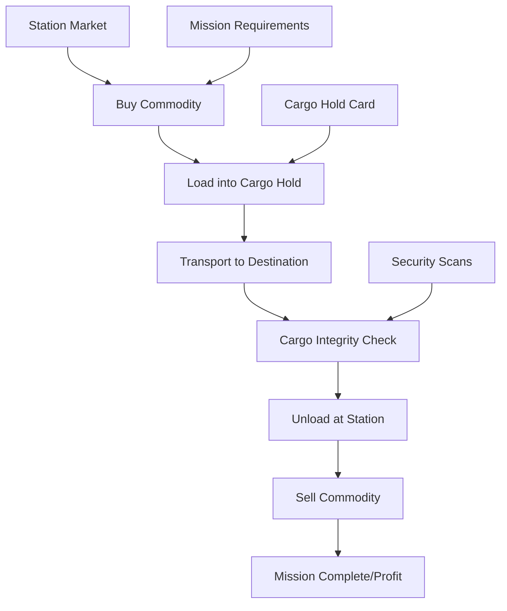

# 🚛 Commodity Trading System Specification

## Overview

The Commodity Trading System enables ships with cargo holds to buy, transport, and sell various commodities between stations, creating a dynamic economic gameplay loop and enabling delivery missions like "Medical Supply Run".

---

## 🎯 Core Requirements

### Primary Objectives
- Enable cargo-based delivery missions ("Transport X to Y")
- Create economic trading gameplay loop
- Support multiple cargo types with different properties
- Implement cargo integrity and security mechanics
- Provide intuitive buy/sell UI interfaces

### Mission Integration
- Delivery missions: "Transport 50 units of Medical Supplies to Europa Station"
- Cargo integrity objectives: "Maintain cargo integrity above 90%"
- Time-sensitive deliveries: "Deliver within 30 minutes"
- Contraband smuggling: "Avoid security scans"

---

## 🏗️ System Architecture

### Core Components

1. **Cargo Hold Cards**: Ship equipment that enables cargo transport
2. **Commodity Database**: Definitions of all tradeable goods
3. **Station Markets**: Buy/sell interfaces with dynamic pricing
4. **Cargo Management**: Loading, unloading, and integrity tracking
5. **Mission Integration**: Delivery objectives and cargo requirements

### Data Flow



---

## 🎴 Cargo Hold Card System

### Card Hierarchy

#### **Basic Cargo Hold (Level 1-3)**
```javascript
{
    "card_type": "cargo_hold",
    "level": 1,
    "name": "Basic Cargo Bay",
    "capacity": 100,           // Units of cargo
    "integrity_protection": 0.8, // Base integrity retention
    "security_rating": "low",  // Scanner resistance
    "special_features": []
}
```

#### **Advanced Cargo Hold (Level 4-6)**
```javascript
{
    "card_type": "cargo_hold", 
    "level": 4,
    "name": "Reinforced Cargo Bay",
    "capacity": 250,
    "integrity_protection": 0.9,
    "security_rating": "medium",
    "special_features": ["environmental_control", "damage_resistance"]
}
```

#### **Elite Cargo Hold (Level 7-10)**
```javascript
{
    "card_type": "cargo_hold",
    "level": 7,
    "name": "Magnetic Containment Bay",
    "capacity": 500,
    "integrity_protection": 0.95,
    "security_rating": "high",
    "special_features": [
        "magnetic_hold",      // Prevents theft
        "shield_hold",        // Fools cargo scanners
        "stasis_field",       // Perfect preservation
        "modular_storage"     // Flexible compartments
    ]
}
```

### Multiple Cargo Hold Decision

**Recommendation: Support Multiple Cargo Holds**

**Benefits**:
- Specialized storage (medical bay + general cargo)
- Risk distribution (contraband in shielded hold, legal goods in basic)
- Upgrade path progression (add holds as needed)
- Strategic depth (balance capacity vs. ship performance)

**Implementation**:
- Each cargo hold card adds capacity to ship's total
- Different hold types for different cargo categories
- Individual hold features apply to assigned cargo
- UI shows separate holds with different capabilities

---

## 📦 Commodity System

### Commodity Categories

#### **1. Basic Commodities**
```javascript
{
    "category": "basic",
    "examples": [
        {
            "id": "food_rations",
            "name": "Food Rations",
            "base_price": 10,
            "volatility": 0.2,
            "volume": 1,
            "decay_rate": 0.05,
            "legal_status": "legal"
        },
        {
            "id": "raw_materials", 
            "name": "Raw Materials",
            "base_price": 15,
            "volatility": 0.3,
            "volume": 2,
            "decay_rate": 0.01,
            "legal_status": "legal"
        }
    ]
}
```

#### **2. Medical Supplies**
```javascript
{
    "category": "medical",
    "examples": [
        {
            "id": "medical_supplies",
            "name": "Medical Supplies", 
            "base_price": 50,
            "volatility": 0.4,
            "volume": 1,
            "decay_rate": 0.10,
            "legal_status": "legal",
            "special_requirements": ["temperature_control", "sterile_environment"]
        },
        {
            "id": "emergency_medicine",
            "name": "Emergency Medicine",
            "base_price": 100,
            "volatility": 0.6,
            "volume": 1,
            "decay_rate": 0.15,
            "legal_status": "restricted"
        }
    ]
}
```

#### **3. High-Value Goods**
```javascript
{
    "category": "luxury",
    "examples": [
        {
            "id": "rare_elements",
            "name": "Rare Elements",
            "base_price": 200,
            "volatility": 0.8,
            "volume": 1,
            "decay_rate": 0.0,
            "legal_status": "legal",
            "special_requirements": ["magnetic_containment"]
        }
    ]
}
```

#### **4. Contraband**
```javascript
{
    "category": "contraband",
    "examples": [
        {
            "id": "illegal_weapons",
            "name": "Illegal Weapons",
            "base_price": 500,
            "volatility": 1.0,
            "volume": 3,
            "decay_rate": 0.0,
            "legal_status": "illegal",
            "special_requirements": ["shield_hold"],
            "scan_detection_chance": 0.8
        }
    ]
}
```

### Commodity Properties

#### **Core Attributes**
- **Base Price**: Starting price in credits per unit
- **Volatility**: Price fluctuation factor (0.0-1.0)
- **Volume**: Space taken per unit in cargo hold
- **Decay Rate**: Integrity loss per hour/jump
- **Legal Status**: legal, restricted, illegal

#### **Special Requirements**
- **Temperature Control**: Requires environmental systems
- **Sterile Environment**: Medical/food items
- **Magnetic Containment**: Rare elements/dangerous materials
- **Shield Hold**: Contraband hiding from scanners

#### **Market Dynamics**
- **Supply/Demand**: Station-specific availability
- **Distance Pricing**: Further stations pay more
- **Event Pricing**: Wars, disasters affect prices
- **Faction Relations**: Reputation affects prices

---

## 🏪 Station Market System

### Market Interface Design

#### **Market Overview Screen**
```
╔══════════════════════════════════════════════════════════════╗
║                    TERRA PRIME COMMODITY EXCHANGE            ║
╠══════════════════════════════════════════════════════════════╣
║  COMMODITY          │ BUY PRICE │ SELL PRICE │ AVAILABLE     ║
║  Food Rations       │    12 CR  │     8 CR   │   500 units  ║
║  Medical Supplies   │    65 CR  │    45 CR   │   150 units  ║
║  Raw Materials      │    18 CR  │    12 CR   │  1000 units  ║
║  Rare Elements      │   245 CR  │   180 CR   │    25 units  ║
╠══════════════════════════════════════════════════════════════╣
║  CARGO HOLD STATUS: 150/500 units │ CREDITS: 15,000         ║
╠══════════════════════════════════════════════════════════════╣
║  [BUY] [SELL] [CARGO MANIFEST] [MARKET DATA] [EXIT]         ║
╚══════════════════════════════════════════════════════════════╝
```

#### **Buy Interface**
```
╔══════════════════════════════════════════════════════════════╗
║                   BUY: MEDICAL SUPPLIES                      ║
╠══════════════════════════════════════════════════════════════╣
║  Price per unit: 65 CR                                      ║
║  Available: 150 units                                       ║
║  Your credits: 15,000 CR                                    ║
║                                                             ║
║  Quantity: [____50____] units                              ║
║  Total cost: 3,250 CR                                      ║
║                                                             ║
║  Cargo hold space: 350/500 available                       ║
║  After purchase: 300/500 used                              ║
║                                                             ║
║  Special requirements: Temperature Control ✓                ║
║                                                             ║
║  [CONFIRM PURCHASE] [CANCEL]                               ║
╚══════════════════════════════════════════════════════════════╝
```

### Dynamic Pricing System

#### **Price Calculation Formula**
```javascript
final_price = base_price * (1 + volatility * market_factor) * distance_multiplier * faction_modifier

where:
- market_factor: -0.5 to +1.0 (supply/demand)
- distance_multiplier: 1.0 + (distance_from_source / 1000)
- faction_modifier: 0.8 to 1.2 (reputation bonus/penalty)
```

#### **Market Events**
```javascript
{
    "event_type": "medical_emergency",
    "affected_stations": ["europa_station"],
    "commodity_modifiers": {
        "medical_supplies": {
            "demand_multiplier": 3.0,
            "availability_multiplier": 0.3
        }
    },
    "duration": "24_hours"
}
```

---

## 🎮 Cargo Management Mechanics

### Loading and Unloading

#### **Cargo Loading Process**
1. **Dock at Station**: Access commodity exchange
2. **Check Cargo Holds**: Verify capacity and features
3. **Select Commodity**: Choose type and quantity
4. **Validate Requirements**: Ensure hold supports cargo type
5. **Complete Transaction**: Deduct credits, load cargo
6. **Update Manifest**: Track cargo and loading time

#### **Cargo Hold Assignment**
```javascript
// Automatic cargo assignment algorithm
function assignCargoToHold(cargo, ship_holds) {
    // Priority 1: Specific requirements (contraband → shield hold)
    if (cargo.special_requirements.includes("shield_hold")) {
        return findHoldWithFeature(ship_holds, "shield_hold");
    }
    
    // Priority 2: Optimal features (medical → temperature control)
    if (cargo.category === "medical") {
        return findHoldWithFeature(ship_holds, "temperature_control") || 
               findAvailableHold(ship_holds);
    }
    
    // Priority 3: Largest available space
    return findLargestAvailableHold(ship_holds);
}
```

### Cargo Integrity System

#### **Integrity Factors**
- **Time Decay**: Natural degradation over time
- **Environmental Damage**: Heat, cold, radiation
- **Combat Damage**: Weapon hits to cargo areas
- **Poor Storage**: Wrong hold type for cargo requirements
- **Rough Handling**: High-G maneuvers, hard docking

#### **Integrity Calculation**
```javascript
function updateCargoIntegrity(cargo, elapsed_time, events) {
    let integrity = cargo.current_integrity;
    
    // Base decay over time
    integrity -= cargo.decay_rate * elapsed_time;
    
    // Environmental factors
    if (!hasProperStorage(cargo, cargo_hold)) {
        integrity -= 0.05 * elapsed_time;
    }
    
    // Combat damage
    for (let damage_event of events.combat_damage) {
        if (damage_event.target === "cargo_bay") {
            integrity -= damage_event.amount * 0.1;
        }
    }
    
    // Hold features provide protection
    integrity += cargo_hold.integrity_protection * 0.02 * elapsed_time;
    
    return Math.max(0, Math.min(1.0, integrity));
}
```

#### **Integrity Thresholds**
- **100%-95%**: Perfect condition, full value
- **94%-85%**: Good condition, 95% value
- **84%-70%**: Fair condition, 80% value
- **69%-50%**: Poor condition, 60% value
- **Below 50%**: Damaged goods, 30% value

### Security and Scanning

#### **Security Scan Events**
```javascript
{
    "scan_type": "routine_security",
    "location": "station_docking",
    "detection_chance": {
        "legal_goods": 0.0,
        "restricted_goods": 0.3,
        "illegal_goods": 0.8
    },
    "hold_modifiers": {
        "basic_hold": 1.0,
        "shield_hold": 0.2,    // 80% reduction in detection
        "magnetic_hold": 0.5   // 50% reduction
    }
}
```

#### **Scan Results**
- **Clean Scan**: "Cargo manifest verified. Welcome to Terra Prime."
- **Suspicious Reading**: "Anomalous readings detected. Stand by for inspection."
- **Contraband Detected**: "Illegal cargo detected. Prepare to be boarded."

---

## 🎯 Mission Integration

### Delivery Mission Types

#### **1. Basic Cargo Delivery**
```javascript
{
    "mission_type": "delivery",
    "title": "Medical Supply Run",
    "objectives": [
        {
            "id": "1",
            "description": "Load {cargo_amount} units of {cargo_type}",
            "cargo_type": "medical_supplies",
            "cargo_amount": 50,
            "pickup_location": "terra_prime"
        },
        {
            "id": "2", 
            "description": "Deliver cargo to {destination}",
            "destination": "europa_station",
            "delivery_location": "europa_station"
        },
        {
            "id": "3",
            "description": "Maintain cargo integrity above {min_integrity}%",
            "min_integrity": 90,
            "is_continuous": true
        }
    ]
}
```

#### **2. Multi-Stop Delivery**
```javascript
{
    "mission_type": "delivery_chain",
    "title": "Supply Chain Run",
    "objectives": [
        {
            "id": "1",
            "description": "Pick up food rations from Ceres Outpost",
            "cargo_type": "food_rations",
            "cargo_amount": 100,
            "pickup_location": "ceres_outpost"
        },
        {
            "id": "2",
            "description": "Deliver food to Mars Base",
            "delivery_location": "mars_base"
        },
        {
            "id": "3",
            "description": "Pick up raw materials from Mars Base", 
            "cargo_type": "raw_materials",
            "cargo_amount": 75,
            "pickup_location": "mars_base"
        },
        {
            "id": "4",
            "description": "Deliver materials to Luna Port",
            "delivery_location": "luna_port"
        }
    ]
}
```

#### **3. Smuggling Mission**
```javascript
{
    "mission_type": "smuggling",
    "title": "Discrete Transport",
    "objectives": [
        {
            "id": "1",
            "description": "Pick up sensitive cargo",
            "cargo_type": "classified_data",
            "cargo_amount": 5,
            "pickup_location": "asteroid_mining_platform"
        },
        {
            "id": "2",
            "description": "Avoid security scans",
            "max_scan_exposures": 0,
            "is_continuous": true
        },
        {
            "id": "3",
            "description": "Deliver without detection",
            "delivery_location": "luna_port"
        }
    ]
}
```

### Mission Event Integration

#### **Cargo Loading Events**
```javascript
// Send to mission system when cargo is loaded
missionEventService.cargoLoaded(cargo_type, quantity, location, {
    player_ship: ship.shipType,
    cargo_holds: ship.getInstalledCargoHolds(),
    timestamp: Date.now()
});
```

#### **Cargo Delivery Events**
```javascript
// Send when cargo is unloaded at destination
missionEventService.cargoDelivered(cargo_type, quantity, location, {
    integrity: cargo.current_integrity,
    delivery_time: elapsed_time,
    scan_encounters: scan_count
});
```

#### **Integrity Monitoring**
```javascript
// Continuous monitoring for integrity objectives
function checkCargoIntegrityObjectives(ship) {
    for (let mission of activeMissions) {
        for (let objective of mission.objectives) {
            if (objective.type === "maintain_integrity") {
                let current_integrity = ship.getLowestCargoIntegrity();
                if (current_integrity < objective.min_integrity) {
                    missionEventService.objectiveFailed(mission.id, objective.id);
                }
            }
        }
    }
}
```

---

## 🖥️ User Interface Design

### Cargo Management UI

#### **Ship Cargo Overview**
```
╔══════════════════════════════════════════════════════════════╗
║                     SHIP CARGO MANIFEST                     ║
╠══════════════════════════════════════════════════════════════╣
║  CARGO HOLD 1: Basic Cargo Bay (Level 2)                   ║
║  Capacity: 150/200 units │ Integrity: Good (92%)           ║
║  ┌─────────────────────────────────────────────────────────┐ ║
║  │ Food Rations      │  50 units │ 95% │ 12h loaded      │ ║
║  │ Raw Materials     │ 100 units │ 89% │  6h loaded      │ ║
║  └─────────────────────────────────────────────────────────┘ ║
║                                                             ║
║  CARGO HOLD 2: Magnetic Containment Bay (Level 7)          ║
║  Capacity: 25/300 units │ Integrity: Perfect (100%)        ║
║  Features: Magnetic Hold, Shield Hold, Stasis Field        ║
║  ┌─────────────────────────────────────────────────────────┐ ║
║  │ Rare Elements     │  25 units │ 100%│  2h loaded      │ ║
║  └─────────────────────────────────────────────────────────┘ ║
║                                                             ║
║  TOTAL: 175/500 units │ ESTIMATED VALUE: 8,750 CR          ║
║                                                             ║
║  [TRANSFER CARGO] [JETTISON] [INTEGRITY REPORT] [CLOSE]    ║
╚══════════════════════════════════════════════════════════════╝
```

#### **Commodity Exchange Integration**
- **Docking Interface**: "Access Commodity Exchange" button
- **Market Overview**: Current prices, availability, trends
- **Buy/Sell Screens**: Quantity selection, cost calculation
- **Cargo Assignment**: Choose which hold to use
- **Transaction Confirmation**: Review before finalizing

#### **Mission Integration UI**
- **Mission Requirements**: Show required cargo for delivery missions
- **Objective Tracking**: Progress toward delivery goals
- **Integrity Warnings**: Alerts when cargo condition degrades
- **Route Planning**: Optimal paths for multi-stop deliveries

---

## ⚙️ Technical Implementation

### Backend Database Schema

#### **Commodities Table**
```sql
CREATE TABLE commodities (
    id VARCHAR(50) PRIMARY KEY,
    name VARCHAR(100) NOT NULL,
    category VARCHAR(50) NOT NULL,
    base_price DECIMAL(10,2) NOT NULL,
    volatility DECIMAL(3,2) NOT NULL,
    volume INTEGER NOT NULL,
    decay_rate DECIMAL(4,3) NOT NULL,
    legal_status VARCHAR(20) NOT NULL,
    special_requirements JSON
);
```

#### **Station Markets Table**
```sql
CREATE TABLE station_markets (
    station_id VARCHAR(50),
    commodity_id VARCHAR(50),
    buy_price DECIMAL(10,2),
    sell_price DECIMAL(10,2),
    available_quantity INTEGER,
    last_updated TIMESTAMP,
    PRIMARY KEY (station_id, commodity_id)
);
```

#### **Ship Cargo Table**
```sql
CREATE TABLE ship_cargo (
    ship_id VARCHAR(50),
    cargo_hold_slot INTEGER,
    commodity_id VARCHAR(50),
    quantity INTEGER,
    current_integrity DECIMAL(4,3),
    loaded_at TIMESTAMP,
    loaded_location VARCHAR(50),
    PRIMARY KEY (ship_id, cargo_hold_slot, commodity_id)
);
```

### Frontend Components

#### **CargoHoldManager.js**
```javascript
export class CargoHoldManager {
    constructor(ship) {
        this.ship = ship;
        this.cargoHolds = [];
        this.loadedCargo = new Map();
    }
    
    getAvailableCapacity() {
        return this.cargoHolds.reduce((total, hold) => 
            total + hold.getRemainingCapacity(), 0);
    }
    
    loadCargo(commodity, quantity, targetHold = null) {
        const hold = targetHold || this.selectOptimalHold(commodity);
        return hold.loadCargo(commodity, quantity);
    }
    
    updateCargoIntegrity(deltaTime) {
        for (let [cargoId, cargo] of this.loadedCargo) {
            cargo.updateIntegrity(deltaTime, this.ship.getEnvironmentalFactors());
        }
    }
}
```

#### **CommodityExchange.js**
```javascript
export class CommodityExchange {
    constructor(starfieldManager, stationId) {
        this.starfieldManager = starfieldManager;
        this.stationId = stationId;
        this.marketData = new Map();
    }
    
    async loadMarketData() {
        const response = await fetch(`/api/stations/${this.stationId}/market`);
        this.marketData = await response.json();
    }
    
    buyCommodity(commodityId, quantity) {
        // Validate capacity, credits, requirements
        // Update ship cargo and player credits
        // Send mission event if applicable
    }
    
    sellCommodity(commodityId, quantity) {
        // Calculate price based on integrity
        // Remove from ship cargo
        // Add credits to player
        // Send mission event if applicable
    }
}
```

### API Endpoints

#### **Market Data**
```http
GET /api/stations/{station_id}/market
Response: {
    "commodities": [
        {
            "id": "medical_supplies",
            "buy_price": 65.50,
            "sell_price": 45.20,
            "available_quantity": 150,
            "demand_trend": "increasing"
        }
    ]
}
```

#### **Cargo Operations**
```http
POST /api/ships/{ship_id}/cargo/load
{
    "commodity_id": "medical_supplies",
    "quantity": 50,
    "cargo_hold_slot": 1,
    "location": "terra_prime"
}

POST /api/ships/{ship_id}/cargo/unload
{
    "commodity_id": "medical_supplies", 
    "quantity": 50,
    "location": "europa_station"
}
```

---

## 🎯 Mission Event Integration

### Cargo Mission Events

#### **Cargo Loading Event**
```javascript
async function handleCargoLoaded(cargo_type, quantity, location, ship_context) {
    // Update delivery mission progress
    for (let mission of activeMissions) {
        if (mission.mission_type === 'delivery') {
            const objective = mission.findObjective('load_cargo');
            if (objective && objective.cargo_type === cargo_type) {
                await missionEventService.cargoLoaded(cargo_type, quantity, location, ship_context);
            }
        }
    }
}
```

#### **Cargo Delivery Event**
```javascript
async function handleCargoDelivered(cargo_type, quantity, location, cargo_condition) {
    // Complete delivery objectives
    const eventData = {
        cargo_type: cargo_type,
        quantity: quantity,
        location: location,
        integrity: cargo_condition.integrity,
        delivery_time: cargo_condition.transit_time
    };
    
    await missionEventService.cargoDelivered(eventData);
}
```

#### **Integrity Monitoring**
```javascript
function startCargoIntegrityMonitoring() {
    setInterval(() => {
        for (let mission of activeMissions) {
            const integrityObjectives = mission.getObjectivesByType('maintain_integrity');
            for (let objective of integrityObjectives) {
                const currentIntegrity = ship.getLowestCargoIntegrity();
                if (currentIntegrity < objective.min_integrity) {
                    missionEventService.objectiveFailed(mission.id, objective.id, {
                        reason: 'cargo_integrity_breach',
                        current_integrity: currentIntegrity,
                        required_integrity: objective.min_integrity
                    });
                }
            }
        }
    }, 5000); // Check every 5 seconds
}
```

---

## 🚀 Implementation Phases

### Phase 1: Core Infrastructure
- [ ] Cargo hold card definitions and mechanics
- [ ] Basic commodity database
- [ ] Cargo loading/unloading system
- [ ] Simple buy/sell interface

### Phase 2: Market Dynamics  
- [ ] Dynamic pricing system
- [ ] Station-specific market data
- [ ] Supply/demand mechanics
- [ ] Market events and fluctuations

### Phase 3: Advanced Features
- [ ] Multiple cargo hold support
- [ ] Advanced hold features (magnetic, shield)
- [ ] Cargo integrity system
- [ ] Security scanning mechanics

### Phase 4: Mission Integration
- [ ] Delivery mission templates
- [ ] Cargo event tracking
- [ ] Integrity objective monitoring
- [ ] Smuggling mission mechanics

### Phase 5: Polish & Balance
- [ ] UI/UX refinement
- [ ] Economic balancing
- [ ] Performance optimization
- [ ] Comprehensive testing

---

## 🎯 Expected Outcomes

### Player Experience
- **Rich Trading Gameplay**: Buy low, sell high across stations
- **Strategic Cargo Management**: Choose optimal holds and routes
- **Mission Variety**: Delivery missions with different challenges
- **Economic Progression**: Upgrade to better cargo holds and larger ships

### Mission System Enhancement
- **Delivery Missions**: "Medical Supply Run", "Emergency Supplies"
- **Multi-Stop Routes**: Complex logistics missions
- **Smuggling Operations**: High-risk, high-reward contraband transport
- **Integrity Challenges**: Maintain cargo condition under adverse conditions

### Economic Depth
- **Dynamic Markets**: Prices fluctuate based on supply/demand
- **Trade Routes**: Profitable routes between distant stations
- **Specialization**: Different ships excel at different cargo types
- **Risk/Reward**: Dangerous routes offer higher profits

**This commodity trading system will transform the game from purely combat-focused to a rich space trading simulation with diverse mission types and economic gameplay!** 🌌

---

## 📝 Technical Notes

### Integration Points
- **Card System**: Cargo holds as ship equipment cards
- **Mission System**: Delivery objectives and event tracking
- **Station System**: Market interfaces and commodity exchange
- **UI System**: Cargo management and trading interfaces

### Performance Considerations
- **Cargo Updates**: Efficient integrity calculations
- **Market Data**: Cached pricing with periodic updates
- **Mission Events**: Optimized event handling
- **UI Responsiveness**: Smooth cargo management interfaces

### Security Considerations
- **Transaction Validation**: Server-side verification
- **Cargo Verification**: Prevent item duplication
- **Market Manipulation**: Anti-exploit measures
- **Save Game Integrity**: Secure cargo persistence

This specification provides a comprehensive foundation for implementing a full-featured commodity trading system that integrates seamlessly with the existing mission framework!
