# Cut Scene System

## Table of Contents
1. [Overview](#overview)
2. [Goals](#goals)
3. [System Architecture](#system-architecture)
4. [UI Flow Sequences](#ui-flow-sequences)
5. [JSON Template System](#json-template-system)
6. [Implementation Plan](#implementation-plan)
7. [Integration Points](#integration-points)
8. [Technical Specifications](#technical-specifications)
9. [Error Handling & Recovery](#error-handling--recovery)
10. [Security Considerations](#security-considerations)
11. [Accessibility Compliance](#accessibility-compliance)
12. [Performance Optimization](#performance-optimization)
13. [Asset Requirements](#asset-requirements)
14. [Developer Tools & Debugging](#developer-tools--debugging)
15. [Localization & Internationalization](#localization--internationalization)
16. [Content Management System](#content-management-system)
17. [Analytics & Telemetry](#analytics--telemetry)
18. [Testing Strategy](#testing-strategy)
19. [Deployment & Distribution](#deployment--distribution)
20. [Appendix A: Visual Storyboards](#appendix-visual-storyboards)
21. [Appendix B: Visual Mockups with Communication System Integration](#appendix-b-visual-mockups-with-communication-system-integration)

---

## Overview

The Cut Scene System is a modular framework designed to handle cinematic sequences that bridge gameplay transitions and deliver narrative content in the PlanetZ space shooter. It integrates seamlessly with the existing mission system, communication HUD, and station interfaces to create immersive story-driven experiences.

### Key Features
- **Modular Design**: Reusable scene templates with station/event customization
- **Trigger-Based Activation**: Scenes activate based on player actions or game states
- **Visual & Audio Integration**: Supports typewriter text, NPC portraits, videos, and audio
- **Skippability Controls**: Configurable skip options with critical scene protection
- **Performance Optimized**: Pre-loaded assets with minimal loading interruption
- **Localization Ready**: Text elements designed for easy translation

---

## Goals

### Primary Objectives
1. **Story Delivery**: Provide immersive narrative-driven sequences that advance plot and reveal character backstories
2. **Event Annotation**: Highlight environmental changes, mission updates, and lore elements through contextual visuals
3. **Seamless Transitions**: Create smooth bridges between space gameplay and station menu interactions

### Secondary Objectives
- Enhance player engagement during transitions
- Maintain consistent visual and audio design language
- Support both mandatory and optional narrative content
- Enable dynamic content based on player choices and game state

---

## System Architecture

### System Overview Diagram

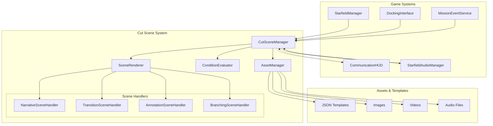

### Core Components

#### CutSceneManager
- **Purpose**: Central orchestrator for all cut scene operations
- **Responsibilities**:
  - Scene loading and caching
  - Trigger evaluation and scene selection
  - Integration with existing UI systems
  - State management and persistence

#### SceneRenderer
- **Purpose**: Handles visual presentation of cut scenes
- **Responsibilities**:
  - UI element creation and animation
  - Media playback (images, videos, animations)
  - Typewriter text effects
  - Skip button management

#### AudioManager Integration
- **Purpose**: Manages cut scene audio playback
- **Responsibilities**:
  - Voice line synchronization
  - Background music control
  - Sound effect timing
  - Audio fade in/out transitions

#### StateManager Integration
- **Purpose**: Tracks game state for conditional scenes
- **Responsibilities**:
  - Player progress tracking
  - Cargo status monitoring
  - Mission state evaluation
  - Reputation and faction standing checks

### Class Diagram

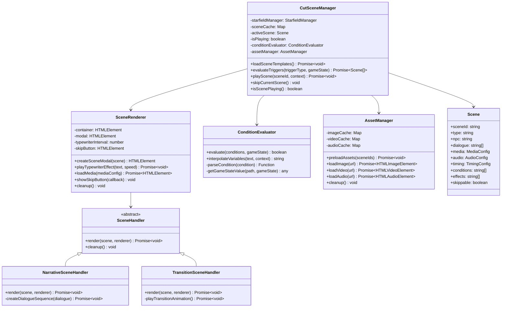

---

## Scene Types

The Cut Scene System supports four distinct scene types, each designed for specific narrative and gameplay purposes:

### Narrative Scenes
- **Purpose**: Story delivery and character development
- **Characteristics**: 
  - NPC dialogue with portraits and voice acting
  - Mission briefings and plot advancement
  - Character backstory reveals
  - Interactive choice systems
- **Duration**: 15-60 seconds typical
- **Skippable**: Usually yes, with story-critical exceptions
- **Examples**: Mission briefings, character introductions, plot reveals

### Transition Scenes
- **Purpose**: Smooth gameplay state changes
- **Characteristics**:
  - System animations (warp jumps, docking sequences)
  - Full-screen overlays with progress indicators
  - Automated system communications
  - Game state modifications (location changes, resource consumption)
- **Duration**: 5-15 seconds typical
- **Skippable**: Usually no (critical system operations)
- **Examples**: Warp jumps, docking procedures, system startup sequences

### Annotation Scenes
- **Purpose**: Contextual information and warnings
- **Characteristics**:
  - Overlay-style presentation (doesn't interrupt gameplay)
  - Environmental alerts and navigation warnings
  - Tutorial hints and system notifications
  - Auto-dismissal with manual override options
- **Duration**: 3-8 seconds typical
- **Skippable**: Always yes
- **Examples**: Asteroid field warnings, tutorial tips, system alerts

### Branching Scenes
- **Purpose**: Player choice and consequence systems
- **Characteristics**:
  - Multiple dialogue/action options
  - Skill requirement validation
  - Timed decision making
  - Consequence tracking and state changes
- **Duration**: 30-90 seconds (including decision time)
- **Skippable**: No (player input required)
- **Examples**: Diplomatic encounters, moral choices, faction decisions

### Scene Type Selection Logic

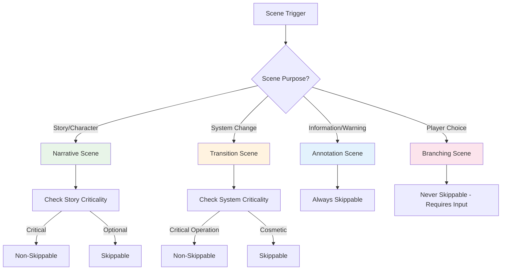

---

## UI Flow Sequences

### Complete Flow Diagram
```
Space Gameplay
    ↓
Initiate Docking
    ↓
Docking Scene (mandatory)
    ↓
[Cargo Security Scan Scene] → [Security Scan Result]
    ↓
[Cargo Delivery Scene] OR [Station Landing Scene]
    ↓
Station Menu
    ↓
Select Station Service
    ↓
[Station Service Scene] OR [Special Service Scene]
    ↓
Return to Station Menu
    ↓
Initiate Launch
    ↓
[Station Launch Scene] OR [Special Launch Scene]
    ↓
[Special Post Launch Scene]
    ↓
Space Gameplay
```

### Sequence Diagram: Docking with Cargo Flow

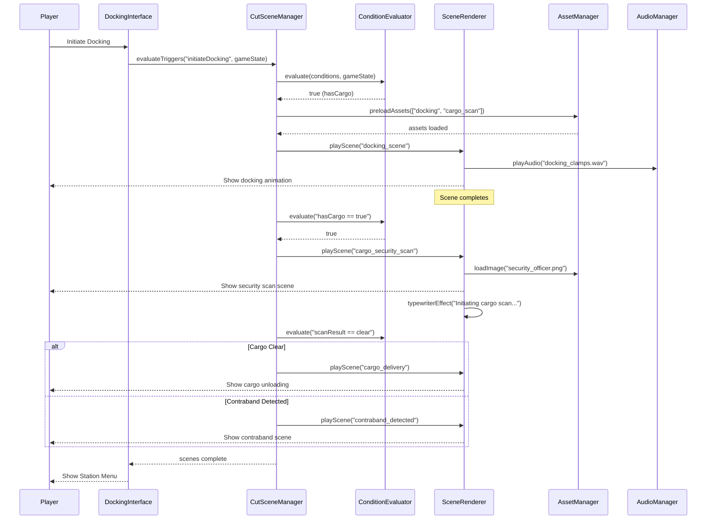

### State Transition Diagram

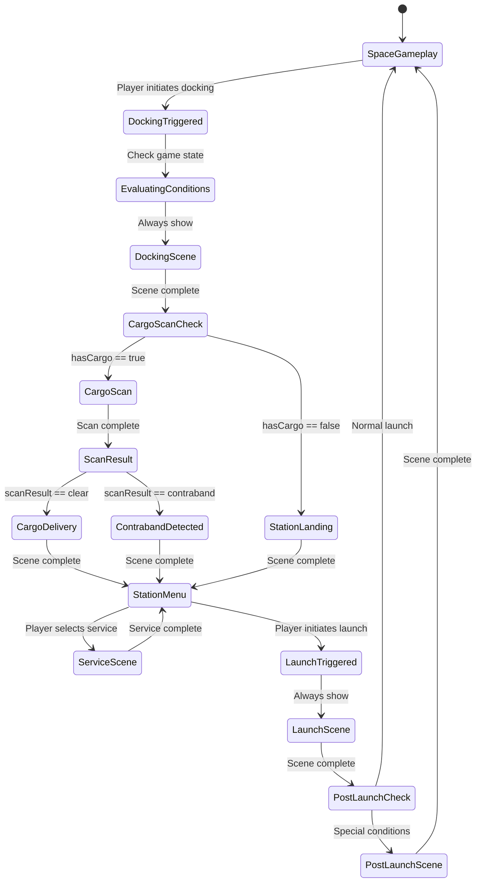

### Flow Branching Logic
- **Conditional Scenes**: Marked with `[]` are optional based on game state
- **Branching Factors**:
  - Cargo presence and type
  - Player reputation with station faction
  - Mission progress and flags
  - Random event triggers (configurable probability)
  - Special event conditions (emergencies, story beats)

### Duration Guidelines
- **Transition Scenes**: 3-10 seconds (docking, launch animations)
- **Narrative Scenes**: 10-30 seconds (dialogue, story content)
- **Critical Story Scenes**: Up to 60 seconds (major plot points, non-skippable)

UI Position
All cut scene UI elements are centered horizontally and vertically on the screen to ensure focus and compatibility with various resolutions (e.g., 1920x1080, 4K).

Optional Overlay mode: Scenes appear as a semi-transparent overlay on top of blurred gameplay background, or full-screen for high-immersion moments. (Post-MVP)

Safe Area Margins: Maintain 5-10% padding from screen edges to accommodate different aspect ratios (e.g., 16:9, 21:9).

UI Layout Structure
The layout is a fixed-size dialog box that scales responsively. 

┌─────────────────────────────────────┐
│ NPC NAME                     [SKIP] │  ← Top bar: NPC name left-aligned, [SKIP] button right-aligned (visible only if skippable).
├─────────────────────────────────────┤
│ [Picture/Video]                     │  ← Media area: 400x300 pixels (scalable). Supports static images (PNG/JPG), GIF animations, or short MP4 videos (looped or one-shot). Centered; optional frame with wireframe border.
│  400x300                            │
│ wireframe                           │
├─────────────────────────────────────┤
│ Subtitled dialog text appears here  │  ← Text area: Multi-line text with typewriter effect (characters appear one-by-one at 50-100 chars/sec). Supports bold/italic formatting. Auto-wraps; scrolls if too long. Font: Monospace sci-fi style.
│ with typewriter effect animation... │
└─────────────────────────────────────┘

Input Handling: 
During scenes, gameplay inputs are paused except for skip (if allowed).

Scene Types:
Narrative Scenes: Story-focused with dialogue (e.g., NPC explaining a quest).
Transition Scenes: Visual-only animations (e.g., docking/launch).
Event Annotation Scenes: Short pop-ups for in-world events (e.g., "Asteroid field detected" with a quick scan visual).
Branching Scenes: Multiple outcomes based on player choices (e.g., dialogue trees in special services). [post-mvp]

Triggers and Events
Triggers: Player-initiated: Docking, launching, service selection.
State-based: Cargo presence, reputation thresholds, random chance (e.g., 20% for special events).

Assets Required
Visuals: 
NPC portraits (PNG), background images/videos (MP4, <10MB each), wireframe UI textures.

Audio: 
Voice lines (WAV/MP3), sound effects (e.g., typing SFX), ambient music tracks.

Scripts: JSON files for scene definitions (e.g., { "npc": "Captain Zeta", "dialogue": ["Line 1", "Line 2"], "skippable": true }).


## JSON Template System

### Schema Overview

Scenes are defined via JSON files that can be loaded per station or event. Each JSON represents either a single scene or a sequence (an array of scenes with optional conditions). The structure supports branching and optionality based on game state variables.

### JSON Schema Validation

```json
{
  "$schema": "http://json-schema.org/draft-07/schema#",
  "title": "Cut Scene Template Schema",
  "type": "object",
  "properties": {
    "sceneId": {
      "type": "string",
      "pattern": "^[a-z0-9_]+$",
      "description": "Unique identifier for the scene"
    },
    "type": {
      "type": "string",
      "enum": ["narrative", "transition", "annotation", "branching"],
      "description": "Scene category type"
    },
    "priority": {
      "type": "integer",
      "minimum": 1,
      "maximum": 10,
      "default": 5,
      "description": "Scene priority for conflict resolution"
    }
  },
  "required": ["sceneId", "type"]
}
```

### Generic Scene Template

This is the base structure for any individual scene. All fields are optional unless marked required.

```json
{
  "sceneId": "unique_scene_id",
  "type": "narrative",
  "priority": 5,
  "npc": {
    "name": "Captain Rodriguez",
    "title": "Station Commander",
    "faction": "terran_republic_alliance",
    "portrait": "assets/images/npcs/rodriguez_portrait.png"
  },
  "dialogue": [
    {
      "text": "Welcome to {stationName}, Commander.",
      "duration": 3000,
      "voice": "assets/audio/voices/rodriguez_welcome.mp3"
    },
    {
      "text": "Your cargo manifest shows {cargoCount} units of {cargoType}.",
      "duration": 4000,
      "voice": "assets/audio/voices/rodriguez_cargo_check.mp3"
    }
  ],
  "media": {
    "type": "image",
    "url": "assets/images/backgrounds/station_docking_bay.png",
    "overlay": "assets/images/overlays/cargo_scanner.png",
    "loop": false,
    "autoplay": true,
    "fallback": "assets/images/fallbacks/generic_station.png"
  },
  "audio": {
    "voice": {
      "enabled": true,
      "volume": 0.8,
      "fadeIn": 500,
      "fadeOut": 500
    },
    "bgm": {
      "url": "assets/audio/music/station_ambient.ogg",
      "volume": 0.3,
      "loop": true,
      "fadeIn": 1000
    },
    "sfx": [
      {
        "url": "assets/audio/sfx/docking_clamps.wav",
        "trigger": "scene_start",
        "volume": 0.6
      },
      {
        "url": "assets/audio/sfx/scanner_beep.wav",
        "trigger": "dialogue_2",
        "volume": 0.4
      }
    ]
  },
  "timing": {
    "typewriterSpeed": 50,
    "pauseBetweenLines": 1500,
    "autoAdvance": false,
    "minDisplayTime": 3000,
    "maxDisplayTime": 30000
  },
  "conditions": {
    "required": [
      "hasCargo == true",
      "playerLevel >= 3",
      "faction.terran_republic_alliance >= 0"
    ],
    "optional": [
      "randomChance <= 0.7",
      "timeOfDay == 'day'"
    ],
    "mutuallyExclusive": [
      "hasContraband == false"
    ]
  },
  "branches": {
    "condition": "scanResult == 'clear'",
    "operator": "AND",
    "trueScene": "cargo_delivery_approved",
    "falseScene": "cargo_inspection_required",
    "defaultScene": "generic_docking_complete"
  },
  "effects": [
    {
      "type": "updateQuest",
      "questId": "cargo_delivery_001",
      "action": "advance_objective",
      "objectiveId": "dock_at_station"
    },
    {
      "type": "addCredits",
      "amount": 500,
      "reason": "docking_fee_waived"
    },
    {
      "type": "updateReputation",
      "faction": "terran_republic_alliance",
      "delta": 5,
      "reason": "successful_cargo_delivery"
    },
    {
      "type": "setFlag",
      "flag": "visited_europa_station",
      "value": true,
      "persistent": true
    }
  ],
  "skippable": true,
  "skipConditions": {
    "allowSkip": true,
    "skipKey": "Escape",
    "skipAfterTime": 5000,
    "preserveEffects": true
  },
  "accessibility": {
    "subtitles": true,
    "highContrast": false,
    "reducedMotion": false,
    "screenReader": "Station Commander Rodriguez welcomes you to the station"
  },
  "metadata": {
    "version": "1.0",
    "author": "Content Team",
    "lastModified": "2024-01-15T10:30:00Z",
    "tags": ["docking", "cargo", "terran_republic"],
    "testStatus": "validated"
  }
}

### Sequence Template: Docking with Cargo Scan

This JSON defines a complete sequence for cargo docking flow with conditional branching.

```json
{
  "sequenceId": "docking_with_cargo",
  "version": "1.2",
  "trigger": {
    "event": "initiateDocking",
    "source": "DockingInterface",
    "priority": 8
  },
  "conditions": {
    "required": ["hasCargo == true"],
    "optional": ["stationSecurity >= 'medium'"]
  },
  "fallbackSequence": "docking_no_cargo",
  "scenes": [
    {
      "sceneId": "docking_approach",
      "type": "transition",
      "duration": 8000,
      "dialogue": [
        {
          "text": "Docking clamps engaged. Welcome to {stationName}.",
          "duration": 3000
        },
        {
          "text": "Please standby for cargo inspection.",
          "duration": 2000
        }
      ],
      "media": {
        "type": "video",
        "url": "assets/videos/docking_animation.mp4",
        "fallback": "assets/images/docking_static.png",
        "preload": true
      },
      "audio": {
        "sfx": [
          {
            "url": "assets/audio/sfx/docking_clamps.wav",
            "trigger": "scene_start",
            "volume": 0.7
          }
        ]
      },
      "skippable": false,
      "skipReason": "Critical system animation"
    },
    {
      "sceneId": "cargo_security_scan",
      "type": "narrative",
      "npc": {
        "name": "Officer Chen",
        "title": "Security Chief",
        "faction": "station_security",
        "portrait": "assets/images/npcs/security_officer_chen.png"
      },
      "dialogue": [
        {
          "text": "Initiating cargo scan protocol...",
          "duration": 3000,
          "voice": "assets/audio/voices/chen_scan_init.mp3"
        },
        {
          "text": "Scanning {cargoCount} units of {cargoType}.",
          "duration": 4000,
          "voice": "assets/audio/voices/chen_scan_progress.mp3"
        }
      ],
      "media": {
        "type": "image",
        "url": "assets/images/backgrounds/security_checkpoint.png",
        "overlay": "assets/images/overlays/scanning_effect.png"
      },
      "audio": {
        "bgm": {
          "url": "assets/audio/music/tension_low.ogg",
          "volume": 0.4,
          "fadeIn": 1000
        },
        "sfx": [
          {
            "url": "assets/audio/sfx/scanner_hum.wav",
            "trigger": "dialogue_1",
            "volume": 0.5,
            "loop": true
          }
        ]
      },
      "effects": [
        {
          "type": "performScan",
          "target": "cargo",
          "scanType": "contraband",
          "delay": 2000
        }
      ],
      "skippable": true,
      "timing": {
        "minDisplayTime": 5000
      }
    },
    {
      "sceneId": "security_scan_result",
      "type": "branching",
      "npc": {
        "name": "Officer Chen",
        "title": "Security Chief"
      },
      "dialogue": [
        {
          "text": "Scan complete. Processing results...",
          "duration": 2000
        }
      ],
      "branches": {
        "condition": "scanResult == 'clear'",
        "operator": "AND",
        "trueScene": "cargo_delivery_approved",
        "falseScene": "contraband_detected",
        "defaultScene": "scan_inconclusive",
        "timeout": 5000
      },
      "media": {
        "type": "image",
        "url": "assets/images/backgrounds/security_checkpoint.png"
      },
      "skippable": false,
      "skipReason": "Branching logic required"
    },
    {
      "sceneId": "cargo_delivery_approved",
      "type": "narrative",
      "npc": {
        "name": "Dock Worker Martinez",
        "title": "Cargo Supervisor",
        "faction": "dock_workers_union",
        "portrait": "assets/images/npcs/dock_worker_martinez.png"
      },
      "dialogue": [
        {
          "text": "Cargo cleared for unloading. Nice work, Commander.",
          "duration": 3000,
          "voice": "assets/audio/voices/martinez_approval.mp3"
        },
        {
          "text": "You've earned {rewardCredits} credits for this delivery.",
          "duration": 3000,
          "voice": "assets/audio/voices/martinez_payment.mp3"
        }
      ],
      "media": {
        "type": "animation",
        "url": "assets/animations/cargo_unload_success.gif",
        "fallback": "assets/images/cargo_unload_static.png",
        "loop": false
      },
      "audio": {
        "bgm": {
          "url": "assets/audio/music/success_theme.ogg",
          "volume": 0.6,
          "fadeIn": 500
        },
        "sfx": [
          {
            "url": "assets/audio/sfx/cargo_unload.wav",
            "trigger": "scene_start",
            "volume": 0.8
          },
          {
            "url": "assets/audio/sfx/credits_received.wav",
            "trigger": "dialogue_2",
            "volume": 0.6
          }
        ]
      },
      "effects": [
        {
          "type": "addCredits",
          "amount": "{rewardCredits}",
          "reason": "cargo_delivery_bonus"
        },
        {
          "type": "removeCargo",
          "cargoType": "{cargoType}",
          "amount": "{cargoCount}"
        },
        {
          "type": "updateReputation",
          "faction": "dock_workers_union",
          "delta": 10
        },
        {
          "type": "completeObjective",
          "missionId": "{activeMissionId}",
          "objectiveId": "deliver_cargo"
        }
      ],
      "skippable": true,
      "timing": {
        "minDisplayTime": 6000
      }
    }
  ],
  "metadata": {
    "version": "1.2",
    "author": "Content Team",
    "lastModified": "2024-01-15T14:30:00Z",
    "tags": ["docking", "cargo", "security", "delivery"],
    "testStatus": "validated",
    "estimatedDuration": 25000
  }
}
```

### Condition Syntax Reference

#### Supported Operators
```javascript
// Comparison operators
"playerLevel >= 5"           // Greater than or equal
"credits < 1000"             // Less than
"reputation == 'friendly'"   // Equality
"faction != 'hostile'"       // Inequality
"cargo > 0"                  // Greater than
"fuel <= 50"                 // Less than or equal

// Logical operators
"hasCargo == true AND playerLevel >= 3"     // AND operation
"isVIP == true OR credits >= 10000"         // OR operation
"NOT hasContraband"                         // NOT operation
"(credits >= 1000) AND (reputation > 0)"    // Parentheses for grouping

// String operations
"stationName CONTAINS 'Research'"           // String contains
"playerName STARTS_WITH 'Commander'"       // String starts with
"missionType ENDS_WITH '_delivery'"        // String ends with
"faction MATCHES '^terran_.*'"             // Regular expression

// Array operations
"visitedStations INCLUDES 'europa_station'" // Array includes value
"cargo.types LENGTH >= 3"                   // Array length
"missions EMPTY"                            // Array is empty
"inventory NOT_EMPTY"                       // Array is not empty

// Time-based conditions
"gameTime BETWEEN '08:00' AND '18:00'"     // Time range
"lastVisit OLDER_THAN '24h'"               // Time elapsed
"missionDeadline WITHIN '2h'"              // Time remaining

// Random conditions
"randomChance <= 0.3"                      // 30% probability
"randomInt(1,6) == 4"                      // Dice roll
"randomChoice(['a','b','c']) == 'b'"       // Random selection

// Complex nested conditions
"player.ship.cargo.medical_supplies >= mission.requirements.cargo.medical_supplies"
"stations[currentStation].security.level >= 'medium'"
"factions[player.primaryFaction].reputation >= 50"
```

#### Variable Interpolation
```javascript
// Game state variables
"{playerName}"              // Player's name
"{stationName}"             // Current station name
"{credits}"                 // Player's credits
"{cargoCount}"              // Total cargo units
"{cargoType}"               // Primary cargo type
"{missionTitle}"            // Active mission title
"{faction.reputation}"      // Faction reputation
"{ship.hull.percentage}"    // Ship hull percentage

// Mission-specific variables
"{mission.reward}"          // Mission reward amount
"{mission.deadline}"        // Mission deadline
"{mission.giver.name}"      // Mission giver name
"{objective.progress}"      // Objective completion percentage

// Station-specific variables
"{station.commander.name}"  // Station commander
"{station.services[]}"      // Available services
"{station.security.level}"  // Security level
"{station.faction}"         // Controlling faction

// Time and date variables
"{currentTime}"             // Current game time
"{currentDate}"             // Current game date
"{timeUntilDeadline}"       // Time until mission deadline
"{daysSinceLastVisit}"      // Days since last station visit

// Formatting options
"{credits:currency}"        // Format as currency: "1,500 CR"
"{timeRemaining:duration}"  // Format as duration: "2h 30m"
"{reputation:percentage}"   // Format as percentage: "75%"
"{distance:units}"          // Format with units: "15.2 km"
```

### Scene Type Examples

#### Narrative Scene Template
```json
{
  "sceneId": "mission_briefing_001",
  "type": "narrative",
  "priority": 7,
  "npc": {
    "name": "Admiral Sarah Chen",
    "title": "Fleet Commander",
    "faction": "terran_republic_alliance",
    "portrait": "assets/images/npcs/admiral_chen.png",
    "mood": "serious"
  },
  "dialogue": [
    {
      "text": "Commander {playerName}, we have a situation.",
      "duration": 3000,
      "voice": "assets/audio/voices/chen_urgent_01.mp3",
      "emotion": "urgent"
    },
    {
      "text": "Intelligence reports hostile activity near {targetSystem}.",
      "duration": 4000,
      "voice": "assets/audio/voices/chen_briefing_02.mp3",
      "emotion": "concerned"
    },
    {
      "text": "Your mission is to investigate and report back. Payment: {missionReward:currency}.",
      "duration": 5000,
      "voice": "assets/audio/voices/chen_mission_details.mp3",
      "emotion": "authoritative"
    }
  ],
  "media": {
    "type": "image",
    "url": "assets/images/backgrounds/fleet_command_center.png",
    "overlay": "assets/images/overlays/holographic_display.png",
    "effects": ["subtle_glow", "data_streams"]
  },
  "conditions": {
    "required": [
      "playerLevel >= 5",
      "faction.terran_republic_alliance >= 25",
      "NOT hasActiveMission('investigation')"
    ]
  },
  "effects": [
    {
      "type": "acceptMission",
      "missionId": "investigation_hostile_activity_001",
      "autoAccept": false
    }
  ]
}
```

#### Transition Scene Template
```json
{
  "sceneId": "warp_jump_sequence",
  "type": "transition",
  "priority": 9,
  "duration": 12000,
  "dialogue": [
    {
      "text": "Warp drive charging... Stand by.",
      "duration": 3000,
      "source": "ship_ai"
    },
    {
      "text": "Warp jump initiated. Destination: {targetSystem}.",
      "duration": 2000,
      "source": "ship_ai"
    }
  ],
  "media": {
    "type": "video",
    "url": "assets/videos/warp_jump_sequence.mp4",
    "fallback": "assets/images/warp_jump_static.png",
    "fullscreen": true,
    "preload": true
  },
  "audio": {
    "sfx": [
      {
        "url": "assets/audio/sfx/warp_charge.wav",
        "trigger": "scene_start",
        "volume": 0.8,
        "fadeIn": 1000
      },
      {
        "url": "assets/audio/sfx/warp_jump.wav",
        "trigger": "5000ms",
        "volume": 1.0
      }
    ],
    "bgm": {
      "url": "assets/audio/music/warp_ambient.ogg",
      "volume": 0.4,
      "fadeIn": 2000,
      "fadeOut": 2000
    }
  },
  "skippable": false,
  "skipReason": "Critical system transition",
  "conditions": {
    "required": ["warpDrive.charged == true"]
  },
  "effects": [
    {
      "type": "changeLocation",
      "destination": "{targetSystem}",
      "method": "warp"
    },
    {
      "type": "consumeFuel",
      "amount": "{warpDistance * fuelConsumptionRate}"
    }
  ]
}
```

#### Annotation Scene Template
```json
{
  "sceneId": "asteroid_field_warning",
  "type": "annotation",
  "priority": 6,
  "duration": 8000,
  "dialogue": [
    {
      "text": "WARNING: Asteroid field detected ahead.",
      "duration": 3000,
      "source": "navigation_system",
      "urgency": "high"
    },
    {
      "text": "Recommend reducing speed and activating shields.",
      "duration": 3000,
      "source": "navigation_system",
      "urgency": "medium"
    }
  ],
  "media": {
    "type": "overlay",
    "url": "assets/images/overlays/warning_display.png",
    "position": "top_center",
    "animation": "pulse"
  },
  "audio": {
    "sfx": [
      {
        "url": "assets/audio/sfx/warning_beep.wav",
        "trigger": "scene_start",
        "volume": 0.7,
        "repeat": 3
      }
    ]
  },
  "conditions": {
    "required": [
      "currentSector CONTAINS 'asteroid'",
      "ship.speed > safeSpeed"
    ]
  },
  "effects": [
    {
      "type": "setFlag",
      "flag": "asteroid_warning_shown",
      "value": true,
      "duration": "5m"
    }
  ],
  "skippable": true,
  "autoAdvance": true
}
```

#### Branching Scene Template
```json
{
  "sceneId": "diplomatic_choice",
  "type": "branching",
  "priority": 8,
  "npc": {
    "name": "Ambassador Vex",
    "title": "Alien Diplomat",
    "faction": "zephyrian_collective",
    "portrait": "assets/images/npcs/ambassador_vex.png"
  },
  "dialogue": [
    {
      "text": "Human commander, your species stands at a crossroads.",
      "duration": 4000,
      "voice": "assets/audio/voices/vex_diplomatic_01.mp3"
    },
    {
      "text": "Will you choose cooperation or confrontation?",
      "duration": 3000,
      "voice": "assets/audio/voices/vex_choice_prompt.mp3"
    }
  ],
  "branches": {
    "type": "player_choice",
    "timeout": 30000,
    "choices": [
      {
        "id": "cooperation",
        "text": "We seek peaceful cooperation.",
        "hotkey": "1",
        "nextScene": "diplomatic_success",
        "requirements": ["diplomacy >= 3"],
        "effects": [
          {
            "type": "updateReputation",
            "faction": "zephyrian_collective",
            "delta": 25
          }
        ]
      },
      {
        "id": "confrontation",
        "text": "We will not be intimidated.",
        "hotkey": "2",
        "nextScene": "diplomatic_tension",
        "requirements": ["military >= 3"],
        "effects": [
          {
            "type": "updateReputation",
            "faction": "zephyrian_collective",
            "delta": -15
          }
        ]
      },
      {
        "id": "neutral",
        "text": "We need time to consider.",
        "hotkey": "3",
        "nextScene": "diplomatic_postponed",
        "requirements": [],
        "effects": [
          {
            "type": "setFlag",
            "flag": "diplomatic_meeting_postponed",
            "value": true
          }
        ]
      }
    ],
    "defaultChoice": "neutral",
    "showTimer": true
  },
  "conditions": {
    "required": [
      "hasMetFaction('zephyrian_collective')",
      "diplomaticStatus != 'hostile'"
    ]
  },
  "skippable": false,
  "skipReason": "Player choice required"
}
```

### Basic Docking without Cargo (Landing Scene)
For a flow without cargo: Docking → Station's Landing Scene → Station Menu.

```json

{
  "sequenceId": "docking_no_cargo",
  "trigger": "initiateDocking",
  "condition": "hasCargo == false",
  "scenes": [
    {
      "sceneId": "docking_scene",
      "type": "transition",
      "dialogue": ["Docking sequence initiated."],
      "media": {"type": "video", "url": "assets/videos/docking_animation.mp4"},
      "skippable": false
    },
    {
      "sceneId": "stations_landing_scene",
      "type": "narrative",
      "npc": "Station AI",
      "dialogue": ["Welcome to {stationName}.", "Please proceed to the menu for services."],
      "media": {"type": "image", "url": "assets/images/station_welcome.png"},
      "skippable": true
    }
  ]
}

### Station Service Selection
Triggered from Station Menu: Select Service → [Station Service Scene or Special Service Scene] → Back to Menu.

json

{
  "sequenceId": "station_service",
  "trigger": "selectService",
  "scenes": [
    {
      "sceneId": "station_service_scene",
      "type": "transition",
      "condition": "serviceType == standard",
      "dialogue": ["Service activated.", "Refueling in progress."],
      "media": {"type": "animation", "url": "assets/animations/refuel.gif"},
      "skippable": true,
      "effects": ["refuelShip:full"]
    },
    {
      "sceneId": "special_service_scene",
      "type": "narrative",
      "condition": "serviceType == special",
      "npc": "Black Market Dealer",
      "dialogue": ["Looking for something off the books?", "Deal complete – don't ask questions."],
      "media": {"type": "image", "url": "assets/images/shady_dealer.png"},
      "skippable": false,  // Made non-skippable for story importance.
      "effects": ["addItem:contraband,1", "updateReputation:-10"]
    }
  ]
}

### Launch with Special Post-Launch
For launch flow: Initiate Launch → Special Launch Scene → Special Post Launch Scene → Space Gameplay.

json

{
  "sequenceId": "launch_special",
  "trigger": "initiateLaunch",
  "condition": "eventFlag == emergency",
  "scenes": [
    {
      "sceneId": "special_launch_scene",
      "type": "transition",
      "dialogue": ["Emergency launch protocol!", "Evacuating station now."],
      "media": {"type": "video", "url": "assets/videos/emergency_launch.mp4"},
      "skippable": false
    },
    {
      "sceneId": "special_post_launch_scene",
      "type": "annotation",
      "dialogue": ["Systems stabilizing.", "Incoming transmission: {message}"],
      "media": {"type": "image", "url": "assets/images/distress_signal.png"},
      "skippable": true,
      "effects": ["triggerQuest:newMission"]
    }
  ]
}

### Standard Launch without Specials
For basic launch: Initiate Launch → Station's Launch Scene → Space Gameplay.

json

{
  "sequenceId": "launch_standard",
  "trigger": "initiateLaunch",
  "condition": "eventFlag == none",
  "scenes": [
    {
      "sceneId": "stations_launch_scene",
      "type": "transition",
      "dialogue": ["Launch sequence complete.", "Safe travels."],
      "media": {"type": "video", "url": "assets/videos/standard_launch.mp4"},
      "skippable": true
    }
  ]
}

These templates can be combined or referenced in a master flow JSON for complex interactions. For example, the game engine loads the appropriate sequence based on triggers and conditions, queuing scenes in order.

---

## Implementation Plan

### Implementation Timeline

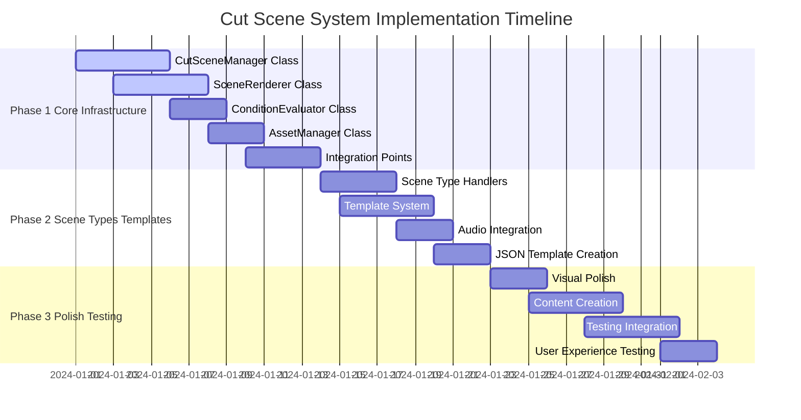

### Component Deployment Diagram

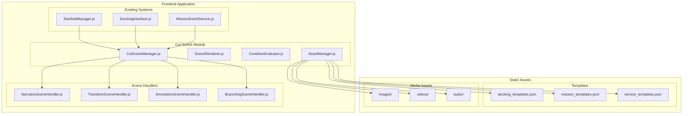

### Phase 1: Core Infrastructure (Week 1-2)

#### 1.1 CutSceneManager Class
```javascript
// frontend/static/js/cutscenes/CutSceneManager.js
export class CutSceneManager {
    constructor(starfieldManager) {
        this.starfieldManager = starfieldManager;
        this.sceneCache = new Map();
        this.activeScene = null;
        this.isPlaying = false;
        this.conditionEvaluator = new ConditionEvaluator();
        this.assetManager = new AssetManager();
    }
    
    async loadSceneTemplates() { /* Load JSON templates */ }
    evaluateTriggers(triggerType, gameState) { /* Check conditions */ }
    async playScene(sceneId, context = {}) { /* Execute scene */ }
    skipCurrentScene() { /* Handle skip functionality */ }
}
```

#### 1.2 SceneRenderer Class
```javascript
// frontend/static/js/cutscenes/SceneRenderer.js
export class SceneRenderer {
    constructor(container) {
        this.container = container;
        this.modal = null;
        this.typewriterInterval = null;
        this.skipButton = null;
    }
    
    createSceneModal(scene) { /* Create UI elements */ }
    playTypewriterEffect(text, speed) { /* Animate text */ }
    loadMedia(mediaConfig) { /* Handle images/videos */ }
    cleanup() { /* Remove modal and cleanup */ }
}
```

#### 1.3 Integration Points
- **DockingInterface**: Add cut scene triggers in `handleLaunch()` and docking completion
- **MissionEventService**: Add hooks for mission-related scenes
- **StarfieldManager**: Add cut scene state management

### Phase 2: Scene Types & Templates (Week 3)

#### 2.1 Scene Type Implementation
```javascript
// Scene type handlers
const SCENE_TYPES = {
    narrative: NarrativeSceneHandler,
    transition: TransitionSceneHandler,
    annotation: AnnotationSceneHandler,
    branching: BranchingSceneHandler
};
```

#### 2.2 Template System
- Create JSON templates for common scenarios
- Implement variable interpolation system
- Add condition evaluation logic
- Create fallback scenes for error cases

#### 2.3 Audio Integration
- Connect with existing `StarfieldAudioManager`
- Implement voice line synchronization
- Add background music control
- Create audio fade effects

### Phase 3: Polish & Testing (Week 4)

#### 3.1 Visual Polish
- Implement smooth animations and transitions
- Add visual effects (glows, particles)
- Optimize for different screen sizes
- Performance optimization

#### 3.2 Content Creation
- Create scene templates for all station types
- Develop mission-specific scenes
- Add emergency/special event scenes
- Create comprehensive fallback content

#### 3.3 Testing & Integration
- Unit tests for scene loading and playback
- Integration tests with existing systems
- Performance testing with multiple scenes
- User experience testing and refinement

---

## Integration Points

### Existing Systems Integration

#### DockingInterface Integration
```javascript
// In DockingInterface.js - handleLaunch() method
async handleLaunch() {
    // Trigger pre-launch cut scene
    await this.starfieldManager.cutSceneManager.evaluateTriggers('initiateLaunch', {
        stationKey: this.dockedLocation,
        playerStatus: this.getPlayerStatus()
    });
    
    // Existing launch logic...
    this.starfieldManager.undock();
    
    // Trigger post-launch cut scene
    await this.starfieldManager.cutSceneManager.evaluateTriggers('postLaunch', {
        launchedFrom: this.dockedLocation
    });
}
```

#### MissionEventService Integration
```javascript
// In MissionEventService.js - mission completion handling
async triggerMissionCompletionNotification(mission) {
    // Existing notification logic...
    
    // Trigger mission completion cut scene
    await window.starfieldManager.cutSceneManager.evaluateTriggers('missionCompleted', {
        mission: mission,
        location: this.getCurrentLocation()
    });
}
```

#### CommunicationHUD Coordination
```javascript
// Prevent conflicts between systems
if (this.starfieldManager.cutSceneManager.isPlaying) {
    // Defer communication HUD messages
    this.queueMessage(npcName, message, options);
    return;
}
```

### New System Dependencies

#### AssetManager
```javascript
export class AssetManager {
    constructor() {
        this.imageCache = new Map();
        this.videoCache = new Map();
        this.audioCache = new Map();
    }
    
    async preloadAssets(sceneIds) { /* Preload common assets */ }
    async loadImage(url) { /* Load and cache images */ }
    async loadVideo(url) { /* Load and cache videos */ }
    cleanup() { /* Memory management */ }
}
```

#### ConditionEvaluator
```javascript
export class ConditionEvaluator {
    evaluate(conditions, gameState) {
        // Parse and evaluate boolean logic
        // Support for: hasCargo, playerLevel >= 5, faction.reputation > 50
        // Return true/false for scene triggering
    }
    
    interpolateVariables(text, context) {
        // Replace {variable} placeholders with actual values
        // Support for: {stationName}, {playerName}, {credits}
    }
}
```

---

## Technical Specifications

### Data Flow Diagram

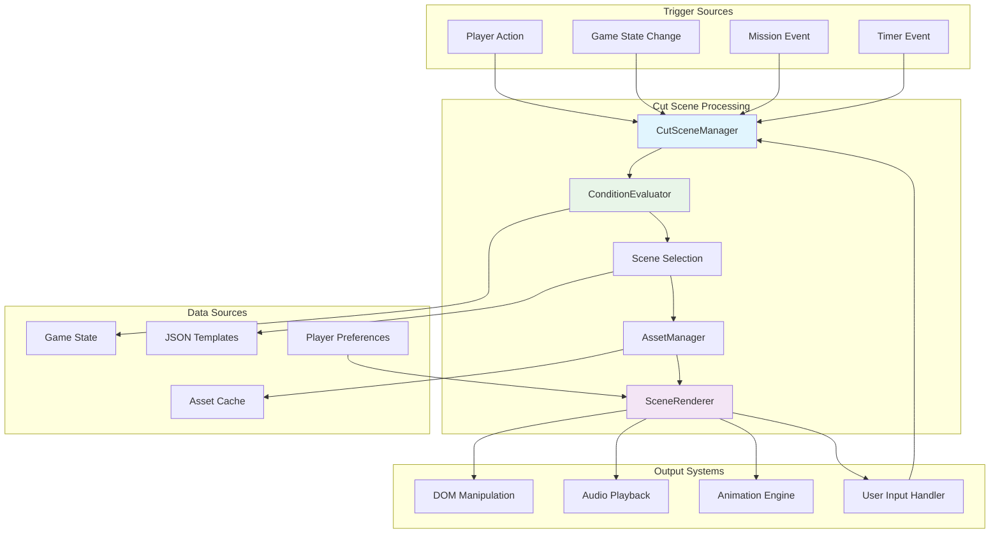

### Scene Lifecycle Diagram

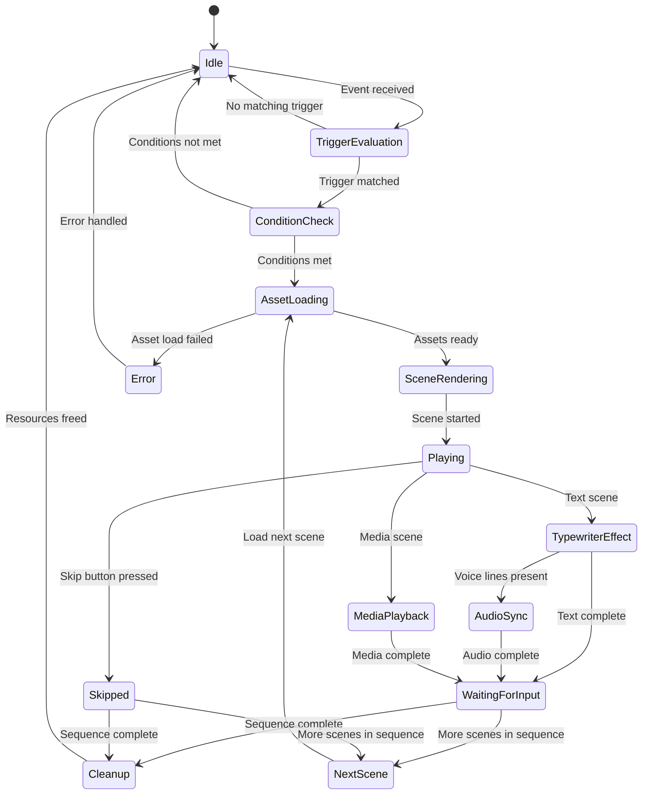

### File Structure
```
frontend/static/js/cutscenes/
├── CutSceneManager.js          # Main orchestrator
├── SceneRenderer.js            # UI rendering and animation
├── ConditionEvaluator.js       # Logic evaluation
├── AssetManager.js             # Media asset management
├── handlers/                   # Scene type handlers
│   ├── NarrativeSceneHandler.js
│   ├── TransitionSceneHandler.js
│   ├── AnnotationSceneHandler.js
│   └── BranchingSceneHandler.js
└── templates/                  # Scene template storage
    ├── docking/
    ├── launch/
    ├── missions/
    └── events/

frontend/static/assets/cutscenes/
├── images/                     # NPC portraits, backgrounds
├── videos/                     # Animation sequences
├── audio/                      # Voice lines, music, SFX
└── templates/                  # JSON scene definitions
    ├── stations/
    ├── missions/
    └── events/
```

### Performance Considerations
- **Asset Preloading**: Load common assets during game initialization
- **Memory Management**: Unload unused assets to prevent memory leaks
- **Render Optimization**: Use CSS transforms and GPU acceleration
- **Audio Streaming**: Stream longer audio files, cache short effects
- **Scene Caching**: Cache parsed scene templates in memory

### CSS Framework
```css
/* Cut scene modal styling */
.cutscene-modal {
    position: fixed;
    top: 0;
    left: 0;
    width: 100vw;
    height: 100vh;
    background: rgba(0, 0, 0, 0.9);
    display: flex;
    justify-content: center;
    align-items: center;
    z-index: 10000;
    font-family: 'VT323', monospace;
}

.cutscene-container {
    background: linear-gradient(135deg, #1a1a2e 0%, #16213e 100%);
    border: 2px solid #00ff41;
    border-radius: 8px;
    padding: 20px;
    max-width: 800px;
    width: 90%;
    box-shadow: 0 0 30px rgba(0, 255, 65, 0.3);
}

.cutscene-header {
    display: flex;
    justify-content: space-between;
    align-items: center;
    margin-bottom: 15px;
    color: #00ff41;
    font-size: 18px;
    text-transform: uppercase;
}

.cutscene-media {
    width: 100%;
    max-width: 400px;
    height: 300px;
    margin: 0 auto 15px;
    border: 1px solid #00ff41;
    background: rgba(0, 40, 0, 0.3);
}

.cutscene-dialogue {
    color: #ffffff;
    font-size: 16px;
    line-height: 1.5;
    text-shadow: 0 0 3px #00ff41;
    min-height: 60px;
    margin-bottom: 15px;
}

.cutscene-skip {
    background: rgba(0, 0, 0, 0.6);
    border: 1px solid #ffff44;
    color: #ffff44;
    padding: 8px 16px;
    border-radius: 4px;
    cursor: pointer;
    font-family: inherit;
    font-size: 14px;
}
```

---

## Error Handling & Recovery

### Error Types and Responses

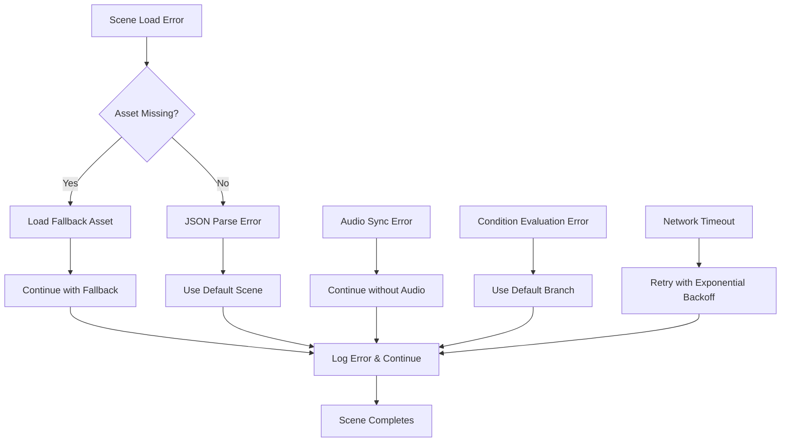

### Error Handling Strategies

#### Asset Loading Failures
```javascript
// Example error handling in AssetManager
async loadAsset(url, type, fallbackUrl = null) {
    try {
        const asset = await this.loadAssetWithTimeout(url, 5000);
        return asset;
    } catch (error) {
        console.warn(`Failed to load ${type} asset: ${url}`, error);
        
        if (fallbackUrl) {
            try {
                return await this.loadAssetWithTimeout(fallbackUrl, 3000);
            } catch (fallbackError) {
                console.error(`Fallback asset also failed: ${fallbackUrl}`, fallbackError);
                return this.getDefaultAsset(type);
            }
        }
        
        return this.getDefaultAsset(type);
    }
}
```

#### Scene Recovery Procedures
- **Graceful Degradation**: Continue with reduced functionality if non-critical assets fail
- **Fallback Scenes**: Always provide generic alternatives for custom scenes
- **State Preservation**: Maintain game state even if scenes fail to load
- **User Notification**: Inform players of technical issues without breaking immersion

#### Performance Monitoring
```javascript
// Performance metrics collection
class CutSceneMetrics {
    constructor() {
        this.metrics = {
            sceneLoadTimes: [],
            assetLoadFailures: 0,
            skipRates: new Map(),
            memoryUsage: [],
            renderFrameDrops: 0
        };
    }
    
    recordSceneLoad(sceneId, loadTime) {
        this.metrics.sceneLoadTimes.push({ sceneId, loadTime, timestamp: Date.now() });
        
        // Alert if load time exceeds threshold
        if (loadTime > 2000) {
            console.warn(`Slow scene load detected: ${sceneId} took ${loadTime}ms`);
        }
    }
}
```

---

## Security Considerations

### Content Validation
- **JSON Schema Validation**: All scene templates must pass schema validation before loading
- **Asset URL Sanitization**: Prevent loading of unauthorized external resources
- **Script Injection Prevention**: Sanitize all user-facing text content
- **File Size Limits**: Enforce maximum asset sizes to prevent memory exhaustion

### Access Control
```javascript
// Example security checks
class SecurityValidator {
    validateSceneTemplate(template) {
        // Check for malicious content
        if (this.containsSuspiciousContent(template)) {
            throw new SecurityError('Scene template contains suspicious content');
        }
        
        // Validate asset URLs are from allowed domains
        this.validateAssetUrls(template);
        
        // Check for excessive resource usage
        this.validateResourceLimits(template);
        
        return true;
    }
    
    validateAssetUrls(template) {
        const allowedDomains = ['assets/', 'static/', '/assets/'];
        // Implementation details...
    }
}
```

---

## Accessibility Compliance

### WCAG 2.1 AA Compliance

#### Visual Accessibility
- **High Contrast Mode**: Support for high contrast themes
- **Font Size Scaling**: Respect system font size preferences
- **Color Blind Support**: Avoid color-only information conveyance
- **Motion Sensitivity**: Provide reduced motion options

#### Audio Accessibility
- **Subtitles**: All dialogue must have subtitle support
- **Audio Descriptions**: Describe visual elements for screen readers
- **Volume Controls**: Individual volume controls for voice, music, and effects
- **Hearing Impaired Support**: Visual indicators for audio cues

#### Motor Accessibility
- **Keyboard Navigation**: Full keyboard support for all interactions
- **Customizable Controls**: Allow remapping of skip keys
- **Timing Adjustments**: Configurable scene durations
- **One-Hand Operation**: Support for single-handed input

#### Cognitive Accessibility
- **Clear Language**: Simple, direct dialogue
- **Consistent UI**: Predictable interface patterns
- **Progress Indicators**: Show scene progress and remaining time
- **Context Preservation**: Maintain game state context

### Implementation Example
```javascript
// Accessibility features in SceneRenderer
class AccessibleSceneRenderer extends SceneRenderer {
    constructor(options) {
        super(options);
        this.a11yOptions = {
            highContrast: options.highContrast || false,
            reducedMotion: options.reducedMotion || false,
            subtitlesEnabled: options.subtitles || true,
            fontSize: options.fontSize || 'medium'
        };
    }
    
    applyAccessibilitySettings(scene) {
        if (this.a11yOptions.highContrast) {
            this.applyHighContrastTheme();
        }
        
        if (this.a11yOptions.reducedMotion) {
            this.disableAnimations();
        }
        
        if (this.a11yOptions.subtitlesEnabled) {
            this.enableSubtitles(scene.dialogue);
        }
    }
}
```

---

## Performance Optimization

### Memory Management
- **Asset Pooling**: Reuse common assets across scenes
- **Garbage Collection**: Proper cleanup of DOM elements and event listeners
- **Memory Monitoring**: Track memory usage and implement cleanup thresholds
- **Lazy Loading**: Load assets just before they're needed

### Rendering Optimization
- **GPU Acceleration**: Use CSS transforms and will-change properties
- **Frame Rate Monitoring**: Detect and respond to performance issues
- **Batch DOM Updates**: Minimize layout thrashing
- **Efficient Animations**: Use requestAnimationFrame for smooth animations

### Network Optimization
- **Asset Compression**: Use compressed formats (WebP, OGG, MP4)
- **CDN Integration**: Serve assets from content delivery networks
- **Preloading Strategy**: Intelligent asset preloading based on player behavior
- **Offline Support**: Cache critical assets for offline play

### Performance Budgets
```javascript
// Performance monitoring and budgets
const PERFORMANCE_BUDGETS = {
    sceneLoadTime: 2000,      // Max 2 seconds to load a scene
    assetSize: 10 * 1024 * 1024, // Max 10MB per asset
    memoryUsage: 100 * 1024 * 1024, // Max 100MB total memory
    frameDropThreshold: 5      // Max 5 dropped frames per second
};
```

---

## Asset Requirements

### Visual Assets Specification
- **NPC Portraits**: 400x300px PNG with transparency, consistent art style
- **Background Images**: 1920x1080px for full-screen scenes, station-specific
- **Animation Videos**: MP4 format, H.264 codec, under 10MB each
- **UI Elements**: SVG format for scalability, retro sci-fi aesthetic

### Audio Assets Specification
- **Voice Lines**: 44.1kHz WAV/MP3, stereo, normalized levels
- **Background Music**: Looping OGG/MP3, ambient sci-fi themes
- **Sound Effects**: Short WAV files, UI feedback sounds

### Content Guidelines
- **Dialogue**: Concise, character-appropriate, lore-consistent
- **Timing**: Respect player's time, avoid lengthy exposition
- **Accessibility**: Subtitles for all audio, clear visual indicators

---

## Developer Tools & Debugging

### Cut Scene Development Console

```javascript
// Developer console for cut scene debugging
class CutSceneDevConsole {
    constructor(cutSceneManager) {
        this.manager = cutSceneManager;
        this.debugMode = false;
        this.logLevel = 'info';
        this.setupDevTools();
    }
    
    setupDevTools() {
        // Add global debug functions
        window.cutsceneDebug = {
            // Play any scene by ID
            playScene: (sceneId, context = {}) => {
                return this.manager.playScene(sceneId, context);
            },
            
            // List all available scenes
            listScenes: () => {
                return Array.from(this.manager.sceneCache.keys());
            },
            
            // Validate scene template
            validateScene: (sceneId) => {
                return this.validateSceneTemplate(sceneId);
            },
            
            // Show performance metrics
            getMetrics: () => {
                return this.manager.metrics.getReport();
            },
            
            // Toggle debug mode
            setDebugMode: (enabled) => {
                this.debugMode = enabled;
                this.updateDebugUI();
            },
            
            // Simulate game state for testing
            setTestState: (gameState) => {
                this.manager.testGameState = gameState;
            }
        };
    }
    
    createDebugPanel() {
        const panel = document.createElement('div');
        panel.id = 'cutscene-debug-panel';
        panel.innerHTML = `
            <div class="debug-header">
                <h3>Cut Scene Debug Console</h3>
                <button onclick="cutsceneDebug.togglePanel()">Toggle</button>
            </div>
            <div class="debug-content">
                <div class="debug-section">
                    <h4>Scene Testing</h4>
                    <select id="scene-selector"></select>
                    <button onclick="cutsceneDebug.playSelectedScene()">Play Scene</button>
                </div>
                <div class="debug-section">
                    <h4>Performance</h4>
                    <div id="performance-metrics"></div>
                </div>
                <div class="debug-section">
                    <h4>Asset Status</h4>
                    <div id="asset-status"></div>
                </div>
            </div>
        `;
        document.body.appendChild(panel);
    }
}
```

### Scene Validation Tools

```javascript
// Comprehensive scene validation
class SceneValidator {
    constructor() {
        this.validationRules = {
            required: ['sceneId', 'type'],
            sceneTypes: ['narrative', 'transition', 'annotation', 'branching'],
            maxDialogueLength: 200,
            maxSceneDuration: 60000,
            allowedAssetFormats: {
                image: ['.png', '.jpg', '.jpeg', '.webp'],
                video: ['.mp4', '.webm'],
                audio: ['.mp3', '.wav', '.ogg']
            }
        };
    }
    
    validateScene(scene) {
        const errors = [];
        const warnings = [];
        
        // Required field validation
        this.validationRules.required.forEach(field => {
            if (!scene[field]) {
                errors.push(`Missing required field: ${field}`);
            }
        });
        
        // Scene type validation
        if (scene.type && !this.validationRules.sceneTypes.includes(scene.type)) {
            errors.push(`Invalid scene type: ${scene.type}`);
        }
        
        // Dialogue validation
        if (scene.dialogue) {
            scene.dialogue.forEach((line, index) => {
                if (typeof line === 'string' && line.length > this.validationRules.maxDialogueLength) {
                    warnings.push(`Dialogue line ${index} exceeds recommended length`);
                }
            });
        }
        
        // Asset URL validation
        if (scene.media && scene.media.url) {
            if (!this.isValidAssetUrl(scene.media.url, scene.media.type)) {
                errors.push(`Invalid asset URL or format: ${scene.media.url}`);
            }
        }
        
        // Duration validation
        if (scene.duration && scene.duration > this.validationRules.maxSceneDuration) {
            warnings.push(`Scene duration exceeds recommended maximum: ${scene.duration}ms`);
        }
        
        return {
            valid: errors.length === 0,
            errors,
            warnings
        };
    }
    
    isValidAssetUrl(url, type) {
        const allowedFormats = this.validationRules.allowedAssetFormats[type] || [];
        return allowedFormats.some(format => url.toLowerCase().endsWith(format));
    }
}
```

### Live Scene Editor

```javascript
// In-browser scene editor for rapid prototyping
class LiveSceneEditor {
    constructor(cutSceneManager) {
        this.manager = cutSceneManager;
        this.currentScene = null;
        this.setupEditor();
    }
    
    setupEditor() {
        const editorHTML = `
            <div id="scene-editor" class="scene-editor">
                <div class="editor-toolbar">
                    <button onclick="sceneEditor.newScene()">New Scene</button>
                    <button onclick="sceneEditor.loadScene()">Load Scene</button>
                    <button onclick="sceneEditor.saveScene()">Save Scene</button>
                    <button onclick="sceneEditor.previewScene()">Preview</button>
                </div>
                <div class="editor-content">
                    <textarea id="scene-json" placeholder="Enter scene JSON here..."></textarea>
                </div>
                <div class="editor-preview">
                    <div id="validation-results"></div>
                </div>
            </div>
        `;
        
        // Add editor to page when in development mode
        if (window.location.hostname === 'localhost') {
            document.body.insertAdjacentHTML('beforeend', editorHTML);
        }
    }
    
    previewScene() {
        try {
            const sceneJson = document.getElementById('scene-json').value;
            const scene = JSON.parse(sceneJson);
            
            // Validate scene
            const validator = new SceneValidator();
            const validation = validator.validateScene(scene);
            
            this.displayValidationResults(validation);
            
            if (validation.valid) {
                // Play scene for preview
                this.manager.playScene(scene.sceneId, scene);
            }
        } catch (error) {
            this.displayValidationResults({
                valid: false,
                errors: [`JSON Parse Error: ${error.message}`],
                warnings: []
            });
        }
    }
}
```

---

## Localization & Internationalization

### Multi-Language Support

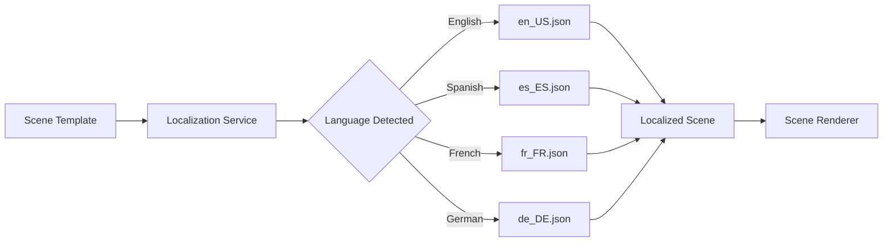

### Localization Architecture

```javascript
// Localization manager for cut scenes
class CutSceneLocalization {
    constructor() {
        this.currentLanguage = 'en_US';
        this.fallbackLanguage = 'en_US';
        this.translations = new Map();
        this.loadedLanguages = new Set();
    }
    
    async loadLanguage(languageCode) {
        if (this.loadedLanguages.has(languageCode)) {
            return;
        }
        
        try {
            const response = await fetch(`assets/localization/${languageCode}/cutscenes.json`);
            const translations = await response.json();
            this.translations.set(languageCode, translations);
            this.loadedLanguages.add(languageCode);
        } catch (error) {
            console.warn(`Failed to load language pack: ${languageCode}`, error);
        }
    }
    
    localizeScene(scene, languageCode = this.currentLanguage) {
        const translations = this.translations.get(languageCode) || 
                           this.translations.get(this.fallbackLanguage);
        
        if (!translations || !translations[scene.sceneId]) {
            return scene; // Return original if no translation found
        }
        
        const localizedScene = { ...scene };
        const sceneTranslation = translations[scene.sceneId];
        
        // Localize dialogue
        if (sceneTranslation.dialogue) {
            localizedScene.dialogue = sceneTranslation.dialogue;
        }
        
        // Localize NPC name and title
        if (sceneTranslation.npc) {
            localizedScene.npc = { ...localizedScene.npc, ...sceneTranslation.npc };
        }
        
        // Localize audio assets
        if (sceneTranslation.audio) {
            localizedScene.audio = this.localizeAudioAssets(localizedScene.audio, sceneTranslation.audio);
        }
        
        return localizedScene;
    }
    
    localizeAudioAssets(originalAudio, translatedAudio) {
        const localizedAudio = { ...originalAudio };
        
        // Replace voice lines with localized versions
        if (translatedAudio.voice) {
            localizedAudio.voice = translatedAudio.voice;
        }
        
        // Update dialogue-specific voice files
        if (originalAudio.sfx && translatedAudio.sfx) {
            localizedAudio.sfx = originalAudio.sfx.map((sfx, index) => {
                return translatedAudio.sfx[index] || sfx;
            });
        }
        
        return localizedAudio;
    }
}
```

### Localization File Structure

```json
{
  "language": "es_ES",
  "version": "1.0",
  "scenes": {
    "docking_approach": {
      "dialogue": [
        {
          "text": "Abrazaderas de atraque activadas. Bienvenido a {stationName}.",
          "voice": "assets/audio/voices/es/docking_welcome.mp3"
        },
        {
          "text": "Por favor, espere la inspección de carga.",
          "voice": "assets/audio/voices/es/cargo_inspection.mp3"
        }
      ],
      "npc": {
        "name": "Oficial Chen",
        "title": "Jefe de Seguridad"
      }
    },
    "cargo_security_scan": {
      "dialogue": [
        {
          "text": "Iniciando protocolo de escaneo de carga...",
          "voice": "assets/audio/voices/es/scan_init.mp3"
        }
      ]
    }
  }
}
```

---

## Content Management System

### Scene Content Pipeline

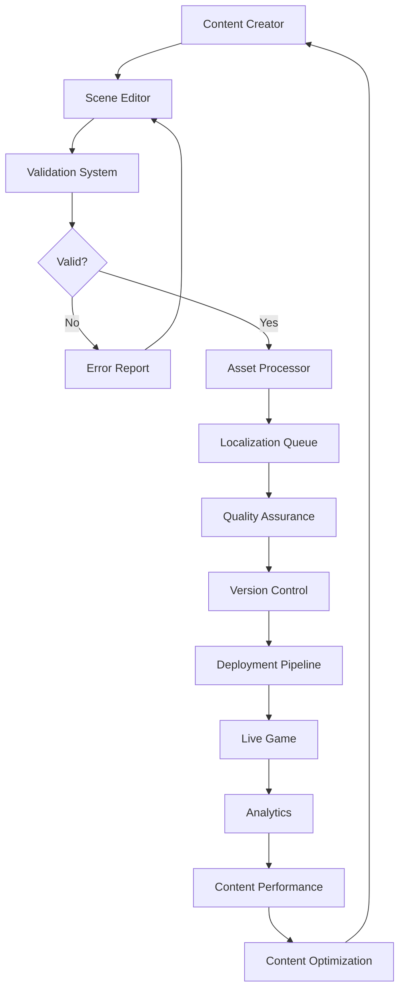

### Content Management Tools

```javascript
// Content management system for cut scenes
class CutSceneContentManager {
    constructor() {
        this.contentDatabase = new Map();
        this.versionHistory = new Map();
        this.publishingQueue = [];
        this.analyticsCollector = new ContentAnalytics();
    }
    
    async createScene(sceneData, authorId) {
        const sceneId = this.generateSceneId();
        const scene = {
            ...sceneData,
            sceneId,
            metadata: {
                author: authorId,
                created: new Date().toISOString(),
                version: '1.0',
                status: 'draft',
                tags: sceneData.tags || []
            }
        };
        
        // Validate scene
        const validator = new SceneValidator();
        const validation = validator.validateScene(scene);
        
        if (!validation.valid) {
            throw new Error(`Scene validation failed: ${validation.errors.join(', ')}`);
        }
        
        // Store in content database
        this.contentDatabase.set(sceneId, scene);
        this.versionHistory.set(sceneId, [scene]);
        
        return sceneId;
    }
    
    async updateScene(sceneId, updates, authorId) {
        const existingScene = this.contentDatabase.get(sceneId);
        if (!existingScene) {
            throw new Error(`Scene not found: ${sceneId}`);
        }
        
        const updatedScene = {
            ...existingScene,
            ...updates,
            metadata: {
                ...existingScene.metadata,
                lastModified: new Date().toISOString(),
                lastModifiedBy: authorId,
                version: this.incrementVersion(existingScene.metadata.version)
            }
        };
        
        // Add to version history
        const history = this.versionHistory.get(sceneId) || [];
        history.push(updatedScene);
        this.versionHistory.set(sceneId, history);
        
        // Update current version
        this.contentDatabase.set(sceneId, updatedScene);
        
        return updatedScene;
    }
    
    async publishScene(sceneId) {
        const scene = this.contentDatabase.get(sceneId);
        if (!scene) {
            throw new Error(`Scene not found: ${sceneId}`);
        }
        
        // Final validation before publishing
        const validator = new SceneValidator();
        const validation = validator.validateScene(scene);
        
        if (!validation.valid) {
            throw new Error(`Cannot publish invalid scene: ${validation.errors.join(', ')}`);
        }
        
        // Add to publishing queue
        this.publishingQueue.push({
            sceneId,
            scene,
            publishedAt: new Date().toISOString()
        });
        
        // Update status
        scene.metadata.status = 'published';
        
        return true;
    }
    
    getSceneAnalytics(sceneId) {
        return this.analyticsCollector.getSceneMetrics(sceneId);
    }
}
```

### Asset Processing Pipeline

```javascript
// Automated asset processing for cut scenes
class AssetProcessor {
    constructor() {
        this.processingQueue = [];
        this.supportedFormats = {
            image: ['png', 'jpg', 'jpeg'],
            video: ['mp4', 'webm'],
            audio: ['mp3', 'wav', 'ogg']
        };
    }
    
    async processAssets(scene) {
        const processedAssets = {};
        
        // Process media assets
        if (scene.media && scene.media.url) {
            processedAssets.media = await this.processMediaAsset(scene.media);
        }
        
        // Process audio assets
        if (scene.audio) {
            processedAssets.audio = await this.processAudioAssets(scene.audio);
        }
        
        // Process NPC portraits
        if (scene.npc && scene.npc.portrait) {
            processedAssets.npcPortrait = await this.processImageAsset(scene.npc.portrait);
        }
        
        return processedAssets;
    }
    
    async processImageAsset(imageUrl) {
        // Generate multiple formats and sizes
        const processed = {
            original: imageUrl,
            webp: await this.convertToWebP(imageUrl),
            thumbnail: await this.generateThumbnail(imageUrl),
            sizes: {
                small: await this.resizeImage(imageUrl, 200, 150),
                medium: await this.resizeImage(imageUrl, 400, 300),
                large: await this.resizeImage(imageUrl, 800, 600)
            }
        };
        
        return processed;
    }
    
    async processVideoAsset(videoUrl) {
        // Generate multiple formats and qualities
        const processed = {
            original: videoUrl,
            compressed: await this.compressVideo(videoUrl),
            poster: await this.generateVideoPoster(videoUrl),
            qualities: {
                low: await this.transcodeVideo(videoUrl, '480p'),
                medium: await this.transcodeVideo(videoUrl, '720p'),
                high: await this.transcodeVideo(videoUrl, '1080p')
            }
        };
        
        return processed;
    }
}
```

---

## Analytics & Telemetry

### Performance Analytics

```javascript
// Analytics system for cut scene performance and engagement
class CutSceneAnalytics {
    constructor() {
        this.events = [];
        this.sessionData = {
            sessionId: this.generateSessionId(),
            startTime: Date.now(),
            playerProfile: {}
        };
        this.metricsBuffer = [];
        this.batchSize = 50;
    }
    
    trackSceneStart(sceneId, context = {}) {
        this.recordEvent('scene_start', {
            sceneId,
            timestamp: Date.now(),
            context,
            loadTime: context.loadTime || 0,
            playerState: this.getPlayerState()
        });
    }
    
    trackSceneComplete(sceneId, duration, skipped = false) {
        this.recordEvent('scene_complete', {
            sceneId,
            duration,
            skipped,
            timestamp: Date.now(),
            completionRate: skipped ? 0 : 1
        });
    }
    
    trackSceneSkip(sceneId, skipTime, reason = 'user_action') {
        this.recordEvent('scene_skip', {
            sceneId,
            skipTime,
            reason,
            timestamp: Date.now(),
            engagementScore: this.calculateEngagementScore(skipTime)
        });
    }
    
    trackAssetLoadFailure(assetUrl, assetType, error) {
        this.recordEvent('asset_load_failure', {
            assetUrl,
            assetType,
            error: error.message,
            timestamp: Date.now()
        });
    }
    
    trackPerformanceMetric(metric, value) {
        this.recordEvent('performance_metric', {
            metric,
            value,
            timestamp: Date.now(),
            sessionId: this.sessionData.sessionId
        });
    }
    
    generateReport() {
        const report = {
            sessionSummary: this.generateSessionSummary(),
            sceneMetrics: this.generateSceneMetrics(),
            performanceMetrics: this.generatePerformanceMetrics(),
            errorAnalysis: this.generateErrorAnalysis(),
            recommendations: this.generateRecommendations()
        };
        
        return report;
    }
    
    generateSceneMetrics() {
        const sceneStats = new Map();
        
        this.events.forEach(event => {
            if (event.type === 'scene_start' || event.type === 'scene_complete') {
                const sceneId = event.data.sceneId;
                if (!sceneStats.has(sceneId)) {
                    sceneStats.set(sceneId, {
                        plays: 0,
                        completions: 0,
                        skips: 0,
                        totalDuration: 0,
                        averageLoadTime: 0
                    });
                }
                
                const stats = sceneStats.get(sceneId);
                
                if (event.type === 'scene_start') {
                    stats.plays++;
                    stats.averageLoadTime += event.data.loadTime || 0;
                }
                
                if (event.type === 'scene_complete') {
                    if (event.data.skipped) {
                        stats.skips++;
                    } else {
                        stats.completions++;
                    }
                    stats.totalDuration += event.data.duration || 0;
                }
            }
        });
        
        // Calculate completion rates and averages
        sceneStats.forEach((stats, sceneId) => {
            stats.completionRate = stats.plays > 0 ? stats.completions / stats.plays : 0;
            stats.skipRate = stats.plays > 0 ? stats.skips / stats.plays : 0;
            stats.averageLoadTime = stats.plays > 0 ? stats.averageLoadTime / stats.plays : 0;
            stats.averageDuration = stats.completions > 0 ? stats.totalDuration / stats.completions : 0;
        });
        
        return Object.fromEntries(sceneStats);
    }
}
```

### A/B Testing Framework

```javascript
// A/B testing system for cut scene optimization
class CutSceneABTesting {
    constructor(analytics) {
        this.analytics = analytics;
        this.experiments = new Map();
        this.userAssignments = new Map();
    }
    
    createExperiment(experimentId, variants, trafficSplit = 0.5) {
        const experiment = {
            id: experimentId,
            variants,
            trafficSplit,
            startDate: new Date().toISOString(),
            status: 'active',
            results: {
                control: { conversions: 0, participants: 0 },
                variant: { conversions: 0, participants: 0 }
            }
        };
        
        this.experiments.set(experimentId, experiment);
        return experiment;
    }
    
    assignUserToVariant(userId, experimentId) {
        const experiment = this.experiments.get(experimentId);
        if (!experiment || experiment.status !== 'active') {
            return 'control';
        }
        
        // Consistent assignment based on user ID hash
        const hash = this.hashUserId(userId);
        const variant = hash < experiment.trafficSplit ? 'variant' : 'control';
        
        this.userAssignments.set(`${userId}_${experimentId}`, variant);
        experiment.results[variant].participants++;
        
        return variant;
    }
    
    getSceneVariant(sceneId, userId, experimentId) {
        const variant = this.assignUserToVariant(userId, experimentId);
        const experiment = this.experiments.get(experimentId);
        
        if (variant === 'variant' && experiment.variants[sceneId]) {
            return experiment.variants[sceneId];
        }
        
        return null; // Use original scene
    }
    
    recordConversion(userId, experimentId, conversionType = 'completion') {
        const assignment = this.userAssignments.get(`${userId}_${experimentId}`);
        const experiment = this.experiments.get(experimentId);
        
        if (assignment && experiment) {
            experiment.results[assignment].conversions++;
            
            this.analytics.recordEvent('ab_test_conversion', {
                experimentId,
                variant: assignment,
                conversionType,
                timestamp: Date.now()
            });
        }
    }
    
    getExperimentResults(experimentId) {
        const experiment = this.experiments.get(experimentId);
        if (!experiment) return null;
        
        const control = experiment.results.control;
        const variant = experiment.results.variant;
        
        const controlRate = control.participants > 0 ? control.conversions / control.participants : 0;
        const variantRate = variant.participants > 0 ? variant.conversions / variant.participants : 0;
        
        const improvement = controlRate > 0 ? ((variantRate - controlRate) / controlRate) * 100 : 0;
        const significance = this.calculateStatisticalSignificance(control, variant);
        
        return {
            experimentId,
            control: { ...control, rate: controlRate },
            variant: { ...variant, rate: variantRate },
            improvement: improvement.toFixed(2) + '%',
            significance,
            recommendation: this.generateRecommendation(improvement, significance)
        };
    }
}
```

---

## Testing Strategy

### Automated Testing
```javascript
// Unit tests for core functionality
describe('CutSceneManager', () => {
    test('loads scene templates correctly', async () => {
        const manager = new CutSceneManager();
        await manager.loadSceneTemplates();
        expect(manager.sceneCache.size).toBeGreaterThan(0);
    });
    
    test('evaluates conditions correctly', () => {
        const result = manager.conditionEvaluator.evaluate(
            ['hasCargo == true', 'playerLevel >= 5'],
            { hasCargo: true, playerLevel: 10 }
        );
        expect(result).toBe(true);
    });
});
```

### Integration Testing
- Test with existing UI systems (DockingInterface, MissionBoard)
- Verify audio synchronization with StarfieldAudioManager
- Test scene transitions and state management
- Performance testing with multiple concurrent scenes

### User Experience Testing
- Scene skip functionality across all types
- Timing and pacing validation
- Visual quality on different screen sizes
- Audio-visual synchronization testing

---

## Deployment & Distribution

### Build Pipeline Configuration

```javascript
// Production deployment configuration
const DEPLOYMENT_CONFIG = {
    production: {
        assetPath: 'https://cdn.planetz.com/cutscenes/',
        debugMode: false,
        cacheAssets: true,
        validateScenes: false,
        logLevel: 'error',
        enableDevTools: false,
        analyticsEndpoint: 'https://analytics.planetz.com',
        compressionEnabled: true,
        cdnEnabled: true
    }
};
```

### Browser Compatibility

| Feature | Chrome 90+ | Firefox 88+ | Safari 14+ | Edge 90+ |
|---------|------------|-------------|------------|----------|
| ES6 Modules | ✅ | ✅ | ✅ | ✅ |
| Web Audio API | ✅ | ✅ | ✅ | ✅ |
| CSS Grid | ✅ | ✅ | ✅ | ✅ |
| WebP Images | ✅ | ✅ | ✅ | ✅ |

---

This comprehensive implementation plan provides a complete roadmap for creating an immersive, scalable, and maintainable cut scene system that enhances the PlanetZ space shooter while ensuring optimal performance, accessibility, and integration with existing systems.

---

## Appendix A: Visual Storyboards

### A.1 Narrative Scene Storyboard: Mission Briefing

This storyboard illustrates the flow of the "Mission Briefing" narrative scene example from the Scene Type Examples section.

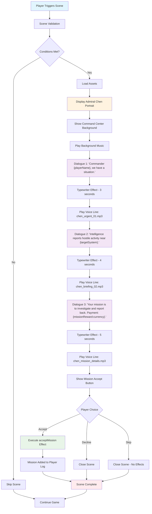

### A.2 Transition Scene Storyboard: Warp Jump Sequence

This storyboard shows the flow of the "Warp Jump Sequence" transition scene from the Scene Type Examples section.

```mermaid
flowchart TD
    A[Player Initiates Warp] --> B[Check Warp Drive Status]
    B --> C{Drive Charged?}
    C -->|No| D[Display Error Message]
    C -->|Yes| E[Begin Transition Scene]
    
    E --> F[Pause Game Systems]
    F --> G[Load Warp Animation Video]
    G --> H[Preload Audio Assets]
    
    H --> I[Display Full-Screen Overlay]
    I --> J["Ship AI: 'Warp drive charging... Stand by.'"]
    J --> K[Play Warp Charge SFX - Fade In]
    K --> L[Start Warp Animation Video]
    
    L --> M[3 Second Timer]
    M --> N["Ship AI: 'Warp jump initiated. Destination: {targetSystem}.'"]
    N --> O[Play Ambient Warp Music]
    
    O --> P[5 Second Mark - Play Warp Jump SFX]
    P --> Q[Visual Warp Effect Intensifies]
    Q --> R[12 Second Total Duration]
    
    R --> S[Execute Scene Effects]
    S --> T[Change Player Location to {targetSystem}]
    T --> U[Consume Fuel: {warpDistance * fuelConsumptionRate}]
    
    U --> V[Fade Out Warp Music]
    V --> W[Hide Full-Screen Overlay]
    W --> X[Resume Game Systems]
    X --> Y[Scene Complete - Player in New System]
    
    D --> Z[Return to Game]
    
    style A fill:#e1f5fe
    style E fill:#fff3e0
    style I fill:#f3e5f5
    style L fill:#e8f5e8
    style S fill:#ffecb3
    style Y fill:#ffebee
    
    classDef nonSkippable fill:#ffcdd2,stroke:#d32f2f,stroke-width:2px
    class E,F,G,H,I,J,K,L,M,N,O,P,Q,R,S,T,U,V,W,X nonSkippable
```

### A.3 Annotation Scene Storyboard: Asteroid Field Warning

This storyboard depicts the flow of the "Asteroid Field Warning" annotation scene from the Scene Type Examples section.

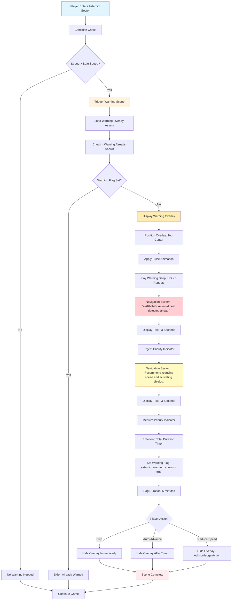

### A.4 Branching Scene Storyboard: Diplomatic Choice

This storyboard illustrates the complex flow of the "Diplomatic Choice" branching scene from the Scene Type Examples section.

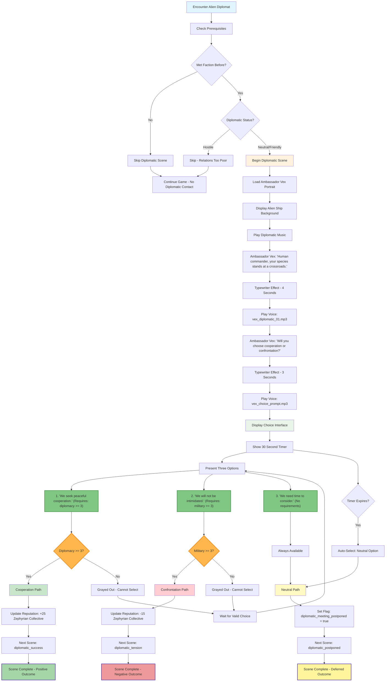

### A.5 Complete Docking Sequence Storyboard

This comprehensive storyboard shows the full "Docking with Cargo Scan" sequence from the JSON Template System section, demonstrating how multiple scenes connect together.

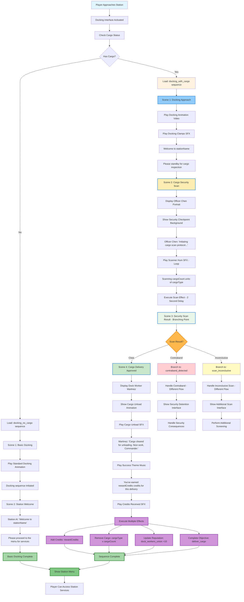

### A.6 Scene Timing and User Experience Flow

This diagram shows the timing relationships and user interaction points across different scene types.

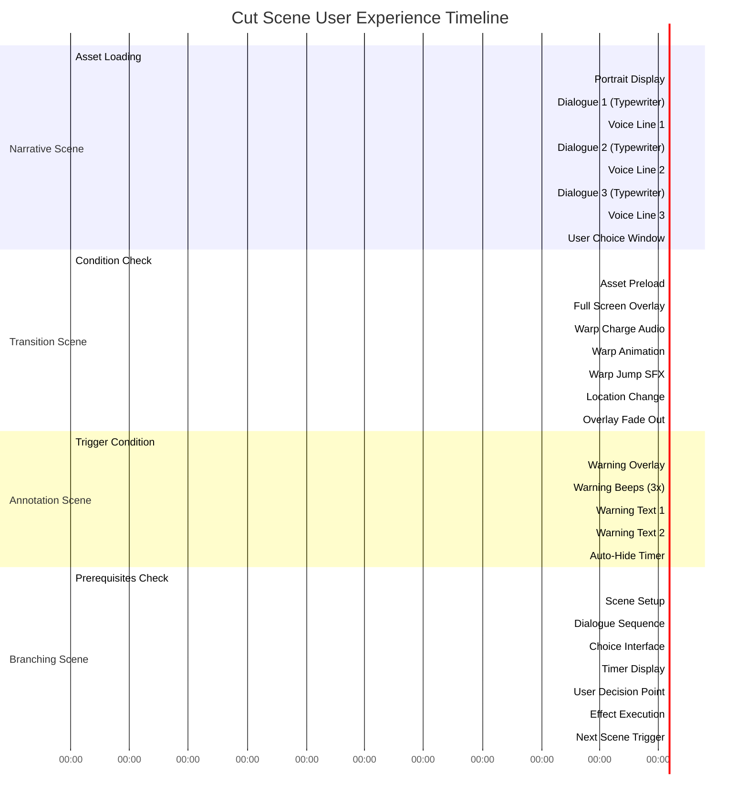

### A.7 Error Handling and Fallback Storyboard

This storyboard shows how the system handles various error conditions during scene playback.

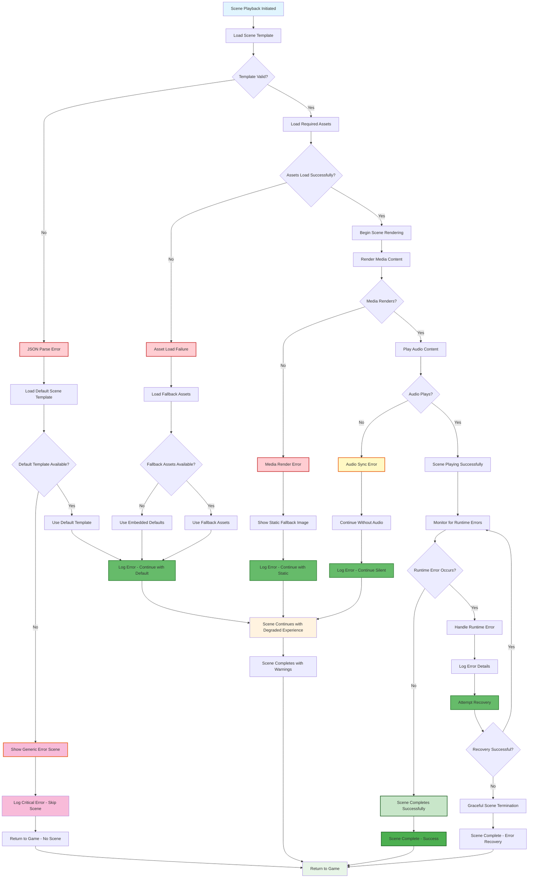

These visual storyboards provide a comprehensive view of how each scene type flows from initiation to completion, including user interaction points, timing considerations, error handling, and the overall user experience. They serve as both implementation guides for developers and user experience references for designers.

---

## Appendix B: Visual Mockups with Communication System Integration

This appendix provides visual mockups showing how each scene type example would appear using the existing Communication HUD system from `docs/communication_system_guide.md`. These mockups demonstrate the integration of cut scenes with the established retro-styled communication interface.

### B.1 Narrative Scene Mockup: Mission Briefing with Admiral Chen

```
┌─────────────────────────────────────────────────────────────────────────────────┐
│                                MISSION BRIEFING                                 │
│                               [NARRATIVE SCENE]                                 │
├─────────────────────────────────────────────────────────────────────────────────┤
│                                                                                 │
│  ┌─────────────────────────────────────┐    ┌─────────────────────────────────┐ │
│  │ ADMIRAL CHEN          ■ SECURE     │    │                                 │ │
│  ├─────────────────────────────────────┤    │     [FLEET COMMAND CENTER]      │ │
│  │ [Avatar] │ Commander {playerName},  │    │                                 │ │
│  │  /‾‾‾\   │ we have a situation.     │    │        ┌─────────────────┐      │ │
│  │ │ ● ● │  │ Intelligence reports     │    │        │   HOLOGRAPHIC   │      │ │
│  │ │  ‾  │  │ hostile activity near    │    │        │     DISPLAY     │      │ │
│  │  \___/   │ {targetSystem}.          │    │        │                 │      │ │
│  ├─────────────────────────────────────┤    │        └─────────────────┘      │ │
│  │ CH: FLEET.1        SIG: ████████▓   │    │                                 │ │
│  └─────────────────────────────────────┘    └─────────────────────────────────┘ │
│                                                                                 │
│  ┌─────────────────────────────────────────────────────────────────────────────┤ │
│  │ SUBTITLE: "Commander {playerName}, we have a situation."                   │ │
│  │ VOICE: chen_urgent_01.mp3 [████████████████████████████████████████▓░░░░░] │ │
│  └─────────────────────────────────────────────────────────────────────────────┘ │
│                                                                                 │
│                        [ACCEPT MISSION]  [DECLINE]  [ESC: SKIP]                │
└─────────────────────────────────────────────────────────────────────────────────┘

TIMING SEQUENCE:
00:00 - Asset Loading (Admiral Chen portrait, Command Center background)
00:02 - Communication HUD appears with wireframe avatar animation
00:03 - Typewriter effect: "Commander {playerName}, we have a situation."
00:03 - Voice playback: chen_urgent_01.mp3 with progress bar
00:06 - Next dialogue line with continued avatar mouth animation
00:15 - Mission accept/decline interface appears
00:25 - Auto-timeout to decline if no user input

COMMUNICATION HUD INTEGRATION:
- Position: Upper-left corner (50px from top, 10px from left)
- Dimensions: 360px × 140px (expanded for cut scene mode)
- Avatar: Animated wireframe with blinking eyes and mouth movement
- Channel: FLEET.1 (military secure channel)
- Signal: Full strength (████████▓) indicating clear transmission
- Status: ■ SECURE (encrypted military communication)
```

### B.2 Transition Scene Mockup: Warp Jump Sequence

```
┌─────────────────────────────────────────────────────────────────────────────────┐
│                              WARP JUMP SEQUENCE                                │
│                              [TRANSITION SCENE]                                │
├─────────────────────────────────────────────────────────────────────────────────┤
│                                                                                 │
│                        ████ FULL SCREEN OVERLAY ████                           │
│                                                                                 │
│  ┌─────────────────────────────────────┐    ┌─────────────────────────────────┐ │
│  │ SHIP AI               ■ SYSTEM     │    │                                 │ │
│  ├─────────────────────────────────────┤    │        WARP FIELD ACTIVE        │ │
│  │ [Avatar] │ Warp drive charging...   │    │                                 │ │
│  │   ╔═╗    │ Stand by.                │    │    ░░▒▒▓▓████▓▓▒▒░░            │ │
│  │   ║▓║    │                          │    │  ░▒▓███████████▓▒░              │ │
│  │   ╚═╝    │ Warp jump initiated.     │    │░▒▓██████████████▓▒░             │ │
│  │          │ Destination: {target}    │    │▒▓████████████████▓▒             │ │
│  ├─────────────────────────────────────┤    │░▒▓██████████████▓▒░             │ │
│  │ CH: SHIP.SYS       SIG: ████████▓   │    │  ░▒▓███████████▓▒░              │ │
│  └─────────────────────────────────────┘    │    ░░▒▒▓▓████▓▓▒▒░░            │ │
│                                             └─────────────────────────────────┘ │
│                                                                                 │
│  ┌─────────────────────────────────────────────────────────────────────────────┤ │
│  │ SUBTITLE: "Warp jump initiated. Destination: {targetSystem}."              │ │
│  │ SFX: warp_charge.wav [████████████████████████████████████████████████▓░░] │ │
│  │ BGM: warp_ambient.ogg [████████████████████████████████████████████▓░░░░░] │ │
│  └─────────────────────────────────────────────────────────────────────────────┘ │
│                                                                                 │
│                            [NON-SKIPPABLE SEQUENCE]                            │
│                          DURATION: 12 SECONDS TOTAL                            │
└─────────────────────────────────────────────────────────────────────────────────┘

TIMING SEQUENCE:
00:00 - Condition check (warp drive charged)
00:01 - Full-screen overlay activation
00:03 - Ship AI communication appears
00:04 - Warp charge audio begins (fade in over 1 second)
00:04 - Warp animation video starts
00:09 - Warp jump SFX plays (3 second duration)
00:16 - Location change effect executed
00:17 - Overlay fade out begins
00:19 - Return to normal gameplay

COMMUNICATION HUD INTEGRATION:
- Enhanced for full-screen mode with larger dimensions
- Ship AI avatar: Geometric/digital wireframe design
- Channel: SHIP.SYS (internal ship systems)
- Status: ■ SYSTEM (automated system communication)
- Audio: Synchronized with warp effects and ambient music
- Non-interactive: No skip option during critical transition
```

### B.3 Annotation Scene Mockup: Asteroid Field Warning

```
┌─────────────────────────────────────────────────────────────────────────────────┐
│                            ASTEROID FIELD WARNING                              │
│                             [ANNOTATION SCENE]                                 │
├─────────────────────────────────────────────────────────────────────────────────┤
│                                                                                 │
│                    ⚠️  WARNING OVERLAY - TOP CENTER  ⚠️                        │
│                                                                                 │
│  ┌─────────────────────────────────────┐    ┌─────────────────────────────────┐ │
│  │ NAVIGATION SYSTEM ■ ALERT          │    │                                 │ │
│  ├─────────────────────────────────────┤    │         ⚠️ WARNING ⚠️           │ │
│  │ [Avatar] │ WARNING: Asteroid field  │    │                                 │ │
│  │    △     │ detected ahead.          │    │    ASTEROID FIELD DETECTED      │ │
│  │   /!\    │                          │    │                                 │ │
│  │  /___\   │ Recommend reducing       │    │   ████ ████ ████ ████ ████     │ │
│  │          │ speed and activating     │    │   ████ ████ ████ ████ ████     │ │
│  │          │ shields.                 │    │   ████ ████ ████ ████ ████     │ │
│  ├─────────────────────────────────────┤    │                                 │ │
│  │ CH: NAV.WARN       SIG: ████████▓   │    │    REDUCE SPEED IMMEDIATELY     │ │
│  └─────────────────────────────────────┘    └─────────────────────────────────┘ │
│                                                                                 │
│  ┌─────────────────────────────────────────────────────────────────────────────┤ │
│  │ SUBTITLE: "WARNING: Asteroid field detected ahead."                        │ │
│  │ SFX: warning_beep.wav [♪♪♪] (3 repeats) [████████████████████████████▓░░] │ │
│  │ PRIORITY: HIGH - URGENT RESPONSE REQUIRED                                  │ │
│  └─────────────────────────────────────────────────────────────────────────────┘ │
│                                                                                 │
│              [ESC: SKIP]  [AUTO-HIDE: 8s]  [REDUCE SPEED: ACKNOWLEDGE]        │
└─────────────────────────────────────────────────────────────────────────────────┘

TIMING SEQUENCE:
00:00 - Trigger condition detected (speed > safe speed in asteroid sector)
00:01 - Warning overlay appears with pulse animation
00:02 - Warning beeps play (3 repetitions)
00:02 - First warning message with urgent priority
00:05 - Second warning message with medium priority
00:08 - Auto-hide timer expires (if no player action)

COMMUNICATION HUD INTEGRATION:
- Position: Standard upper-left with warning overlay in top-center
- Avatar: Navigation system warning icon (triangle with exclamation)
- Channel: NAV.WARN (navigation warning frequency)
- Status: ■ ALERT (high priority system alert)
- Audio: Warning beeps with decreasing volume over time
- Interactive: Multiple exit strategies (skip, acknowledge, auto-hide)
- Flag System: Sets "asteroid_warning_shown" flag for 5 minutes
```

### B.4 Branching Scene Mockup: Diplomatic Choice

```
┌─────────────────────────────────────────────────────────────────────────────────┐
│                              DIPLOMATIC ENCOUNTER                              │
│                               [BRANCHING SCENE]                                │
├─────────────────────────────────────────────────────────────────────────────────┤
│                                                                                 │
│  ┌─────────────────────────────────────┐    ┌─────────────────────────────────┐ │
│  │ AMBASSADOR VEX        ■ DIPLOMATIC  │    │                                 │ │
│  ├─────────────────────────────────────┤    │        ALIEN VESSEL             │ │
│  │ [Avatar] │ Human commander, your    │    │                                 │ │
│  │    ◊◊    │ species stands at a      │    │         ╔═══════╗               │ │
│  │   ◊  ◊   │ crossroads.              │    │        ╔╝       ╚╗              │ │
│  │    \/    │                          │    │       ╔╝  ◊   ◊  ╚╗             │ │
│  │   ____   │ Will you choose          │    │      ╔╝     ∩     ╚╗            │ │
│  │          │ cooperation or           │    │     ╔╝             ╚╗           │ │
│  │          │ confrontation?           │    │    ╚═══════════════════╝          │ │
│  ├─────────────────────────────────────┤    │                                 │ │
│  │ CH: DIPLO.1        SIG: ███▓░░░░░   │    │    ZEPHYRIAN COLLECTIVE         │ │
│  └─────────────────────────────────────┘    └─────────────────────────────────┘ │
│                                                                                 │
│  ┌─────────────────────────────────────────────────────────────────────────────┤ │
│  │ SUBTITLE: "Will you choose cooperation or confrontation?"                  │ │
│  │ VOICE: vex_choice_prompt.mp3 [████████████████████████████████████████▓░░] │ │
│  │ TIMER: 30 SECONDS REMAINING [████████████████████████████████████████░░░░] │ │
│  └─────────────────────────────────────────────────────────────────────────────┘ │
│                                                                                 │
│  ┌─────────────────────────────────────────────────────────────────────────────┐ │
│  │                            DIPLOMATIC CHOICES                               │ │
│  ├─────────────────────────────────────────────────────────────────────────────┤ │
│  │ [1] "We seek peaceful cooperation."                                         │ │
│  │     Requirements: Diplomacy >= 3  [✓ AVAILABLE]                            │ │
│  │     Outcome: +25 Zephyrian Collective Reputation                           │ │
│  │                                                                             │ │
│  │ [2] "We will not be intimidated."                                          │ │
│  │     Requirements: Military >= 3   [✗ UNAVAILABLE - GRAYED OUT]             │ │
│  │     Outcome: -15 Zephyrian Collective Reputation                           │ │
│  │                                                                             │ │
│  │ [3] "We need time to consider."                                            │ │
│  │     Requirements: None            [✓ ALWAYS AVAILABLE]                     │ │
│  │     Outcome: Set diplomatic_meeting_postponed flag                         │ │
│  └─────────────────────────────────────────────────────────────────────────────┘ │
│                                                                                 │
│                    [1-3: SELECT CHOICE]  [DEFAULT: OPTION 3]                   │
└─────────────────────────────────────────────────────────────────────────────────┘

TIMING SEQUENCE:
00:00 - Prerequisites check (faction met, diplomatic status)
00:01 - Alien vessel background loads
00:03 - Ambassador Vex communication begins
00:07 - First dialogue with alien avatar animation
00:11 - Second dialogue with choice prompt
00:15 - Choice interface appears with 30-second timer
00:45 - Auto-select neutral option if no choice made
00:47 - Execute chosen effects and transition to next scene

COMMUNICATION HUD INTEGRATION:
- Avatar: Alien wireframe design with diamond-shaped features
- Channel: DIPLO.1 (diplomatic frequency)
- Status: ■ DIPLOMATIC (formal diplomatic communication)
- Signal: Moderate strength (███▓░░░░░) indicating distant transmission
- Interactive: Three-choice system with skill requirement validation
- Timer: Visual countdown with color changes (green→yellow→red)
- Requirements: Real-time validation against player stats
```

### B.5 Complete Docking Sequence Mockup: Multi-Scene Flow

```
┌─────────────────────────────────────────────────────────────────────────────────┐
│                          DOCKING SEQUENCE - SCENE 1/4                          │
│                            [DOCKING APPROACH]                                  │
├─────────────────────────────────────────────────────────────────────────────────┤
│                                                                                 │
│  ┌─────────────────────────────────────┐    ┌─────────────────────────────────┐ │
│  │ DOCKING CONTROL       ■ TRAFFIC     │    │                                 │ │
│  ├─────────────────────────────────────┤    │      EUROPA RESEARCH STATION    │ │
│  │ [Avatar] │ Docking clamps engaged.  │    │                                 │ │
│  │   ╔═╗    │ Welcome to {stationName}.│    │    ┌─────────────────────────┐   │ │
│  │   ║▓║    │                          │    │    │    DOCKING BAY ALPHA    │   │ │
│  │   ╚═╝    │ Please standby for       │    │    │                         │   │ │
│  │          │ cargo inspection.        │    │    │      [SHIP DOCKING]     │   │ │
│  ├─────────────────────────────────────┤    │    │         ▓▓▓▓▓▓▓         │   │ │
│  │ CH: DOCK.7         SIG: ████████▓   │    │    └─────────────────────────┘   │ │
│  └─────────────────────────────────────┘    └─────────────────────────────────┘ │
│                                                                                 │
│                              ↓ CONTINUES TO ↓                                  │
│                                                                                 │
├─────────────────────────────────────────────────────────────────────────────────┤
│                          DOCKING SEQUENCE - SCENE 2/4                          │
│                           [CARGO SECURITY SCAN]                                │
├─────────────────────────────────────────────────────────────────────────────────┤
│                                                                                 │
│  ┌─────────────────────────────────────┐    ┌─────────────────────────────────┐ │
│  │ OFFICER CHEN          ■ SECURITY    │    │                                 │ │
│  ├─────────────────────────────────────┤    │     SECURITY CHECKPOINT         │ │
│  │ [Avatar] │ Initiating cargo scan    │    │                                 │ │
│  │  /‾‾‾\   │ protocol...              │    │    ┌─────────────────────────┐   │ │
│  │ │ ● ● │  │                          │    │    │    SCANNING IN PROGRESS │   │ │
│  │ │  ‾  │  │ Scanning {cargoCount}    │    │    │                         │   │ │
│  │  \___/   │ units of {cargoType}.    │    │    │  ████████████████████   │   │ │
│  ├─────────────────────────────────────┤    │    │  ▓▓▓▓▓▓▓▓▓▓▓▓▓▓▓▓▓▓▓▓   │   │ │
│  │ CH: SEC.SCAN       SIG: ████████▓   │    │    └─────────────────────────┘   │ │
│  └─────────────────────────────────────┘    └─────────────────────────────────┘ │
│                                                                                 │
│  ┌─────────────────────────────────────────────────────────────────────────────┤ │
│  │ SFX: scanner_hum.wav [LOOPING] [████████████████████████████████████████▓] │ │
│  │ SCAN PROGRESS: [████████████████████████████████████████████████████▓░░░░] │ │
│  └─────────────────────────────────────────────────────────────────────────────┘ │
│                                                                                 │
│                              ↓ BRANCHES TO ↓                                   │
│                                                                                 │
├─────────────────────────────────────────────────────────────────────────────────┤
│                          DOCKING SEQUENCE - SCENE 4/4                          │
│                         [CARGO DELIVERY APPROVED]                              │
├─────────────────────────────────────────────────────────────────────────────────┤
│                                                                                 │
│  ┌─────────────────────────────────────┐    ┌─────────────────────────────────┐ │
│  │ DOCK WORKER MARTINEZ  ■ OPERATIONS  │    │                                 │ │
│  ├─────────────────────────────────────┤    │        CARGO UNLOADING          │ │
│  │ [Avatar] │ Cargo cleared for        │    │                                 │ │
│  │   ╔═╗    │ unloading. Nice work,    │    │    ┌─────────────────────────┐   │ │
│  │  ╔╝ ╚╗   │ Commander.               │    │    │     MEDICAL SUPPLIES    │   │ │
│  │  ║   ║   │                          │    │    │                         │   │ │
│  │  ╚╗ ╔╝   │ You've earned            │    │    │  [██████████████████]   │   │ │
│  │   ╚═╝    │ {rewardCredits} credits. │    │    │        UNLOADED         │   │ │
│  ├─────────────────────────────────────┤    │    └─────────────────────────┘   │ │
│  │ CH: CARGO.OPS      SIG: ████████▓   │    └─────────────────────────────────┘ │
│  └─────────────────────────────────────┘                                        │
│                                                                                 │
│  ┌─────────────────────────────────────────────────────────────────────────────┤ │
│  │ EFFECTS EXECUTED:                                                           │ │
│  │ ✓ Credits Added: +{rewardCredits} CR                                       │ │
│  │ ✓ Cargo Removed: {cargoType} x {cargoCount} units                          │ │
│  │ ✓ Reputation: Dock Workers Union +10                                       │ │
│  │ ✓ Mission Objective: "deliver_cargo" COMPLETED                             │ │
│  └─────────────────────────────────────────────────────────────────────────────┘ │
│                                                                                 │
│                          [SEQUENCE COMPLETE - ENTER STATION]                   │
└─────────────────────────────────────────────────────────────────────────────────┘

MULTI-SCENE FLOW INTEGRATION:
- Seamless transitions between communication contexts
- Different NPCs with distinct avatar styles and channels
- Progressive narrative from approach → scan → approval → completion
- Real-time effect execution with visual confirmation
- Branching logic handled transparently between scenes
- Consistent retro styling throughout entire sequence
```

### B.6 Communication HUD Technical Integration Notes

#### Visual Consistency
- **Retro Theme**: All mockups maintain the established green terminal aesthetic
- **Typography**: VT323 monospace font for authentic retro feel
- **Color Palette**: Primary green (#00ff41), white text, yellow accents
- **Layout**: Consistent 360px × 140px dimensions (expanded from standard 320px × 120px for cut scenes)

#### Avatar System Integration
- **Narrative Scenes**: Human NPCs use standard wireframe faces with blinking eyes
- **System Scenes**: Geometric/digital avatars for AI and ship systems
- **Alien Scenes**: Custom wireframe designs reflecting species characteristics
- **Warning Scenes**: Icon-based avatars (triangles, symbols) for system alerts

#### Audio-Visual Synchronization
- **Voice Lines**: Progress bars showing playback status with waveform visualization
- **Sound Effects**: Volume indicators and loop status for ambient sounds
- **Background Music**: Fade in/out indicators with current volume levels
- **Subtitle Timing**: Synchronized with voice playback and typewriter effects

#### Interactive Elements
- **Choice Systems**: Skill requirement validation with visual feedback
- **Timer Systems**: Countdown displays with color-coded urgency levels
- **Skip Controls**: Consistent ESC key functionality across all scene types
- **Status Indicators**: Real-time updates for signal strength, channel, and connection status

#### Channel and Status Integration
- **FLEET.1**: Military/command communications (secure, high priority)
- **SHIP.SYS**: Internal ship system notifications (automated, non-interactive)
- **NAV.WARN**: Navigation warnings and alerts (urgent, safety-critical)
- **DIPLO.1**: Diplomatic communications (formal, choice-driven)
- **DOCK.7**: Station docking control (operational, procedural)
- **SEC.SCAN**: Security scanning operations (official, verification)
- **CARGO.OPS**: Cargo handling operations (commercial, transactional)

These mockups demonstrate how the cut scene system seamlessly integrates with the existing Communication HUD infrastructure, maintaining visual consistency while expanding functionality for immersive storytelling experiences.

