# Discovery System - Complete Sequence Diagram

**Date**: September 30, 2025  
**System**: PlanetZ Discovery & Targeting Integration  
**Purpose**: Comprehensive UML sequence diagram showing all discovery flows

---

## Full Discovery System Sequence Diagram

```mermaid
sequenceDiagram
    participant GameLoop as Game Loop (update)
    participant StarfieldMgr as StarfieldManager
    participant StarCharts as StarChartsManager
    participant SpatialGrid as Spatial Grid
    participant TargetCPU as TargetComputerManager
    participant Integration as StarChartsTargetComputerIntegration
    participant NotificationSys as Notification System
    participant ShipLog as ShipLog
    participant AchievementSys as AchievementSystem
    participant HUD as Ephemeral HUD
    participant Audio as Audio System
    
    %% === PROXIMITY-BASED DISCOVERY PATH ===
    Note over GameLoop,Audio: 🔍 PATH 1: PROXIMITY-BASED DISCOVERY (Every 1 second)
    
    GameLoop->>StarfieldMgr: update(deltaTime)
    activate StarfieldMgr
    StarfieldMgr->>StarCharts: checkDiscoveryRadius()
    activate StarCharts
    
    StarCharts->>StarCharts: Check if 1 second elapsed (discoveryInterval)
    
    alt Less than 1 second since last check
        StarCharts-->>StarfieldMgr: Skip (too soon)
    else Time for discovery check
        StarCharts->>StarCharts: getPlayerPosition()
        StarCharts->>StarCharts: getEffectiveDiscoveryRadius()<br/>(from Target CPU level)
        
        StarCharts->>SpatialGrid: getNearbyObjects(playerPosition, radius)
        activate SpatialGrid
        Note over SpatialGrid: Spatial partitioning optimization<br/>Grid size: 50 units<br/>Only checks nearby grid cells
        SpatialGrid-->>StarCharts: nearbyObjects[] (optimized list)
        deactivate SpatialGrid
        
        StarCharts->>StarCharts: batchProcessDiscoveries(nearbyObjects, playerPosition, radius)
        
        loop For each nearby object
            StarCharts->>StarCharts: isDiscovered(objectId)?
            
            alt Object NOT discovered
                StarCharts->>StarCharts: isWithinRange(object, playerPosition, radius)
                StarCharts->>StarCharts: calculateDistance(obj, player)
                
                alt Within discovery radius
                    Note over StarCharts: Add to discoveries[] batch<br/>(max 5 per frame for performance)
                end
            end
        end
        
        loop For each discovery in batch (staggered 2s apart)
            StarCharts->>StarCharts: processDiscovery(object)
            activate StarCharts
            
            StarCharts->>StarCharts: getDiscoveryCategory(object.type)
            Note over StarCharts: Categories: major, minor, waypoint
            
            StarCharts->>StarCharts: shouldNotifyDiscovery(object.type)
            Note over StarCharts: Skip stars/moons, notify planets/stations/beacons
            
            alt Should notify
                StarCharts->>StarCharts: showDiscoveryNotification(object, category)
                Note over StarCharts: See NOTIFICATION FLOW below
            end
            
            StarCharts->>StarCharts: addDiscoveredObject(objectId, 'proximity', 'player')
            Note over StarCharts: See DISCOVERY REGISTRATION below
            
            deactivate StarCharts
        end
    end
    
    deactivate StarCharts
    deactivate StarfieldMgr
    
    %% === TARGETING-BASED DISCOVERY PATH ===
    Note over GameLoop,Audio: 🎯 PATH 2: TARGETING-BASED DISCOVERY (TAB key press)
    
    GameLoop->>StarfieldMgr: keydown event (TAB)
    activate StarfieldMgr
    
    StarfieldMgr->>StarfieldMgr: Check isDocked, undockCooldown, targetComputerEnabled
    
    alt All checks passed
        StarfieldMgr->>TargetCPU: cycleTarget(forward)
        activate TargetCPU
        
        TargetCPU->>TargetCPU: Calculate next targetIndex
        TargetCPU->>TargetCPU: Get targetData from targetObjects[targetIndex]
        TargetCPU->>TargetCPU: Set currentTarget = targetData
        
        Note over TargetCPU: DISCOVERY FIX: Auto-discover on targeting
        
        TargetCPU->>TargetCPU: getCurrentTargetData()
        
        alt Target is NOT a ship AND NOT discovered
            TargetCPU->>TargetCPU: constructStarChartsId(targetData)
            TargetCPU->>StarCharts: isDiscovered(objectId)?
            StarCharts-->>TargetCPU: false (not discovered)
            
            TargetCPU->>StarCharts: addDiscoveredObject(objectId, 'targeting', 'player')
            Note over TargetCPU,StarCharts: Auto-discovery triggered!<br/>Ensures wireframe shows correct colors
        end
        
        TargetCPU->>TargetCPU: createTargetWireframe()
        Note over TargetCPU: Wireframe color based on<br/>discovery status (cyan if undiscovered)
        
        TargetCPU->>TargetCPU: updateTargetDisplay()
        TargetCPU->>TargetCPU: updateReticleTargetInfo()
        
        deactivate TargetCPU
    end
    
    deactivate StarfieldMgr
    
    %% === STAR CHARTS UI DISCOVERY PATH ===
    Note over GameLoop,Audio: 🗺️ PATH 3: STAR CHARTS UI SELECTION (G key + click)
    
    GameLoop->>StarfieldMgr: keydown event (G)
    activate StarfieldMgr
    StarfieldMgr->>StarCharts: UI.show()
    Note over StarCharts: Star Charts modal opens
    deactivate StarfieldMgr
    
    Note over StarCharts: User clicks object in Star Charts
    StarCharts->>StarCharts: selectObject(object)
    StarCharts->>StarCharts: showObjectDetails(object)
    
    StarCharts->>TargetCPU: selectObjectById(objectId)
    activate TargetCPU
    
    TargetCPU->>TargetCPU: setTargetById(objectId)
    Note over TargetCPU: Sets target + marks as<br/>isManualNavigationSelection = true
    
    alt Object found in targetObjects
        TargetCPU->>TargetCPU: Set currentTarget, targetIndex
        TargetCPU->>TargetCPU: isManualNavigationSelection = true
        TargetCPU->>TargetCPU: updateTargetDisplay()
        
        Note over TargetCPU: If not discovered, auto-discover<br/>(same as TAB targeting)
    end
    
    deactivate TargetCPU
    
    %% === DISCOVERY REGISTRATION (SHARED BY ALL PATHS) ===
    Note over GameLoop,Audio: 📝 DISCOVERY REGISTRATION (Shared by all 3 paths)
    
    activate StarCharts
    Note over StarCharts: addDiscoveredObject(objectId, method, source)
    
    StarCharts->>StarCharts: Normalize ID (a0_ → A0_)
    StarCharts->>StarCharts: Check discoveredObjects.has(normalizedId)
    
    alt Already discovered
        StarCharts->>StarCharts: Update metadata.lastSeen
        Note over StarCharts: Skip notification (already discovered)
    else NEW DISCOVERY
        StarCharts->>StarCharts: Check _discoveryInProgress.has(normalizedId)
        
        alt Discovery already in progress
            Note over StarCharts: ⏭️ DUPLICATE PREVENTION<br/>Skip to prevent race condition
        else Discovery NOT in progress
            StarCharts->>StarCharts: _discoveryInProgress.add(normalizedId)
            StarCharts->>StarCharts: discoveredObjects.add(normalizedId)
            
            StarCharts->>StarCharts: Create discoveryMetadata{<br/>discoveredAt, method, source, sector}
            StarCharts->>StarCharts: discoveryMetadata.set(normalizedId, data)
            
            StarCharts->>StarCharts: saveDiscoveryState()<br/>(to localStorage)
            
            Note over StarCharts: ✅ DISCOVERED!<br/>Total: discoveredObjects.size
            
            StarCharts->>AchievementSys: updateAchievementProgress()
            activate AchievementSys
            AchievementSys->>AchievementSys: Get discoveryCount
            AchievementSys->>AchievementSys: Check achievement tiers<br/>(5, 10, 15, 20, 27 discoveries)
            
            alt Achievement unlocked
                AchievementSys->>NotificationSys: Show achievement notification
                AchievementSys->>ShipLog: Log achievement to ship's log
            end
            
            deactivate AchievementSys
            
            StarCharts->>StarCharts: getObjectById(objectId)
            
            alt Object data found
                StarCharts->>StarCharts: shouldNotifyDiscovery(objectData.type)
                
                alt Should notify (planets/stations/beacons)
                    StarCharts->>StarCharts: getDiscoveryCategory(objectData.type)
                    StarCharts->>NotificationSys: showDiscoveryNotification(objectData, category)
                    Note over NotificationSys: See NOTIFICATION FLOW below
                end
            end
            
            StarCharts->>Integration: triggerDiscoveryCallbacks(normalizedId, discoveryData)
            activate Integration
            
            Integration->>Integration: handleDiscoveryEvent(objectId, discoveryData)
            Integration->>Integration: updateEnhancedTargetData(objectId, discoveryData)
            Integration->>TargetCPU: notifyTargetComputerOfDiscovery(objectId)
            
            Note over Integration: Triggers registered callbacks<br/>for discovery event
            
            deactivate Integration
            
            Note over StarCharts: CLEANUP: Remove from _discoveryInProgress<br/>after 100ms (setTimeout)
            
            StarCharts->>StarCharts: setTimeout(() => _discoveryInProgress.delete(normalizedId), 100)
        end
    end
    
    deactivate StarCharts
    
    %% === NOTIFICATION FLOW (SHARED) ===
    Note over GameLoop,Audio: 🔔 NOTIFICATION FLOW (Shared by all discovery paths)
    
    activate NotificationSys
    Note over NotificationSys: showDiscoveryNotification(object, category)
    
    NotificationSys->>NotificationSys: Check _recentNotifications Map
    NotificationSys->>NotificationSys: notificationKey = `${object.id}_${object.name}`
    NotificationSys->>NotificationSys: Get lastNotification timestamp
    
    alt Notification shown within last 5 seconds
        Note over NotificationSys: ⏭️ COOLDOWN: Skip duplicate<br/>(prevents notification spam)
    else Cooldown expired OR first notification
        NotificationSys->>NotificationSys: _recentNotifications.set(notificationKey, now)
        
        Note over NotificationSys: Cleanup old entries<br/>(keep last 50 notifications)
        
        NotificationSys->>NotificationSys: Get discoveryTypes[category].config
        Note over NotificationSys: Config: {audio, notification, prominence}
        
        alt Config.audio specified
            NotificationSys->>Audio: playSound('blurb.mp3')
            activate Audio
            Audio-->>NotificationSys: Audio playing
            deactivate Audio
        end
        
        NotificationSys->>NotificationSys: message = `${object.name} discovered!`
        
        alt Config.notification === 'prominent'
            NotificationSys->>NotificationSys: showProminentNotification(message)
            
            Note over NotificationSys: Try Method 1: Ephemeral HUD (PREFERRED)
            
            alt StarfieldManager.showHUDEphemeral available
                NotificationSys->>HUD: showHUDEphemeral('🔍 DISCOVERY', message, 4000)
                activate HUD
                
                HUD->>ShipLog: addEphemeralEntry('🔍 DISCOVERY', message)
                activate ShipLog
                
                Note over ShipLog: DUPLICATE PREVENTION<br/>Check _recentEntries Map
                
                ShipLog->>ShipLog: entryKey = `${title}_${message}`
                ShipLog->>ShipLog: Check if entry exists in last 2 seconds
                
                alt Entry logged within 2 seconds
                    Note over ShipLog: ⏭️ SKIP DUPLICATE<br/>Prevents simultaneous discoveries<br/>from logging multiple times
                else New entry OR cooldown expired
                    ShipLog->>ShipLog: _recentEntries.set(entryKey, now)
                    ShipLog->>ShipLog: addEntry('ephemeral', message, title)
                    ShipLog->>ShipLog: entries.unshift(entry)
                    Note over ShipLog: ✅ Added to ship's log<br/>(most recent first)
                    
                    alt Ship's Log UI is visible
                        ShipLog->>ShipLog: refreshLogDisplay()
                        Note over ShipLog: Updates Help Screen ship's log tab
                    end
                end
                
                deactivate ShipLog
                
                HUD->>HUD: Create/update ephemeral element
                HUD->>HUD: Show for 4000ms
                Note over HUD: Top-center HUD display<br/>Fades in/out
                
                deactivate HUD
                
                Note over NotificationSys: ✅ Notification sent<br/>EXIT EARLY (prevent duplicates)
            else Ephemeral HUD not available
                Note over NotificationSys: Try Method 2: WeaponHUD (FALLBACK)
                
                alt WeaponHUD.showUnifiedMessage available
                    NotificationSys->>HUD: showUnifiedMessage(message, 5000, priority:3)
                    Note over HUD: Green color, high priority
                else WeaponHUD not available
                    Note over NotificationSys: Method 3: Create notification element<br/>(DOM manipulation fallback)
                    NotificationSys->>NotificationSys: createElement('div')
                    NotificationSys->>NotificationSys: Apply styles (green, fadeInOut)
                    NotificationSys->>NotificationSys: document.body.appendChild(notification)
                    NotificationSys->>NotificationSys: setTimeout(() => remove(), 3000)
                end
            end
            
        else Config.notification === 'subtle'
            NotificationSys->>NotificationSys: showSubtleNotification(message)
            Note over NotificationSys: Similar flow but less prominent styling
        else Config.notification === 'log_only'
            NotificationSys->>NotificationSys: debug('STAR_CHARTS', message)
            Note over NotificationSys: Console only, no HUD
        end
    end
    
    deactivate NotificationSys
    
    %% === DISCOVERY STATUS CHECK (TARGETING CPU) ===
    Note over GameLoop,Audio: 🎨 DISCOVERY STATUS CHECK (For wireframe coloring)
    
    activate TargetCPU
    Note over TargetCPU: isObjectDiscovered(targetData)
    
    TargetCPU->>TargetCPU: Get StarChartsManager reference
    
    alt StarChartsManager not available
        TargetCPU-->>TargetCPU: Assume discovered (fallback)
    else StarChartsManager available
        TargetCPU->>TargetCPU: constructStarChartsId(targetData)
        
        alt Cannot determine object ID
            TargetCPU-->>TargetCPU: Assume discovered (fallback)
        else Object ID determined
            TargetCPU->>StarCharts: isDiscovered(objectId)
            activate StarCharts
            StarCharts->>StarCharts: discoveredObjects.has(normalizedId)
            StarCharts-->>TargetCPU: true/false
            deactivate StarCharts
            
            Note over TargetCPU: Cache discovery status<br/>(rate-limited logging to prevent spam)
            
            TargetCPU->>TargetCPU: Update wireframe color based on status:<br/>- Undiscovered: CYAN (0x44ffff)<br/>- Discovered: Faction-based color
        end
    end
    
    deactivate TargetCPU
    
    %% === CLEANUP & MEMORY MANAGEMENT ===
    Note over GameLoop,Audio: 🧹 CLEANUP & MEMORY MANAGEMENT (Background)
    
    activate ShipLog
    Note over ShipLog: startCleanupInterval() - Every 60 seconds
    
    ShipLog->>ShipLog: Iterate _recentEntries Map
    ShipLog->>ShipLog: Remove entries older than 10 seconds
    
    Note over ShipLog: Prevents memory leak from<br/>unbounded Map growth
    
    deactivate ShipLog
    
    activate NotificationSys
    Note over NotificationSys: _recentNotifications cleanup
    
    NotificationSys->>NotificationSys: Keep only last 50 notifications
    NotificationSys->>NotificationSys: Delete oldest entries
    
    deactivate NotificationSys
    
    activate StarCharts
    Note over StarCharts: _discoveryInProgress cleanup
    
    StarCharts->>StarCharts: setTimeout(() => delete(normalizedId), 100ms)
    Note over StarCharts: Removes flag after discovery<br/>processing completes
    
    deactivate StarCharts
```



---

## Key Discovery Paths Summary

### **Path 1: Proximity-Based Discovery** 🔍
**Trigger**: Game loop every 1 second  
**Flow**: `GameLoop → StarfieldManager → StarChartsManager.checkDiscoveryRadius() → batchProcessDiscoveries() → processDiscovery() → addDiscoveredObject()`  
**Characteristics**:
- Most common discovery path
- Optimized with spatial grid partitioning
- Max 5 discoveries per frame (performance limit)
- Staggered 2-second delays between batch discoveries

### **Path 2: Targeting-Based Discovery** 🎯
**Trigger**: TAB key press (target cycling)  
**Flow**: `GameLoop → StarfieldManager → TargetComputerManager.cycleTarget() → StarChartsManager.addDiscoveredObject(objectId, 'targeting', 'player')`  
**Characteristics**:
- Auto-discovers when object becomes current target
- Ensures wireframe shows correct colors immediately
- Discovery method: 'targeting'
- Source: 'player'

### **Path 3: Star Charts UI Selection** 🗺️
**Trigger**: G key + clicking object in Star Charts  
**Flow**: `Star Charts UI → selectObject() → TargetComputerManager.selectObjectById() → (auto-discover if needed)`  
**Characteristics**:
- Manual selection from navigation interface
- Sets `isManualNavigationSelection = true`
- Protected from auto-override (recent fix)
- Same auto-discovery as targeting path

---

## Duplicate Prevention Mechanisms

### **1. Discovery Registration Level** (StarChartsManager)
```javascript
// Line 1187-1193
if (!wasAlreadyDiscovered) {
    if (this._discoveryInProgress.has(normalizedId)) {
        return; // Prevents simultaneous discoveries
    }
    this._discoveryInProgress.add(normalizedId);
}
```
**Protects**: Multiple discovery paths from registering same object  
**Duration**: 100ms cleanup timeout  
**Status**: ✅ Working

### **2. Notification Level** (StarChartsManager)
```javascript
// Line 868-870
if (lastNotification && (now - lastNotification) < 5000) {
    return; // 5-second cooldown
}
```
**Protects**: Same object notification spam  
**Duration**: 5 seconds  
**Status**: ✅ Working (but can be bypassed by simultaneous events)

### **3. Ship's Log Level** (ShipLog) ⭐ **NEW FIX**
```javascript
// Line 75-78
if (lastEntry && (now - lastEntry) < 2000) {
    return; // Skip duplicate
}
```
**Protects**: Duplicate ephemeral log entries  
**Duration**: 2 seconds  
**Status**: ✅ Fixed (prevents simultaneous discoveries from logging multiple times)

---

## Performance Optimizations

### **Spatial Grid Partitioning**
- **Grid Size**: 50 game units
- **Purpose**: Avoid checking all objects every frame
- **Benefit**: O(nearby cells) instead of O(all objects)

### **Discovery Interval**
- **Rate**: Every 1 second (1000ms)
- **Purpose**: Responsive discovery without overwhelming game loop
- **Frame Budget**: 16ms target (60fps)

### **Batch Processing**
- **Max per frame**: 5 discoveries
- **Staggering**: 2-second delay between batch items
- **Purpose**: Prevent notification spam and frame drops

### **Cleanup Intervals**
- **Ship's Log**: 60 seconds (removes entries >10s old)
- **Notifications**: After 50 entries (FIFO cleanup)
- **Discovery Progress**: 100ms after discovery completes

---

## Data Flow & State Management

### **Discovery State**
- **Storage**: `Set<string>` (discoveredObjects)
- **Persistence**: localStorage (saveDiscoveryState)
- **Metadata**: `Map<objectId, {discoveredAt, method, source, sector}>`

### **Notification State**
- **Storage**: `Map<notificationKey, timestamp>` (_recentNotifications)
- **Cleanup**: Keep last 50 notifications
- **Key Format**: `${objectId}_${objectName}`

### **Ship's Log State**
- **Storage**: `Map<entryKey, timestamp>` (_recentEntries)
- **Cleanup**: Every 60s, remove entries >10s old
- **Key Format**: `${title}_${message}`

---

## Integration Points

### **Achievement System Integration**
- **Trigger**: After discoveredObjects.add()
- **Method**: `updateAchievementProgress(discoveryCount)`
- **Tiers**: 5, 10, 15, 20, 27 discoveries
- **Rewards**: Credits + titles per tier

### **Target Computer Integration**
- **Purpose**: Wireframe color synchronization
- **Check**: `isObjectDiscovered(targetData)`
- **Colors**:
  - Undiscovered: Cyan (0x44ffff)
  - Discovered: Faction-based (hostile=red, neutral=yellow, friendly=green)

### **Star Charts UI Integration**
- **Callbacks**: `triggerDiscoveryCallbacks(objectId, discoveryData)`
- **Integration**: StarChartsTargetComputerIntegration
- **Purpose**: Sync enhanced target data, notify target computer

---

## Timing & Race Conditions

### **Simultaneous Discovery Problem** (FIXED)
**Scenario**: Multiple paths discover same object at exact same timestamp  
**Example**:
- Proximity discovery triggers at 12:34:56.789
- User presses TAB at 12:34:56.789
- Both see `lastNotification = undefined`
- Both show notification

**Fix**: Ship's log duplicate prevention catches this at final logging stage

### **Discovery Progress Flag** (100ms window)
**Purpose**: Prevent race condition between discovery paths  
**Duration**: 100ms (sufficient for async operations)  
**Cleanup**: setTimeout to remove flag after processing

---

## Error Handling & Fallbacks

### **StarChartsManager Not Available**
- **Fallback**: Assume all objects discovered
- **Impact**: Wireframes show faction colors instead of cyan
- **Graceful**: Game continues without discovery system

### **Audio Playback Failure**
- **Fallback**: Silent failure (catch block)
- **Impact**: No sound, but notification still shows
- **User Experience**: Non-blocking

### **HUD Not Available**
- **Fallback Chain**: 
  1. Ephemeral HUD (preferred)
  2. WeaponHUD unified message
  3. DOM element creation
- **Impact**: Always shows notification via some method

---

## Recent Fixes Applied

### **Scanner Flag Race Condition** (Commit: db450b6)
- **File**: TargetComputerManager.js, StarChartsUI.js, LongRangeScanner.js
- **Change**: `isFromLongRangeScanner` → `isManualNavigationSelection`
- **Fix**: Don't clear flag during target cycling, only on interface close

### **Duplicate Discovery Messages** (Commit: 555c3ec)
- **File**: ShipLog.js
- **Change**: Added `_recentEntries` Map with 2-second cooldown
- **Fix**: Prevents simultaneous discoveries from logging multiple times

---

**End of Sequence Diagram Documentation**
