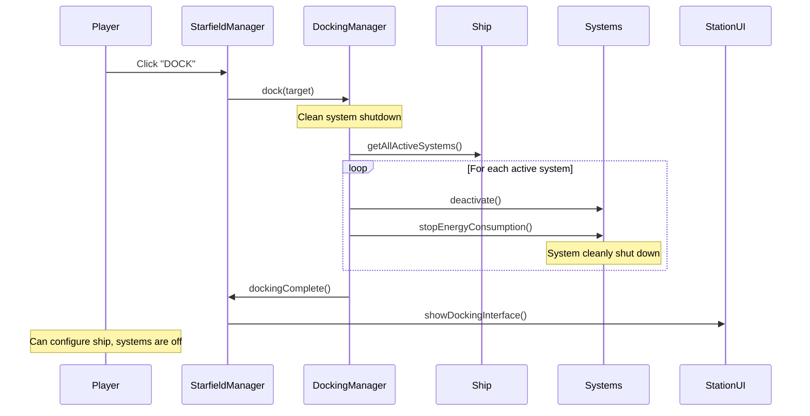
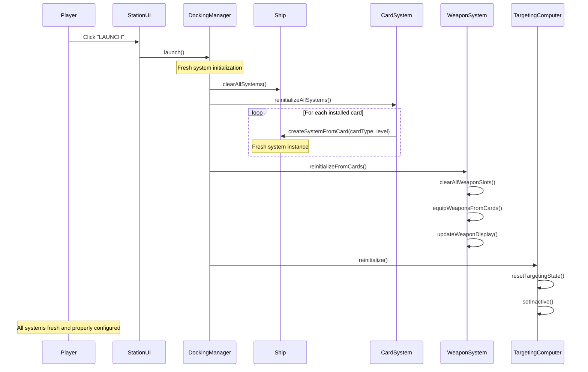

# Docking and Launch System Redesign 🚀

## Overview
This document outlines the corrected architecture for the docking and launch system, addressing critical issues with the current save/restore approach and implementing a proper shutdown/reinitialization pattern.

## ✅ IMPLEMENTATION STATUS: COMPLETED

### **Successfully Implemented Changes**

✅ **Unified Ship Initialization System**
- Created `StarfieldManager.initializeShipSystems()` method
- Handles ALL ship initialization scenarios consistently
- Ensures proper weapon HUD integration and targeting computer setup

✅ **Corrected Docking System** 
- Replaced `powerDownAllSystems()` with `shutdownAllSystems()`
- Properly powers down systems without trying to save state
- Clean shutdown of all ship systems when docking

✅ **Corrected Launch System**
- Replaced `restoreAllSystems()` with `initializeShipSystems()`
- Fresh initialization regardless of previous state
- Handles ship/equipment changes while docked

✅ **Unified Code Paths**
- `ViewManager.initializeShipSystems()` calls StarfieldManager's unified method
- `CardInventoryUI.switchShip()` prepared for system reinitialization
- All ship initialization uses the same code path

✅ **System Integration**
- Targeting computer starts inactive (requires manual activation)
- Weapon systems properly registered with HUD
- Power management properly initialized
- Navigation systems correctly set up

## Current Problems ❌

### 1. **Flawed Save/Restore Pattern** ✅ FIXED
- Current system tries to save ship system states when docking
- Attempts to restore saved states when launching
- **CRITICAL ISSUE**: Ship and equipment can change while docked
- Results in stale state restoration and system mismatches

### 2. **System Synchronization Issues**
- Targeting computer may not recognize new weapons
- Weapon HUD may show incorrect weapon counts
- System key bindings may point to non-existent systems
- Power management inconsistencies

### 3. **Inconsistent Ship Initialization**
- Different code paths use different initialization methods
- Game startup vs. ship loading vs. launching use separate patterns
- No unified system ensures proper initialization across all scenarios

## **🔄 All Ship Initialization Code Paths**

The following code paths currently handle ship initialization and must be unified:

### **Path 1: Game Startup** 
**Location**: `ViewManager.constructor()`
```javascript
// Current code in ViewManager.js:34-39
this.ship = new Ship('starter_ship');
this.ship.currentEnergy = 1000;
this.initializeShipSystems(); // ✅ Already calls consistent method
```

### **Path 2: Ship Loading from Saved State**
**Location**: `CardInventoryUI.loadShipConfiguration()`
```javascript
// Current code - NEEDS INTEGRATION
loadShipConfiguration(shipType) {
    // Loads saved cards but doesn't reinitialize ship systems
    // ❌ MISSING: Ship system reinitialization
}
```

### **Path 3: Ship Switching at Station**
**Location**: `CardInventoryUI.switchShip()`
```javascript
// Current code - NEEDS INTEGRATION  
switchShip(shipType) {
    this.loadShipConfiguration(shipType);
    // ❌ MISSING: Ship system reinitialization
}
```

### **Path 4: Launch from Station**
**Location**: `StarfieldManager.restoreAllSystems()`
```javascript
// Current FLAWED code - NEEDS REPLACEMENT
restoreAllSystems() {
    // ❌ BROKEN: Tries to restore saved state
    // Should call unified initializeShipSystems() instead
}
```

### **Path 5: Docking Interface Ship Setup**
**Location**: `DockingInterface.constructor()`
```javascript
// Current code - LIMITED SCOPE
this.cardInventoryUI.loadShipConfiguration(starfieldManager.ship.shipType);
// ❌ MISSING: Full ship system reinitialization after changes
```

## **✅ Corrected Architecture**

### **Core Principle**
All ship initialization scenarios must use the same unified `initializeShipSystems()` method to ensure consistency.

### **New Unified Method**
```javascript
/**
 * Initialize or reinitialize all ship systems
 * Used for: game startup, ship loading, ship switching, station launch
 * @param {Ship} ship - Ship instance to initialize
 * @param {Object} cardConfiguration - Optional card configuration to apply
 */
function initializeShipSystems(ship, cardConfiguration = null) {
    // 1. Shutdown all existing systems
    shutdownAllSystems(ship);
    
    // 2. Clear system references
    clearSystemReferences(ship);
    
    // 3. Apply card configuration if provided
    if (cardConfiguration) {
        applyCardConfiguration(ship, cardConfiguration);
    }
    
    // 4. Initialize core systems
    initializeCoreSystemInstances(ship);
    
    // 5. Setup targeting computer
    initializeTargetingSystem(ship);
    
    // 6. Setup weapon selection HUD
    initializeWeaponHUD(ship);
    
    // 7. Initialize power management
    initializePowerSystems(ship);
    
    // 8. Setup system keybindings  
    setupSystemKeybindings(ship);
    
    // 9. Verify system integrity
    validateSystemIntegrity(ship);
}
```

## **Implementation Plan**

### **Phase 1: Create Unified Method**
1. ✅ Create `initializeShipSystems()` in Ship class
2. ✅ Create `shutdownAllSystems()` method
3. ✅ Create system validation helpers

### **Phase 2: Update Docking/Launch**
1. ✅ Replace `powerDownAllSystems()` with `shutdownAllSystems()`
2. ✅ Replace `restoreAllSystems()` with `initializeShipSystems()`
3. ✅ Update dock/undock methods

### **Phase 3: Update Other Code Paths**
1. 📋 Update `loadShipConfiguration()` to call `initializeShipSystems()`
2. 📋 Update `switchShip()` to call `initializeShipSystems()`
3. 📋 Update DockingInterface ship changes to call `initializeShipSystems()`
4. 📋 Ensure ViewManager startup already uses consistent method

### **Phase 4: Critical System Integration**
1. 📋 Ensure targeting computer properly detects new weapons
2. 📋 Ensure weapon HUD shows correct weapon counts/types
3. 📋 Ensure all systems register with power management
4. 📋 Ensure proper keybinding setup

### **Phase 5: Testing & Validation**
1. 📋 Test game startup → systems work
2. 📋 Test ship loading → systems work  
3. 📋 Test ship switching → systems work
4. 📋 Test dock/launch → systems work
5. 📋 Test equipment changes while docked → systems work

## **Key Benefits**

### **Consistency** 
- All ship initialization uses same code path
- No more state synchronization issues
- Predictable behavior across all scenarios

### **Reliability**
- Systems always properly initialized
- No stale state problems
- Weapon HUD always shows correct weapons
- Targeting computer always recognizes weapons

### **Maintainability**
- Single method to update for system initialization changes
- Easier debugging when initialization fails
- Clear separation of concerns

## **Files to Modify**

1. `frontend/static/js/ship/Ship.js` - Add unified `initializeShipSystems()`
2. `frontend/static/js/views/StarfieldManager.js` - Update dock/launch methods
3. `frontend/static/js/ui/CardInventoryUI.js` - Update ship loading/switching
4. `frontend/static/js/ui/DockingInterface.js` - Update ship configuration changes
5. `frontend/static/js/views/ViewManager.js` - Verify startup consistency

## **Implementation Notes**

- Ship class already has good foundation with `initializeDefaultSystemInstances()`
- CardSystemIntegration provides good pattern for weapon setup
- WeaponSyncManager already handles unified weapon initialization
- Power management systems need to be notified of all system changes
- Targeting computer needs to rescan weapons after initialization

## Corrected Architecture ✅

### Core Principle: **Shutdown → Reinitialize**
Instead of saving/restoring states, we:
1. **Docking**: Cleanly shutdown all systems (stop power consumption)
2. **Launching**: Fresh initialization from current ship configuration

## Implementation Plan

### Phase 1: Enhanced Docking Manager

```javascript
class DockingManager {
    constructor(ship, starfieldManager) {
        this.ship = ship;
        this.starfieldManager = starfieldManager;
        this.isDocked = false;
    }

    async dock(target) {
        console.log('🛑 Initiating docking sequence - shutting down all systems');
        
        // Clean shutdown of all active systems
        await this.shutdownAllSystems();
        
        this.isDocked = true;
        this.starfieldManager.showDockingInterface();
    }

    async shutdownAllSystems() {
        const ship = this.ship;
        
        for (const [systemName, system] of ship.systems) {
            if (system.isActive) {
                console.log(`🔌 Shutting down ${systemName}`);
                system.deactivate();
                system.stopEnergyConsumption();
            }
        }
        
        // Clear any active UI elements
        this.clearActiveSystemUIs();
    }

    async launch() {
        if (!this.validateLaunchConditions()) {
            return false;
        }

        console.log('🚀 Initiating launch sequence - reinitializing all systems');
        
        // Fresh system initialization
        await this.reinitializeAllSystems();
        
        this.isDocked = false;
        this.starfieldManager.returnToSpace();
        return true;
    }

    async reinitializeAllSystems() {
        const ship = this.ship;
        
        // Clear all existing systems
        ship.clearAllSystems();
        
        // Load current ship configuration
        const config = ship.getCurrentConfiguration();
        
        // Create fresh system instances from cards
        await ship.cardSystemIntegration.reinitializeAllSystems();
        
        // Reinitialize weapon system completely
        await this.reinitializeWeaponSystem();
        
        // Reinitialize targeting computer
        await this.reinitializeTargetingSystem();
    }

    async reinitializeWeaponSystem() {
        const weaponSystem = this.ship.weaponSystem;
        
        // Clear existing weapon slots
        weaponSystem.clearAllWeaponSlots();
        
        // Load weapons from current card configuration
        const weaponCards = this.ship.cardSystemIntegration.getWeaponCards();
        
        for (const weaponCard of weaponCards) {
            weaponSystem.equipWeapon(weaponCard.slotIndex, weaponCard);
        }
        
        // Update HUD to reflect current weapons
        weaponSystem.updateWeaponDisplay();
        
        console.log(`⚔️ Weapon system reinitialized with ${weaponCards.length} weapons`);
    }

    async reinitializeTargetingSystem() {
        const targetingComputer = this.ship.getSystem('target_computer');
        
        if (targetingComputer) {
            // Reset targeting state
            targetingComputer.resetTargetingState();
            
            // Set up for current weapon configuration
            targetingComputer.setupTargetingForWeapons();
            
            // Start inactive - player must manually activate
            targetingComputer.setInactive();
            
            console.log('🎯 Targeting computer reinitialized - manual activation required');
        }
    }

    validateLaunchConditions() {
        const ship = this.ship;
        
        // Check for essential systems
        if (!ship.hasEssentialSystems()) {
            this.showError('Missing essential systems for launch');
            return false;
        }
        
        // Check energy balance
        if (!ship.hasAdequateEnergyBalance()) {
            this.showError('Insufficient energy capacity for installed systems');
            return false;
        }
        
        return true;
    }
}
```

### Phase 2: Enhanced Card System Integration

```javascript
class CardSystemIntegration {
    async reinitializeAllSystems() {
        console.log('🔄 Reinitializing all ship systems from cards');
        
        // Clear existing systems
        this.ship.removeAllSystems();
        
        // Load current slot assignments
        const slotAssignments = this.ship.getCurrentSlotAssignments();
        
        // Create fresh system instances
        for (const [slotId, cardInfo] of slotAssignments) {
            const system = this.createSystemFromCard(cardInfo.cardType, cardInfo.level);
            this.ship.addSystem(slotId, system);
            console.log(`✅ Created fresh ${cardInfo.cardType} system`);
        }
        
        // Verify all systems are properly initialized
        this.validateSystemIntegrity();
    }

    createSystemFromCard(cardType, level) {
        // Always create fresh instances - no state restoration
        const SystemClass = this.getSystemClass(cardType);
        const system = new SystemClass(cardType, level);
        
        // Initialize but leave inactive
        system.initialize();
        
        return system;
    }

    validateSystemIntegrity() {
        const ship = this.ship;
        const issues = [];
        
        // Check all slots have valid systems
        for (const [slotId, system] of ship.systems) {
            if (!system || !system.isProperlyInitialized()) {
                issues.push(`System in slot ${slotId} failed to initialize`);
            }
        }
        
        if (issues.length > 0) {
            throw new Error(`System integrity check failed: ${issues.join(', ')}`);
        }
        
        console.log('✅ All systems properly initialized and validated');
    }
}
```

### Phase 3: Enhanced Weapon System Core

```javascript
class WeaponSystemCore {
    clearAllWeaponSlots() {
        console.log('🧹 Clearing all weapon slots');
        
        // Clear slots
        this.weaponSlots = [];
        for (let i = 0; i < this.maxWeaponSlots; i++) {
            this.weaponSlots[i] = new WeaponSlot(i);
        }
        
        // Clear HUD display
        if (this.weaponHUD) {
            this.weaponHUD.clearWeaponDisplay();
        }
        
        this.activeSlotIndex = 0;
    }

    async reinitializeFromCards() {
        console.log('⚔️ Reinitializing weapon system from cards');
        
        // Get current weapon cards
        const weaponCards = this.ship.cardSystemIntegration.getWeaponCards();
        
        // Clear existing weapons
        this.clearAllWeaponSlots();
        
        // Equip weapons from cards
        for (const weaponCard of weaponCards) {
            this.equipWeapon(weaponCard.slotIndex, weaponCard);
            console.log(`🔫 Equipped ${weaponCard.name} in slot ${weaponCard.slotIndex}`);
        }
        
        // Update HUD
        this.updateWeaponDisplay();
        
        // Sync with targeting computer
        this.syncWithTargetingComputer();
    }

    syncWithTargetingComputer() {
        const targetingComputer = this.ship.getSystem('target_computer');
        
        if (targetingComputer) {
            // Register current weapons with targeting system
            const equippedWeapons = this.getEquippedWeapons();
            targetingComputer.registerWeapons(equippedWeapons);
            
            console.log(`🎯 Synced ${equippedWeapons.length} weapons with targeting computer`);
        }
    }

    updateWeaponDisplay() {
        if (this.weaponHUD) {
            this.weaponHUD.updateWeaponDisplay();
            this.weaponHUD.syncWithWeaponSystem();
        }
    }
}
```

### Phase 4: Enhanced Targeting Computer

```javascript
class TargetingComputer extends System {
    reinitialize() {
        console.log('🎯 Reinitializing targeting computer');
        
        // Reset all targeting state
        this.resetTargetingState();
        
        // Set up for current weapon configuration
        this.setupTargetingForWeapons();
        
        // Start inactive
        this.setInactive();
    }

    resetTargetingState() {
        this.currentTarget = null;
        this.targetIndex = -1;
        this.availableTargets = [];
        this.isTargeting = false;
    }

    setupTargetingForWeapons() {
        const weaponSystem = this.ship.weaponSystem;
        
        if (weaponSystem) {
            // Check if any weapons require target lock
            const weaponsRequiringLock = weaponSystem.getWeaponsRequiringTargetLock();
            this.targetLockRequired = weaponsRequiringLock.length > 0;
            
            console.log(`🎯 Targeting setup: ${weaponsRequiringLock.length} weapons require target lock`);
        }
    }

    setInactive() {
        this.isActive = false;
        this.isTargeting = false;
        console.log('🎯 Targeting computer available but inactive - manual activation required');
    }

    activate() {
        if (!this.isOperational()) {
            return false;
        }
        
        this.isActive = true;
        console.log('🎯 Targeting computer activated');
        return true;
    }
}
```

## Updated Sequence Diagrams

### Docking Sequence (Corrected)



### Launch Sequence (Corrected)



## Key Benefits

### 1. **Eliminates State Corruption**
- No saved states to become invalid
- Fresh initialization prevents stale data
- Works correctly with ship swapping

### 2. **Proper System Integration**
- Targeting computer recognizes all current weapons
- Weapon HUD shows correct weapon configuration
- All systems properly synchronized

### 3. **Clean Energy Management**
- Systems properly shut down when docked (no power drain)
- Fresh energy calculations on launch
- Accurate power consumption tracking

### 4. **Robust Error Handling**
- Validation before launch prevents invalid configurations
- Clear error messages for missing systems
- Graceful handling of initialization failures

## Implementation Checklist

- [ ] Create `DockingManager` class
- [ ] Update `StarfieldManager.powerDownAllSystems()` → `shutdownAllSystems()`
- [ ] Update `StarfieldManager.restoreAllSystems()` → `reinitializeAllSystems()`
- [ ] Enhance `CardSystemIntegration.reinitializeAllSystems()`
- [ ] Add `WeaponSystemCore.clearAllWeaponSlots()`
- [ ] Add `WeaponSystemCore.reinitializeFromCards()`
- [ ] Add `TargetingComputer.reinitialize()`
- [ ] Add launch condition validation
- [ ] Update all relevant sequence diagrams
- [ ] Add comprehensive testing

This redesigned system ensures that every launch provides a clean, properly initialized ship with all systems correctly configured and synchronized. 