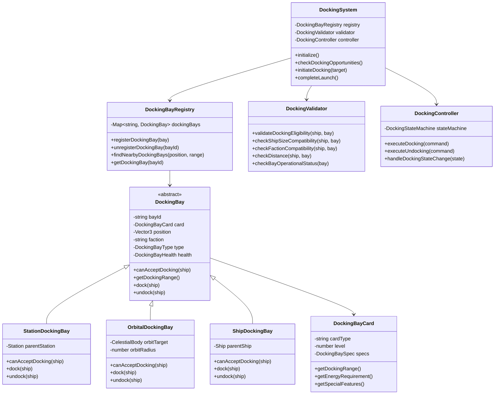
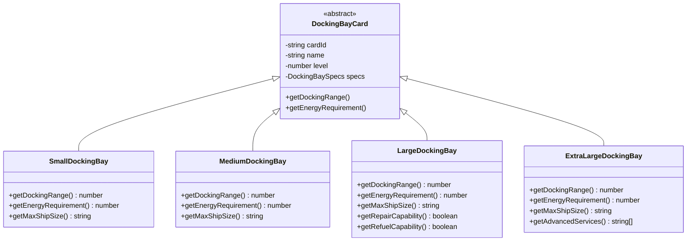
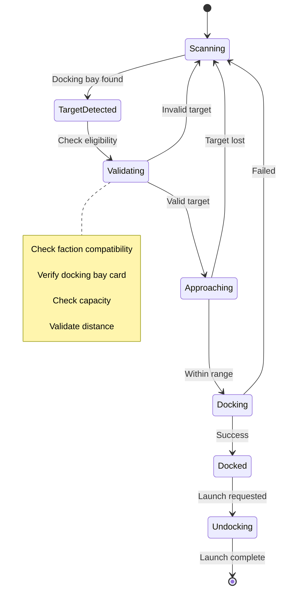
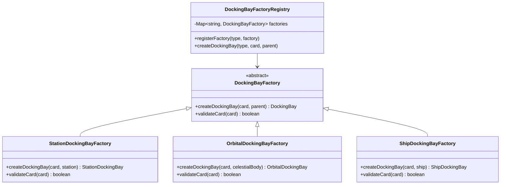
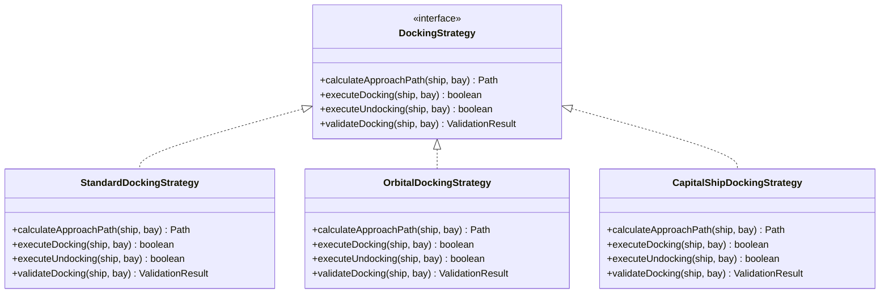
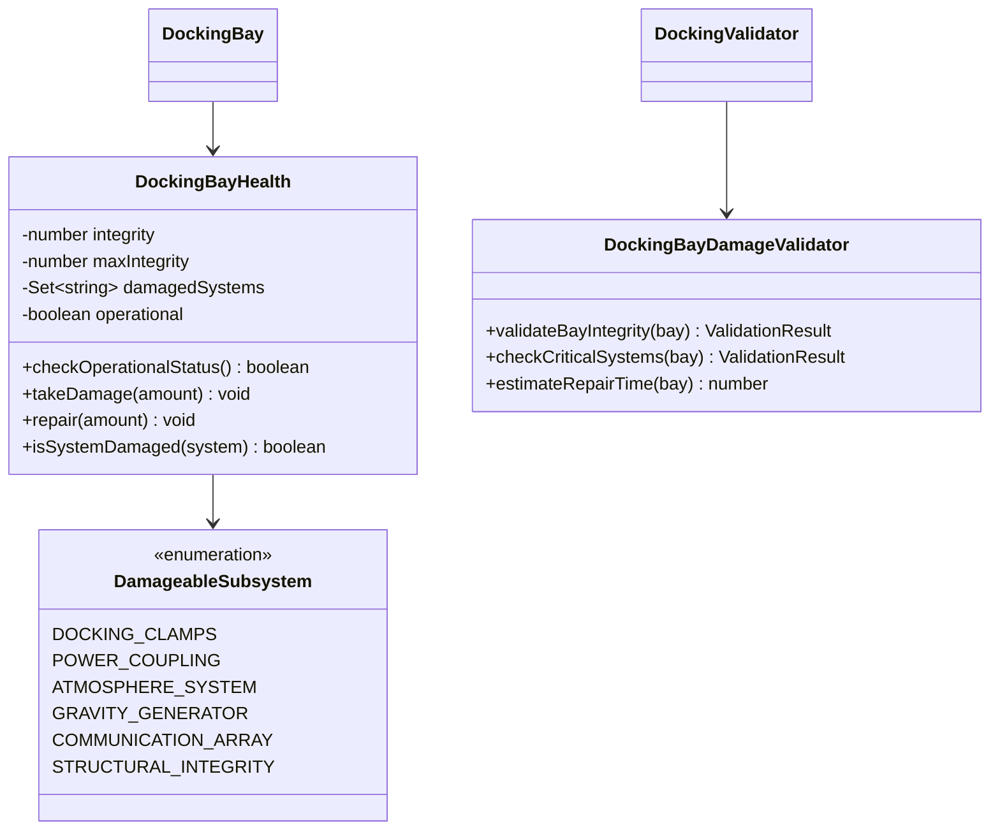
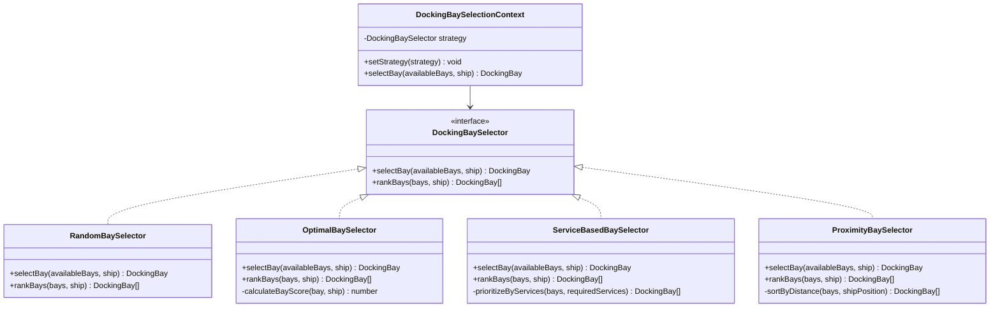
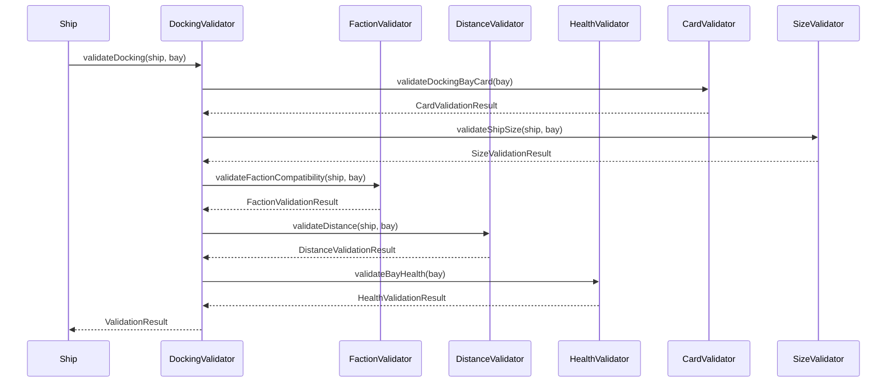
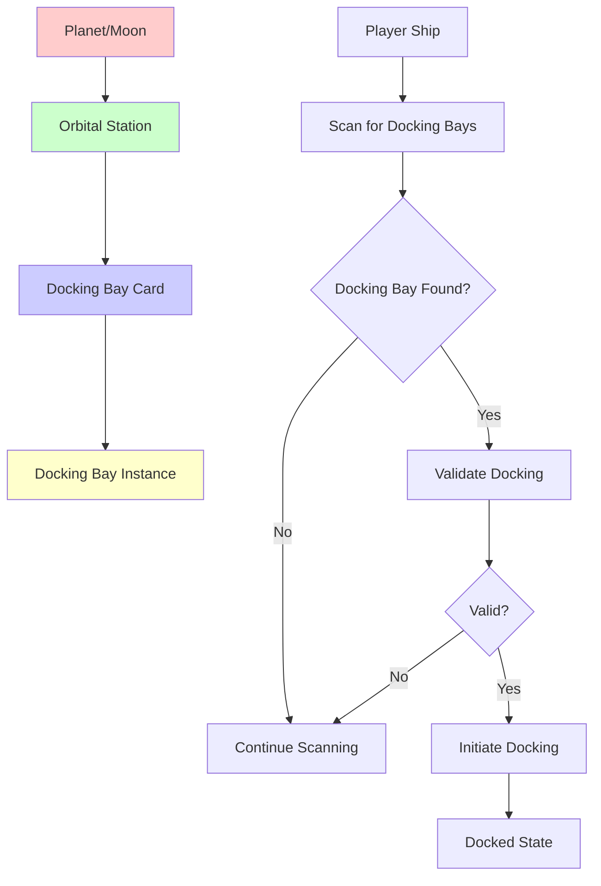
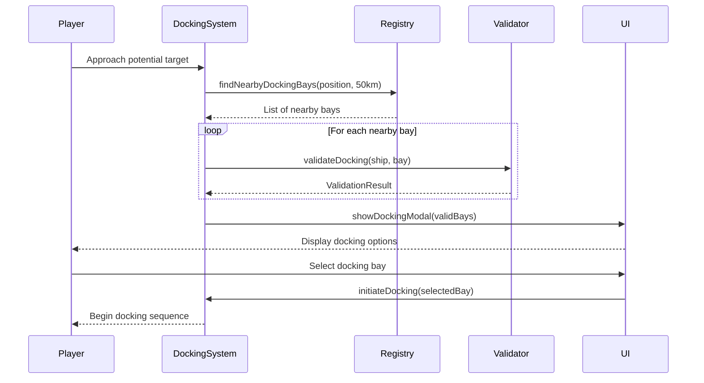

# Docking System Refactor Specification

## 🎯 Overview

This specification outlines a complete refactor of the docking system to eliminate multiple code paths, introduce card-based docking requirements, and create a clean, maintainable architecture using established design patterns.

## 📋 Requirements

### **Functional Requirements**
1. **Backward Compatibility**: Meet all current docking/launch requirements without breaking existing functionality
2. **Card-Based Docking**: Stations and ships must have a "Docking Bay" card installed to be dockable
3. **Faction Security**: Enemy/hostile faction stations cannot be docked with
4. **Orbital Stations**: Replace planet/moon docking with orbital stations/docking bays
5. **Clean Architecture**: Use design patterns to eliminate multiple code paths and bug-prone solutions

### **Non-Functional Requirements**
- **Performance**: No degradation in docking detection or processing
- **Maintainability**: Single code path for all docking operations
- **Extensibility**: Easy to add new docking bay types and behaviors
- **Testability**: Clear separation of concerns for unit testing

## 🏗️ Architecture Overview

### **Design Patterns Used**
- **Strategy Pattern**: Different docking bay types with unique behaviors
- **Factory Pattern**: Creation of docking bay instances
- **Observer Pattern**: Docking state change notifications
- **Command Pattern**: Docking operations as executable commands
- **State Pattern**: Docking process state management

### **Core Components**



## 🃏 Card System Integration

### **Docking Bay Card Types**



### **Card Specifications**

| Card Type | Level | Range | Energy | Ship Size Accommodated |
|-----------|-------|-------|--------|------------------------|
| Small Docking Bay | 1-3 | 2.0km | 500 | Small ships only |
| Medium Docking Bay | 2-4 | 2.5km | 600 | Small to Medium ships |
| Large Docking Bay | 3-5 | 3.0km | 750 | Small to Large ships |
| Extra Large Docking Bay | 4-5 | 4.0km | 1000 | Small to Extra Large ships |

### **Advanced Systems Slot Class**

Docking bay cards belong to a new **"Advanced Systems"** slot class that will only be available on Large+ ships and all stations. This specialized slot type accommodates high-power, space-intensive systems that smaller vessels cannot support.

#### **Slot Availability by Ship Size**
| Ship Size | Basic Slots | Weapon Slots | Utility Slots | **Advanced Systems Slots** |
|-----------|-------------|--------------|---------------|---------------------------|
| **Small** | ✅ | ✅ | ✅ | ❌ |
| **Medium** | ✅ | ✅ | ✅ | ❌ |
| **Large** | ✅ | ✅ | ✅ | ✅ (1-2 slots) |
| **Extra-Large** | ✅ | ✅ | ✅ | ✅ (2-4 slots) |
| **Stations** | ✅ | ✅ | ✅ | ✅ (4-8 slots) |

#### **Advanced Systems Card Types**
The Advanced Systems slot class will accommodate:

| Card Category | Examples | Description |
|---------------|----------|-------------|
| **Docking Systems** | Small/Medium/Large/Extra Large Docking Bay | Ship-to-ship and ship-to-station docking capabilities |
| **Advanced Scanners** | Long Range Deep Space Scanner, Quantum Sensor Array | High-power scanning and detection systems |
| **Heavy Weapons** | Capital Ship Railgun, Plasma Lance, Heavy Torpedo Bay | Weapons too large/power-hungry for standard weapon slots |
| **Specialized Systems** | Jump Drive, Cloaking Device, Tractor Beam | Unique capabilities requiring significant space/power |

### **Ship Size Classification**

The docking system will classify ships into size categories that determine docking bay compatibility:

| Size Class | Ship Types | Examples |
|------------|------------|----------|
| **Small** | Fighters, Scouts, Light vessels | Starter Ship, Light Fighter, Light Freighter, Scout, Interceptor |
| **Medium** | Heavy fighters, Heavy Freighter | Heavy Fighter, Heavy Freighter, Recon Ship, Mining Ship, Heavy Tanker |
| **Large** | Super Freighters | Battlecruiser, Super Tanker |
| **Extra-Large** | Massive vessels, Carriers | Dreadnought, Supercarrier, Titan-class |

### **Docking Bay Compatibility Matrix**

| Docking Bay Type | Small | Medium | Large | Extra-Large |
|------------------|-------|--------|-------|-------------|
| Small Docking Bay | ✅ | ❌ | ❌ | ❌ |
| Medium Docking Bay | ✅ | ✅ | ❌ | ❌ |
| Large Docking Bay | ✅ | ✅ | ✅ | ❌ |
| Extra Large Docking Bay | ✅ | ✅ | ✅ | ✅ |

## 🔄 Docking Process State Machine



## 🏭 Factory Pattern Implementation

### **Docking Bay Factory**



## 🎯 Strategy Pattern for Docking Behaviors

### **Docking Strategy Interface**



## 🔧 Docking Bay Health & Damage System

### **Bay Operational Status**

Since docking bays are targetable sub-systems, we need comprehensive health monitoring:



### **Operational Status Thresholds**

| Integrity Level | Status | Docking Capability | Special Conditions |
|----------------|---------|-------------------|-------------------|
| 100% - 80% | Fully Operational | Normal operations | All services available |
| 79% - 60% | Minor Damage | Normal operations | Some services degraded |
| 59% - 40% | Moderate Damage | Limited operations | Emergency services only |
| 39% - 20% | Major Damage | Emergency only | Life support systems |
| 19% - 1% | Critical Damage | No docking | Bay quarantined |
| 0% | Destroyed | No docking | Bay offline |

### **Damage System Integration**

```javascript
class DockingBayDamageValidator {
    validateBayIntegrity(bay) {
        const health = bay.health;
        const result = new ValidationResult();
        
        // Check if bay is operational
        if (!health.operational) {
            result.addReason('Docking bay is offline - repairs required');
            return result;
        }
        
        // Check critical systems
        const criticalSystems = ['DOCKING_CLAMPS', 'POWER_COUPLING', 'ATMOSPHERE_SYSTEM'];
        for (const system of criticalSystems) {
            if (health.isSystemDamaged(system)) {
                result.addReason(`Critical system damaged: ${system}`);
                return result;
            }
        }
        
        // Check integrity threshold
        const integrityPercent = (health.integrity / health.maxIntegrity) * 100;
        if (integrityPercent < 20) {
            result.addReason('Docking bay integrity too low for safe operations');
            return result;
        }
        
        // Add warnings for degraded systems
        if (integrityPercent < 60) {
            result.addWarning('Docking bay showing signs of damage - limited services available');
        }
        
        result.canDock = true;
        return result;
    }
}
```

## 🎯 Multiple Docking Bay Selection Strategy

### **Bay Selection Strategy Pattern**



### **Selection Strategy Implementations**

```javascript
// MVP Implementation: Random Selection
class RandomBaySelector {
    selectBay(availableBays, ship) {
        if (availableBays.length === 0) return null;
        
        // Filter to operational bays only
        const operationalBays = availableBays.filter(bay => 
            bay.health.operational && bay.health.integrity > bay.health.maxIntegrity * 0.2
        );
        
        if (operationalBays.length === 0) return null;
        
        // Select random operational bay
        const randomIndex = Math.floor(Math.random() * operationalBays.length);
        return operationalBays[randomIndex];
    }
    
    rankBays(bays, ship) {
        // Shuffle array for random ordering
        const shuffled = [...bays];
        for (let i = shuffled.length - 1; i > 0; i--) {
            const j = Math.floor(Math.random() * (i + 1));
            [shuffled[i], shuffled[j]] = [shuffled[j], shuffled[i]];
        }
        return shuffled;
    }
}

// Advanced Implementation: Optimal Selection
class OptimalBaySelector {
    selectBay(availableBays, ship) {
        const rankedBays = this.rankBays(availableBays, ship);
        return rankedBays.length > 0 ? rankedBays[0] : null;
    }
    
    rankBays(bays, ship) {
        return bays
            .filter(bay => bay.health.operational)
            .map(bay => ({
                bay,
                score: this.calculateBayScore(bay, ship)
            }))
            .sort((a, b) => b.score - a.score)
            .map(item => item.bay);
    }
    
    calculateBayScore(bay, ship) {
        let score = 0;
        
        // Health score (0-50 points)
        const integrityPercent = (bay.health.integrity / bay.health.maxIntegrity) * 100;
        score += integrityPercent * 0.5;
        
        // Service compatibility (0-35 points)
        const requiredServices = ship.getRequiredServices();
        const availableServices = bay.getAvailableServices();
        const serviceMatch = requiredServices.filter(service => 
            availableServices.includes(service)
        ).length / requiredServices.length;
        score += serviceMatch * 35;
        
        // Distance score (0-15 points)
        const distance = ship.position.distanceTo(bay.position);
        const maxRange = bay.getDockingRange();
        score += Math.max(0, (maxRange - distance) / maxRange) * 15;
        
        return score;
    }
}
```

### **Selection Strategy Configuration**

```javascript
// Strategy selection based on station type and player preferences
class DockingBaySelectionContext {
    constructor() {
        this.strategies = {
            'random': new RandomBaySelector(),
            'optimal': new OptimalBaySelector(),
            'proximity': new ProximityBaySelector(),
            'service_based': new ServiceBasedBaySelector()
        };
        
        // Default strategy for MVP
        this.currentStrategy = this.strategies.random;
    }
    
    setStrategy(strategyName, config = {}) {
        if (this.strategies[strategyName]) {
            this.currentStrategy = this.strategies[strategyName];
            if (config) {
                this.currentStrategy.configure(config);
            }
        }
    }
    
    selectBay(availableBays, ship) {
        return this.currentStrategy.selectBay(availableBays, ship);
    }
}
```

## 🔄 Legacy Card Replacement

### **Docking System Card Migration**

After implementing the new card-based docking system, existing "docking_system" cards will need to be replaced with the new docking bay cards compatible with the refactored system. This will be a one-time replacement that maps legacy cards to appropriate new card types:

- **docking_system Level 1-2** → **small_docking_bay**
- **docking_system Level 3-5** → **medium_docking_bay**

This replacement will maintain the same functionality while enabling the new card-based docking bay features such as operational status tracking, service-specific capabilities, and multiple bay selection strategies.

## 🔍 Validation System

### **Validation Chain**



## 🌍 Orbital Station System

### **Replacing Planet/Moon Docking**



### **Orbital Station Configuration**

```javascript
// Example orbital station configuration
const orbitalStationConfig = {
    stationId: "terra_prime_orbital_1",
    name: "Terra Prime Orbital Station",
    parentBody: "terra_prime",
    orbitRadius: 6.0, // km from planet surface
    orbitSpeed: 0.1, // orbital velocity
    faction: "terran_republic_alliance",
    stationType: "orbital_platform",
    dockingBays: [
        {
            cardType: "large_docking_bay",
            level: 3,
            position: { x: 0, y: 0, z: 100 }, // Relative to station
            orientation: { x: 0, y: 0, z: 0 }
        },
        {
            cardType: "medium_docking_bay",
            level: 2,
            position: { x: 0, y: 0, z: -100 },
            orientation: { x: 0, y: Math.PI, z: 0 }
        }
    ]
};
```

## 🏪 Service Migration to Orbital Stations

### **Mission & Market Service Transfer**

When replacing planet/moon docking with orbital stations, all services previously offered on celestial bodies will need to be transferred to their new orbital stations. This will be a one-time search and replace operation that updates location references:

- **Terra Prime** missions/markets → **Terra Prime Orbital Station**
- **Luna** mining contracts/markets → **Luna Orbital Platform**
- **Europa** research missions/data → **Europa Research Station**

The migration will ensure that all mission objectives, market prices, commodity availability, and faction relationships are preserved at the new orbital station locations while maintaining the same game functionality.

## 🔧 Implementation Plan

### **Phase 1: Core Infrastructure**
1. **Create base classes**: `DockingBay`, `DockingBayCard`, `DockingSystem`
2. **Implement factory pattern**: `DockingBayFactory` and registry
3. **Create validation system**: `DockingValidator` with chain of responsibility
4. **Implement state machine**: `DockingStateMachine` for process control

### **Phase 2: Card Integration & Replacement**
1. **Define docking bay card types**: Basic, Advanced, Cargo, Military
2. **Integrate with existing card system**: Extend `NFTCard` for docking bays
3. **Create card validation**: Ensure only valid cards create docking bays
4. **Implement card-based behaviors**: Range, energy requirements, services
5. **Implement bay health/damage system**: Add operational status tracking
6. **Create bay selection strategies**: Random (MVP) and optimal selection algorithms
7. **One-time legacy card replacement**: Replace existing docking_system cards with new docking bay cards

### **Phase 3: Orbital Station System & Service Migration**
1. **Create orbital station generator**: Replace planet/moon docking points
2. **Implement orbital mechanics**: Stations orbit parent bodies
3. **Generate default stations**: Ensure all previously dockable bodies have orbital stations
4. **One-time service migration**: Update location references from planets/moons to orbital stations

### **Phase 4: Strategy Implementation**
1. **Implement docking strategies**: Standard, Orbital, Capital Ship
2. **Create approach path calculation**: Smart pathing to docking bays
3. **Implement docking animations**: Smooth visual transitions
4. **Add audio/visual feedback**: Enhanced user experience

### **Phase 5: Testing & Integration**
1. **Unit tests**: All components individually tested
2. **Integration tests**: Full docking scenarios
3. **Performance testing**: Ensure no degradation
4. **User acceptance testing**: Verify all requirements met

## 📊 Data Structures

### **Docking Bay Registry**

```javascript
class DockingBayRegistry {
    constructor() {
        this.dockingBays = new Map(); // bayId -> DockingBay
        this.spatialIndex = new SpatialIndex(); // For efficient proximity queries
        this.factionIndex = new Map(); // faction -> Set<bayId>
    }
    
    registerDockingBay(bay) {
        this.dockingBays.set(bay.bayId, bay);
        this.spatialIndex.add(bay.position, bay.bayId);
        
        if (!this.factionIndex.has(bay.faction)) {
            this.factionIndex.set(bay.faction, new Set());
        }
        this.factionIndex.get(bay.faction).add(bay.bayId);
    }
    
    findNearbyDockingBays(position, range, factionFilter = null) {
        const nearbyIds = this.spatialIndex.query(position, range);
        const nearbyBays = [];
        
        for (const bayId of nearbyIds) {
            const bay = this.dockingBays.get(bayId);
            if (bay && (!factionFilter || bay.faction === factionFilter)) {
                nearbyBays.push(bay);
            }
        }
        
        return nearbyBays.sort((a, b) => 
            a.position.distanceTo(position) - b.position.distanceTo(position)
        );
    }
}
```

### **Validation Result Structure**

```javascript
class ValidationResult {
    constructor(canDock = false, reasons = [], warnings = []) {
        this.canDock = canDock;
        this.reasons = reasons; // Array of failure reasons
        this.warnings = warnings; // Array of warnings
        this.metadata = {}; // Additional validation data
    }
    
    addReason(reason) {
        this.reasons.push(reason);
        this.canDock = false;
    }
    
    addWarning(warning) {
        this.warnings.push(warning);
    }
    
    isValid() {
        return this.canDock && this.reasons.length === 0;
    }
}
```

## 🎮 User Experience

### **Docking Detection Flow**



## 🔒 Security & Faction System

### **Faction Compatibility Matrix**

```javascript
const FACTION_COMPATIBILITY = {
    'terran_republic_alliance': {
        friendly: ['terran_republic_alliance', 'zephyrian_collective', 'free_trader_consortium'],
        neutral: ['draconis_imperium', 'nexus_corporate_syndicate', 'ethereal_wanderers'],
        hostile: ['crimson_raider_clans', 'shadow_consortium', 'void_cult']
    },
    // ... other factions
};

class FactionValidator {
    validateFactionCompatibility(ship, dockingBay) {
        const shipFaction = ship.faction || 'independent';
        const bayFaction = dockingBay.faction;
        
        // Check if bay faction is hostile to ship faction
        const compatibility = FACTION_COMPATIBILITY[shipFaction];
        if (compatibility && compatibility.hostile.includes(bayFaction)) {
            return new ValidationResult(false, ['Hostile faction - docking denied']);
        }
        
        // Military docking bays may have enhanced security protocols
        const bayCard = dockingBay.card;
        if (bayCard.cardType === 'extra_large_docking_bay') {
            // Enhanced security checks for military bays
            if (compatibility && compatibility.neutral.includes(bayFaction)) {
                return new ValidationResult(false, ['Military bay requires higher clearance level']);
            }
        }
        
        return new ValidationResult(true);
    }
}

class ShipSizeValidator {
    validateShipSize(ship, dockingBay) {
        const shipSize = ship.getSize(); // 'small', 'medium', 'large', 'extra-large'
        const bayCard = dockingBay.card;
        const maxShipSize = bayCard.getMaxShipSize();
        
        const sizeHierarchy = ['small', 'medium', 'large', 'extra-large'];
        const shipSizeIndex = sizeHierarchy.indexOf(shipSize);
        const maxSizeIndex = this.getMaxSizeIndex(bayCard.cardType);
        
        if (shipSizeIndex > maxSizeIndex) {
            return new ValidationResult(false, [`Ship too large for docking bay: ${shipSize} ship cannot dock at ${bayCard.cardType}`]);
        }
        
        return new ValidationResult(true);
    }
    
    getMaxSizeIndex(bayType) {
        const bayTypeLimits = {
            'small_docking_bay': 0,     // small only
            'medium_docking_bay': 1,    // up to medium
            'large_docking_bay': 2,     // up to large
            'extra_large_docking_bay': 3  // up to extra-large
        };
        
        return bayTypeLimits[bayType] || 0; // default to small only
    }
}
```

## 📈 Performance Considerations

### **Spatial Indexing**
- Use octree or similar spatial data structure for efficient proximity queries
- Update spatial index only when docking bays move (rare for stations)
- Cache validation results for frequently accessed docking bays

### **Memory Management**
- Pool docking bay objects to reduce garbage collection
- Lazy load docking bay details until needed
- Unload distant docking bays from memory

## 🧪 Testing Strategy

### **Unit Tests**
- **DockingBayFactory**: Test creation of all bay types
- **DockingValidator**: Test all validation scenarios
- **DockingBayRegistry**: Test registration and queries
- **Card Integration**: Test card-based behavior

### **Integration Tests**
- **Full docking sequence**: From detection to completion
- **Faction compatibility**: Test all faction combinations
- **Orbital mechanics**: Test orbital station behavior
- **Error handling**: Test failure scenarios

### **Performance Tests**
- **Large scale**: Test with 100+ docking bays
- **Concurrent docking**: Multiple ships docking simultaneously
- **Memory usage**: Monitor for memory leaks
- **Frame rate**: Ensure no FPS impact

## 🚀 Migration Strategy

### **Simplified Non-Persistent Approach**
Since the current system doesn't persist data, the migration is simplified:

1. **Generate orbital stations**: Create stations for previously dockable bodies (planets/moons)
2. **One-time card replacement**: Replace legacy `docking_system` cards with new `docking_bay` cards
3. **One-time service migration**: Update mission/market location references to new orbital stations
4. **Maintain session state**: Preserve current docking status during active sessions

### **Implementation Approach**
1. **Phase 1**: Implement new docking system alongside old system
2. **Phase 2**: Switch all docking operations to new system  
3. **Phase 3**: One-time replacement of legacy docking_system cards
4. **Phase 4**: Remove old docking system code and optimize

## 📁 Static Data Management

### **JSON-Based Configuration**

All static docking system data should be stored in JSON files rather than hard-coded to improve maintainability and allow for easy modification without code changes.

#### **Recommended JSON File Structure**
```
/static/data/
├── docking/
│   ├── docking_bay_cards.json          # Card specifications and stats
│   ├── ship_size_classifications.json   # Ship size mappings
│   ├── faction_compatibility.json       # Faction relationship matrix
│   └── validation_rules.json           # Docking validation parameters
├── stations/
│   ├── orbital_stations.json           # Orbital station configurations
│   ├── space_stations.json             # Deep space station configurations
│   └── docking_bay_layouts.json        # Station-specific docking bay configs
└── ships/
    └── ship_specifications.json        # Ship size classifications and stats
```

#### **Benefits of JSON-Based Configuration**
- **Easy modification**: Update docking rules without code changes
- **Data validation**: JSON schema validation for configuration integrity
- **Version control**: Track configuration changes separately from code
- **Localization**: Support for multiple language configurations
- **Hot reloading**: Reload configurations during development without restart

## 📝 Configuration Examples

### **Docking Bay Card Specifications** (`/static/data/docking/docking_bay_cards.json`)

```json
{
  "docking_bay_cards": {
    "small_docking_bay": {
      "levels": [
        { "level": 1, "range": 2000, "energy": 500, "maxShipSize": "small" },
        { "level": 2, "range": 2000, "energy": 450, "maxShipSize": "small" },
        { "level": 3, "range": 2000, "energy": 400, "maxShipSize": "small" }
      ]
    },
    "medium_docking_bay": {
      "levels": [
        { "level": 2, "range": 2500, "energy": 600, "maxShipSize": "medium" },
        { "level": 3, "range": 2500, "energy": 550, "maxShipSize": "medium" },
        { "level": 4, "range": 2500, "energy": 500, "maxShipSize": "medium" }
      ]
    },
    "large_docking_bay": {
      "levels": [
        { "level": 3, "range": 3000, "energy": 750, "maxShipSize": "large" },
        { "level": 4, "range": 3000, "energy": 700, "maxShipSize": "large" },
        { "level": 5, "range": 3000, "energy": 650, "maxShipSize": "large" }
      ],
      "services": ["repair", "refuel"]
    },
    "extra_large_docking_bay": {
      "levels": [
        { "level": 4, "range": 4000, "energy": 1000, "maxShipSize": "extra_large" },
        { "level": 5, "range": 4000, "energy": 900, "maxShipSize": "extra_large" }
      ],
      "services": ["repair", "refuel", "advanced_services"]
    }
  }
}
```

### **Ship Size Classifications** (`/static/data/ships/ship_specifications.json`)

```json
{
  "ship_size_classifications": {
    "small": {
      "description": "Fighters, Scouts, Light vessels",
      "ships": [
        "starter_ship",
        "light_fighter", 
        "light_freighter",
        "scout",
        "interceptor"
      ],
      "advanced_systems_slots": 0
    },
    "medium": {
      "description": "Heavy fighters, Heavy Freighter",
      "ships": [
        "heavy_fighter",
        "heavy_freighter", 
        "recon_ship",
        "mining_ship",
        "heavy_tanker"
      ],
      "advanced_systems_slots": 0
    },
    "large": {
      "description": "Super Freighters",
      "ships": [
        "battlecruiser",
        "super_tanker"
      ],
      "advanced_systems_slots": 2
    },
    "extra_large": {
      "description": "Massive vessels, Carriers",
      "ships": [
        "dreadnought",
        "supercarrier",
        "titan_class"
      ],
      "advanced_systems_slots": 4
    }
  }
}
```

### **Faction Compatibility Matrix** (`/static/data/docking/faction_compatibility.json`)

```json
{
  "faction_relationships": {
    "terran_republic_alliance": {
      "friendly": ["terran_republic_alliance", "zephyrian_collective"],
      "neutral": ["independent_traders", "mining_consortium"],
      "hostile": ["pirate_federation", "rogue_ai_collective"]
    },
    "zephyrian_collective": {
      "friendly": ["zephyrian_collective", "terran_republic_alliance"],
      "neutral": ["independent_traders"],
      "hostile": ["pirate_federation", "shadow_syndicate"]
    },
    "pirate_federation": {
      "friendly": ["pirate_federation", "shadow_syndicate"],
      "neutral": ["independent_traders"],
      "hostile": ["terran_republic_alliance", "zephyrian_collective"]
    }
  },
  "docking_rules": {
    "hostile_factions_denied": true,
    "neutral_security_level": 1,
    "friendly_security_level": 0
  }
}
```

### **Station Docking Bay Configuration**

```json
{
    "stationId": "hermes_refinery",
    "dockingBays": [
        {
            "bayId": "hermes_main_bay",
            "cardType": "large_docking_bay",
            "level": 4,
            "position": { "x": 0, "y": 0, "z": 200 },
            "orientation": { "x": 0, "y": 0, "z": 0 },
            "services": ["refuel", "repair", "cargo_transfer"],
            "energyRequirement": 75
        },
        {
            "bayId": "hermes_cargo_bay",
            "cardType": "medium_docking_bay",
            "level": 3,
            "position": { "x": 150, "y": 0, "z": 0 },
            "orientation": { "x": 0, "y": 1.57, "z": 0 },
            "services": ["cargo_transfer"],
            "energyRequirement": 60
        }
    ]
}
```

### **Orbital Station Configuration**

```json
{
    "stationId": "terra_prime_orbital",
    "name": "Terra Prime Orbital Platform",
    "parentBody": "terra_prime",
    "stationType": "orbital_platform",
    "orbitRadius": 6.0,
    "orbitSpeed": 0.05,
    "faction": "terran_republic_alliance",
    "dockingBays": [
        {
            "bayId": "orbital_bay_1",
            "cardType": "extra_large_docking_bay",
            "level": 5,
            "position": { "x": 0, "y": 100, "z": 0 },
            "factionRestrictions": ["terran_republic_alliance", "zephyrian_collective"],
            "securityLevel": 3
        }
    ]
}
```

## 🎯 Success Criteria

### **Functional Success**
- ✅ All existing docking functionality preserved
- ✅ Card-based docking system implemented
- ✅ Faction security enforced
- ✅ Orbital stations replace planet/moon docking
- ✅ All mission/market services transferred to orbital stations
- ✅ Single code path for all docking operations

### **Technical Success**
- ✅ No performance degradation
- ✅ Memory usage within acceptable limits
- ✅ 100% test coverage for core components
- ✅ Clean, maintainable code architecture
- ✅ Extensible design for future enhancements

### **User Experience Success**
- ✅ Intuitive docking bay selection
- ✅ Clear feedback on docking status
- ✅ Smooth visual transitions
- ✅ Consistent behavior across all scenarios
- ✅ Enhanced immersion with orbital mechanics

---

This refactored docking system will provide a solid foundation for future enhancements while eliminating the current complexity and maintenance burden of multiple code paths.
