# Docking System Sequence Diagram

This document contains a Mermaid sequence diagram showing the complete docking and launching process flow in the Planetz game.

## Docking and Launching Process Flow

```mermaid
sequenceDiagram
    participant Player
    participant DockingModal
    participant StarfieldManager
    participant SimpleDockingManager
    participant SpatialManager
    participant DockingInterface
    participant Camera

    Note over Player, Camera: DOCKING PROCESS

    %% DockingModal self-monitoring (key difference from original diagram)
    DockingModal->>DockingModal: checkDockingConditions() (every 100ms)
    Note right of DockingModal: Checks: isDocked=false, isVisible=false,<br/>dockingInitiated=false & dockingInProgress=false (NEW FIX),<br/>undockCooldown expired, speed≤1
    DockingModal->>DockingModal: findNearbyDockableObjects()
    DockingModal->>SpatialManager: queryNearby(shipPosition, dockingRange)
    SpatialManager-->>DockingModal: nearbyObjects[]
    DockingModal->>DockingModal: checkDockingEligibility(ship, target)
    
    alt Docking conditions met
        DockingModal->>DockingModal: show(target, targetInfo, distance)
        DockingModal-->>Player: Display docking modal
    else No docking opportunities
        Note right of DockingModal: Continue monitoring
    end

    %% User initiates docking
    Player->>DockingModal: Click DOCK button
    DockingModal->>DockingModal: handleDock() - immediate race condition prevention
    
    %% RACE CONDITION FIX: Set temporary flag to prevent modal reappearing
    DockingModal->>DockingModal: dockingInitiated = true (IMMEDIATE)
    Note over DockingModal: Critical fix: Temporary flag prevents modal<br/>from reappearing during docking initiation
    
    DockingModal->>DockingModal: hide() - modal disappears immediately
    DockingModal->>StarfieldManager: dockWithDebug(target)

    %% StarfieldManager docking delegation
    StarfieldManager->>StarfieldManager: dock(target)
    
    alt SimpleDockingManager available
        StarfieldManager->>SimpleDockingManager: initiateDocking(target)
        SimpleDockingManager->>SimpleDockingManager: checkDockingEligibility(ship, target)
        SimpleDockingManager->>SpatialManager: getMetadata(target)
        SpatialManager-->>SimpleDockingManager: targetMetadata
        
        alt Docking eligible
            SimpleDockingManager->>SimpleDockingManager: dockingInProgress = true (natural flow)
            SimpleDockingManager->>StarfieldManager: targetSpeed = 0, currentSpeed = 0
            SimpleDockingManager->>SimpleDockingManager: animateDockingApproach(ship, target)
            SimpleDockingManager->>Camera: animate position to target + offset
            Camera-->>SimpleDockingManager: Animation complete
            SimpleDockingManager->>SimpleDockingManager: completeDocking(target)
            SimpleDockingManager->>SimpleDockingManager: isDocked = true, dockingInProgress = false
            SimpleDockingManager->>SimpleDockingManager: stopDockingMonitoring()
            SimpleDockingManager->>StarfieldManager: showDockingInterface(target)
            StarfieldManager->>DockingInterface: show(target)
            DockingInterface-->>Player: Display station interface
        else Docking not eligible
            SimpleDockingManager->>StarfieldManager: showHUDError(reason)
            SimpleDockingManager->>SimpleDockingManager: dockingInProgress = false
        end
    else Fallback to legacy docking
        StarfieldManager->>StarfieldManager: canDockWithLogging(target)
        StarfieldManager->>StarfieldManager: completeDockingStation(target)
        StarfieldManager->>DockingInterface: show(target)
        DockingInterface-->>Player: Display station interface
    end

    Note over Player, Camera: STATION INTERACTION

    Player->>DockingInterface: Interact with station services
    DockingInterface->>DockingInterface: Handle repairs, trading, missions, etc.

    Note over Player, Camera: LAUNCHING PROCESS

    Player->>DockingInterface: Click LAUNCH button
    DockingInterface->>DockingInterface: handleLaunch()
    DockingInterface->>DockingInterface: hide()
    DockingInterface->>StarfieldManager: undock()
    
    alt SimpleDockingManager docked
        StarfieldManager->>SimpleDockingManager: launchFromStation()
        SimpleDockingManager->>SimpleDockingManager: launchInProgress = true
        SimpleDockingManager->>SimpleDockingManager: calculateLaunchPosition()
        SimpleDockingManager->>SimpleDockingManager: animateLaunch()
        SimpleDockingManager->>SimpleDockingManager: completeLaunch()
        SimpleDockingManager->>SimpleDockingManager: isDocked = false, launchInProgress = false
        SimpleDockingManager->>SimpleDockingManager: lastLaunchTime = Date.now() (cooldown start)
        SimpleDockingManager->>SimpleDockingManager: startDockingMonitoring()
    else Legacy undocking
        StarfieldManager->>StarfieldManager: isDocked = false
        StarfieldManager->>StarfieldManager: calculateSafeLaunchDistance(launchTarget)
        Note right of StarfieldManager: Calculates distance to avoid nearby dockable objects<br/>Considers docking ranges + safety buffers<br/>Ensures ship launches outside all docking zones
        StarfieldManager->>Camera: Position ship at safe distance facing away
        StarfieldManager->>StarfieldManager: undockCooldown = Date.now() + 10000 (10s cooldown)
        StarfieldManager->>StarfieldManager: currentTarget = null, targetIndex = -1
        StarfieldManager->>StarfieldManager: targetSpeed = 1, currentSpeed = 1 (gentle launch)
        StarfieldManager->>StarfieldManager: animateUndocking()
    end
    
    StarfieldManager-->>Player: Return to space view

    Note over Player, Camera: MODAL SUPPRESSION MECHANISMS

    Note over DockingModal: Multiple suppression layers prevent immediate modal reappearance:
    
    DockingModal->>DockingModal: checkDockingConditions() (every 100ms)
    
    alt Check #1: Docked State
        DockingModal->>StarfieldManager: Check isDocked
        alt Still docked
            Note right of DockingModal: Skip all checks - no modal while docked
        end
    end
    
    alt Check #2: Undock Cooldown (10 seconds)
        DockingModal->>StarfieldManager: Check undockCooldown vs Date.now()
        alt Cooldown active
            Note right of DockingModal: Skip all checks - prevents immediate re-docking<br/>Gives player time to move away
        end
    end
    
    alt Check #3: Speed Check
        DockingModal->>StarfieldManager: Check currentSpeed
        alt Speed > 1
            Note right of DockingModal: Skip modal - player moving too fast<br/>Prevents modal during launch acceleration
        end
    end
    
    alt Check #4: Distance Check
        DockingModal->>DockingModal: findNearbyDockableObjects()
        DockingModal->>SpatialManager: queryNearby(shipPosition, dockingRange)
        SpatialManager-->>DockingModal: nearbyObjects[]
        alt No objects in range
            Note right of DockingModal: No modal - ship positioned outside docking range<br/>Safe launch distance calculation worked
        end
    end
    
    alt Check #5: Target Cooldowns
        DockingModal->>DockingModal: Check cancelledTargets Map
        alt Target has active cooldown (30s)
            Note right of DockingModal: Skip modal - prevents spam after cancellation
        end
        DockingModal->>DockingModal: Check failureCooldowns Map  
        alt Target has failure cooldown (5s)
            Note right of DockingModal: Skip modal - prevents spam after failed docking
        end
    end

    Note over Player, Camera: MONITORING RESUMES WHEN SAFE

    alt All suppression checks pass
        DockingModal->>DockingModal: show(newTarget, targetInfo, distance)
        Note right of DockingModal: Modal only appears when:<br/>• Not docked<br/>• Undock cooldown expired<br/>• Speed ≤ 1<br/>• Within docking range<br/>• No target cooldowns active
    else Any suppression active
        Note right of DockingModal: Modal remains hidden<br/>Continue monitoring
    end
```

## Key Components

### DockingModal (Primary Controller)
- **Primary Role**: Self-monitoring docking system controller and UI
- **Key Methods**: 
  - `checkDockingConditions()` - Continuous monitoring every 100ms
  - `findNearbyDockableObjects()` - Proximity detection
  - `show()` - Display modal when conditions met
  - `handleDock()` - Process user docking request
- **Key Features**:
  - **Self-contained monitoring** - Does NOT rely on SimpleDockingManager for detection
  - Race condition prevention via immediate modal hiding
  - Target preservation with verification IDs
  - Cooldown system to prevent modal spam
  - Comprehensive error handling and fallback logic

### SimpleDockingManager
- **Primary Role**: Docking execution and animation (when available)
- **Key Methods**: 
  - `initiateDocking()` - Execute docking sequence
  - `checkDockingEligibility()` - Validate docking conditions
  - `animateDockingApproach()` - Camera animation
  - `completeDocking()` - Finalize docking state
  - `launchFromStation()` - Handle launching process
- **Note**: Optional component - StarfieldManager has fallback docking logic

### StarfieldManager
- **Primary Role**: Docking system coordinator and fallback handler
- **Key Methods**:
  - `dock()` - Main docking entry point
  - `undock()` - Main launching entry point
  - `initializeSimpleDocking()` - Initialize SimpleDockingManager if needed
  - `completeDockingStation()` - Legacy docking fallback
- **Dual System**: Supports both SimpleDockingManager and legacy docking

### SpatialManager
- **Primary Role**: Object tracking and proximity queries
- **Key Methods**:
  - `queryNearby()` - Find objects within range
  - `getMetadata()` - Retrieve object information

### DockingInterface
- **Primary Role**: Station services interface
- **Key Features**:
  - Repairs, trading, missions
  - Ship configuration management
  - Launch functionality via `handleLaunch()`

## Critical Architecture Differences from Original Diagram

### 1. **DockingModal is the Primary Controller**
- **Reality**: DockingModal monitors proximity and triggers itself
- **Original Assumption**: SimpleDockingManager controlled the process

### 2. **No "showDockingPrompt" Method**
- **Reality**: DockingModal directly calls its own `show()` method
- **Original Assumption**: SimpleDockingManager called StarfieldManager.showDockingPrompt()

### 3. **Dual Docking Systems**
- **Reality**: StarfieldManager supports both SimpleDockingManager and legacy docking
- **Original Assumption**: Only SimpleDockingManager was used

### 4. **Launch Process Delegation**
- **Reality**: DockingInterface.handleLaunch() → StarfieldManager.undock() → SimpleDockingManager.launchFromStation()
- **Original Assumption**: StarfieldManager.launch() was the entry point

## State Management

### Critical Flags
- `isDocked` - Player is currently docked (multiple locations)
- `dockingInProgress` - Docking sequence active (SimpleDockingManager)
- `launchInProgress` - Launch sequence active (SimpleDockingManager)
- `currentDockingTarget` - Currently targeted dockable object
- `isVisible` - Modal visibility state (DockingModal)

### Modal Suppression & Race Condition Prevention

#### **6-Layer Modal Suppression System**
1. **Docked State Check**: No modal while `isDocked = true`
2. **Docking Initiation Check**: No modal while `dockingInitiated = true` or `dockingInProgress = true` (**NEW FIX**)
3. **Undock Cooldown (10s)**: Prevents immediate re-docking after launch
4. **Speed Check**: No modal when `currentSpeed > 1` (prevents modal during acceleration)
5. **Distance Check**: Ship positioned outside docking range via `calculateSafeLaunchDistance()`
6. **Target Cooldowns**: 
   - **Cancelled targets**: 30-second cooldown after user cancellation
   - **Failed docking**: 5-second cooldown after docking failures

#### **Safe Launch Positioning**
- **`calculateSafeLaunchDistance()`**: Analyzes all nearby dockable objects
- **Safety Buffers**: Adds 2km buffer beyond each object's docking range
- **Multi-object Awareness**: Considers all planets/moons/stations in proximity
- **Forward Facing**: Ship launched facing away from station
- **Gentle Launch**: Initial speed set to impulse 1 for controlled departure

#### **Race Condition Prevention**

**🚨 Critical Race Condition Fix (Latest)**
- **Problem**: Modal reappeared immediately after DOCK button click
- **Root Cause**: Gap between modal hiding and SimpleDockingManager setting `dockingInProgress = true`
- **Solution**: Set temporary `dockingInitiated = true` flag in DockingModal BEFORE hiding modal
- **Result**: Monitoring system blocked during docking initiation, SimpleDockingManager handles actual docking flow

**Additional Protections**
- **DockingModal**: Immediately hides modal on DOCK button click
- **Target Verification**: Uses verification IDs to prevent target loss
- **Multiple Target References**: Backup and restore mechanisms
- **State Cleanup**: Clears targets and buttons after undocking
- **Debug Logging**: Tracks suppression events to prevent log spam

## Supported Dockable Objects
- **Stations**: Require `canDock` flag, use configurable docking range
- **Planets**: Inherently dockable, 4.0km docking range
- **Moons**: Inherently dockable, 1.5km docking range

## Error Handling
- Missing metadata fallback via name lookup
- Docking eligibility validation (distance, approach angle)
- Target restoration from multiple backup references
- Graceful failure with user feedback
- State cleanup on errors
- Comprehensive logging for debugging
