# Enemy AI Implementation Plan

## Overview

This document outlines a comprehensive implementation plan for the Enemy AI system based on the specifications in `enemy_ai_spec.md`. The plan is designed to integrate seamlessly with the existing Planetz codebase while maintaining performance and the retro aesthetic.

## Architecture Overview

### Core AI Components

```
EnemyAIManager
├── EncounterSpawner          # Spawns and manages encounters
├── FlockingSystem            # Handles boid-based movement
├── CombatAISystem            # Manages combat decisions
├── FactionManager            # Handles faction relationships
└── SpatialPartitionSystem    # Optimizes spatial queries
```

### Integration Points

The AI system will integrate with existing systems:
- **EnemyShip.js**: Add AI state and behavior properties
- **StarfieldManager.js**: Coordinate AI updates with game loop
- **PhysicsManager.js**: Handle AI movement and collision
- **WeaponSystem**: AI weapon usage and targeting
- **ProximityDetector3D**: AI ships appear on radar

## Phase 1: Core Foundation (Week 1-2)

### Architecture Overview


### 1.1 EnemyAI Base Class
**File**: `frontend/static/js/ai/EnemyAI.js`

```javascript
export class EnemyAI {
    constructor(ship, aiConfig) {
        this.ship = ship;
        this.config = aiConfig;
        this.state = 'idle';
        this.behaviorWeights = {};
        this.sensors = new SensorSystem(ship);
        this.stateMachine = new AIStateMachine();
    }
}
```

**Integration**: Extend existing `EnemyShip.js` to include AI instance

### 1.2 AI Configuration System
**File**: `frontend/static/js/ai/AIConfigs.js`

Ship-specific AI configurations matching the specification tables:

```javascript
export const AI_CONFIGS = {
    scout: {
        sensorRange: 2000,
        behaviorWeights: {
            separation: 0.8,
            alignment: 0.2,
            cohesion: 0.2,
            pursuit: 0.1,
            evasion: 0.9,
            orbiting: 0.8
        },
        combatThresholds: {
            fleeHealth: 0.3,
            engageRange: 1500
        }
    },
    // ... other ship types
};
```

### 1.3 State Machine Framework
**File**: `frontend/static/js/ai/AIStateMachine.js`

Finite state machine implementing the 5 states from spec:


States and transitions:
- Idle, Engage, Evade, Flee, Buzz

```javascript
export class AIStateMachine {
    constructor() {
        this.currentState = 'idle';
        this.states = new Map();
        this.transitionRules = new Map();
    }
    
    update(deltaTime, context) {
        const currentState = this.states.get(this.currentState);
        const newState = currentState.update(deltaTime, context);
        
        if (newState !== this.currentState) {
            this.transition(newState, context);
        }
    }
}
```

## Phase 2: Flocking and Movement (Week 3-4)

### 2.1 Flocking System
**File**: `frontend/static/js/ai/FlockingSystem.js`

Implementation of Craig Reynolds' boid model for 3D space:

```mermaid
graph TD
    A["Ship Instance"] --> B["FlockingBehavior"]
    B --> C["Separation<br/>Avoid Crowding"]
    B --> D["Alignment<br/>Match Group Velocity"]
    B --> E["Cohesion<br/>Move to Group Center"]
    B --> F["Pursuit<br/>Chase Target"]
    B --> G["Evasion<br/>Avoid Threats"]
    B --> H["Orbiting<br/>Circle Target"]
    
    I["Sensor System"] --> J["Detect Neighbors<br/>Range: 1000-2000m"]
    I --> K["Detect Threats<br/>Enemy Ships"]
    I --> L["Detect Targets<br/>Player/Neutrals"]
    
    J --> C
    J --> D
    J --> E
    K --> G
    L --> F
    L --> H
    
    M["Weight Calculator"] --> N["Ship Type Weights<br/>Scout: High Separation<br/>Fighter: Balanced<br/>Carrier: High Cohesion"]
    M --> O["State Modifier<br/>Combat: ↑ Evasion<br/>Formation: ↑ Alignment"]
    M --> P["Health Modifier<br/>Low Health: ↑ Flee"]
    
    N --> B
    O --> B
    P --> B
    
    B --> Q["Force Accumulator"]
    Q --> R["Apply to Ship Physics<br/>Thrust Vector"]
```



```javascript
export class FlockingSystem {
    constructor() {
        this.entities = [];
        this.spatialGrid = new SpatialHashGrid(1000); // 1km cells
    }
    
    calculateSeparation(entity, neighbors) {
        // Avoid crowding - repulsion vector
    }
    
    calculateAlignment(entity, neighbors) {
        // Match velocity with neighbors
    }
    
    calculateCohesion(entity, neighbors) {
        // Move toward center of mass
    }
    
    calculatePursuit(entity, target) {
        // Predictive targeting
    }
    
    calculateEvasion(entity, threat) {
        // Avoid threats
    }
    
    calculateOrbiting(entity, target, distance) {
        // Circular movement around target
    }
}
```

### 2.2 Spatial Optimization
**File**: `frontend/static/js/ai/SpatialHashGrid.js`

Optimize neighbor queries using spatial partitioning:

```javascript
export class SpatialHashGrid {
    constructor(cellSize) {
        this.cellSize = cellSize;
        this.grid = new Map();
    }
    
    insert(entity) {
        const hash = this.hash(entity.position);
        if (!this.grid.has(hash)) {
            this.grid.set(hash, []);
        }
        this.grid.get(hash).push(entity);
    }
    
    query(position, radius) {
        // Return nearby entities efficiently
    }
}
```

## Phase 3: Combat AI (Week 5-6)

### 3.1 Combat Decision System
**File**: `frontend/static/js/ai/CombatAI.js`

```javascript
export class CombatAI {
    constructor(ship) {
        this.ship = ship;
        this.threatAssessment = new ThreatAssessment();
        this.weaponController = new AIWeaponController(ship);
    }
    
    update(deltaTime) {
        const threats = this.threatAssessment.evaluateThreats();
        const primaryTarget = this.selectTarget(threats);
        
        if (primaryTarget) {
            this.engageTarget(primaryTarget, deltaTime);
        }
    }
    
    engageTarget(target, deltaTime) {
        // Weapon firing logic
        // Tactical positioning
        // Evasive maneuvers
    }
}
```

### 3.2 Threat Assessment
**File**: `frontend/static/js/ai/ThreatAssessment.js`

```javascript
export class ThreatAssessment {
    evaluateThreats(ship, detectedEntities) {
        return detectedEntities
            .filter(entity => this.isHostile(entity, ship))
            .map(entity => ({
                entity,
                threatLevel: this.calculateThreatLevel(entity, ship),
                distance: ship.position.distanceTo(entity.position)
            }))
            .sort((a, b) => b.threatLevel - a.threatLevel);
    }
    
    calculateThreatLevel(entity, ship) {
        // Distance, firepower, faction consideration
        const distanceFactor = 1 / Math.max(0.1, entity.distance / 1000);
        const firepowerFactor = entity.currentFirepower / 100;
        const healthFactor = entity.currentHull / entity.maxHull;
        
        return distanceFactor * firepowerFactor * healthFactor;
    }
}
```

## Phase 4: Faction System (Week 7)

### 4.1 Faction Manager
**File**: `frontend/static/js/ai/FactionManager.js`

```javascript
export class FactionManager {
    constructor() {
        this.factions = new Map();
        this.relationships = new Map(); // faction1_faction2 -> disposition
    }
    
    getDisposition(faction1, faction2) {
        const key = `${faction1}_${faction2}`;
        return this.relationships.get(key) || 'neutral';
    }
    
    setDisposition(faction1, faction2, disposition) {
        // Update faction relationships
        // Handle dynamic shifts (neutral -> hostile)
    }
    
    isHostile(ship1, ship2) {
        return this.getDisposition(ship1.faction, ship2.faction) === 'hostile';
    }
}
```

### 4.2 Faction Behaviors
**File**: `frontend/static/js/ai/FactionBehaviors.js`

Implement specific behaviors for each disposition:
- **Friendly**: Escort, defend, assist
- **Neutral**: Buzz maneuver, inspect, ignore
- **Hostile**: Attack, pursue, prioritize threats

## Phase 5: Encounter System (Week 8-9)

### 5.1 Encounter Spawner
**File**: `frontend/static/js/ai/EncounterSpawner.js`

```javascript
export class EncounterSpawner {
    constructor(starfieldManager) {
        this.starfieldManager = starfieldManager;
        this.activeEncounters = [];
        this.spawnRules = new Map();
    }
    
    spawnEncounter(type, position, playerLevel) {
        switch(type) {
            case 'solo':
                return this.spawnSoloEncounter(position, playerLevel);
            case 'patrol':
                return this.spawnPatrolEncounter(position, playerLevel);
            case 'formation':
                return this.spawnFormationEncounter(position, playerLevel);
        }
    }
    
    spawnPatrolEncounter(position, playerLevel) {
        const shipCount = 2 + Math.floor(Math.random() * 4); // 2-5 ships
        const ships = [];
        
        for (let i = 0; i < shipCount; i++) {
            const shipType = this.selectShipType('patrol', playerLevel);
            const ship = this.createAIShip(shipType, position);
            ships.push(ship);
        }
        
        // Set up formation and AI coordination
        return new PatrolEncounter(ships);
    }
}
```

### 5.2 Formation Manager
**File**: `frontend/static/js/ai/FormationManager.js`

```javascript
export class FormationManager {
    constructor() {
        this.formations = new Map();
        this.initializeFormationPatterns();
    }
    
    initializeFormationPatterns() {
        this.formations.set('v_formation', new VFormation());
        this.formations.set('line_formation', new LineFormation());
        this.formations.set('sphere_escort', new SphereEscort());
        this.formations.set('cylinder_escort', new CylinderEscort());
    }
    
    assignFormationPositions(ships, formationType, leader) {
        const formation = this.formations.get(formationType);
        return formation.assignPositions(ships, leader);
    }
}
```

### Formation Patterns

```mermaid
graph TB
    subgraph "V-Formation (Patrol)"
        A1["🚀 Leader<br/>Heavy Fighter"] 
        B1["🚀 Wing 1<br/>Light Fighter"]
        C1["🚀 Wing 2<br/>Light Fighter"]
        D1["🚀 Wing 3<br/>Scout"]
        A1 --> B1
        A1 --> C1
        A1 --> D1
    end
    
    subgraph "Escort Formation (Convoy)"
        A2["📦 Freighter<br/>Protected Ship"]
        B2["🚀 Escort 1<br/>Heavy Fighter"]
        C2["🚀 Escort 2<br/>Heavy Fighter"]
        D2["🚀 Scout<br/>Perimeter"]
        B2 --> A2
        C2 --> A2
        D2 --> A2
    end
    
    subgraph "Carrier Battle Group"
        A3["🛸 Carrier<br/>Command Ship"]
        B3["🚀 Fighter 1<br/>Deployed"]
        C3["🚀 Fighter 2<br/>Deployed"]
        D3["🚀 Heavy Fighter<br/>Escort"]
        E3["📦 Support Ship<br/>Freighter"]
        A3 --> B3
        A3 --> C3
        A3 --> D3
        A3 --> E3
    end
```



## Phase 6: Carrier Operations (Week 10)

### 6.1 Carrier AI Controller
**File**: `frontend/static/js/ai/CarrierAI.js`

```javascript
export class CarrierAI extends EnemyAI {
    constructor(ship, aiConfig) {
        super(ship, aiConfig);
        this.launchedFighters = [];
        this.maxFighters = 6;
        this.launchCooldown = 0;
        this.landingBayHealth = 1.0;
    }
    
    update(deltaTime) {
        super.update(deltaTime);
        
        this.manageFighters(deltaTime);
        this.checkWarpConditions();
    }
    
    launchFighter() {
        if (this.canLaunchFighter()) {
            const fighter = this.createFighter();
            this.launchedFighters.push(fighter);
            this.launchCooldown = 30 + Math.random() * 30; // 30-60 seconds
        }
    }
    
    checkWarpConditions() {
        const hullPercent = this.ship.currentHull / this.ship.maxHull;
        
        if (hullPercent < 0.2 || this.landingBayHealth < 0.1) {
            this.initiateWarpOut();
        }
    }
}
```

### 6.2 Cargo and Drop System
**File**: `frontend/static/js/ai/CargoSystem.js`

Implements freighter cargo mechanics from spec:

```javascript
export class CargoSystem {
    constructor() {
        this.cargoTypes = {
            basic: { value: 100, rarity: 0.7, name: "Basic Supplies" },
            rare: { value: 500, rarity: 0.25, name: "Rare Materials" },
            exotic: { value: 1000, rarity: 0.05, name: "Exotic Components" }
        };
    }
    
    // Freighters drop cargo when heavily damaged
    dropCargo(ship, reason = 'damage') {
        const cargoCount = ship.type === 'heavy_freighter' ? 3 : 1;
        const drops = [];
        
        for (let i = 0; i < cargoCount; i++) {
            const cargo = this.generateCargo(ship.type, reason);
            drops.push(this.createCargoContainer(cargo, ship.position));
        }
        
        return drops;
    }
    
    generateCargo(shipType, reason) {
        // Heavy freighters have higher chance of rare cargo
        const rareChanceMultiplier = shipType === 'heavy_freighter' ? 2.0 : 1.0;
        
        for (const [type, data] of Object.entries(this.cargoTypes)) {
            const adjustedRarity = data.rarity * rareChanceMultiplier;
            if (Math.random() < adjustedRarity) {
                return { type, ...data };
            }
        }
        
        return this.cargoTypes.basic; // Fallback
    }
}
```

### 6.3 Communication and Threat Reporting System
**File**: `frontend/static/js/ai/CommunicationSystem.js`

AI ships share threat intelligence as specified:

```javascript
export class AICommunicationSystem {
    constructor() {
        this.threatReports = new Map();
        this.communicationRange = 5000; // 5km range for subspace radio
    }
    
    // Scouts report player position to patrols, call for backup
    reportThreat(reportingShip, threat, threatType) {
        const report = {
            threat: threat,
            type: threatType,
            position: threat.position.clone(),
            timestamp: Date.now(),
            reporter: reportingShip,
            urgency: this.calculateUrgency(reportingShip, threat)
        };
        
        // Find nearby allies with subspace radio
        const allies = this.findAlliesInRange(reportingShip.position);
        allies.forEach(ally => {
            if (ally.hasSubspaceRadio()) {
                ally.receiveThreatReport(report);
            }
        });
        
        // Scouts call for backup when attacked
        if (reportingShip.type === 'scout' && threatType === 'hostile_attack') {
            this.requestBackup(reportingShip, threat);
        }
    }
    
    requestBackup(requestingShip, threat) {
        // Find nearest patrol within communication range
        const nearestPatrol = this.findNearestPatrol(requestingShip.position);
        if (nearestPatrol && nearestPatrol.distance < this.communicationRange) {
            nearestPatrol.patrol.receiveBackupRequest(requestingShip, threat);
        }
    }
}
```

### 6.4 Enhanced Buzzing Behavior System
**File**: `frontend/static/js/ai/BuzzingBehavior.js`

Detailed implementation of neutral ship buzzing mechanics:

```javascript
export class BuzzingBehavior {
    constructor(ship) {
        this.ship = ship;
        this.buzzDistance = 500; // 500m orbiting distance
        this.buzzDuration = 10000; // 10 seconds
        this.buzzStartTime = 0;
        this.originalTarget = null;
    }
    
    startBuzz(target) {
        this.originalTarget = target;
        this.buzzStartTime = Date.now();
        this.ship.setState('buzz');
        
        console.log(`${this.ship.name} initiating buzz maneuver on ${target.name}`);
    }
    
    updateBuzz(deltaTime, target) {
        const elapsed = Date.now() - this.buzzStartTime;
        
        if (elapsed > this.buzzDuration) {
            this.endBuzz();
            return;
        }
        
        // Calculate orbital position around target
        const angle = (elapsed / 1000) * 0.5; // 0.5 radians per second
        const offset = new THREE.Vector3(
            Math.cos(angle) * this.buzzDistance,
            0,
            Math.sin(angle) * this.buzzDistance
        );
        
        const targetPosition = target.position.clone().add(offset);
        this.ship.navigateTo(targetPosition);
    }
    
    endBuzz() {
        this.ship.setState('idle');
        console.log(`${this.ship.name} buzz maneuver complete, resuming patrol`);
    }
}
```

### 6.5 Dynamic Faction System
**File**: `frontend/static/js/ai/DynamicFactionSystem.js`

Implements faction disposition changes as specified:

```javascript
export class DynamicFactionSystem {
    constructor() {
        this.factionRelations = new Map();
        this.dispositionChangeEvents = [];
    }
    
    // Neutral ships become hostile if attacked by player
    handleAttackEvent(attacker, victim) {
        if (attacker.isPlayer && victim.faction === 'neutral') {
            this.changeFactionDisposition(victim, 'hostile');
            
            // Nearby neutral ships of same faction also become hostile
            const nearbyNeutrals = this.findNearbyFactionMembers(victim, 2000);
            nearbyNeutrals.forEach(ship => {
                if (ship.disposition === 'neutral') {
                    this.changeFactionDisposition(ship, 'hostile');
                }
            });
        }
    }
    
    changeFactionDisposition(ship, newDisposition) {
        const oldDisposition = ship.disposition;
        ship.disposition = newDisposition;
        
        // Log faction change for debugging
        console.log(`${ship.name} faction changed: ${oldDisposition} -> ${newDisposition}`);
        
        // Update AI behavior based on new disposition
        ship.ai.updateBehaviorForDisposition(newDisposition);
    }
}
```

## Phase 7: Performance Optimization (Week 11)

### 7.1 AI Manager
**File**: `frontend/static/js/ai/EnemyAIManager.js`

Central coordinator that manages all AI systems:

```javascript
export class EnemyAIManager {
    constructor(starfieldManager) {
        this.starfieldManager = starfieldManager;
        this.aiEntities = [];
        this.flockingSystem = new FlockingSystem();
        this.encounterSpawner = new EncounterSpawner(starfieldManager);
        this.factionManager = new FactionManager();
        
        // Performance optimization
        this.updateRate = {
            flocking: 1000 / 15,    // 15 Hz
            combat: 1000 / 10,      // 10 Hz
            faction: 1000 / 3       // 3 Hz
        };
        this.lastUpdate = {
            flocking: 0,
            combat: 0,
            faction: 0
        };
    }
    
    update(deltaTime) {
        const now = Date.now();
        
        // Variable update rates for performance
        if (now - this.lastUpdate.flocking > this.updateRate.flocking) {
            this.updateFlocking(deltaTime);
            this.lastUpdate.flocking = now;
        }
        
        if (now - this.lastUpdate.combat > this.updateRate.combat) {
            this.updateCombat(deltaTime);
            this.lastUpdate.combat = now;
        }
        
        if (now - this.lastUpdate.faction > this.updateRate.faction) {
            this.updateFactionLogic(deltaTime);
            this.lastUpdate.faction = now;
        }
    }
}
```

### 7.2 Level-of-Detail (LOD) System
**File**: `frontend/static/js/ai/AILODSystem.js`

```javascript
export class AILODSystem {
    constructor() {
        this.lodLevels = {
            high: { distance: 5000, updateRate: 60 },    // Full AI within 5km
            medium: { distance: 20000, updateRate: 15 },  // Reduced AI 5-20km
            low: { distance: 50000, updateRate: 3 },      // Minimal AI 20-50km
            culled: { distance: Infinity, updateRate: 0 } // No AI beyond 50km
        };
    }
    
    getLODLevel(ship, playerPosition) {
        const distance = ship.position.distanceTo(playerPosition);
        
        for (const [level, config] of Object.entries(this.lodLevels)) {
            if (distance <= config.distance) {
                return level;
            }
        }
        return 'culled';
    }
}
```

## Phase 8: Integration & Polish (Week 12)

### 8.1 StarfieldManager Integration
**Modifications to**: `frontend/static/js/views/StarfieldManager.js`

```javascript
// Add to StarfieldManager constructor
this.enemyAIManager = new EnemyAIManager(this);

// Add to update loop
update(deltaTime) {
    // ... existing code ...
    
    // Update AI systems
    if (this.enemyAIManager) {
        this.enemyAIManager.update(deltaTime);
    }
}

// Add encounter spawning methods
spawnRandomEncounter() {
    const playerPosition = this.camera.position;
    const spawnDistance = 10000 + Math.random() * 20000; // 10-30km away
    const spawnPosition = this.generateSpawnPosition(playerPosition, spawnDistance);
    
    const encounterType = this.selectEncounterType();
    this.enemyAIManager.encounterSpawner.spawnEncounter(encounterType, spawnPosition, this.playerLevel);
}
```

### 8.2 Physics Integration
**Modifications to**: `frontend/static/js/PhysicsManager.js`

```javascript
// Add AI ship physics bodies
createAIShipPhysicsBody(ship, position) {
    const shape = new this.Ammo.btSphereShape(3.0); // 3m radius
    const transform = new this.Ammo.btTransform();
    transform.setIdentity();
    transform.setOrigin(new this.Ammo.btVector3(position.x, position.y, position.z));
    
    const motionState = new this.Ammo.btDefaultMotionState(transform);
    const inertia = new this.Ammo.btVector3(0, 0, 0);
    shape.calculateLocalInertia(100, inertia); // 100kg mass
    
    const rigidBody = new this.Ammo.btRigidBody(
        new this.Ammo.btRigidBodyConstructionInfo(100, motionState, shape, inertia)
    );
    
    // Tag as AI ship
    rigidBody.userData = { type: 'ai_ship', ship: ship };
    
    this.physicsWorld.addRigidBody(rigidBody);
    return rigidBody;
}
```

## Configuration Files

### AI Tuning Configuration
**File**: `frontend/static/data/ai_tuning.json`

```json
{
    "global": {
        "maxActiveEncounters": 3,
        "spawnDistanceMin": 10000,
        "spawnDistanceMax": 30000,
        "despawnDistance": 50000
    },
    "shipTypes": {
        "scout": {
            "sensorRange": 2000,
            "behaviorWeights": {
                "separation": 0.8,
                "alignment": 0.2,
                "cohesion": 0.2,
                "pursuit": 0.1,
                "evasion": 0.9,
                "orbiting": 0.8
            },
            "combatThresholds": {
                "fleeHealthPercent": 0.3,
                "engageRange": 1500,
                "buzzDistance": 500
            }
        }
    },
    "formations": {
        "patrol_v": {
            "spacing": 200,
            "flexibility": 0.3
        },
        "escort_sphere": {
            "radius": 500,
            "verticalSpread": 100
        }
    }
}
```

## Testing Strategy

### Unit Tests
- **FlockingSystem**: Test separation, alignment, cohesion calculations
- **ThreatAssessment**: Verify threat level calculations
- **StateMachine**: Test state transitions
- **FormationManager**: Validate formation position calculations

### Integration Tests
- **AI-Physics Integration**: Verify AI ships move correctly in physics world
- **Combat Scenarios**: Test various encounter types
- **Performance Tests**: Measure frame rate with multiple AI ships

### Debugging Tools

```javascript
// AI Debug Visualization
export class AIDebugRenderer {
    constructor(scene) {
        this.scene = scene;
        this.debugLines = [];
    }
    
    visualizeFlockingVectors(ship) {
        // Draw separation, alignment, cohesion vectors as colored lines
    }
    
    showAIState(ship) {
        // Display current AI state above ship
    }
    
    showFormationStructure(formation) {
        // Draw formation pattern and ship positions
    }
}
```

## Performance Targets

- **Maximum AI Ships**: 20 concurrent without frame rate impact
- **Update Frequency**: 15 Hz for flocking, 10 Hz for combat
- **Memory Usage**: <50MB for AI systems
- **CPU Usage**: <10% for AI on recommended hardware

## Risk Mitigation

### Technical Risks
1. **Performance Impact**: Use LOD system and variable update rates
2. **Physics Integration Complexity**: Incremental integration with fallbacks
3. **Behavioral Complexity**: Start simple, iterate based on testing

### Design Risks
1. **AI Too Predictable**: Add randomization and personality quirks
2. **AI Too Aggressive**: Implement retreat behaviors and faction diplomacy
3. **Formation Breaking**: Robust formation recovery mechanisms

## Timeline Summary

| Phase | Duration | Key Deliverables |
|-------|----------|------------------|
| 1 | Week 1-2 | Core AI framework, state machine, configuration system |
| 2 | Week 3-4 | Flocking system, spatial optimization, basic movement |
| 3 | Week 5-6 | Combat AI, threat assessment, weapon integration |
| 4 | Week 7 | Faction system, diplomatic behaviors |
| 5 | Week 8-9 | Encounter spawning, formation management |
| 6 | Week 10 | Carrier operations, advanced ship behaviors |
| 7 | Week 11 | Performance optimization, LOD system |
| 8 | Week 12 | Integration, polish, debugging tools |

## Appendix: Card-Based Equipment System Integration

One critical aspect from the enemy AI specification that requires detailed implementation is the integration with the existing card-based gear system. As noted in the spec: *"Enemy Ships use the same gear cards as the player to equip their ships. Different ship types have different gear loadouts. This provides targetable systems for the players and enemy-ai to choose during combat based on strategies."*

### A.1 Enemy Ship Loadout System
**File**: `frontend/static/js/ai/EnemyLoadoutManager.js`

```javascript
export class EnemyLoadoutManager {
    constructor(cardSystemIntegration) {
        this.cardSystem = cardSystemIntegration;
        this.loadoutTemplates = new Map();
        this.loadPresetLoadouts();
    }
    
    // Generate appropriate card loadouts for each ship type
    generateLoadout(shipType, difficultyLevel = 1) {
        const template = this.loadoutTemplates.get(shipType);
        const loadout = {
            weapons: [],
            systems: [],
            utilities: []
        };
        
        // Select cards based on ship role and difficulty
        for (const weaponSlot of template.weaponSlots) {
            const weapon = this.selectWeaponCard(weaponSlot.type, difficultyLevel);
            if (weapon) loadout.weapons.push(weapon);
        }
        
        for (const systemSlot of template.systemSlots) {
            const system = this.selectSystemCard(systemSlot.type, difficultyLevel);
            if (system) loadout.systems.push(system);
        }
        
        return loadout;
    }
}
```

### A.2 Ship Type Loadout Templates

Based on the ship types in the specification, here are the recommended card loadouts:

#### Scout Ship Loadout
- **Weapons**: 1x Light Laser (primary), 1x Missile Pod (backup)
- **Systems**: Long Range Scanner, Subspace Radio, Basic Thrusters
- **Characteristics**: High sensor range, fast engines, minimal weapons

```javascript
const SCOUT_LOADOUT = {
    weaponSlots: [
        { type: 'laser_cannon', required: true },
        { type: 'missile_pod', required: false }
    ],
    systemSlots: [
        { type: 'long_range_scanner', required: true },
        { type: 'subspace_radio', required: true },
        { type: 'impulse_engines', required: true },
        { type: 'shield_generator', required: false }
    ],
    maxCards: 6,
    difficultyScaling: 'sensors_and_speed'
};
```

#### Light Fighter Loadout
- **Weapons**: 2x Light Laser, 1x Missile Pod
- **Systems**: Basic Scanner, Subspace Radio, Combat Thrusters, Light Shields
- **Characteristics**: Balanced offense/defense, good maneuverability
- **No Warp Drive**: Deployed by carriers, limited to local sector

```javascript
const LIGHT_FIGHTER_LOADOUT = {
    weaponSlots: [
        { type: 'laser_cannon', required: true, count: 2 },
        { type: 'missile_pod', required: false }
    ],
    systemSlots: [
        { type: 'long_range_scanner', required: true },
        { type: 'subspace_radio', required: true },
        { type: 'impulse_engines', required: true },
        { type: 'shield_generator', required: false }
    ],
    maxCards: 7,
    difficultyScaling: 'balanced_combat'
};
```

#### Heavy Fighter Loadout  
- **Weapons**: 2x Heavy Laser, 1x Torpedo Launcher, 1x Point Defense
- **Systems**: Combat Scanner, Subspace Radio, Heavy Thrusters, Heavy Shields, Low-Level Warp Drive
- **Characteristics**: High firepower, heavy armor, moderate speed
- **Warp Capability**: Short sector jumps only

```javascript
const HEAVY_FIGHTER_LOADOUT = {
    weaponSlots: [
        { type: 'heavy_laser', required: true, count: 2 },
        { type: 'torpedo_launcher', required: true },
        { type: 'point_defense', required: true }
    ],
    systemSlots: [
        { type: 'long_range_scanner', required: true },
        { type: 'subspace_radio', required: true },
        { type: 'impulse_engines', required: true },
        { type: 'shield_generator', required: true },
        { type: 'warp_drive', required: true }
    ],
    maxCards: 9,
    difficultyScaling: 'firepower_focused'
};
```

#### Carrier Loadout
- **Weapons**: 4x Missile Launcher (defensive), 2x Point Defense
- **Systems**: Command Center, Fighter Bay, Heavy Shields, Mid-Level Warp Drive, Long Range Scanner, Subspace Radio
- **Special**: Landing Bay (targetable subsystem with separate health pool)
- **Characteristics**: Minimal offensive weapons, maximum support systems

```javascript
const CARRIER_LOADOUT = {
    weaponSlots: [
        { type: 'missile_launcher', required: true, count: 4 },
        { type: 'point_defense', required: true, count: 2 }
    ],
    systemSlots: [
        { type: 'strategic_computer', required: true },
        { type: 'landing_bay', required: true, targetable: true },
        { type: 'shield_generator', required: true },
        { type: 'warp_drive', required: true },
        { type: 'long_range_scanner', required: true },
        { type: 'subspace_radio', required: true }
    ],
    specialSystems: [
        { type: 'landing_bay', health: 0.3, critical: true } // 30% of ship health
    ],
    maxCards: 12,
    difficultyScaling: 'support_focused'
};
```

#### Light/Heavy Freighter Loadouts
- **Light Freighter**: 1x Basic Laser, Cargo Hold, Basic Scanner, Low-Level Warp Drive, Basic Shields
- **Heavy Freighter**: 2x Basic Laser, Large Cargo Hold, Combat Scanner, Mid-Level Warp Drive, Heavy Shields
- **Characteristics**: Cargo capacity, minimal weapons, escape-focused

```javascript
const LIGHT_FREIGHTER_LOADOUT = {
    weaponSlots: [
        { type: 'basic_laser', required: true }
    ],
    systemSlots: [
        { type: 'cargo_hold', required: true },
        { type: 'long_range_scanner', required: true },
        { type: 'warp_drive', required: true },
        { type: 'shield_generator', required: false }
    ],
    maxCards: 6,
    difficultyScaling: 'cargo_focused'
};

const HEAVY_FREIGHTER_LOADOUT = {
    weaponSlots: [
        { type: 'basic_laser', required: true, count: 2 }
    ],
    systemSlots: [
        { type: 'large_cargo_hold', required: true },
        { type: 'long_range_scanner', required: true },
        { type: 'warp_drive', required: true },
        { type: 'shield_generator', required: true }
    ],
    maxCards: 8,
    difficultyScaling: 'defensive_cargo'
};
```

### A.3 Targetable Systems Integration

Enemy ships equipped with cards create targetable subsystems that both the player and AI can exploit:

```javascript
export class EnemyTargetableSystem {
    constructor(ship, cardLoadout) {
        this.ship = ship;
        this.subsystems = this.generateSubsystems(cardLoadout);
        this.priorityTargets = this.calculatePriorityTargets();
    }
    
    generateSubsystems(loadout) {
        const subsystems = [];
        
        // Weapons become targetable
        loadout.weapons.forEach(weapon => {
            subsystems.push({
                type: 'weapon',
                name: weapon.name,
                health: weapon.durability,
                position: this.generateMountPosition(weapon),
                disablesFunction: 'combat_capability'
            });
        });
        
        // Critical systems
        loadout.systems.forEach(system => {
            if (system.targetable) {
                subsystems.push({
                    type: 'system',
                    name: system.name,
                    health: system.durability,
                    position: this.generateSystemPosition(system),
                    disablesFunction: system.function
                });
            }
        });
        
        return subsystems;
    }
    
    // AI uses this to select what to target on enemy ships
    calculatePriorityTargets() {
        return this.subsystems
            .filter(sys => sys.disablesFunction)
            .sort((a, b) => this.getThreatPriority(b) - this.getThreatPriority(a));
    }
    
    getThreatPriority(subsystem) {
        const priorities = {
            'weapons': 10,      // Disable enemy weapons first
            'shields': 8,       // Remove defenses
            'thrusters': 6,     // Reduce mobility
            'sensors': 4,       // Blind the enemy
            'warp_drive': 7,    // Prevent escape (carriers)
            'landing_bay': 9    // Critical for carriers
        };
        
        return priorities[subsystem.disablesFunction] || 1;
    }
}
```

### A.4 AI Tactical System Selection

The AI should make intelligent decisions about which enemy subsystems to target:

```javascript
export class AITacticalTargeting {
    constructor(aiShip) {
        this.ship = aiShip;
        this.targetingPriority = this.calculateTargetingPriority();
    }
    
    selectOptimalTarget(enemyShip) {
        const targetableSystems = enemyShip.getTargetableSystems();
        
        // Different ship types have different targeting priorities
        switch (this.ship.type) {
            case 'scout':
                // Scouts target sensors/comms to gather intel
                return this.prioritizeTargets(targetableSystems, ['sensors', 'comms']);
                
            case 'light_fighter':
                // Light fighters target weapons to reduce threat
                return this.prioritizeTargets(targetableSystems, ['weapons', 'thrusters']);
                
            case 'heavy_fighter':
                // Heavy fighters go for kills - target shields then hull
                return this.prioritizeTargets(targetableSystems, ['shields', 'weapons']);
                
            case 'carrier':
                // Carriers target propulsion to prevent escape
                return this.prioritizeTargets(targetableSystems, ['warp_drive', 'thrusters']);
        }
    }
}
```

### A.5 Dynamic Loadout Scaling

Enemy ships should have appropriately scaled equipment based on game progression:

```javascript
export class DifficultyScaledLoadouts {
    constructor() {
        this.scalingCurves = {
            weapons: {
                damage: (level) => 1 + (level * 0.15),      // 15% damage increase per level
                accuracy: (level) => Math.min(0.95, 0.6 + (level * 0.05)), // Max 95% accuracy
                firerate: (level) => 1 + (level * 0.1)      // 10% faster firing
            },
            systems: {
                shieldStrength: (level) => 1 + (level * 0.2),  // 20% stronger shields
                sensorRange: (level) => 1 + (level * 0.1),     // 10% better sensors
                thrusterPower: (level) => 1 + (level * 0.08)   // 8% faster engines
            }
        };
    }
    
    scaleLoadout(baseLoadout, playerLevel, regionDifficulty) {
        const effectiveLevel = Math.min(playerLevel + regionDifficulty, 10); // Cap at level 10
        
        return {
            weapons: baseLoadout.weapons.map(weapon => 
                this.scaleWeapon(weapon, effectiveLevel)
            ),
            systems: baseLoadout.systems.map(system => 
                this.scaleSystem(system, effectiveLevel)
            )
        };
    }
}
```

### A.6 Card Drop System

When enemy ships are destroyed, they should drop cards based on their loadout:

```javascript
export class EnemyCardDropSystem {
    constructor() {
        this.dropRates = {
            scout: { common: 0.3, uncommon: 0.1, rare: 0.02 },
            light_fighter: { common: 0.4, uncommon: 0.15, rare: 0.03 },
            heavy_fighter: { common: 0.5, uncommon: 0.2, rare: 0.05 },
            carrier: { common: 0.8, uncommon: 0.4, rare: 0.15 },
            freighter: { common: 0.6, uncommon: 0.25, rare: 0.08 }
        };
    }
    
    generateCardDrops(destroyedShip) {
        const drops = [];
        const shipType = destroyedShip.type;
        const loadout = destroyedShip.getLoadout();
        
        // Chance to drop equipped cards
        loadout.forEach(card => {
            const dropChance = this.getDropChance(card.rarity, shipType);
            if (Math.random() < dropChance) {
                // Damaged cards have reduced stats
                const droppedCard = this.createDamagedCard(card);
                drops.push(droppedCard);
            }
        });
        
        return drops;
    }
}
```

### A.7 Implementation Integration Points

To integrate this card system with the AI implementation:

1. **Phase 1 Enhancement**: Extend `EnemyAI.js` to include loadout management
2. **Phase 3 Enhancement**: Integrate targetable systems with combat AI
3. **Phase 5 Enhancement**: Add loadout generation to encounter spawning
4. **Phase 6 Enhancement**: Implement carrier-specific card loadouts for fighter launching

```javascript
// Enhanced EnemyAI constructor
constructor(ship, aiConfig) {
    this.ship = ship;
    this.config = aiConfig;
    this.loadout = this.generateLoadout(ship.type, ship.difficultyLevel);
    this.targetableSystems = new EnemyTargetableSystem(ship, this.loadout);
    this.tacticalTargeting = new AITacticalTargeting(this);
    // ... existing code
}
```

This card-based equipment integration ensures that:
- Enemy ships use the same progression system as the player
- Combat has strategic depth through targetable subsystems  
- AI can make intelligent targeting decisions
- Players are rewarded with equipment drops
- Difficulty scaling feels natural and consistent

## Formation Patterns and Tactical Behaviors

### Formation Definitions
**File**: `frontend/static/js/ai/FormationPatterns.js`

Based on the specification's encounter types, implement structured formation patterns:

```javascript
export const FORMATION_PATTERNS = {
    // Solo encounters - no formation
    solo: { 
        pattern: 'independent',
        spacing: 0,
        roles: ['any']
    },
    
    // Patrol formations (2-5 ships)
    patrol_v_formation: {
        pattern: 'v_shape',
        spacing: 300, // 300m between ships
        roles: ['scout', 'light_fighter', 'heavy_fighter'],
        leadership: 'heavy_fighter' // Heavy fighter leads if present
    },
    
    patrol_line_formation: {
        pattern: 'line_abreast',
        spacing: 250,
        roles: ['light_fighter', 'scout'],
        leadership: 'first_ship'
    },
    
    // Large formations (6-12 ships)
    convoy_escort: {
        pattern: 'spherical_escort',
        spacing: 400,
        centerShip: 'freighter', // Freighter or carrier at center
        escorts: ['heavy_fighter', 'light_fighter'],
        perimeter: ['scout']
    },
    
    carrier_formation: {
        pattern: 'carrier_defensive',
        spacing: 500,
        centerShip: 'carrier',
        innerRing: ['heavy_fighter'], // 2-4 heavy fighters close escort
        outerRing: ['light_fighter', 'scout'], // Perimeter patrol
        fighters: 'launched_on_threat' // Additional fighters launched when threatened
    }
};
```

### Tactical Modifiers Implementation

Based on the specification's tactical behaviors:

```javascript
export class TacticalBehaviors {
    // Flanking: Light fighters attempt to flank targets
    calculateFlankingPosition(attacker, target) {
        const targetVelocity = target.velocity.clone();
        const sideVector = targetVelocity.clone().cross(new THREE.Vector3(0, 1, 0));
        
        // Position to the side and slightly behind
        const flankPosition = target.position.clone()
            .add(sideVector.normalize().multiplyScalar(800))
            .add(targetVelocity.clone().negate().multiplyScalar(200));
            
        return flankPosition;
    }
    
    // Swarm Tactics: Multiple light fighters coordinate attacks
    coordinateSwarmAttack(swarmShips, target) {
        const attackVectors = this.generateAttackVectors(swarmShips.length);
        
        swarmShips.forEach((ship, index) => {
            const attackPosition = target.position.clone()
                .add(attackVectors[index].multiplyScalar(600));
            ship.setTacticalTarget(attackPosition);
        });
    }
    
    // Defensive Posture: Heavy fighters protect allies
    calculateDefensivePosition(protector, protectedShip, threat) {
        const threatVector = threat.position.clone().sub(protectedShip.position);
        const defensePosition = protectedShip.position.clone()
            .add(threatVector.normalize().multiplyScalar(-400)); // Position between threat and ally
            
        return defensePosition;
    }
}

## Success Criteria

### Minimum Viable Product (MVP)
- ✅ Basic AI ships that can move and fight
- ✅ Simple flocking behaviors (separation, alignment, cohesion)
- ✅ State machine with idle, engage, flee states
- ✅ Integration with existing weapon and physics systems
- ✅ **Basic card-based loadouts for each ship type**
- ✅ **Solo and patrol encounter spawning**

### Full Feature Set
- ✅ All 6 ship types with unique behaviors and role-specific AI
- ✅ Complete faction system with dynamic relationships
- ✅ **Dynamic faction changes (neutral -> hostile when attacked)**
- ✅ Formation flying and coordinated tactics
- ✅ **Detailed buzzing behavior for neutral ship inspection**
- ✅ **Formation patterns (V-shape, line, spherical escort, carrier defensive)**
- ✅ **Tactical behaviors (flanking, swarm tactics, defensive posture)**
- ✅ Carrier operations with fighter launching
- ✅ **Fighter respawn cooldowns and aggressive behavior when bay damaged**
- ✅ **Cargo drop system for freighters (basic, rare, exotic materials)**
- ✅ **AI communication system with threat reporting and backup requests**
- ✅ **Subspace radio integration for coordinated group responses**
- ✅ Performance optimized for 20+ concurrent AI ships
- ✅ **Spatial partitioning and LOD system for distant ships**
- ✅ Debugging and tuning tools
- ✅ **Complete card-based equipment system integration**
- ✅ **Targetable subsystems and tactical AI targeting**
- ✅ **Dynamic loadout scaling and card drop rewards**
- ✅ **Warp drive mechanics (no warp, low-level, mid-level)**
- ✅ **Landing bay as critical targetable subsystem**
- ✅ **Retro aesthetic with quantized movements and predictable patterns**

This implementation plan provides a structured approach to building the Enemy AI system while maintaining compatibility with the existing Planetz codebase and achieving the retro space combat aesthetic outlined in the specification.

## Appendix A: Card-Based Gear System Integration for Enemy Ships

### Overview
Enemy ships use the same card-based gear progression system as the player, providing:
- **Targetable Systems**: Each equipped card creates a targetable subsystem
- **Progressive Difficulty**: Higher-level areas spawn ships with better gear
- **Loot Opportunities**: Destroyed enemy ships drop cards for player collection
- **Strategic Depth**: Players can target specific enemy subsystems to disable capabilities

### A.1 Enemy Ship Loadout System

#### Card-Based Equipment Architecture


#### Loadout Generator
**File**: `frontend/static/js/ship/EnemyLoadoutGenerator.js`

```javascript
export class EnemyLoadoutGenerator {
    constructor(cardSystem) {
        this.cardSystem = cardSystem;
        this.loadoutTemplates = this.initializeLoadoutTemplates();
    }
    
    generateLoadout(shipType, difficultyLevel, factionType) {
        const template = this.loadoutTemplates[shipType];
        const loadout = {
            weaponCards: [],
            systemCards: [],
            totalCardLevel: 0
        };
        
        // Generate weapon cards based on template
        template.weaponSlots.forEach(slot => {
            const cardLevel = this.calculateCardLevel(difficultyLevel, slot.priority);
            const card = this.cardSystem.generateCard(slot.type, cardLevel);
            if (slot.required || Math.random() < slot.spawnChance) {
                loadout.weaponCards.push(card);
                loadout.totalCardLevel += cardLevel;
            }
        });
        
        // Generate system cards based on template
        template.systemSlots.forEach(slot => {
            const cardLevel = this.calculateCardLevel(difficultyLevel, slot.priority);
            const card = this.cardSystem.generateCard(slot.type, cardLevel);
            if (slot.required || Math.random() < slot.spawnChance) {
                loadout.systemCards.push(card);
                loadout.totalCardLevel += cardLevel;
            }
        });
        
        // Apply faction-specific modifications
        this.applyFactionModifications(loadout, factionType);
        
        return loadout;
    }
    
    calculateCardLevel(difficultyLevel, priority) {
        // Base level from difficulty (1-5)
        let baseLevel = Math.floor(difficultyLevel / 20) + 1;
        
        // High priority slots get +1 level
        if (priority === 'high') baseLevel += 1;
        
        // Add some randomness (±1 level)
        baseLevel += Math.floor(Math.random() * 3) - 1;
        
        return Math.max(1, Math.min(5, baseLevel));
    }
}
```

#### Scout Ship Loadout Template
```javascript
const SCOUT_LOADOUT_TEMPLATE = {
    weaponSlots: [
        { 
            type: 'laser_cannon', 
            required: true, 
            priority: 'low',
            spawnChance: 1.0 
        },
        { 
            type: 'missile_pod', 
            required: false, 
            priority: 'low',
            spawnChance: 0.3 
        }
    ],
    systemSlots: [
        { 
            type: 'long_range_scanner', 
            required: true, 
            priority: 'high',
            spawnChance: 1.0 
        },
        { 
            type: 'subspace_radio', 
            required: true, 
            priority: 'high',
            spawnChance: 1.0 
        },
        { 
            type: 'impulse_engines', 
            required: true, 
            priority: 'high',
            spawnChance: 1.0 
        },
        { 
            type: 'shield_generator', 
            required: false, 
            priority: 'medium',
            spawnChance: 0.7 
        }
    ],
    specialSystems: [
        'escape_pod', // Always ejects when destroyed
        'evasion_computer' // Enhances evasive maneuvers
    ]
};
```

#### Carrier Ship Loadout Template
```javascript
const CARRIER_LOADOUT_TEMPLATE = {
    weaponSlots: [
        { 
            type: 'missile_launcher', 
            required: true, 
            priority: 'medium',
            spawnChance: 1.0,
            count: 4 
        },
        { 
            type: 'point_defense', 
            required: true, 
            priority: 'high',
            spawnChance: 1.0,
            count: 2 
        }
    ],
    systemSlots: [
        { 
            type: 'cargo_hold', 
            required: true, 
            priority: 'critical',
            spawnChance: 1.0,
            health: 500 // Separate targetable subsystem
        },
        { 
            type: 'strategic_computer', 
            required: true, 
            priority: 'critical',
            spawnChance: 1.0 
        },
        { 
            type: 'warp_drive', 
            required: true, 
            priority: 'high',
            spawnChance: 1.0 
        },
        { 
            type: 'shield_generator', 
            required: true, 
            priority: 'high',
            spawnChance: 1.0 
        },
        { 
            type: 'long_range_scanner', 
            required: true, 
            priority: 'medium',
            spawnChance: 1.0 
        }
    ],
    specialSystems: [
        'fighter_manufacturing', // Can build replacement fighters
        'fleet_coordination' // Enhances allied ship performance
    ]
};
```

### A.2 Targetable Subsystem Implementation

#### Subsystem Health Tracking
```javascript
class EnemyShipSubsystems {
    constructor(ship, loadout) {
        this.ship = ship;
        this.subsystems = new Map();
        this.initializeSubsystems(loadout);
    }
    
    initializeSubsystems(loadout) {
        // Create targetable subsystems from weapon cards
        loadout.weaponCards.forEach((card, index) => {
            const subsystem = {
                id: `weapon_${index}`,
                type: 'weapon',
                card: card,
                currentHealth: card.health || 100,
                maxHealth: card.health || 100,
                isOperational: true,
                criticalThreshold: 0.3
            };
            this.subsystems.set(subsystem.id, subsystem);
        });
        
        // Create targetable subsystems from system cards
        loadout.systemCards.forEach((card, index) => {
            const subsystem = {
                id: `system_${index}`,
                type: 'system',
                card: card,
                currentHealth: card.health || 150,
                maxHealth: card.health || 150,
                isOperational: true,
                criticalThreshold: 0.5
            };
            this.subsystems.set(subsystem.id, subsystem);
        });
        
        // Special subsystems (fighter bay for carriers)
        if (this.ship.type === 'carrier') {
            this.subsystems.set('landing_bay', {
                id: 'landing_bay',
                type: 'special',
                currentHealth: 500,
                maxHealth: 500,
                isOperational: true,
                criticalThreshold: 0.5,
                onDestroyed: () => this.ship.disableFighterLaunch()
            });
        }
    }
    
    takeDamage(subsystemId, damage) {
        const subsystem = this.subsystems.get(subsystemId);
        if (!subsystem || !subsystem.isOperational) return;
        
        subsystem.currentHealth -= damage;
        
        if (subsystem.currentHealth <= 0) {
            this.disableSubsystem(subsystemId);
        } else if (subsystem.currentHealth < subsystem.maxHealth * subsystem.criticalThreshold) {
            this.degradeSubsystem(subsystemId);
        }
    }
    
    disableSubsystem(subsystemId) {
        const subsystem = this.subsystems.get(subsystemId);
        subsystem.isOperational = false;
        
        // Apply subsystem-specific effects
        switch (subsystem.type) {
            case 'weapon':
                this.ship.disableWeapon(subsystemId);
                break;
            case 'system':
                this.ship.disableSystem(subsystem.card.type);
                break;
            case 'special':
                if (subsystem.onDestroyed) {
                    subsystem.onDestroyed();
                }
                break;
        }
        
        console.log(`🔥 Enemy ship subsystem destroyed: ${subsystemId}`);
    }
}
```

### A.3 Cargo Drop Mechanics

#### Freighter Cargo System
```javascript
class FreighterCargoSystem {
    constructor(ship, loadout) {
        this.ship = ship;
        this.cargoManifest = this.generateCargoManifest(ship.type, loadout.totalCardLevel);
        this.dropChance = ship.type === 'heavy_freighter' ? 0.8 : 0.5;
    }
    
    generateCargoManifest(shipType, cardLevel) {
        const manifest = {
            credits: Math.floor(cardLevel * 1000 * (1 + Math.random())),
            cards: [],
            materials: []
        };
        
        // Generate loot cards based on ship difficulty
        const lootCardCount = shipType === 'heavy_freighter' ? 3 + Math.floor(cardLevel / 2) : 1 + Math.floor(cardLevel / 3);
        
        for (let i = 0; i < lootCardCount; i++) {
            const rarity = this.calculateLootRarity(cardLevel);
            const cardType = this.selectRandomCardType(rarity);
            manifest.cards.push({
                type: cardType,
                level: Math.max(1, cardLevel + Math.floor(Math.random() * 3) - 1),
                rarity: rarity
            });
        }
        
        return manifest;
    }
    
    dropCargo(position, condition) {
        if (Math.random() > this.dropChance) return;
        
        // Create cargo container at ship position
        const cargoContainer = this.createCargoContainer(position);
        
        // Reduce cargo contents based on condition
        let dropMultiplier = 1.0;
        if (condition === 'destroyed') dropMultiplier = 0.6;
        if (condition === 'escaped') dropMultiplier = 0.3;
        
        cargoContainer.contents = this.scaleCargo(this.cargoManifest, dropMultiplier);
        
        console.log(`📦 Freighter dropped cargo: ${condition}`, cargoContainer.contents);
        return cargoContainer;
    }
}
```

### A.4 Communication and Backup System

#### Communication Network Architecture


#### Inter-Ship Communication
```javascript
class EnemyShipCommunication {
    constructor(ship, communicationRange = 10000) {
        this.ship = ship;
        this.communicationRange = communicationRange;
        this.lastDistressCall = 0;
        this.distressCallCooldown = 30000; // 30 seconds
    }
    
    broadcastDistressCall(threatPosition, threatType) {
        const currentTime = Date.now();
        if (currentTime - this.lastDistressCall < this.distressCallCooldown) return;
        
        this.lastDistressCall = currentTime;
        
        const distressSignal = {
            senderId: this.ship.id,
            senderType: this.ship.type,
            position: this.ship.position.clone(),
            threatPosition: threatPosition,
            threatType: threatType,
            urgency: this.calculateUrgency(),
            timestamp: currentTime
        };
        
        // Find allies within communication range
        const allies = this.findAlliesInRange();
        allies.forEach(ally => {
            ally.receiveDistressCall(distressSignal);
        });
        
        console.log(`📡 ${this.ship.type} broadcasting distress call, ${allies.length} allies notified`);
    }
    
    receiveDistressCall(signal) {
        // Only respond if we can help
        if (!this.canRespondToDistress(signal)) return;
        
        // Set priority target and navigation
        this.ship.ai.setEmergencyTarget(signal.threatPosition);
        this.ship.ai.setFormationTarget(signal.position);
        
        console.log(`📡 ${this.ship.type} responding to distress call from ${signal.senderType}`);
    }
    
    canRespondToDistress(signal) {
        // Don't respond if already in combat
        if (this.ship.ai.currentState === 'engage') return false;
        
        // Only combat ships respond to combat threats
        if (signal.threatType === 'combat' && !this.ship.isCombatCapable) return false;
        
        // Distance check
        const distance = this.ship.position.distanceTo(signal.position);
        return distance < this.communicationRange * 2; // Extended range for response
    }
}
```

### A.5 Advanced Formation Behaviors

#### Formation Pattern System
```javascript
class FormationPatterns {
    static createVFormation(ships, leaderPosition, spacing = 1000) {
        const formation = [];
        const angleSpread = Math.PI / 6; // 30 degrees
        
        ships.forEach((ship, index) => {
            if (index === 0) {
                // Leader at point
                formation.push({
                    ship: ship,
                    position: leaderPosition.clone(),
                    role: 'leader'
                });
            } else {
                // Wings spread out behind leader
                const side = (index % 2 === 0) ? 1 : -1;
                const tier = Math.floor(index / 2);
                const angle = side * angleSpread;
                const distance = spacing * (tier + 1);
                
                const wingPosition = leaderPosition.clone();
                wingPosition.x += Math.sin(angle) * distance;
                wingPosition.z -= Math.cos(angle) * distance;
                
                formation.push({
                    ship: ship,
                    position: wingPosition,
                    role: 'wing'
                });
            }
        });
        
        return formation;
    }
    
    static createEscortFormation(protectedShip, escorts, orbitRadius = 2000) {
        const formation = [{
            ship: protectedShip,
            position: protectedShip.position.clone(),
            role: 'protected'
        }];
        
        escorts.forEach((escort, index) => {
            const angle = (index / escorts.length) * Math.PI * 2;
            const escortPosition = protectedShip.position.clone();
            escortPosition.x += Math.cos(angle) * orbitRadius;
            escortPosition.z += Math.sin(angle) * orbitRadius;
            
            formation.push({
                ship: escort,
                position: escortPosition,
                role: 'escort',
                orbitAngle: angle
            });
        });
        
        return formation;
    }
}
```

### A.6 Buzzing Behavior Implementation

#### Neutral Ship Buzzing
```javascript
class BuzzingBehavior {
    constructor(ship) {
        this.ship = ship;
        this.buzzTarget = null;
        this.buzzDistance = 500; // meters
        this.buzzDuration = 15000; // 15 seconds
        this.buzzStartTime = 0;
        this.orbitDirection = Math.random() > 0.5 ? 1 : -1;
    }
    
    initiateBuzz(target) {
        this.buzzTarget = target;
        this.buzzStartTime = Date.now();
        this.ship.ai.setState('buzz');
        
        console.log(`👁️ ${this.ship.type} beginning buzz maneuver on ${target.type || 'player'}`);
    }
    
    updateBuzz(deltaTime) {
        if (!this.buzzTarget) return;
        
        const elapsed = Date.now() - this.buzzStartTime;
        if (elapsed > this.buzzDuration) {
            this.completeBuzz();
            return;
        }
        
        // Calculate orbit position around target
        const targetPosition = this.buzzTarget.position;
        const orbitAngle = (elapsed / 1000) * this.orbitDirection * 0.5; // Half radian per second
        
        const orbitPosition = targetPosition.clone();
        orbitPosition.x += Math.cos(orbitAngle) * this.buzzDistance;
        orbitPosition.z += Math.sin(orbitAngle) * this.buzzDistance;
        
        // Apply orbiting steering behavior
        const toOrbit = orbitPosition.sub(this.ship.position);
        this.ship.ai.applyForce(toOrbit.normalize().multiplyScalar(5));
        
        // Face the target while orbiting
        const toTarget = targetPosition.sub(this.ship.position);
        this.ship.lookAt(this.ship.position.add(toTarget));
    }
    
    completeBuzz() {
        console.log(`👁️ ${this.ship.type} completed buzz maneuver, resuming patrol`);
        this.buzzTarget = null;
        this.ship.ai.setState('idle');
    }
}
```

### Integration with Existing Game Architecture


## Summary Enhancement

This enhanced implementation plan now provides comprehensive coverage of the card-based gear system integration for enemy ships, ensuring that:

**Key Integration Points:**
- **Card System Reuse**: Enemy ships use the same progression system as players
- **Targetable Subsystems**: Each equipped card becomes a strategic target
- **Dynamic Difficulty**: Ship loadouts scale with player progression  
- **Loot Economy**: Destroyed enemies contribute to player card collection
- **Communication Networks**: Ships coordinate through realistic communication systems
- **Formation Tactics**: Multiple ship types work together using flocking behaviors
- **Cargo Mechanics**: Freighters drop valuable loot when destroyed
- **Buzzing Behaviors**: Neutral ships perform realistic inspection maneuvers
