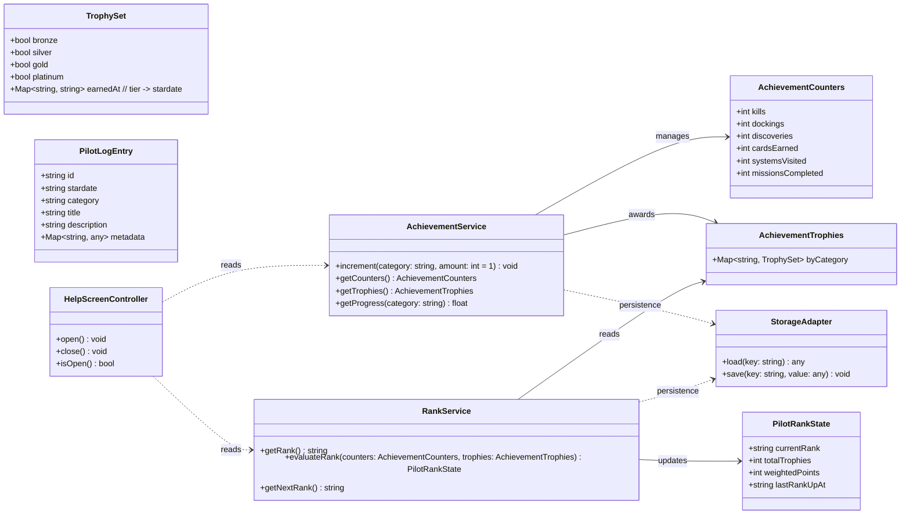
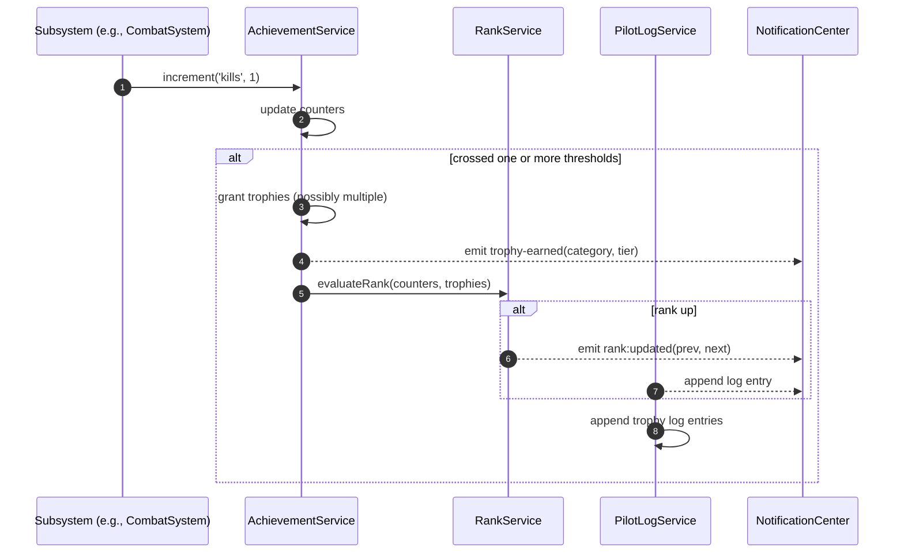
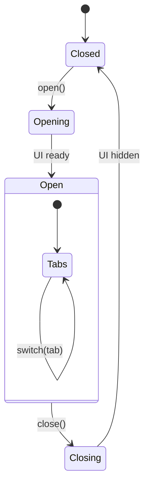
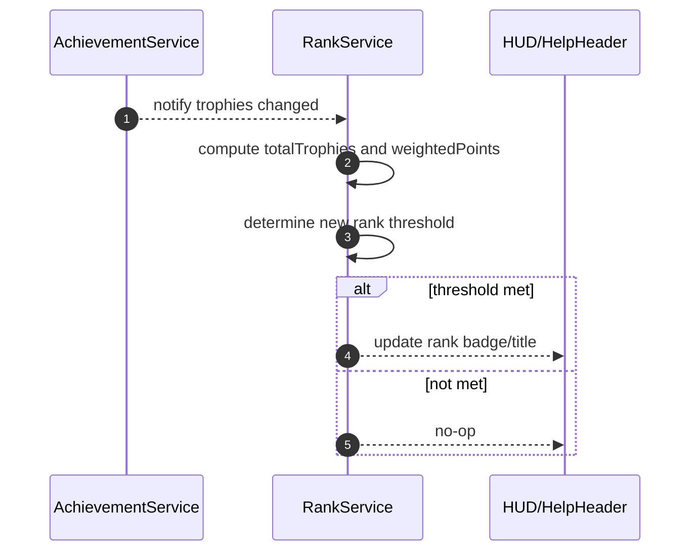
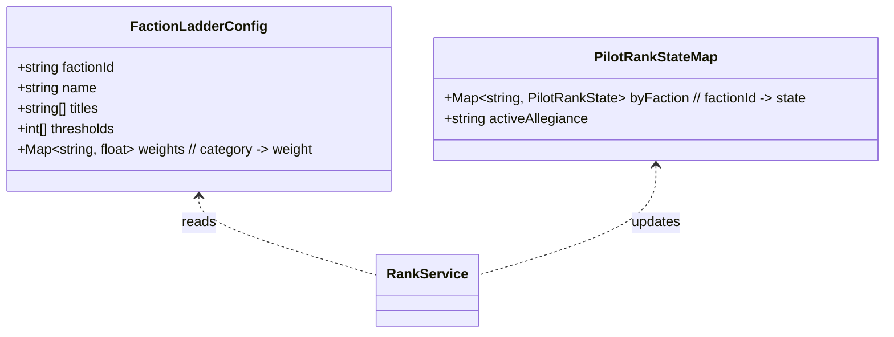
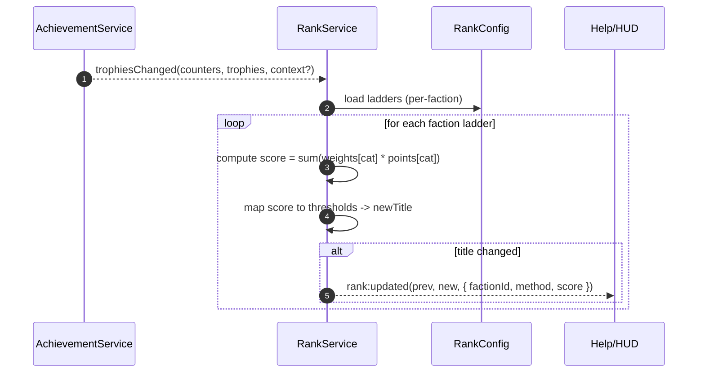
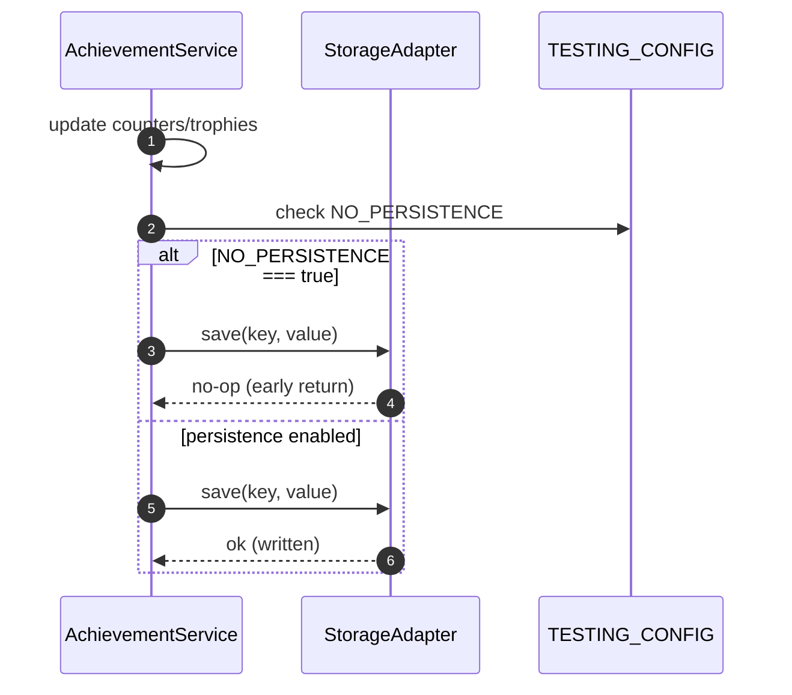
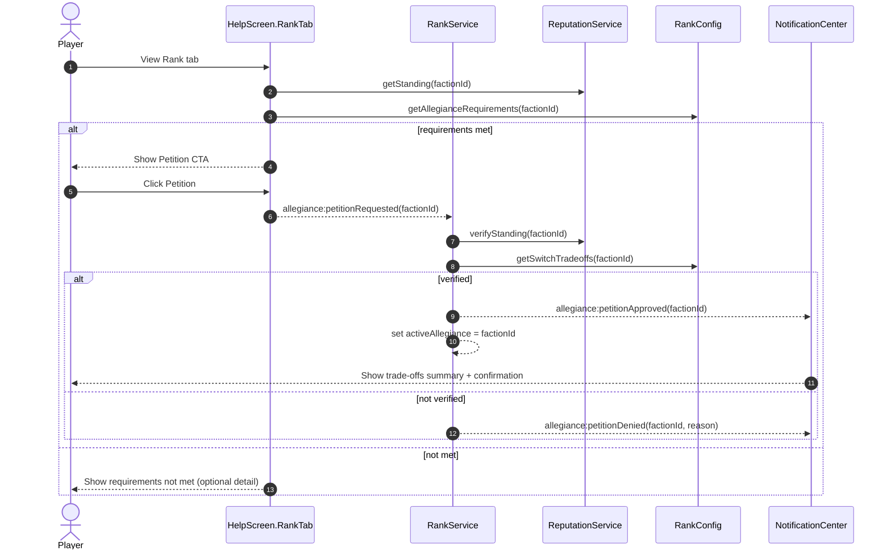
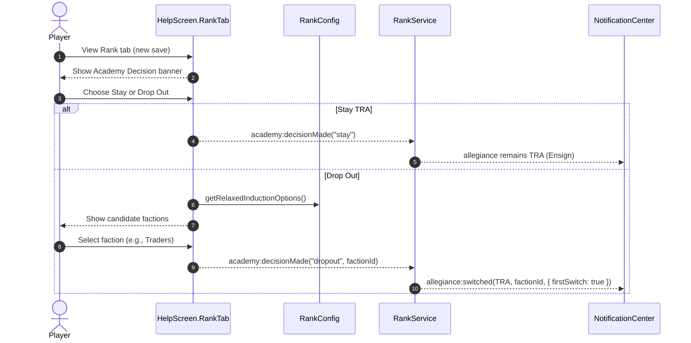

# Help Screen 2.0 and Progression Systems - Design Specification (Draft)

> Status: Draft for review (do not implement until approved)
> Scope: Help Screen 2.0, Achievements with Trophy icons, Pilot Rank progression

## 1. Goals and Non-Goals
- Goals
  - Introduce a collection-driven, session-persistent achievements system with trophy icons.
  - Replace XP with Pilot Rank progression driven by accumulated achievements.
  - Redesign Help Screen (moved to ESC) with tabs, game pause/resume, and new content.
- Non-Goals
  - No implementation in this phase; specification only.
  - No server-side account profiles beyond current local game persistence.
  - No monetization or network features.

## 2. Feature Overview
- Achievements System
  - Tracks aggregate counts: kills, docking completed, discoveries, cards earned, star systems visited, missions completed.
  - Each achievement category awards trophies at tier thresholds (Bronze, Silver, Gold, Platinum).
  - Trophy icons displayed in Achievements screens and context overlays.
- Pilot Rank
  - Player starts as Ensign.
  - Rank advances based on total trophies earned and/or weighted category points.
  - Rank title appears across UI and in the Help Screen header and the Pilot’s Log tab.
- Help Screen 2.0
  - Open/Close: ESC key opens; ESC or click “Close” dismisses.
  - Game Pause: Pauses simulation/render-tick dependent systems while open; resumes on close.
  - Tabs: Pilot Rank’s Log, Collection, Achievements, Credits.

## 3. User Experience Specification
### 3.1 Input and Lifecycle
- Key mapping
  - ESC: Toggle Help Screen visibility.
  - H: Deprecated alias (optional) → shows on-screen tip to use ESC.
- Pause/Resume behavior
  - On open: freeze AI, projectiles, timers, and mission tick; throttle rendering if needed.
  - On close: restore previous simulation state, input focus, and audio volumes.
- Modal behavior
  - Blocks input to world; UI-only navigation permitted.
  - Screen is keyboard and mouse navigable.

### 3.2 Layout and Tabs
- Header
  - Left: Player name and current Pilot Rank badge.
  - Center: Title “Help & Status” with stardate.
  - Right: Close button (ESC) and hint text.
- Tabs (top aligned)
  - Pilot Rank’s Log
    - Chronological log of key events: discoveries, dockings, missions completed, rewards, rank-ups.
    - Sort by stardate descending; filters by category.
  - Collection
    - NFT card collection grid; shows owned vs undiscovered cards with counts.
    - Quick stats (total unique cards, total copies, set completion %).
  - Achievements
    - Category list with progress bars and trophy icons for each tier earned.
    - Detail panel explaining criteria, next tier threshold, and recent increments.
  - Credits
    - Project credits and acknowledgments; static content.

### 3.3 Visual System
- Trophy Icons
  - Four tiers: Bronze, Silver, Gold, Platinum.
  - Consistent 32px base size, scalable for HiDPI.
  - Monochrome with subtle inner glow; color palette aligns with faction-neutral UI.
- Rank Badge
  - Badge with rank title and subtle wreath/star motif.
  - Displays near player name and in HUD when appropriate.

## 4. Achievements System Specification
### 4.1 Categories and Counters (Initial Set)
- Kills: number of enemy ships destroyed.
- Dockings: completed station dockings.
- Discoveries: unique discoveries registered (planets, moons, stations, deposits, landmarks).
- Cards Earned: total cards acquired across all sources.
- Systems Visited: unique star systems visited.
- Missions Completed: completed missions of any type.

### 4.2 Tiers and Thresholds (Default)
- Bronze, Silver, Gold, Platinum thresholds per category (example defaults):
  - Kills: 10 / 50 / 200 / 1000
  - Dockings: 5 / 20 / 75 / 300
  - Discoveries: 10 / 40 / 120 / 300
  - Cards Earned: 5 / 25 / 100 / 300
  - Systems Visited: 2 / 5 / 15 / 40
  - Missions Completed: 3 / 10 / 30 / 100
- All thresholds configurable via data file.

### 4.3 Trophy Granting Rules
- A trophy is granted when a counter crosses a tier threshold.
- Multiple trophies can unlock on a single event if thresholds are leaped.
- Trophies are permanent once earned and persist across sessions.
- Each trophy emits a UI event (toast/badge) and is recorded in the Pilot’s Log.

### 4.4 Presentation
- Achievements Tab
  - Each category row displays: name, current count, horizontal progress bar, next threshold, earned trophy icons.
  - “View Details” opens a panel with recent events and all thresholds.
- Contextual Surfaces
  - Small trophy pop-in at top-right for newly earned trophies, with sound.

## 5. Pilot Rank Specification (Updated: Faction-Based)
### 5.1 Rank Model
- Rank is tracked per faction ladder. A player can hold different ranks with different factions.
- The displayed title is tied to the player’s active allegiance, which must be earned and maintained, not freely toggled in UI.
- Example faction ladders (illustrative; tune per lore):
  - TRA Navy (military): Ensign → Lieutenant → Lieutenant Commander → Commander → Captain → Commodore → Rear Admiral → Vice Admiral → Admiral
  - Free Traders Guild (smuggler/trader): Runner → Courier → Broker → Fixer → Quartermaster → Factor → Coordinator → Syndic → Magnate
  - Void Corsairs (pirate): Swabbie → Deckhand → Raider → Bosun → First Mate → Captain → Warlord → Dread Captain → Lord of the Void
  - Order of the Star (jedi-like): Initiate → Acolyte → Adept → Guardian → Master → High Master → Luminary → Ascendant → Paragon

### 5.2 Progression Rules
- Each faction maintains a ladder with thresholds computed from achievements and alignment with that faction’s ethos.
  - Example weighting (data-driven):
    - TRA (military): kills, missionsCompleted (military), dockings (official), systemsVisited (patrol)
    - Free Traders: dockings, cardsEarned, missionsCompleted (trade/smuggle), discoveries (intel)
    - Corsairs: kills, missionsCompleted (raids), cardsEarned (loot), systemsVisited (raids scope)
    - Order of the Star: discoveries, missionsCompleted (orders), systemsVisited, low collateral (ethical)
- Rank evaluation computes a per-faction score from trophies/points, then maps to tier thresholds.
- Rank-ups occur independently per ladder when thresholds are crossed.

### 5.3 Allegiance System (Action-Gated)
- The game is about actions mattering; allegiance is earned, not flipped.
- Becoming or switching active allegiance requires meeting standing requirements and performing an allegiance action.
  - Requirements (data-driven per faction):
    - Minimum standing score for the destination faction (e.g., Friendly+)
    - Maximum standing with rival factions (e.g., not Hostile beyond a threshold)
    - Optional proof actions (e.g., complete a petition mission or pay a bond)
  - Trade-offs on switch (data-driven options):
    - Temporary neutrality cooldown with rivals (reduced rewards or access)
    - Loss or locking of faction-specific perks until reputation rebuilt
    - Faction tax/fee on first rank-up post-switch
- Allegiance actions are initiated via a Petition flow (Help → Achievements/Rank area → Petition button appears only if requirements are met).
- Auto-selection is removed; the last successful Petition sets `activeAllegiance`.

### 5.4 Events and Payloads
- rank:updated(previousRank, newRank, context)
  - context: { factionId, ladder, method: "trophies" | "points", score }
- allegiance:petitionRequested(factionId)
- allegiance:petitionApproved(factionId)
- allegiance:petitionDenied(factionId, reason)
- allegiance:switched(previousFactionId, newFactionId)

### 5.5 Data and Configuration
- `data/progression/ranks.json` (per-faction):
  - ladders: { factionId, name, titles[], thresholds[], weights{ category: weight } }
  - allegianceRequirements: { minStanding, maxRivalStanding, requiredMissions[], fees }
  - switchTradeoffs: { cooldownMs, perkLocks[], rewardModifiers{}, taxes{} }
- Storage:
  - PilotRankStateMap: { [factionId]: { currentRank, totalTrophies, weightedPoints, lastRankUpAt } }
  - activeAllegiance: factionId set only through approved Petition

### 5.6 UI Surfaces (Help Screen and HUD)
- Help Header: shows allegiance badge/title; no free selector. A small “Petition” CTA appears only when requirements are met for a non-active ladder.
- Pilot Rank’s Log: includes Petition requests, approvals/denials, switches, and their trade-offs.
- HUD: compact allegiance chip; tooltip summarizes current benefits/trade-offs.

### 5.7 Open Questions (Allegiance)
- Should denial provide hints (which requirement is missing) or remain opaque for mystery?
- Do we allow one-time amnesty to leave pirate ranks without rival penalties?
- What is the minimum cooldown between petition attempts?

## 6. Data Model and Persistence (Updated: Test Mode)
### 6.1 Data Objects (conceptual)
- AchievementCounters
  - keys: kills, dockings, discoveries, cardsEarned, systemsVisited, missionsCompleted
  - values: non-negative integers
- AchievementTrophies
  - per-category set of tiers earned: { bronze: boolean, silver: boolean, gold: boolean, platinum: boolean }
  - earnedAt: stardate for each tier
- PilotRankState
  - currentRank: string
  - totalTrophies: integer
  - weightedPoints: integer
  - lastRankUpAt: stardate
- PilotLogEntry
  - id, stardate, category, title, description, metadata

### 6.2 Storage
- Persist in existing local save mechanism (same scope as cards and missions).
- Data versioning field for forward compatibility.
- Test Mode
  - Honor existing `TESTING_CONFIG.NO_PERSISTENCE` flag (see `StarfieldManager`):
    - When true: all save operations for Achievements, Rank, and Pilot Log become no-ops; loads return ephemeral in-memory state.
    - When false: normal persistence behavior.
  - Services must check the flag once at initialization and on each save call to avoid accidental writes during tests.

### 6.3 StorageAdapter Contract (Test-Aware)
- StorageAdapter.save(key, value)
  - If `TESTING_CONFIG.NO_PERSISTENCE === true`, return early without writing.
- StorageAdapter.load(key)
  - If `TESTING_CONFIG.NO_PERSISTENCE === true` and no prior in-memory state, return defaults.

## 7. Events and API Contracts (Frontend-internal)
### 7.1 Events (publish/subscribe intent)
- achievement:increment(category, amount, context)
- achievement:trophy-earned(category, tier)
- rank:updated(previousRank, newRank)
- help:opened / help:closed
- log:append(entry)

### 7.2 Service Interfaces (conceptual)
- AchievementService
  - increment(category, amount=1)
  - getCounters()
  - getTrophies()
  - getProgress(category)
- RankService
  - getRank()
  - evaluateRank(counters, trophies)
  - getNextRank()
- HelpScreenController
  - open(), close()
  - isOpen()

## 8. Pause/Resume Semantics
- On Help open: pause AI, projectiles, mission timers, animations; mute/duck combat SFX; maintain ambient music softly.
- On Help close: resume all paused systems; restore SFX volumes; re-enable inputs.
- Ensure idempotency if called repeatedly.

## 9. Accessibility and UX Considerations
- Full keyboard navigation for tabs and content.
- High-contrast mode support and scalable fonts.
- Screen-reader labels for tabs, trophies, progress bars, and rank badge.
- Motion-reduced animations honoring user OS settings.

## 10. Telemetry and Debugging
- Debug channels: `ACHIEVEMENTS`, `RANK`, `UI`.
- Console helpers: view counters, grant test trophies, simulate rank-up.

## 11. Testing Plan (pre-implementation)
- Unit tests: thresholds, multi-tier unlocks, persistence, idempotent pause/resume.
- Integration tests: counters increment from gameplay events; Help open pauses gameplay; dismissal resumes.
- UI tests: ESC opens Help; tab navigation; achievements rendering; rank badge updates.
- Performance: opening Help must be <150ms on mid-tier hardware.

## 12. Open Questions
- Should some categories be hidden until first progress?
- Do we display undiscovered card silhouettes in Collection?
- Rank thresholds: trophy count only or weighted points?
- Source of truth for stardate: backend or frontend clock?
- Trophy icon art: in-house or vector system-generated with CSS/SVG?

## 13. Data-Driven Configuration (suggested file)
- `data/progression/achievements.json`
- `data/progression/ranks.json`

## 14. Milestones
- M1: Finalize spec and thresholds (this document).
- M2: Wire data files and services (no UI).
- M3: Implement Help Screen 2.0 shell with tabs and pause/resume.
- M4: Integrate Achievements and Rank surfaces.
- M5: Polish, a11y, performance, and tests.

## 15. Diagrams (Mermaid UML)

### 15.1 Data Model and Services (Class Diagram)


### 15.2 Help Screen Open/Close (Sequence)
```mermaid
sequenceDiagram
  autonumber
  actor Player
  participant UI as HelpScreenController
  participant Game as GameLoop/Simulation
  participant Audio as AudioManager

  Player->>UI: press ESC
  UI->>Game: pause()
  UI->>Audio: duckNonAmbient()
  UI-->>Player: render Help (tabs header)

  Note over UI,Game: Input to world blocked; UI-only navigation

  Player->>UI: press ESC (close) or click Close
  UI->>Game: resume()
  UI->>Audio: restoreVolumes()
  UI-->>Player: hide Help
```

### 15.3 Achievement Increment and Trophy Award (Sequence)


### 15.4 Help Screen State Machine (State Diagram)


### 15.5 Rank Progression (Sequence)


### 15.6 Help Screen Components (Component Diagram)
```mermaid
flowchart LR
  subgraph HelpScreen[Help Screen]
    Header[Header: Title, Stardate, Rank Badge]
    Tabs[Tabs: Pilot Log | Collection | Achievements | Credits]
    Content[Tab Content Area]
  end

  Header --> Tabs
  Tabs --> Content

  subgraph Services[Services]
    AchService[AchievementService]
    RankService[RankService]
    LogService[PilotLogService]
  end

  Content -. reads .-> AchService
  Content -. reads .-> RankService
  Content -. reads .-> LogService
```

## 15.7 Diagrams (Faction-Based Rank Additions)

### 15.7.1 Faction Ladder Data (Class Diagram)


### 15.7.2 Rank Evaluation with Factions (Sequence)


## 15.8 Test Mode Persistence Bypass (Sequence)


## 15.9 Allegiance Petition Flow (Sequence)


## 5.8 Academy Onboarding (Starting Ladder and First Switch)
- Starting State
  - All new players begin as TRA Navy Ensign through the Military Academy program (tutorial-friendly baseline).
  - Initial `activeAllegiance = TRA` with ladder title “Ensign”.
- First-Run Choice: Stay or Drop Out
  - Early game narrative offers a one-time decision: remain in TRA or drop out to pursue another path.
  - If the player stays: normal TRA progression applies; future switches require standard Petition + requirements.
  - If the player drops out: a one-time “relaxed induction” to a chosen non-TRA faction is allowed with reduced requirements.
    - Relaxed Induction (data-driven): lower minStanding, waived rival caps, reduced or zero fees, and no cooldown.
    - After this first switch, all subsequent allegiance changes follow the normal Petition requirements and trade-offs.
- UX Surfaces
  - Help Rank tab shows an “Academy Decision” banner until chosen.
  - If dropping out, present a short list of candidate factions with summaries; confirm selection.
- Events
  - academy:decisionMade(choice: "stay" | "dropout", targetFactionId?)
  - allegiance:switched(previousFactionId, newFactionId, context: { firstSwitch: true })
- Persistence and Test Mode
  - Decision is persisted; in test mode, kept in-memory only.

### 15.10 Academy Decision Flow (Sequence)

