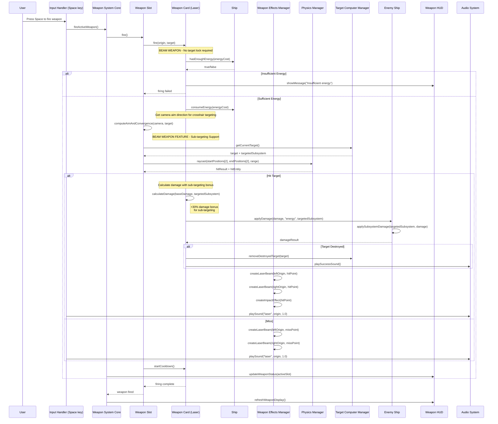
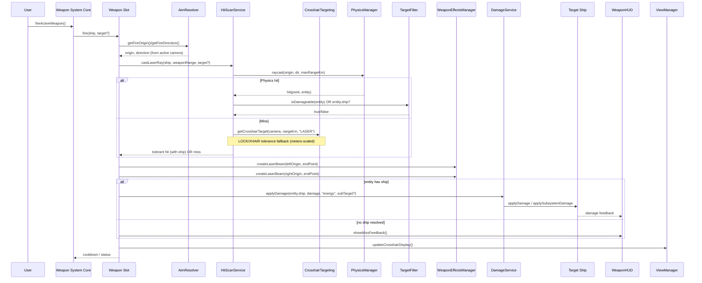

# Laser Weapon System - UML Sequence Diagram

This diagram shows the complete flow of laser weapon firing from user input through damage application to HUD updates. Laser cannons are **beam weapons** that support precision sub-targeting.

## Key Features of Beam Weapons (Lasers):

### **🎯 Sub-Targeting System**
- **Precision Targeting**: Can target specific enemy subsystems (shields, engines, weapons, etc.)
- **Damage Bonus**: 30% damage bonus when targeting specific subsystems
- **Tactical Advantage**: Allows strategic component destruction

### **⚡ Instant Hit Detection**
- **Raycast-based**: Instant hit detection using physics raycasting
- **No Travel Time**: Damage applied immediately upon firing
- **Dual Beam Configuration**: Fire from left/right weapon positions, converge at crosshairs

### **🔋 Energy-Based System**
- **Energy Consumption**: Uses ship's energy reserves
- **Energy Validation**: Comprehensive pre-fire energy checking
- **HUD Feedback**: Clear messaging for insufficient energy

### **🎯 Crosshair Targeting**
- **No Target Lock Required**: Fire toward crosshairs like free-aim
- **Camera-Based Direction**: Uses camera quaternion for aim direction
- **Manual Aiming**: Player skill-based targeting system 

---

## Recent Changes (Refactor) and Updated Flow

The laser firing pipeline was simplified into thin services and aligned with the active camera (fore/aft). This improves maintainability and makes the HUD/crosshair behavior consistent with firing.

### What Changed
- Introduced service layer:
  - `AimResolver`: centralized `getActiveCamera()`, `getFireOrigin()`, `getFireDirection()`.
  - `HitScanService.castLaserRay(...)`: physics-first raycast with celestial filtering, plus tolerance fallbacks (LOCK/XHAIR) using `CrosshairTargeting`.
  - `RangeUnits`: consistent km/m conversions; weapons declared in meters, world in kilometers.
  - `TargetFilter.isDamageable(...)`: accepts ships/stations/friendlies; skips stars/planets/moons.
  - `DamageService.applyDamage(...)`: centralized damage routing and feedback hooks.
- Visuals: beams are drawn once per shot to the final endpoint (hit point or aim point) in `WeaponSlot.triggerWeaponEffects(...)`.
- Firing aim: uses the active camera via `AimResolver.getActiveCamera()` (fore/aft views).
- Crosshair: `ViewManager.updateCrosshairDisplay()` now also uses the active camera to match firing.
- Debuggability: expanded logging around hitscan tolerance and physics results.

### Updated UML: Hitscan (Laser) with Services

### Notes
- Physics-first: lasers prefer actual physics hits and only use tolerance as a fallback.
- Celestial filtering: stars/planets/moons are ignored for combat hits.
- Single-render beams: visuals are created once to the final endpoint per shot.
- Active camera: both crosshair display and firing use the same camera to avoid drift.