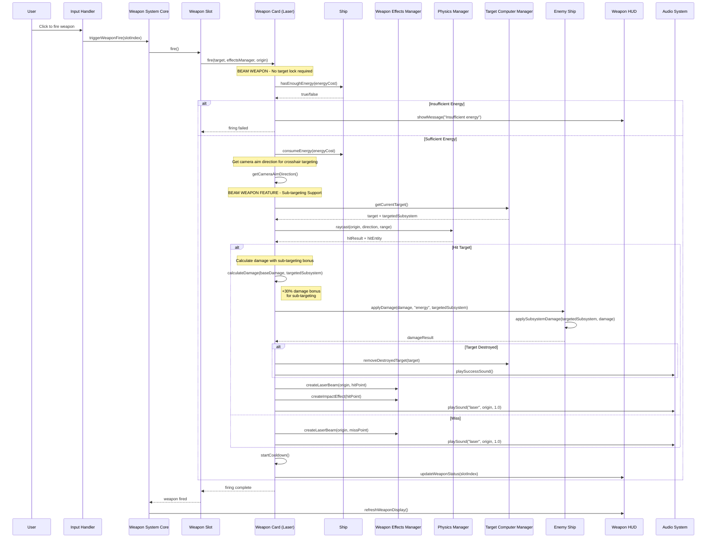

# Laser Weapon System - UML Sequence Diagram

This diagram shows the complete flow of laser weapon firing from user input through damage application to HUD updates. Laser cannons are **beam weapons** that support precision sub-targeting.

## Key Features of Beam Weapons (Lasers):

### **🎯 Sub-Targeting System**
- **Precision Targeting**: Can target specific enemy subsystems (shields, engines, weapons, etc.)
- **Damage Bonus**: 30% damage bonus when targeting specific subsystems
- **Tactical Advantage**: Allows strategic component destruction

### **⚡ Instant Hit Detection**
- **Raycast-based**: Instant hit detection using physics raycasting
- **No Travel Time**: Damage applied immediately upon firing
- **Dual Beam Configuration**: Fire from left/right weapon positions, converge at crosshairs

### **🔋 Energy-Based System**
- **Energy Consumption**: Uses ship's energy reserves
- **Energy Validation**: Comprehensive pre-fire energy checking
- **HUD Feedback**: Clear messaging for insufficient energy

### **🎯 Crosshair Targeting**
- **No Target Lock Required**: Fire toward crosshairs like free-aim
- **Camera-Based Direction**: Uses camera quaternion for aim direction
- **Manual Aiming**: Player skill-based targeting system 