# Mission Completion Flow - Sequence Diagram

This diagram shows the complete flow from waypoint completion to mission rewards display, based on the actual source code.

```mermaid
sequenceDiagram
    participant Player
    participant StarChartsManager as StarChartsManager
    participant WaypointManager as WaypointManager
    participant MissionEventHandler as MissionEventHandler
    participant MissionStatusHUD as MissionStatusHUD
    participant TargetComputerManager as TargetComputerManager
    participant MissionAPI as MissionAPI

    Note over Player, MissionAPI: Waypoint Completion Flow

    %% Player reaches waypoint
    Player->>StarChartsManager: Flies to waypoint position
    StarChartsManager->>StarChartsManager: checkWaypointTriggers()
    StarChartsManager->>StarChartsManager: distance <= triggerRadius
    StarChartsManager->>StarChartsManager: executeWaypointActions(waypoint)
    StarChartsManager->>StarChartsManager: removeWaypoint(waypointId)

    %% Waypoint completion handling
    Note over WaypointManager: Waypoint completion is triggered externally
    WaypointManager->>WaypointManager: onWaypointCompleted(waypoint)
    WaypointManager->>WaypointManager: waypoint.status = 'completed'
    WaypointManager->>TargetComputerManager: removeVirtualTarget(waypoint.id)
    WaypointManager->>WaypointManager: updateMissionObjectives(missionId, waypointId)
    
    %% Mission HUD refresh from WaypointManager (100ms delay)
    WaypointManager->>WaypointManager: setTimeout(100ms)
    WaypointManager->>MissionStatusHUD: refreshMissions() [WaypointManager timeout]
    MissionStatusHUD->>MissionStatusHUD: Check missionsShowingCompletion.size
    Note right of MissionStatusHUD: Size = 0 (no completion yet)
    MissionStatusHUD->>MissionAPI: getActiveMissions()
    MissionAPI-->>MissionStatusHUD: Return active missions
    MissionStatusHUD->>MissionStatusHUD: renderMissions()
    MissionStatusHUD->>MissionStatusHUD: Clear contentArea.innerHTML
    MissionStatusHUD->>MissionStatusHUD: Recreate mission panels

    %% Mission event handler called
    WaypointManager->>MissionEventHandler: handleWaypointCompleted(waypoint)
    MissionEventHandler->>MissionEventHandler: setTimeout(200ms) [Delay for state update]
    
    %% Check mission completion status
    MissionEventHandler->>WaypointManager: Get activeWaypoints for mission
    WaypointManager-->>MissionEventHandler: Return mission waypoints
    MissionEventHandler->>MissionEventHandler: Filter pending/completed waypoints
    
    alt Mission NOT complete (pending waypoints remain)
        MissionEventHandler->>MissionEventHandler: Log "Mission still in progress"
        Note right of MissionEventHandler: Flow ends here for incomplete missions
    else Mission COMPLETE (no pending waypoints)
        MissionEventHandler->>MissionEventHandler: Log "Mission FULLY completed"
        
        %% Award completion rewards
        MissionEventHandler->>MissionEventHandler: awardMissionCompletionRewards(missionId)
        MissionEventHandler->>MissionStatusHUD: showMissionCompletion(missionId, data, rewards)
        
        %% Mission completion display
        MissionStatusHUD->>MissionStatusHUD: Add missionId to missionsShowingCompletion Set
        MissionStatusHUD->>MissionStatusHUD: await setTimeout(50ms) [Delay for blocking]
        MissionStatusHUD->>MissionStatusHUD: Mark mission.status = 'completed'
        MissionStatusHUD->>MissionStatusHUD: Find mission panel
        MissionStatusHUD->>MissionStatusHUD: Create rewards section HTML
        MissionStatusHUD->>MissionStatusHUD: Append rewards section to panel
        MissionStatusHUD->>MissionStatusHUD: Update panel styling (green border)
        
        %% Clear waypoint targets
        MissionEventHandler->>TargetComputerManager: clearCurrentTarget() [if waypoint target]
        
        %% Mark mission as completed in caches
        MissionEventHandler->>MissionAPI: Mark mission.status = 'completed'
        MissionEventHandler->>MissionEventHandler: Mark local mission.status = 'completed'
    end

    %% PROBLEM: Additional refresh calls happen after completion
    Note over MissionStatusHUD: ⚠️ ISSUE: More refreshMissions() calls occur here
    Note over MissionStatusHUD: These calls are not visible in logs (truncated)
    Note over MissionStatusHUD: But they destroy the rewards section

    %% Mystery refresh calls (source unknown)
    rect rgb(255, 200, 200)
        Note over MissionStatusHUD: 🔍 MYSTERY REFRESH CALLS
        MissionStatusHUD->>MissionStatusHUD: refreshMissions() [Unknown source]
        MissionStatusHUD->>MissionStatusHUD: Check missionsShowingCompletion.size
        Note right of MissionStatusHUD: Size should be 1, but shows 0?
        MissionStatusHUD->>MissionStatusHUD: Proceed with refresh (not blocked)
        MissionStatusHUD->>MissionStatusHUD: renderMissions()
        MissionStatusHUD->>MissionStatusHUD: Clear contentArea.innerHTML
        Note right of MissionStatusHUD: ❌ REWARDS SECTION DESTROYED
        MissionStatusHUD->>MissionStatusHUD: Recreate panels without rewards
    end

    %% User interaction (should happen but doesn't due to destroyed rewards)
    Player->>MissionStatusHUD: Click OK button [NEVER REACHED]
    MissionStatusHUD->>MissionStatusHUD: removeMission(missionId) [NEVER CALLED]
    MissionStatusHUD->>MissionStatusHUD: Delete from missionsShowingCompletion [NEVER CALLED]

    Note over Player, MissionAPI: 🔴 RESULT: Rewards section disappears before user can interact
```

## Key Issues Identified

### 1. **Timing Race Condition**
- `showMissionCompletion()` adds mission to `missionsShowingCompletion` Set (size = 1)
- But subsequent `refreshMissions()` calls show Set size = 0
- This suggests the Set is being cleared or there are multiple instances

### 2. **Unknown Refresh Sources**
- Logs show refresh calls during waypoint completion (from WaypointManager timeout)
- But logs cut off after mission completion
- Additional refresh calls must be happening that destroy the rewards section

### 3. **Preservation Logic Gaps**
- Even with enhanced preservation logic, something is bypassing it
- The `missionsShowingCompletion` Set appears to be empty during refresh checks

### 4. **Potential Multiple Instance Issue**
- The Set works correctly in `showMissionCompletion()` (size = 1)
- But appears empty in `refreshMissions()` (size = 0)
- This could indicate different MissionStatusHUD instances

## Recommended Investigation

1. **Find the mystery refresh source** - What's calling `refreshMissions()` after mission completion?
2. **Verify single instance** - Ensure only one MissionStatusHUD instance exists
3. **Add more comprehensive logging** - Track every refresh call with full stack traces
4. **Consider alternative approaches** - Maybe disable all refreshes during completion display
