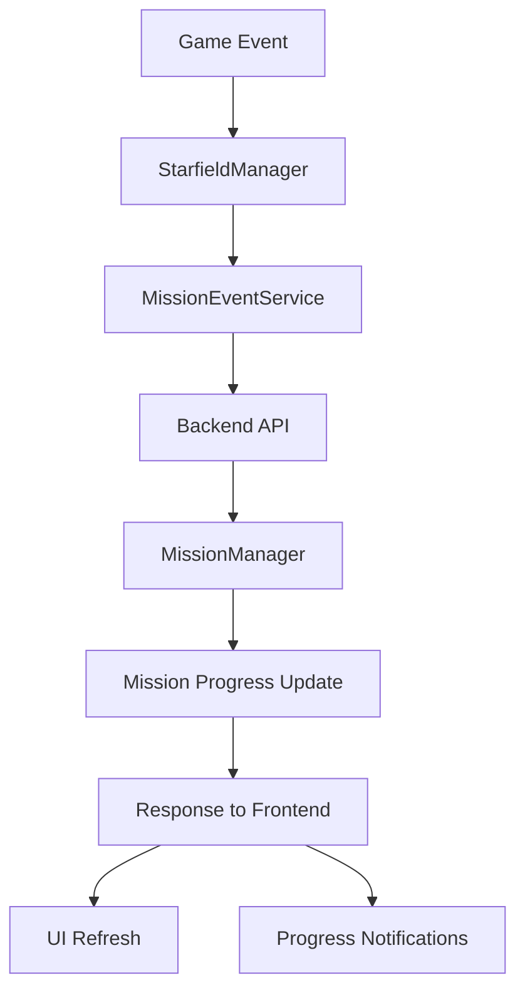

# 🎯 Mission Objective Completion System

## Overview

The Mission Objective Completion System connects real gameplay events to mission progress, automatically tracking and completing mission objectives as players perform relevant actions in the game world.

---

## 🏗️ System Architecture

### Components

1. **Backend**: Mission progress tracking and state management
2. **Frontend Event Service**: Captures game events and sends to backend
3. **Integration Layer**: Connects game actions to mission events
4. **UI Updates**: Real-time progress display and notifications

### Data Flow



---

## 🎮 Supported Mission Types

### 1. Elimination Missions

**Triggers**: Enemy ship destruction
**Objective**: "Eliminate X enemy_type ships"
**Progress Tracking**: Kill count with target requirements

**Example Flow**:
1. Accept elimination mission (requires 3 enemy_fighter kills)
2. Destroy enemy_fighter → Progress: 1/3
3. Destroy enemy_fighter → Progress: 2/3  
4. Destroy enemy_fighter → Mission Complete!

### 2. Exploration Missions

**Triggers**: Location reached events
**Objective**: "Explore target_location"
**Progress Tracking**: Location verification

### 3. Delivery Missions

**Triggers**: Cargo delivery events
**Objective**: "Deliver cargo_type to location"
**Progress Tracking**: Cargo and destination verification

---

## 🔧 Technical Implementation

### Backend Mission Progress Tracking

```python
def _handle_enemy_destroyed(self, mission: Mission, event_data: Dict[str, Any]) -> bool:
    """Handle enemy destruction for elimination missions"""
    if mission.mission_type != 'elimination':
        return False
    
    enemy_type = event_data.get('enemy_type')
    target_enemy = mission.custom_fields.get('target_enemy_type')
    
    if enemy_type == target_enemy:
        # Track kill count
        kill_count = mission.custom_fields.get('kills_made', 0) + 1
        mission.custom_fields['kills_made'] = kill_count
        
        required_kills = mission.custom_fields.get('enemy_count', 1)
        
        # Update objective progress
        for obj in mission.objectives:
            if 'eliminate' in obj.description.lower() and not obj.is_achieved:
                obj.progress = min(kill_count / required_kills, 1.0)
                
                # Check completion
                if kill_count >= required_kills:
                    return mission.set_state(MissionState.ACHIEVED, obj.id)
                else:
                    # Save progress
                    self.save_mission(mission)
                    return True
    
    return False
```

### Frontend Event Integration

```javascript
// Enemy destruction in StarfieldManager
removeDestroyedTarget(destroyedShip) {
    // Existing destruction logic...
    
    // Send mission event
    this.sendEnemyDestroyedEvent(destroyedShip);
}

async sendEnemyDestroyedEvent(destroyedShip) {
    const playerContext = {
        location: this.getCurrentLocation(),
        playerShip: this.ship?.shipType || 'starter_ship'
    };
    
    const result = await this.missionEventService.enemyDestroyed(destroyedShip, playerContext);
    
    if (result?.success && result.updated_missions?.length > 0) {
        // Refresh UI and show notifications
        this.refreshMissionUI();
        this.showProgressNotifications(result.updated_missions);
    }
}
```

### API Endpoints

#### Enemy Destroyed Event
```http
POST /api/missions/events/enemy_destroyed
Content-Type: application/json

{
    "enemy_type": "enemy_fighter",
    "enemy_id": "enemy_12345",
    "location": "terra_prime",
    "player_context": {
        "player_ship": "starter_ship",
        "timestamp": 1234567890
    }
}
```

#### Location Reached Event
```http
POST /api/missions/events/location_reached
Content-Type: application/json

{
    "location": "asteroid_field",
    "player_context": {
        "player_ship": "starter_ship"
    }
}
```

#### Cargo Delivered Event
```http
POST /api/missions/events/cargo_delivered
Content-Type: application/json

{
    "cargo_type": "medical_supplies",
    "location": "research_station",
    "player_context": {
        "player_ship": "starter_ship"
    }
}
```

---

## 🎯 Game Event Connections

### Enemy Destruction Events

**Triggered From**:
- `WeaponSlot.js` - Direct hit damage application
- `PhysicsProjectile.js` - Projectile impact damage
- `EnemyShip.js` - Sub-target damage resulting in destruction
- `StarfieldManager.js` - `removeDestroyedTarget()` method

**Ship Type Detection**:
```javascript
// Enemy ship types automatically detected
const enemyType = destroyedShip.shipType || 
                 destroyedShip.enemyShipType || 
                 'enemy_fighter';
```

**Mission Matching**:
- Compares `enemy_type` from event with `target_enemy_type` from mission
- Only counts kills for matching enemy types
- Tracks progress in `kills_made` custom field

### Location Reached Events

**Triggered From**:
- Docking at stations
- Warp arrival at systems
- Proximity detection to special locations

**Location Matching**:
- Normalizes location names to lowercase with underscores
- Matches against `target_location` in mission custom fields

### Progress Tracking Features

**Real-time Updates**:
- Mission Status HUD refreshes automatically
- Progress notifications via Communication HUD
- Objective completion celebrations

**Progress Persistence**:
- Kill counts saved to mission files
- Progress survives game restarts
- Partial progress maintained between sessions

---

## 🎮 Player Experience

### Visual Feedback

**Mission Status HUD Updates**:
- Progress bars show completion percentage
- Kill counts display (e.g., "2/3 enemies eliminated")
- Objective status updates in real-time

**Progress Notifications**:
```
[Terra Prime Command]
Enemy eliminated. Progress: 2/3

[Terra Prime Command]  
Objective completed: Eliminate 3 enemy_fighter ships
```

**Mission Completion**:
- Full mission completion UI with rewards
- Audio feedback for objective completion
- Visual celebrations for mission success

### Automatic Tracking

**No Manual Input Required**:
- All progress tracked automatically from gameplay
- No special mission-specific actions needed
- Natural gameplay progression counts toward objectives

**Smart Event Detection**:
- Only counts relevant enemies for specific missions
- Location verification for exploration objectives
- Cargo type matching for delivery missions

---

## 🧪 Testing & Debugging

### Console Commands

```javascript
// Test mission event system
starfieldManager.testMissionEvents()

// Manual enemy destroyed event
starfieldManager.missionEventService.testEnemyDestroyed()

// Check active missions
starfieldManager.missionAPI.getActiveMissions()

// Mission summary
starfieldManager.getMissionSummary()
```

### Backend Testing

```python
# Test mission progress tracking
python3 -c "
from mission_system.mission_manager import MissionManager
manager = MissionManager('missions')
# ... test mission generation and progress tracking
"
```

### Event Debugging

**Frontend Console Output**:
```
🎯 MissionEventService: Sending enemy destroyed event: {enemy_type: "enemy_fighter", ...}
🎯 Enemy destruction updated 1 missions
🎯 Mission progress: 2/3 enemies eliminated
```

**Backend Console Output**:
```
🎯 Mission mission_12345: Kill progress 2/3
🎉 Elimination objective completed: 3/3 enemies defeated
```

---

## 🔄 Event Flow Examples

### Elimination Mission Complete Flow

1. **Mission Generation**: "Eliminate 3 enemy_fighter ships"
2. **Mission Acceptance**: Player accepts at Terra Prime
3. **Game Events**:
   - Player destroys enemy_fighter #1 → Progress: 1/3
   - Player destroys enemy_fighter #2 → Progress: 2/3
   - Player destroys enemy_fighter #3 → Mission Complete!
4. **UI Updates**: 
   - Mission Status HUD shows progress
   - Notifications for each kill
   - Mission completion celebration

### Multi-Objective Mission Flow

1. **Escort Mission**: "Rendezvous at waypoint, escort convoy, ensure no losses"
2. **Objective 1**: Reach waypoint → Location event triggers completion
3. **Objective 2**: Escort convoy → Location events track progress
4. **Objective 3**: No convoy losses → Enemy destruction events monitored

---

## 🚀 Configuration

### Mission Template Integration

**Template Structure**:
```json
{
    "objectives": [
        {
            "id": "1",
            "description": "Eliminate {enemy_count} {target_enemy_type} ships"
        }
    ],
    "custom_fields": {
        "target_enemy_type": "enemy_fighter",
        "enemy_count": 3,
        "kills_made": 0
    },
    "triggers": {
        "on_enemy_destroyed": "check_elimination_progress"
    }
}
```

**Event Trigger Mapping**:
- `elimination` missions → `enemy_destroyed` events
- `exploration` missions → `location_reached` events  
- `delivery` missions → `cargo_delivered` events
- `escort` missions → Multiple event types

### Customization Options

**Event Service Configuration**:
```javascript
// Enable/disable event tracking
missionEventService.setEnabled(true);

// Custom event data
const customContext = {
    location: 'custom_location',
    playerShip: 'heavy_fighter',
    additionalData: {...}
};
```

---

## 🎯 Result

**Complete mission objective tracking system that automatically connects gameplay actions to mission progress:**

✅ **Real-time Progress**: Objectives update as players play naturally
✅ **Visual Feedback**: Progress bars, notifications, and completion celebrations  
✅ **Persistent Tracking**: Progress saved and restored between sessions
✅ **Smart Detection**: Only relevant events count toward specific missions
✅ **Multiple Mission Types**: Elimination, exploration, delivery support
✅ **Seamless Integration**: No special player actions required

**Players can now accept missions and see real progress as they play the game naturally!** 🎮
