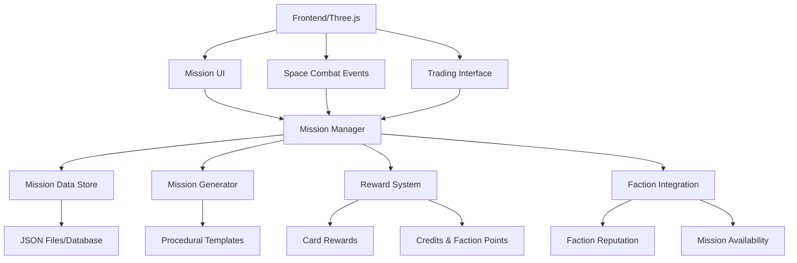

# Mission System Implementation Plan for PlanetZ Space Shooter

## 1. Executive Summary

This document outlines the implementation of a robust mission/quest system for the PlanetZ space shooter game, adapted from proven RPG mission system designs. The system will provide structured gameplay progression through space combat missions, exploration objectives, trading contracts, and faction-based campaigns while maintaining the fast-paced arcade action gameplay.

### 1.1 Key Adaptations for Space Shooter Context

- **Combat-Focused Missions**: Escort, patrol, elimination, and defense objectives
- **Space Trading Integration**: Cargo delivery, smuggling, and merchant contracts  
- **Faction System Integration**: Reputation-based mission availability and rewards
- **Card-Based Rewards**: Integration with existing NFT card progression system
- **Real-Time Objectives**: Support for dynamic mission objectives during space combat

## 2. System Architecture Overview

### 2.1 Core Components



### 2.2 Technology Stack Integration

- **Backend**: Flask Python API (existing)
- **Frontend**: Three.js (existing) 
- **Data Storage**: JSON files + SQLite for production
- **State Management**: Existing StarfieldManager integration
- **Card Integration**: Existing NFT Card system
- **AI Integration**: Existing Enemy AI system

## 3. Mission Types for Space Shooter

### 3.1 Combat Missions

#### 3.1.1 Elimination Contracts
```json
{
  "type": "elimination",
  "targets": [
    {"shipType": "enemy_fighter", "count": 5, "faction": "pirates"},
    {"shipType": "enemy_gunship", "count": 1, "faction": "pirates"}
  ],
  "location": "asteroid_field_alpha",
  "timeLimit": 600,
  "rewardPackage": 3
}
```

#### 3.1.2 Escort Missions
```json
{
  "type": "escort",
  "objectives": [
    {"id": 1, "type": "protect", "target": "merchant_convoy", "duration": 300},
    {"id": 2, "type": "eliminate_threats", "optional": true}
  ],
  "route": ["station_alpha", "jumpgate_beta", "station_gamma"],
  "rewardPackage": 4
}
```

#### 3.1.3 Base Defense
```json
{
  "type": "defense",
  "objectives": [
    {"id": 1, "type": "defend", "target": "mining_station", "waves": 3},
    {"id": 2, "type": "repair", "target": "station_shields", "optional": true}
  ],
  "difficulty": "hard",
  "rewardPackage": 5
}
```

### 3.2 Exploration Missions

#### 3.2.1 Reconnaissance
```json
{
  "type": "reconnaissance", 
  "objectives": [
    {"id": 1, "type": "scan", "target": "unknown_signal", "coordinates": [100, 50, 200]},
    {"id": 2, "type": "photograph", "target": "alien_structure", "optional": true}
  ],
  "sectorRestriction": "outer_rim",
  "rewardPackage": 2
}
```

#### 3.2.2 Resource Survey
```json
{
  "type": "survey",
  "objectives": [
    {"id": 1, "type": "scan_asteroids", "count": 10},
    {"id": 2, "type": "collect_samples", "materials": ["rare_minerals"], "count": 3}
  ],
  "location": "asteroid_belt_gamma",
  "rewardPackage": 1
}
```

### 3.3 Trading & Logistics

#### 3.3.1 Cargo Delivery
```json
{
  "type": "delivery",
  "objectives": [
    {"id": 1, "type": "pickup", "cargo": "medical_supplies", "location": "station_medical"},
    {"id": 2, "type": "deliver", "location": "colony_omega", "timeLimit": 900}
  ],
  "cargoSpace": 50,
  "hazards": ["pirates", "ion_storms"],
  "rewardPackage": 2
}
```

#### 3.3.2 Smuggling Runs
```json
{
  "type": "smuggling",
  "objectives": [
    {"id": 1, "type": "pickup", "cargo": "contraband", "secretLocation": true},
    {"id": 2, "type": "avoid_patrols", "factions": ["federation_navy"]},
    {"id": 3, "type": "deliver", "location": "black_market_station"}
  ],
  "risk": "high",
  "factionPenalty": "federation",
  "rewardPackage": 6
}
```

## 4. Mission State System Adaptation

### 4.1 Enhanced State Flow for Space Combat

```
Unknown → Mentioned → Available → Accepted → In_Progress → Achieved → Completed
                   ↘                      ↓
                    Locked             Failed/Botched
```

#### 4.1.1 New States for Space Context

- **Available**: Mission is offered at station/contact (replaces direct Accept from Mentioned)
- **In_Progress**: Player is actively pursuing objectives in space
- **Locked**: Mission unavailable due to faction standing or prerequisites

#### 4.1.2 Real-Time State Transitions

```javascript
// Frontend integration with existing StarfieldManager
class MissionEventHandler {
  constructor(starfieldManager) {
    this.starfieldManager = starfieldManager;
    this.activeMissions = new Map();
  }

  onEnemyDestroyed(enemy) {
    this.activeMissions.forEach(mission => {
      if (mission.type === 'elimination' && mission.checkTarget(enemy)) {
        this.updateObjective(mission.id, 'eliminate', enemy.type);
      }
    });
  }

  onCargoPickup(cargo) {
    this.updateMissionProgress('pickup', cargo);
  }

  onLocationReached(coordinates) {
    this.updateMissionProgress('reach', coordinates);
  }
}
```

## 5. Integration with Existing Systems

### 5.1 Enemy AI System Integration

```javascript
// Enhanced enemy spawning for mission context
class MissionEnemySpawner {
  constructor(enemyAIManager) {
    this.aiManager = enemyAIManager;
  }

  spawnMissionEnemies(missionData) {
    const missionConfig = {
      ...missionData.enemySpawn,
      missionId: missionData.id,
      onDestroy: (enemy) => this.reportKill(missionData.id, enemy)
    };
    
    return this.aiManager.spawnEnemyGroup(missionConfig);
  }
}
```

### 5.2 Card Reward System Integration

```javascript
// Mission completion rewards
class MissionRewardHandler {
  constructor(cardSystem) {
    this.cardSystem = cardSystem;
  }

  async processRewards(missionId, rewardPackage) {
    const rewards = await this.calculateRewards(rewardPackage);
    
    // Credits
    if (rewards.credits > 0) {
      this.addCredits(rewards.credits);
    }
    
    // Faction reputation
    for (const [faction, points] of Object.entries(rewards.faction)) {
      this.addFactionReputation(faction, points);
    }
    
    // Card rewards
    for (let i = 0; i < rewards.cardCount; i++) {
      const card = this.generateCard(rewards.minTier, rewards.maxTier);
      this.cardSystem.addCard(card);
    }
  }
}
```

### 5.3 UI Integration Points

#### 5.3.1 Mission Journal (H Key Extension)
```javascript
// Add to existing HelpInterface.js
class MissionJournal {
  addMissionSection() {
    return `
      [ MISSION JOURNAL ]
      Active Missions: ${this.getActiveMissionCount()}
      
      Current Objectives:
      ${this.formatActiveMissions()}
      
      Mission Controls:
      M - Toggle Mission Journal
      J - Set Waypoint to Mission Target
      Shift+M - Abandon Current Mission
    `;
  }
}
```

#### 5.3.2 HUD Integration
```javascript
// Mission objective overlay
class MissionHUD {
  constructor() {
    this.objectiveDisplay = this.createObjectiveDisplay();
  }

  createObjectiveDisplay() {
    const container = document.createElement('div');
    container.style.cssText = `
      position: fixed;
      top: 150px;
      right: 10px;
      width: 300px;
      background: rgba(0, 0, 0, 0.7);
      border: 1px solid #00ff41;
      padding: 10px;
      font-family: 'Courier New', monospace;
      color: #00ff41;
      font-size: 12px;
    `;
    return container;
  }

  updateObjectives(mission) {
    const objectives = mission.objectives
      .map(obj => `${obj.isAchieved ? '✓' : '○'} ${obj.description}`)
      .join('\n');
    
    this.objectiveDisplay.innerHTML = `
      <div style="border-bottom: 1px solid #00ff41; margin-bottom: 5px;">
        ${mission.title}
      </div>
      ${objectives}
    `;
  }
}
```

## 6. Implementation Phases

### Phase 1: Core Mission System (Weeks 1-2)
1. **Backend Mission Manager**
   - Flask API endpoints
   - Mission data structures
   - State management
   - JSON file persistence

2. **Basic Frontend Integration**
   - Mission event handlers
   - StarfieldManager integration
   - Basic UI components

### Phase 2: Mission Types Implementation (Weeks 3-4)
1. **Combat Missions**
   - Elimination contracts
   - Enemy AI integration
   - Kill tracking and validation

2. **Exploration Missions**
   - Coordinate-based objectives
   - Scanning mechanics
   - Location verification

### Phase 3: Advanced Features (Weeks 5-6)
1. **Trading & Logistics**
   - Cargo system integration
   - Station-based missions
   - Time-sensitive objectives

2. **Faction Integration**
   - Reputation system
   - Mission availability filtering
   - Faction-specific rewards

### Phase 4: UI & Polish (Weeks 7-8)
1. **Mission Journal**
   - Complete UI implementation
   - Waypoint system
   - Mission abandonment

2. **Reward System**
   - Card reward packages
   - Balanced progression
   - Visual feedback

## 7. Mission Templates & Procedural Generation

### 7.1 Template System
```python
# Backend mission template processor
class MissionTemplate:
    def __init__(self, template_data):
        self.template = template_data
    
    def generate_mission(self, player_level, faction_standing, location):
        mission = self.template.copy()
        
        # Scale difficulty based on player level
        mission['enemyLevel'] = player_level + random.randint(-1, 2)
        
        # Adjust rewards
        mission['rewardPackage'] = self.calculate_reward_tier(player_level)
        
        # Location-specific modifications
        mission['location'] = self.select_appropriate_location(location)
        
        return mission
```

### 7.2 Dynamic Mission Generation
```python
class ProceduralMissionGenerator:
    def __init__(self):
        self.templates = self.load_templates()
        self.locations = self.load_locations()
    
    def generate_daily_missions(self, player_data):
        missions = []
        
        # Generate 3-5 missions based on player progression
        for _ in range(random.randint(3, 5)):
            template = self.select_template(player_data)
            mission = self.populate_template(template, player_data)
            missions.append(mission)
        
        return missions
```

## 8. Reward Package System

### 8.1 Reward Package Definitions
```json
{
  "rewardPackages": {
    "1": {
      "name": "Basic Patrol Reward",
      "minCredits": 50,
      "maxCredits": 150,
      "factionBonuses": {
        "federation": {"min": 0, "max": 3},
        "traders_guild": {"min": 1, "max": 2}
      },
      "cards": {
        "minCount": 1,
        "maxCount": 2,
        "minTier": 1,
        "maxTier": 3
      }
    },
    "2": {
      "name": "Exploration Reward",
      "minCredits": 100,
      "maxCredits": 300,
      "factionBonuses": {
        "explorers_guild": {"min": 2, "max": 5}
      },
      "cards": {
        "minCount": 1,
        "maxCount": 3,
        "minTier": 2,
        "maxTier": 4,
        "preferredTypes": ["scanner", "long_range_sensor"]
      }
    }
  }
}
```

### 8.2 Reward Calculation Algorithm
```python
def calculate_mission_rewards(reward_package_id, player_level, bonus_multiplier=1.0):
    package = REWARD_PACKAGES[reward_package_id]
    
    # Credits (randomized if min != max)
    if package['minCredits'] == package['maxCredits']:
        credits = package['maxCredits']
    else:
        credits = random.randint(package['minCredits'], package['maxCredits'])
    
    credits = int(credits * bonus_multiplier)
    
    # Faction reputation
    faction_rewards = {}
    for faction, values in package.get('factionBonuses', {}).items():
        if values['min'] == values['max']:
            points = values['max']
        else:
            points = random.randint(values['min'], values['max'])
        faction_rewards[faction] = points
    
    # Cards
    card_count = random.randint(package['cards']['minCount'], package['cards']['maxCount'])
    card_tier_range = (package['cards']['minTier'], package['cards']['maxTier'])
    
    return {
        'credits': credits,
        'factionRewards': faction_rewards,
        'cardCount': card_count,
        'cardTierRange': card_tier_range,
        'preferredCardTypes': package['cards'].get('preferredTypes', [])
    }
```

## 9. Backend API Specification

### 9.1 Mission Management Endpoints

```python
@app.route('/api/missions', methods=['GET'])
def get_available_missions():
    """Get all available missions for the player"""
    pass

@app.route('/api/missions/<mission_id>/accept', methods=['POST'])
def accept_mission(mission_id):
    """Accept a specific mission"""
    pass

@app.route('/api/missions/<mission_id>/state', methods=['PUT'])
def update_mission_state(mission_id):
    """Update mission state and objectives"""
    pass

@app.route('/api/missions/<mission_id>/abandon', methods=['DELETE'])
def abandon_mission(mission_id):
    """Abandon an active mission"""
    pass

@app.route('/api/missions/generate', methods=['POST'])
def generate_procedural_missions():
    """Generate new procedural missions"""
    pass
```

### 9.2 Mission Progress Tracking

```python
@app.route('/api/missions/<mission_id>/progress', methods=['POST'])
def update_mission_progress(mission_id):
    """
    Update specific objective progress
    Body: {
        "objectiveId": 1,
        "progressType": "eliminate|scan|deliver|reach",
        "data": {...}
    }
    """
    pass
```

## 10. Testing Strategy

### 10.1 Unit Tests
- Mission state transitions
- Objective completion logic
- Reward calculation
- Procedural generation

### 10.2 Integration Tests
- Backend API endpoints
- Frontend event handling
- Cross-system integration (AI, Cards, UI)

### 10.3 Gameplay Tests
- Mission flow validation
- Balance testing
- Performance with multiple active missions

## 11. Performance Considerations

### 11.1 Optimization Strategies
- Mission data caching
- Lazy loading of mission templates
- Efficient objective checking
- Batched API updates

### 11.2 Scalability Planning
- Database migration path
- Mission archival system
- Player progress optimization

## 12. Future Enhancements

### 12.1 Advanced Features
- Mission chains and campaigns
- Player-generated content
- Multiplayer mission coordination
- Seasonal events and special missions

### 12.2 Integration Opportunities
- Voice acting integration
- Procedural story generation
- Advanced AI mission behavior
- Cross-platform mission sharing

## 13. Risk Mitigation

### 13.1 Technical Risks
- **Database corruption**: Regular backups and validation
- **API performance**: Caching and optimization
- **Frontend integration**: Gradual rollout and testing

### 13.2 Design Risks
- **Mission balance**: Extensive playtesting and metrics
- **Player engagement**: Analytics and feedback systems
- **Complexity creep**: Strict scope management

---

This implementation plan provides a comprehensive roadmap for integrating a robust mission system into the PlanetZ space shooter while leveraging existing game systems and maintaining the fast-paced gameplay experience.
