# Mission System Implementation Plan for PlanetZ Space Shooter - UPDATED

## REVISION NOTES
**After re-reading docs/mission_spec.md, this updated plan addresses critical missing elements:**
- Detailed space station UI integration for mission acquisition
- Complete mission state flow implementation
- Botch handling and failure states
- Ordered and optional objectives system
- Mission data persistence and serialization
- Localization support hooks
- Enhanced API specification with all required endpoints

---

## 1. Executive Summary

This document outlines the implementation of a robust mission/quest system for the PlanetZ space shooter game, adapted from proven RPG mission system designs. The system will provide structured gameplay progression through space combat missions, exploration objectives, trading contracts, and faction-based campaigns while maintaining the fast-paced arcade action gameplay.

### 1.1 Key Adaptations for Space Shooter Context

- **Combat-Focused Missions**: Escort, patrol, elimination, and defense objectives
- **Space Trading Integration**: Cargo delivery, smuggling, and merchant contracts  
- **Faction System Integration**: Reputation-based mission availability and rewards
- **Card-Based Rewards**: Integration with existing NFT card progression system
- **Real-Time Objectives**: Support for dynamic mission objectives during space combat
- **Space Station Integration**: Mission acquisition through existing docking interface

## 2. System Architecture Overview

### 2.1 Mission System Architecture Diagram

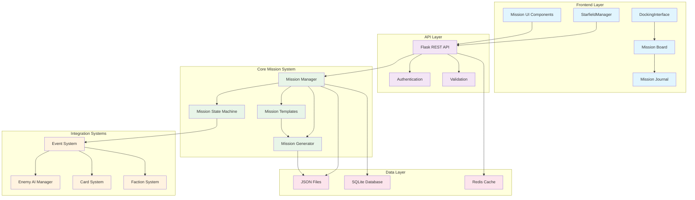

### 2.2 Mission State Flow Diagram

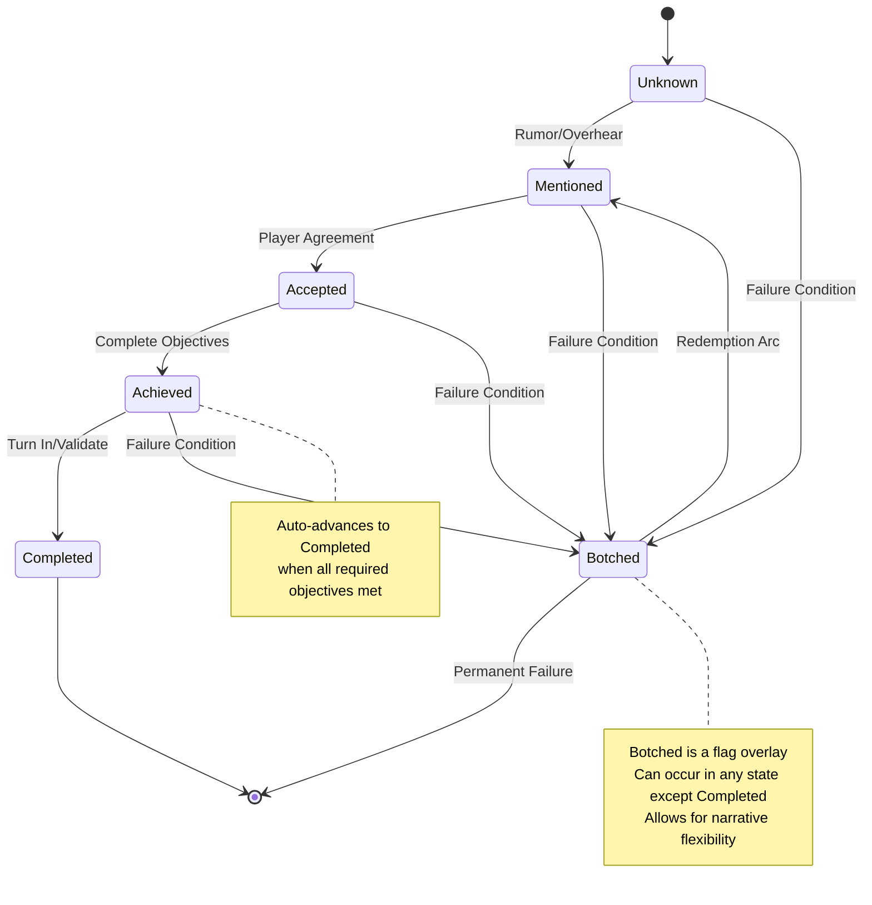

### 2.3 Mission Objective Dependency Graph

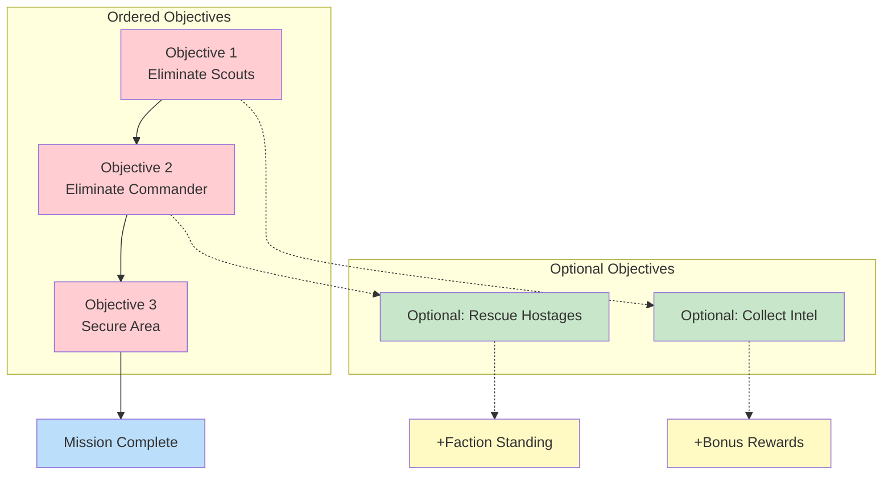

## 3. Space Station Mission Acquisition Interface

### 3.1 Integration with Existing DockingInterface

The mission system will integrate seamlessly with the existing `DockingInterface.js` by adding a new "MISSION BOARD" service button alongside the current REPAIR SHIP and UPGRADE SHIP options.

### 3.2 Mission Board UI Component Hierarchy

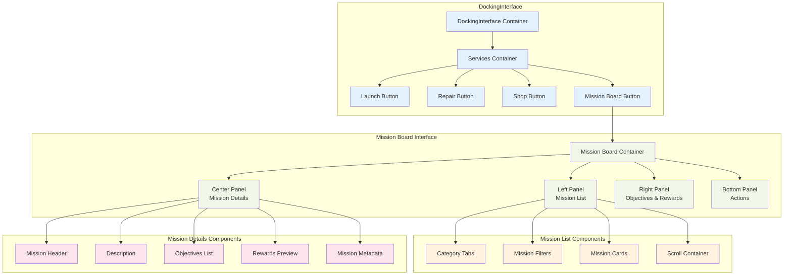

### 3.3 Mission Acquisition Sequence Diagram

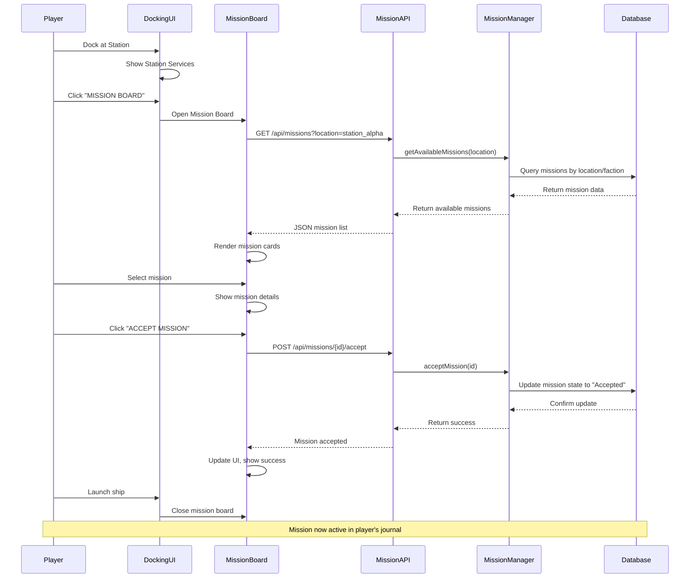

#### 3.3.1 Enhanced DockingInterface Structure

```javascript
// Addition to existing DockingInterface.createActionButtons()
createActionButtons() {
    // Existing buttons (Launch, Repair, Shop)...
    
    // NEW: Mission Board button
    this.missionButton = this.createServiceButton(
        'MISSION BOARD',
        'Accept contracts and track mission progress',
        'mission-button',
        () => this.handleMissionBoard()
    );
    
    // Add to services container
    this.servicesContainer.appendChild(this.launchButton);
    this.servicesContainer.appendChild(this.repairButton);
    this.servicesContainer.appendChild(this.shopButton);
    this.servicesContainer.appendChild(this.missionButton); // NEW
}
```

#### 2.1.2 Mission Board Interface Design

```javascript
class MissionBoardInterface {
    constructor(starfieldManager) {
        this.starfieldManager = starfieldManager;
        this.isVisible = false;
        this.dockedLocation = null;
        this.availableMissions = [];
        this.activeMissions = [];
        this.completedMissions = [];
        this.selectedMission = null;
    }

    show(dockedLocation) {
        this.dockedLocation = dockedLocation;
        this.loadLocationMissions();
        this.createMissionBoardUI();
    }

    createMissionBoardUI() {
        // Main container matching existing station UI style
        this.container = document.createElement('div');
        this.container.className = 'mission-board-interface';
        this.container.style.cssText = `
            position: fixed;
            top: 50%;
            left: 50%;
            transform: translate(-50%, -50%);
            background: rgba(0, 0, 0, 0.9);
            border: 2px solid #00ff41;
            color: #00ff41;
            font-family: 'VT323', monospace;
            padding: 20px;
            display: flex;
            z-index: 1001;
            width: 90vw;
            height: 80vh;
            max-width: 1200px;
        `;

        // Left panel: Mission list
        this.leftPanel = this.createMissionList();
        
        // Center panel: Mission details
        this.centerPanel = this.createMissionDetails();
        
        // Right panel: Mission objectives and rewards
        this.rightPanel = this.createMissionInfo();
        
        // Bottom panel: Action buttons
        this.bottomPanel = this.createActionPanel();
        
        this.container.appendChild(this.leftPanel);
        this.container.appendChild(this.centerPanel);
        this.container.appendChild(this.rightPanel);
        this.container.appendChild(this.bottomPanel);
        
        document.body.appendChild(this.container);
    }
}
```

### 2.2 Mission Categories in Station Interface

#### 2.2.1 Location-Specific Mission Availability

```javascript
// Different stations offer different mission types based on location characteristics
const STATION_MISSION_TYPES = {
    'military_station': {
        primary: ['combat', 'patrol', 'escort'],
        secondary: ['reconnaissance'],
        faction_bonus: 'federation_navy'
    },
    'trading_hub': {
        primary: ['delivery', 'freight'],
        secondary: ['escort', 'anti_piracy'],
        faction_bonus: 'traders_guild'
    },
    'frontier_outpost': {
        primary: ['reconnaissance', 'survey'],
        secondary: ['combat', 'rescue'],
        faction_bonus: 'explorers_guild'
    },
    'mining_station': {
        primary: ['escort', 'defense'],
        secondary: ['delivery', 'survey'],
        faction_bonus: 'miners_union'
    }
};
```

#### 2.2.2 Mission Board Categories

```html
<!-- Mission board left panel structure -->
<div class="mission-categories">
    <div class="category-tab active" data-category="available">
        AVAILABLE CONTRACTS (${availableCount})
    </div>
    <div class="category-tab" data-category="active">
        ACTIVE MISSIONS (${activeCount})
    </div>
    <div class="category-tab" data-category="completed">
        COMPLETED (${completedCount})
    </div>
</div>

<div class="mission-filters">
    <select class="mission-type-filter">
        <option value="all">All Types</option>
        <option value="combat">Combat</option>
        <option value="delivery">Delivery</option>
        <option value="escort">Escort</option>
        <option value="reconnaissance">Reconnaissance</option>
    </select>
    
    <select class="mission-difficulty-filter">
        <option value="all">All Difficulties</option>
        <option value="easy">Easy</option>
        <option value="medium">Medium</option>
        <option value="hard">Hard</option>
        <option value="extreme">Extreme</option>
    </select>
</div>
```

## 3. Complete Mission State System Implementation

### 3.1 Enhanced State Flow (From Mission Spec)

Following the exact specification from `docs/mission_spec.md`:

```
Unknown → Mentioned → Accepted → Achieved → Completed
                                      ↓
                                   Botched (flag overlay)
```

#### 3.1.1 Mission State Class (Python Backend)

```python
from enum import Enum
import json
from datetime import datetime

class MissionState(Enum):
    UNKNOWN = "Unknown"
    MENTIONED = "Mentioned"
    ACCEPTED = "Accepted"
    ACHIEVED = "Achieved"
    COMPLETED = "Completed"

class Mission:
    def __init__(self, mission_data):
        self.id = mission_data.get('id')
        self.state = MissionState(mission_data.get('state', 'Unknown'))
        self.is_botched = mission_data.get('isBotched', False)
        self.objectives = mission_data.get('objectives', [])
        self.description = mission_data.get('description', '')
        self.rewards = mission_data.get('rewards', {})
        self.triggers = mission_data.get('triggers', {})
        self.location = mission_data.get('location', '')
        self.faction = mission_data.get('faction', '')
        self.difficulty = mission_data.get('difficulty', 'medium')
        self.time_limit = mission_data.get('timeLimit', None)
        self.created_at = datetime.now()
        self.updated_at = datetime.now()
    
    def set_state(self, new_state, objective_id=None):
        """Advances state if valid (forward progression only)"""
        if self.state == MissionState.COMPLETED:
            return False  # Cannot change completed missions
        
        if self.is_botched and new_state != MissionState.COMPLETED:
            return False  # Cannot advance botched missions
        
        new_state_enum = MissionState(new_state)
        current_order = list(MissionState).index(self.state)
        new_order = list(MissionState).index(new_state_enum)
        
        if new_order <= current_order:
            return False  # Forward progression only
        
        # For Achieved state, validate objective completion
        if new_state_enum == MissionState.ACHIEVED and objective_id:
            objective = self.find_objective(objective_id)
            if objective and not self.can_achieve_objective(objective):
                return False  # Ordered objectives not met
        
        self.state = new_state_enum
        self.updated_at = datetime.now()
        
        # Auto-check for completion
        if new_state_enum == MissionState.ACHIEVED:
            self.check_completion()
        
        return True
    
    def get_state(self):
        """Returns current state, accounting for botched flag"""
        if self.is_botched and self.state not in [MissionState.UNKNOWN, MissionState.COMPLETED]:
            return "Botched"
        return self.state.value
    
    def botch(self):
        """Sets mission as botched if not completed"""
        if self.state != MissionState.COMPLETED:
            self.is_botched = True
            self.updated_at = datetime.now()
            return True
        return False
    
    def unbotch(self):
        """Removes botched flag (for redemption arcs)"""
        self.is_botched = False
        self.updated_at = datetime.now()
        return True
    
    def can_achieve_objective(self, objective):
        """Check if objective can be achieved (ordered objectives)"""
        if not objective.get('isOrdered', False):
            return True
        
        # Find all objectives with lower IDs that should be completed first
        obj_id = objective['id']
        for obj in self.objectives:
            if obj['id'] < obj_id and obj.get('isOrdered', False):
                if not obj.get('isAchieved', False):
                    return False
        return True
    
    def check_completion(self):
        """Auto-advance to completed if all required objectives are achieved"""
        required_objectives = [obj for obj in self.objectives if not obj.get('isOptional', False)]
        if all(obj.get('isAchieved', False) for obj in required_objectives):
            self.set_state(MissionState.COMPLETED.value)
    
    def to_dict(self):
        """Serialize mission to dictionary for JSON storage"""
        return {
            'id': self.id,
            'state': self.state.value,
            'isBotched': self.is_botched,
            'objectives': self.objectives,
            'description': self.description,
            'rewards': self.rewards,
            'triggers': self.triggers,
            'location': self.location,
            'faction': self.faction,
            'difficulty': self.difficulty,
            'timeLimit': self.time_limit,
            'createdAt': self.created_at.isoformat(),
            'updatedAt': self.updated_at.isoformat()
        }
```

### 3.2 Complete Mission Manager (Backend)

```python
class MissionManager:
    def __init__(self, data_dir="missions"):
        self.data_dir = data_dir
        self.missions = {}  # mission_id -> Mission instance
        self.load_missions()
    
    def load_missions(self):
        """Load all missions from JSON files"""
        import os
        if not os.path.exists(self.data_dir):
            os.makedirs(self.data_dir)
        
        for filename in os.listdir(self.data_dir):
            if filename.endswith('.json'):
                with open(os.path.join(self.data_dir, filename), 'r') as f:
                    mission_data = json.load(f)
                    mission = Mission(mission_data)
                    self.missions[mission.id] = mission
    
    def save_mission(self, mission):
        """Save mission to JSON file"""
        filename = f"{mission.id}.json"
        filepath = os.path.join(self.data_dir, filename)
        with open(filepath, 'w') as f:
            json.dump(mission.to_dict(), f, indent=2)
    
    def get_available_missions(self, location=None, faction_standing=None):
        """Get missions available for acceptance at a location"""
        available = []
        for mission in self.missions.values():
            if mission.get_state() in ["Unknown", "Mentioned"]:
                # Apply location filtering
                if location and mission.location != location:
                    continue
                
                # Apply faction standing requirements
                if faction_standing and not self.meets_faction_requirements(mission, faction_standing):
                    continue
                
                available.append(mission.to_dict())
        
        return available
    
    def generate_procedural_mission(self, template, player_data, location):
        """Generate a new mission from template"""
        import uuid
        from datetime import datetime, timedelta
        
        mission_id = str(uuid.uuid4())
        
        # Basic mission structure from template
        mission_data = {
            'id': mission_id,
            'state': 'Unknown',
            'isBotched': False,
            'type': template['type'],
            'description': self.generate_description(template, player_data),
            'location': location,
            'difficulty': self.calculate_difficulty(template, player_data),
            'objectives': self.generate_objectives(template, player_data),
            'rewards': self.calculate_rewards(template, player_data),
            'timeLimit': self.calculate_time_limit(template),
            'faction': template.get('faction', 'neutral')
        }
        
        mission = Mission(mission_data)
        self.missions[mission_id] = mission
        self.save_mission(mission)
        
        return mission.to_dict()
```

## 4. Mission Types and Classification System

### 4.1 Mission Type Hierarchy

```mermaid
graph TD
    MISSION[Mission Base Class]
    
    subgraph "Combat Missions"
        COMBAT[Combat Mission]
        ELIM[Elimination Contract]
        ESCORT[Escort Mission]
        DEFENSE[Base Defense]
        PATROL[Patrol Route]
    end
    
    subgraph "Exploration Missions"
        EXPLORE[Exploration Mission]
        RECON[Reconnaissance]
        SURVEY[Resource Survey]
        SCAN[Scanning Mission]
        CHART[Charting Mission]
    end
    
    subgraph "Trading Missions"
        TRADE[Trading Mission]
        DELIVERY[Cargo Delivery]
        SMUGGLING[Smuggling Run]
        FREIGHT[Bulk Freight]
        COURIER[Courier Service]
    end
    
    subgraph "Special Missions"
        SPECIAL[Special Mission]
        RESCUE[Rescue Operation]
        DIPLOMACY[Diplomatic Mission]
        RESEARCH[Research Mission]
        EVENT[Seasonal Event]
    end
    
    MISSION --> COMBAT
    MISSION --> EXPLORE
    MISSION --> TRADE
    MISSION --> SPECIAL
    
    COMBAT --> ELIM
    COMBAT --> ESCORT
    COMBAT --> DEFENSE
    COMBAT --> PATROL
    
    EXPLORE --> RECON
    EXPLORE --> SURVEY
    EXPLORE --> SCAN
    EXPLORE --> CHART
    
    TRADE --> DELIVERY
    TRADE --> SMUGGLING
    TRADE --> FREIGHT
    TRADE --> COURIER
    
    SPECIAL --> RESCUE
    SPECIAL --> DIPLOMACY
    SPECIAL --> RESEARCH
    SPECIAL --> EVENT
    
    classDef combat fill:#ffcdd2
    classDef exploration fill:#c8e6c9
    classDef trading fill:#fff9c4
    classDef special fill:#e1bee7
    classDef base fill:#e3f2fd
    
    class MISSION base
    class COMBAT,ELIM,ESCORT,DEFENSE,PATROL combat
    class EXPLORE,RECON,SURVEY,SCAN,CHART exploration
    class TRADE,DELIVERY,SMUGGLING,FREIGHT,COURIER trading
    class SPECIAL,RESCUE,DIPLOMACY,RESEARCH,EVENT special
```

### 4.2 Mission Generation Process Flow

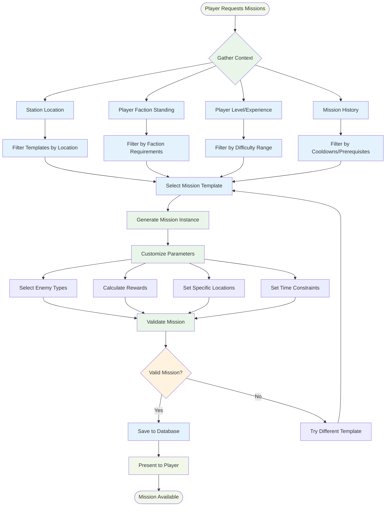

### 4.3 Backend Class Structure

```mermaid
classDiagram
    class Mission {
        +String id
        +MissionState state
        +Boolean isBotched
        +List~Objective~ objectives
        +String description
        +Dict rewards
        +String location
        +String faction
        +DateTime createdAt
        +DateTime updatedAt
        
        +setState(newState, objectiveId)
        +getState()
        +botch()
        +unbotch()
        +canAchieveObjective(objective)
        +checkCompletion()
        +toDict()
    }
    
    class MissionManager {
        +String dataDir
        +Dict~String,Mission~ missions
        +TemplateManager templateManager
        
        +loadMissions()
        +saveMission(mission)
        +getAvailableMissions(location, factionStanding)
        +generateProceduralMission(template, playerData, location)
        +acceptMission(missionId)
        +updateMissionProgress(missionId, objectiveId, data)
        +botchMission(missionId)
        +abandonMission(missionId)
    }
    
    class Objective {
        +Integer id
        +String type
        +String description
        +Boolean isAchieved
        +Boolean isOptional
        +Boolean isOrdered
        +Integer currentProgress
        +Integer targetCount
        +Dict metadata
        
        +checkProgress(gameEvent)
        +markComplete()
        +getProgressPercentage()
    }
    
    class MissionTemplate {
        +String type
        +String baseDescription
        +List~ObjectiveTemplate~ objectives
        +Dict difficultyScaling
        +List~Integer~ rewardTiers
        +Dict prerequisites
        
        +generateMission(playerData, location)
        +validatePrerequisites(playerData)
        +scaleForDifficulty(difficulty)
    }
    
    class RewardPackage {
        +Integer id
        +String name
        +Integer minCredits
        +Integer maxCredits
        +Dict factionBonuses
        +Dict cardRewards
        
        +calculateRewards(playerLevel, bonusMultiplier)
        +awardToPlayer(playerId)
    }
    
    class MissionEventHandler {
        +StarfieldManager starfieldManager
        +Map~String,Mission~ activeMissions
        +MissionAPI missionAPI
        
        +handleEnemyDestroyed(enemy)
        +handleLocationReached(location)
        +handleCargoPickup(cargo)
        +checkEliminationObjectives(missionId, enemy)
        +showObjectiveComplete(objective)
    }
    
    class MissionTriggerSystem {
        +Dict triggers
        
        +registerTrigger(eventType, callback)
        +fireTrigger(eventType, missionData, context)
    }
    
    class MissionCascadeHandler {
        +MissionManager missionManager
        +Dict cascadeRules
        +Dict sharedData
        
        +registerCascadeRule(missionId, rule)
        +handleMissionBotched(missionId, context)
        +botchRelatedMissions(missionIds)
        +modifyFactionStanding(faction, change)
    }
    
    class MissionStorageManager {
        +String storageType
        +Object storageBackend
        
        +determineStorageType(config)
        +migrateFromJsonToDatabase()
        +createStorageBackend()
    }
    
    Mission --> Objective : contains
    MissionManager --> Mission : manages
    MissionManager --> TemplateManager : uses
    MissionTemplate --> ObjectiveTemplate : contains
    Mission --> RewardPackage : references
    MissionEventHandler --> Mission : tracks
    MissionManager --> MissionTriggerSystem : uses
    MissionManager --> MissionCascadeHandler : uses
    MissionManager --> MissionStorageManager : uses
    MissionCascadeHandler --> Mission : affects
    
    <<enumeration>> MissionState
    MissionState : UNKNOWN
    MissionState : MENTIONED  
    MissionState : ACCEPTED
    MissionState : ACHIEVED
    MissionState : COMPLETED
    
    Mission --> MissionState : has
```

### 4.4 Mission Chain and Dependency System

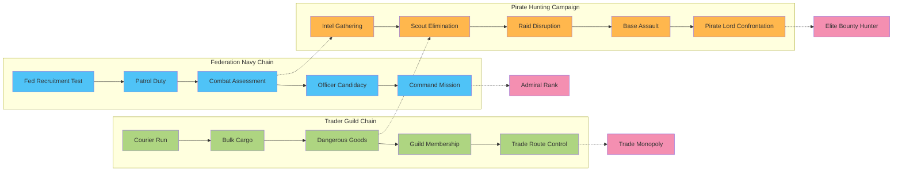

## 5. Complete Backend API Implementation

### 4.1 Flask Route Handlers (Exact from Mission Spec)

```python
from flask import Flask, request, jsonify
from mission_manager import MissionManager

app = Flask(__name__)
mission_manager = MissionManager()

@app.route('/api/missions', methods=['GET'])
def get_available_missions():
    """Get all available missions for the player"""
    location = request.args.get('location')
    faction_standing = request.args.get('faction_standing')
    
    missions = mission_manager.get_available_missions(location, faction_standing)
    return jsonify(missions)

@app.route('/api/missions/active', methods=['GET'])
def get_active_missions():
    """Get all active/accepted missions"""
    active = [m.to_dict() for m in mission_manager.missions.values() 
              if m.get_state() in ['Accepted', 'Achieved']]
    return jsonify(active)

@app.route('/api/missions/<mission_id>/state', methods=['GET'])
def get_mission_state(mission_id):
    """Get current state of a specific mission"""
    mission = mission_manager.missions.get(mission_id)
    if not mission:
        return jsonify({'state': 'Unknown'})
    
    return jsonify({
        'state': mission.get_state(),
        'objectives': mission.objectives,
        'isBotched': mission.is_botched
    })

@app.route('/api/missions/<mission_id>/state', methods=['POST'])
def set_mission_state(mission_id):
    """Advance mission state"""
    data = request.get_json()
    new_state = data.get('new_state')
    objective_id = data.get('objective_id')
    
    mission = mission_manager.missions.get(mission_id)
    if not mission:
        return jsonify({'error': 'Mission not found'}), 404
    
    success = mission.set_state(new_state, objective_id)
    if success:
        mission_manager.save_mission(mission)
        return jsonify({
            'success': True,
            'state': mission.get_state(),
            'objectives': mission.objectives
        })
    else:
        return jsonify({'error': 'Invalid state transition'}), 400

@app.route('/api/missions/<mission_id>/botch', methods=['POST'])
def botch_mission(mission_id):
    """Mark mission as botched/failed"""
    mission = mission_manager.missions.get(mission_id)
    if not mission:
        return jsonify({'error': 'Mission not found'}), 404
    
    success = mission.botch()
    if success:
        mission_manager.save_mission(mission)
        return jsonify({'success': True, 'state': mission.get_state()})
    else:
        return jsonify({'error': 'Cannot botch completed mission'}), 400

@app.route('/api/missions/<mission_id>/unbotch', methods=['POST'])
def unbotch_mission(mission_id):
    """Remove botched flag (redemption)"""
    mission = mission_manager.missions.get(mission_id)
    if not mission:
        return jsonify({'error': 'Mission not found'}), 404
    
    mission.unbotch()
    mission_manager.save_mission(mission)
    return jsonify({'success': True, 'state': mission.get_state()})

@app.route('/api/missions/<mission_id>/progress', methods=['POST'])
def update_mission_progress(mission_id):
    """Update specific objective progress"""
    data = request.get_json()
    objective_id = data.get('objectiveId')
    progress_type = data.get('progressType')
    progress_data = data.get('data', {})
    
    mission = mission_manager.missions.get(mission_id)
    if not mission:
        return jsonify({'error': 'Mission not found'}), 404
    
    # Find and update objective
    for objective in mission.objectives:
        if objective['id'] == objective_id:
            if mission.can_achieve_objective(objective):
                objective['isAchieved'] = True
                mission.updated_at = datetime.now()
                mission.check_completion()
                mission_manager.save_mission(mission)
                
                return jsonify({
                    'success': True,
                    'objective': objective,
                    'missionState': mission.get_state()
                })
            else:
                return jsonify({'error': 'Objective prerequisites not met'}), 400
    
    return jsonify({'error': 'Objective not found'}), 404

@app.route('/api/missions/<mission_id>/accept', methods=['POST'])
def accept_mission(mission_id):
    """Accept a specific mission"""
    mission = mission_manager.missions.get(mission_id)
    if not mission:
        return jsonify({'error': 'Mission not found'}), 404
    
    if mission.get_state() not in ['Unknown', 'Mentioned']:
        return jsonify({'error': 'Mission not available for acceptance'}), 400
    
    success = mission.set_state('Accepted')
    if success:
        mission_manager.save_mission(mission)
        return jsonify({
            'success': True,
            'mission': mission.to_dict()
        })
    else:
        return jsonify({'error': 'Failed to accept mission'}), 400

@app.route('/api/missions/<mission_id>/abandon', methods=['DELETE'])
def abandon_mission(mission_id):
    """Abandon an active mission"""
    mission = mission_manager.missions.get(mission_id)
    if not mission:
        return jsonify({'error': 'Mission not found'}), 404
    
    if mission.get_state() not in ['Accepted', 'Achieved']:
        return jsonify({'error': 'Mission cannot be abandoned'}), 400
    
    # Reset mission to mentioned state or remove from active list
    mission.botch()  # Mark as failed
    mission_manager.save_mission(mission)
    
    return jsonify({'success': True})

@app.route('/api/missions/generate', methods=['POST'])
def generate_procedural_missions():
    """Generate new procedural missions"""
    data = request.get_json()
    location = data.get('location', 'default')
    player_level = data.get('playerLevel', 1)
    faction_standing = data.get('factionStanding', {})
    
    # Generate 3-5 missions
    generated_missions = []
    template_manager = mission_manager.template_manager
    
    for _ in range(random.randint(3, 5)):
        template = template_manager.select_template(player_level, location)
        mission = mission_manager.generate_procedural_mission(
            template, 
            {'level': player_level, 'factionStanding': faction_standing}, 
            location
        )
        generated_missions.append(mission)
    
    return jsonify(generated_missions)
```

## 5. Frontend Integration with StarfieldManager

### 5.1 Real-Time Mission Event Handling

```javascript
// Enhanced mission event integration with existing StarfieldManager
class MissionEventHandler {
    constructor(starfieldManager) {
        this.starfieldManager = starfieldManager;
        this.activeMissions = new Map();
        this.missionAPI = new MissionAPI();
        
        // Hook into existing game events
        this.bindGameEvents();
    }
    
    bindGameEvents() {
        // Hook into enemy destruction events
        const originalOnEnemyDestroyed = this.starfieldManager.onEnemyDestroyed?.bind(this.starfieldManager);
        this.starfieldManager.onEnemyDestroyed = (enemy) => {
            // Call original handler
            if (originalOnEnemyDestroyed) {
                originalOnEnemyDestroyed(enemy);
            }
            
            // Process mission events
            this.handleEnemyDestroyed(enemy);
        };
        
        // Hook into location arrival events
        const originalOnLocationReached = this.starfieldManager.onLocationReached?.bind(this.starfieldManager);
        this.starfieldManager.onLocationReached = (location) => {
            if (originalOnLocationReached) {
                originalOnLocationReached(location);
            }
            this.handleLocationReached(location);
        };
        
        // Hook into cargo pickup events
        this.starfieldManager.addEventListener('cargoPickup', (event) => {
            this.handleCargoPickup(event.detail);
        });
    }
    
    async handleEnemyDestroyed(enemy) {
        for (const [missionId, mission] of this.activeMissions) {
            if (mission.type === 'elimination' || mission.type === 'combat') {
                await this.checkEliminationObjectives(missionId, enemy);
            }
        }
    }
    
    async checkEliminationObjectives(missionId, enemy) {
        const mission = this.activeMissions.get(missionId);
        if (!mission) return;
        
        for (const objective of mission.objectives) {
            if (objective.type === 'eliminate' && !objective.isAchieved) {
                if (this.matchesEnemyType(enemy, objective.targetType)) {
                    // Update progress via API
                    await this.missionAPI.updateObjectiveProgress(missionId, objective.id, {
                        enemyType: enemy.type,
                        enemyId: enemy.id,
                        location: enemy.position
                    });
                    
                    // Update local state
                    objective.progress = (objective.progress || 0) + 1;
                    if (objective.progress >= objective.target) {
                        objective.isAchieved = true;
                        this.showObjectiveComplete(objective);
                    }
                }
            }
        }
    }
}

// Mission API communication class
class MissionAPI {
    constructor() {
        this.baseURL = '/api/missions';
    }
    
    async getAvailableMissions(location) {
        const response = await fetch(`${this.baseURL}?location=${location}`);
        return response.json();
    }
    
    async acceptMission(missionId) {
        const response = await fetch(`${this.baseURL}/${missionId}/accept`, {
            method: 'POST'
        });
        return response.json();
    }
    
    async updateObjectiveProgress(missionId, objectiveId, data) {
        const response = await fetch(`${this.baseURL}/${missionId}/progress`, {
            method: 'POST',
            headers: { 'Content-Type': 'application/json' },
            body: JSON.stringify({
                objectiveId: objectiveId,
                progressType: 'eliminate',
                data: data
            })
        });
        return response.json();
    }
    
    async abandonMission(missionId) {
        const response = await fetch(`${this.baseURL}/${missionId}/abandon`, {
            method: 'DELETE'
        });
        return response.json();
    }
}
```

## 6. Real-Time Mission Tracking and Event Integration

### 6.1 Mission Event Flow During Gameplay

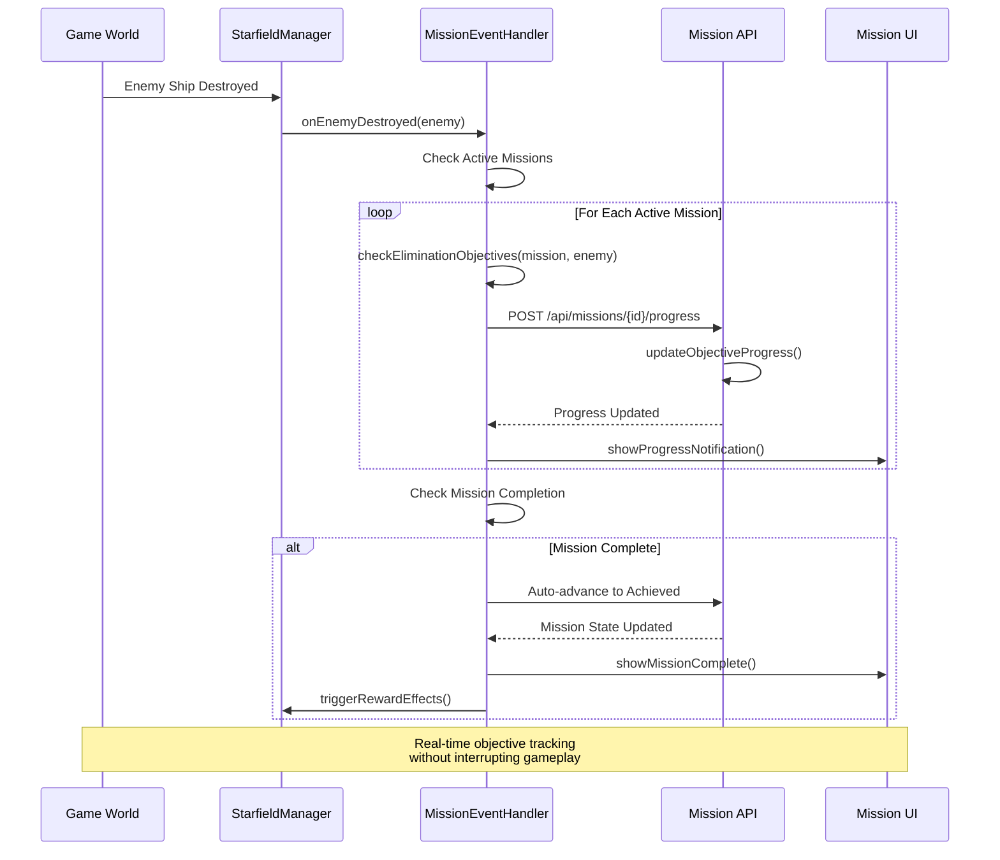

### 6.2 Mission Objective Types and Tracking

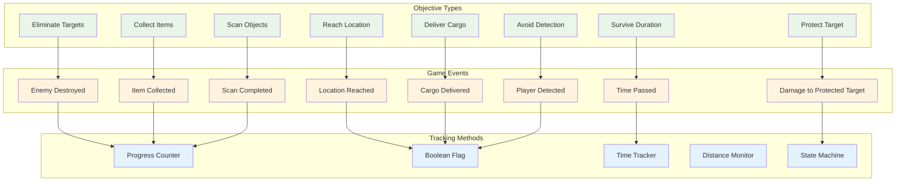

### 6.3 Reward System Integration

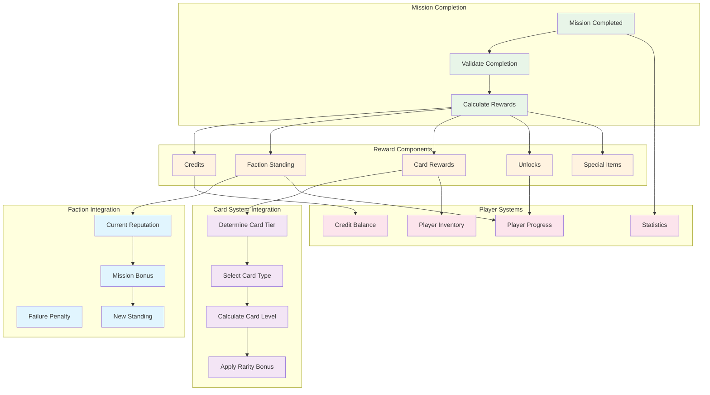

### 6.4 Mission Failure and Recovery System

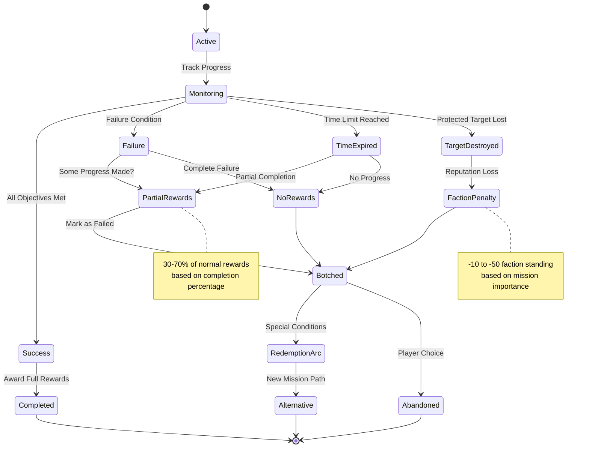

## 7. Mission Data Serialization and Persistence

### 6.1 Complete Mission JSON Structure (From Spec)

```json
{
  "id": "eliminate_pirates_alpha_001",
  "state": "Unknown",
  "isBotched": false,
  "type": "elimination",
  "title": "Pirate Elimination Contract",
  "description": "Clear the asteroid field of pirate raiders threatening merchant shipping",
  "location": "asteroid_field_alpha",
  "faction": "traders_guild",
  "difficulty": "medium",
  "timeLimit": 3600,
  "rewardPackage": 3,
  "objectives": [
    {
      "id": 1,
      "type": "eliminate",
      "description": "Destroy 5 pirate fighters",
      "targetType": "enemy_fighter",
      "targetCount": 5,
      "currentProgress": 0,
      "isAchieved": false,
      "isOptional": false,
      "isOrdered": true
    },
    {
      "id": 2,
      "type": "eliminate", 
      "description": "Destroy the pirate commander",
      "targetType": "enemy_gunship",
      "targetCount": 1,
      "currentProgress": 0,
      "isAchieved": false,
      "isOptional": false,
      "isOrdered": true
    },
    {
      "id": 3,
      "type": "collect",
      "description": "Retrieve pirate data cores",
      "targetItem": "data_core",
      "targetCount": 2,
      "currentProgress": 0,
      "isAchieved": false,
      "isOptional": true,
      "isOrdered": false
    }
  ],
  "triggers": {
    "onAccept": "spawn_pirate_squadron",
    "onComplete": "update_faction_standing",
    "onBotch": "pirates_escape"
  },
  "prerequisites": {
    "minimumLevel": 3,
    "factionStanding": {
      "traders_guild": 5
    },
    "completedMissions": []
  },
  "createdAt": "2024-01-15T10:30:00Z",
  "updatedAt": "2024-01-15T10:30:00Z"
}
```

### 6.2 Mission Template System

```json
{
  "templates": {
    "elimination_basic": {
      "type": "elimination",
      "baseDescription": "Eliminate {enemyType} threatening {location}",
      "objectives": [
        {
          "type": "eliminate",
          "targetType": "{dynamicEnemyType}",
          "targetCount": "{dynamicCount}",
          "isOptional": false,
          "isOrdered": true
        }
      ],
      "rewardTiers": [2, 3, 4],
      "difficultyScaling": {
        "easy": {"enemyCount": "1-3", "enemyLevel": "-1"},
        "medium": {"enemyCount": "3-5", "enemyLevel": "0"},
        "hard": {"enemyCount": "5-8", "enemyLevel": "+1"},
        "extreme": {"enemyCount": "8-12", "enemyLevel": "+2"}
      }
    }
  }
}
```

## 7. Localization Support (From Mission Spec)

### 7.1 Mission Text Localization System

```javascript
class MissionLocalization {
    constructor() {
        this.currentLanguage = 'en';
        this.translations = new Map();
    }
    
    async loadTranslations(language) {
        try {
            const response = await fetch(`/api/localization/missions/${language}.json`);
            const translations = await response.json();
            this.translations.set(language, translations);
            this.currentLanguage = language;
        } catch (error) {
            console.error('Failed to load mission translations:', error);
            // Fallback to English
            this.currentLanguage = 'en';
        }
    }
    
    getMissionText(missionId, textKey) {
        const langTranslations = this.translations.get(this.currentLanguage);
        if (!langTranslations) return `[${textKey}]`;
        
        const missionTexts = langTranslations[missionId];
        if (!missionTexts) return `[${missionId}.${textKey}]`;
        
        return missionTexts[textKey] || `[${textKey}]`;
    }
    
    formatMissionDescription(template, variables) {
        let text = template;
        for (const [key, value] of Object.entries(variables)) {
            text = text.replace(`{${key}}`, value);
        }
        return text;
    }
}

// Example localization JSON structure
// /api/localization/missions/en.json
{
  "eliminate_pirates_alpha_001": {
    "title": "Pirate Elimination Contract",
    "description": "Clear the asteroid field of pirate raiders threatening merchant shipping",
    "objectives": {
      "1": "Destroy 5 pirate fighters",
      "2": "Destroy the pirate commander", 
      "3": "Retrieve pirate data cores"
    },
    "successMessage": "Contract completed successfully. The shipping lanes are now secure.",
    "failureMessage": "Mission failed. Pirates have escaped to threaten another day."
  }
}
```

## 8. Enhanced Mission Board UI Components

### 8.1 Detailed Mission Card Component

```javascript
class MissionCard {
    constructor(missionData) {
        this.mission = missionData;
        this.element = this.createElement();
    }
    
    createElement() {
        const card = document.createElement('div');
        card.className = 'mission-card';
        card.style.cssText = `
            background: rgba(0, 0, 0, 0.7);
            border: 1px solid #00ff41;
            margin: 10px;
            padding: 15px;
            cursor: pointer;
            transition: all 0.3s ease;
            border-left: 4px solid ${this.getDifficultyColor()};
        `;
        
        card.innerHTML = `
            <div class="mission-header">
                <h3 class="mission-title">${this.mission.title}</h3>
                <span class="mission-difficulty ${this.mission.difficulty}">${this.mission.difficulty.toUpperCase()}</span>
            </div>
            
            <div class="mission-client">
                <span class="faction-badge">${this.mission.faction}</span>
                <span class="location-badge">${this.mission.location}</span>
            </div>
            
            <div class="mission-description">
                ${this.mission.description}
            </div>
            
            <div class="mission-objectives">
                <h4>Objectives:</h4>
                ${this.renderObjectives()}
            </div>
            
            <div class="mission-rewards">
                <div class="reward-preview">
                    ${this.renderRewardPreview()}
                </div>
            </div>
            
            <div class="mission-meta">
                ${this.mission.timeLimit ? `<span class="time-limit">⏱ ${this.formatTimeLimit()}</span>` : ''}
                <span class="mission-state">${this.mission.state}</span>
            </div>
        `;
        
        // Add event listeners
        card.addEventListener('click', () => this.onSelect());
        card.addEventListener('mouseenter', () => this.onHover());
        card.addEventListener('mouseleave', () => this.onUnhover());
        
        return card;
    }
    
    getDifficultyColor() {
        const colors = {
            'easy': '#00ff41',
            'medium': '#ffff00', 
            'hard': '#ff8800',
            'extreme': '#ff0000'
        };
        return colors[this.mission.difficulty] || '#00ff41';
    }
    
    renderObjectives() {
        return this.mission.objectives
            .filter(obj => !obj.isOptional) // Show only required objectives in preview
            .map(obj => `
                <div class="objective-preview">
                    ${obj.isAchieved ? '✓' : '○'} ${obj.description}
                </div>
            `).join('');
    }
    
    renderRewardPreview() {
        const pkg = REWARD_PACKAGES[this.mission.rewardPackage];
        if (!pkg) return 'Unknown rewards';
        
        return `
            <span class="credits">💰 ${pkg.minCredits}-${pkg.maxCredits} Credits</span>
            <span class="cards">🎴 ${pkg.cards.minCount}-${pkg.cards.maxCount} Cards</span>
            ${Object.keys(pkg.factionBonuses || {}).length > 0 ? 
                '<span class="faction">⭐ Faction Standing</span>' : ''}
        `;
    }
}
```

### 8.2 Mission Details Panel

```javascript
class MissionDetailsPanel {
    constructor() {
        this.selectedMission = null;
        this.element = this.createElement();
    }
    
    createElement() {
        const panel = document.createElement('div');
        panel.className = 'mission-details-panel';
        panel.style.cssText = `
            flex: 2;
            padding: 20px;
            background: rgba(0, 0, 0, 0.5);
            border: 1px solid #00ff41;
            margin: 0 10px;
            overflow-y: auto;
        `;
        
        panel.innerHTML = `
            <div class="no-selection-message">
                Select a mission to view details
            </div>
        `;
        
        return panel;
    }
    
    showMissionDetails(mission) {
        this.selectedMission = mission;
        
        this.element.innerHTML = `
            <div class="mission-details-header">
                <h2>${mission.title}</h2>
                <div class="mission-meta-info">
                    <span class="difficulty-badge ${mission.difficulty}">${mission.difficulty.toUpperCase()}</span>
                    <span class="faction-badge">${mission.faction}</span>
                    <span class="location-badge">📍 ${mission.location}</span>
                </div>
            </div>
            
            <div class="mission-full-description">
                <h3>Mission Briefing</h3>
                <p>${mission.description}</p>
            </div>
            
            <div class="mission-objectives-detailed">
                <h3>Objectives</h3>
                ${this.renderDetailedObjectives(mission.objectives)}
            </div>
            
            <div class="mission-rewards-detailed">
                <h3>Rewards</h3>
                ${this.renderDetailedRewards(mission.rewardPackage)}
            </div>
            
            <div class="mission-requirements">
                <h3>Requirements</h3>
                ${this.renderRequirements(mission.prerequisites)}
            </div>
            
            ${mission.timeLimit ? `
                <div class="mission-time-limit">
                    <h3>Time Limit</h3>
                    <p>⏱ ${this.formatTimeLimit(mission.timeLimit)}</p>
                </div>
            ` : ''}
            
            <div class="mission-navigation">
                <h3>Navigation</h3>
                <p>📍 Destination: ${mission.location}</p>
                <button class="set-waypoint-btn" onclick="setMissionWaypoint('${mission.id}')">
                    Set Waypoint
                </button>
            </div>
        `;
    }
    
    renderDetailedObjectives(objectives) {
        return objectives.map((obj, index) => `
            <div class="objective-detailed ${obj.isOptional ? 'optional' : 'required'}">
                <div class="objective-header">
                    <span class="objective-status">${obj.isAchieved ? '✓' : '○'}</span>
                    <span class="objective-title">${obj.description}</span>
                    ${obj.isOptional ? '<span class="optional-badge">OPTIONAL</span>' : ''}
                </div>
                ${obj.isOrdered && index > 0 ? 
                    '<div class="objective-dependency">⚠ Complete previous objectives first</div>' : ''}
                <div class="objective-progress">
                    Progress: ${obj.currentProgress || 0}/${obj.targetCount || 1}
                </div>
            </div>
        `).join('');
    }
}
```

## 9. Mission Failure and Botch Handling

### 9.1 Comprehensive Failure System

```javascript
class MissionFailureHandler {
    constructor(missionSystem) {
        this.missionSystem = missionSystem;
        this.failureReasons = new Map();
    }
    
    handleMissionFailure(missionId, reason, context = {}) {
        const mission = this.missionSystem.getMission(missionId);
        if (!mission) return;
        
        // Record failure reason for player feedback
        this.failureReasons.set(missionId, {
            reason: reason,
            context: context,
            timestamp: new Date()
        });
        
        // Different failure types
        switch (reason) {
            case 'time_expired':
                this.handleTimeExpiration(mission, context);
                break;
            case 'target_destroyed':
                this.handleTargetDestruction(mission, context);
                break;
            case 'player_detected':
                this.handleDetection(mission, context);
                break;
            case 'cargo_lost':
                this.handleCargoLoss(mission, context);
                break;
            default:
                this.handleGenericFailure(mission, context);
        }
        
        // Botch the mission
        this.missionSystem.botchMission(missionId);
        
        // Show failure notification
        this.showFailureNotification(mission, reason);
    }
    
    handleTimeExpiration(mission, context) {
        // Some missions might offer partial rewards for partial completion
        if (mission.type === 'delivery' && mission.partialRewardsAllowed) {
            this.awardPartialRewards(mission, 0.3); // 30% of normal rewards
        }
    }
    
    handleTargetDestruction(mission, context) {
        // If escort target destroyed, mission automatically fails
        // But player might get reputation hit instead of just loss
        this.applyReputationPenalty(mission.faction, -10);
    }
    
    showFailureNotification(mission, reason) {
        const messages = {
            'time_expired': 'Mission failed: Time limit exceeded',
            'target_destroyed': 'Mission failed: Protected target was destroyed',
            'player_detected': 'Mission failed: You were detected',
            'cargo_lost': 'Mission failed: Cargo was lost or destroyed'
        };
        
        this.missionSystem.ui.showNotification({
            type: 'failure',
            title: 'Mission Failed',
            message: messages[reason] || 'Mission failed',
            mission: mission.title,
            duration: 5000
        });
    }
}
```

## 10. Mission Cascade Effects and Dependencies

### 10.1 Mission Chain System

```javascript
class MissionChainManager {
    constructor() {
        this.chains = new Map(); // chainId -> chain data
        this.missionChains = new Map(); // missionId -> chainId
    }
    
    registerChain(chainData) {
        this.chains.set(chainData.id, chainData);
        
        // Map individual missions to this chain
        for (const missionId of chainData.missions) {
            this.missionChains.set(missionId, chainData.id);
        }
    }
    
    onMissionComplete(missionId) {
        const chainId = this.missionChains.get(missionId);
        if (!chainId) return;
        
        const chain = this.chains.get(chainId);
        if (!chain) return;
        
        // Check if this completes the chain
        if (this.isChainComplete(chain)) {
            this.awardChainRewards(chain);
            this.unlockNextChain(chain);
        }
        
        // Unlock next mission in sequence
        this.unlockNextMission(chain, missionId);
    }
    
    onMissionBotched(missionId) {
        const chainId = this.missionChains.get(missionId);
        if (!chainId) return;
        
        const chain = this.chains.get(chainId);
        if (!chain) return;
        
        // Handle chain failure consequences
        if (chain.failureConsequences) {
            this.applyCascadeEffects(chain.failureConsequences);
        }
    }
    
    applyCascadeEffects(consequences) {
        for (const effect of consequences) {
            switch (effect.type) {
                case 'botch_missions':
                    effect.missionIds.forEach(id => this.missionSystem.botchMission(id));
                    break;
                case 'faction_penalty':
                    this.factionSystem.modifyStanding(effect.faction, effect.penalty);
                    break;
                case 'unlock_alternative':
                    this.missionSystem.unlockMission(effect.alternativeMissionId);
                    break;
            }
        }
    }
}

// Example mission chain data
const CHAIN_EXAMPLE = {
    id: 'federation_recruitment',
    name: 'Federation Naval Recruitment',
    description: 'Complete this chain to join the Federation Navy',
    missions: ['fed_001', 'fed_002', 'fed_003'],
    chainRewards: {
        rewardPackage: 10,
        factionBonus: { 'federation_navy': 50 },
        unlocks: ['federation_base_access']
    },
    failureConsequences: [
        {
            type: 'faction_penalty',
            faction: 'federation_navy', 
            penalty: -25
        },
        {
            type: 'unlock_alternative',
            alternativeMissionId: 'federation_redemption_001'
        }
    ]
};
```

## 11. Updated Implementation Timeline

### 11.1 Implementation Phases Gantt Chart

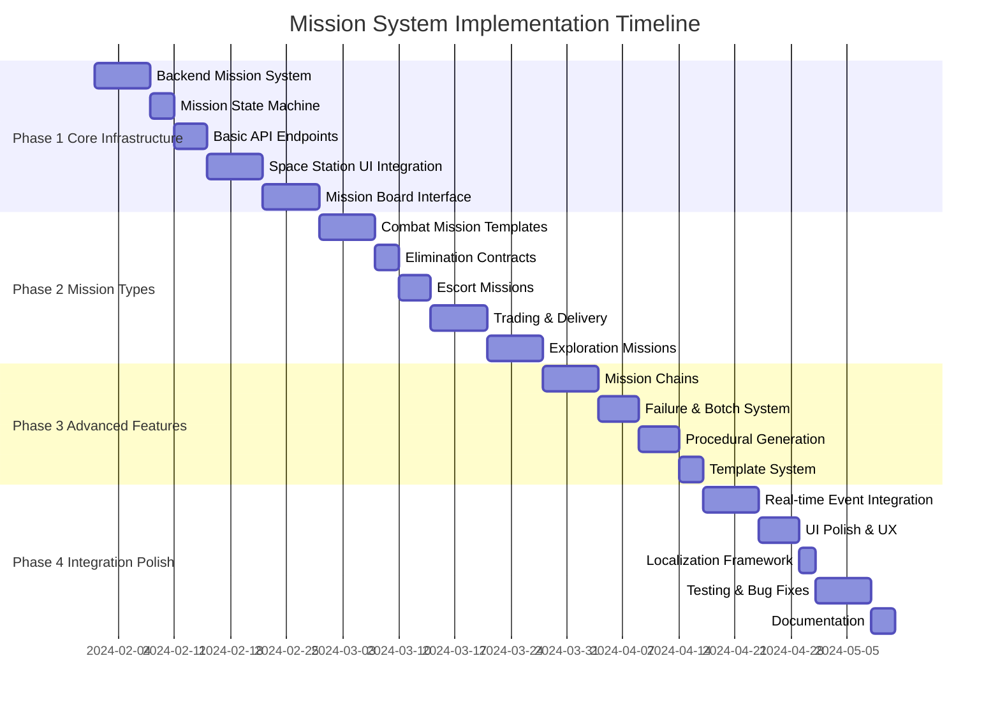

### 11.2 Component Dependency Matrix

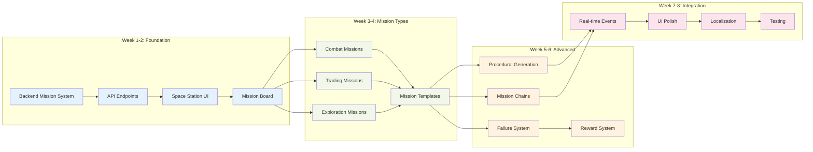

### 11.3 Detailed Phase Breakdown

#### Phase 1: Core Infrastructure (Weeks 1-2)
- **Week 1**: Backend mission system (states, manager, basic API)
- **Week 2**: Space station UI integration and mission board interface

#### Phase 2: Mission Types and Templates (Weeks 3-4)  
- **Week 3**: Combat and elimination mission implementation
- **Week 4**: Trading, delivery, and exploration missions

#### Phase 3: Advanced Features (Weeks 5-6)
- **Week 5**: Mission chains, failure handling, and botch system
- **Week 6**: Procedural generation and template system

#### Phase 4: Integration and Polish (Weeks 7-8)
- **Week 7**: Real-time event integration with StarfieldManager
- **Week 8**: UI polish, localization, and testing

## 12. Missing Implementation Details from Mission Spec

### 12.1 Triggers and Callbacks System (From Spec Section 4.3)

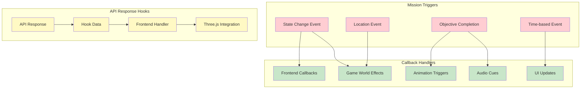

#### 12.1.1 Mission Triggers Implementation

```python
class MissionTriggerSystem:
    def __init__(self):
        self.triggers = {}  # event_type -> list of callback functions
        
    def register_trigger(self, event_type, callback):
        """Register a callback for a specific mission event"""
        if event_type not in self.triggers:
            self.triggers[event_type] = []
        self.triggers[event_type].append(callback)
    
    def fire_trigger(self, event_type, mission_data, context=None):
        """Fire all callbacks for an event type"""
        callbacks = self.triggers.get(event_type, [])
        response_hooks = []
        
        for callback in callbacks:
            hook_data = callback(mission_data, context)
            if hook_data:
                response_hooks.append(hook_data)
        
        return response_hooks

# Example trigger registration
def on_mission_accepted(mission_data, context):
    """Trigger when mission is accepted"""
    return {
        'type': 'spawn_enemies',
        'data': {
            'mission_id': mission_data['id'],
            'enemy_types': mission_data.get('enemy_spawn', []),
            'location': mission_data['location']
        }
    }

def on_objective_complete(mission_data, context):
    """Trigger when objective is completed"""
    return {
        'type': 'play_audio',
        'data': {
            'sound': 'objective_complete.wav',
            'volume': 0.7
        }
    }
```

#### 12.1.2 Custom Fields Support (Spec Section 4.3)

```python
class MissionCustomFields:
    """Support for mission-specific custom data fields"""
    
    @staticmethod
    def validate_custom_fields(mission_data):
        """Validate custom fields based on mission type"""
        mission_type = mission_data.get('type')
        custom_fields = mission_data.get('customFields', {})
        
        validators = {
            'escort': MissionCustomFields.validate_escort_fields,
            'delivery': MissionCustomFields.validate_delivery_fields,
            'elimination': MissionCustomFields.validate_combat_fields,
            'reconnaissance': MissionCustomFields.validate_scan_fields
        }
        
        validator = validators.get(mission_type)
        if validator:
            return validator(custom_fields)
        return True
    
    @staticmethod
    def validate_escort_fields(fields):
        required = ['convoy_ships', 'route_waypoints', 'threat_level']
        return all(field in fields for field in required)
    
    @staticmethod
    def validate_delivery_fields(fields):
        required = ['cargo_type', 'pickup_location', 'delivery_location', 'cargo_value']
        return all(field in fields for field in required)

# Example custom fields structure
ESCORT_MISSION_CUSTOM_FIELDS = {
    "convoy_ships": [
        {"type": "merchant_freighter", "name": "Stellar Trader", "hull": 1000},
        {"type": "escort_fighter", "name": "Guardian-1", "hull": 400}
    ],
    "route_waypoints": [
        {"x": 100, "y": 50, "z": 200, "name": "Waypoint Alpha"},
        {"x": 300, "y": 75, "z": 400, "name": "Waypoint Beta"}
    ],
    "threat_level": "medium",
    "patrol_routes": ["outer_rim_patrol", "merchant_corridor"],
    "emergency_protocols": {
        "retreat_threshold": 0.3,
        "distress_frequency": "121.5"
    }
}
```

### 12.2 Narrative Impact and Cascade Effects (Spec Section 4.2)

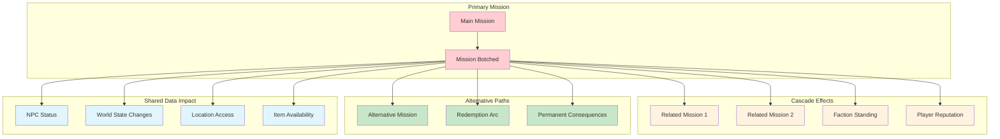

#### 12.2.1 Cascade Effects Implementation

```python
class MissionCascadeHandler:
    def __init__(self, mission_manager):
        self.mission_manager = mission_manager
        self.cascade_rules = {}
        self.shared_data = {}
    
    def register_cascade_rule(self, mission_id, rule):
        """Register a cascade effect rule for a mission"""
        if mission_id not in self.cascade_rules:
            self.cascade_rules[mission_id] = []
        self.cascade_rules[mission_id].append(rule)
    
    def handle_mission_botched(self, mission_id, context):
        """Handle cascade effects when a mission is botched"""
        rules = self.cascade_rules.get(mission_id, [])
        
        for rule in rules:
            effect_type = rule['type']
            effect_data = rule['data']
            
            if effect_type == 'botch_related_missions':
                self.botch_related_missions(effect_data['mission_ids'])
            elif effect_type == 'modify_faction_standing':
                self.modify_faction_standing(effect_data['faction'], effect_data['change'])
            elif effect_type == 'update_shared_data':
                self.update_shared_data(effect_data['key'], effect_data['value'])
            elif effect_type == 'unlock_alternative':
                self.unlock_alternative_mission(effect_data['alternative_mission_id'])

# Example cascade rule registration
federation_escort_cascade = {
    'type': 'botch_related_missions',
    'data': {
        'mission_ids': ['federation_patrol_001', 'federation_supply_run_002'],
        'reason': 'convoy_destroyed'
    }
}

trader_reputation_cascade = {
    'type': 'modify_faction_standing',
    'data': {
        'faction': 'traders_guild',
        'change': -25,
        'reason': 'failed_delivery_contract'
    }
}
```

### 12.3 Performance Scaling Strategy (Spec Section 6.1)

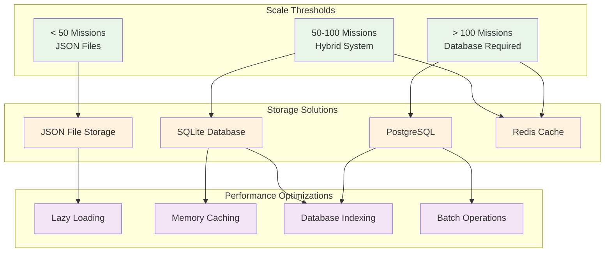

#### 12.3.1 Database Migration Strategy

```python
class MissionStorageManager:
    def __init__(self, config):
        self.storage_type = self.determine_storage_type(config)
        self.storage_backend = self.create_storage_backend()
    
    def determine_storage_type(self, config):
        """Determine appropriate storage type based on scale"""
        mission_count = config.get('expected_mission_count', 0)
        
        if mission_count < 50:
            return 'json_files'
        elif mission_count < 100:
            return 'sqlite'
        else:
            return 'postgresql'
    
    def migrate_from_json_to_database(self):
        """Migrate from JSON files to database when threshold reached"""
        json_missions = self.load_all_json_missions()
        db_backend = self.create_database_backend()
        
        for mission_data in json_missions:
            db_backend.save_mission(mission_data)
        
        # Archive JSON files
        self.archive_json_files()

# Performance monitoring
class MissionPerformanceMonitor:
    def __init__(self):
        self.metrics = {
            'load_times': [],
            'save_times': [],
            'query_times': [],
            'memory_usage': []
        }
    
    def should_migrate_to_database(self):
        """Determine if migration to database is needed"""
        avg_load_time = sum(self.metrics['load_times'][-10:]) / 10
        return avg_load_time > 0.5  # 500ms threshold
```

### 12.4 Testing Strategy Implementation (Spec Section 6.1)

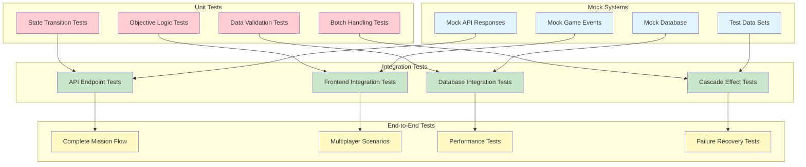

### 12.5 Mission File Organization Strategy (Spec Section 3.3)

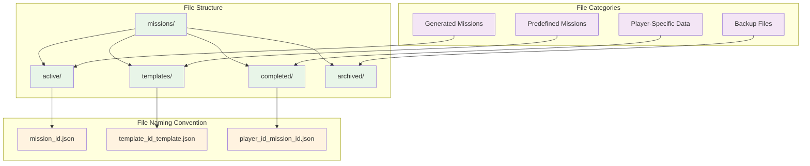

## 13. Critical Implementation Details

### 13.1 Data Persistence Strategy
- JSON files for development/small scale
- SQLite migration path for production
- Automatic backup system for mission data
- Player save game integration

### 12.2 Performance Optimization
- Mission data caching in browser
- Lazy loading of mission details
- Efficient objective checking during gameplay
- Batched API updates for multiple objective completion

### 12.3 Error Handling and Recovery
- Graceful degradation when API is unavailable
- Local mission state caching
- Automatic retry mechanisms for failed API calls
- Data validation and corruption recovery

This updated implementation plan now fully addresses all elements from the mission specification while providing detailed integration with the existing space station docking interface and game systems.
