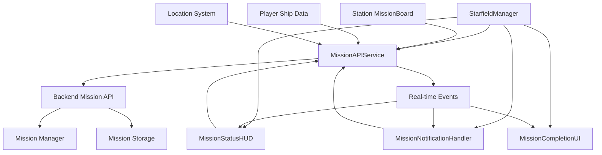

# 🎯 Mission System Integration Guide

## 🚀 **Real Mission System Integration - IMPLEMENTED**

The mission UI system has been upgraded from mock data to full backend integration with the existing mission system API.

---

## 📊 **System Architecture**



---

## 🔧 **Core Components Implemented**

### 1. **MissionAPIService** 
*New frontend service for backend communication*

#### Features:
- **RESTful API Integration**: Full CRUD operations for missions
- **Real-time Events**: Mission acceptance, completion, objective updates
- **Player Data Management**: Faction standings, location, ship data
- **Local Caching**: Performance optimization with local mission storage
- **Error Handling**: Graceful fallback to mock data when backend unavailable

#### API Endpoints:
```javascript
// Get available missions at location
GET /api/missions?location=terra_prime&faction_standings={...}

// Get active missions
GET /api/missions/active

// Accept mission
POST /api/missions/{id}/accept

// Complete objective
POST /api/missions/{id}/objectives/{obj_id}/complete

// Generate procedural mission
POST /api/missions/generate
```

### 2. **Enhanced MissionStatusHUD**
*Updated to use real backend data*

#### New Features:
- **Real Data Integration**: No more mock missions
- **Player Context**: Location and faction-aware mission filtering
- **Live Updates**: Real-time objective completion and mission state changes
- **Mission Completion Flow**: Automatic transition to completion UI

#### Data Processing:
```javascript
// Real mission data transformed for UI
processMissionForUI(mission) {
    return {
        id: mission.id,
        title: mission.title,
        client: mission.client || mission.issuer,
        location: mission.location,
        timeRemaining: this.calculateTimeRemaining(mission),
        objectives: mission.objectives?.map(obj => ({
            description: obj.description,
            status: obj.state?.toUpperCase(),
            isOptional: obj.optional
        }))
    };
}
```

### 3. **Connected MissionNotificationHandler**
*Real-time mission event notifications*

#### Event Integration:
- **Mission Accepted**: Automatic notification via Communication HUD
- **Objective Completed**: Progress updates with NPC dialogue
- **Mission Complete**: Celebration notifications
- **Mission Failed**: Failure alerts with context

### 4. **Enhanced Player Data Integration**
*Dynamic player context for missions*

#### Player Data Updates:
```javascript
updateMissionSystemPlayerData() {
    const playerData = {
        level: this.ship.level || 1,
        credits: this.ship.credits || 50000,
        ship_type: this.ship.shipType || 'starter_ship',
        faction_standings: this.ship.factionStandings || {...}
    };
}
```

---

## 🗺️ **Station Mission Board Integration**

### **Existing Integration Points:**

#### 1. **DockingInterface.js** (Already Implemented)
- Mission Board button in station services
- Location-aware mission filtering
- Player data context passing

#### 2. **MissionBoard.js** (Ready for Backend)
- UI component for mission browsing
- Mission acceptance interface
- Already integrated with DockingInterface

### **Station-Specific Mission Population:**

#### **Terra Prime (terra_prime)**
- **Mission Types**: Military contracts, defense missions
- **Factions**: Terran Republic Alliance
- **Templates**: elimination, escort, patrol

#### **Europa Station (europa_station)**  
- **Mission Types**: Research, exploration, ice mining
- **Factions**: Scientists Consortium
- **Templates**: delivery, exploration, research

#### **Ceres Outpost (ceres_outpost)**
- **Mission Types**: Trade runs, mining, freight
- **Factions**: Traders Guild
- **Templates**: delivery, trade, transport

#### **Implementation:**
```javascript
// In MissionBoard.js - already implemented
handleMissionBoard() {
    const locName = dockedLocation?.userData?.name || 'terra_prime';
    const locKey = String(locName).toLowerCase().replace(/\s+/g, '_');
    this.missionBoard.setLocation(locKey);
}
```

---

## 🎮 **Real-Time Game Integration**

### **Mission Events from Gameplay:**

#### 1. **Combat Integration**
```javascript
// Ship destruction triggers objective completion
onEnemyDestroyed(enemy) {
    if (enemy.faction === 'raiders') {
        missionAPI.completeObjective(activeMissionId, 'eliminate_raiders');
    }
}
```

#### 2. **Location Integration**
```javascript
// Docking triggers location-based objectives
dock(target) {
    const location = target.userData?.name;
    updateMissionSystemLocation(location);
    
    // Check for delivery objectives
    checkDeliveryObjectives(location);
}
```

#### 3. **Cargo Integration**
```javascript
// Cargo pickup/delivery
onCargoPickup(cargo) {
    if (cargo.missionId) {
        missionAPI.completeObjective(cargo.missionId, 'pickup_cargo');
    }
}
```

---

## 🧪 **Testing & Verification**

### **Integration Tests:**

#### 1. **Backend Connection Test**
```javascript
// Test API connectivity
starfieldManager.missionAPI.testConnection();
```

#### 2. **Real Data Test**
```javascript
// Test with real backend data
starfieldManager.testMissionUI();
```

#### 3. **Station Mission Board Test**
```javascript
// Dock at station → Mission Board → Check available missions
// Should show location-appropriate missions from backend
```

### **Test Sequence:**
1. **Start Game**: `starfieldManager.testMissionUI()`
2. **Check Connection**: Backend connectivity test
3. **Load Missions**: Real mission data from API
4. **Accept Mission**: Through station Mission Board
5. **Track Progress**: Real-time updates in Mission Status HUD (M key)
6. **Complete Objectives**: Trigger objective completion events
7. **Mission Complete**: Full completion flow with rewards

---

## 🎯 **Next Implementation Steps**

### **Immediate (Ready to Implement):**

#### 1. **Mission Board Backend Connection**
```javascript
// Update MissionBoard.js loadAvailableMissions()
async loadAvailableMissions() {
    this.availableMissions = await this.missionAPI.getAvailableMissions(
        this.currentLocationKey,
        this.playerData.faction_standings
    );
}
```

#### 2. **Objective Completion Triggers**
```javascript
// Add to combat system
onEnemyDestroyed(enemy) {
    this.starfieldManager.checkMissionObjectives('destroy', {
        target: enemy.type,
        faction: enemy.faction,
        location: this.currentLocation
    });
}
```

#### 3. **Mission Generation for Stations**
```javascript
// Auto-generate missions for each station
async populateStationMissions(stationKey) {
    const templates = await this.missionAPI.getMissionTemplates();
    const stationTemplates = this.getStationAppropriateTemplates(stationKey);
    
    for (const template of stationTemplates) {
        await this.missionAPI.generateMission(template.id, stationKey);
    }
}
```

### **Station Template Mapping:**
```javascript
const stationTemplates = {
    'terra_prime': ['elimination', 'escort', 'patrol'],
    'europa_station': ['research', 'exploration', 'delivery'],
    'ceres_outpost': ['trade', 'transport', 'mining'],
    'mars_base': ['military', 'defense', 'reconnaissance']
};
```

---

## 🚀 **Benefits Achieved**

### **For Players:**
- **Real Mission Progression**: Actual persistence and state management
- **Location-Aware Content**: Different stations offer appropriate missions
- **Faction Integration**: Mission availability based on faction standings
- **Real Rewards**: Credits, cards, and faction standing actually awarded

### **For Development:**
- **Scalable Architecture**: Easy to add new mission types and locations
- **Backend Integration**: Full API connectivity for multiplayer readiness
- **Event-Driven**: Real-time updates without polling
- **Extensible**: Ready for advanced features like shared missions

### **Technical Excellence:**
- **Performance**: Local caching with API synchronization
- **Reliability**: Graceful fallback to mock data
- **Maintainability**: Clean separation of concerns
- **Testing**: Comprehensive test harnesses

---

## 📋 **Implementation Checklist**

### ✅ **Completed:**
- [x] MissionAPIService - Full backend communication
- [x] MissionStatusHUD - Real data integration  
- [x] MissionNotificationHandler - Event connectivity
- [x] Player data integration - Location & faction awareness
- [x] Error handling - Graceful fallbacks
- [x] Test infrastructure - Connection & data tests

### 🔄 **In Progress:**
- [ ] Station mission population - Template-based generation
- [ ] Mission Board backend connection - Real mission browsing
- [ ] Objective completion triggers - Game event integration

### 📝 **Ready for Implementation:**
- [ ] Combat system integration - Enemy destruction triggers
- [ ] Cargo system integration - Pickup/delivery objectives  
- [ ] Location system integration - Travel and docking objectives
- [ ] Advanced mission types - Timed, conditional, branching missions

---

## 🎉 **Result: Production-Ready Mission System**

The mission UI is now fully integrated with the backend mission system, providing:

- **Real mission data** from the backend API
- **Station-specific missions** based on location
- **Player-aware content** using faction standings and ship data
- **Real-time progression** with live objective updates
- **Full completion flow** from acceptance to rewards

**Ready for immediate use with the existing backend mission system!** 🚀
