# Complete Object Discovery Process - UML Sequence Diagram

## Overview

This document provides a comprehensive UML sequence diagram for the complete object discovery process in PlanetZ, including all interactions between Star Charts, Target Computer, HUDs, and notification systems. The diagram covers both proximity-based discovery and click-based object selection.

## Key Components

- **StarfieldManager**: Main game manager coordinating all systems
- **StarChartsManager**: Discovery system with spatial optimization and fog of war
- **StarChartsUI**: User interface for star charts with click interactions
- **TargetComputerManager**: Target selection and wireframe rendering
- **StarChartsTargetComputerIntegration**: Bridge between star charts and targeting
- **NotificationSystem**: Discovery notifications and ship's log updates
- **AudioSystem**: Sound effects for discoveries
- **AchievementSystem**: Progress tracking for discoveries

## Complete Discovery Process Sequence Diagram

```mermaid
sequenceDiagram
    participant Player
    participant StarfieldManager as StarfieldManager
    participant StarChartsManager as StarChartsManager
    participant StarChartsUI as StarChartsUI
    participant TargetComputerManager as TargetComputerManager
    participant Integration as StarChartsTargetComputerIntegration
    participant NotificationSystem as NotificationSystem
    participant AudioSystem as AudioSystem
    participant AchievementSystem as AchievementSystem
    participant ShipLog as Ship's Log
    participant WireframeScene as THREE.Scene (Wireframes)

    Note over Player, WireframeScene: PHASE 1: System Initialization & Spatial Grid Setup

    StarfieldManager->>StarChartsManager: constructor(scene, camera, viewManager, solarSystemManager, targetComputerManager)
    StarChartsManager->>StarChartsManager: initializeSpatialGrid()
    Note right of StarChartsManager: Build spatial partitioning from dynamic solar system data
    StarChartsManager->>StarChartsManager: getCelestialBodies() from solarSystemManager
    StarChartsManager->>StarChartsManager: Create grid cells (50km x 50km)
    StarChartsManager->>StarChartsManager: startDiscoveryLoop() - every 1000ms

    StarChartsManager->>Integration: constructor(starChartsManager, targetComputerManager, solarSystemManager)
    Integration->>Integration: registerDiscoveryCallbacks()
    Integration->>StarChartsManager: addDiscoveryCallback(handleDiscoveryEvent)

    Note over Player, WireframeScene: PHASE 2: Proximity-Based Discovery Loop

    loop Every 1000ms
        StarChartsManager->>StarChartsManager: checkDiscoveryRadius()
        StarChartsManager->>StarChartsManager: getPlayerPosition() from viewManager
        StarChartsManager->>StarChartsManager: getEffectiveDiscoveryRadius() from Target CPU
        Note right of StarChartsManager: Discovery radius: 50km (Level 1) to 200km (Level 5)
        
        StarChartsManager->>StarChartsManager: getNearbyObjects(playerPosition, discoveryRadius)
        Note right of StarChartsManager: Use spatial grid for O(1) lookup instead of O(n)
        
        alt Objects found within discovery radius
            StarChartsManager->>StarChartsManager: batchProcessDiscoveries(nearbyObjects, playerPosition, discoveryRadius)
            
            loop For each undiscovered object in range
                StarChartsManager->>StarChartsManager: calculateDistance(playerPosition, objectPosition)
                
                alt Distance <= discoveryRadius AND not already discovered
                    StarChartsManager->>StarChartsManager: addDiscoveredObject(objectId, 'proximity', 'player')
                    Note right of StarChartsManager: Duplicate prevention with _discoveryInProgress Set
                    
                    StarChartsManager->>StarChartsManager: discoveredObjects.add(normalizedId)
                    StarChartsManager->>StarChartsManager: discoveryMetadata.set(normalizedId, discoveryData)
                    StarChartsManager->>StarChartsManager: saveDiscoveryState() to localStorage
                    
                    StarChartsManager->>AchievementSystem: updateAchievementProgress()
                    AchievementSystem-->>StarChartsManager: Achievement progress updated
                    
                    StarChartsManager->>StarChartsManager: getObjectById(objectId) for notification data
                    StarChartsManager->>StarChartsManager: shouldNotifyDiscovery(objectData.type)
                    
                    alt Should notify (planets, stations, beacons - not stars/moons)
                        StarChartsManager->>NotificationSystem: showDiscoveryNotification(objectData, category)
                        NotificationSystem->>AudioSystem: playAudio('blurb.mp3')
                        AudioSystem-->>Player: Discovery sound effect
                        NotificationSystem-->>Player: "{Object Name} discovered!" notification
                        
                        StarChartsManager->>ShipLog: addLogEntry("Discovery: {objectName}")
                        ShipLog-->>Player: Ship's log updated with discovery
                    end
                    
                    StarChartsManager->>StarChartsManager: triggerDiscoveryCallbacks(normalizedId, discoveryData)
                    StarChartsManager->>Integration: handleDiscoveryEvent(objectId, discoveryData)
                    
                    Integration->>Integration: updateEnhancedTargetData(objectId, discoveryData)
                    Integration->>Integration: notifyTargetComputerOfDiscovery(objectId)
                    Integration->>TargetComputerManager: addTargetToTargetComputer(targetData)
                    Integration->>TargetComputerManager: updateTargetList()
                    
                    Note over Integration, TargetComputerManager: Force immediate target computer sync for responsive updates
                    StarChartsManager->>Integration: syncTargetData()
                    
                    alt Currently selected target was just discovered
                        Integration->>TargetComputerManager: Check if current target matches discovered object
                        Integration->>TargetComputerManager: Clear cached discovery status (_lastDiscoveryStatus = undefined)
                        Integration->>TargetComputerManager: Force wireframe recreation for color update
                        
                        TargetComputerManager->>WireframeScene: wireframeScene.remove(targetWireframe)
                        TargetComputerManager->>TargetComputerManager: targetWireframe.geometry.dispose()
                        TargetComputerManager->>TargetComputerManager: targetWireframe.material.dispose()
                        TargetComputerManager->>TargetComputerManager: targetWireframe = null
                        
                        TargetComputerManager->>TargetComputerManager: updateTargetDisplay()
                        TargetComputerManager->>TargetComputerManager: createTargetWireframe() with discovery colors
                        TargetComputerManager->>WireframeScene: scene.add(new wireframe with yellow/faction colors)
                        WireframeScene-->>Player: Wireframe color changes from gray to discovered colors
                    end
                end
            end
        end
    end

    Note over Player, WireframeScene: PHASE 3: Manual Object Selection via Star Charts UI

    Player->>StarChartsUI: Click on object (discovered or undiscovered)
    StarChartsUI->>StarChartsUI: handleMapClick(event)
    StarChartsUI->>StarChartsUI: Check isInteractiveElement (data-object-id, data-name)
    StarChartsUI->>StarChartsUI: Extract objectId from clicked SVG element
    
    StarChartsUI->>StarChartsManager: getObjectData(objectId) / findObjectByName(objectId)
    StarChartsManager-->>StarChartsUI: Return object data
    
    StarChartsUI->>StarChartsUI: selectObject(object)
    StarChartsUI->>StarChartsUI: showObjectDetails(object) - display object info panel
    StarChartsUI->>StarChartsUI: centerOn(object) - always center clicked object
    StarChartsUI->>StarChartsUI: zoomInIfAllowed() - increment zoom unless at max
    StarChartsUI->>StarChartsUI: render() - update star charts display
    
    StarChartsUI->>StarChartsManager: selectObjectById(object.id)
    StarChartsManager->>StarChartsManager: normalizeObjectId(objectId) - handle case sensitivity
    
    alt Target Computer available
        opt Ensure target computer enabled
            StarChartsManager->>TargetComputerManager: targetComputerEnabled = true (if false)
        end
        
        StarChartsManager->>TargetComputerManager: setTargetById(normalizedId)
        
        alt Target selection successful
            TargetComputerManager->>TargetComputerManager: findTargetByIdOrName(normalizedId)
            TargetComputerManager->>TargetComputerManager: setCurrentTarget(targetData)
            TargetComputerManager->>TargetComputerManager: createTargetWireframe()
            
            TargetComputerManager->>TargetComputerManager: clearTargetWireframe() - remove existing
            TargetComputerManager->>WireframeScene: wireframeScene.remove(old wireframe)
            
            TargetComputerManager->>TargetComputerManager: isObjectDiscovered(targetData)
            TargetComputerManager->>StarChartsManager: isDiscovered(objectId) - check discovery status
            StarChartsManager-->>TargetComputerManager: Return discovery status
            
            alt Object is discovered
                TargetComputerManager->>TargetComputerManager: Create wireframe with faction colors (yellow for neutral)
                Note right of TargetComputerManager: Discovered objects show faction-specific colors
            else Object is undiscovered
                TargetComputerManager->>TargetComputerManager: Create wireframe with gray "unknown" colors
                Note right of TargetComputerManager: Undiscovered objects show gray wireframes
            end
            
            TargetComputerManager->>WireframeScene: scene.add(targetWireframe)
            TargetComputerManager->>TargetComputerManager: updateTargetDisplay()
            TargetComputerManager-->>Player: Target HUD shows selected object with appropriate colors
            
            StarChartsManager->>StarChartsManager: triggerTargetSelectionCallbacks(normalizedId)
            
        else Target selection failed (dev mode)
            StarChartsManager->>StarChartsManager: throw Error("Target lookup failed") - crash for debugging
            Note right of StarChartsManager: Fail-fast approach for development debugging
        end
    else Target Computer not available
        StarChartsManager->>StarChartsManager: Warn integration not available
    end

    Note over Player, WireframeScene: PHASE 4: Discovery Status Change Detection & Wireframe Updates

    alt Object discovery status changes while targeted
        TargetComputerManager->>TargetComputerManager: updateTargetDisplay() - called periodically
        TargetComputerManager->>TargetComputerManager: getCurrentTargetData()
        TargetComputerManager->>TargetComputerManager: isObjectDiscovered(targetData)
        TargetComputerManager->>TargetComputerManager: Check if discovery status changed from cached value
        
        alt Discovery status changed
            Note right of TargetComputerManager: Critical: Discovery status change detected
            TargetComputerManager->>TargetComputerManager: Update _lastDiscoveryStatus cache
            
            TargetComputerManager->>WireframeScene: wireframeScene.remove(targetWireframe)
            Note right of TargetComputerManager: CRITICAL FIX: Use wireframeScene not main scene
            TargetComputerManager->>TargetComputerManager: targetWireframe.geometry.dispose()
            TargetComputerManager->>TargetComputerManager: targetWireframe.material.dispose()
            TargetComputerManager->>TargetComputerManager: targetWireframe = null
            
            TargetComputerManager->>TargetComputerManager: createTargetWireframe() - recreate with new colors
            TargetComputerManager->>WireframeScene: scene.add(new wireframe with updated colors)
            TargetComputerManager-->>Player: Wireframe color updates in real-time
        end
    end

    Note over Player, WireframeScene: PHASE 5: Cross-System Synchronization & Cleanup

    StarChartsManager->>StarChartsManager: Cleanup discovery in progress after 100ms timeout
    StarChartsManager->>StarChartsManager: _discoveryInProgress.delete(normalizedId)
    
    Integration->>Integration: Periodic syncTargetData() for consistency
    Integration->>TargetComputerManager: Ensure target lists stay synchronized
    
    Note over Player, WireframeScene: Error Handling & Performance Optimizations
    
    rect rgb(255, 240, 240)
        Note over StarChartsManager: Performance Optimizations
        Note over StarChartsManager: • Spatial grid partitioning (50km cells) for O(1) proximity lookup
        Note over StarChartsManager: • Discovery interval throttling (1000ms) to prevent excessive checks  
        Note over StarChartsManager: • Batch processing of multiple discoveries
        Note over StarChartsManager: • Discovery pacing to prevent notification fatigue
        Note over StarChartsManager: • Memory cleanup for discovery progress tracking
    end
    
    rect rgb(240, 255, 240)
        Note over TargetComputerManager: Critical Bug Fixes Applied
        Note over TargetComputerManager: • Use wireframeScene instead of main scene for wireframe removal
        Note over TargetComputerManager: • Proper geometry/material disposal to prevent memory leaks
        Note over TargetComputerManager: • Discovery status caching with change detection
        Note over TargetComputerManager: • Rate limiting for discovery status logging (0.1% of changes)
    end
    
    rect rgb(240, 240, 255)
        Note over Integration: Integration Reliability
        Note over Integration: • Duplicate prevention with _discoveryInProgress Set
        Note over Integration: • Immediate target computer sync for responsive updates
        Note over Integration: • Forced wireframe recreation for current target discoveries
        Note over Integration: • Error handling for discovery callbacks
    end
```

## Key Discovery Mechanisms

### 1. Proximity-Based Discovery
- **Trigger**: Player ship enters discovery radius of undiscovered object
- **Frequency**: Every 1000ms (1 second) for responsive discovery
- **Radius**: Dynamic based on Target Computer level (50km to 200km)
- **Optimization**: Spatial grid partitioning for O(1) proximity lookup
- **Notifications**: Audio + visual notification + ship's log entry

### 2. Click-Based Object Selection
- **Trigger**: User clicks on object in Star Charts UI
- **Behavior**: Always centers and zooms to object, selects for targeting
- **Integration**: Seamless integration with Target Computer wireframes
- **Visual Feedback**: Object details panel + wireframe color updates

### 3. Discovery Status Synchronization
- **Real-time Updates**: Discovery status changes trigger immediate wireframe color updates
- **Cross-System Sync**: Star Charts ↔ Target Computer integration maintains consistency
- **Performance**: Rate-limited logging and optimized status checking

## Critical Bug Fixes Implemented

### 1. Wireframe Scene Management
- **Issue**: Wrong scene used for wireframe removal causing wireframe stacking
- **Fix**: Always use `wireframeScene.remove()` instead of `scene.remove()`
- **Impact**: Prevents wireframe accumulation and memory leaks

### 2. Discovery Status Caching
- **Issue**: Infinite wireframe recreation loops
- **Fix**: Proper discovery status change detection with caching
- **Impact**: Stable wireframe updates without performance degradation

### 3. Memory Management
- **Issue**: Geometry and material memory leaks
- **Fix**: Proper disposal of Three.js resources before wireframe recreation
- **Impact**: Prevents memory accumulation during extended gameplay

## Performance Characteristics

- **Spatial Grid**: O(1) proximity lookup vs O(n) linear search
- **Discovery Throttling**: 1000ms intervals prevent excessive processing
- **Batch Processing**: Multiple discoveries processed together
- **Memory Cleanup**: Automatic cleanup of temporary discovery tracking
- **Rate Limiting**: 0.1% logging rate for discovery status changes

## Integration Points

1. **StarChartsManager ↔ TargetComputerManager**: Discovery status and target selection
2. **StarChartsUI ↔ StarChartsManager**: Click interactions and object selection  
3. **StarChartsManager ↔ NotificationSystem**: Discovery notifications and audio
4. **StarChartsManager ↔ AchievementSystem**: Discovery progress tracking
5. **Integration Layer**: Centralized coordination between all systems

This sequence diagram represents the complete, production-ready object discovery system with all optimizations, bug fixes, and cross-system integrations implemented.
