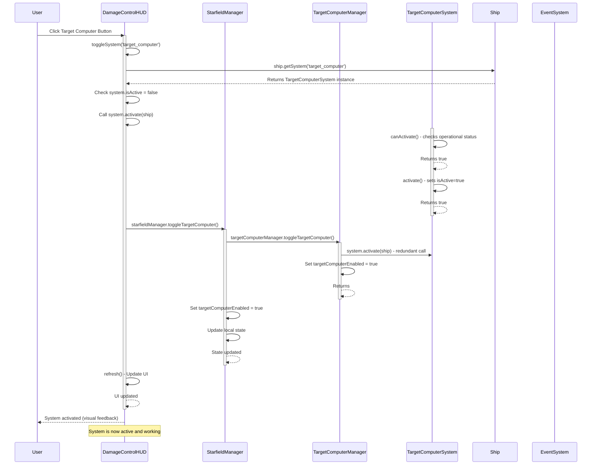

# Operations Systems Startup Sequence

This document describes the sequence flow when a user activates systems through the Operations HUD (Damage Control interface).

## Target Computer Activation Sequence



## Key Components

### DamageControlHUD
- Entry point for user system activation
- Handles UI button clicks and visual feedback
- Manages system state synchronization

### StarfieldManager
- Coordinates between UI and system managers
- Maintains local state copies for performance
- Handles visual elements (HUD, reticles, etc.)

### TargetComputerManager
- Core targeting system logic
- Manages target lists and selection
- Handles wireframe and visual targeting elements

### TargetComputerSystem
- Low-level system implementation
- Handles activation/deactivation logic
- Manages energy consumption and requirements

## Potential Issues

1. **Redundant Activation Calls**: The system.activate() method is called twice (lines 16 and 27)
2. **State Synchronization**: Multiple layers maintain separate state that must be kept in sync
3. **Complex Flow**: 4-layer deep call chain creates multiple failure points

## Debugging

To debug system activation issues:

```javascript
// Enable debug channels
debugEnable('TARGETING', 'UTILITY', 'P1');

// Check system state
const ship = window.starfieldManager?.viewManager?.getShip();
const targetComputer = ship?.getSystem('target_computer');
console.log('System state:', {
    exists: !!targetComputer,
    isActive: targetComputer?.isActive,
    canActivate: targetComputer?.canActivate(ship)
});
```
