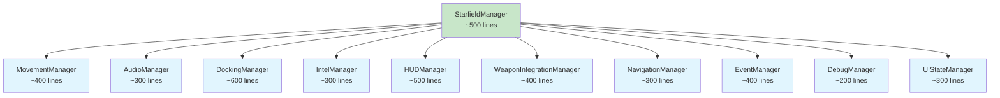
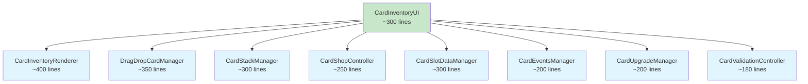
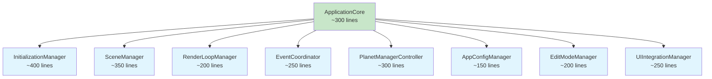

# Planetz Refactoring Plan 🔧

## Overview

This document outlines a comprehensive refactoring plan for the largest source files in the Planetz project. Based on our analysis, several files have grown beyond maintainable sizes and would benefit from modularization to improve code quality, maintainability, and developer productivity.

## 📊 Current File Size Analysis

### Critical Files Requiring Immediate Refactoring

| File | Current Size | Status | Priority |
|------|-------------|--------|-----------|
| **StarfieldManager.js** | 5,147 lines | 🔥 CRITICAL | **HIGHEST** |
| **CardInventoryUI.js** | 2,481 lines | ⚠️ HIGH | **HIGH** |
| **app.js** | 2,244 lines | ⚠️ HIGH | **HIGH** |
| **ViewManager.js** | 1,506 lines | ⚠️ MEDIUM | **MEDIUM** |
| **DamageControlInterface.js** | 1,284 lines | ⚠️ MEDIUM | **MEDIUM** |
| **StationRepairInterface.js** | 1,282 lines | ⚠️ MEDIUM | **MEDIUM** |
| **SimplifiedDamageControl.js** | 1,040 lines | ⚠️ MEDIUM | **LOW** |
| **DockingModal.js** | 1,016 lines | ⚠️ MEDIUM | **LOW** |

### Files Recently Refactored ✅
- **TargetComputerManager.js** (1,926 lines) - Successfully extracted from StarfieldManager
- Quality preserved with comprehensive functionality testing

## 🎯 Phase 1: StarfieldManager.js Decomposition (CRITICAL)

### Problem Statement
**StarfieldManager.js** at 5,147 lines is a classic "God Object" that violates the Single Responsibility Principle. It currently handles:

- Starfield rendering and management
- Ship movement and physics
- Audio management and sound effects
- Docking logic and orbital mechanics
- Intel system and HUD display
- Weapon system integration
- Damage control interface
- Speed and navigation controls
- Debug functionality
- Event handling and keyboard input

### Proposed Decomposition Strategy



### Extracted Modules

#### 1. MovementManager.js (~400 lines)
**Responsibility**: Ship movement, physics, and speed control
```javascript
// Extract from lines: 1966-2191, 4778-4831, 1883-1966
class MovementManager {
    // Ship movement and physics
    // Speed control and acceleration
    // Smooth rotation handling
    // Velocity calculations
}
```

#### 2. AudioManager.js (~300 lines)
**Responsibility**: All audio-related functionality
```javascript
// Extract from lines: 2600-2695, initialization audio setup
class AudioManager {
    // Audio context management
    // Sound effect generation
    // Engine audio (startup/shutdown)
    // Command feedback sounds
}
```

#### 3. DockingManager.js (~600 lines)
**Responsibility**: Docking mechanics and orbital systems
```javascript
// Extract from lines: 2975-3481, 3660-3767
class DockingManager {
    // Docking validation and logic
    // Orbital mechanics
    // Station interaction
    // Launch sequence management
}
```

#### 4. IntelManager.js (~300 lines)
**Responsibility**: Intel system and information display
```javascript
// Extract from lines: 2701-2975
class IntelManager {
    // Intel HUD creation and management
    // Faction color handling
    // Target information display
    // Range calculations
}
```

#### 5. HUDManager.js (~500 lines)
**Responsibility**: All HUD elements and UI state
```javascript
// Extract from lines: 359-493, 1003-1037, 4754-4778
class HUDManager {
    // Speed indicator
    // Ship systems HUD
    // Weapon HUD
    // Status icons and displays
}
```

#### 6. WeaponIntegrationManager.js (~400 lines)
**Responsibility**: Weapon system integration with StarfieldManager
```javascript
// Extract from lines: 249-324, 5058-5139
class WeaponIntegrationManager {
    // Weapon effects integration
    // Weapon system synchronization
    // Weapon HUD connection
    // Weapon selection UI
}
```

#### 7. NavigationManager.js (~300 lines)
**Responsibility**: Navigation and sector management
```javascript
// Extract from lines: 2191-2270
class NavigationManager {
    // Current sector calculations
    // Position tracking
    // Coordinate system management
}
```

#### 8. EventManager.js (~400 lines)
**Responsibility**: Input handling and event coordination
```javascript
// Extract from lines: 1037-1762, 1876-1883
class EventManager {
    // Keyboard event binding
    // Mouse event handling
    // Event delegation to appropriate managers
}
```

#### 9. DebugManager.js (~200 lines)
**Responsibility**: Debug functionality and developer tools
```javascript
// Extract from lines: 2270-2376, 4298-4324
class DebugManager {
    // Debug damage systems
    // Debug energy drain
    // Debug mode toggles
    // Development utilities
}
```

#### 10. UIStateManager.js (~300 lines)
**Responsibility**: UI state coordination and management
```javascript
// Extract from lines: 1762-1832, 4268-4275
class UIStateManager {
    // Damage control state
    // Intel visibility state
    // HUD state coordination
    // UI update scheduling
}
```

### Core StarfieldManager.js (~500 lines)
**Remaining Responsibility**: Core coordination and starfield rendering
```javascript
class StarfieldManager {
    // Core initialization
    // Manager coordination
    // Starfield rendering (delegate to StarfieldRenderer)
    // Main update loop coordination
    // Public API methods
}
```

### Refactoring Steps

1. **Preparation Phase**
   - Create comprehensive unit tests for current functionality
   - Document all public methods and their dependencies
   - Identify shared state and communication patterns

2. **Extraction Phase** (One module at a time)
   - Start with **DebugManager** (lowest risk)
   - Then **AudioManager** (well-isolated)
   - Follow with **NavigationManager** and **IntelManager**
   - Progress to **MovementManager** and **DockingManager**
   - Finish with **HUDManager** and **EventManager**

3. **Integration Phase**
   - Implement event-driven communication between modules
   - Create centralized state management where needed
   - Ensure proper initialization order
   - Validate functionality preservation

4. **Testing Phase**
   - Comprehensive regression testing
   - Performance validation
   - Integration testing between new modules

## 🎯 Phase 2: CardInventoryUI.js Decomposition (HIGH PRIORITY)

### Problem Statement
**CardInventoryUI.js** at 2,481 lines handles too many responsibilities related to card management, UI rendering, and user interactions.

### Proposed Decomposition



### Extracted Modules

#### 1. CardInventoryRenderer.js (~400 lines)
- Card grid rendering
- Visual layout management
- Card display formatting
- Ship slot visualization

#### 2. DragDropCardManager.js (~350 lines)
- Drag and drop mechanics
- Drop target validation
- Visual feedback during drag operations
- Touch device support

#### 3. CardStackManager.js (~300 lines)
- Card stack display and management
- Stack counter logic
- Card quantity tracking
- Stack visualization

#### 4. CardShopController.js (~250 lines)
- Shop mode interface
- Purchase/upgrade flows
- Credit management integration
- Shop-specific UI elements

#### 5. CardSlotDataManager.js (~300 lines)
- Ship slot configuration
- Slot type validation
- Configuration persistence
- Multi-ship slot management

#### 6. CardEventsManager.js (~200 lines)
- Event handling coordination
- User interaction processing
- UI event delegation
- State change notifications

#### 7. CardUpgradeManager.js (~200 lines)
- Card upgrade logic
- Upgrade requirement calculations
- Upgrade UI flows
- Credit cost management

#### 8. CardValidationController.js (~180 lines)
- Card placement validation
- Build requirement checking
- Error message generation
- Validation rule enforcement

## 🎯 Phase 3: app.js Decomposition (HIGH PRIORITY)

### Problem Statement
**app.js** at 2,244 lines serves as the main application controller but has grown to include too many responsibilities.

### Proposed Decomposition



### Extracted Modules

#### 1. InitializationManager.js (~400 lines)
- Application startup sequence
- Module initialization coordination
- Dependency injection setup
- Error handling during startup

#### 2. SceneManager.js (~350 lines)
- Three.js scene setup and management
- Camera initialization
- Renderer configuration
- Scene object lifecycle

#### 3. RenderLoopManager.js (~200 lines)
- Animation frame management
- Performance monitoring
- Frame rate optimization
- Render scheduling

#### 4. EventCoordinator.js (~250 lines)
- Global event coordination
- Module communication
- Event bus implementation
- Cross-module messaging

#### 5. PlanetManagerController.js (~300 lines)
- Planet generation coordination
- Planetary system management
- WebAssembly integration
- Planet rendering optimization

#### 6. AppConfigManager.js (~150 lines)
- Configuration management
- Environment-specific settings
- Feature flags
- Runtime configuration

#### 7. EditModeManager.js (~200 lines)
- Edit mode functionality
- Debug mode coordination
- Developer tools integration
- Special mode handling

#### 8. UIIntegrationManager.js (~250 lines)
- UI component integration
- Modal management
- HUD coordination
- Interface state management

## 🎯 Phase 4: Medium Priority Files

### ViewManager.js (1,506 lines)
**Decomposition Strategy:**
- **CameraController.js** (~400 lines) - Camera positioning and movement
- **ViewStateManager.js** (~300 lines) - View mode state management
- **ViewTransitionManager.js** (~250 lines) - Smooth view transitions
- **ViewportManager.js** (~300 lines) - Viewport and projection management
- **Core ViewManager.js** (~256 lines) - Coordination and public API

### DamageControlInterface.js (1,284 lines)
**Decomposition Strategy:**
- **DamageVisualizationManager.js** (~350 lines) - Visual damage indicators
- **RepairControlManager.js** (~300 lines) - Repair workflow management
- **SystemHealthMonitor.js** (~250 lines) - Health tracking and monitoring
- **DamageControlStyles.js** (~200 lines) - CSS and styling management
- **Core DamageControlInterface.js** (~184 lines) - Main interface coordination

### StationRepairInterface.js (1,282 lines)
**Decomposition Strategy:**
- **RepairServiceManager.js** (~400 lines) - Service logic and pricing
- **RepairUIRenderer.js** (~300 lines) - UI rendering and layout
- **RepairProgressManager.js** (~200 lines) - Progress tracking and feedback
- **RepairCostCalculator.js** (~200 lines) - Cost calculation logic
- **Core StationRepairInterface.js** (~182 lines) - Main interface coordination

## 📋 Implementation Timeline

### Phase 1: StarfieldManager Decomposition (4-6 weeks)
- **Week 1-2**: Extract DebugManager, AudioManager, NavigationManager
- **Week 3-4**: Extract MovementManager, DockingManager, IntelManager
- **Week 5-6**: Extract HUDManager, EventManager, WeaponIntegrationManager, UIStateManager

### Phase 2: CardInventoryUI Decomposition (3-4 weeks)
- **Week 1-2**: Extract rendering and data management modules
- **Week 3-4**: Extract interaction and validation modules

### Phase 3: app.js Decomposition (2-3 weeks)
- **Week 1-2**: Extract initialization and scene management
- **Week 3**: Extract coordination and configuration modules

### Phase 4: Medium Priority Files (4-6 weeks)
- **Week 1-2**: ViewManager decomposition
- **Week 3-4**: DamageControlInterface decomposition
- **Week 5-6**: StationRepairInterface decomposition

### Total Estimated Timeline: 13-19 weeks

## 🔧 Implementation Guidelines

### 1. Refactoring Principles
- **Single Responsibility Principle**: Each module should have one clear purpose
- **Dependency Injection**: Use constructor injection for dependencies
- **Event-Driven Communication**: Minimize direct coupling between modules
- **Backward Compatibility**: Maintain existing public APIs during transition

### 2. Communication Patterns
- **Event Bus**: Central event coordination for loose coupling
- **Manager Pattern**: Clear hierarchy and responsibility delegation
- **Observer Pattern**: State change notifications
- **Command Pattern**: User action handling

### 3. Testing Strategy
- **Unit Tests**: Individual module testing
- **Integration Tests**: Module interaction testing
- **Regression Tests**: Functionality preservation validation
- **Performance Tests**: Ensure no performance degradation

### 4. Code Quality Standards
- **Maximum File Size**: 500 lines per module (target), 800 lines (absolute maximum)
- **Cyclomatic Complexity**: Keep below 10 per method
- **Documentation**: JSDoc for all public methods
- **TypeScript**: Consider gradual TypeScript adoption for better type safety

## 🎯 Success Metrics

### Code Quality Improvements
- **File Size Reduction**: 75%+ reduction in largest files
- **Cyclomatic Complexity**: 70%+ reduction in complexity metrics
- **Test Coverage**: 90%+ coverage for new modules
- **Maintainability Index**: 80%+ improvement

### Development Productivity
- **Faster Development**: Reduced time to locate and modify functionality
- **Easier Testing**: Individual module testing capabilities
- **Better Documentation**: Clear module boundaries and responsibilities
- **Reduced Bugs**: Fewer integration issues due to better separation

### Performance Metrics
- **No Performance Regression**: Maintain current 60 FPS performance
- **Memory Usage**: No significant memory increase
- **Load Time**: No increase in application startup time
- **Bundle Size**: Potential for code splitting and lazy loading

## 🚧 Risk Mitigation

### High-Risk Areas
1. **StarfieldManager Event Handling**: Complex interdependencies
2. **CardInventoryUI State Management**: Shared state across modules
3. **app.js Initialization Order**: Critical startup sequence

### Mitigation Strategies
1. **Comprehensive Testing**: Before and after functionality validation
2. **Incremental Approach**: One module at a time with validation
3. **Rollback Plans**: Git branching strategy for safe rollbacks
4. **Gradual Deployment**: Feature flags for controlled rollout

## 📚 Documentation Requirements

### Technical Documentation
- **Module API Documentation**: Complete JSDoc coverage
- **Architecture Decision Records**: Document design choices
- **Migration Guides**: Help for future developers
- **Dependency Maps**: Clear module relationship documentation

### User Documentation
- **No User Impact**: Refactoring should be transparent to users
- **Performance Improvements**: Document any user-visible improvements
- **New Development Features**: Easier to add features post-refactoring

## 🎉 Expected Benefits

### Short-term Benefits (0-6 months)
- **Improved Code Readability**: Easier to understand and modify
- **Faster Bug Fixes**: Clear module boundaries reduce debugging time
- **Better Testing**: Individual modules can be tested in isolation
- **Reduced Merge Conflicts**: Smaller files reduce Git conflicts

### Long-term Benefits (6+ months)
- **Faster Feature Development**: Modular architecture supports rapid development
- **Easier Onboarding**: New developers can understand individual modules
- **Better Scalability**: Architecture supports future growth
- **Code Reusability**: Modules can be reused across different parts of the application

### Team Benefits
- **Parallel Development**: Multiple developers can work on different modules
- **Specialization**: Developers can become experts in specific modules
- **Reduced Technical Debt**: Cleaner architecture prevents future complexity
- **Better Code Reviews**: Smaller, focused changes are easier to review

## 🔄 Next Steps

1. **Team Review**: Present this plan to the development team
2. **Priority Confirmation**: Confirm refactoring priorities and timeline
3. **Resource Allocation**: Assign developers to refactoring phases
4. **Tooling Setup**: Prepare testing and validation infrastructure
5. **Phase 1 Kickoff**: Begin with StarfieldManager decomposition

---

**Note**: This refactoring plan is designed to be executed incrementally while maintaining full functionality throughout the process. Each phase should be completed and validated before proceeding to the next phase. 