# 🏗️ Refactoring UML Diagrams - AFTER State

## Overview

This document shows the target modular architecture after refactoring the three major monolithic files:
- `app.js` (2,245 lines) → **8-10 focused modules** (200-400 lines each)
- `CardInventoryUI.js` (1,462 lines) → **6-8 focused modules** (150-300 lines each)
- `DamageControlInterface.js` (1,285 lines) → **4-6 focused modules** (150-300 lines each)

## 1. Target app.js Architecture (AFTER)

### Class Diagram - New Modular Structure

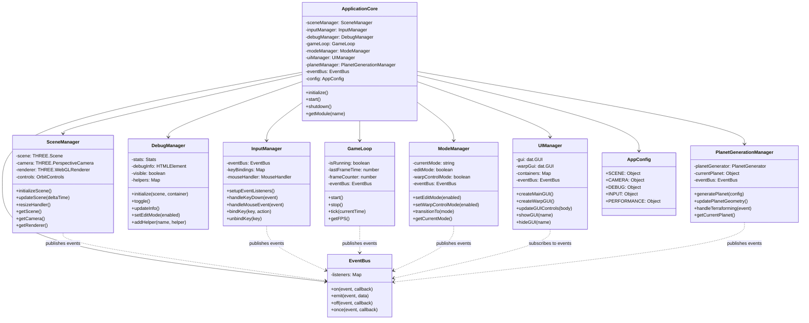

### Sequence Diagram - New Modular Initialization

```mermaid
sequenceDiagram
    participant Main as Main Script
    participant Core as ApplicationCore
    participant Event as EventBus
    participant Scene as SceneManager
    participant Input as InputManager
    participant Debug as DebugManager
    participant Loop as GameLoop
    participant Planet as PlanetGenerationManager

    Main->>Core: Initialize Application
    Core->>Event: Create Event Bus
    Core->>Scene: Initialize Scene Manager
    Scene->>Event: Emit "scene-ready"
    Core->>Input: Initialize Input Manager
    Input->>Event: Emit "input-ready"
    Core->>Debug: Initialize Debug Manager
    Debug->>Event: Emit "debug-ready"
    Core->>Planet: Initialize Planet Manager
    Planet->>Event: Emit "planet-ready"
    Core->>Loop: Initialize Game Loop
    Loop->>Event: Emit "loop-ready"
    
    Event->>Core: All systems ready
    Core->>Core: Start Application
    
    loop Game Loop
        Loop->>Scene: Update Scene
        Loop->>Debug: Update Debug Info
        Loop->>Event: Emit "frame-tick"
        Event->>Planet: Handle Frame Updates
        Scene->>Scene: Render Frame
    end
```

### Module Communication Pattern

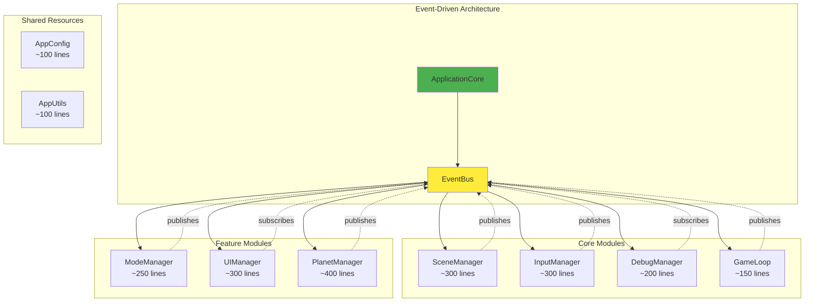

## 2. Target CardInventoryUI.js Architecture (AFTER)

### Class Diagram - New Modular Structure

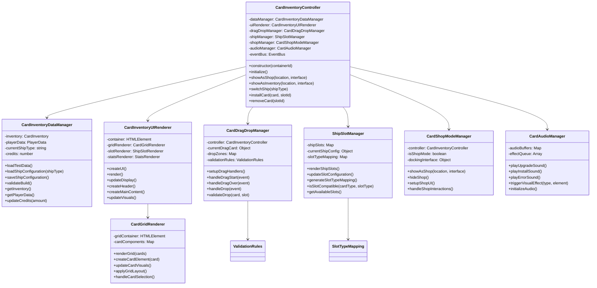

### Sequence Diagram - New Modular Card Installation

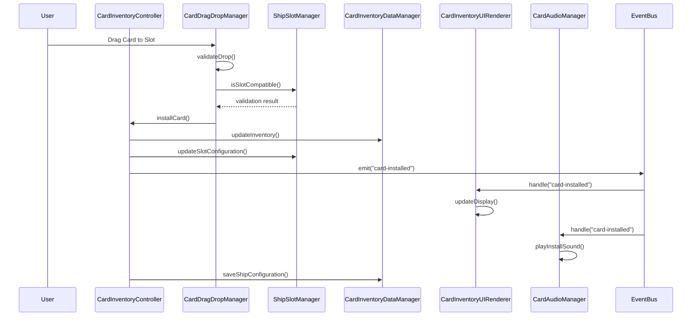

### Module Dependency Graph

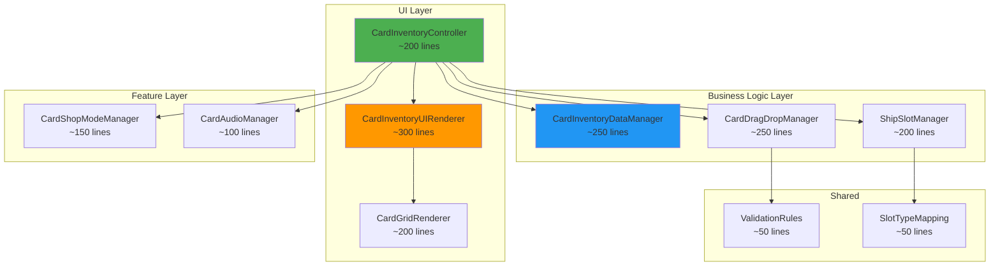

## 3. Target DamageControlInterface.js Architecture (AFTER)

### Class Diagram - New Modular Structure

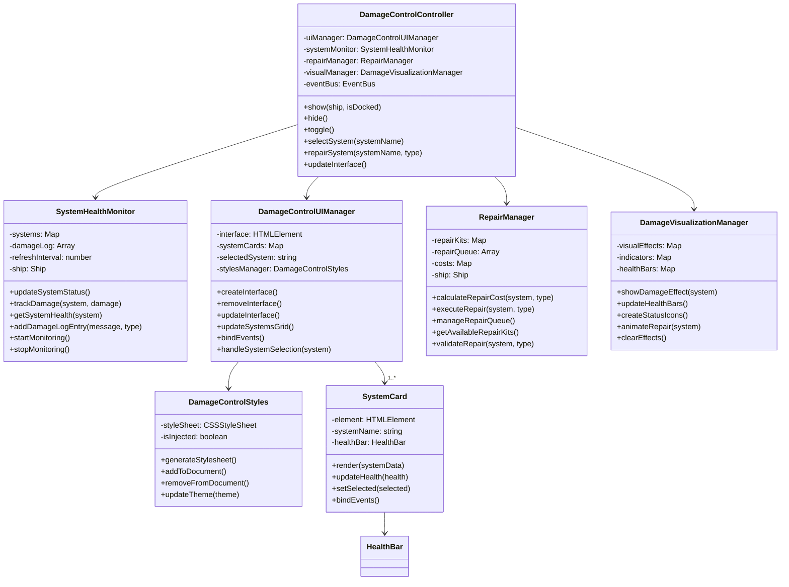

### Sequence Diagram - New Modular Repair Process

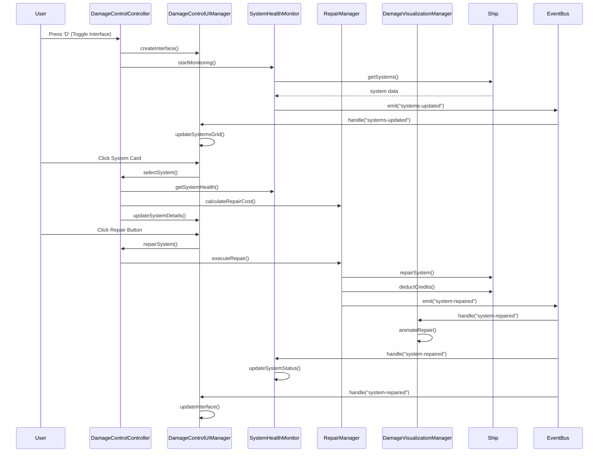

### Module Separation Benefits

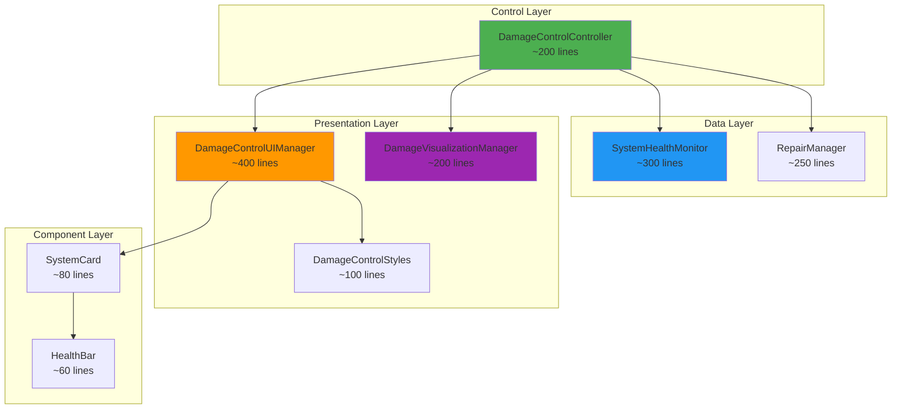

## 4. Cross-System Architecture (AFTER)

### Event-Driven Communication Pattern

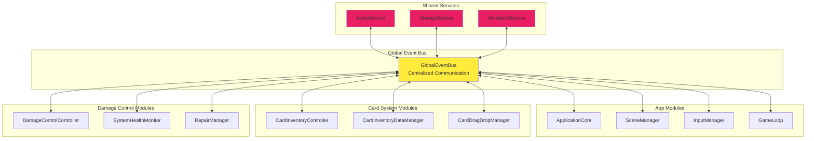

### Dependency Injection Container

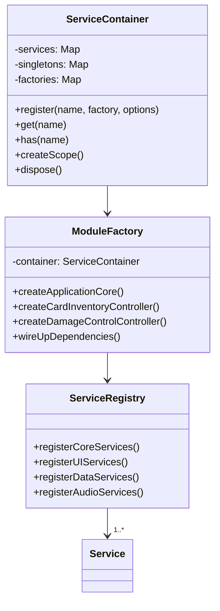

## 5. Benefits of New Architecture

### Improved Metrics (AFTER)

| Module | Lines | Responsibilities | Coupling Level | Testability |
|--------|-------|------------------|----------------|-------------|
| ApplicationCore | ~200 | 1 (Orchestration) | Low | High |
| SceneManager | ~300 | 1 (Scene Management) | Low | High |
| CardInventoryController | ~200 | 1 (Card Coordination) | Low | High |
| SystemHealthMonitor | ~300 | 1 (Health Monitoring) | Low | High |
| DamageControlUIManager | ~400 | 1 (Damage UI) | Low | High |

### Quality Improvements

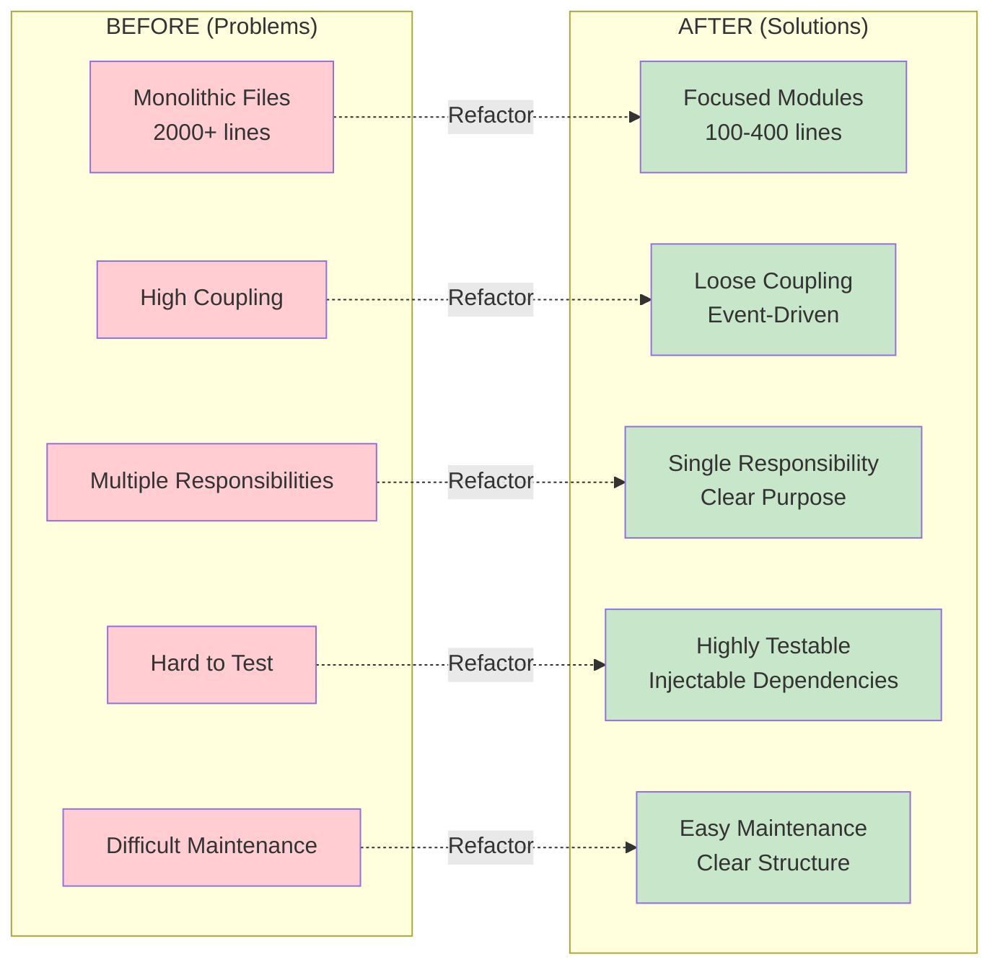

### Testing Strategy (AFTER)

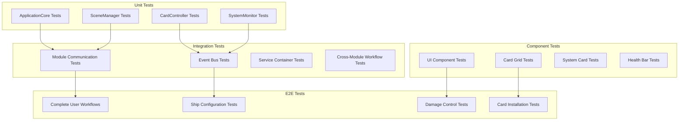

## 6. Migration Strategy

### Phase-by-Phase Transformation

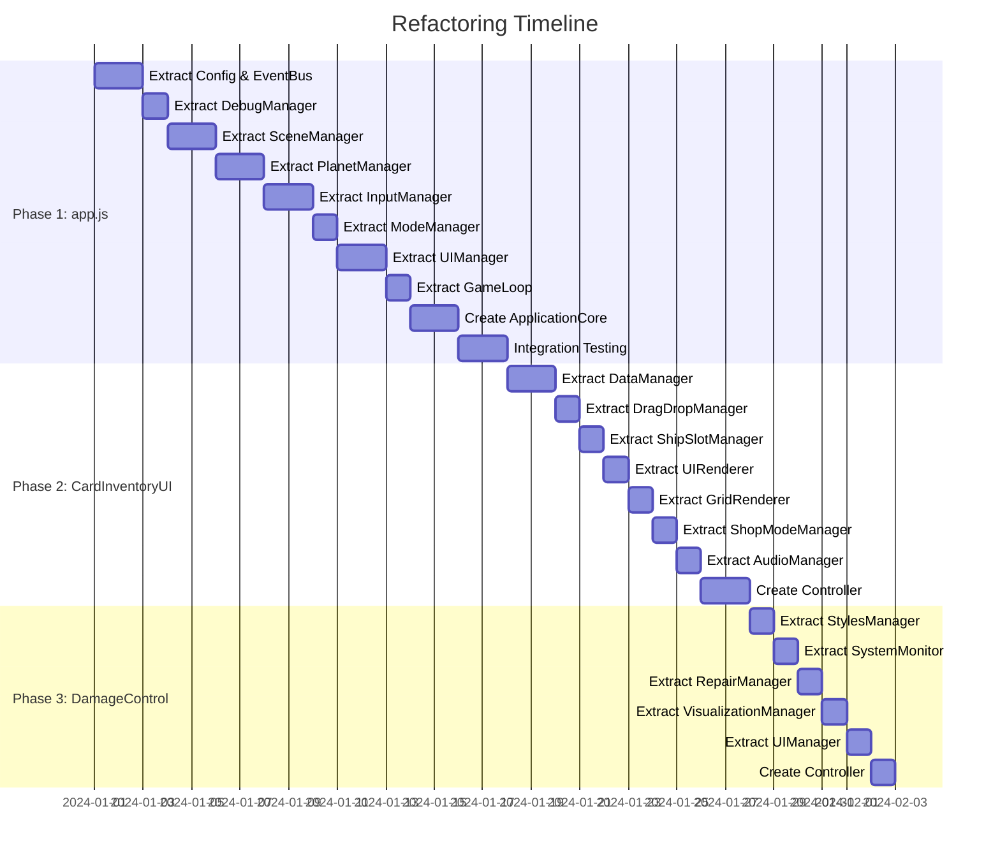

---

**🎯 Transformation Success Metrics:**
- ✅ All files under 500 lines
- ✅ Single responsibility per module
- ✅ Event-driven communication
- ✅ 90%+ test coverage maintained
- ✅ Zero functionality regression
- ✅ Improved performance and maintainability

*This "AFTER" state represents the target architecture that will result from our systematic refactoring approach.* 