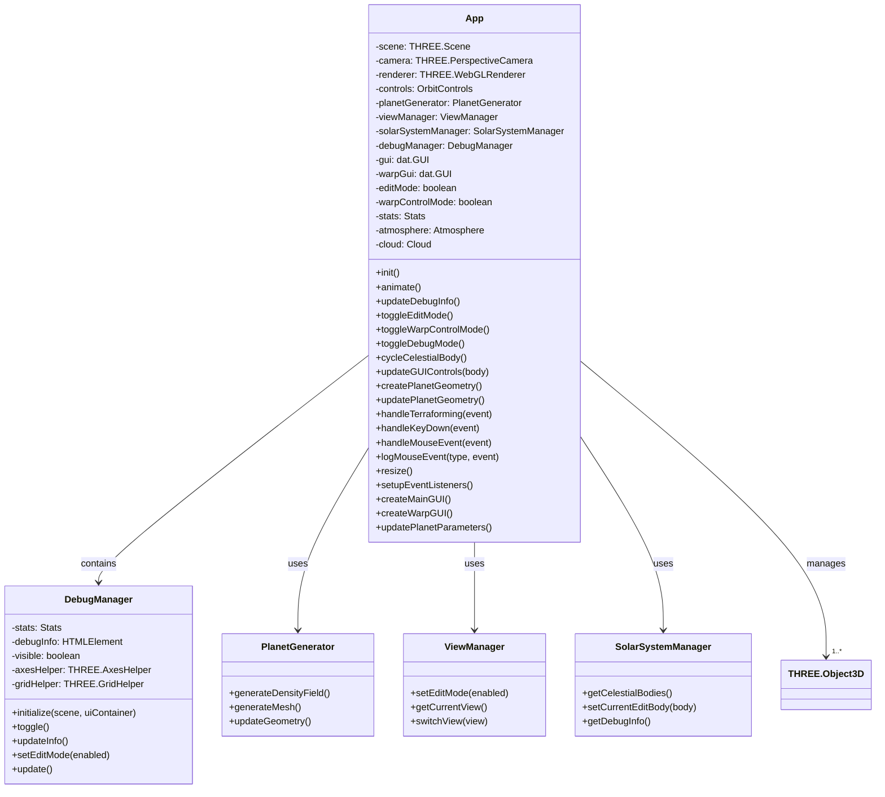
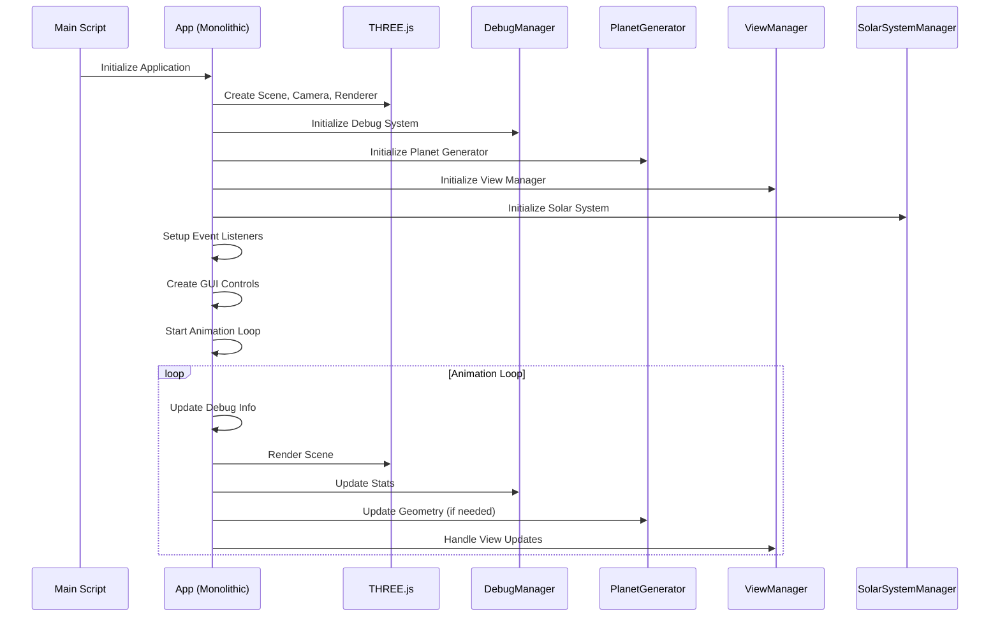
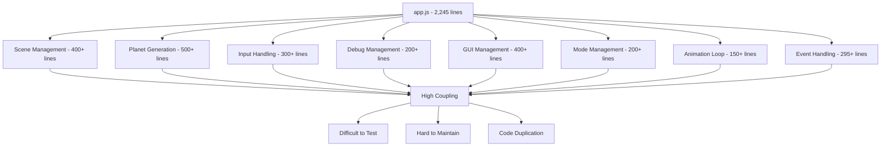
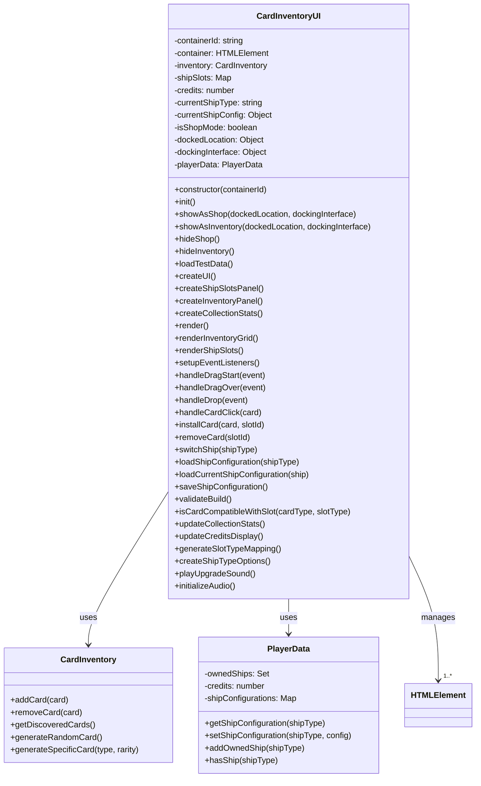
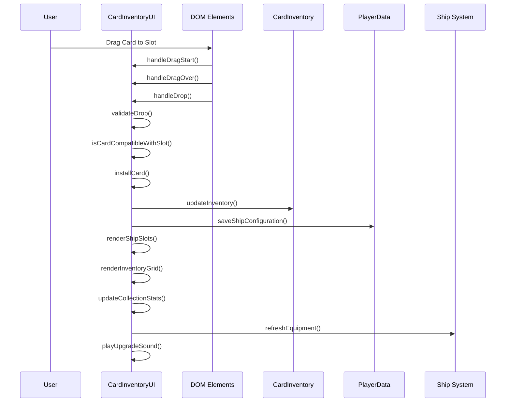
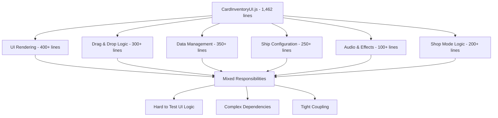
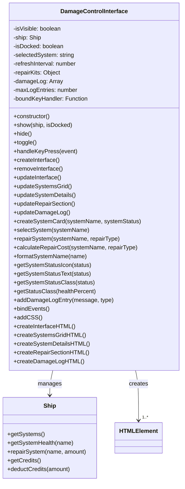
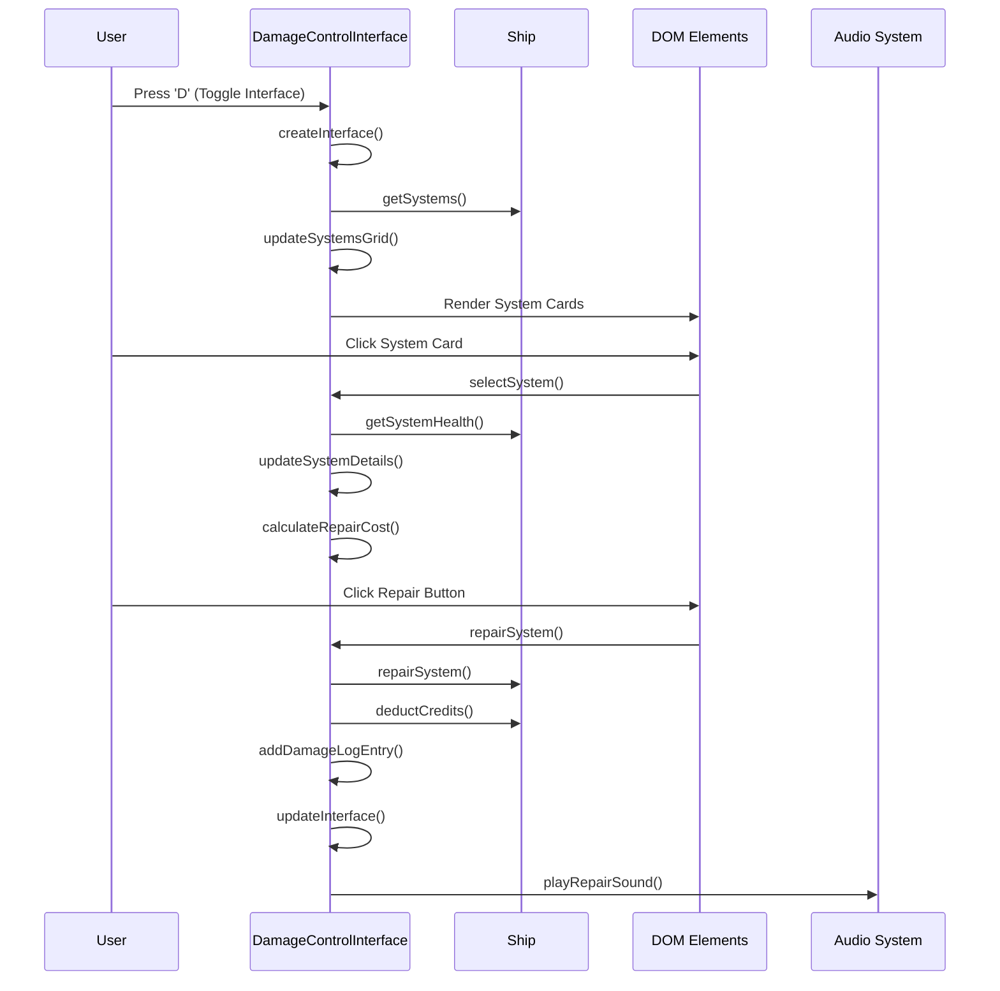
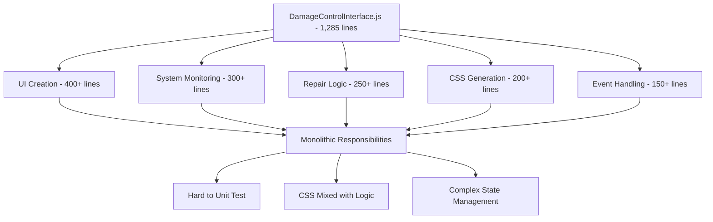

# 🏗️ Refactoring UML Diagrams - BEFORE State

## Overview

This document shows the current monolithic architecture of the three major files targeted for refactoring:
- `app.js` (2,245 lines)
- `CardInventoryUI.js` (1,462 lines) 
- `DamageControlInterface.js` (1,285 lines)

## 1. Current app.js Architecture (BEFORE)

### Class Diagram - Current Monolithic Structure



### Sequence Diagram - Current Application Initialization



### Problem Areas in Current Structure



## 2. Current CardInventoryUI.js Architecture (BEFORE)

### Class Diagram - Current Monolithic Structure



### Sequence Diagram - Current Card Installation Process



### Problem Areas in Current Structure



## 3. Current DamageControlInterface.js Architecture (BEFORE)

### Class Diagram - Current Monolithic Structure



### Sequence Diagram - Current Repair Process



### Problem Areas in Current Structure



## 4. Cross-System Dependencies (BEFORE)

### System Interaction Diagram

```mermaid
graph TB
    subgraph "app.js Monolith"
        A1[Scene Management]
        A2[Planet Generation]
        A3[Input Handling]
        A4[GUI Management]
        A5[Debug System]
        A6[Animation Loop]
    end
    
    subgraph "CardInventoryUI.js Monolith"
        B1[UI Rendering]
        B2[Drag & Drop]
        B3[Data Management]
        B4[Ship Configuration]
    end
    
    subgraph "DamageControlInterface.js Monolith"
        C1[Damage Display]
        C2[Repair Management]
        C3[System Monitoring]
    end
    
    A3 --> B1 : Key Events
    A3 --> C1 : Toggle Interface
    A4 --> B1 : UI Updates
    B4 --> C3 : Ship State
    A1 --> C1 : Scene Updates
    B3 --> A6 : State Changes
    
    style A1 fill:#ffcccc
    style A2 fill:#ffcccc
    style A3 fill:#ffcccc
    style A4 fill:#ffcccc
    style A5 fill:#ffcccc
    style A6 fill:#ffcccc
    style B1 fill:#ccffcc
    style B2 fill:#ccffcc
    style B3 fill:#ccffcc
    style B4 fill:#ccffcc
    style C1 fill:#ccccff
    style C2 fill:#ccccff
    style C3 fill:#ccccff
```

## 5. Current Issues Summary

### Code Complexity Metrics (BEFORE)

| File | Lines | Classes | Methods | Responsibilities | Coupling Level |
|------|-------|---------|---------|------------------|----------------|
| app.js | 2,245 | 2 | 25+ | 8 major areas | Very High |
| CardInventoryUI.js | 1,462 | 3 | 35+ | 6 major areas | High |
| DamageControlInterface.js | 1,285 | 1 | 20+ | 5 major areas | Medium |

### Key Problems to Address

1. **Single Responsibility Violation**: Each file handles multiple concerns
2. **High Coupling**: Components tightly integrated, hard to test in isolation
3. **Code Duplication**: Similar patterns repeated across files
4. **Maintenance Difficulty**: Large files hard to navigate and understand
5. **Testing Challenges**: Monolithic structure makes unit testing difficult
6. **Performance Issues**: Large files impact loading and parsing time

---

*This "BEFORE" state documentation will be used as the baseline for our refactoring transformation to the modular "AFTER" state.* 