# Long Range Scanner vs Star Charts: Sector Transition Analysis

## 🔍 **Why Long Range Scanner Works and Star Charts Doesn't**

Based on source code analysis, here are the detailed sequence diagrams and root cause analysis:

## Long Range Scanner Sequence Diagram

```mermaid
sequenceDiagram
    participant Player
    participant LongRangeScanner
    participant ViewManager
    participant SolarSystemManager
    participant LRSSystem
    
    Note over Player: Player warps from A0 → B1
    Note over SolarSystemManager: System generates B1 objects
    
    Player->>LongRangeScanner: Activate scanner (L key)
    LongRangeScanner->>LongRangeScanner: updateScannerMap()
    
    Note over LongRangeScanner: CRITICAL: Gets fresh data every time
    LongRangeScanner->>ViewManager: getSolarSystemManager()
    ViewManager-->>LongRangeScanner: solarSystemManager instance
    
    LongRangeScanner->>SolarSystemManager: starSystem (property access)
    Note over SolarSystemManager: Returns CURRENT sector data (B1)
    SolarSystemManager-->>LongRangeScanner: rawStarSystem (B1 objects)
    
    LongRangeScanner->>ViewManager: getShip()
    ViewManager-->>LongRangeScanner: ship instance
    LongRangeScanner->>LRSSystem: processScanData(rawStarSystem)
    LRSSystem-->>LongRangeScanner: processedData (B1 objects)
    
    LongRangeScanner->>LongRangeScanner: Render B1 objects to UI
    LongRangeScanner-->>Player: Display B1 system map
```



## Star Charts Sequence Diagram

```mermaid
sequenceDiagram
    participant Player
    participant StarChartsUI
    participant StarChartsManager
    participant ObjectDatabase
    participant StarfieldManager
    
    Note over Player: Player warps from A0 → B1
    Note over StarChartsManager: currentSector STILL = "A0" (NOT UPDATED!)
    
    Player->>StarChartsUI: Activate star charts (C key)
    StarChartsUI->>StarChartsUI: renderDiscoveredObjects()
    
    Note over StarChartsUI: PROBLEM: Uses stale sector data
    StarChartsUI->>StarChartsManager: getCurrentSector()
    StarChartsManager-->>StarChartsUI: "A0" (WRONG!)
    
    StarChartsUI->>StarChartsManager: objectDatabase.sectors[currentSector]
    Note over ObjectDatabase: Returns A0 sector data
    ObjectDatabase-->>StarChartsUI: A0 objects (Sol system)
    
    StarChartsUI->>StarChartsUI: Render A0 objects to UI
    StarChartsUI-->>Player: Display A0 system (WRONG SECTOR!)
    
    Note over StarChartsManager: StarChartsManager.currentSector never updated during warp!
```



## 🚨 **Root Cause Analysis**

### **✅ Long Range Scanner Works Because:**
1. **Fresh data every time** - Calls `solarSystemManager.starSystem` on each activation
2. **No cached sector state** - Always gets current system data
3. **Direct property access** - `rawStarSystem = solarSystemManager.starSystem`
4. **Real-time updates** - Reflects whatever system is currently loaded

### **❌ Star Charts Fails Because:**
1. **Stale sector cache** - `StarChartsManager.currentSector` stuck on "A0"
2. **Database lookup by sector** - `objectDatabase.sectors[this.currentSector]`
3. **Never updated during warp** - No mechanism to update `currentSector` property
4. **Missing from StarfieldManager** - `starfieldManager.starChartsManager` is `null`!

## 🔧 **Critical Discovery**

From the logs: `❌ SectorNavigation: Star Charts Manager not found - cannot update sector`

**The StarChartsManager is not being initialized in StarfieldManager!** This explains why:
- `starfieldManager.starChartsManager` is `null`
- Star Charts sector never gets updated
- The system is completely disconnected from sector transitions

## 🎯 **Fix Strategy**

1. **Initialize StarChartsManager** in StarfieldManager constructor
2. **Update StarChartsManager.currentSector** during warp completion
3. **Alternative**: Make Star Charts get fresh data like Long Range Scanner

## Data Flow Comparison

| System | Data Source | Update Mechanism | Sector Awareness |
|--------|-------------|------------------|------------------|
| **Long Range Scanner** | `solarSystemManager.starSystem` | Real-time property access | ✅ Always current |
| **Star Charts** | `objectDatabase.sectors[currentSector]` | Cached sector lookup | ❌ Stale cache |

## Key Code Differences

### Long Range Scanner (Working)
```javascript
// Gets fresh data every activation
const solarSystemManager = this.viewManager.getSolarSystemManager();
const rawStarSystem = solarSystemManager.starSystem; // CURRENT sector
```

### Star Charts (Broken)
```javascript
// Uses stale cached sector
const sectorData = this.objectDatabase.sectors[this.currentSector]; // STALE "A0"
```

## 🎯 **Solution**

The fix is to ensure `StarChartsManager` is properly initialized and its `currentSector` is updated during warp transitions, just like Long Range Scanner gets fresh data each time.
