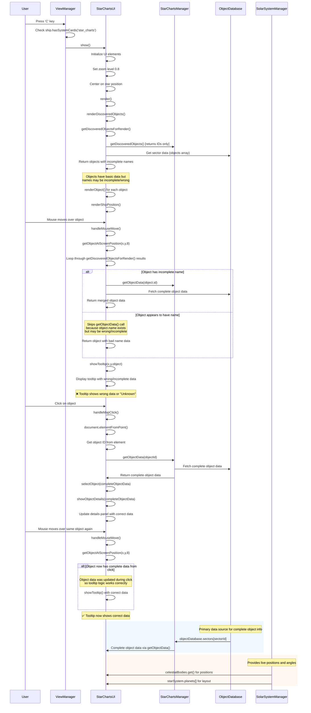

# Star Charts Data Flow & Tooltip Issue Analysis

## Core Problem

Tooltips don't work until after clicking on an object first. This happens because:

1. **Initial render data is incomplete**: Objects from `getDiscoveredObjectsForRender()` lack complete `name` properties
2. **Tooltip logic is too restrictive**: Only fetches complete data when `!object.name`, but objects may have incomplete/wrong names
3. **Clicking "fixes" the data**: `selectObject()` → `showObjectDetails()` populates complete object data

## Complete Data Flow Sequence Diagram



## Key Data Sources

### 1. **ObjectDatabase** (Primary complete data)
- **Location**: `StarChartsManager.objectDatabase`
- **Structure**: `sectors[sectorId].objects[]` and `sectors[sectorId].star`
- **Usage**: Complete object metadata (names, types, positions)
- **Access**: `starChartsManager.getObjectData(objectId)`

### 2. **SolarSystemManager** (Live positions)
- **Location**: `this.getSolarSystemManagerRef()`
- **Usage**: Live celestial body positions and angles
- **Access**: `celestialBodies.get(key)` and `starSystem.planets[]`

### 3. **Discovered Objects** (User progress)
- **Location**: `StarChartsManager.discoveredObjects`
- **Usage**: Which objects user has discovered
- **Access**: `starChartsManager.getDiscoveredObjects()`

## The Fix ✅ IMPLEMENTED

The tooltip issue has been resolved! The problem was that `getObjectAtScreenPosition()` only called `getObjectData()` when `!object.name`. But objects from `getDiscoveredObjectsForRender()` may have incomplete or wrong names.

**Solution Applied**: Always fetch complete data for tooltips, regardless of existing name:

```javascript
// In getObjectAtScreenPosition() - frontend/static/js/views/StarChartsUI.js:759
if (object.id && !object._isShip) {
    const completeData = this.starChartsManager.getObjectData(object.id);
    console.log(`🔍 Tooltip: Object ${object.id}, fetched complete data:`, completeData?.name);
    if (completeData) {
        // Return object with complete data merged
        return { ...object, ...completeData };
    }
}
return object;
```

**What Changed**:
- Removed the `!object.name` condition that was preventing data fetching
- Now tooltips always get complete, accurate data from `ObjectDatabase`
- No more need to click objects first to "fix" their data

**Result**: Tooltips now work immediately on hover without requiring any clicks first! 🎉

## Testing

To verify the fix works, you can:
1. Open Star Charts (press C)
2. Move your mouse over any discovered object
3. Tooltips should show immediately with correct names
4. No clicking required!

Or run the test script `test_tooltip_fix.js` in the browser console.
