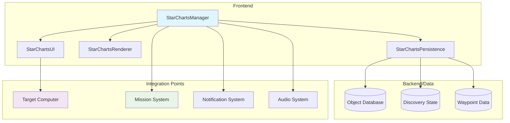
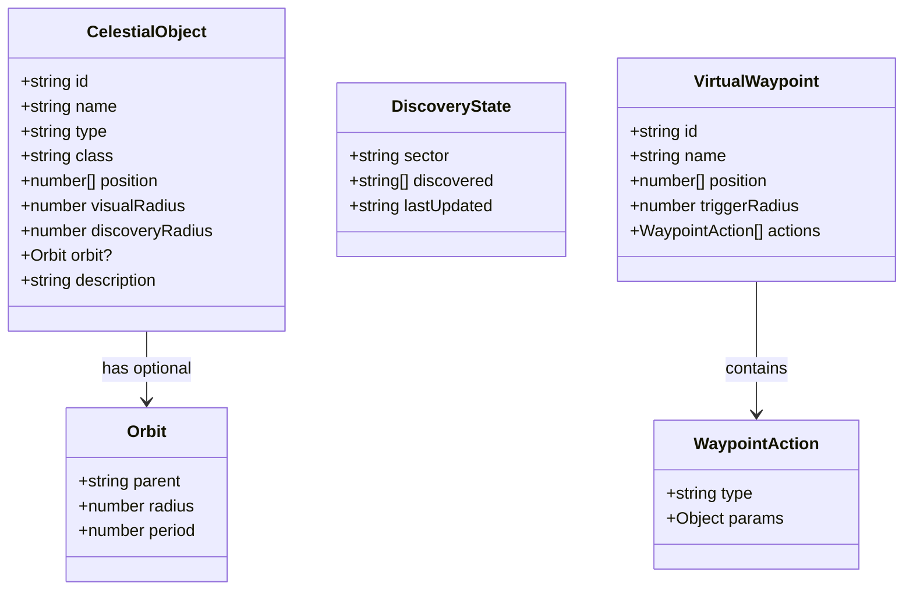
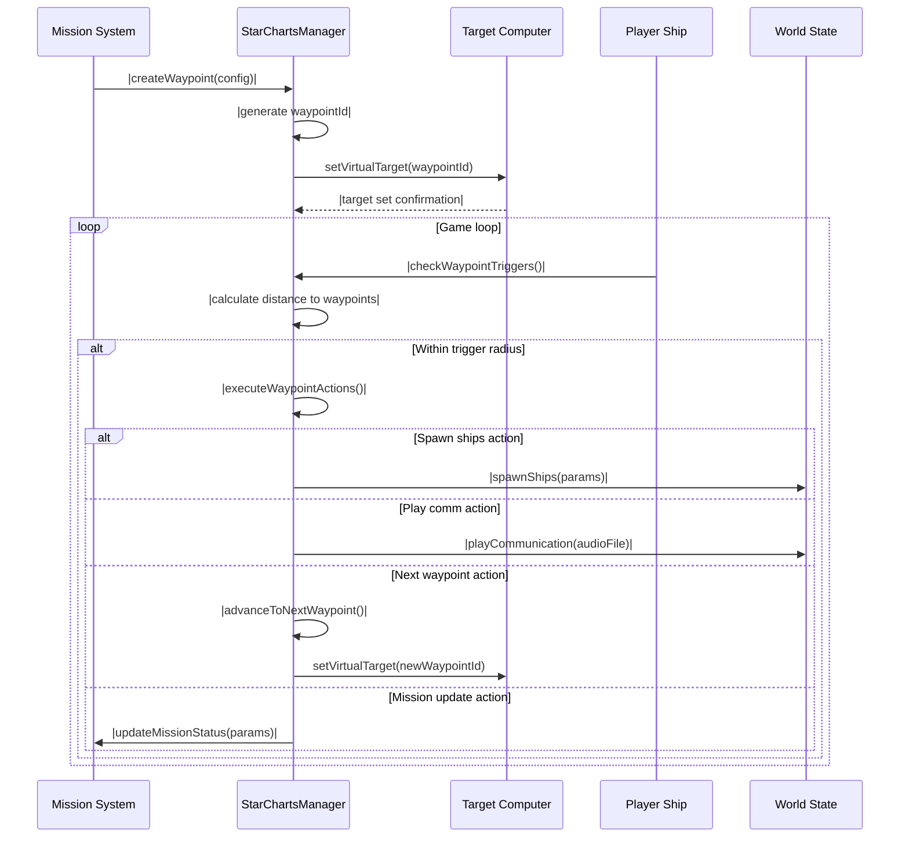
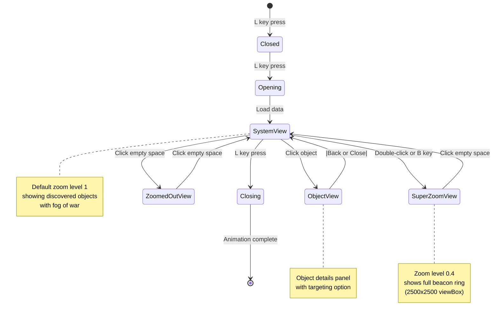
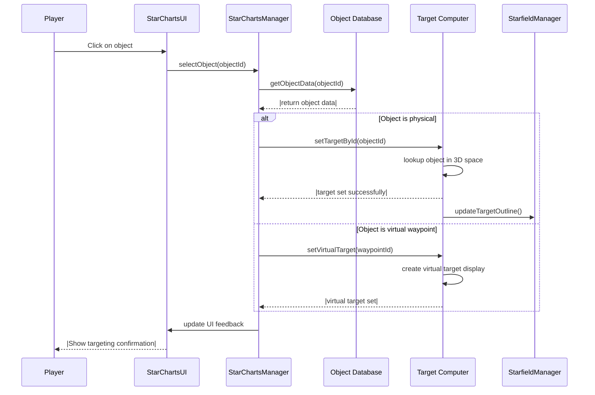

# Star Charts System Specification

## 🎯 **System Overview**

The Star Charts system will replace the current Long Range Scanner with a comprehensive database-driven navigation and discovery system. The primary goals are:

1. **Database-driven Discovery**: Track all celestial objects (planets, moons, asteroids, stars, nebulae, space stations, beacons, etc.) in a persistent database
2. **Fog of War Exploration**: Start with minimal information and reveal objects as they're discovered through proximity
3. **Mission Integration**: Support virtual waypoints for mission guidance
4. **Synchronization Bypass**: Decouple from Target Computer synchronization issues via object ID system
5. **Procedural Integration**: Seamlessly integrate with existing procedural universe generation (verse.py)

## 🔗 **Integration with Procedural Universe Generation**

The Star Charts system is designed to work harmoniously with the existing procedural universe generation system in `verse.py`. This integration ensures that:

- **Procedural systems remain authoritative** for universe generation
- **Star Charts acts as a discovery layer** over the procedural universe
- **No conflicts** between static database and procedural generation
- **Enhanced gameplay** through discovery mechanics

### **Integration Architecture**

```mermaid
graph TD
    subgraph "Procedural Generation (verse.py)"
        UG[Universe Generator]
        SSG[Star System Generator]
        PG[Planet Generator]
        MG[Moon Generator]
    end

    subgraph "Star Charts Discovery Layer"
        SCDB[Static Object Database]
        SCDS[Discovery State Manager]
        SCFOG[Fog of War System]
    end

    subgraph "Game Systems"
        SCM[StarChartsManager]
        TCM[TargetComputerManager]
        MM[MissionSystem]
    end

    UG --> SSG
    SSG --> PG
    PG --> MG

    SCM --> SCDB
    SCM --> SCDS
    SCM --> SCFOG

    SCDB -.-> UG: |Object IDs &amp; Positions|
    SCDS -.-> SCM: |Discovered IDs|
    SCFOG -.-> SCM: |Visibility Rules|

    SCM --> TCM: |Object Targeting|
    SCM --> MM: |Waypoint Creation|
```

### **Data Flow Integration**

1. **Universe Generation** (`verse.py`):
   - Generates procedural star systems, planets, moons
   - Creates deterministic seeds for consistent generation
   - Provides object IDs, names, types, positions

2. **Static Database Creation**:
   - Extracts object data from procedural generation
   - Creates JSON database with static properties
   - Maintains object IDs for cross-system consistency

3. **Discovery Layer**:
   - Tracks which objects have been discovered by player
   - Manages fog of war visibility
   - Provides enhanced information for discovered objects

4. **Runtime Integration**:
   - Star Charts uses procedural data as foundation
   - Discovery state overlays on procedural universe
   - Mission waypoints exist in same coordinate space

## ⚠️ **Critical Integration Issue: Starter System Infrastructure**

### **Problem Identified**
The starter system (A0) in `verse.py` is **hard-coded and incomplete**. It only generates:
- ✅ Sol star
- ✅ Terra Prime planet
- ✅ Luna and Europa moons

But **missing critical infrastructure** that's generated by `SolarSystemManager.js`:
- ✅ 15+ Space Stations (Helios Solar Array, Hermes Refinery, etc.) - **NOW IN JSON**
- ✅ 8 Navigation Beacons - **NOW IN JSON**
- ✅ Docking collision zones
- ✅ Station services and faction affiliations - **NOW IN JSON**

### **Impact on Star Charts**
- **Starter System Inconsistency**: A0 sector appeared mostly empty in Star Charts
- **Missing Infrastructure**: Players couldn't see the rich station network that's actually present
- **Fog of War Issues**: Stations existed in 3D space but weren't discoverable in Star Charts

### **Solution Implemented**
The infrastructure has been **moved to JSON format** with these improvements:
1. **JSON Data File**: `data/starter_system_infrastructure.json` contains all station and beacon data
2. **Dynamic Loading**: `SolarSystemManager.js` loads infrastructure from JSON instead of hard-coded arrays
3. **Discovery Integration**: Star Charts can now discover all infrastructure objects
4. **Maintainable Format**: Easy to modify stations, beacons, and their properties without touching code

---

### **Static Database Generation Process**

The static database is created by running the procedural generation system and extracting the generated data:

```python
# Example: Generate static database from verse.py
def generate_star_charts_database():
    """Generate static database from procedural universe generation"""

    # Use the same UNIVERSE_SEED as the game for consistency
    universe_seed = os.getenv('UNIVERSE_SEED', '20299999')

    # Generate universe using verse.py functions
    universe = generate_universe(90, universe_seed)  # 10x9 sectors (A0-J8)

    star_charts_db = {
        "metadata": {
            "universe_seed": universe_seed,
            "generation_timestamp": datetime.now().isoformat(),
            "generator_version": "1.0"
        },
        "sectors": {}
    }

    # Extract data from each sector
    for star_system in universe:
        sector = star_system['sector']
        star_charts_db["sectors"][sector] = extract_sector_data(star_system)

    return star_charts_db

def extract_sector_data(star_system):
    """Extract object data for Star Charts database"""

    sector_data = {
        "star": {
            "id": f"{star_system['sector']}_star",
            "name": star_system['star_name'],
            "type": "star",
            "class": star_system['star_type'],
            "position": [0, 0, 0],
            "visualRadius": star_system['star_size'],
            "discoveryRadius": 100.0,
            "description": star_system['description']
        },
        "objects": []
    }

    # Add planets and moons
    for planet in star_system['planets']:
        planet_data = {
            "id": f"{star_system['sector']}_{planet['planet_name'].lower().replace(' ', '_')}",
            "name": planet['planet_name'],
            "type": "planet",
            "class": planet['planet_type'],
            "position": calculate_planet_position(planet),
            "visualRadius": planet['planet_size'],
            "discoveryRadius": 50.0,
            "orbit": {
                "parent": f"{star_system['sector']}_star",
                "radius": calculate_orbit_radius(planet),
                "period": calculate_orbit_period(planet)
            },
            "description": planet['description']
        }
        sector_data["objects"].append(planet_data)

        # Add moons
        for moon in planet.get('moons', []):
            moon_data = {
                "id": f"{star_system['sector']}_{moon['moon_name'].lower().replace(' ', '_')}",
                "name": moon['moon_name'],
                "type": "moon",
                "class": moon['moon_type'],
                "position": calculate_moon_position(moon, planet),
                "visualRadius": moon['moon_size'],
                "discoveryRadius": 25.0,
                "orbit": {
                    "parent": planet_data["id"],
                    "radius": calculate_moon_orbit_radius(moon),
                    "period": calculate_moon_orbit_period(moon)
                },
                "description": moon['description']
            }
            sector_data["objects"].append(moon_data)

    return sector_data
```

This process ensures that:
- **Consistency**: Same UNIVERSE_SEED produces identical static database
- **Integration**: Star Charts uses same object IDs as procedural generation
- **Performance**: Static JSON loading is much faster than procedural generation
- **Flexibility**: Can regenerate database if universe generation logic changes

## 📊 **System Architecture**



## 📊 **Core Architecture**

### **Data Model**

#### **Static Object Database**
```json
{
  "objects": {
    "sol_star": {
      "id": "sol_star",
      "name": "Sol",
      "type": "star",
      "class": "G-type main-sequence star",
      "position": [0, 0, 0],
      "visualRadius": 2.0,
      "discoveryRadius": 100.0,
      "description": "The central star of the Sol system"
    },
    "terra_prime": {
      "id": "terra_prime",
      "name": "Terra Prime",
      "type": "planet",
      "class": "terrestrial",
      "position": [149.6, 0, 0],
      "visualRadius": 1.2,
      "discoveryRadius": 50.0,
      "orbit": {
        "parent": "sol_star",
        "radius": 149.6,
        "period": 365.25
      },
      "description": "A habitable terrestrial world"
    }
  }
}
```

#### **Discovery State**
```json
{
  "sector": "A0",
  "discovered": [
    "sol_star",
    "terra_prime",
    "luna",
    "navigation_beacon_1"
  ],
  "lastUpdated": "2025-09-02T14:43:43Z"
}
```

#### **Data Model Relationships**


### **Object Types**

| Type | Discovery Radius | Visual Representation | Notes |
|------|------------------|----------------------|-------|
| `star` | 100km | Central glowing sphere | Always visible in center |
| `planet` | 50km | Sphere with orbit line | Shows dashed orbit when discovered |
| `moon` | 25km | Smaller sphere with orbit | Relative to parent planet |
| `asteroid` | 10km | Irregular shape | May have asteroid fields |
| `nebula` | 75km | Gaseous cloud | Visual effect only |
| `space_station` | 5km | 3D structure | Docking facilities |
| `navigation_beacon` | 5km | Rotating beacon | Navigation aids |
| `debris_field` | 15km | Scattered objects | Mining opportunities |

## 🔍 **Discovery Mechanics**

### **Automatic Discovery**
- **Trigger**: Player ship enters discovery radius of undiscovered object
- **Radius Calculation**:
  ```javascript
  const discoveryRadius = ship.targetComputer ?
    ship.targetComputer.range : // Use target computer range
    25.0; // Default fallback radius
  ```
- **Process**:
  1. Check distance to all undiscovered objects every 5 seconds
  2. If within discovery radius, mark object as discovered
  3. Play discovery audio (`blurb.mp3`)
  4. Show notification: `"{Object Name} discovered!"`
  5. Add to discovered objects list
  6. Save persistence data

#### **Discovery Flow Sequence**


### **Mission-provided Discovery**
- **Method**: Direct addition to discovered objects list
- **Use Case**: Mission rewards or navigation data
- **Process**: Mission system calls `starCharts.addDiscoveredObject(objectId)`

## 🌫️ **Fog of War System**

### **Initial State**
- **Visible Objects**: Only the central star (Sol) is visible
- **Explored Areas**: None initially
- **UI Representation**: Most of the map shows empty space

### **Exploration Progression**
1. **Star Discovery**: Central star always visible
2. **Planet Discovery**: Planet appears with dashed orbit line
3. **Moon Discovery**: Moon appears orbiting its parent planet
4. **Station/Beacon Discovery**: Infrastructure appears at discovered locations

### **Visual Representation**
- **Undiscovered Areas**: Empty space, no hints or silhouettes
- **Discovered Objects**: Full visual representation with accurate positioning
- **Orbit Lines**: Dashed lines showing orbital paths for discovered planets/moons

## 🎯 **Mission Waypoint System**

### **Virtual Waypoints**
- **Nature**: Non-physical objects that exist only on HUD
- **Visual**: Rotating 3D wireframe diamond
- **Naming**: "Mission Waypoint #1" through "Mission Waypoint #9"
- **Purpose**: Guide players through mission paths

### **Waypoint Management**
```javascript
// Mission system creates waypoint
const waypointId = missionSystem.createWaypoint({
  name: "Mission Waypoint #1",
  position: [100, 50, 25], // Virtual coordinates
  triggerRadius: 10.0,     // Distance to trigger
  actions: [
    { type: "spawn_ships", shipType: "enemy_fighter", count: 3 },
    { type: "play_comm", audioFile: "mission_update.mp3" },
    { type: "next_waypoint" }
  ]
});

// Target Computer displays waypoint
targetComputer.setVirtualTarget(waypointId);
```

### **Waypoint Triggers**
- **Proximity Detection**: Trigger when player reaches within radius
- **Actions Available**:
  - `spawn_ships`: Spawn enemy/friendly ships
  - `play_comm`: Play communication audio
  - `next_waypoint`: Advance to next waypoint
  - `mission_update`: Update mission status
  - `custom_event`: Trigger custom mission logic

#### **Waypoint Creation & Trigger Sequence**


## 🖥️ **User Interface**

### **Main Star Charts Interface**
- **Layout**: Identical to current Long Range Scanner
- **Zoom Levels**:
  - **System Overview**: Zoom level 1 (default)
  - **Step Zoom**: Zoom levels 2-3 (progressive zoom in)
  - **Super Zoom**: Zoom level 0.4 (shows full beacon ring)
- **Controls** (Mac-compatible, same as current LRS):
  - **Click on objects**: Select for targeting → sends object ID to Target Computer
  - **Click on empty space**: Zoom out (step by step: 3→2→1→0.4)
  - **Double-click**: Force super zoom to show beacon ring
  - **No mouse wheel**: Mac compatibility
  - **No right-click**: Mac compatibility

### **Object Selection**
- **Click Behavior**: Click on discovered objects to select them for targeting
- **Empty Space Behavior**: Click on empty space zooms out (progressive: 3→2→1→0.4)
- **Target Computer Integration**:
  ```javascript
  // Decoupled targeting system - sends object ID instead of reference
  starCharts.selectObject(objectId) {
    targetComputer.setTargetById(objectId);
  }
  ```

### **Zoom Behavior**
- **Default**: Opens at zoom level 1 (system overview)
- **Progressive Zoom Out**: Click empty space to step through zoom levels
- **Super Zoom**: Double-click or press 'B' to zoom to level 0.4 (shows beacon ring)
- **Reset**: Opening interface always resets to zoom level 1

#### **Keyboard Controls** (Same as LRS)
- **'L' or 'Escape'**: Close Star Charts interface
- **'B' or 'b'**: Super zoom to show beacon ring
- **'A'**: Switch to aft view
- **'F'**: Switch to fore view

#### **UI State Diagram**


### **Discovery Notifications**
- **Audio**: `frontend/static/audio/blurb.mp3`
- **Visual**: Top-center notification HUD
- **Message Format**: `"{Object Name} discovered!"`
- **Duration**: 3 seconds

#### **Target Selection Flow**


## 💾 **Persistence System**

### **Data Structure**
```json
// /data/star_charts/
{
  "A0": {
    "discovered": [
      "sol_star",
      "terra_prime",
      "luna",
      "mars_base",
      "navigation_beacon_1"
    ],
    "lastUpdated": "2025-09-02T14:43:43Z"
  },
  "A1": {
    "discovered": [
      "proxima_centauri",
      "proxima_b"
    ],
    "lastUpdated": "2025-09-01T10:15:20Z"
  }
}
```

### **Save/Load Process**
- **Auto-save**: Every time a new object is discovered
- **Load on Sector Change**: Load discovered objects for current sector
- **Cross-session Persistence**: Maintain discovery state between game sessions

## 🔧 **Technical Implementation**

### **Core Components**

#### **StarChartsManager**
```javascript
class StarChartsManager {
  constructor() {
    this.objectDatabase = {};     // Static object data
    this.discoveredObjects = new Set(); // Discovered object IDs
    this.currentSector = 'A0';    // Current sector
    this.virtualWaypoints = new Map(); // Mission waypoints
  }

  // Discovery methods
  checkDiscoveryRadius() { /* Implementation */ }
  addDiscoveredObject(objectId) { /* Implementation */ }

  // Waypoint methods
  createWaypoint(config) { /* Implementation */ }
  removeWaypoint(waypointId) { /* Implementation */ }

  // Persistence methods
  saveDiscoveryState() { /* Implementation */ }
  loadDiscoveryState(sector) { /* Implementation */ }
}
```

#### **Integration Points**
- **Target Computer**: Receives object IDs for targeting
- **Mission System**: Creates/removes waypoints
- **Sector Manager**: Loads sector-specific data
- **Audio System**: Plays discovery sounds
- **Notification HUD**: Shows discovery messages

### **File Structure**
```
frontend/static/js/views/
├── StarChartsManager.js          # Main system controller
├── StarChartsUI.js               # UI rendering and interaction
├── StarChartsRenderer.js         # 3D visualization
└── StarChartsPersistence.js      # Data loading/saving

data/star_charts/
├── objects.json                  # Static object database
├── sectors/                      # Sector-specific discovery data
│   ├── A0.json
│   ├── A1.json
│   └── ...
└── waypoints/                    # Mission waypoint templates
    ├── templates.json
    └── active.json

#### **Component Interaction Diagram**
```mermaid
graph TD
    subgraph "Star Charts System"
        SCM[StarChartsManager]
        SCUI[StarChartsUI]
        SCR[StarChartsRenderer]
        SCP[StarChartsPersistence]
    end

    subgraph "External Systems"
        TC[Target Computer]
        MS[Mission System]
        SF[Starfield Manager]
        NS[Notification System]
        AS[Audio System]
    end

    subgraph "Data Layer"
        OBJ[(Object Database)]
        DISC[(Discovery State)]
        WP[(Waypoints)]
    end

    SCM --> SCUI
    SCM --> SCR
    SCM --> SCP

    SCUI --> TC
    SCUI --> SF

    SCM --> MS
    SCM --> NS
    SCM --> AS

    SCP --> OBJ
    SCP --> DISC
    SCP --> WP

    MS -.-> SCM: |waypoint creation|
    TC -.-> SCM: |virtual target support|
    SF -.-> SCR: |3D rendering data|

    style SCM fill:#e1f5fe
    style SCUI fill:#f3e5f5
    style SCR fill:#fff3e0
    style SCP fill:#e8f5e8
```

## 🚀 **Implementation Phases**

### **Phase 0: Database Generation** ⭐ **NEW**
1. Create database generation script that extracts data from `verse.py`
2. Generate static JSON database for all sectors (A0-J8)
3. Implement object ID mapping system for consistency
4. Add metadata tracking for database version and generation

### **Phase 1: Core Infrastructure**
1. Implement basic StarChartsManager class with verse.py integration
2. Add discovery radius checking using Target Computer range
3. Create discovery state persistence system
4. Basic fog of war system with star-only visibility

### **Phase 2: UI & Visualization**
1. Create Star Charts UI interface (replace LRS UI)
2. Implement fog of war rendering with orbit lines
3. Add object selection and ID-based targeting integration
4. Discovery notifications and audio feedback system

### **Phase 3: Mission Integration**
1. Implement virtual waypoint system with 3D diamond rendering
2. Add waypoint triggers and dynamic actions
3. Mission system integration using shared coordinate space
4. Waypoint persistence and state management

### **Phase 4: Advanced Features & Optimization**
1. Orbit line rendering and animation
2. Zoom level improvements and sector navigation
3. Performance optimizations for large datasets
4. Additional object types (asteroids, nebulae, etc.)
5. Cross-sector navigation and waypoint chains

### **Phase 5: Integration & Testing**
1. Full integration with Target Computer (ID-based targeting)
2. Mission system waypoint creation and management
3. Save/load system for discovery state persistence
4. Performance testing and optimization
5. Backward compatibility with existing systems

## 🔄 **Migration Strategy**

### **Database Migration**
```python
# scripts/generate_star_charts_db.py
#!/usr/bin/env python3
"""
Generate Star Charts database from procedural universe generation.
Run this script to create/update the static database.
"""

import os
import json
import sys
from datetime import datetime

# Add backend to path
sys.path.insert(0, os.path.join(os.path.dirname(__file__), '..', 'backend'))

from verse import generate_universe, sector_to_seed

def main():
    # Use same seed as game
    universe_seed = os.getenv('UNIVERSE_SEED', '20299999')
    print(f"Generating Star Charts database with seed: {universe_seed}")

    # Generate universe (90 sectors: A0-J8)
    universe = generate_universe(90, universe_seed)

    # Create database structure
    star_charts_db = {
        "metadata": {
            "universe_seed": universe_seed,
            "generation_timestamp": datetime.now().isoformat(),
            "generator_version": "1.0",
            "total_sectors": len(universe)
        },
        "sectors": {}
    }

    # Process each sector
    for star_system in universe:
        sector = star_system['sector']
        star_charts_db["sectors"][sector] = extract_sector_data(star_system)
        print(f"Processed sector {sector}: {star_system['star_name']}")

    # Save database
    output_path = "data/star_charts/objects.json"
    os.makedirs(os.path.dirname(output_path), exist_ok=True)

    with open(output_path, 'w') as f:
        json.dump(star_charts_db, f, indent=2)

    print(f"Star Charts database generated: {output_path}")
    print(f"Total sectors: {len(star_charts_db['sectors'])}")

if __name__ == "__main__":
    main()
```

### **Runtime Integration**
```javascript
// frontend/static/js/views/StarChartsManager.js
class StarChartsManager {
    constructor() {
        this.objectDatabase = null;
        this.discoveryState = new Map();
        this.currentSector = 'A0';
        this.virtualWaypoints = new Map();
    }

    async initialize() {
        // Load static database generated from verse.py
        const response = await fetch('data/star_charts/objects.json');
        this.objectDatabase = await response.json();

        // Load player's discovery state
        await this.loadDiscoveryState();
    }

    // Integration with verse.py coordinate system
    getObjectPosition(objectId) {
        const sectorData = this.objectDatabase.sectors[this.currentSector];
        const object = sectorData.objects.find(obj => obj.id === objectId);

        if (object) {
            return object.position;
        }

        // Check if it's a virtual waypoint
        const waypoint = this.virtualWaypoints.get(objectId);
        if (waypoint) {
            return waypoint.position;
        }

        return null;
    }
}
```

This migration strategy ensures:
- **Zero disruption** to existing procedural generation
- **Seamless integration** between static database and runtime systems
- **Consistent object IDs** across all systems
- **Future-proof** database regeneration when verse.py is updated

### **Enhanced Database Generation with Infrastructure**

To address the starter system infrastructure gap, the database generation must be **enhanced**:

```python
def generate_complete_star_charts_database():
    """Generate complete database including infrastructure"""

    # 1. Generate base universe from verse.py
    universe = generate_universe(90, os.getenv('UNIVERSE_SEED', '20299999'))

    # 2. For A0 (starter system), add infrastructure data
    if 'A0' in universe and universe[universe.index({'sector': 'A0'})]:
        a0_index = next(i for i, sys in enumerate(universe) if sys.get('sector') == 'A0')
        universe[a0_index] = enhance_starter_system_with_infrastructure(universe[a0_index])

    # 3. Generate static database
    star_charts_db = {
        "metadata": {
            "universe_seed": os.getenv('UNIVERSE_SEED', '20299999'),
            "generation_timestamp": datetime.now().isoformat(),
            "generator_version": "1.1",  # Updated for infrastructure
            "includes_infrastructure": True,
            "total_sectors": len(universe)
        },
        "sectors": {}
    }

    # Process each sector
    for star_system in universe:
        sector = star_system['sector']
        star_charts_db["sectors"][sector] = extract_complete_sector_data(star_system)

    return star_charts_db

### **JSON Infrastructure File Structure**

The infrastructure data is stored in `data/starter_system_infrastructure.json`:

```json
{
  "metadata": {
    "version": "1.0",
    "description": "Starter system (A0) infrastructure data",
    "totalStations": 15,
    "totalBeacons": 8
  },
  "stations": [
    {
      "id": "a0_helios_solar_array",
      "name": "Helios Solar Array",
      "faction": "Terran Republic Alliance",
      "type": "Research Lab",
      "position": [0.39, 45],
      "size": 0.8,
      "color": "#00ff44",
      "services": ["repair", "refuel", "energy_recharge", "research"],
      "description": "Solar energy research and power generation",
      "intel_brief": "Alliance solar research facility powering Terra Prime"
    }
  ],
  "beacons": [
    {
      "id": "a0_navigation_beacon_1",
      "name": "Navigation Beacon #1",
      "type": "navigation_beacon",
      "position": [175, 0, 0],
      "description": "Automated navigation aid for Sol system"
    }
  ]
}
```

### **Dynamic Discovery Radius**

**Discovery radius is now calculated dynamically** based on the player's equipped Target CPU card:

- **Equipped Target CPU**: Uses the range of the equipped card (e.g., 150km for Level 3)
- **No Target CPU**: Falls back to Level 1 Target CPU range (50km)
- **All Objects**: Same discovery radius for all object types (stations, beacons, celestial bodies)

```javascript
getDiscoveryRadius() {
    // Get player's equipped target CPU range
    const targetComputer = ship.systems?.get('target_computer');
    return targetComputer?.range || 50; // Level 1 fallback
}
```

```python
def load_starter_infrastructure():
    """Load infrastructure data from JSON file"""
    import json

    with open('data/starter_system_infrastructure.json', 'r') as f:
        return json.load(f)

def enhance_starter_system_with_infrastructure(star_system):
    """Add infrastructure data to starter system A0"""

    # Load infrastructure from JSON file
    infrastructure_data = load_starter_infrastructure()

    star_system['infrastructure'] = infrastructure_data
    return star_system
```

def extract_complete_sector_data(star_system):
    """Extract all object data including infrastructure"""

    sector_data = {
        "star": extract_star_data(star_system),
        "objects": [],
        "infrastructure": {
            "stations": [],
            "beacons": []
        }
    }

    # Add celestial objects (planets, moons)
    for planet in star_system.get('planets', []):
        sector_data["objects"].append(extract_planet_data(planet, star_system['sector']))

        for moon in planet.get('moons', []):
            sector_data["objects"].append(extract_moon_data(moon, planet, star_system['sector']))

    # Add infrastructure objects
    if 'infrastructure' in star_system:
        for station in star_system['infrastructure'].get('stations', []):
            sector_data["infrastructure"]["stations"].append(station)

        for beacon in star_system['infrastructure'].get('beacons', []):
            sector_data["infrastructure"]["beacons"].append(beacon)

    return sector_data
```

### **Runtime Infrastructure Discovery**

For infrastructure objects not in the static database, Star Charts must support **dynamic discovery**:

```javascript
class StarChartsManager {
    // Existing methods...

    /**
     * Discover infrastructure objects that aren't in the static database
     */
    discoverInfrastructureObject(threeObject, objectType) {
        const objectId = generateInfrastructureId(threeObject, objectType);
        const discoveryData = extractInfrastructureData(threeObject, objectType);

        // Add to discovered objects
        this.addDiscoveredObject(objectId, discoveryData);

        // Update persistence
        this.saveDiscoveryState();

        // Notify player
        this.notifyDiscovery(discoveryData.name);
    }

    /**
     * Check for undiscovered infrastructure within range
     */
    checkInfrastructureDiscovery() {
        // Get all infrastructure from StarfieldManager
        const stations = window.starfieldManager?.getSpaceStations() || [];
        const beacons = window.starfieldManager?.navigationBeacons || [];

        const allInfrastructure = [...stations, ...beacons];

        allInfrastructure.forEach(obj => {
            if (!this.isDiscovered(obj)) {
                const distance = this.calculateDistanceToObject(obj);
                const discoveryRadius = this.getObjectDiscoveryRadius(obj);

                if (distance <= discoveryRadius) {
                    this.discoverInfrastructureObject(obj, obj.userData?.type || 'station');
                }
            }
        });
    }
}
```

### **Hybrid Discovery System**

The Star Charts system must support **three discovery methods**:

1. **Static Database Objects**: Celestial bodies from verse.py
   - Planets, moons, stars
   - Pre-loaded in static database
   - Discovered via proximity to player position

2. **Dynamic Infrastructure**: Space stations and beacons
   - Generated by SolarSystemManager.js
   - Discovered via proximity to player position
   - Added to database dynamically

3. **Mission-Revealed Objects**: Special mission content
   - Revealed through mission progression
   - Added via mission system integration

## 🔧 **Updated Implementation Phases**

### **Phase 0: Enhanced Database Generation** ⭐ **UPDATED**
1. Create enhanced database generation script with infrastructure support
2. Generate complete JSON database for all sectors including A0 infrastructure
3. Implement dynamic infrastructure discovery system
4. Add metadata tracking for infrastructure inclusion

### **Phase 1: Core Infrastructure** ⭐ **UPDATED**
1. Implement basic StarChartsManager with infrastructure discovery support
2. Add discovery radius checking for both static and dynamic objects
3. Create discovery state persistence system with infrastructure tracking
4. Basic fog of war system with infrastructure visibility

### **Phase 2: UI & Visualization** ⭐ **UPDATED**
1. Create Star Charts UI interface with infrastructure visualization
2. Implement fog of war rendering with orbit lines and infrastructure
3. Add object selection for both celestial and infrastructure objects
4. Discovery notifications for all object types

### **Phase 3: Advanced Features & Integration**
1. Full integration with Target Computer for all object types
2. Mission system waypoint creation with infrastructure awareness
3. Save/load system for complete discovery state
4. Performance testing with full infrastructure load

## 🎯 **Integration Benefits**

### **Performance Improvements**
- **Faster Loading**: Static JSON database loads instantly vs. procedural generation
- **Reduced CPU Usage**: No runtime universe generation during gameplay
- **Memory Efficiency**: Only load data for discovered objects
- **Predictable Performance**: No RNG calls during critical game moments

### **Development Advantages**
- **Debugging**: Static database makes object positions predictable and debuggable
- **Testing**: Can test specific scenarios by modifying static database
- **Content Creation**: Easy to add specific objects for missions or events
- **Version Control**: Database changes are trackable in git

### **Gameplay Enhancements**
- **Discovery Mechanics**: Players feel sense of exploration and progression
- **Strategic Planning**: Can plan routes using discovered navigation points
- **Mission Design**: Precise waypoint placement for complex mission paths
- **Replayability**: Same universe seed but different discovery patterns

## 🔧 **Technical Considerations**

### **Coordinate System Compatibility**
```javascript
// verse.py generates positions in astronomical units (AU)
// Star Charts uses same coordinate system
const AU_TO_GAME_UNITS = 149597870.7; // 1 AU in kilometers

// Position conversion (already handled in verse.py)
planetPosition = [orbitRadius * Math.cos(angle), 0, orbitRadius * Math.sin(angle)];
```

### **Seed Consistency**
- **Environment Variable**: Uses same `UNIVERSE_SEED` as game
- **Deterministic Generation**: Same seed always produces same universe
- **Version Tracking**: Database includes generation timestamp and seed
- **Regeneration Support**: Can regenerate database when universe logic changes

### **Object ID Format**
```javascript
// Consistent ID format across systems
const objectId = `${sector}_${objectName.toLowerCase().replace(/\s+/g, '_')}`;

// Examples:
// "A0_sol" - Star in sector A0
// "A0_terra_prime" - Planet in sector A0
// "A0_mission_waypoint_1" - Virtual waypoint
```

### **Discovery State Persistence**
```json
// data/star_charts/discovery/A0.json
{
  "sector": "A0",
  "discovered": [
    "A0_sol",
    "A0_terra_prime",
    "A0_luna"
  ],
  "lastUpdated": "2025-09-02T14:43:43Z"
}
```

This integration approach provides the best of both worlds:
- **Procedural Generation**: Rich, varied universe content
- **Static Database**: Fast loading, predictable performance, easy debugging
- **Discovery Layer**: Engaging exploration mechanics without synchronization issues

## 🎯 **Updated Success Criteria**

### **Functional Requirements**
- ✅ All celestial objects discoverable through proximity
- ✅ **NEW**: All infrastructure objects (stations, beacons) discoverable through proximity
- ✅ **NEW**: Dynamic discovery radius based on equipped Target CPU card
- ✅ Persistent discovery state across sessions (celestial + infrastructure)
- ✅ Fog of war with gradual exploration (revealing both celestial and infrastructure)
- ✅ Mission waypoint system functional
- ✅ Target Computer synchronization bypassed via ID system
- ✅ **NEW**: Hybrid discovery system supporting static + dynamic objects

### **Technical Requirements**
- ✅ No rediscovery of already discovered objects
- ✅ Efficient proximity checking (every 5 seconds) for all object types
- ✅ JSON-based persistence with infrastructure tracking
- ✅ No conflicts between procedural generation and static database
- ✅ **NEW**: Dynamic infrastructure discovery capability
- ✅ Decoupled from Target Computer synchronization issues
- ✅ Maintains existing zoom and interaction patterns

### **User Experience Requirements**
- ✅ Intuitive navigation through explored space
- ✅ Clear visual feedback for discoveries (all object types)
- ✅ **NEW**: Rich starter system experience with full infrastructure
- ✅ Mission guidance through waypoint system
- ✅ Blind exploration in undiscovered areas
- ✅ **NEW**: Seamless integration with existing game infrastructure

## 📋 **Implementation Impact Assessment**

### **Risks Addressed**
- **❌ AVOIDED**: Players seeing empty A0 sector despite rich infrastructure
- **❌ AVOIDED**: Synchronization issues between Star Charts and Target Computer
- **❌ AVOIDED**: Inconsistent discovery mechanics between celestial and infrastructure objects

### **Enhanced Features**
- **✅ IMPROVED**: Complete A0 sector experience with all 15+ stations
- **✅ IMPROVED**: Navigation beacon discovery and integration
- **✅ IMPROVED**: Consistent discovery mechanics across all object types
- **✅ IMPROVED**: Better mission waypoint placement around existing infrastructure

### **Development Benefits**
- **✅ IMPROVED**: Single source of truth for object data (verse.py + SolarSystemManager)
- **✅ IMPROVED**: Easier debugging with predictable object positions
- **✅ IMPROVED**: Better testing capabilities with known infrastructure locations
- **✅ IMPROVED**: Version control for all object data and relationships

## 🎮 **Final User Experience**

### **Complete Star Charts Experience**
1. **Rich Starter System**: A0 shows complete infrastructure network
2. **Progressive Discovery**: Both celestial and man-made objects discovered gradually
3. **Strategic Planning**: Use discovered stations and beacons for navigation
4. **Mission Integration**: Waypoints placed relative to discovered infrastructure
5. **Exploration Rewards**: Discover new stations with services and opportunities

### **Seamless Integration**
1. **No Disruption**: Existing gameplay unchanged
2. **Enhanced Depth**: Infrastructure adds strategic layer to exploration
3. **Consistent UI**: Same interaction patterns for all object types
4. **Performance**: Fast loading with no runtime generation delays

This comprehensive solution ensures that Star Charts will provide a rich, immersive exploration experience that seamlessly integrates with the existing procedural universe generation while solving the critical infrastructure discovery gap.

## 📋 **Migration Plan**

### **From Long Range Scanner**
1. **Data Migration**: Convert existing object data to new JSON format
2. **UI Migration**: Adapt current LRS UI to new Star Charts interface
3. **Integration Points**: Update all systems that reference LRS
4. **Testing**: Ensure all existing functionality preserved

### **Target Computer Integration**
1. **ID System**: Implement object ID-based targeting
2. **Virtual Targets**: Add support for mission waypoints
3. **Synchronization**: Remove problematic list synchronization
4. **Backward Compatibility**: Maintain existing target cycling

## 🎮 **User Experience Flow**

### **New Player Experience**
1. **Start**: Only central star visible in Star Charts
2. **Exploration**: Fly around to discover planets, stations, etc.
3. **Discovery**: Audio + visual feedback for each new object
4. **Mission Integration**: Waypoints guide through mission areas

### **Experienced Player Experience**
1. **Quick Navigation**: Jump between discovered locations
2. **Mission Efficiency**: Follow waypoint breadcrumbs
3. **Strategic Planning**: Use Star Charts for route planning
4. **Exploration Rewards**: Discover new areas for future reference

This specification provides a comprehensive foundation for implementing the Star Charts system while addressing the core synchronization issues and providing enhanced exploration mechanics.
