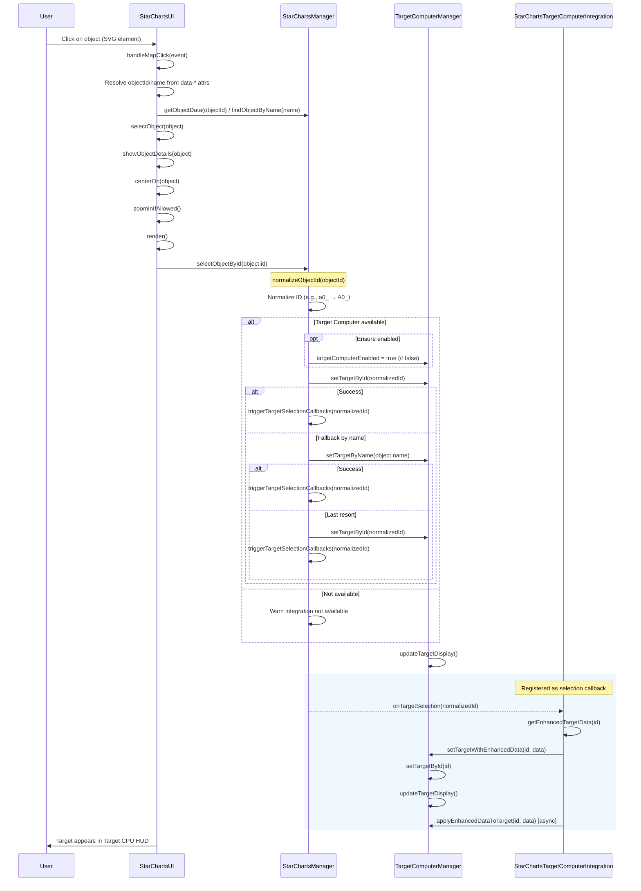

# Star Charts ↔ Target Computer Integration Sequence Diagram

## Overview
This diagram shows the exact click-to-target flow: when a user clicks a celestial object in Star Charts, that object becomes the current target in the Target Computer HUD.

## Sequence Diagram

## 🎯 Key Process Flow

### 1. User Interaction
- User clicks an object in Star Charts UI
- `StarChartsUI.handleMapClick()` resolves the element → objectId/name
- `StarChartsUI.selectObject()` centers/zooms, then calls `StarChartsManager.selectObjectById()`

### 2. Target Acquisition
- `StarChartsManager.normalizeObjectId()` normalizes IDs (e.g., `a0_` → `A0_`)
- Ensures `TargetComputerManager.targetComputerEnabled` is true
- Calls `TargetComputerManager.setTargetById()`
- Falls back to `setTargetByName()` if needed
- On success, calls `StarChartsManager.triggerTargetSelectionCallbacks()`

### 3. Integration Callback
- `StarChartsTargetComputerIntegration` is registered via `addTargetSelectionCallback`
- On selection: `handleTargetSelection()` → `setTargetWithEnhancedData()`
- Reinforces target via `setTargetById()` and forces `updateTargetDisplay()`
- Applies enhanced target data asynchronously

### 4. HUD Update
- `TargetComputerManager.updateTargetDisplay()` refreshes the Target CPU HUD

## 🔄 Key Integration Points

- **Star Charts ↔ Target Computer**: Real-time sync via callbacks
- **Frontend ↔ Backend**: Async state updates via GameStateManager
- **Discovery ↔ Missions**: Automatic mission unlocking
- **Memory ↔ Storage**: Persistent state management

## 📋 Components Involved

- **StarChartsUI**: User interface for Star Charts system
- **StarChartsManager**: Core discovery and management logic
- **DiscoveryState**: Local storage persistence layer
- **StarChartsIntegration**: Bridge between Star Charts and Target Computer
- **TargetComputerManager**: Target acquisition and management
- **GameStateManager**: Backend state persistence
- **MissionIntegration**: Mission discovery and state management

## 🚀 Integration Benefits

- **Seamless Discovery**: Objects discovered in Star Charts automatically become available targets
- **Real-time Sync**: No delay between discovery and target availability
- **Persistent State**: All discoveries saved and restored between sessions
- **Mission Integration**: Discoveries can unlock new missions automatically
- **Unified Experience**: Single workflow from discovery to targeting

---

*This diagram was generated as part of Phase 5: Star Charts and Target Computer Integration implementation.*
