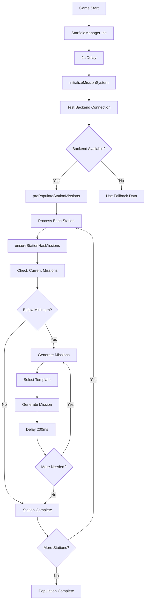

# 🚀 Station Mission Pre-Population System

## 🎯 **Overview**

The Station Mission Pre-Population system automatically ensures that all game stations have appropriate missions available when players visit them. This creates a consistent and immersive gameplay experience with location-specific content.

---

## 🏗️ **System Architecture**

### **Initialization Flow**


---

## 🗺️ **Station Configuration**

### **Configured Stations:**

**Available Templates**: `elimination`, `escort`, `exploration`, `delivery`

> **Note**: Template IDs correspond to the `template_id` field in JSON template files, not the filename. For example, `elimination_template.json` contains `"template_id": "elimination"`.

---

#### **🏛️ Terra Prime (terra_prime)**
- **Type**: Military Hub
- **Faction**: Terran Republic Alliance
- **Mission Range**: 3-6 missions
- **Templates**: 
  - elimination (weight: 3)
  - escort (weight: 2)

#### **🔬 Europa Station (europa_station)**
- **Type**: Research Station  
- **Faction**: Scientists Consortium
- **Mission Range**: 2-4 missions
- **Templates**:
  - exploration (weight: 3)
  - delivery (weight: 2)

#### **⛏️ Ceres Outpost (ceres_outpost)**
- **Type**: Trade Hub
- **Faction**: Traders Guild
- **Mission Range**: 3-5 missions
- **Templates**:
  - delivery (weight: 3)
  - escort (weight: 2)

#### **🚀 Mars Base (mars_base)**
- **Type**: Military Base
- **Faction**: Terran Republic Alliance
- **Mission Range**: 2-4 missions
- **Templates**:
  - elimination (weight: 3)
  - escort (weight: 2)

#### **🚢 Luna Port (luna_port)**
- **Type**: Commercial Port
- **Faction**: Traders Guild  
- **Mission Range**: 2-3 missions
- **Templates**:
  - delivery (weight: 3)
  - escort (weight: 2)

#### **⚒️ Asteroid Mining Platform (asteroid_mining_platform)**
- **Type**: Industrial
- **Faction**: Miners Union
- **Mission Range**: 1-3 missions
- **Templates**:
  - elimination (weight: 2)
  - escort (weight: 3)

---

## ⚙️ **Technical Implementation**

### **Core Methods:**

#### **1. initializeMissionSystem()**
- Called 2 seconds after game start
- Tests backend connectivity
- Triggers pre-population if backend available

#### **2. prePopulateStationMissions()**
- Iterates through all configured stations
- Calls `ensureStationHasMissions()` for each
- 500ms delay between stations to avoid API overload

#### **3. ensureStationHasMissions(station)**
- Checks current mission count at station
- Generates missions if below minimum threshold
- Uses weighted template selection
- 200ms delay between mission generations

#### **4. selectStationTemplate(station)**
- Uses weighted random selection
- Considers station type and faction
- Fallback to basic templates if needed

### **Weighted Template Selection:**
```javascript
// Example for Military Hub
const weights = {
    'elimination': 3,    // 60% chance
    'escort': 2          // 40% chance
};
```

---

## 🔄 **Runtime Behavior**

### **Automatic Refresh:**
- **On Docking**: Refreshes missions for docked station after 1s delay
- **Mission Acceptance**: Triggers station refresh to maintain mission count
- **Periodic**: Stations automatically maintain minimum mission counts

### **Error Handling:**
- **Backend Unavailable**: Falls back to mock data, continues game operation
- **Template Not Found**: Uses fallback templates (delivery, elimination, escort)
- **Generation Failure**: Logs error, continues with remaining stations
- **API Timeout**: Individual station failures don't stop overall process

---

## 🎮 **Player Experience**

### **Consistent Content:**
- **Always Available**: Every station always has missions appropriate to its type
- **Location-Specific**: Military stations have combat missions, trade hubs have commerce missions
- **Faction-Aware**: Mission givers and content match station faction affiliations
- **Dynamic Refresh**: New missions appear as old ones are accepted

### **Immersive Variety:**
- **Weighted Randomization**: Common mission types appear more frequently than rare ones
- **Station Personality**: Each location feels unique based on its mission mix
- **Scalable Content**: Easy to add new stations or modify existing ones

---

## 🧪 **Testing & Debugging**

### **Console Commands:**

#### **Manual Population:**
```javascript
// Manually populate all stations
starfieldManager.populateAllStations();
```

#### **Mission Summary:**
```javascript
// Get overview of all station missions
starfieldManager.getMissionSummary();
```

#### **Station Refresh:**
```javascript
// Refresh specific station
starfieldManager.refreshStationMissions('terra_prime');
```

#### **Test UI:**
```javascript
// Test complete mission system
starfieldManager.testMissionUI();
```

### **Console Output:**
```
🎯 Initializing mission system...
🎯 Mission API connected, pre-populating stations...
🎯 Pre-populating 6 stations with missions...
🎯 Terra Prime: 0 existing missions
🎯 Generating 3 missions for Terra Prime
🎯 Generated elimination mission for Terra Prime: Eliminate Raider Squadron
🎯 Generated escort mission for Terra Prime: VIP Transport Escort
🎯 Generated elimination mission for Terra Prime: Clear Mining Platform
🎯 Europa Station: 0 existing missions
🎯 Generating 2 missions for Europa Station
...
🎯 Station mission pre-population complete
```

---

## 📊 **Performance Considerations**

### **Optimizations:**
- **Delayed Start**: 2s delay ensures all systems ready before population
- **Staggered Requests**: 500ms between stations, 200ms between missions
- **Caching**: MissionAPIService caches results to reduce API calls
- **Conditional Generation**: Only generates if below minimum threshold
- **Error Isolation**: Individual failures don't affect other stations

### **Resource Usage:**
- **Memory**: Minimal - only stores station configuration data
- **Network**: Controlled burst during initialization, then periodic refreshes
- **CPU**: Lightweight weighted random selection algorithms
- **API Load**: Rate-limited to prevent backend overload

---

## 🔧 **Configuration**

### **Adding New Stations:**
```javascript
// Add to getGameStations() method
{
    key: 'new_station_key',
    name: 'New Station Name',
    type: 'station_type',
    faction: 'faction_name',
    templates: ['template1', 'template2'],
    minMissions: 2,
    maxMissions: 4
}
```

### **Modifying Templates:**
```javascript
// Update getTemplateWeights() method
new_station_type: {
    'preferred_template': 3,
    'common_template': 2,  
    'rare_template': 1
}
```

### **Adjusting Timing:**
```javascript
// In StarfieldManager constructor
setTimeout(() => {
    this.initializeMissionSystem();
}, 2000); // Initialization delay

// In prePopulateStationMissions()
await this.delay(500); // Between stations

// In ensureStationHasMissions()  
await this.delay(200); // Between missions
```

---

## 🎯 **Benefits**

### **For Players:**
- **Consistent Experience**: Always find missions at stations
- **Location Immersion**: Mission types match station themes
- **No Empty Stations**: Every visit offers meaningful content
- **Dynamic Content**: Mission variety keeps gameplay fresh

### **For Development:**
- **Scalable System**: Easy to add new stations and mission types
- **Configurable**: Weights and counts easily adjustable
- **Maintainable**: Clear separation of concerns and documentation
- **Testable**: Comprehensive console commands for debugging

### **For Game Balance:**
- **Controlled Distribution**: Ensures appropriate mission density
- **Faction Integration**: Missions reinforce station allegiances  
- **Economic Balance**: Mission rewards appropriate to station type
- **Progress Gating**: Can control mission difficulty by station

---

## 🚀 **Result**

**Complete station mission pre-population system** that ensures every station in the game always has appropriate, thematic missions available for players. The system is:

- **Automatic**: Runs on game start without player intervention
- **Intelligent**: Generates appropriate missions based on station type
- **Resilient**: Handles errors gracefully and continues operation
- **Performant**: Rate-limited to avoid overwhelming the backend
- **Testable**: Complete console interface for debugging and monitoring

**Players will always find engaging, location-appropriate missions at every station they visit!** 🎯
