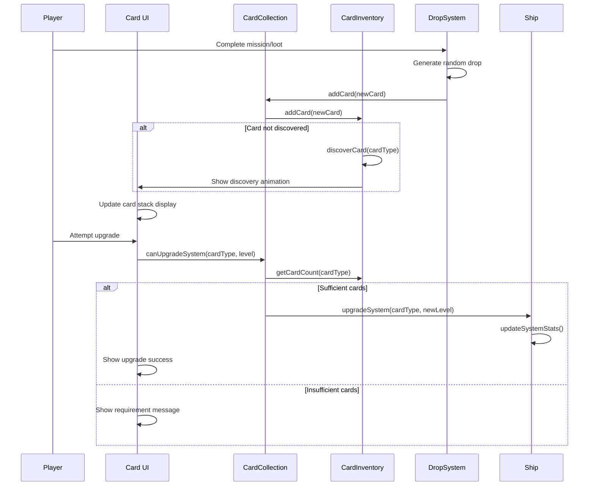
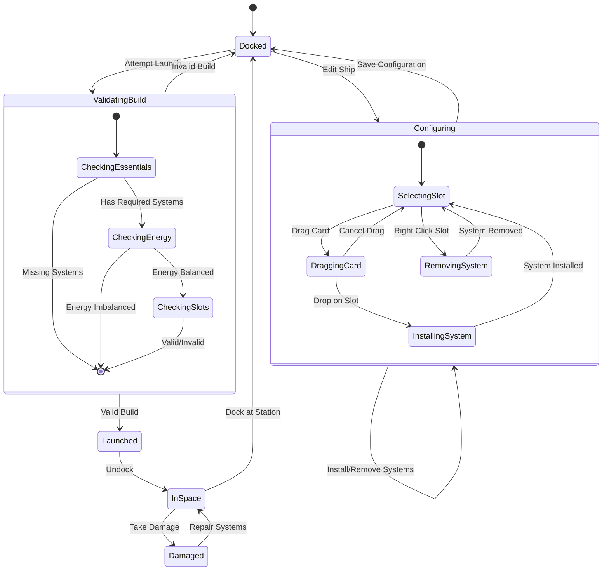
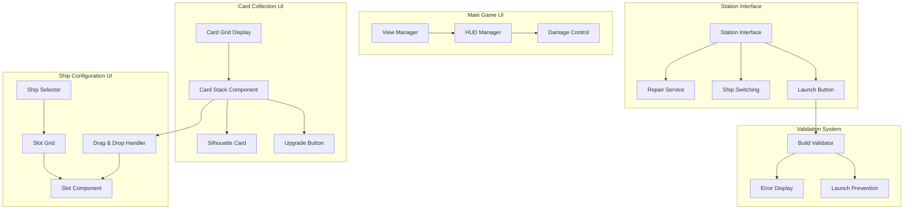
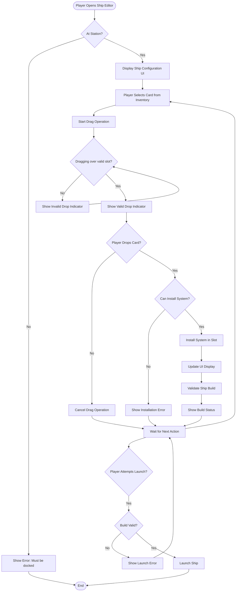
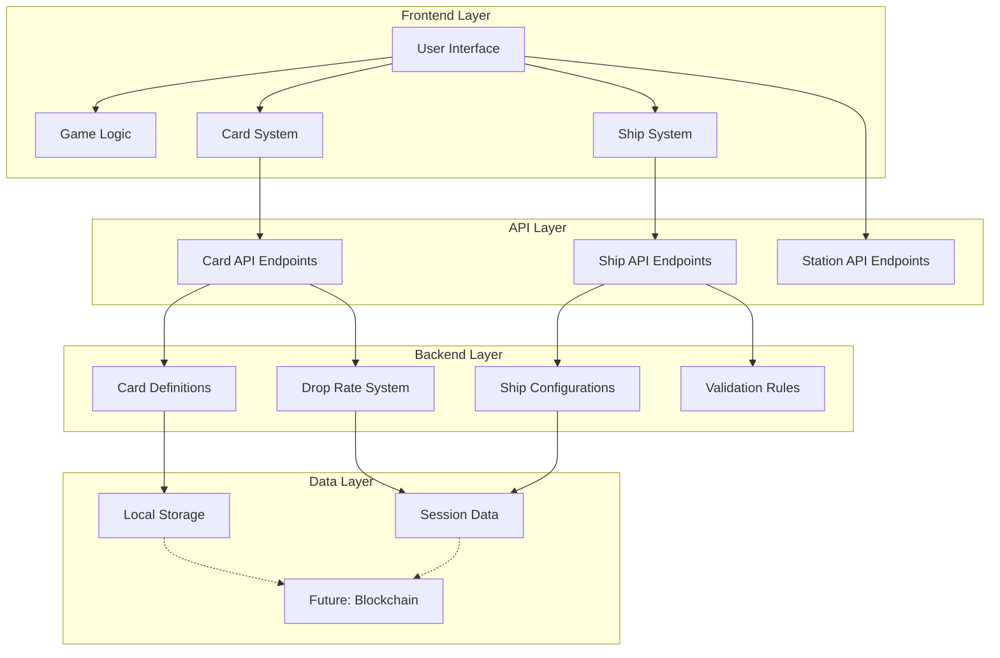

# System Architecture Documentation

## Overview
This document contains UML diagrams illustrating the architecture of the Planetz NFT card collection spaceship system.

## NFT Card Collection System

### Class Diagram - Core Card System

```mermaid
classDiagram
    class NFTCard {
        +String tokenId
        +String cardType
        +String rarity
        +Number quantity
        +Boolean discovered
        +Object metadata
        +String name
        +String description
        +String image
        +Array attributes
        +constructor(cardType, rarity, tokenId)
        +isDiscovered() Boolean
        +getMetadata() Object
    }

    class CardInventory {
        +Map~String, NFTCard[]~ cards
        +Set~String~ discoveredTypes
        +addCard(nftCard) void
        +getCardCount(cardType) Number
        +canUpgrade(cardType, currentLevel) Boolean
        +getUpgradeRequirement(cardType, level) Number
        +getDiscoveredTypes() Array
        +getUndiscoveredTypes() Array
        +getAllCardTypes() Array
    }

    class CardCollection {
        +CardInventory inventory
        +Map~String, Number~ cardCounts
        +Array~String~ discoveredCards
        +discoverCard(cardType) void
        +addCards(cardType, quantity) void
        +getStackCount(cardType) Number
        +canUpgradeSystem(cardType, level) Boolean
        +upgradeSystem(cardType, credits) Boolean
    }

    class DropSystem {
        +Map~String, Number~ dropRates
        +Map~String, Number~ systemInventory
        +generateDrop() NFTCard
        +updateInventory(cardType, quantity) void
        +getAvailableCards() Array
        +isCardAvailable(cardType) Boolean
    }

    CardInventory ||--o{ NFTCard : contains
    CardCollection ||--|| CardInventory : manages
    DropSystem ..> NFTCard : creates
    CardCollection <-- DropSystem : receives drops
```

### Sequence Diagram - Card Discovery and Upgrade



## Ship Management System

### Class Diagram - Ship and System Architecture

```mermaid
classDiagram
    class Ship {
        +String shipType
        +String name
        +Number maxSlots
        +Number maxEnergy
        +Number energyRechargeRate
        +Number maxHull
        +Map~String, SystemSlot~ slots
        +Map~String, System~ systems
        +Number currentEnergy
        +Number currentHull
        +constructor(shipType, config)
        +installSystem(slotId, cardType, level) Boolean
        +removeSystem(slotId) Boolean
        +validateBuild() ValidationResult
        +canLaunch() Boolean
        +getSystemByType(systemType) System
        +getAvailableSlots() Array
    }

    class SystemSlot {
        +String slotId
        +String installedSystem
        +Boolean isEmpty
        +install(systemType) Boolean
        +remove() Boolean
        +getSystem() System
    }

    class System {
        +String systemType
        +Number level
        +Number health
        +Boolean isActive
        +Number energyConsumption
        +Object stats
        +constructor(systemType, level)
        +activate() Boolean
        +deactivate() void
        +takeDamage(amount) void
        +repair(amount) void
        +getEffectiveness() Number
        +upgrade(newLevel) void
    }

    class ShipCollection {
        +Array~Ship~ ownedShips
        +Ship activeShip
        +addShip(shipType, name) Ship
        +selectShip(shipId) Boolean
        +getShip(shipId) Ship
        +getAllShips() Array
        +canSwitchShip() Boolean
    }

    class BuildValidator {
        +validateBuild(ship) ValidationResult
        +hasEssentialSystems(ship) Boolean
        +checkEnergyBalance(ship) Boolean
        +checkSlotCapacity(ship) Boolean
        +getValidationErrors(ship) Array
    }

    Ship ||--o{ SystemSlot : contains
    SystemSlot ||--o| System : holds
    ShipCollection ||--o{ Ship : manages
    BuildValidator ..> Ship : validates
    Ship ..> BuildValidator : uses
```

### State Diagram - Ship Configuration States



## User Interface Architecture

### Component Diagram - UI System



### Activity Diagram - Card Installation Flow



## Data Flow Architecture

### Data Flow Diagram - Card Collection to Ship Configuration

```mermaid
flowchart LR
    subgraph "External Sources"
        Missions[Mission Rewards]
        Loot[Loot Drops]
        Trading[Future: NFT Trading]
    end
    
    subgraph "Drop System"
        DropGen[Drop Generator]
        RarityCalc[Rarity Calculator]
        Inventory[System Inventory]
    end
    
    subgraph "Card Management"
        CardCollection[Card Collection]
        CardStacks[Card Stacks]
        Discovery[Discovery System]
    end
    
    subgraph "Ship Systems"
        ShipCollection[Ship Collection]
        ActiveShip[Active Ship]
        SystemSlots[System Slots]
    end
    
    subgraph "Validation"
        BuildValidator[Build Validator]
        LaunchCheck[Launch Check]
    end
    
    subgraph "UI Layer"
        CardUI[Card UI]
        ShipUI[Ship Configuration UI]
        StationUI[Station UI]
    end
    
    Missions --> DropGen
    Loot --> DropGen
    Trading -.-> CardCollection
    
    DropGen --> RarityCalc
    RarityCalc --> Inventory
    Inventory --> CardCollection
    
    CardCollection --> CardStacks
    CardStacks --> Discovery
    Discovery --> CardUI
    
    CardUI --> ShipUI
    ShipUI --> SystemSlots
    SystemSlots --> ActiveShip
    ActiveShip --> ShipCollection
    
    SystemSlots --> BuildValidator
    BuildValidator --> LaunchCheck
    LaunchCheck --> StationUI
    
    CardUI <--> CardCollection
    ShipUI <--> ActiveShip
    StationUI <--> ShipCollection
```



## System Integration

### Component Integration Diagram



This architecture documentation provides a comprehensive view of the NFT card collection system, showing how all components interact to create a cohesive gameplay experience while maintaining flexibility for future blockchain integration. 