# System Architecture Documentation

## Overview
This document contains UML diagrams illustrating the architecture of the Planetz NFT card collection spaceship system.

## NFT Card Collection System

### Class Diagram - Core Card System

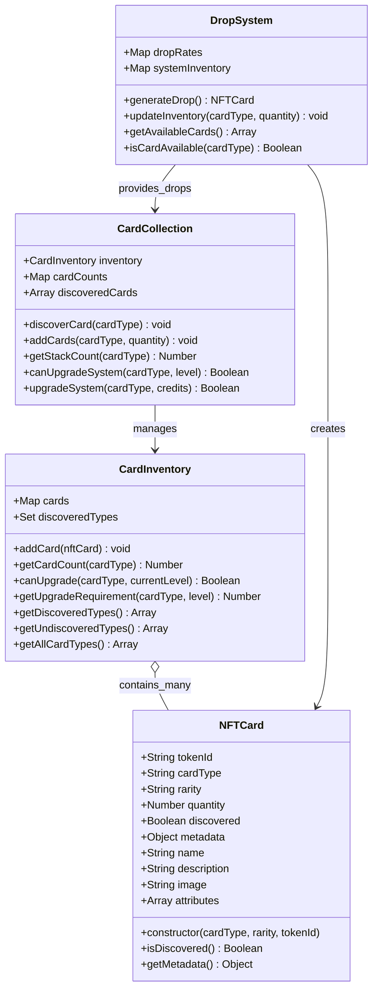

### Sequence Diagram - Card Discovery and Upgrade

## Ship Management System

### Class Diagram - Ship and System Architecture

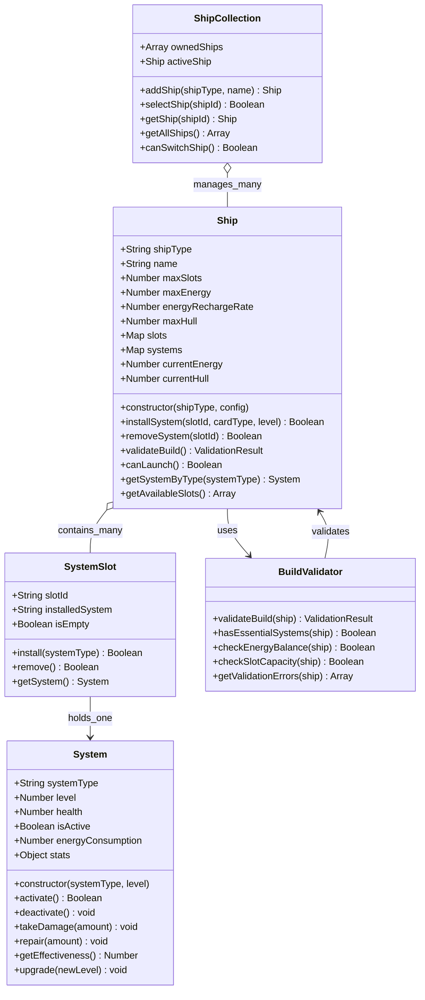

### State Diagram - Ship Configuration States

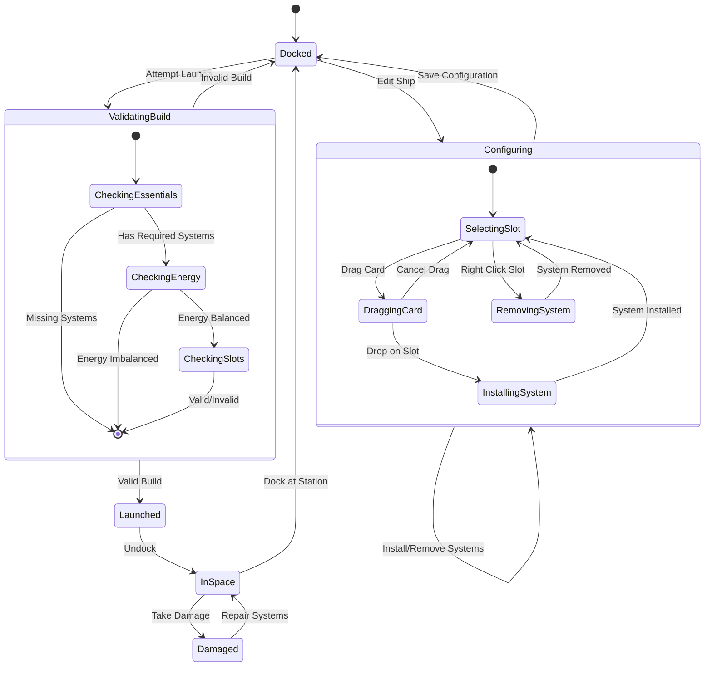

## User Interface Architecture

### Component Diagram - UI System

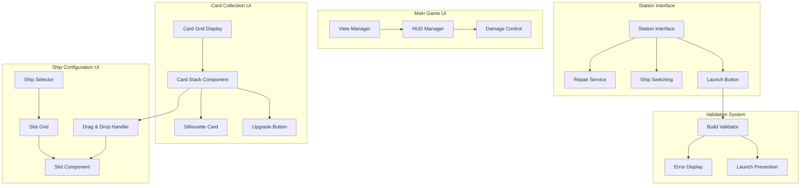

### Activity Diagram - Card Installation Flow

## Data Flow Architecture

### Data Flow Diagram - Card Collection to Ship Configuration

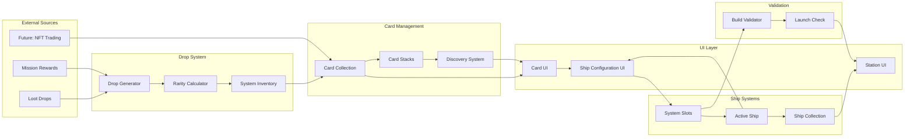

## System Integration

### Component Integration Diagram

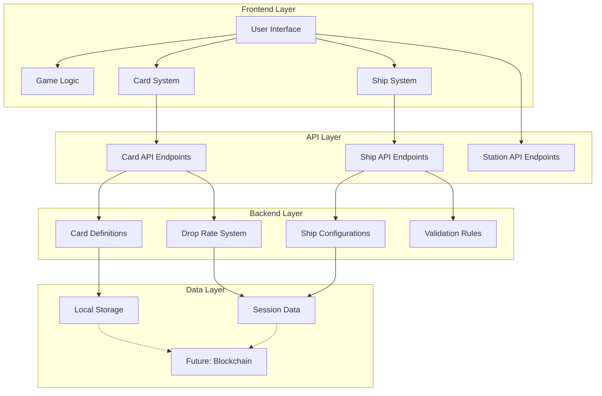

### Sequence Diagram - Card Purchase and Installation

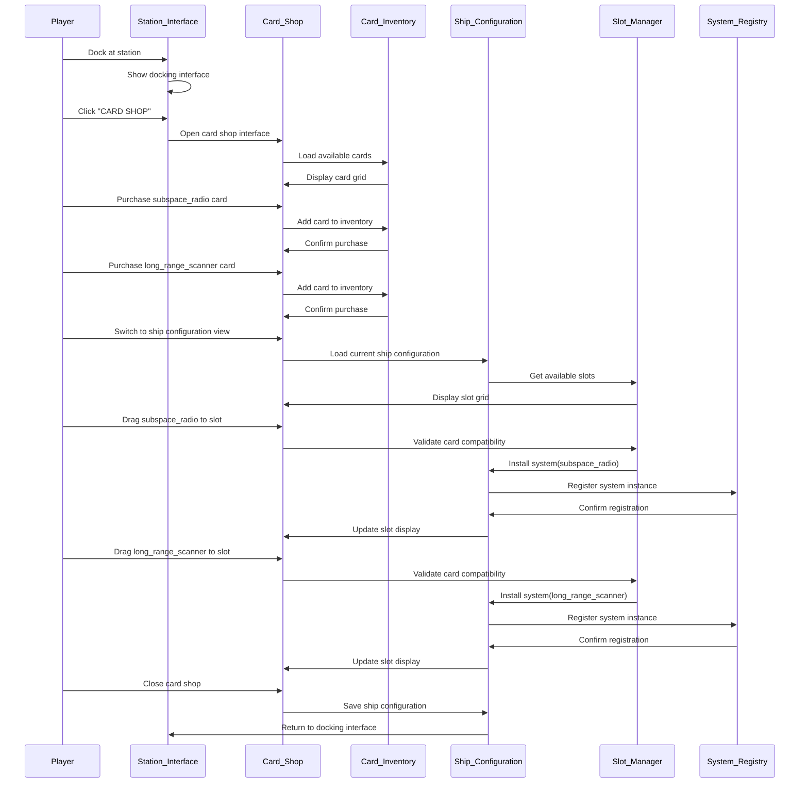

### Sequence Diagram - Ship Launch and System Recognition

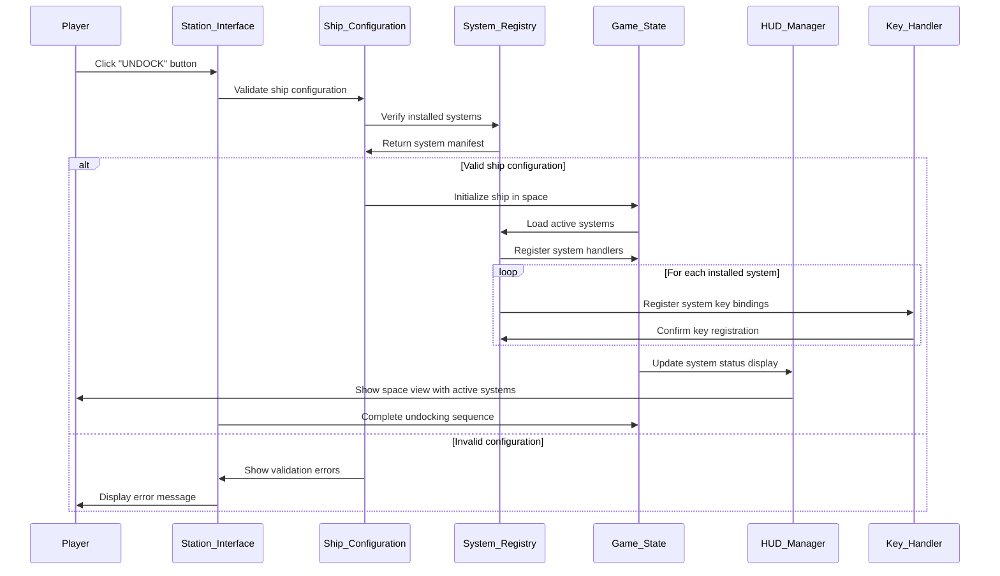

### Sequence Diagram - System Activation (Success Path)

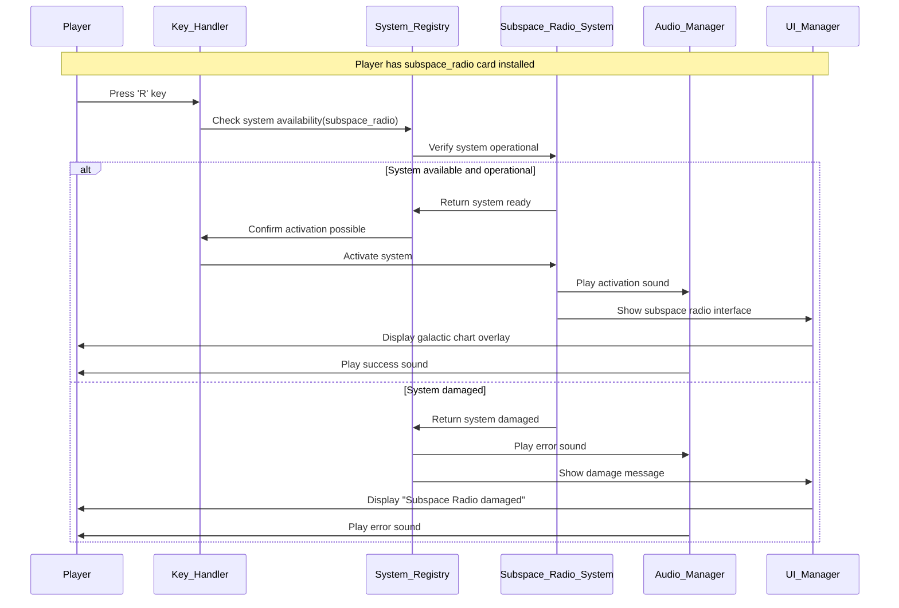

### Sequence Diagram - System Activation (Failure Path)

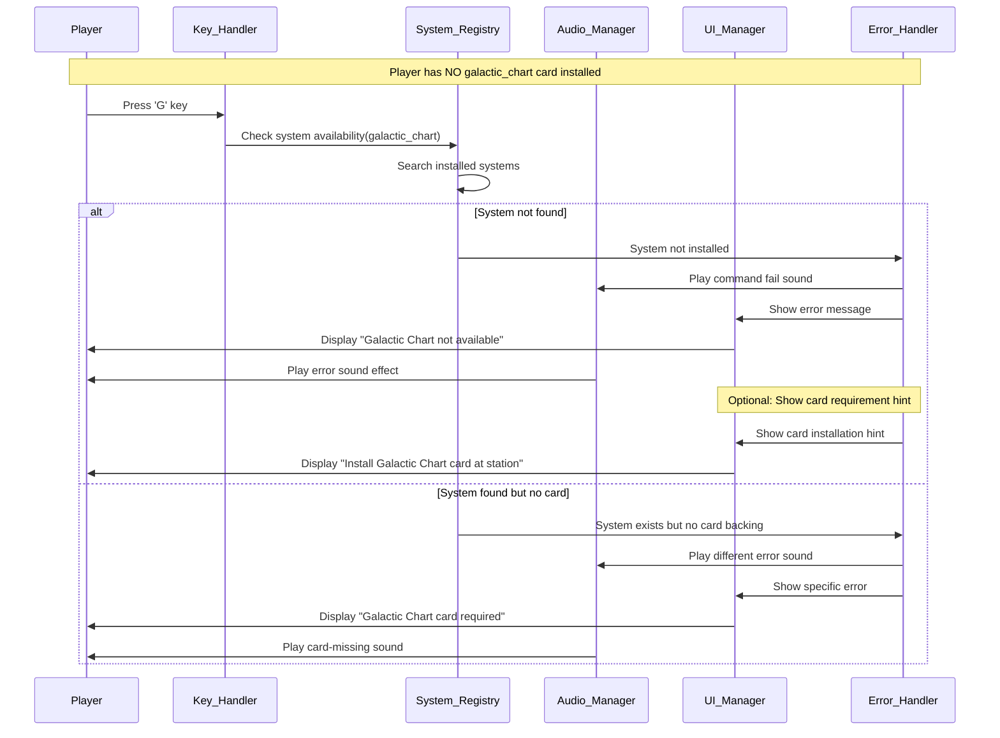

### Sequence Diagram - System State Synchronization Issues

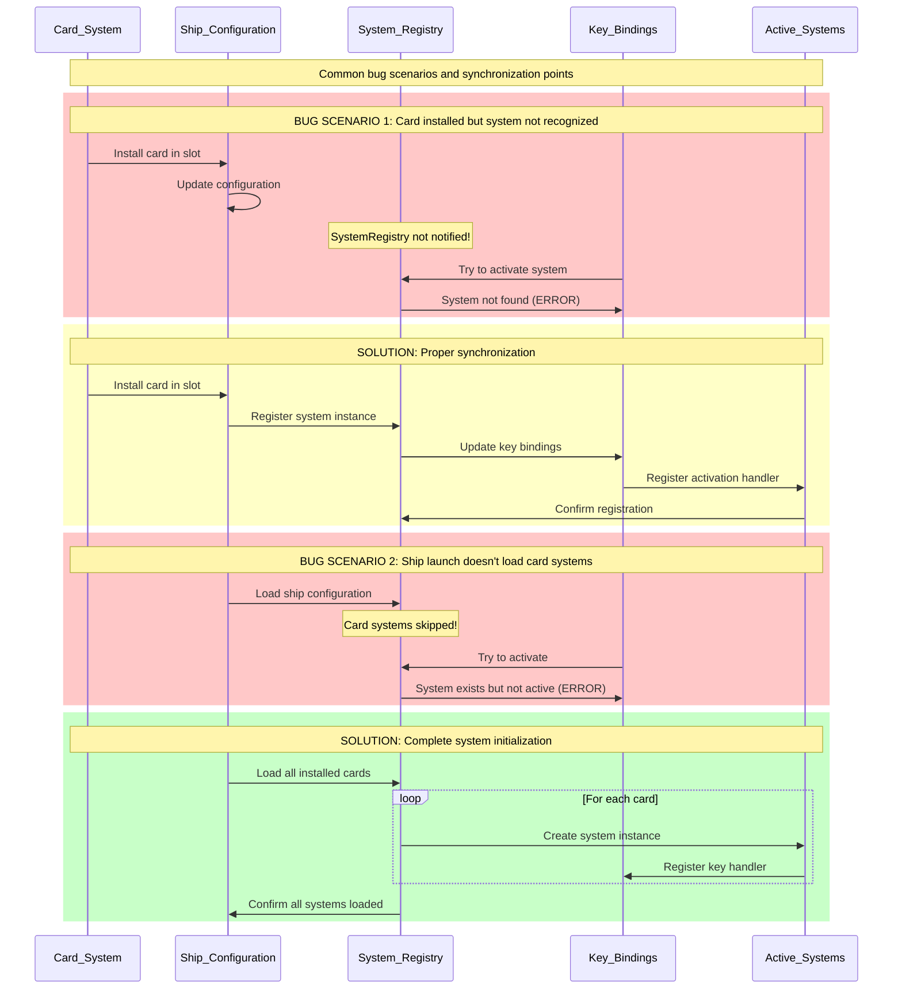

This architecture documentation provides a comprehensive view of the NFT card collection system, showing how all components interact to create a cohesive gameplay experience while maintaining flexibility for future blockchain integration. 