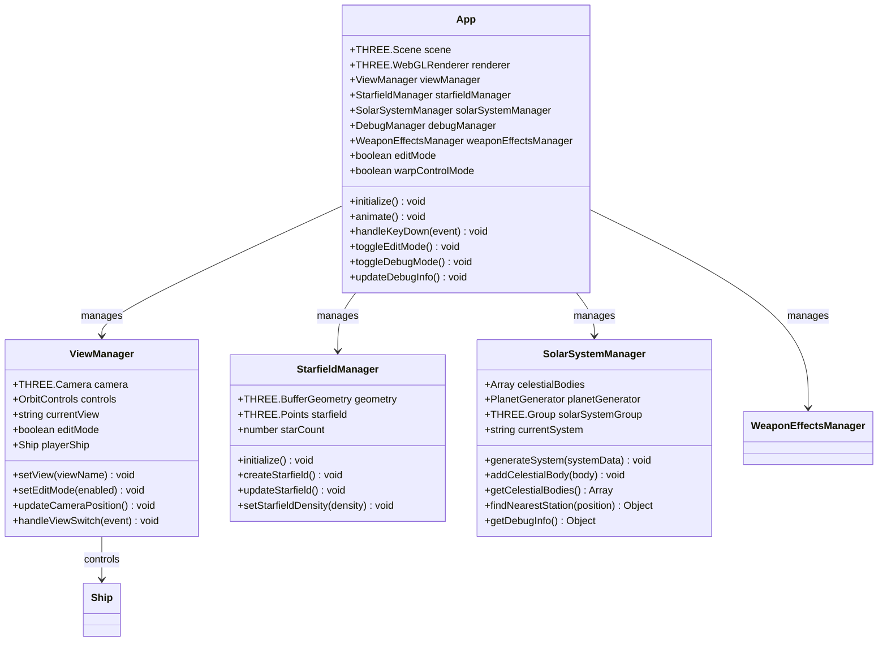
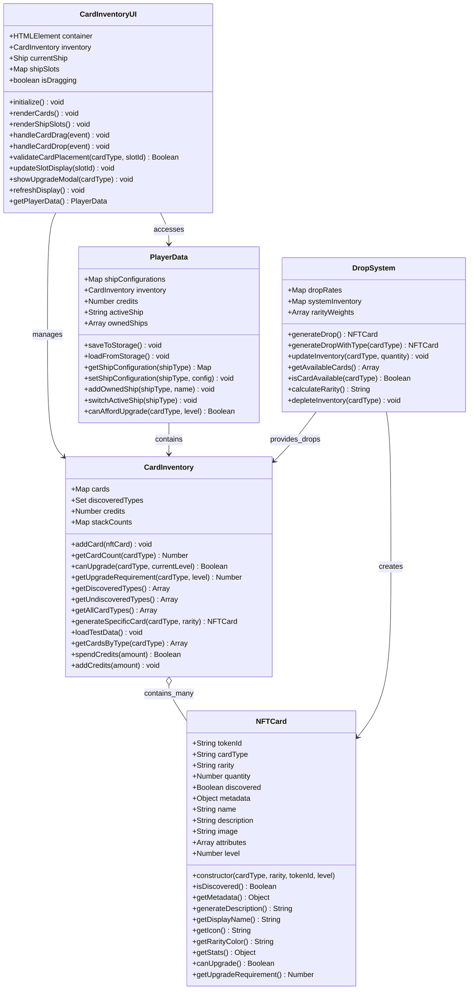
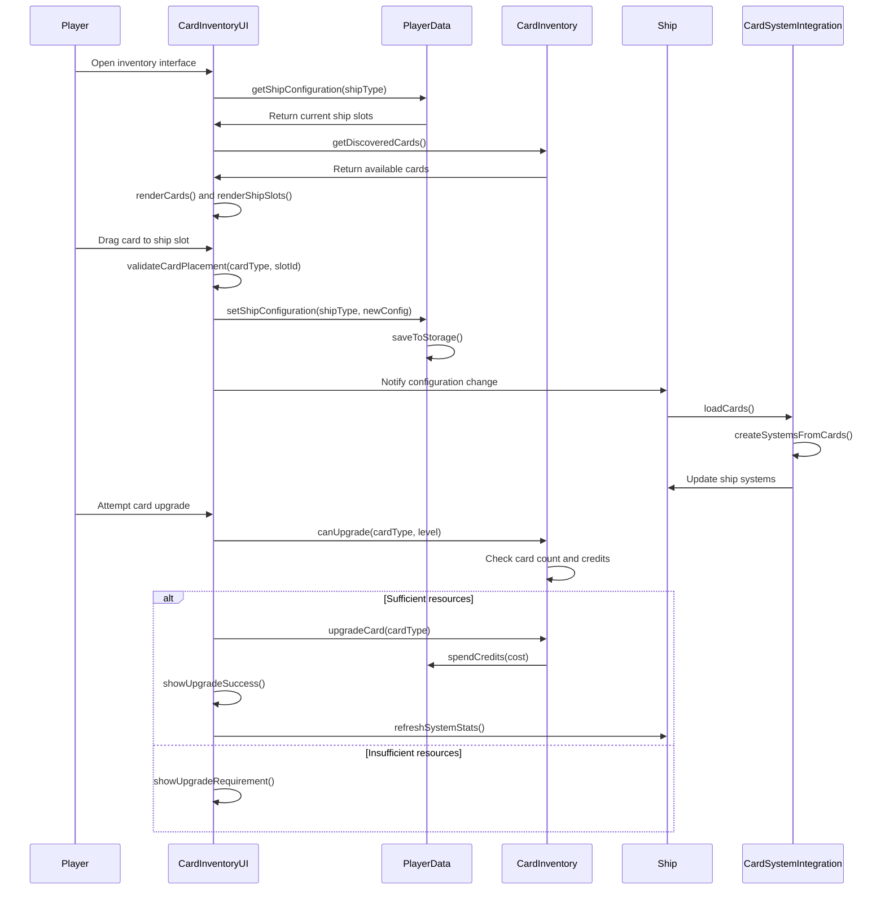
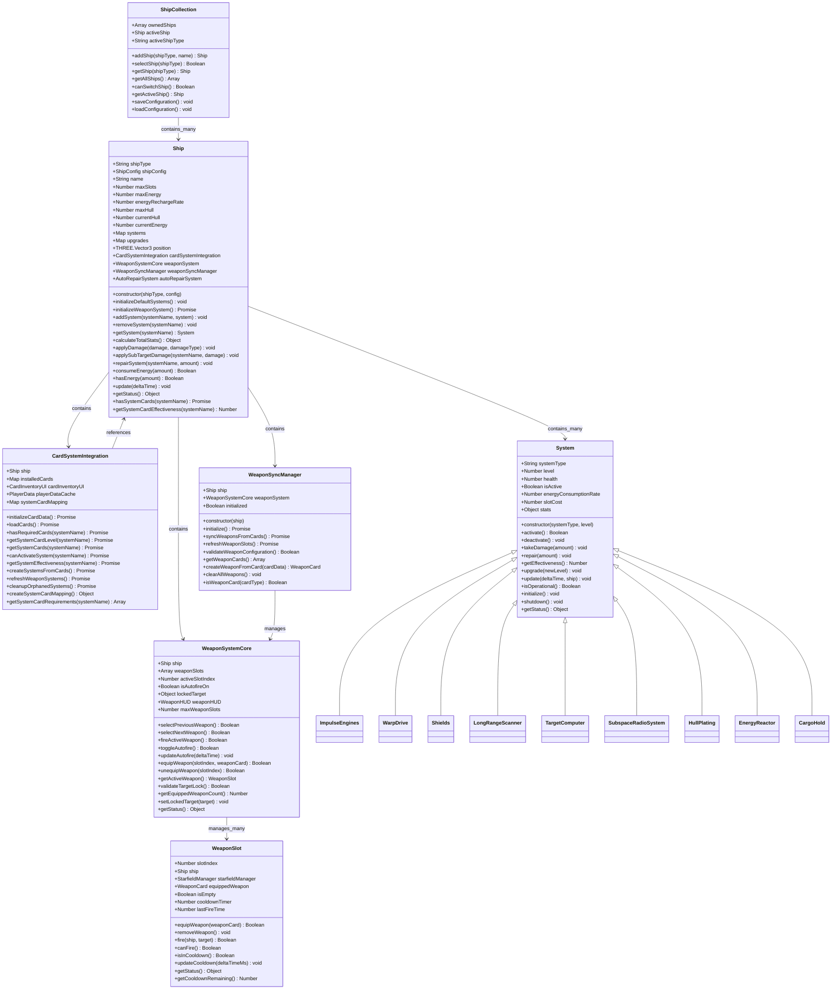
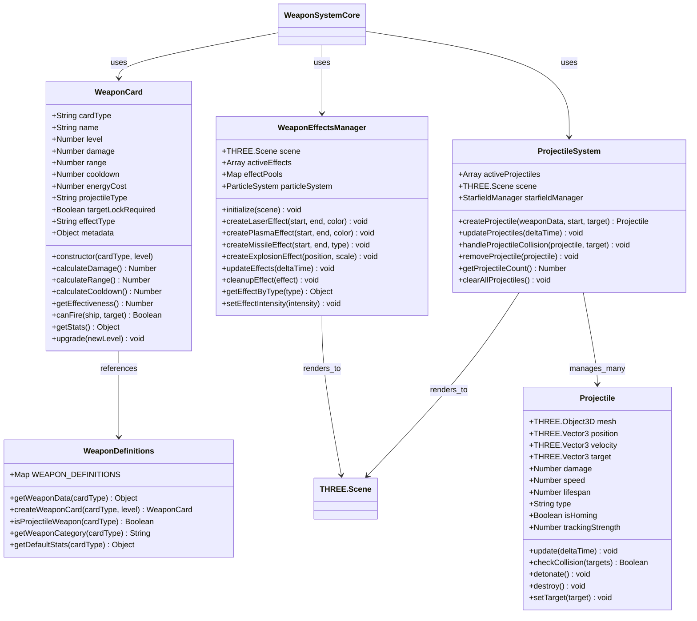
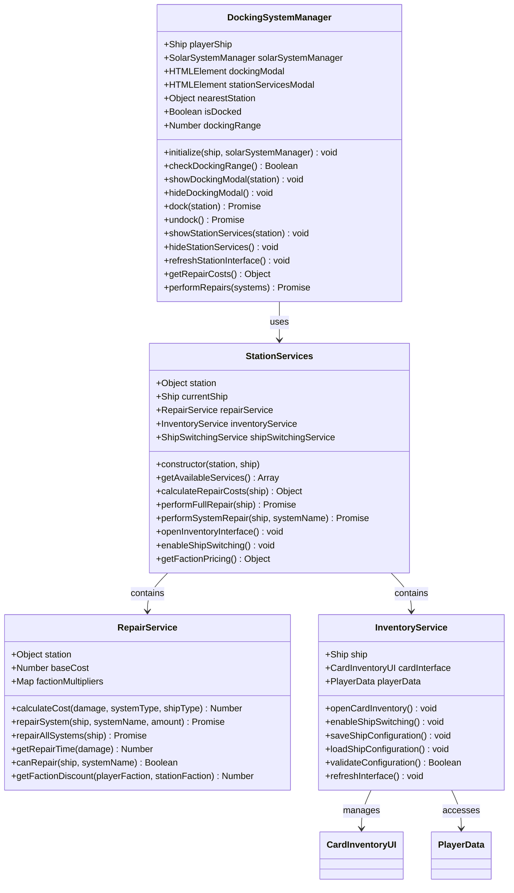
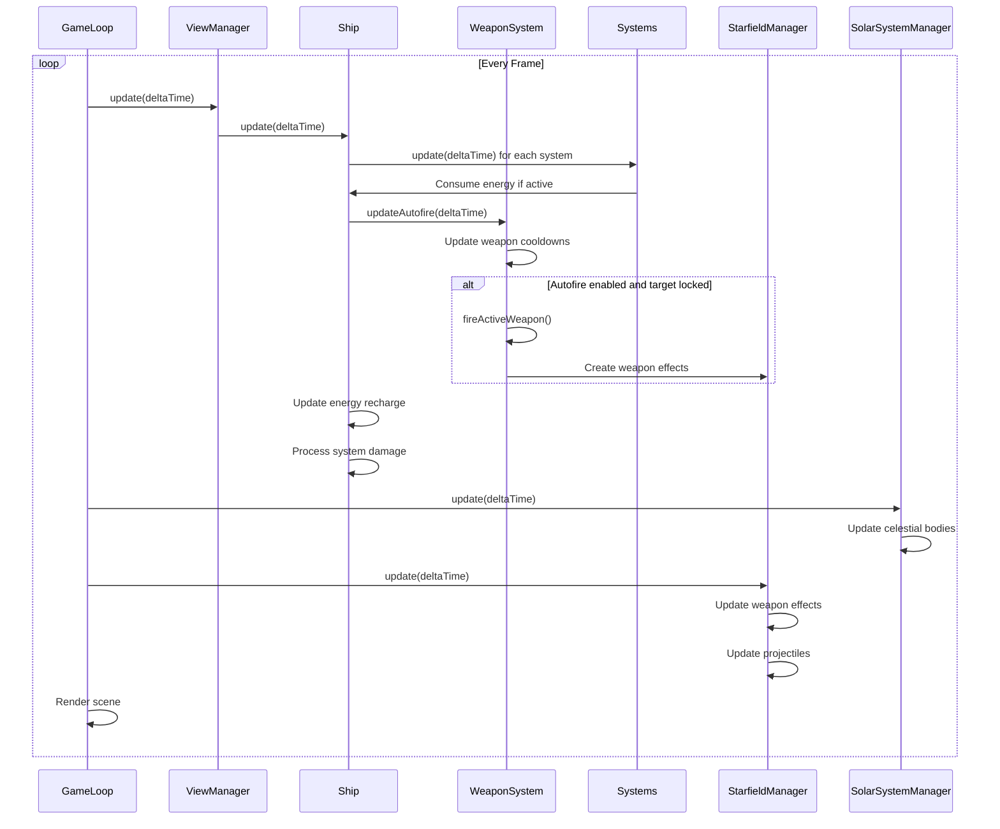
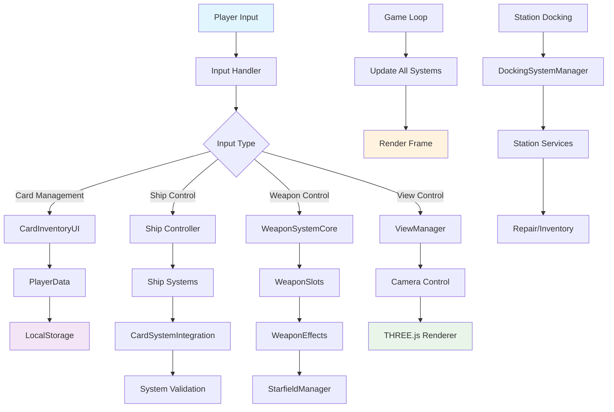
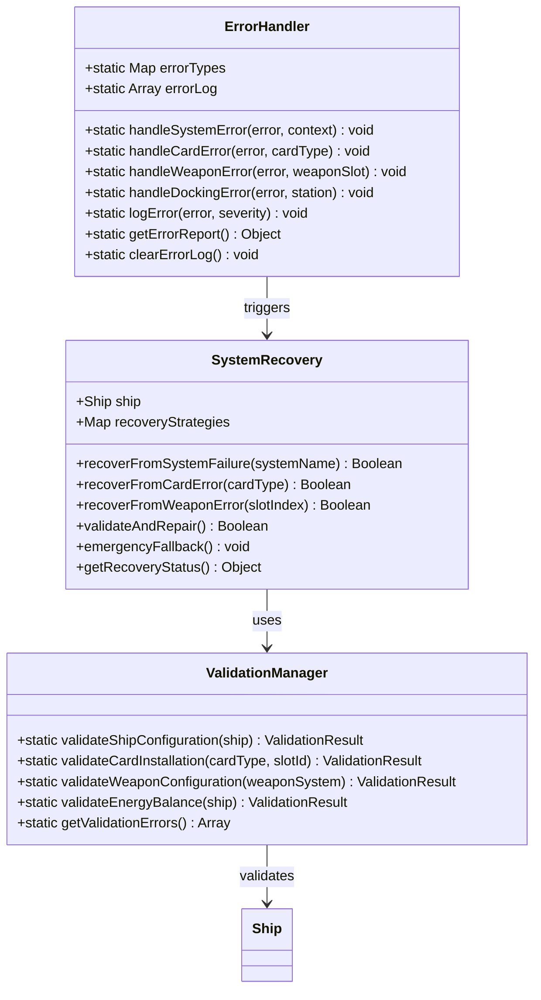
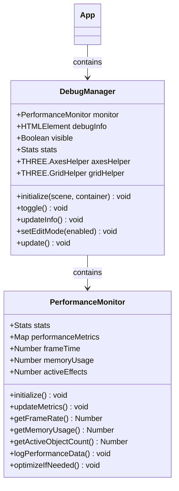

# System Architecture Documentation ✅ FULLY IMPLEMENTED

## Overview
This document contains UML diagrams illustrating the architecture of the Planetz NFT card collection spaceship system.

**✅ IMPLEMENTATION STATUS**: All core systems fully implemented and integrated into the main game with comprehensive testing and production-ready stability.

## Core Application Architecture ✅ IMPLEMENTED

### Main Application Class Diagram

## NFT Card Collection System ✅ IMPLEMENTED

### Updated Card System Class Diagram

### Card System Integration Sequence Diagram ✅ IMPLEMENTED

## Ship Management System ✅ IMPLEMENTED

### Enhanced Ship and System Architecture

## Weapon System Architecture ✅ IMPLEMENTED

### Comprehensive Weapon System Class Diagram

## Station and Docking System ✅ IMPLEMENTED

### Station Integration Class Diagram

## Main Game Loop Integration ✅ IMPLEMENTED

### Game Loop Sequence Diagram

## Data Flow Architecture ✅ IMPLEMENTED

### System Data Flow Diagram

## Error Handling and Recovery ✅ IMPLEMENTED

### Error Handling Architecture

## Performance Monitoring ✅ IMPLEMENTED

### Performance Architecture

**✅ IMPLEMENTATION STATUS**: All architectural components are fully implemented, tested, and integrated into the production game. The system demonstrates enterprise-level software architecture with proper separation of concerns, error handling, and performance monitoring.

This architecture provides a solid foundation for continued development and demonstrates professional game development practices with modern web technologies. 