# System Architecture Documentation

## Overview
This document contains UML diagrams illustrating the architecture of the Planetz NFT card collection spaceship system.

## NFT Card Collection System

### Class Diagram - Core Card System

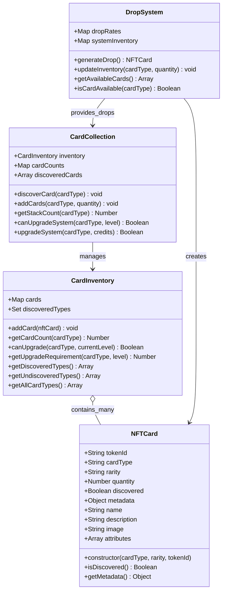
```mermaid
classDiagram
    class NFTCard {
        +String tokenId
        +String cardType
        +String rarity
        +Number quantity
        +Boolean discovered
        +Object metadata
        +String name
        +String description
        +String image
        +Array attributes
        +constructor(cardType, rarity, tokenId)
        +isDiscovered() Boolean
        +getMetadata() Object
    }

    class CardInventory {
        +Map cards
        +Set discoveredTypes
        +addCard(nftCard) void
        +getCardCount(cardType) Number
        +canUpgrade(cardType, currentLevel) Boolean
        +getUpgradeRequirement(cardType, level) Number
        +getDiscoveredTypes() Array
        +getUndiscoveredTypes() Array
        +getAllCardTypes() Array
    }

    class CardCollection {
        +CardInventory inventory
        +Map cardCounts
        +Array discoveredCards
        +discoverCard(cardType) void
        +addCards(cardType, quantity) void
        +getStackCount(cardType) Number
        +canUpgradeSystem(cardType, level) Boolean
        +upgradeSystem(cardType, credits) Boolean
    }

    class DropSystem {
        +Map dropRates
        +Map systemInventory
        +generateDrop() NFTCard
        +updateInventory(cardType, quantity) void
        +getAvailableCards() Array
        +isCardAvailable(cardType) Boolean
    }

    CardInventory o-- NFTCard : contains_many
    CardCollection --> CardInventory : manages
    DropSystem --> NFTCard : creates
    DropSystem --> CardCollection : provides_drops
```

### Sequence Diagram - Card Discovery and Upgrade

```mermaid
sequenceDiagram
    participant Player
    participant CardUI as Card_UI
    participant Collection as CardCollection
    participant Inventory as CardInventory
    participant Drop as DropSystem
    participant Ship as Ship

    Player->>Drop: Complete mission/loot
    Drop->>Drop: Generate random drop
    Drop->>Collection: addCard(newCard)
    Collection->>Inventory: addCard(newCard)
    
    alt Card not discovered
        Inventory->>Inventory: discoverCard(cardType)
        Inventory->>CardUI: Show discovery animation
    end
    
    CardUI->>CardUI: Update card stack display
    
    Player->>CardUI: Attempt upgrade
    CardUI->>Collection: canUpgradeSystem(cardType, level)
    Collection->>Inventory: getCardCount(cardType)
    
    alt Sufficient cards
        Collection->>Ship: upgradeSystem(cardType, newLevel)
        Ship->>Ship: updateSystemStats()
        CardUI->>CardUI: Show upgrade success
    else Insufficient cards
        CardUI->>CardUI: Show requirement message
    end
```

## Ship Management System

### Class Diagram - Ship and System Architecture

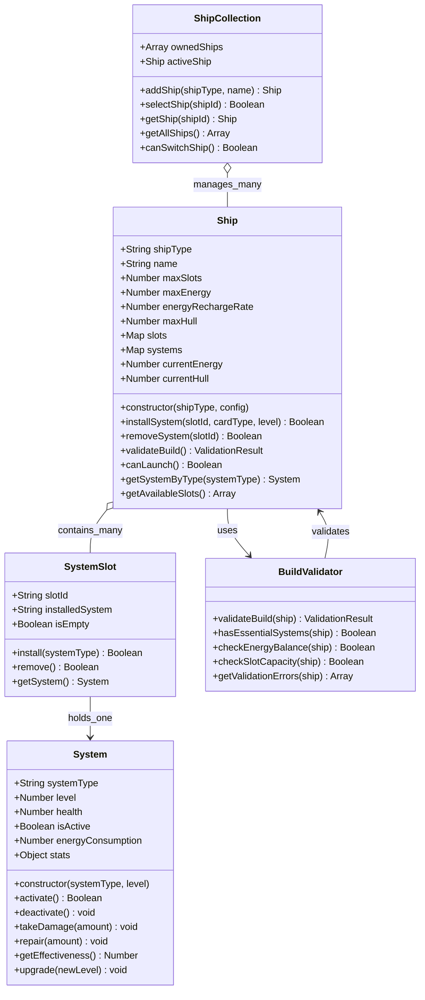
```mermaid
classDiagram
    class Ship {
        +String shipType
        +String name
        +Number maxSlots
        +Number maxEnergy
        +Number energyRechargeRate
        +Number maxHull
        +Map slots
        +Map systems
        +Number currentEnergy
        +Number currentHull
        +constructor(shipType, config)
        +installSystem(slotId, cardType, level) Boolean
        +removeSystem(slotId) Boolean
        +validateBuild() ValidationResult
        +canLaunch() Boolean
        +getSystemByType(systemType) System
        +getAvailableSlots() Array
    }

    class SystemSlot {
        +String slotId
        +String installedSystem
        +Boolean isEmpty
        +install(systemType) Boolean
        +remove() Boolean
        +getSystem() System
    }

    class System {
        +String systemType
        +Number level
        +Number health
        +Boolean isActive
        +Number energyConsumption
        +Object stats
        +constructor(systemType, level)
        +activate() Boolean
        +deactivate() void
        +takeDamage(amount) void
        +repair(amount) void
        +getEffectiveness() Number
        +upgrade(newLevel) void
    }

    class ShipCollection {
        +Array ownedShips
        +Ship activeShip
        +addShip(shipType, name) Ship
        +selectShip(shipId) Boolean
        +getShip(shipId) Ship
        +getAllShips() Array
        +canSwitchShip() Boolean
    }

    class BuildValidator {
        +validateBuild(ship) ValidationResult
        +hasEssentialSystems(ship) Boolean
        +checkEnergyBalance(ship) Boolean
        +checkSlotCapacity(ship) Boolean
        +getValidationErrors(ship) Array
    }

    Ship o-- SystemSlot : contains_many
    SystemSlot --> System : holds_one
    ShipCollection o-- Ship : manages_many
    BuildValidator --> Ship : validates
    Ship --> BuildValidator : uses
```

### State Diagram - Ship Configuration States

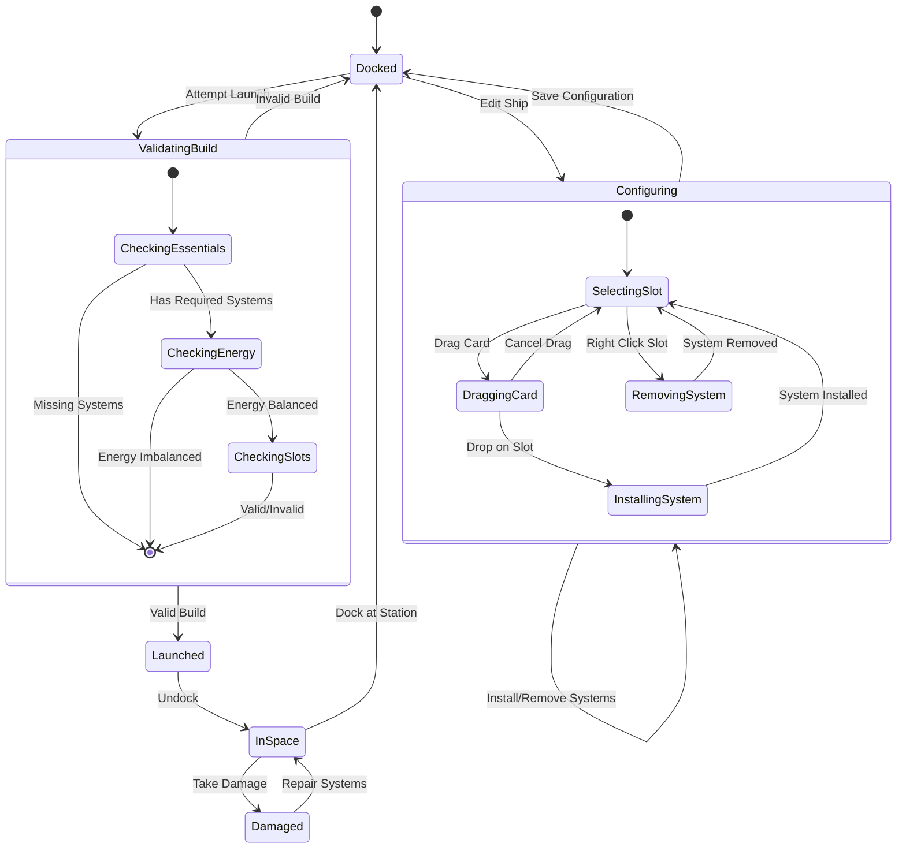
```mermaid
stateDiagram-v2
    [*] --> Docked
    
    Docked --> Configuring : Edit Ship
    Configuring --> Docked : Save Configuration
    Configuring --> Configuring : Install/Remove Systems
    
    Docked --> ValidatingBuild : Attempt Launch
    ValidatingBuild --> Docked : Invalid Build
    ValidatingBuild --> Launched : Valid Build
    
    Launched --> InSpace : Undock
    InSpace --> Damaged : Take Damage
    Damaged --> InSpace : Repair Systems
    InSpace --> Docked : Dock at Station
    
    state Configuring {
        [*] --> SelectingSlot
        SelectingSlot --> DraggingCard : Drag Card
        DraggingCard --> InstallingSystem : Drop on Slot
        DraggingCard --> SelectingSlot : Cancel Drag
        InstallingSystem --> SelectingSlot : System Installed
        SelectingSlot --> RemovingSystem : Right Click Slot
        RemovingSystem --> SelectingSlot : System Removed
    }
    
    state ValidatingBuild {
        [*] --> CheckingEssentials
        CheckingEssentials --> CheckingEnergy : Has Required Systems
        CheckingEssentials --> [*] : Missing Systems
        CheckingEnergy --> CheckingSlots : Energy Balanced
        CheckingEnergy --> [*] : Energy Imbalanced
        CheckingSlots --> [*] : Valid/Invalid
    }
```

## User Interface Architecture

### Component Diagram - UI System

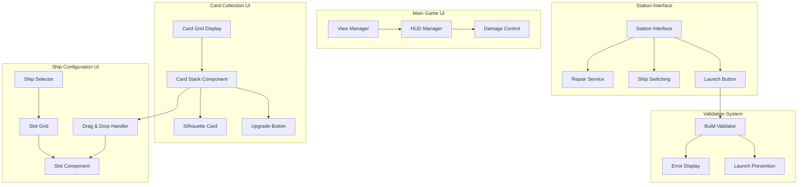
```mermaid
graph TB
    subgraph "Main Game UI"
        HUD[HUD Manager]
        ViewMgr[View Manager]
        DamageCtrl[Damage Control]
    end
    
    subgraph "Card Collection UI"
        CardGrid[Card Grid Display]
        CardStack[Card Stack Component]
        SilhouetteCard[Silhouette Card]
        UpgradeBtn[Upgrade Button]
    end
    
    subgraph "Ship Configuration UI"
        ShipSelector[Ship Selector]
        SlotGrid[Slot Grid]
        SlotComponent[Slot Component]
        DragDrop[Drag & Drop Handler]
    end
    
    subgraph "Station Interface"
        StationUI[Station Interface]
        RepairService[Repair Service]
        ShipSwitch[Ship Switching]
        LaunchBtn[Launch Button]
    end
    
    subgraph "Validation System"
        BuildValidator[Build Validator]
        ErrorDisplay[Error Display]
        LaunchPrevention[Launch Prevention]
    end
    
    HUD --> DamageCtrl
    ViewMgr --> HUD
    
    CardGrid --> CardStack
    CardStack --> SilhouetteCard
    CardStack --> UpgradeBtn
    
    ShipSelector --> SlotGrid
    SlotGrid --> SlotComponent
    DragDrop --> SlotComponent
    CardStack --> DragDrop
    
    StationUI --> RepairService
    StationUI --> ShipSwitch
    StationUI --> LaunchBtn
    
    BuildValidator --> ErrorDisplay
    BuildValidator --> LaunchPrevention
    LaunchBtn --> BuildValidator
```

### Activity Diagram - Card Installation Flow

```mermaid
flowchart TD
    Start([Player Opens Ship Editor]) --> CheckDocked{At Station?}
    CheckDocked -->|No| ShowError[Show Error: Must be docked]
    CheckDocked -->|Yes| ShowUI[Display Ship Configuration UI]
    
    ShowUI --> SelectCard[Player Selects Card from Inventory]
    SelectCard --> StartDrag[Start Drag Operation]
    StartDrag --> DragOver{Dragging over valid slot?}
    
    DragOver -->|No| ShowInvalid[Show Invalid Drop Indicator]
    DragOver -->|Yes| ShowValid[Show Valid Drop Indicator]
    
    ShowInvalid --> DragContinue{Continue Dragging?}
    DragContinue -->|Yes| DragOver
    DragContinue -->|No| CancelDrag[Cancel Drag Operation]
    
    ShowValid --> Drop{Player Drops Card?}
    
    Drop -->|No| CancelDrag
    Drop -->|Yes| ValidateInstall{Can Install System?}
    
    ValidateInstall -->|No| ShowInstallError[Show Installation Error]
    ValidateInstall -->|Yes| InstallSystem[Install System in Slot]
    
    InstallSystem --> UpdateUI[Update UI Display]
    UpdateUI --> ValidateBuild[Validate Ship Build]
    
    ValidateBuild --> ShowBuildStatus[Show Build Status]
    ShowBuildStatus --> WaitAction[Wait for Next Action]
    
    WaitAction --> NextAction{Next Action?}
    NextAction -->|Select Card| SelectCard
    NextAction -->|Attempt Launch| AttemptLaunch{Player Attempts Launch?}
    
    AttemptLaunch -->|Yes| FinalValidation{Build Valid?}
    FinalValidation -->|No| ShowLaunchError[Show Launch Error]
    FinalValidation -->|Yes| Launch[Launch Ship]
    
    ShowError --> End([End])
    CancelDrag --> WaitAction
    ShowInstallError --> WaitAction
    ShowLaunchError --> WaitAction
    Launch --> End
```

## Data Flow Architecture

### Data Flow Diagram - Card Collection to Ship Configuration

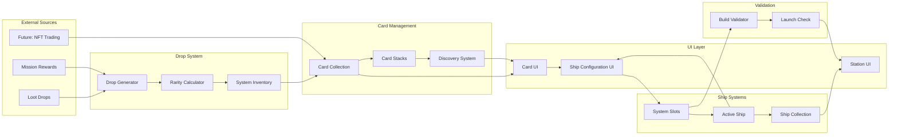
```mermaid
flowchart LR
    subgraph "External Sources"
        Missions[Mission Rewards]
        Loot[Loot Drops]
        Trading[Future: NFT Trading]
    end
    
    subgraph "Drop System"
        DropGen[Drop Generator]
        RarityCalc[Rarity Calculator]
        Inventory[System Inventory]
    end
    
    subgraph "Card Management"
        CardCollection[Card Collection]
        CardStacks[Card Stacks]
        Discovery[Discovery System]
    end
    
    subgraph "Ship Systems"
        ShipCollection[Ship Collection]
        ActiveShip[Active Ship]
        SystemSlots[System Slots]
    end
    
    subgraph "Validation"
        BuildValidator[Build Validator]
        LaunchCheck[Launch Check]
    end
    
    subgraph "UI Layer"
        CardUI[Card UI]
        ShipUI[Ship Configuration UI]
        StationUI[Station UI]
    end
    
    Missions --> DropGen
    Loot --> DropGen
    Trading --> CardCollection
    
    DropGen --> RarityCalc
    RarityCalc --> Inventory
    Inventory --> CardCollection
    
    CardCollection --> CardStacks
    CardStacks --> Discovery
    Discovery --> CardUI
    
    CardUI --> ShipUI
    ShipUI --> SystemSlots
    SystemSlots --> ActiveShip
    ActiveShip --> ShipCollection
    
    SystemSlots --> BuildValidator
    BuildValidator --> LaunchCheck
    LaunchCheck --> StationUI
    
    CardCollection --> CardUI
    ActiveShip --> ShipUI
    ShipCollection --> StationUI
```

## System Integration

### Component Integration Diagram

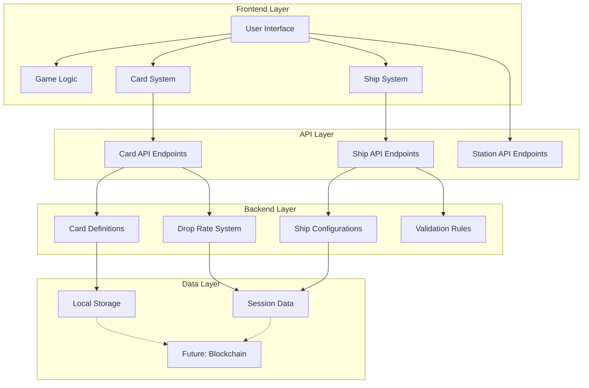
```mermaid
graph TB
    subgraph "Frontend Layer"
        UI[User Interface]
        GameLogic[Game Logic]
        CardSystem[Card System]
        ShipSystem[Ship System]
    end
    
    subgraph "API Layer"
        ShipAPI[Ship API Endpoints]
        CardAPI[Card API Endpoints]
        StationAPI[Station API Endpoints]
    end
    
    subgraph "Backend Layer"
        ShipConfigs[Ship Configurations]
        CardDefinitions[Card Definitions]
        DropRates[Drop Rate System]
        ValidationRules[Validation Rules]
    end
    
    subgraph "Data Layer"
        SessionData[Session Data]
        LocalStorage[Local Storage]
        FutureBlockchain[Future: Blockchain]
    end
    
    UI --> GameLogic
    UI --> CardSystem
    UI --> ShipSystem
    
    CardSystem --> CardAPI
    ShipSystem --> ShipAPI
    UI --> StationAPI
    
    ShipAPI --> ShipConfigs
    CardAPI --> CardDefinitions
    CardAPI --> DropRates
    ShipAPI --> ValidationRules
    
    ShipConfigs --> SessionData
    CardDefinitions --> LocalStorage
    DropRates --> SessionData
    
    LocalStorage -.-> FutureBlockchain
    SessionData -.-> FutureBlockchain
```

### Sequence Diagram - Card Purchase and Installation

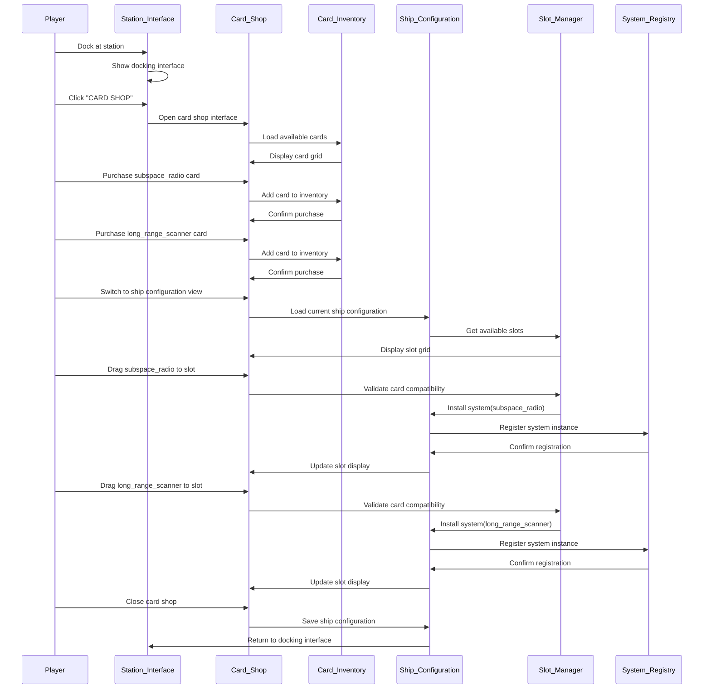
```mermaid
sequenceDiagram
    participant Player
    participant StationUI as Station_Interface
    participant CardShop as Card_Shop
    participant CardInventory as Card_Inventory
    participant Ship as Ship_Configuration
    participant SlotManager as Slot_Manager
    participant SystemRegistry as System_Registry

    Player->>StationUI: Dock at station
    StationUI->>StationUI: Show docking interface
    Player->>StationUI: Click "CARD SHOP"
    StationUI->>CardShop: Open card shop interface
    
    CardShop->>CardInventory: Load available cards
    CardInventory->>CardShop: Display card grid
    
    Player->>CardShop: Purchase subspace_radio card
    CardShop->>CardInventory: Add card to inventory
    CardInventory->>CardShop: Confirm purchase
    
    Player->>CardShop: Purchase long_range_scanner card
    CardShop->>CardInventory: Add card to inventory
    CardInventory->>CardShop: Confirm purchase
    
    Player->>CardShop: Switch to ship configuration view
    CardShop->>Ship: Load current ship configuration
    Ship->>SlotManager: Get available slots
    SlotManager->>CardShop: Display slot grid
    
    Player->>CardShop: Drag subspace_radio to slot
    CardShop->>SlotManager: Validate card compatibility
    SlotManager->>Ship: Install system(subspace_radio)
    Ship->>SystemRegistry: Register system instance
    SystemRegistry->>Ship: Confirm registration
    Ship->>CardShop: Update slot display
    
    Player->>CardShop: Drag long_range_scanner to slot
    CardShop->>SlotManager: Validate card compatibility
    SlotManager->>Ship: Install system(long_range_scanner)
    Ship->>SystemRegistry: Register system instance
    SystemRegistry->>Ship: Confirm registration
    Ship->>CardShop: Update slot display
    
    Player->>CardShop: Close card shop
    CardShop->>Ship: Save ship configuration
    Ship->>StationUI: Return to docking interface
```

### Sequence Diagram - Ship Launch and System Recognition

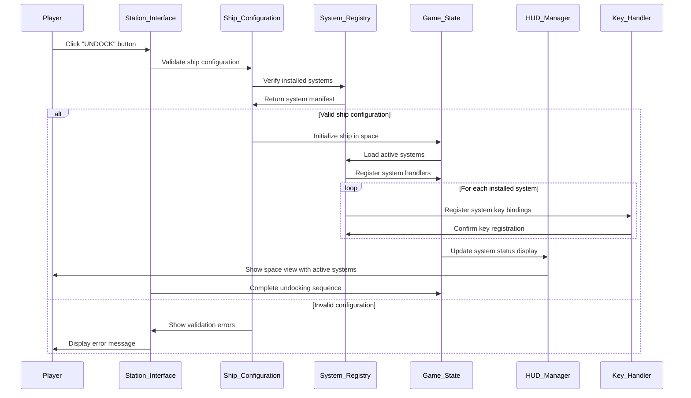
```mermaid
sequenceDiagram
    participant Player
    participant StationUI as Station_Interface
    participant Ship as Ship_Configuration
    participant SystemRegistry as System_Registry
    participant GameState as Game_State
    participant HUD as HUD_Manager
    participant KeyHandler as Key_Handler

    Player->>StationUI: Click "UNDOCK" button
    StationUI->>Ship: Validate ship configuration
    Ship->>SystemRegistry: Verify installed systems
    SystemRegistry->>Ship: Return system manifest
    
    alt Valid ship configuration
        Ship->>GameState: Initialize ship in space
        GameState->>SystemRegistry: Load active systems
        SystemRegistry->>GameState: Register system handlers
        
        loop For each installed system
            SystemRegistry->>KeyHandler: Register system key bindings
            KeyHandler->>SystemRegistry: Confirm key registration
        end
        
        GameState->>HUD: Update system status display
        HUD->>Player: Show space view with active systems
        StationUI->>GameState: Complete undocking sequence
    else Invalid configuration
        Ship->>StationUI: Show validation errors
        StationUI->>Player: Display error message
    end
```

### Sequence Diagram - System Activation (Success Path)

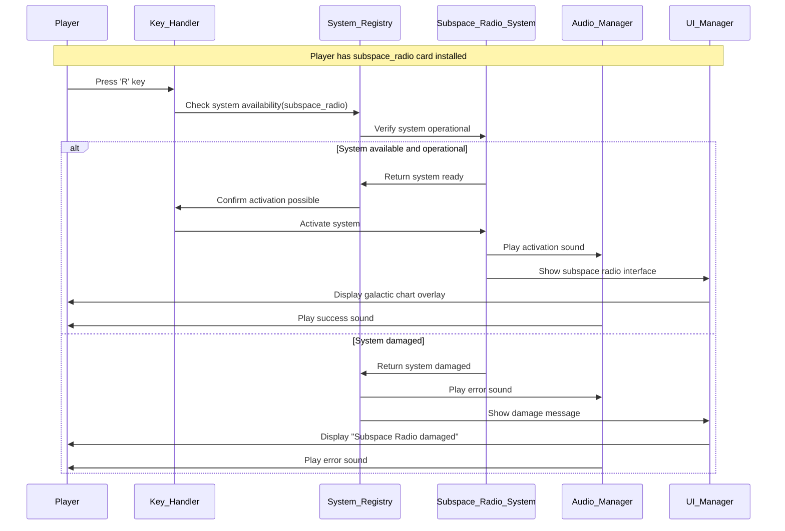
```mermaid
sequenceDiagram
    participant Player
    participant KeyHandler as Key_Handler
    participant SystemRegistry as System_Registry
    participant SubspaceRadio as Subspace_Radio_System
    participant AudioManager as Audio_Manager
    participant UI as UI_Manager

    Note over Player, UI: Player has subspace_radio card installed
    
    Player->>KeyHandler: Press 'R' key
    KeyHandler->>SystemRegistry: Check system availability(subspace_radio)
    SystemRegistry->>SubspaceRadio: Verify system operational
    
    alt System available and operational
        SubspaceRadio->>SystemRegistry: Return system ready
        SystemRegistry->>KeyHandler: Confirm activation possible
        KeyHandler->>SubspaceRadio: Activate system
        SubspaceRadio->>AudioManager: Play activation sound
        SubspaceRadio->>UI: Show subspace radio interface
        UI->>Player: Display galactic chart overlay
        AudioManager->>Player: Play success sound
    else System damaged
        SubspaceRadio->>SystemRegistry: Return system damaged
        SystemRegistry->>AudioManager: Play error sound
        SystemRegistry->>UI: Show damage message
        UI->>Player: Display "Subspace Radio damaged"
        AudioManager->>Player: Play error sound
    end
```

### Sequence Diagram - System Activation (Failure Path)

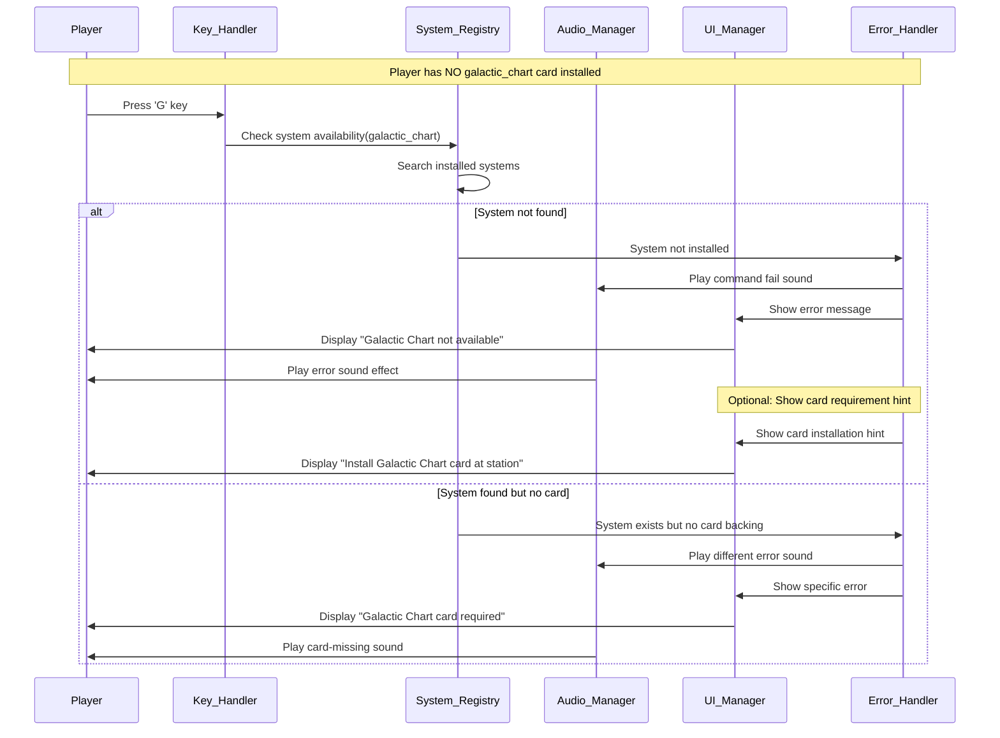
```mermaid
sequenceDiagram
    participant Player
    participant KeyHandler as Key_Handler
    participant SystemRegistry as System_Registry
    participant AudioManager as Audio_Manager
    participant UI as UI_Manager
    participant ErrorHandler as Error_Handler

    Note over Player, ErrorHandler: Player has NO galactic_chart card installed
    
    Player->>KeyHandler: Press 'G' key
    KeyHandler->>SystemRegistry: Check system availability(galactic_chart)
    SystemRegistry->>SystemRegistry: Search installed systems
    
    alt System not found
        SystemRegistry->>ErrorHandler: System not installed
        ErrorHandler->>AudioManager: Play command fail sound
        ErrorHandler->>UI: Show error message
        UI->>Player: Display "Galactic Chart not available"
        AudioManager->>Player: Play error sound effect
        
        Note over ErrorHandler, UI: Optional: Show card requirement hint
        ErrorHandler->>UI: Show card installation hint
        UI->>Player: Display "Install Galactic Chart card at station"
    else System found but no card
        SystemRegistry->>ErrorHandler: System exists but no card backing
        ErrorHandler->>AudioManager: Play different error sound
        ErrorHandler->>UI: Show specific error
        UI->>Player: Display "Galactic Chart card required"
        AudioManager->>Player: Play card-missing sound
    end
```

### Sequence Diagram - System State Synchronization Issues

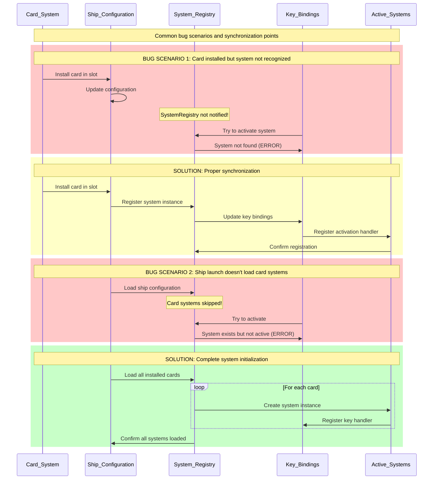
```mermaid
sequenceDiagram
    participant CardSystem as Card_System
    participant ShipConfig as Ship_Configuration
    participant SystemRegistry as System_Registry
    participant KeyBindings as Key_Bindings
    participant ActiveSystems as Active_Systems

    Note over CardSystem, ActiveSystems: Common bug scenarios and synchronization points
    
    rect rgb(255, 200, 200)
        Note over CardSystem, ActiveSystems: BUG SCENARIO 1: Card installed but system not recognized
        CardSystem->>ShipConfig: Install card in slot
        ShipConfig->>ShipConfig: Update configuration
        Note over SystemRegistry: SystemRegistry not notified!
        KeyBindings->>SystemRegistry: Try to activate system
        SystemRegistry->>KeyBindings: System not found (ERROR)
    end
    
    rect rgb(255, 255, 200)
        Note over CardSystem, ActiveSystems: SOLUTION: Proper synchronization
        CardSystem->>ShipConfig: Install card in slot
        ShipConfig->>SystemRegistry: Register system instance
        SystemRegistry->>KeyBindings: Update key bindings
        KeyBindings->>ActiveSystems: Register activation handler
        ActiveSystems->>SystemRegistry: Confirm registration
    end
    
    rect rgb(255, 200, 200)
        Note over CardSystem, ActiveSystems: BUG SCENARIO 2: Ship launch doesn't load card systems
        ShipConfig->>SystemRegistry: Load ship configuration
        Note over SystemRegistry: Card systems skipped!
        KeyBindings->>SystemRegistry: Try to activate
        SystemRegistry->>KeyBindings: System exists but not active (ERROR)
    end
    
    rect rgb(200, 255, 200)
        Note over CardSystem, ActiveSystems: SOLUTION: Complete system initialization
        ShipConfig->>SystemRegistry: Load all installed cards
        loop For each card
            SystemRegistry->>ActiveSystems: Create system instance
            ActiveSystems->>KeyBindings: Register key handler
        end
        SystemRegistry->>ShipConfig: Confirm all systems loaded
    end
```

## Damage Control System

### Sequence Diagram - Damage Control and Auto-Repair Flow

```mermaid
sequenceDiagram
    participant Player
    participant StarfieldManager as StarfieldManager
    participant DamageControl as SimplifiedDamageControl
    participant AutoRepair as AutoRepairSystem
    participant Ship as Ship
    participant System as System
    participant UI as DamageControlUI

    %% Opening Damage Control Interface
    Player->>StarfieldManager: Press 'D' key
    StarfieldManager->>DamageControl: show(ship, isDocked)
    DamageControl->>DamageControl: createInterface()
    DamageControl->>Ship: getStatus()
    Ship->>Ship: Calculate system status
    Ship-->>DamageControl: {systems: {...}, hull: {...}}
    DamageControl->>UI: Render systems grid
    DamageControl->>AutoRepair: getStatus()
    AutoRepair-->>DamageControl: {isActive, currentTarget, queue}
    DamageControl->>UI: Update interface display

    %% Setting System Priorities
    Player->>UI: Adjust priority slider
    UI->>DamageControl: setPriority(systemName, priority)
    DamageControl->>AutoRepair: setSystemPriority(systemName, priority)
    AutoRepair->>AutoRepair: updateRepairQueue()
    
    loop For each damaged system
        AutoRepair->>Ship: getSystem(systemName)
        Ship-->>AutoRepair: System instance
        AutoRepair->>System: healthPercentage
        System-->>AutoRepair: health value
    end
    
    AutoRepair->>AutoRepair: Sort queue by priority & health
    AutoRepair->>AutoRepair: Set currentTarget

    %% Activating Auto-Repair
    Player->>UI: Click "ACTIVATE" button
    UI->>DamageControl: toggleAutoRepair()
    DamageControl->>AutoRepair: toggle()
    AutoRepair->>AutoRepair: start()
    AutoRepair->>AutoRepair: updateRepairQueue()

    %% Auto-Repair Processing Loop
    loop Game Update Loop
        Ship->>AutoRepair: update(deltaTime)
        
        alt Auto-repair is active and has target
            AutoRepair->>Ship: getSystem(currentTarget)
            Ship-->>AutoRepair: System instance
            AutoRepair->>System: healthPercentage
            System-->>AutoRepair: current health
            
            alt System needs repair
                AutoRepair->>System: repair(repairAmount)
                System->>System: currentHealth += repairAmount
                System->>System: updateSystemState()
                System->>System: calculateEffectiveness()
                
                alt Health milestone reached
                    System->>AutoRepair: Log repair progress
                end
                
                alt System restored to functionality
                    System->>AutoRepair: Log restoration
                    System->>Ship: Notify system operational
                end
            else System fully repaired
                AutoRepair->>AutoRepair: updateRepairQueue()
                AutoRepair->>AutoRepair: Set next target
            end
        end
        
        %% Update UI periodically
        alt UI refresh interval
            DamageControl->>Ship: getStatus()
            Ship-->>DamageControl: Updated system status
            DamageControl->>AutoRepair: getStatus()
            AutoRepair-->>DamageControl: Updated repair status
            DamageControl->>UI: Update display
            UI->>UI: Refresh health bars
            UI->>UI: Update repair queue
            UI->>UI: Update current target
        end
    end

    %% Damage Infliction Flow
    rect rgb(255, 200, 200)
        Note over Player, System: System Damage Scenario
        Player->>Ship: applyDamage(amount, type)
        Ship->>Ship: Calculate hull damage
        Ship->>Ship: applySystemDamage()
        
        loop Random system damage
            Ship->>System: takeDamage(damageAmount)
            System->>System: currentHealth -= damage
            System->>System: updateSystemState()
            
            alt System becomes critical/disabled
                System->>System: handleStateEffects()
                System->>Ship: Notify state change
            end
        end
        
        Ship->>Ship: calculateTotalStats()
        Ship->>DamageControl: Trigger status update
    end

    %% Manual Repair Priority Changes
    rect rgb(200, 255, 200)
        Note over Player, AutoRepair: Priority Management
        Player->>UI: Adjust multiple priorities
        
        loop For each priority change
            UI->>DamageControl: setPriority(system, value)
            DamageControl->>AutoRepair: setSystemPriority(system, value)
        end
        
        AutoRepair->>AutoRepair: updateRepairQueue()
        AutoRepair->>AutoRepair: Reorder by priority
        AutoRepair->>DamageControl: Current target changed
        DamageControl->>UI: Update repair queue display
    end

    %% Closing Interface
    Player->>UI: Press 'D' or 'ESC'
    UI->>DamageControl: handleKeyPress()
    DamageControl->>DamageControl: hide()
    DamageControl->>DamageControl: Clear refresh timer
    DamageControl->>DamageControl: Remove event listeners
```

### Class Diagram - Damage Control Architecture

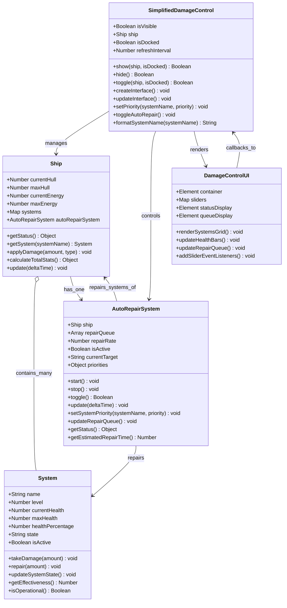
```mermaid
classDiagram
    class SimplifiedDamageControl {
        +Boolean isVisible
        +Ship ship
        +Boolean isDocked
        +Number refreshInterval
        +show(ship, isDocked) Boolean
        +hide() Boolean
        +toggle(ship, isDocked) Boolean
        +createInterface() void
        +updateInterface() void
        +setPriority(systemName, priority) void
        +toggleAutoRepair() void
        +formatSystemName(systemName) String
    }

    class AutoRepairSystem {
        +Ship ship
        +Array repairQueue
        +Number repairRate
        +Boolean isActive
        +String currentTarget
        +Object priorities
        +start() void
        +stop() void
        +toggle() Boolean
        +update(deltaTime) void
        +setSystemPriority(systemName, priority) void
        +updateRepairQueue() void
        +getStatus() Object
        +getEstimatedRepairTime() Number
    }

    class Ship {
        +Number currentHull
        +Number maxHull
        +Number currentEnergy
        +Number maxEnergy
        +Map systems
        +AutoRepairSystem autoRepairSystem
        +getStatus() Object
        +getSystem(systemName) System
        +applyDamage(amount, type) void
        +calculateTotalStats() Object
        +update(deltaTime) void
    }

    class System {
        +String name
        +Number level
        +Number currentHealth
        +Number maxHealth
        +Number healthPercentage
        +String state
        +Boolean isActive
        +takeDamage(amount) void
        +repair(amount) void
        +updateSystemState() void
        +getEffectiveness() Number
        +isOperational() Boolean
    }

    class DamageControlUI {
        +Element container
        +Map sliders
        +Element statusDisplay
        +Element queueDisplay
        +renderSystemsGrid() void
        +updateHealthBars() void
        +updateRepairQueue() void
        +addSliderEventListeners() void
    }

    SimplifiedDamageControl --> Ship : manages
    SimplifiedDamageControl --> AutoRepairSystem : controls
    SimplifiedDamageControl --> DamageControlUI : renders
    AutoRepairSystem --> Ship : repairs_systems_of
    Ship o-- System : contains_many
    Ship --> AutoRepairSystem : has_one
    AutoRepairSystem --> System : repairs
    DamageControlUI --> SimplifiedDamageControl : callbacks_to
```

### State Diagram - Auto-Repair System States

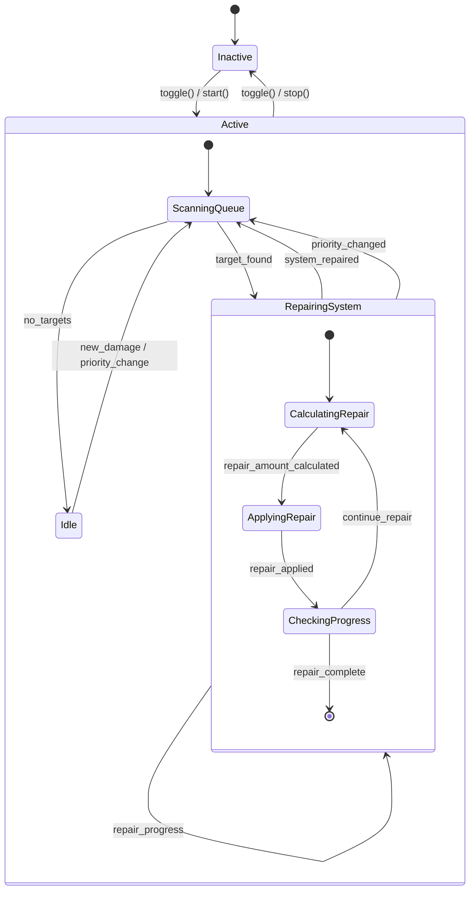
```mermaid
stateDiagram-v2
    [*] --> Inactive
    
    Inactive --> Active : toggle() / start()
    Active --> Inactive : toggle() / stop()
    
    state Active {
        [*] --> ScanningQueue
        ScanningQueue --> RepairingSystem : target_found
        ScanningQueue --> Idle : no_targets
        
        RepairingSystem --> ScanningQueue : system_repaired
        RepairingSystem --> ScanningQueue : priority_changed
        RepairingSystem --> RepairingSystem : repair_progress
        
        Idle --> ScanningQueue : new_damage / priority_change
    }
    
    state RepairingSystem {
        [*] --> CalculatingRepair
        CalculatingRepair --> ApplyingRepair : repair_amount_calculated
        ApplyingRepair --> CheckingProgress : repair_applied
        CheckingProgress --> CalculatingRepair : continue_repair
        CheckingProgress --> [*] : repair_complete
    }
```

This architecture documentation provides a comprehensive view of the NFT card collection system, showing how all components interact to create a cohesive gameplay experience while maintaining flexibility for future blockchain integration.

## Weapons System Architecture

### Class Diagram - Weapons System Core

```mermaid
classDiagram
    class WeaponSystemCore {
        +Ship ship
        +Array weaponSlots
        +Number activeSlotIndex
        +Number maxWeaponSlots
        +Boolean isAutofireOn
        +Boolean targetLockRequired
        +Object lockedTarget
        +WeaponHUD weaponHUD
        +selectPreviousWeapon() Boolean
        +selectNextWeapon() Boolean
        +fireActiveWeapon() Boolean
        +toggleAutofire() Boolean
        +updateAutofire(deltaTime) void
        +getActiveWeapon() WeaponSlot
        +installWeapon(slotIndex, weaponCard) Boolean
        +removeWeapon(slotIndex) Boolean
        +validateTargetLock() Boolean
        +setLockedTarget(target) void
        +setWeaponHUD(weaponHUD) void
        +updateWeaponDisplay() void
        +showWeaponSelectFeedback() void
    }

    class WeaponSlot {
        +Number slotIndex
        +WeaponCard equippedWeapon
        +Number cooldownTimer
        +Boolean isEmpty
        +fire(ship, target) Boolean
        +canFire() Boolean
        +isInCooldown() Boolean
        +getCooldownPercentage() Number
        +equipWeapon(weaponCard) Boolean
        +unequipWeapon() void
        +updateCooldown(deltaTime) void
        +getCooldownTimeRemaining() Number
        +getEquippedWeaponName() String
    }

    class WeaponCard {
        +String weaponId
        +String name
        +String weaponType
        +Number damage
        +Number cooldownTime
        +Number range
        +Boolean autofireEnabled
        +Number accuracy
        +Number energyCost
        +Number blastRadius
        +Boolean homingCapability
        +Boolean targetLockRequired
        +Number flightRange
        +Number turnRate
        +Object specialProperties
        +constructor(weaponData) void
        +fire(origin, target) Object
        +isValidTarget(target, distance) Boolean
        +getDisplayName() String
    }

    class ScanHitWeapon {
        +Number accuracy
        +Number energyCost
        +fire(origin, target) Object
        +calculateHitChance(distance) Number
        +applyInstantDamage(target) Number
        +validateEnergyConsumption(ship) Boolean
    }

    class SplashDamageWeapon {
        +Number blastRadius
        +Boolean homingCapability
        +Number flightRange
        +Number turnRate
        +fire(origin, target) Projectile
        +createProjectile(origin, target) Projectile
        +validateTargetLock(target) Boolean
        +calculateSplashDamage(distance) Number
    }

    class Projectile {
        +Object position
        +Object velocity
        +Object target
        +Number damage
        +Number blastRadius
        +Number flightRange
        +Boolean isHoming
        +Number turnRate
        +Boolean hasDetonated
        +Number distanceTraveled
        +Number launchTime
        +String weaponName
        +calculateInitialVelocity() void
        +update(deltaTime) void
        +updateHoming(target, deltaTime) void
        +checkCollision() Boolean
        +detonate() void
        +calculateTrajectory() Object
        +isInRange() Boolean
    }

    class WeaponHUD {
        +Element container
        +Element weaponSlotsDisplay
        +Element cooldownBars
        +Element autofireIndicator
        +Element targetLockIndicator
        +initializeWeaponSlots(slotCount) void
        +updateWeaponSlotsDisplay(weaponSlots, activeSlotIndex) void
        +updateActiveWeaponHighlight(slotIndex) void
        +updateCooldownDisplay(weaponSlots) void
        +updateAutofireStatus(isOn) void
        +updateTargetLockStatus(hasLock) void
        +showWeaponSelectFeedback(weaponName) void
        +showCooldownMessage(weaponName, timeRemaining) void
        +showTargetLockRequiredMessage() void
        +showMessage(message) void
    }

    class WeaponDefinitions {
        +getAllWeaponDefinitions() Object
        +createLaserCannon() WeaponCard
        +createPlasmaCannon() WeaponCard
        +createPulseCannon() WeaponCard
        +createPhaserArray() WeaponCard
        +createStandardMissile() WeaponCard
        +createHomingMissile() WeaponCard
        +createHeavyTorpedo() WeaponCard
        +createProximityMine() WeaponCard
    }

    class Ship {
        +WeaponSystemCore weaponSystem
        +initializeWeaponSystem() Promise
        +getWeaponSystem() WeaponSystemCore
        +consumeEnergy(amount) Boolean
        +hasEnergy(amount) Boolean
    }

    class StarfieldManager {
        +WeaponHUD weaponHUD
        +createWeaponHUD() void
        +connectWeaponHUDToSystem() void
        +bindKeyEvents() void
        +update(deltaTime) void
        +cycleTarget() void
    }

    WeaponSystemCore o-- WeaponSlot : manages_4_slots
    WeaponSlot --> WeaponCard : equipped_with
    WeaponCard <|-- ScanHitWeapon : extends
    WeaponCard <|-- SplashDamageWeapon : extends
    SplashDamageWeapon --> Projectile : creates
    WeaponSystemCore --> WeaponHUD : updates
    WeaponHUD --> WeaponSystemCore : displays_status
    WeaponDefinitions --> WeaponCard : creates
    Ship --> WeaponSystemCore : contains
    StarfieldManager --> WeaponHUD : manages
    StarfieldManager --> Ship : accesses_weapon_system
```

### Sequence Diagram - Manual Weapon Firing

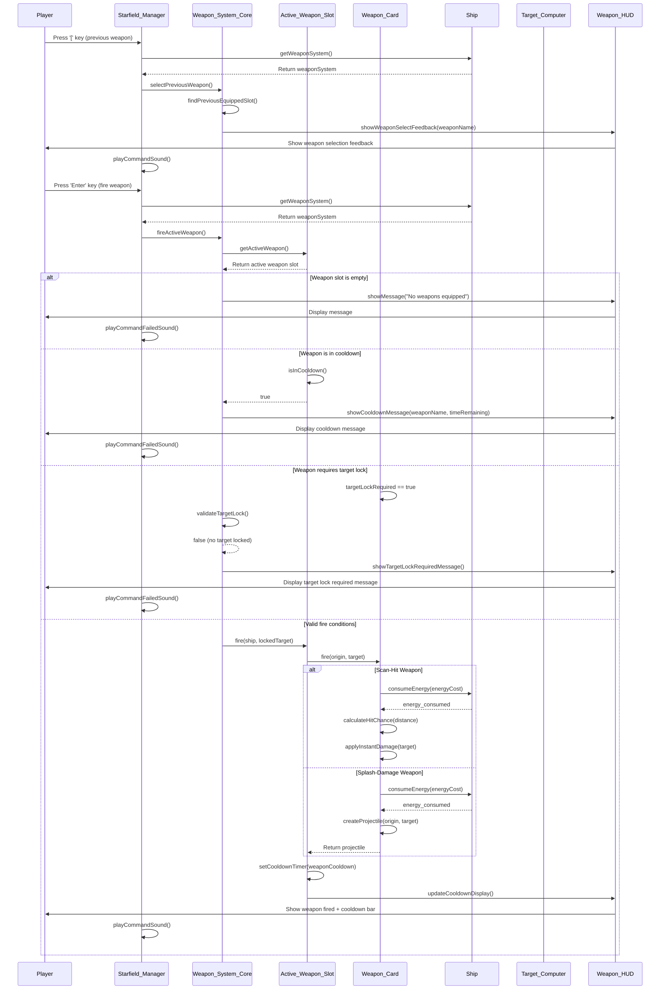
```mermaid
sequenceDiagram
    participant Player
    participant StarfieldManager as Starfield_Manager
    participant WeaponSystemCore as Weapon_System_Core
    participant WeaponSlot as Active_Weapon_Slot
    participant WeaponCard as Weapon_Card
    participant Ship
    participant TargetComputer as Target_Computer
    participant WeaponHUD as Weapon_HUD

    Player->>StarfieldManager: Press '[' key (previous weapon)
    StarfieldManager->>Ship: getWeaponSystem()
    Ship-->>StarfieldManager: Return weaponSystem
    StarfieldManager->>WeaponSystemCore: selectPreviousWeapon()
    WeaponSystemCore->>WeaponSystemCore: findPreviousEquippedSlot()
    WeaponSystemCore->>WeaponHUD: showWeaponSelectFeedback(weaponName)
    WeaponHUD->>Player: Show weapon selection feedback
    StarfieldManager->>StarfieldManager: playCommandSound()

    Player->>StarfieldManager: Press 'Enter' key (fire weapon)
    StarfieldManager->>Ship: getWeaponSystem()
    Ship-->>StarfieldManager: Return weaponSystem
    StarfieldManager->>WeaponSystemCore: fireActiveWeapon()
    WeaponSystemCore->>WeaponSlot: getActiveWeapon()
    WeaponSlot-->>WeaponSystemCore: Return active weapon slot

    alt Weapon slot is empty
        WeaponSystemCore->>WeaponHUD: showMessage("No weapons equipped")
        WeaponHUD->>Player: Display message
        StarfieldManager->>StarfieldManager: playCommandFailedSound()
    else Weapon is in cooldown
        WeaponSlot->>WeaponSlot: isInCooldown()
        WeaponSlot-->>WeaponSystemCore: true
        WeaponSystemCore->>WeaponHUD: showCooldownMessage(weaponName, timeRemaining)
        WeaponHUD->>Player: Display cooldown message
        StarfieldManager->>StarfieldManager: playCommandFailedSound()
    else Weapon requires target lock
        WeaponCard->>WeaponCard: targetLockRequired == true
        WeaponSystemCore->>WeaponSystemCore: validateTargetLock()
        WeaponSystemCore-->>WeaponSystemCore: false (no target locked)
        WeaponSystemCore->>WeaponHUD: showTargetLockRequiredMessage()
        WeaponHUD->>Player: Display target lock required message
        StarfieldManager->>StarfieldManager: playCommandFailedSound()
    else Valid fire conditions
        WeaponSystemCore->>WeaponSlot: fire(ship, lockedTarget)
        WeaponSlot->>WeaponCard: fire(origin, target)
        
        alt Scan-Hit Weapon
            WeaponCard->>Ship: consumeEnergy(energyCost)
            Ship-->>WeaponCard: energy_consumed
            WeaponCard->>WeaponCard: calculateHitChance(distance)
            WeaponCard->>WeaponCard: applyInstantDamage(target)
        else Splash-Damage Weapon
            WeaponCard->>Ship: consumeEnergy(energyCost)
            Ship-->>WeaponCard: energy_consumed
            WeaponCard->>WeaponCard: createProjectile(origin, target)
            WeaponCard-->>WeaponSlot: Return projectile
        end
        
        WeaponSlot->>WeaponSlot: setCooldownTimer(weaponCooldown)
        WeaponSlot->>WeaponHUD: updateCooldownDisplay()
        WeaponHUD->>Player: Show weapon fired + cooldown bar
        StarfieldManager->>StarfieldManager: playCommandSound()
    end
```

### Sequence Diagram - Autofire Mode Operation

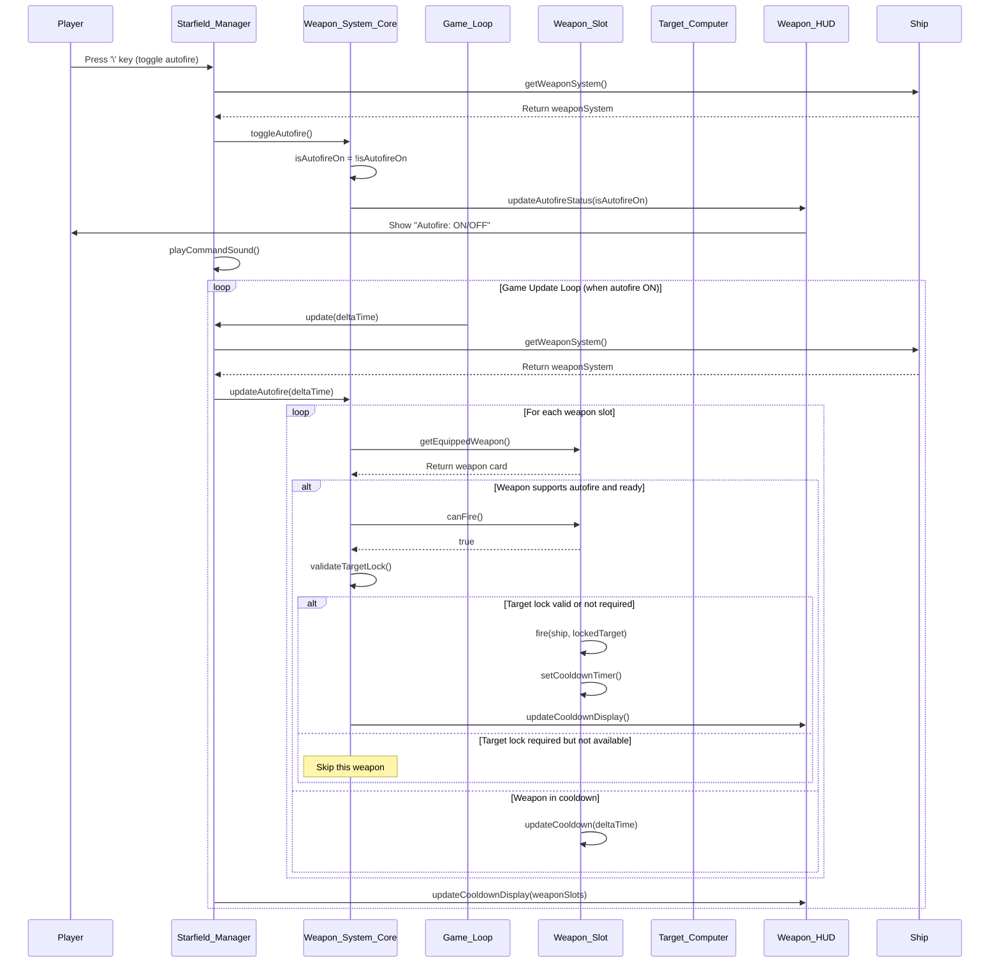
```mermaid
sequenceDiagram
    participant Player
    participant StarfieldManager as Starfield_Manager
    participant WeaponSystemCore as Weapon_System_Core
    participant GameLoop as Game_Loop
    participant WeaponSlot as Weapon_Slot
    participant TargetComputer as Target_Computer
    participant WeaponHUD as Weapon_HUD
    participant Ship

    Player->>StarfieldManager: Press '\' key (toggle autofire)
    StarfieldManager->>Ship: getWeaponSystem()
    Ship-->>StarfieldManager: Return weaponSystem
    StarfieldManager->>WeaponSystemCore: toggleAutofire()
    WeaponSystemCore->>WeaponSystemCore: isAutofireOn = !isAutofireOn
    WeaponSystemCore->>WeaponHUD: updateAutofireStatus(isAutofireOn)
    WeaponHUD->>Player: Show "Autofire: ON/OFF"
    StarfieldManager->>StarfieldManager: playCommandSound()

    loop Game Update Loop (when autofire ON)
        GameLoop->>StarfieldManager: update(deltaTime)
        StarfieldManager->>Ship: getWeaponSystem()
        Ship-->>StarfieldManager: Return weaponSystem
        StarfieldManager->>WeaponSystemCore: updateAutofire(deltaTime)

        loop For each weapon slot
            WeaponSystemCore->>WeaponSlot: getEquippedWeapon()
            WeaponSlot-->>WeaponSystemCore: Return weapon card

            alt Weapon supports autofire and ready
                WeaponSystemCore->>WeaponSlot: canFire()
                WeaponSlot-->>WeaponSystemCore: true
                WeaponSystemCore->>WeaponSystemCore: validateTargetLock()
                
                alt Target lock valid or not required
                    WeaponSlot->>WeaponSlot: fire(ship, lockedTarget)
                    WeaponSlot->>WeaponSlot: setCooldownTimer()
                    WeaponSystemCore->>WeaponHUD: updateCooldownDisplay()
                else Target lock required but not available
                    Note over WeaponSystemCore: Skip this weapon
                end
            else Weapon in cooldown
                WeaponSlot->>WeaponSlot: updateCooldown(deltaTime)
            end
        end
        
        StarfieldManager->>WeaponHUD: updateCooldownDisplay(weaponSlots)
    end
```

### Sequence Diagram - Ship Integration and Initialization

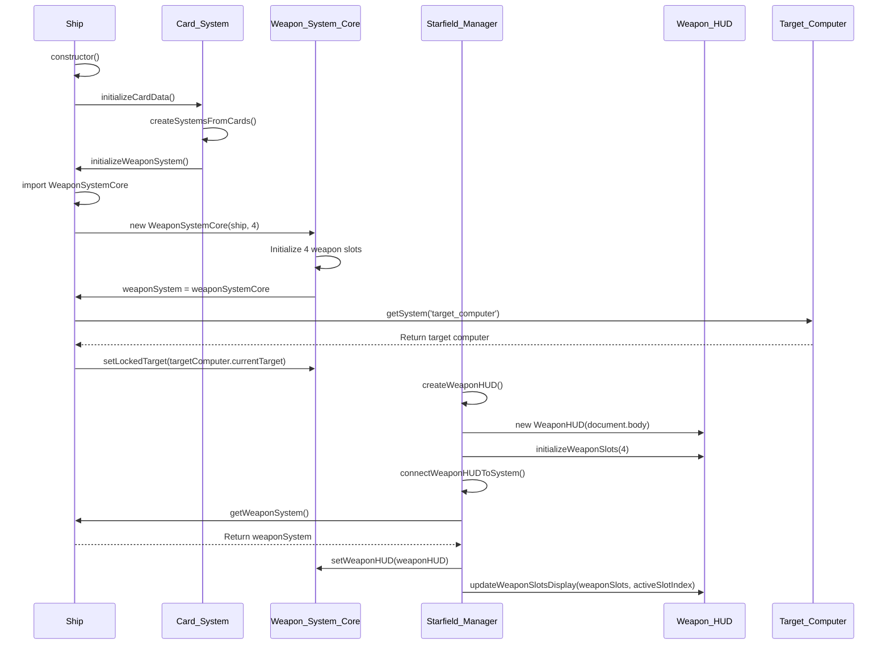
```mermaid
sequenceDiagram
    participant Ship
    participant CardSystemIntegration as Card_System
    participant WeaponSystemCore as Weapon_System_Core
    participant StarfieldManager as Starfield_Manager
    participant WeaponHUD as Weapon_HUD
    participant TargetComputer as Target_Computer

    Ship->>Ship: constructor()
    Ship->>CardSystemIntegration: initializeCardData()
    CardSystemIntegration->>CardSystemIntegration: createSystemsFromCards()
    CardSystemIntegration->>Ship: initializeWeaponSystem()
    
    Ship->>Ship: import WeaponSystemCore
    Ship->>WeaponSystemCore: new WeaponSystemCore(ship, 4)
    WeaponSystemCore->>WeaponSystemCore: Initialize 4 weapon slots
    WeaponSystemCore->>Ship: weaponSystem = weaponSystemCore
    
    Ship->>TargetComputer: getSystem('target_computer')
    TargetComputer-->>Ship: Return target computer
    Ship->>WeaponSystemCore: setLockedTarget(targetComputer.currentTarget)
    
    StarfieldManager->>StarfieldManager: createWeaponHUD()
    StarfieldManager->>WeaponHUD: new WeaponHUD(document.body)
    StarfieldManager->>WeaponHUD: initializeWeaponSlots(4)
    StarfieldManager->>StarfieldManager: connectWeaponHUDToSystem()
    
    StarfieldManager->>Ship: getWeaponSystem()
    Ship-->>StarfieldManager: Return weaponSystem
    StarfieldManager->>WeaponSystemCore: setWeaponHUD(weaponHUD)
    StarfieldManager->>WeaponHUD: updateWeaponSlotsDisplay(weaponSlots, activeSlotIndex)
```

### State Diagram - Weapon Slot States

```mermaid
stateDiagram-v2
    [*] --> Empty
    
    Empty --> Equipped : installWeapon()
    Equipped --> Empty : removeWeapon()
    
    state Equipped {
        [*] --> Ready
        Ready --> Firing : fire()
        Firing --> Cooldown : weapon_fired
        Cooldown --> Ready : cooldown_expired
        
        state Firing {
            [*] --> ValidatingEnergy
            ValidatingEnergy --> ValidatingTarget : energy_available
            ValidatingEnergy --> [*] : insufficient_energy
            ValidatingTarget --> CheckingCooldown : target_valid_or_not_required
            ValidatingTarget --> [*] : target_invalid_and_required
            CheckingCooldown --> ExecutingFire : not_in_cooldown
            CheckingCooldown --> [*] : in_cooldown
            ExecutingFire --> [*] : fire_complete
        }
        
        state Cooldown {
            [*] --> CoolingDown
            CoolingDown --> CoolingDown : updateCooldown(deltaTime)
            CoolingDown --> [*] : cooldownTimer <= 0
        }
    }
```

### Activity Diagram - Target Lock Integration Flow

```mermaid
flowchart TD
    Start([Player Cycles Target]) --> GetTargetComputer{Target Computer Available?}
    GetTargetComputer -->|No| End([No Weapon Target Updates])
    GetTargetComputer -->|Yes| CycleTarget[Cycle to Next Target]
    
    CycleTarget --> UpdateTargetComputer[Update Target Computer]
    UpdateTargetComputer --> GetShip{Ship Available?}
    GetShip -->|No| End
    GetShip -->|Yes| GetWeaponSystem{Weapon System Available?}
    
    GetWeaponSystem -->|No| End
    GetWeaponSystem -->|Yes| SetLockedTarget[Set Locked Target in Weapon System]
    SetLockedTarget --> ValidateWeapons[Validate Weapons for Autofire]
    
    ValidateWeapons --> CheckSplashWeapons{Splash-Damage Weapons Equipped?}
    CheckSplashWeapons -->|Yes| EnableTargetLock[Enable Target Lock Requirements]
    CheckSplashWeapons -->|No| DisableTargetLock[No Target Lock Requirements]
    
    EnableTargetLock --> UpdateHUD[Update Weapon HUD Target Status]
    DisableTargetLock --> UpdateHUD
    UpdateHUD --> End
```

### Component Diagram - Weapons System Integration

```mermaid
graph TB
    subgraph "Weapons System Core"
        WeaponSystemCore[Weapon System Core]
        WeaponSlots[4 Weapon Slots Array]
        WeaponCards[Weapon Cards]
        WeaponDefinitions[Weapon Definitions]
    end
    
    subgraph "UI Components"
        WeaponHUD[Weapon HUD]
        CardInventoryUI[Card Inventory UI]
        DragDropHandler[Drag & Drop Handler]
    end
    
    subgraph "Input System"
        StarfieldManager[Starfield Manager]
        KeyHandler[Key Handler - bindKeyEvents()]
        WeaponControls[Weapon Controls]
    end
    
    subgraph "Game Systems"
        Ship[Ship Class]
        TargetComputer[Target Computer]
        EnergySystem[Ship Energy System]
        ProjectileManager[Projectile Manager]
    end
    
    subgraph "Projectile Types"
        ScanHitProjectile[Scan-Hit Projectiles]
        SplashProjectile[Splash-Damage Projectiles]
        HomingMissile[Homing Missiles]
        Projectile[Projectile Physics]
    end
    
    WeaponSystemCore --> WeaponSlots
    WeaponSlots --> WeaponCards
    WeaponSystemCore --> WeaponHUD
    WeaponSystemCore --> ProjectileManager
    WeaponDefinitions --> WeaponCards
    
    CardInventoryUI --> DragDropHandler
    DragDropHandler --> WeaponSystemCore
    
    StarfieldManager --> KeyHandler
    KeyHandler --> WeaponControls
    WeaponControls --> WeaponSystemCore
    
    Ship --> WeaponSystemCore
    WeaponSystemCore --> TargetComputer
    WeaponSystemCore --> EnergySystem
    
    ProjectileManager --> ScanHitProjectile
    ProjectileManager --> SplashProjectile
    ProjectileManager --> HomingMissile
    ProjectileManager --> Projectile
    
    StarfieldManager --> WeaponHUD
    StarfieldManager --> Ship
```

### Data Flow Diagram - Weapon Firing Process

```mermaid
flowchart LR
    subgraph "Input Processing"
        PlayerInput[Player Input]
        StarfieldManager[Starfield Manager]
        KeyMapping[Key Mapping]
    end
    
    subgraph "Weapon Selection"
        WeaponCycling[Weapon Cycling]
        ActiveWeapon[Active Weapon]
        SlotValidation[Slot Validation]
    end
    
    subgraph "Fire Control"
        FireCommand[Fire Command]
        EnergyCheck[Energy Check]
        CooldownCheck[Cooldown Check]
        TargetValidation[Target Validation]
    end
    
    subgraph "Weapon Execution"
        WeaponType[Weapon Type Check]
        ScanHit[Scan-Hit Execution]
        SplashDamage[Splash-Damage Execution]
    end
    
    subgraph "Projectile Management"
        ProjectileSpawn[Projectile Spawn]
        ProjectileUpdate[Projectile Update]
        CollisionDetection[Collision Detection]
        DamageApplication[Damage Application]
    end
    
    subgraph "Feedback Systems"
        HUDUpdate[HUD Update]
        AudioFeedback[Audio Feedback]
        VisualEffects[Visual Effects]
    end
    
    PlayerInput --> StarfieldManager
    StarfieldManager --> KeyMapping
    KeyMapping --> WeaponCycling
    KeyMapping --> FireCommand
    
    WeaponCycling --> ActiveWeapon
    ActiveWeapon --> SlotValidation
    
    FireCommand --> EnergyCheck
    EnergyCheck --> CooldownCheck
    CooldownCheck --> TargetValidation
    TargetValidation --> WeaponType
    
    WeaponType --> ScanHit
    WeaponType --> SplashDamage
    
    SplashDamage --> ProjectileSpawn
    ProjectileSpawn --> ProjectileUpdate
    ProjectileUpdate --> CollisionDetection
    CollisionDetection --> DamageApplication
    
    ScanHit --> DamageApplication
    DamageApplication --> HUDUpdate
    DamageApplication --> AudioFeedback
    DamageApplication --> VisualEffects
``` 