# System Architecture Documentation ✅ IMPLEMENTED

## Overview
This document contains UML diagrams illustrating the architecture of the Planetz NFT card collection spaceship system.

**✅ IMPLEMENTATION STATUS**: All core systems fully implemented and integrated into the main game.

## NFT Card Collection System ✅ IMPLEMENTED

### Class Diagram - Core Card System


### Sequence Diagram - Card Discovery and Upgrade ✅ IMPLEMENTED


## Ship Management System ✅ IMPLEMENTED

### Class Diagram - Ship and System Architecture


### State Diagram - Ship Configuration States ✅ UPDATED


## User Interface Architecture

### Component Diagram - UI System


### Activity Diagram - Card Installation Flow


## Data Flow Architecture

### Data Flow Diagram - Card Collection to Ship Configuration


## UPDATED: Docking and Launch System Architecture 🚀

### Updated Launch/Undocking Sequence ✅ CORRECTED

```mermaid
sequenceDiagram
    participant Player
    participant DockingInterface as Docking Interface
    participant StarfieldManager as Starfield Manager
    participant Ship
    participant TargetingComputer as Targeting Computer
    participant WeaponHUD as Weapon HUD
    participant PowerSystems as Power Systems

    Note over Player,PowerSystems: ✅ CORRECTED: Unified Ship Initialization Pattern

    Player->>DockingInterface: Click LAUNCH
    DockingInterface->>StarfieldManager: requestUndock()
    
    Note over StarfieldManager: Check undock cooldown
    alt Cooldown Active
        StarfieldManager-->>DockingInterface: Reject (cooldown message)
        DockingInterface-->>Player: Show cooldown warning
    else Cooldown Expired
        Note over StarfieldManager,PowerSystems: Phase 1: System Shutdown
        StarfieldManager->>Ship: shutdownAllSystems()
        Ship->>PowerSystems: stopAllSystemPower()
        Ship->>TargetingComputer: shutdown()
        Ship->>WeaponHUD: clearAllWeapons()
        
        Note over StarfieldManager,PowerSystems: Phase 2: Unified Reinitialization
        StarfieldManager->>Ship: initializeShipSystems()
        
        Note over Ship: ✅ UNIFIED METHOD (used by all paths)
        Ship->>Ship: clearSystemReferences()
        Ship->>Ship: loadCurrentCardConfiguration()
        Ship->>Ship: initializeCoreSystemInstances()
        Ship->>TargetingComputer: initialize(availableWeapons)
        Ship->>WeaponHUD: registerAllWeapons(weaponList)
        Ship->>PowerSystems: registerAllSystems(systemList)
        Ship->>Ship: setupSystemKeybindings()
        Ship->>Ship: validateSystemIntegrity()
        
        Note over StarfieldManager,PowerSystems: Phase 3: Game State Transition
        StarfieldManager->>StarfieldManager: hideStationView()
        StarfieldManager->>StarfieldManager: showStarfieldView()
        StarfieldManager->>StarfieldManager: enablePlayerControls()
        StarfieldManager->>StarfieldManager: startUndockCooldown(30s)
        
        StarfieldManager-->>DockingInterface: Success
        DockingInterface->>DockingInterface: hide()
        DockingInterface-->>Player: Launch successful
    end
```



### **🔄 Unified Ship Initialization Across All Code Paths**

All ship initialization scenarios now use the same `initializeShipSystems()` method:

#### **Code Path 1: Game Startup**

```mermaid
sequenceDiagram
    participant App
    participant ViewManager
    participant Ship
    
    App->>ViewManager: new ViewManager()
    ViewManager->>Ship: new Ship('starter_ship')
    ViewManager->>Ship: initializeShipSystems() ✅ UNIFIED
    Ship-->>ViewManager: Systems ready
```


#### **Code Path 2: Ship Loading from Saved State**

```mermaid
sequenceDiagram
    participant Player
    participant CardInventoryUI
    participant Ship
    
    Player->>CardInventoryUI: Load saved game
    CardInventoryUI->>CardInventoryUI: loadShipConfiguration(savedShipType)
    CardInventoryUI->>Ship: initializeShipSystems(savedConfiguration) ✅ UNIFIED
    Ship-->>CardInventoryUI: Systems ready
```


#### **Code Path 3: Ship Switching at Station**

```mermaid
sequenceDiagram
    participant Player
    participant CardInventoryUI
    participant Ship
    
    Player->>CardInventoryUI: Switch to different ship
    CardInventoryUI->>CardInventoryUI: switchShip(newShipType)
    CardInventoryUI->>Ship: initializeShipSystems(newConfiguration) ✅ UNIFIED
    Ship-->>CardInventoryUI: Systems ready
```


#### **Code Path 4: Launch from Station** 

```mermaid
sequenceDiagram
    participant Player
    participant StarfieldManager
    participant Ship
    
    Player->>StarfieldManager: Launch from station
    StarfieldManager->>Ship: shutdownAllSystems()
    StarfieldManager->>Ship: initializeShipSystems() ✅ UNIFIED
    Ship-->>StarfieldManager: Systems ready
```


## Damage Control System

### Sequence Diagram - Damage Control and Auto-Repair Flow

```mermaid
sequenceDiagram
    participant Player
    participant StarfieldManager as StarfieldManager
    participant DamageControl as SimplifiedDamageControl
    participant AutoRepair as AutoRepairSystem
    participant Ship as Ship
    participant System as System
    participant UI as DamageControlUI

    %% Opening Damage Control Interface
    Player->>StarfieldManager: Press 'D' key
    StarfieldManager->>DamageControl: show(ship, isDocked)
    DamageControl->>DamageControl: createInterface()
    DamageControl->>Ship: getStatus()
    Ship->>Ship: Calculate system status
    Ship-->>DamageControl: {systems: {...}, hull: {...}}
    DamageControl->>UI: Render systems grid
    DamageControl->>AutoRepair: getStatus()
    AutoRepair-->>DamageControl: {isActive, currentTarget, queue}
    DamageControl->>UI: Update interface display

    %% Setting System Priorities
    Player->>UI: Adjust priority slider
    UI->>DamageControl: setPriority(systemName, priority)
    DamageControl->>AutoRepair: setSystemPriority(systemName, priority)
    AutoRepair->>AutoRepair: updateRepairQueue()
    
    loop For each damaged system
        AutoRepair->>Ship: getSystem(systemName)
        Ship-->>AutoRepair: System instance
        AutoRepair->>System: healthPercentage
        System-->>AutoRepair: health value
    end
    
    AutoRepair->>AutoRepair: Sort queue by priority & health
    AutoRepair->>AutoRepair: Set currentTarget

    %% Activating Auto-Repair
    Player->>UI: Click "ACTIVATE" button
    UI->>DamageControl: toggleAutoRepair()
    DamageControl->>AutoRepair: toggle()
    AutoRepair->>AutoRepair: start()
    AutoRepair->>AutoRepair: updateRepairQueue()
        
        loop For each priority change
            UI->>DamageControl: setPriority(system, value)
            DamageControl->>AutoRepair: setSystemPriority(system, value)
        end
        
        AutoRepair->>AutoRepair: updateRepairQueue()
        AutoRepair->>AutoRepair: Reorder by priority
        AutoRepair->>DamageControl: Current target changed
        DamageControl->>UI: Update repair queue display
    end

    %% Closing Interface
    Player->>UI: Press 'D' or 'ESC'
    UI->>DamageControl: handleKeyPress()
    DamageControl->>DamageControl: hide()
    DamageControl->>DamageControl: Clear refresh timer
    DamageControl->>DamageControl: Remove event listeners
```

### Class Diagram - Damage Control Architecture


### State Diagram - Auto-Repair System States


This architecture documentation provides a comprehensive view of the NFT card collection system, showing how all components interact to create a cohesive gameplay experience while maintaining flexibility for future blockchain integration.

## Weapons System Architecture

### Class Diagram - Weapons System Core

