# TAB Targeting with Star Charts Open - Sequence Diagram

## Current Implementation Analysis

Based on debug logs, here's the detailed sequence of events when a user presses TAB while Star Charts is open:


## Problem Analysis

### What's Working ✅
1. **TAB Detection**: StarfieldManager correctly detects TAB key press
2. **System Checks**: All validation checks pass (not docked, target computer enabled, etc.)
3. **Target Cycling**: TargetComputerManager successfully cycles through targets
4. **Target Updates**: New target is set and HUD is updated
5. **Notification Call**: `notifyStarChartsOfTargetChange()` is called

### What's Broken ❌
1. **Star Charts Communication**: `notifyStarChartsOfTargetChange()` is not successfully reaching Star Charts
2. **No Star Charts Debug Messages**: Expected messages like:
   - `🎯 notifyStarChartsOfTargetChange() called`
   - `🎯 starChartsManager exists: true/false`
   - `🎯 starChartsManager.ui.isVisible: true/false`
   - `🎯 BEFORE Star Charts render`
   - `🎯 FRAME render`

### Root Cause Hypothesis
The `notifyStarChartsOfTargetChange()` method is being called but:
1. **StarChartsManager not found**: `this.viewManager?.navigationSystemManager?.starChartsManager` returns null/undefined
2. **StarChartsUI not available**: `starChartsManager.ui` doesn't exist
3. **Star Charts not visible**: `starChartsManager.ui.isVisible` is false
4. **Method execution failure**: The method throws an error or exits early

## Comparison: TAB vs Click Targeting

### TAB Targeting Path (Current Issue)
```
TAB → StarfieldManager → TargetComputerManager.cycleTarget() → notifyStarChartsOfTargetChange() → ❌ FAILS
```

### Click Targeting Path (Working)
```
Click → StarChartsManager.selectObjectById() → TargetComputerManager.setTargetById() → updateTargetDisplay() → notifyStarChartsOfTargetChange() → ✅ WORKS
```

## Next Steps
1. **Debug `notifyStarChartsOfTargetChange()`**: Add logging to see why it's not reaching Star Charts
2. **Check StarChartsManager availability**: Verify the navigation path to StarChartsManager
3. **Verify Star Charts visibility**: Ensure `isVisible` is true when Star Charts is open
4. **Test notification method**: Ensure the method can actually trigger Star Charts render

## Expected Fix
Once the communication issue is resolved, the sequence should be:

```mermaid
sequenceDiagram
    participant TargetComputerManager
    participant StarChartsManager
    participant StarChartsUI

    TargetComputerManager->>TargetComputerManager: notifyStarChartsOfTargetChange()
    TargetComputerManager->>StarChartsManager: Check if available and visible
    StarChartsManager->>TargetComputerManager: ✅ Available and visible
    TargetComputerManager->>StarChartsUI: requestAnimationFrame(() => render())
    StarChartsUI->>StarChartsUI: Clear existing blinking classes
    StarChartsUI->>StarChartsUI: Re-render all objects
    StarChartsUI->>StarChartsUI: Apply blinking to current target
    
    Note over StarChartsUI: ✅ Star Charts blinking updated
```


