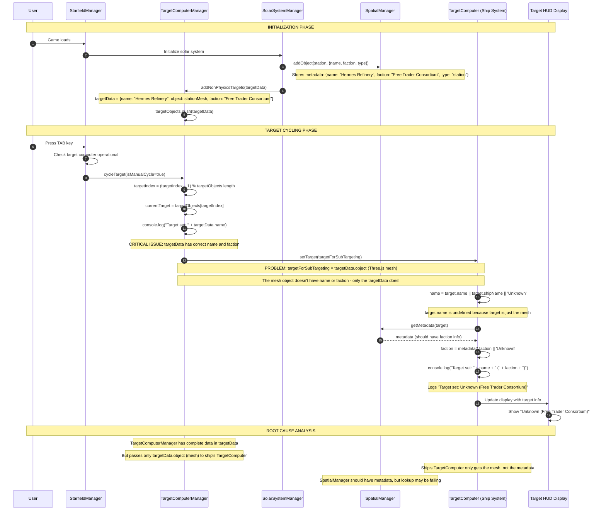

# Target Computer System Flow - Complete UML Sequence Diagram

This diagram maps out the entire target computer system from user input to display, showing where faction information is getting lost.



## Root Cause Analysis

The issue is in **TargetComputerManager.js** line 1452-1453:

```javascript
const targetForSubTargeting = isEnemyShip ? targetData.ship : (targetData?.object || targetData);
targetComputer.setTarget(targetForSubTargeting);
```

### The Problem:
1. **TargetComputerManager** has complete target information in `targetData` including name and faction
2. But it passes only `targetData.object` (the Three.js mesh) to the ship's **TargetComputer**
3. The mesh object doesn't have the name or faction information
4. The ship's **TargetComputer** tries to get the name from `target.name` but it's undefined
5. Even though **SpatialManager** should have the metadata, the lookup isn't working correctly

### The Fix:
Instead of passing just the mesh object, we need to ensure the target object passed to the ship's TargetComputer has the necessary properties (name, faction) either:
1. By copying them to the mesh object, or
2. By passing a wrapper object that includes both the mesh and metadata, or  
3. By fixing the SpatialManager metadata lookup

## Data Flow Issues:

1. **SolarSystemManager** → **SpatialManager**: ✅ Correct (stores complete metadata)
2. **SolarSystemManager** → **TargetComputerManager**: ✅ Correct (has complete targetData)
3. **TargetComputerManager** → **Ship TargetComputer**: ❌ **BROKEN** (passes only mesh object)
4. **Ship TargetComputer** → **SpatialManager**: ❌ **FAILING** (metadata lookup not working)
5. **Ship TargetComputer** → **HUD Display**: ❌ **BROKEN** (shows "Unknown" name)

The faction information is actually preserved and shows correctly because the SpatialManager lookup for faction works, but the name lookup fails because the mesh object doesn't have a `name` property.
