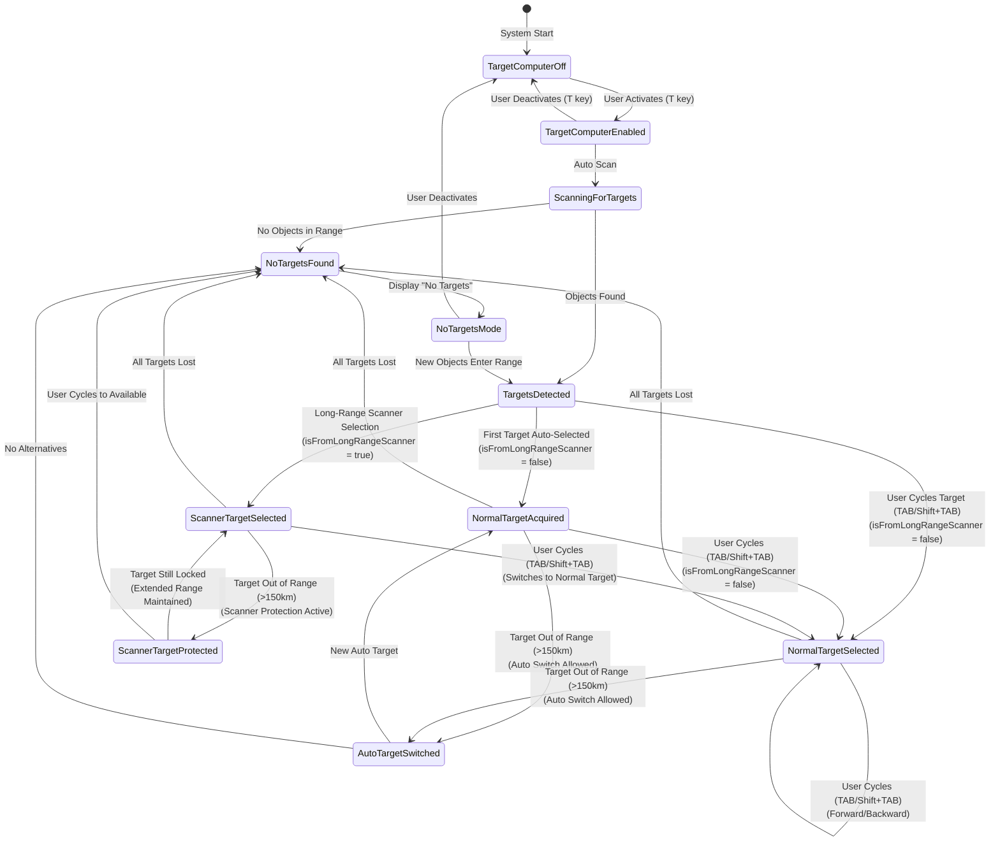
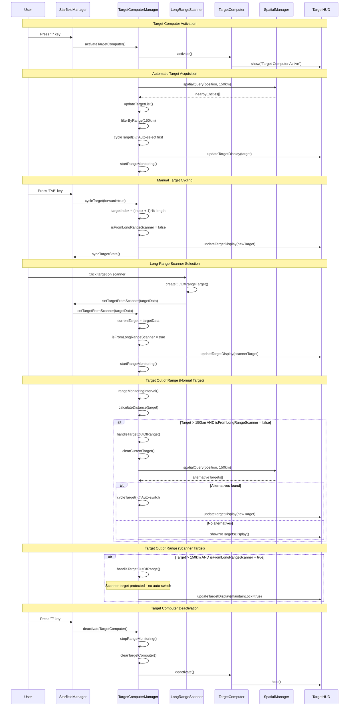

# Target Selection System

## Overview

The Target Selection System in Planetz provides intelligent targeting capabilities with automatic target acquisition and bidirectional manual cycling. The system includes special protection for targets selected from the long-range scanner, while automatically switching between targets that go out of range during normal operation. Recent enhancements include persistent target caching, improved synchronization, and robust error handling for edge cases.

## System Architecture



## Sequence Diagram

The following sequence diagram shows the interactions between components during target selection operations:



## Core Components

### 1. Target Computer Manager (`TargetComputerManager.js`)
- **Primary Class**: Manages all targeting functionality
- **State Tracking**: Maintains target selection state and user preferences
- **Range Monitoring**: Continuously monitors target distances
- **Direction Indicators**: Shows off-screen target direction arrows
- **Persistent Cache**: Map-based system for maintaining target state across operations
- **Robust Matching**: Multi-criteria target identification and synchronization

### 2. Target Selection States

#### Scanner Target Protection
- **`isFromLongRangeScanner`**: Boolean flag tracking targets from long-range scanner
- **`true`**: Target was selected from long-range scanner - Protected from auto-switching when out of range
- **`false`**: Target was acquired normally - Can be auto-switched when out of range

#### Range Filtering
- **Target Computer Level 3**: 150km detection range
- **Spatial Query**: Physics-based spatial queries with distance validation
- **Double Filtering**: Both spatial query and distance calculation ensure range compliance

#### Persistent Target Cache System
- **Map-Based Caching**: Maintains target references across target list updates
- **Index Synchronization**: Prevents target index mismatches after sorting operations
- **State Preservation**: Ensures target selection state persists through list changes
- **Memory Management**: Efficient cleanup of stale cache entries

## Use Cases

### 1. 🎯 **Initial Target Acquisition**

**Scenario**: Player activates target computer in area with objects
- **Trigger**: User presses `T` key to activate targeting
- **Behavior**: System automatically selects nearest target within 150km range
- **State**: `isFromLongRangeScanner = false`
- **Result**: Target can be automatically switched if it goes out of range

```javascript
// Example: Auto-acquisition on startup
this.cycleTarget(); // Auto-select nearest target
this.isFromLongRangeScanner = false;
```

### 2. 🔄 **Manual Target Cycling (Forward)**

**Scenario**: Player wants to select the next target in the list
- **Trigger**: User presses `TAB` key to cycle targets forward
- **Behavior**: Cycles through available targets in ascending order (within 150km range)
- **State**: `isFromLongRangeScanner = false`
- **Result**: Target can be automatically switched if it goes out of range

```javascript
// Example: Manual forward target selection
this.cycleTarget(true); // forward=true
this.isFromLongRangeScanner = false;
```

### 2b. 🔄 **Manual Target Cycling (Backward)**

**Scenario**: Player wants to select the previous target in the list
- **Trigger**: User presses `Shift+TAB` key to cycle targets backward
- **Behavior**: Cycles through available targets in descending order (within 150km range)
- **State**: `isFromLongRangeScanner = false`
- **Result**: Target can be automatically switched if it goes out of range

```javascript
// Example: Manual backward target selection
this.cycleTarget(false); // forward=false
this.isFromLongRangeScanner = false;
```

### 3. 📡 **Long-Range Scanner Target Protection**

**Scenario**: Target selected from long-range scanner goes out of normal range
- **Condition**: `isFromLongRangeScanner = true` AND target distance > 150km
- **Behavior**: Target lock is maintained, no automatic switching
- **Message**: "Current target out of range but was selected from long-range scanner - maintaining target lock"
- **Extended Range**: Scanner provides targeting data beyond normal target computer range

```javascript
if (this.isFromLongRangeScanner) {
    console.log(`🎯 Current target out of range but was selected from long-range scanner - maintaining target lock`);
    return; // Don't auto-switch scanner targets
}
```

### 4. 🔄 **Automatic Target Switching**

**Scenario**: Normal target goes out of range
- **Condition**: `isFromLongRangeScanner = false` AND target distance > 150km
- **Behavior**: Shows "No targets in range" for 1 second, then switches to nearest available target
- **Message**: "Current target out of range - switching to nearest available target"
- **UX Enhancement**: Provides visual feedback before auto-switching

```javascript
// Show temporary "No targets in range" message for 1 second
this.showTemporaryNoTargetsMessage(() => {
    console.log(`🎯 Auto-selecting nearest target after delay`);
    this.cycleTarget(); // Auto-switch to nearest target after delay
}, 1000); // 1 second delay
```

### 5. 📡 **No Targets Monitoring**

**Scenario**: No targets in range, system monitors for new objects
- **Trigger**: All targets move out of range or are destroyed
- **Behavior**: Shows "No Targets in Range" display
- **Monitoring**: Checks every 2 seconds for new targets
- **Auto-Recovery**: Automatically acquires new targets when they appear

```javascript
// Monitoring interval for new targets
this.noTargetsInterval = setInterval(() => {
    this.updateTargetList();
    if (this.targetObjects.length > 0) {
        this.cycleTarget(false); // Auto-acquire
    }
}, 2000);
```

### 6. 🧭 **Direction Indicators**

**Scenario**: Target is off-screen or behind camera
- **Trigger**: Target screen position outside viewport bounds
- **Thresholds**: 
  - Show arrows: `|screenPos.x| > 0.95` OR `|screenPos.y| > 0.95` OR `screenPos.z > 1.0`
  - Hide arrows: `|screenPos.x| < 0.90` AND `|screenPos.y| < 0.90` AND `screenPos.z < 1.0`
- **Hysteresis**: Prevents flickering at screen edges
- **Visual**: Colored arrows at screen edges pointing toward target

### 7. 🎮 **User Controls**

| Key | Action | Result |
|-----|--------|--------|
| `T` | Toggle Target Computer | Activate/Deactivate entire system |
| `TAB` | Cycle Targets (Next) | Manual target selection forward (within 150km range) |
| `Shift+TAB` | Cycle Targets (Previous) | Manual target selection backward (within 150km range) |
| `N` | Toggle Effects | Toggle video tint and scan lines (comms HUD) |

### 8. 🔧 **System State Management**

#### Target Computer Activation
- **Clean State**: All flags reset to default values
- **Auto-Scan**: Immediately scans for available targets
- **Initial Selection**: Auto-selects nearest target if available

#### Target Computer Deactivation
- **State Reset**: All targeting data cleared
- **Flag Reset**: `isManuallySelectedTarget = false`
- **UI Cleanup**: All visual elements hidden

#### Target Destruction/Loss
- **Manual Targets**: Maintained until user cycles or all targets lost
- **Auto Targets**: Automatically switch to alternatives
- **Clean Transitions**: Proper state management during target changes

## Technical Implementation

### Key Methods

```javascript
// Core target selection
cycleTarget(forward = true)
- Cycles forward (next) or backward (previous) based on forward parameter
- Sets isFromLongRangeScanner = false for normal cycling
- Updates currentTarget and targetIndex with cache synchronization
- Triggers UI updates and range monitoring
- Integrates with persistent target cache system

// Long-range scanner target selection
setTargetFromScanner(targetData)
- Sets target directly from long-range scanner data
- Sets isFromLongRangeScanner = true for protection
- Bypasses normal range limitations
- Maintains target lock beyond 150km range
- Includes target synchronization verification
- Updates persistent cache for seamless cycling

// Range monitoring
handleTargetOutOfRange()
- Checks isFromLongRangeScanner flag
- Protects scanner targets from auto-switching
- Auto-switches normal targets when out of range
- Maintains target state through cache preservation

// Range filtering with enhanced synchronization
updateTargetList()
- Physics-based spatial query with 150km range
- Double validation: spatial query + distance calculation
- Filters out all targets beyond target computer range
- Single sort operation to prevent index mismatches
- Cache-aware target list updates
- Preserves scanner targets in updated lists

// Robust target matching
getCurrentTargetData()
- Multi-criteria target identification (exact match, object match, UUID match, name/type match)
- Handles edge cases with null/undefined values
- Automatic fallback for diplomacy status issues
- Enhanced debugging for synchronization problems

// State management
clearTargetComputer()
- Resets all target state variables
- Clears isFromLongRangeScanner flag
- Ensures clean system state
- Clears persistent cache entries

// Temporary "no targets" message display
showTemporaryNoTargetsMessage(callback, duration)
- Shows "No Targets In Range" message with switching indicator
- Hides service icons during delay period
- Executes callback after specified duration (default: 1000ms)
- Provides visual feedback before auto-switching to new target
```

### State Persistence

The system maintains state across different scenarios:
- **Docking**: Target computer deactivated, state cleared
- **Undocking**: Target computer can be reactivated with fresh state
- **Sector Changes**: State reset for new environment
- **Combat**: Manual targets protected during engagement

### Recent Fixes and Improvements

#### 1. Persistent Target Cache System
**Issue**: Tab targeting stopped working after selecting targets from Long Range Scanner
**Solution**: Implemented Map-based persistent target caching system
- Maintains target references across target list updates
- Prevents target loss during list rebuilding operations
- Enables seamless cycling between scanner and normal targets

#### 2. Target Index Synchronization Fix
**Issue**: Duplicate sorting operations caused target index mismatches
**Solution**: Single sort operation with proper index synchronization
- Removed duplicate `sortTargetsByDistance()` calls
- Added robust target index restoration after sorting
- Improved target list update reliability

#### 3. Robust Target Matching System
**Issue**: getCurrentTargetData() failed with complex target scenarios
**Solution**: Multi-criteria target identification
- Exact object matching
- UUID-based matching for Three.js objects
- Name and type fallback matching
- Enhanced debugging for synchronization issues

#### 4. Diplomacy Status Error Handling
**Issue**: "Unknown diplomacy status null for faction undefined" errors
**Solution**: Comprehensive null/undefined handling
- Automatic fallback to 'neutral' diplomacy status
- Safe target object creation in LongRangeScanner
- Proper spread operator ordering to prevent null overrides

#### 5. Enhanced Target List Preservation
**Issue**: Scanner targets lost during target list updates
**Solution**: Improved target preservation logic
- Better detection of existing scanner targets
- Enhanced target reference updating
- Maintained target state through list rebuilding operations

#### 6. Auto-Switch Delay with Visual Feedback
**Issue**: Immediate auto-switching to new targets provided no visual feedback
**Solution**: Added 1-second delay with "No targets in range" message
- Shows "No Targets In Range" message for 1 second before auto-switching
- Provides clear visual feedback that target went out of range
- Maintains user awareness of target state changes
- Improves overall user experience with smooth transitions

### 7. Known Issues
**LRS Subsequent Selection Issue**:
- **Status**: Under Investigation
- **Description**: After selecting a target from Long Range Scanner for the first time, subsequent attempts to select different targets may fail to properly update the target computer
- **Workaround**: Close and reopen the Long Range Scanner, or use Tab targeting to cycle through available targets
- **Technical Details**: Target index management between LRS and TargetComputerManager may have synchronization issues

## Benefits

### 1. **User Control**
- Players have full control over target selection
- Manual selections are respected and protected
- No frustrating automatic target switching during combat

### 2. **Intelligent Automation**
- System still provides helpful automatic target acquisition
- Seamless switching for auto-selected targets
- Reduces micromanagement for casual gameplay

### 3. **Clear Feedback**
- Console messages indicate system behavior
- Visual indicators show target status
- Direction arrows help locate off-screen targets

### 4. **Robust State Management**
- Proper flag management prevents edge cases
- Clean state transitions
- Predictable behavior across all scenarios
- Enhanced error handling for null/undefined values
- Persistent target caching prevents state loss

## Future Enhancements

### Potential Improvements
1. **Target Priority System**: Allow users to set target type preferences
2. **Target Memory**: Remember last manually selected target type
3. **Range Indicators**: Visual feedback for target range status
4. **Target Grouping**: Group targets by type or faction
5. **Hotkey Targeting**: Direct selection of specific target types

### Configuration Options
1. **Auto-Switch Toggle**: Allow users to disable auto-switching entirely
2. **Range Thresholds**: Customizable range limits for different target types
3. **Arrow Sensitivity**: Adjustable thresholds for direction indicators
4. **Audio Feedback**: Configurable audio cues for target events

This system provides a balanced approach between automation and user control, ensuring that players can rely on the system when needed while maintaining full control when desired.
