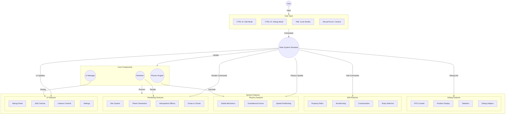
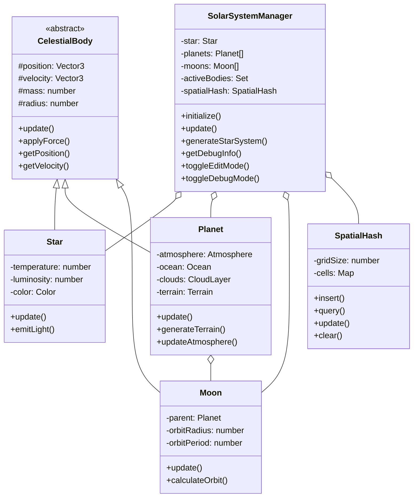
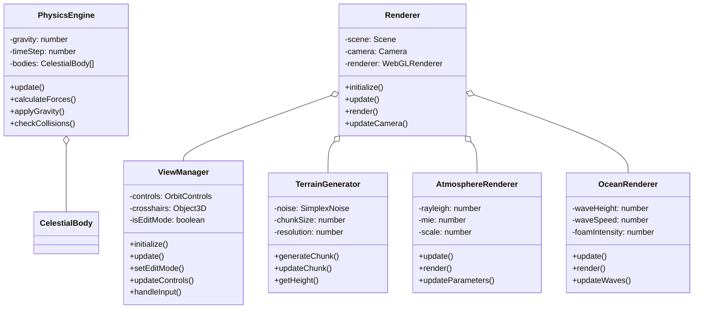
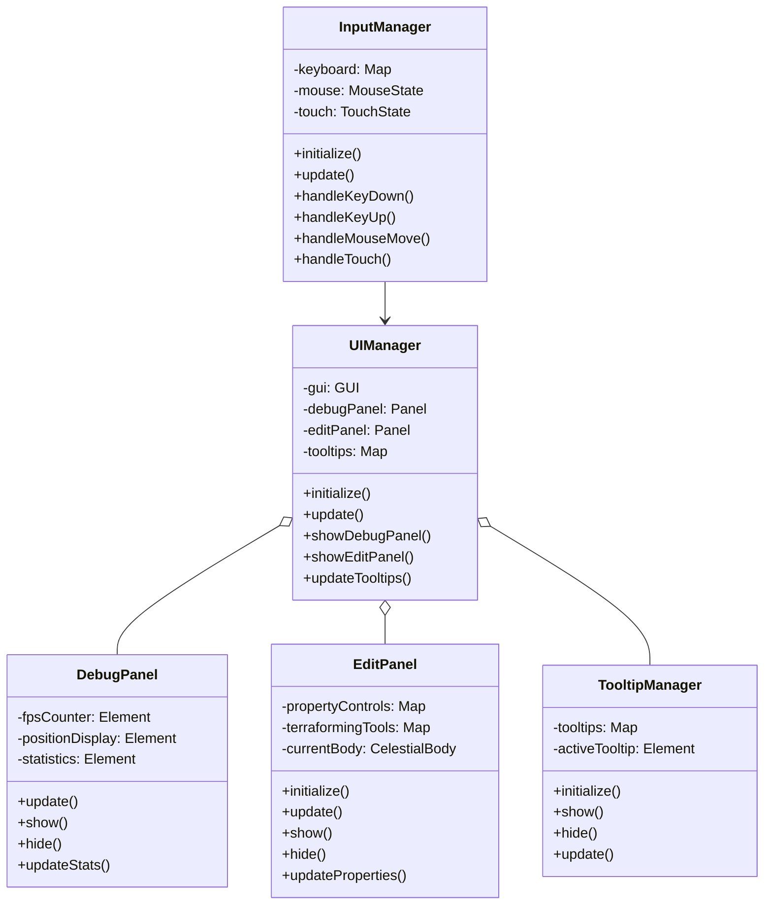
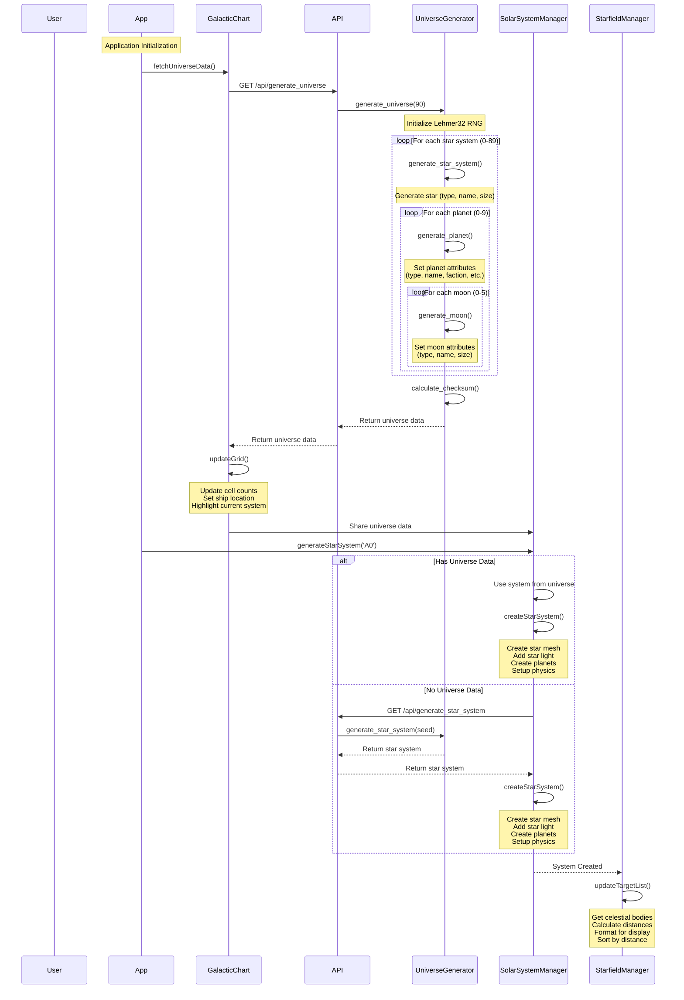
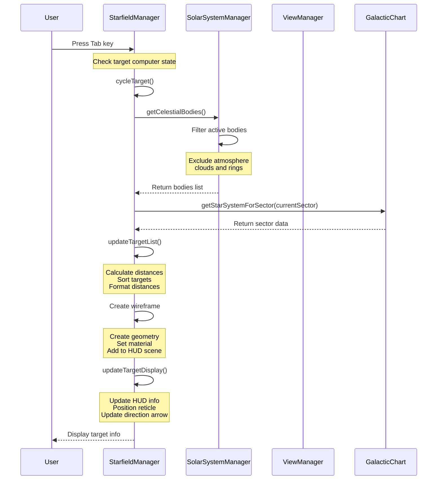
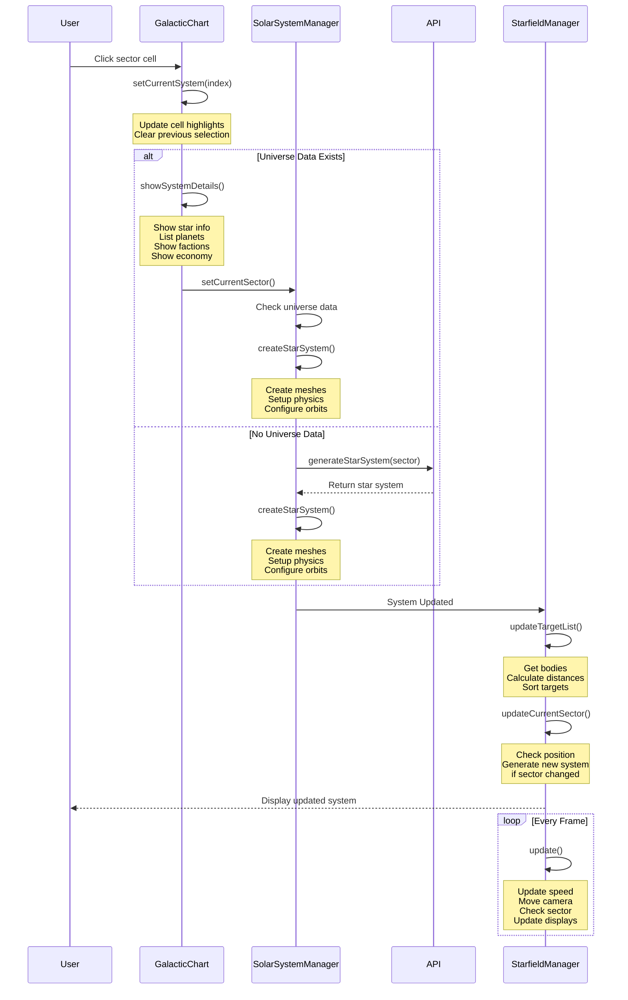

# Technical Design Document

## Core Use Cases

### 1. Star System Generation and Management
- Generate a deterministic universe using Lehmer32 random number generator:
  - Initialize Lehmer32 with a seed value
  - Generate 90 star systems (9x10 grid)
  - Each star system has:
    - Star type (red dwarf, yellow dwarf, blue giant, white dwarf)
    - Unique star name using syllable combinations (e.g., "Corusctaf")
    - 0-9 planets (randomly determined)
  - Each planet has:
    - Planet class (Class-M through Class-Y)
    - Unique name using syllable combinations
    - Faction (Friendly, Neutral, Enemy, Unknown)
    - Government (Dictatorship, Democracy, Theocracy, Monarchy, Anarchy)
    - Economy (Agricultural, Industrial, Technological, Commercial, Mining, Research, Tourism)
    - Population (ranging from 200,000 to 10 billion)
    - Atmosphere and cloud properties
    - Terrain parameters (noise scale, octaves, persistence, lacunarity)
    - 0-5 moons
  - Each moon has:
    - Moon type (rocky, ice, desert)
    - Unique name using syllable combinations
    - Size parameters

- Maintain deterministic generation:
  - Use Lehmer32 for all random choices
  - Handle both numeric and string seeds
  - Calculate universe checksum for verification
  - Ensure reproducible results across sessions

- Apply realistic orbital mechanics using Kepler's laws
- Handle gravitational interactions between bodies
- Manage spatial partitioning for efficient physics calculations

### 2. Celestial Body Data Structure
Each celestial body type has specific properties:

#### Star System
```json
{
    "star_type": "red dwarf | yellow dwarf | blue giant | white dwarf",
    "star_name": "String (e.g., 'Corusctaf')",
    "star_size": "Float (default: 2.0)",
    "planets": [Planet]
}
```

#### Planet
```json
{
    "planet_type": "Class-M | Class-L | Class-H | Class-D | Class-J | Class-K | Class-N | Class-Y",
    "planet_name": "String (e.g., 'Tatoomus')",
    "planet_size": "Float (0.8 to 2.8)",
    "has_atmosphere": "Boolean",
    "has_clouds": "Boolean",
    "faction": "String (Friendly, Neutral, Enemy, Unknown)",
    "government": "String (Dictatorship, Democracy, Theocracy, Monarchy, Anarchy)",
    "economy": "String (Agricultural, Industrial, Technological, Commercial, Mining, Research, Tourism)",
    "population": "String (200,000 to 10 billion)",
    "params": {
        "noise_scale": "Float",
        "octaves": "Integer",
        "persistence": "Float",
        "lacunarity": "Float",
        "terrain_height": "Float",
        "seed": "Integer"
    },
    "moons": [Moon]
}
```

#### Moon
```json
{
    "moon_type": "rocky | ice | desert",
    "moon_name": "String (e.g., 'Phobos')",
    "moon_size": "Float (0.2 to 0.8)"
}
```

### 3. Planet Classes
Each planet class has specific characteristics:
- **Class-M**: Earth-like planets capable of supporting humanoid life
- **Class-L**: Marginally habitable with harsh conditions
- **Class-H**: Hot, arid worlds with little surface water
- **Class-D**: Toxic atmosphere, uninhabitable
- **Class-J**: Gas giants similar to Jupiter
- **Class-K**: Barren, rocky worlds with limited water
- **Class-N**: Planets with rings similar to Saturn
- **Class-Y**: Extremely inhospitable with lethal conditions

### 4. Celestial Body Visualization
- Render star with appropriate color and light emission
- Generate and render planets with procedural terrain
- Create and render moons with appropriate properties
- Apply atmospheric effects to planets
- Add cloud layers to planets
- Implement ocean rendering with wave effects

### 5. Camera and View Controls
- Free camera movement in normal mode
- Orbit controls for focused viewing
- Camera roll functionality (Option+Command+Drag)
- Zoom controls with mouse wheel
- Touch controls for mobile devices

### 6. Debug and Edit Modes

#### 6.1 Debug Mode (CTRL+D)
- Toggle debug information display
- Show FPS counter
- Display celestial body statistics
- Show debug helpers (axes, grid)
- Update debug panel in real-time

#### 6.2 Edit Mode (CTRL+E)
- Toggle edit panel
- Initialize GUI container
- Create property controls
- Add terraforming tools
- Handle input validation
- Update visual feedback
- Manage camera controls
- Handle touch interactions

#### 6.3 Tab Cycling in Edit Mode
- Cycle through celestial bodies in current solar system using Tab key
- Clear existing GUI controls before switching
- Update property controls based on body type:
  - Star: temperature and radius controls
  - Planet: radius, rotation speed, and orbit speed controls
  - Moon: radius, rotation speed, and orbit speed controls
- Update GUI title to reflect current body
- Apply changes to body properties in real-time
- Maintain animation loop for smooth transitions

### 7. Planet Customization
- Select planet type (Class-M, Class-L, Class-H, etc.)
- Adjust terrain parameters:
  - Height
  - Noise scale
  - Octaves
  - Persistence
  - Lacunarity
- Modify surface properties:
  - Roughness
  - Detail scale
- Configure atmosphere:
  - Color
  - Rayleigh scattering
  - Mie coefficient
  - Scale
- Adjust ocean settings:
  - Enable/disable
  - Depth
  - Wave properties
  - Foam effects
- Configure cloud layers:
  - Coverage
  - Density
  - Speed
  - Turbulence
  - Color

### 8. Data Management
- Star system data structure with consistent naming conventions
- Deterministic celestial body generation using Lehmer32
- Planet class parameters and properties
- Orbital elements storage
- Physics parameters
- User preferences
- System state management

## Use Case Diagram



## Class Diagrams

### Core System Classes



### Physics and Rendering Classes



### UI and Input Classes



## Sequence Diagrams

### Universe Creation and Synchronization



### Tab Targeting Flow



### Galactic Chart Population



### Key Synchronization Points

1. **Universe Creation**:
   - App initializes by fetching universe data through GalacticChart
   - GalacticChart handles UI updates and grid cell management
   - SolarSystemManager creates all necessary 3D objects and physics
   - StarfieldManager maintains real-time targeting and movement

2. **Tab Targeting**:
   - StarfieldManager handles all targeting logic and display
   - Target computer state determines targeting behavior
   - Wireframe and HUD elements show target information
   - Real-time distance calculations and sorting

3. **Galactic Chart Updates**:
   - GalacticChart manages sector selection and details display
   - SolarSystemManager creates and manages celestial bodies
   - StarfieldManager handles movement and sector transitions
   - Continuous updates during gameplay

### Error Handling

1. **Universe Creation**:
   - Handle API failures gracefully
   - Provide fallback for offline mode
   - Maintain data consistency across components
   - Validate universe data before use

2. **Tab Targeting**:
   - Handle missing or invalid targets
   - Manage wireframe creation failures
   - Update HUD only when appropriate
   - Handle off-screen targets

3. **Galactic Chart**:
   - Validate sector selections
   - Handle missing system data
   - Manage state during transitions
   - Ensure smooth sector changes

## Technical Considerations

### Naming System
- **Stars**:
  - Prefix list: Greek letters (Alpha through Pi)
  - Name list: Traditional star names (Centauri, Proxima, etc.)
  - Format: `{prefix} {name}`

- **Planets**:
  - Prefix list: Mythological/space-themed names (Nova, Terra, etc.)
  - Suffix list: Descriptive/numerical terms (Prime, Major, I through X)
  - Format: `{prefix} {suffix}`

- **Moons**:
  - Prefix list: Traditional moon names (Phobos, Deimos, etc.)
  - Suffix list: Greek letters, Roman numerals, Latin ordinals
  - Format: `{prefix} {suffix}`

### Random Generation
- Uses Lehmer32 algorithm for deterministic random generation
- Seed-based system ensures reproducible results
- Checksum verification for universe consistency

### Performance
- Efficient physics calculations
- Optimized rendering pipeline
- Memory management
- Chunk loading/unloading
- Level of detail system

### Scalability
- Support for multiple star systems
- Extensible body type system
- Modular component architecture
- Configurable parameters

### Maintainability
- Clear code organization
- Modular design
- Consistent naming conventions
- Comprehensive documentation
- Debug tools and logging

### User Experience
- Intuitive controls
- Responsive interface
- Clear feedback
- Helpful tooltips
- Consistent behavior 