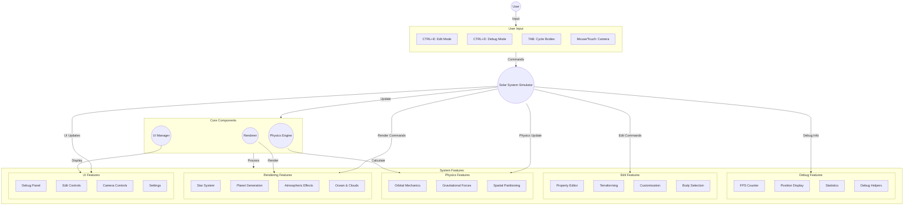
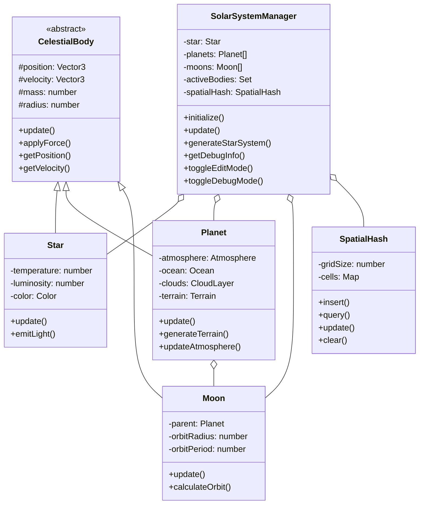
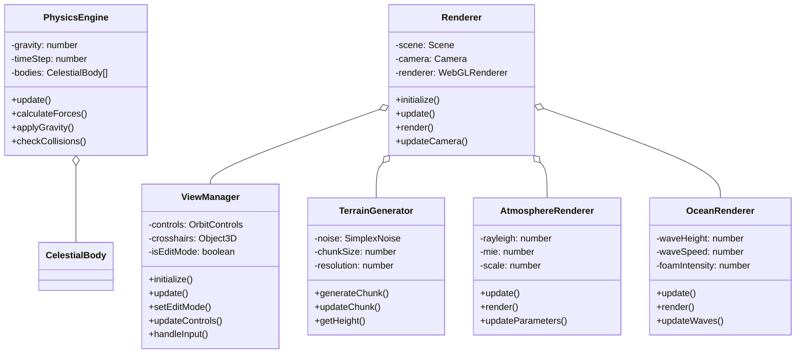
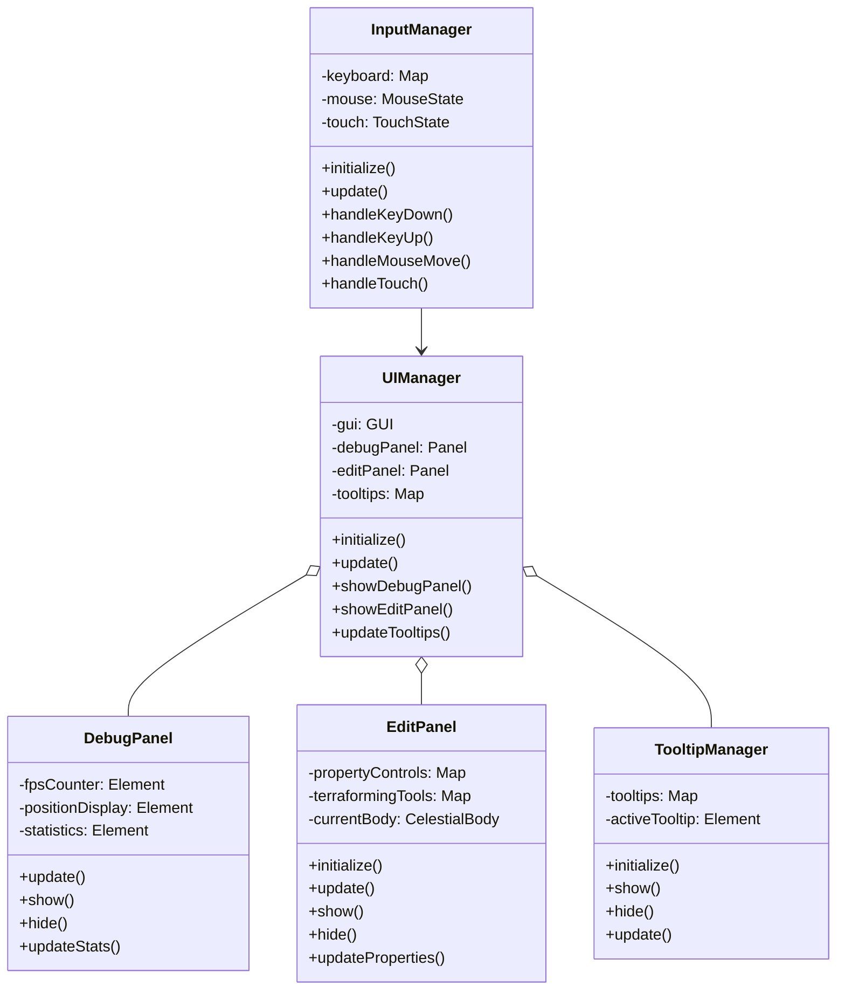
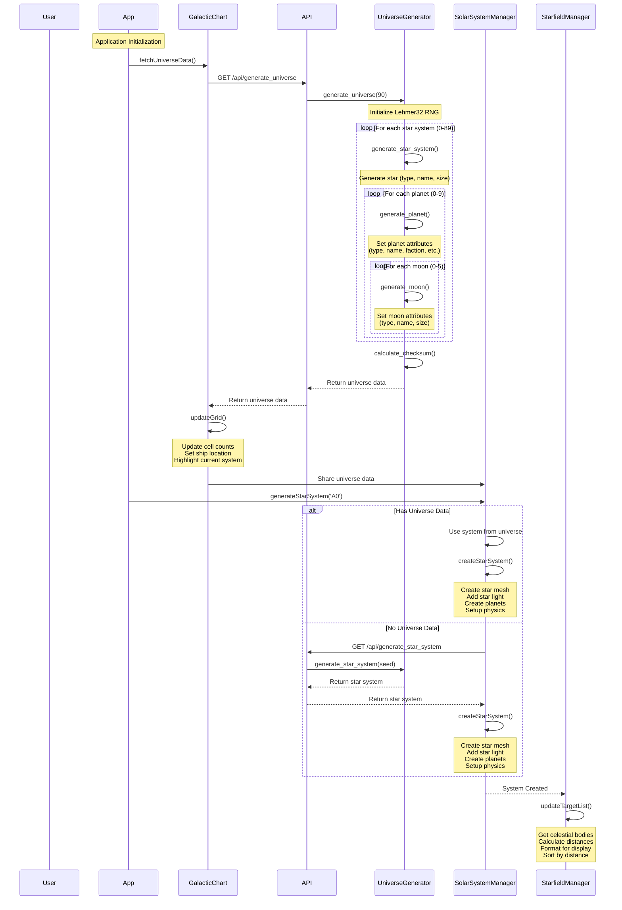
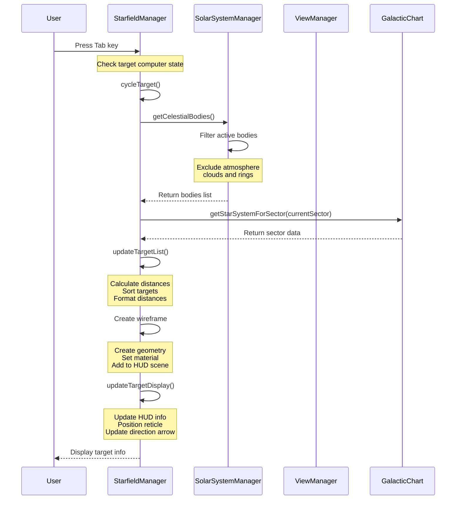
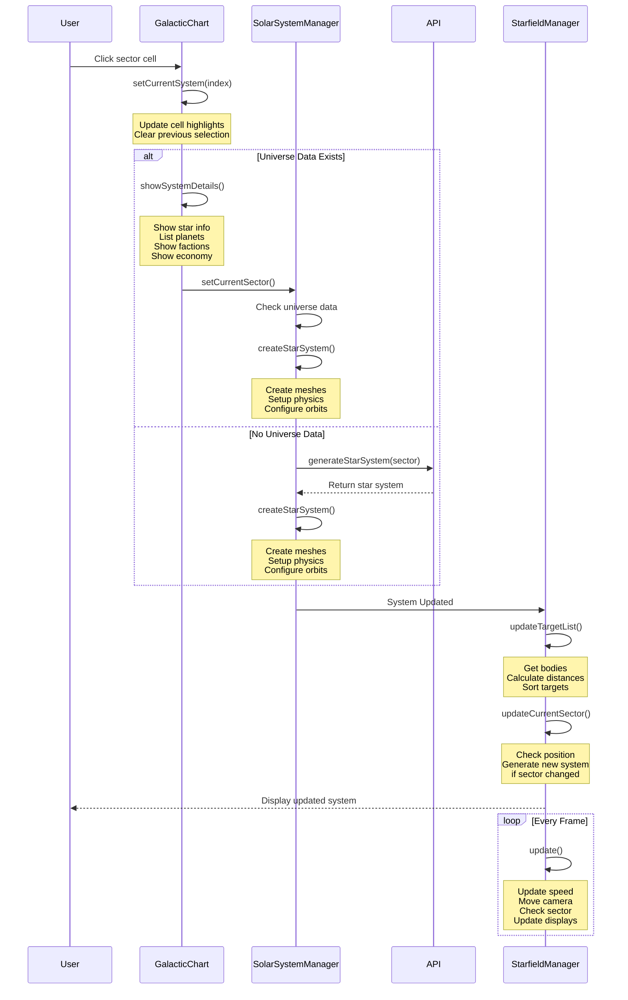
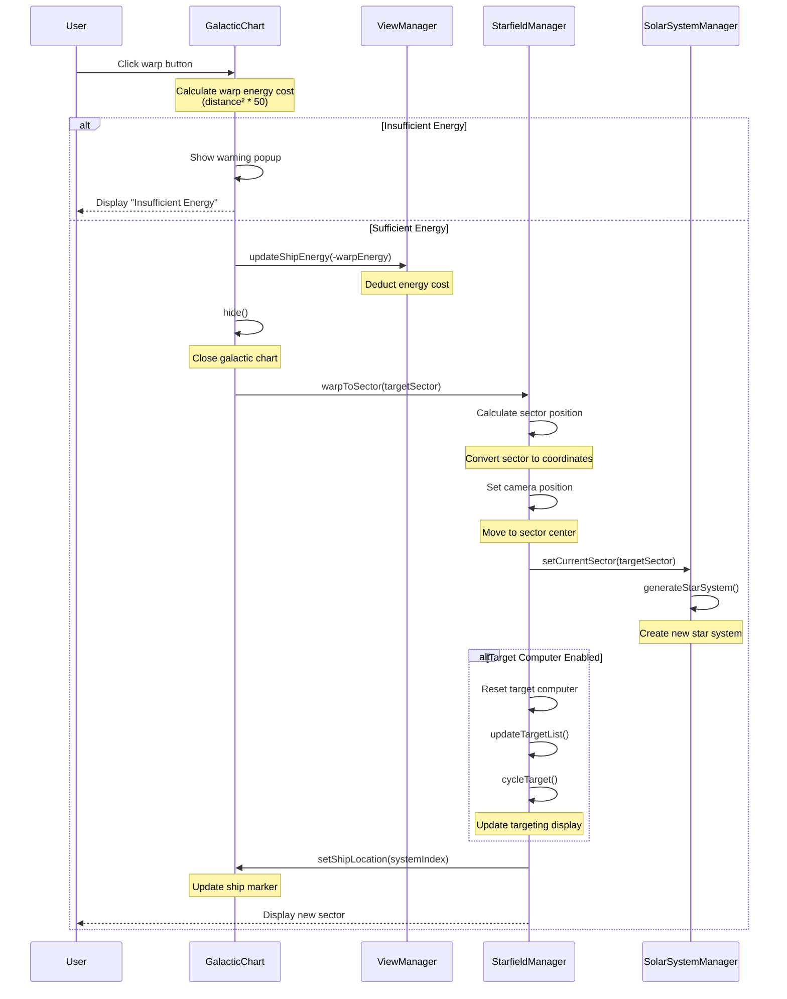

# Technical Design Document

## Core Use Cases

### 1. Star System Generation and Management
- Generate a deterministic universe using Lehmer32 random number generator:
  - Initialize Lehmer32 with a seed value
  - Generate 90 star systems (9x10 grid)
  - Each star system has:
    - Star type (red dwarf, yellow dwarf, blue giant, white dwarf)
    - Unique star name using syllable combinations (e.g., "Corusctaf")
    - 0-9 planets (randomly determined)
  - Each planet has:
    - Planet class (Class-M through Class-Y)
    - Unique name using syllable combinations
    - Faction (Friendly, Neutral, Enemy, Unknown)
    - Government (Dictatorship, Democracy, Theocracy, Monarchy, Anarchy)
    - Economy (Agricultural, Industrial, Technological, Commercial, Mining, Research, Tourism)
    - Population (ranging from 200,000 to 10 billion)
    - Atmosphere and cloud properties
    - Terrain parameters (noise scale, octaves, persistence, lacunarity)
    - 0-5 moons
  - Each moon has:
    - Moon type (rocky, ice, desert)
    - Unique name using syllable combinations
    - Size parameters

- Maintain deterministic generation:
  - Use Lehmer32 for all random choices
  - Handle both numeric and string seeds
  - Calculate universe checksum for verification
  - Ensure reproducible results across sessions

- Apply realistic orbital mechanics using Kepler's laws
- Handle gravitational interactions between bodies
- Manage spatial partitioning for efficient physics calculations

### 2. Celestial Body Data Structure
Each celestial body type has specific properties:

#### Star System
```json
{
    "star_type": "red dwarf | yellow dwarf | blue giant | white dwarf",
    "star_name": "String (e.g., 'Corusctaf')",
    "star_size": "Float (default: 2.0)",
    "planets": [Planet]
}
```

#### Planet
```json
{
    "planet_type": "Class-M | Class-L | Class-H | Class-D | Class-J | Class-K | Class-N | Class-Y",
    "planet_name": "String (e.g., 'Tatoomus')",
    "planet_size": "Float (0.8 to 2.8)",
    "has_atmosphere": "Boolean",
    "has_clouds": "Boolean",
    "faction": "String (Friendly, Neutral, Enemy, Unknown)",
    "government": "String (Dictatorship, Democracy, Theocracy, Monarchy, Anarchy)",
    "economy": "String (Agricultural, Industrial, Technological, Commercial, Mining, Research, Tourism)",
    "population": "String (200,000 to 10 billion)",
    "params": {
        "noise_scale": "Float",
        "octaves": "Integer",
        "persistence": "Float",
        "lacunarity": "Float",
        "terrain_height": "Float",
        "seed": "Integer"
    },
    "moons": [Moon]
}
```

#### Moon
```json
{
    "moon_type": "rocky | ice | desert",
    "moon_name": "String (e.g., 'Phobos')",
    "moon_size": "Float (0.2 to 0.8)"
}
```

### 3. Planet Classes
Each planet class has specific characteristics:
- **Class-M**: Earth-like planets capable of supporting humanoid life
- **Class-L**: Marginally habitable with harsh conditions
- **Class-H**: Hot, arid worlds with little surface water
- **Class-D**: Toxic atmosphere, uninhabitable
- **Class-J**: Gas giants similar to Jupiter
- **Class-K**: Barren, rocky worlds with limited water
- **Class-N**: Planets with rings similar to Saturn
- **Class-Y**: Extremely inhospitable with lethal conditions

### 4. Celestial Body Visualization
- Render star with appropriate color and light emission
- Generate and render planets with procedural terrain
- Create and render moons with appropriate properties
- Apply atmospheric effects to planets
- Add cloud layers to planets
- Implement ocean rendering with wave effects

### 5. Camera and View Controls
- Free camera movement in normal mode
- Orbit controls for focused viewing
- Camera roll functionality (Option+Command+Drag)
- Zoom controls with mouse wheel
- Touch controls for mobile devices

### 6. Warp Drive System
- Sector-based navigation through galactic chart
- Energy cost calculation based on Manhattan distance
  - Cost = (distance²) * 50 energy units
  - Distance measured in sector grid units
- Instant sector transition mechanics:
  - Center ship in target sector
  - Generate new star system
  - Reset and update target computer
  - Update galactic chart position
- Energy management system:
  - Track available ship energy
  - Validate energy requirements
  - Deduct costs for warp operations
  - Display insufficient energy warnings
- Coordinate system:
  - Grid-based sector mapping (A0-J8)
  - Sector size: 100,000 units
  - Center-relative positioning
  - Maintain Y-axis position during warps

### 7. Debug and Edit Modes

#### 7.1 Debug Mode (CTRL+D)
- Toggle debug information display
- Show FPS counter
- Display celestial body statistics
- Show debug helpers (axes, grid)
- Update debug panel in real-time

#### 7.2 Edit Mode (CTRL+E)
- Toggle edit panel
- Initialize GUI container
- Create property controls
- Add terraforming tools
- Handle input validation
- Update visual feedback
- Manage camera controls
- Handle touch interactions

#### 7.3 Tab Cycling in Edit Mode
- Cycle through celestial bodies in current solar system using Tab key
- Clear existing GUI controls before switching
- Update property controls based on body type:
  - Star: temperature and radius controls
  - Planet: radius, rotation speed, and orbit speed controls
  - Moon: radius, rotation speed, and orbit speed controls
- Update GUI title to reflect current body
- Apply changes to body properties in real-time
- Maintain animation loop for smooth transitions

### 8. Planet Customization
- Select planet type (Class-M, Class-L, Class-H, etc.)
- Adjust terrain parameters:
  - Height
  - Noise scale
  - Octaves
  - Persistence
  - Lacunarity
- Modify surface properties:
  - Roughness
  - Detail scale
- Configure atmosphere:
  - Color
  - Rayleigh scattering
  - Mie coefficient
  - Scale
- Adjust ocean settings:
  - Enable/disable
  - Depth
  - Wave properties
  - Foam effects
- Configure cloud layers:
  - Coverage
  - Density
  - Speed
  - Turbulence
  - Color

### 9. Data Management
- Star system data structure with consistent naming conventions
- Deterministic celestial body generation using Lehmer32
- Planet class parameters and properties
- Orbital elements storage
- Physics parameters
- User preferences
- System state management

### 10. Planet Generation System
- Enhanced LOD (Level of Detail) system:
  ```javascript
  // LOD parameters
  this.lodLevels = 6;  // Number of detail levels
  this.lodDistanceThresholds = [10, 20, 30, 50, 80, 120];  // Distance thresholds
  this.lodResolutionDivisors = [1, 1.5, 2, 3, 4, 6];  // Resolution scaling
  this.lodTransitionRange = 5;  // Smooth transition range
  ```

- Planet class parameters:
  ```javascript
  const planetClasses = {
      "Class-M": {
          name: "Class-M (Earth-like)",
          description: "Earth-like planets capable of supporting humanoid life",
          params: {
              noiseScale: 1.2,
              octaves: 5,
              persistence: 0.5,
              lacunarity: 2.0,
              terrainHeight: 0.15,
              seed: Math.random() * 10000
          }
      },
      "Class-L": {
          name: "Class-L (Marginal)",
          description: "Marginally habitable with harsh conditions",
          params: {
              noiseScale: 2.0,
              octaves: 6,
              persistence: 0.6,
              lacunarity: 2.2,
              terrainHeight: 0.25,
              seed: Math.random() * 10000
          }
      }
  };
  ```

### 11. Performance Optimization
- Chunk-based rendering:
  - Grid size: 64x64x64 or 128x128x128
  - Chunk size: 16x16x16
  - Spatial partitioning for efficient updates
  - LOD system for distant objects

- WebAssembly optimizations:
  - Marching Cubes algorithm in WASM
  - Noise functions in WASM
  - Web Worker offloading
  - Efficient memory management

### 12. Testing Framework

#### 12.1 Planet Generation Tests
```javascript
describe('Planet Generation Tests', () => {
    test('LOD system transitions', () => {
        const planetGenerator = new PlanetGenerator();
        const distances = [5, 15, 25, 40, 60, 100];
        const expectedLODs = [0, 1, 2, 3, 4, 5];
        
        distances.forEach((distance, index) => {
            const lod = planetGenerator.calculateLOD(distance);
            expect(lod).toBe(expectedLODs[index]);
        });
    });

    test('Planet class parameters', () => {
        const planetGenerator = new PlanetGenerator();
        const classM = planetGenerator.getPlanetClassParams('Class-M');
        
        expect(classM.noiseScale).toBe(1.2);
        expect(classM.octaves).toBe(5);
        expect(classM.persistence).toBe(0.5);
        expect(classM.lacunarity).toBe(2.0);
        expect(classM.terrainHeight).toBe(0.15);
    });
});
```

#### 12.2 Error Handling Tests
```javascript
describe('Error Handling Tests', () => {
    test('Invalid planet class handling', () => {
        const planetGenerator = new PlanetGenerator();
        expect(() => planetGenerator.getPlanetClassParams('Invalid-Class')).toThrow();
    });

    test('LOD calculation edge cases', () => {
        const planetGenerator = new PlanetGenerator();
        expect(planetGenerator.calculateLOD(-1)).toBe(0);
        expect(planetGenerator.calculateLOD(1000)).toBe(5);
    });
});

## Use Case Diagram



## Class Diagrams

### Core System Classes



### Physics and Rendering Classes



### UI and Input Classes



## Sequence Diagrams

### Universe Creation and Synchronization



### Tab Targeting Flow



### Galactic Chart Population



### Warp Drive Operations



### Key Synchronization Points

1. **Universe Creation**:
   - App initializes by fetching universe data through GalacticChart
   - GalacticChart handles UI updates and grid cell management
   - SolarSystemManager creates all necessary 3D objects and physics
   - StarfieldManager maintains real-time targeting and movement

2. **Tab Targeting**:
   - StarfieldManager handles all targeting logic and display
   - Target computer state determines targeting behavior
   - Wireframe and HUD elements show target information
   - Real-time distance calculations and sorting

3. **Galactic Chart Updates**:
   - GalacticChart manages sector selection and details display
   - SolarSystemManager creates and manages celestial bodies
   - StarfieldManager handles movement and sector transitions
   - Continuous updates during gameplay

### Error Handling

1. **Universe Creation**:
   - Handle API failures gracefully
   - Provide fallback for offline mode
   - Maintain data consistency across components
   - Validate universe data before use

2. **Tab Targeting**:
   - Handle missing or invalid targets
   - Manage wireframe creation failures
   - Update HUD only when appropriate
   - Handle off-screen targets

3. **Galactic Chart**:
   - Validate sector selections
   - Handle missing system data
   - Manage state during transitions
   - Ensure smooth sector changes

## Testing Framework

### Warp Drive Test Suite

#### 1. Position Tests
```javascript
describe('Warp Drive Position Tests', () => {
    test('Warp to A0 centers ship at (-400000, y, -500000)', () => {
        const starfieldManager = new StarfieldManager(scene, camera, viewManager);
        starfieldManager.warpToSector('A0');
        const pos = camera.position;
        expect(pos.x).toBe(-400000); // (0 - 4) * 100000
        expect(pos.z).toBe(-500000); // (0 - 5) * 100000
        expect(pos.y).toBe(camera.position.y); // Y should remain unchanged
    });

    test('Warp to E4 centers ship at (0, y, 0)', () => {
        const starfieldManager = new StarfieldManager(scene, camera, viewManager);
        starfieldManager.warpToSector('E4');
        const pos = camera.position;
        expect(pos.x).toBe(0); // (4 - 4) * 100000
        expect(pos.z).toBe(0); // (4 - 5) * 100000
        expect(pos.y).toBe(camera.position.y); // Y should remain unchanged
    });

    test('Warp to J8 centers ship at (400000, y, 500000)', () => {
        const starfieldManager = new StarfieldManager(scene, camera, viewManager);
        starfieldManager.warpToSector('J8');
        const pos = camera.position;
        expect(pos.x).toBe(400000); // (8 - 4) * 100000
        expect(pos.z).toBe(500000); // (9 - 5) * 100000
        expect(pos.y).toBe(camera.position.y); // Y should remain unchanged
    });
});
```

#### 2. Energy Management Tests
```javascript
describe('Warp Drive Energy Tests', () => {
    test('Warp energy calculation is correct', () => {
        const galacticChart = new GalacticChart(viewManager);
        // Test A0 to E4 (Manhattan distance = 9)
        const energy = galacticChart.calculateWarpEnergy(0, 40);
        expect(energy).toBe(4050); // (9^2 * 50)
    });

    test('Insufficient energy prevents warp', () => {
        const viewManager = new ViewManager(scene, camera, controls);
        viewManager.updateShipEnergy(-9000); // Set energy to low level
        const galacticChart = new GalacticChart(viewManager);
        const warningShown = galacticChart.attemptWarp('J8');
        expect(warningShown).toBe(true);
        expect(viewManager.getShipEnergy()).toBe(999); // Energy unchanged
    });

    test('Successful warp deducts correct energy', () => {
        const viewManager = new ViewManager(scene, camera, controls);
        const initialEnergy = viewManager.getShipEnergy();
        const galacticChart = new GalacticChart(viewManager);
        galacticChart.attemptWarp('B1');
        const expectedCost = 200; // (2^2 * 50)
        expect(viewManager.getShipEnergy()).toBe(initialEnergy - expectedCost);
    });
});
```

#### 3. State Management Tests
```javascript
describe('Warp Drive State Tests', () => {
    test('Target computer resets after warp', () => {
        const starfieldManager = new StarfieldManager(scene, camera, viewManager);
        starfieldManager.targetComputerEnabled = true;
        starfieldManager.currentTarget = mockTarget;
        starfieldManager.warpToSector('C3');
        expect(starfieldManager.currentTarget).toBeNull();
        expect(starfieldManager.targetIndex).toBe(-1);
    });

    test('Solar system updates after warp', () => {
        const starfieldManager = new StarfieldManager(scene, camera, viewManager);
        const solarSystemManager = new SolarSystemManager(scene, camera);
        starfieldManager.setSolarSystemManager(solarSystemManager);
        
        const oldSystem = solarSystemManager.currentSector;
        starfieldManager.warpToSector('D4');
        expect(solarSystemManager.currentSector).toBe('D4');
        expect(solarSystemManager.currentSector).not.toBe(oldSystem);
    });

    test('Galactic chart updates ship location', () => {
        const starfieldManager = new StarfieldManager(scene, camera, viewManager);
        const galacticChart = viewManager.getGalacticChart();
        const oldIndex = galacticChart.shipSystemIndex;
        
        starfieldManager.warpToSector('F6');
        const newIndex = galacticChart.shipSystemIndex;
        expect(newIndex).not.toBe(oldIndex);
        expect(newIndex).toBe(51); // F6 = (5 * 9) + 6
    });
});
```

#### 4. Error Handling Tests
```javascript
describe('Warp Drive Error Tests', () => {
    test('Invalid sector handling', () => {
        const starfieldManager = new StarfieldManager(scene, camera, viewManager);
        expect(() => starfieldManager.warpToSector('K9')).toThrow();
        expect(() => starfieldManager.warpToSector('A9')).toThrow();
        expect(() => starfieldManager.warpToSector('invalid')).toThrow();
    });

    test('Missing solar system manager handling', () => {
        const starfieldManager = new StarfieldManager(scene, camera, viewManager);
        starfieldManager.solarSystemManager = null;
        expect(() => starfieldManager.warpToSector('B2')).toThrow();
    });

    test('Maintains state on failed warp', () => {
        const starfieldManager = new StarfieldManager(scene, camera, viewManager);
        const originalSector = starfieldManager.solarSystemManager.currentSector;
        const originalPosition = camera.position.clone();
        
        try {
            starfieldManager.warpToSector('invalid');
        } catch (e) {
            expect(starfieldManager.solarSystemManager.currentSector).toBe(originalSector);
            expect(camera.position).toEqual(originalPosition);
        }
    });
});
```

## Technical Considerations

### Naming System
- **Stars**:
  - Prefix list: Greek letters (Alpha through Pi)
  - Name list: Traditional star names (Centauri, Proxima, etc.)
  - Format: `{prefix} {name}`

- **Planets**:
  - Prefix list: Mythological/space-themed names (Nova, Terra, etc.)
  - Suffix list: Descriptive/numerical terms (Prime, Major, I through X)
  - Format: `{prefix} {suffix}`

- **Moons**:
  - Prefix list: Traditional moon names (Phobos, Deimos, etc.)
  - Suffix list: Greek letters, Roman numerals, Latin ordinals
  - Format: `{prefix} {suffix}`

### Random Generation
- Uses Lehmer32 algorithm for deterministic random generation
- Seed-based system ensures reproducible results
- Checksum verification for universe consistency

### Performance
- Efficient physics calculations
- Optimized rendering pipeline
- Memory management
- Chunk loading/unloading
- Level of detail system

### Scalability
- Support for multiple star systems
- Extensible body type system
- Modular component architecture
- Configurable parameters

### Maintainability
- Clear code organization
- Modular design
- Consistent naming conventions
- Comprehensive documentation
- Debug tools and logging

### User Experience
- Intuitive controls
- Responsive interface
- Clear feedback
- Helpful tooltips
- Consistent behavior

### 13. Warp Drive Implementation Details

#### 13.1 Core Warp Drive Class
```javascript
class WarpDrive {
    constructor() {
        this.isActive = false;
        this.warpFactor = 1.0;
        this.maxWarpFactor = 9.9;
        this.energyLevel = 100;
        this.maxEnergy = 100;
        this.energyConsumptionRate = 0.1;
        this.cooldownTime = 0;
        this.maxCooldownTime = 5000; // 5 seconds
    }

    activate() {
        if (this.energyLevel > 0 && this.cooldownTime <= 0) {
            this.isActive = true;
            return true;
        }
        return false;
    }

    deactivate() {
        this.isActive = false;
        this.cooldownTime = this.maxCooldownTime;
    }

    update(deltaTime) {
        if (this.isActive) {
            this.energyLevel = Math.max(0, this.energyLevel - 
                (this.energyConsumptionRate * this.warpFactor * deltaTime));
            if (this.energyLevel <= 0) {
                this.deactivate();
            }
        } else if (this.cooldownTime > 0) {
            this.cooldownTime = Math.max(0, this.cooldownTime - deltaTime);
        }
    }
}
```

#### 13.2 Warp Drive Manager
```javascript
class WarpDriveManager {
    constructor(camera) {
        this.warpDrive = new WarpDrive();
        this.ship = new THREE.Object3D();
        this.ship.position = new THREE.Vector3(0, 0, 0);
        this.velocity = new THREE.Vector3(0, 0, 0);
        this.maxSpeed = 1000;
        this.acceleration = 50;
        this.deceleration = 30;
        this.camera = camera;
    }

    update(deltaTime) {
        this.warpDrive.update(deltaTime);
        
        if (this.warpDrive.isActive) {
            const targetSpeed = this.maxSpeed * this.warpDrive.warpFactor;
            this.velocity.z = -targetSpeed;
            this.ship.position.add(this.velocity.clone().multiplyScalar(deltaTime));
            
            if (this.camera) {
                this.camera.position.copy(this.ship.position);
            }
        } else {
            if (this.velocity.length() > 0) {
                const decel = this.deceleration * deltaTime;
                if (this.velocity.length() <= decel) {
                    this.velocity.set(0, 0, 0);
                } else {
                    this.velocity.normalize().multiplyScalar(this.velocity.length() - decel);
                }
                this.ship.position.add(this.velocity.clone().multiplyScalar(deltaTime));
                
                if (this.camera) {
                    this.camera.position.copy(this.ship.position);
                }
            }
        }
    }
}
```

#### 13.3 Visual Effects System
```javascript
class WarpEffects {
    constructor(scene) {
        this.starTrails = new StarTrailSystem();
        this.engineGlow = new EngineGlowEffect();
        this.lightSpeedEffect = new LightSpeedEffect();
        this.scene = scene;
    }

    update(deltaTime, warpFactor) {
        // Update star trails
        this.starTrails.update(deltaTime, warpFactor);
        
        // Update engine glow
        this.engineGlow.update(deltaTime, warpFactor);
        
        // Update light speed effect
        this.lightSpeedEffect.update(deltaTime, warpFactor);
        
        // Update scene effects
        this.updateSceneEffects(deltaTime, warpFactor);
    }

    updateSceneEffects(deltaTime, warpFactor) {
        // Star field stretching
        const stretchFactor = Math.min(1.0, warpFactor / 5.0);
        this.scene.traverse((object) => {
            if (object.isStar) {
                object.material.stretchFactor = stretchFactor;
            }
        });

        // Engine trail effects
        if (warpFactor > 1.0) {
            this.createEngineTrail(deltaTime, warpFactor);
        }

        // Light speed effect
        if (warpFactor > 8.0) {
            this.createLightSpeedEffect(deltaTime);
        }
    }
}
```

#### 13.4 Energy Management
```javascript
class EnergySystem {
    constructor() {
        this.maxEnergy = 100;
        this.currentEnergy = 100;
        this.rechargeRate = 0.05; // 5% per second
        this.consumptionRate = 0.1;
    }

    update(deltaTime, warpFactor) {
        if (warpFactor > 1.0) {
            // Consume energy during warp
            this.currentEnergy = Math.max(0, 
                this.currentEnergy - (this.consumptionRate * warpFactor * deltaTime));
        } else {
            // Recharge energy when not warping
            this.currentEnergy = Math.min(this.maxEnergy,
                this.currentEnergy + (this.rechargeRate * deltaTime));
        }
    }

    canWarp(requiredEnergy) {
        return this.currentEnergy >= requiredEnergy;
    }

    consumeEnergy(amount) {
        if (this.currentEnergy >= amount) {
            this.currentEnergy -= amount;
            return true;
        }
        return false;
    }
}
```

#### 13.5 Warp Sequence Timing
```javascript
class WarpSequence {
    constructor() {
        this.sequenceTime = 5000; // 5 seconds
        this.currentTime = 0;
        this.phase = 'idle'; // idle, accelerating, warping, decelerating
        this.accelerationCurve = new CubicBezierCurve3(
            new THREE.Vector3(0, 0, 0),
            new THREE.Vector3(0.2, 0.8, 0),
            new THREE.Vector3(0.8, 1, 0),
            new THREE.Vector3(1, 1, 0)
        );
    }

    update(deltaTime) {
        this.currentTime += deltaTime;
        
        switch (this.phase) {
            case 'accelerating':
                this.updateAcceleration();
                break;
            case 'warping':
                this.updateWarping();
                break;
            case 'decelerating':
                this.updateDeceleration();
                break;
        }
    }

    startSequence() {
        this.currentTime = 0;
        this.phase = 'accelerating';
    }

    updateAcceleration() {
        const progress = this.currentTime / (this.sequenceTime * 0.2);
        if (progress >= 1) {
            this.phase = 'warping';
            this.currentTime = 0;
        }
    }

    updateWarping() {
        const progress = this.currentTime / (this.sequenceTime * 0.6);
        if (progress >= 1) {
            this.phase = 'decelerating';
            this.currentTime = 0;
        }
    }

    updateDeceleration() {
        const progress = this.currentTime / (this.sequenceTime * 0.2);
        if (progress >= 1) {
            this.phase = 'idle';
            this.currentTime = 0;
        }
    }
}
```

### 14. Test Cases and Error Handling

#### 14.1 Warp Drive Test Suite

##### Basic Functionality Tests
```javascript
describe('WarpDrive Basic Tests', () => {
    test('should initialize with default values', () => {
        expect(warpDrive.isActive).toBe(false);
        expect(warpDrive.warpFactor).toBe(1.0);
        expect(warpDrive.energyLevel).toBe(100);
    });

    test('should activate when energy is available', () => {
        expect(warpDrive.activate()).toBe(true);
        expect(warpDrive.isActive).toBe(true);
    });

    test('should not activate when energy is depleted', () => {
        warpDrive.energyLevel = 0;
        expect(warpDrive.activate()).toBe(false);
        expect(warpDrive.isActive).toBe(false);
    });

    test('should deactivate and start cooldown', () => {
        warpDrive.activate();
        warpDrive.deactivate();
        expect(warpDrive.isActive).toBe(false);
        expect(warpDrive.cooldownTime).toBe(warpDrive.maxCooldownTime);
    });
});
```

##### Warp Drive Manager Tests
```javascript
describe('WarpDriveManager Tests', () => {
    test('should initialize with default values', () => {
        const status = manager.getStatus();
        expect(status.isActive).toBe(false);
        expect(status.warpFactor).toBe(1.0);
        expect(status.energyLevel).toBe(100);
    });

    test('should update ship position during warp', () => {
        manager.activateWarp();
        manager.setWarpFactor(2.0);
        manager.update(1000);
        const status = manager.getStatus();
        expect(status.position.z).toBeLessThan(0);
        expect(mockCamera.position.z).toBeLessThan(0);
    });

    test('should handle warp factor limits', () => {
        expect(manager.setWarpFactor(5.0)).toBe(true);
        expect(manager.setWarpFactor(0.5)).toBe(false);
        expect(manager.setWarpFactor(10.0)).toBe(false);
    });
});
```

##### Energy System Tests
```javascript
describe('Warp Drive Energy Tests', () => {
    test('Warp energy calculation is correct', () => {
        const energy = galacticChart.calculateWarpEnergy(0, 40);
        expect(energy).toBe(4050); // (9^2 * 50)
    });

    test('Insufficient energy prevents warp', () => {
        viewManager.updateShipEnergy(-9000);
        expect(galacticChart.warpToSector('E4')).toBe(false);
    });

    test('Successful warp deducts correct energy', () => {
        const initialEnergy = viewManager.getShipEnergy();
        galacticChart.warpToSector('E4');
        expect(viewManager.getShipEnergy()).toBe(initialEnergy - 4050);
    });
});
```

#### 14.2 Error Handling

##### Warp Drive Error Handling
```javascript
class WarpDriveError extends Error {
    constructor(message, code) {
        super(message);
        this.name = 'WarpDriveError';
        this.code = code;
    }
}

class WarpDrive {
    // ... existing code ...

    activate() {
        try {
            if (this.energyLevel <= 0) {
                throw new WarpDriveError('Insufficient energy', 'ENERGY_LOW');
            }
            if (this.cooldownTime > 0) {
                throw new WarpDriveError('Warp drive cooling down', 'COOLDOWN');
            }
            this.isActive = true;
            return true;
        } catch (error) {
            console.error('Warp drive activation failed:', error);
            return false;
        }
    }

    setWarpFactor(factor) {
        try {
            if (factor < 1.0 || factor > this.maxWarpFactor) {
                throw new WarpDriveError(
                    `Invalid warp factor: ${factor}. Must be between 1.0 and ${this.maxWarpFactor}`,
                    'INVALID_FACTOR'
                );
            }
            this.warpFactor = factor;
            return true;
        } catch (error) {
            console.error('Failed to set warp factor:', error);
            return false;
        }
    }
}
```

##### Galactic Chart Error Handling
```javascript
class GalacticChartError extends Error {
    constructor(message, code) {
        super(message);
        this.name = 'GalacticChartError';
        this.code = code;
    }
}

class GalacticChart {
    // ... existing code ...

    warpToSector(sector) {
        try {
            // Validate sector format
            if (!this.isValidSector(sector)) {
                throw new GalacticChartError(
                    `Invalid sector format: ${sector}`,
                    'INVALID_SECTOR'
                );
            }

            // Check energy requirements
            const energy = this.calculateWarpEnergy(this.currentSector, sector);
            if (!this.viewManager.canWarp(energy)) {
                throw new GalacticChartError(
                    `Insufficient energy for warp to ${sector}`,
                    'INSUFFICIENT_ENERGY'
                );
            }

            // Perform warp
            this.viewManager.updateShipEnergy(-energy);
            this.hide();
            this.viewManager.getStarfieldManager().warpToSector(sector);
            return true;
        } catch (error) {
            console.error('Warp operation failed:', error);
            this.showErrorModal(error);
            return false;
        }
    }

    showErrorModal(error) {
        const modal = document.createElement('div');
        modal.className = 'error-modal';
        modal.innerHTML = `
            <div class="error-content">
                <h3>Warp Error</h3>
                <p>${error.message}</p>
                <button class="error-close">OK</button>
            </div>
        `;
        document.body.appendChild(modal);

        const closeButton = modal.querySelector('.error-close');
        closeButton.addEventListener('click', () => {
            document.body.removeChild(modal);
        });
    }
}
```

##### Starfield Manager Error Handling
```javascript
class StarfieldManagerError extends Error {
    constructor(message, code) {
        super(message);
        this.name = 'StarfieldManagerError';
        this.code = code;
    }
}

class StarfieldManager {
    // ... existing code ...

    warpToSector(sector) {
        try {
            if (!this.solarSystemManager) {
                throw new StarfieldManagerError(
                    'Solar system manager not initialized',
                    'NO_SYSTEM_MANAGER'
                );
            }

            const position = this.calculateSectorPosition(sector);
            if (!position) {
                throw new StarfieldManagerError(
                    `Failed to calculate position for sector ${sector}`,
                    'INVALID_POSITION'
                );
            }

            // Store current state for rollback
            const previousState = {
                position: this.camera.position.clone(),
                sector: this.currentSector,
                target: this.currentTarget
            };

            try {
                this.updateCameraPosition(position);
                this.solarSystemManager.setCurrentSector(sector);
                this.resetTargetComputer();
                this.updateTargetList();
            } catch (error) {
                // Rollback on failure
                this.camera.position.copy(previousState.position);
                this.currentSector = previousState.sector;
                this.currentTarget = previousState.target;
                throw error;
            }
        } catch (error) {
            console.error('Sector transition failed:', error);
            this.showErrorNotification(error);
            throw error;
        }
    }

    showErrorNotification(error) {
        const notification = document.createElement('div');
        notification.className = 'error-notification';
        notification.innerHTML = `
            <div class="notification-content">
                <p>${error.message}</p>
            </div>
        `;
        document.body.appendChild(notification);

        setTimeout(() => {
            document.body.removeChild(notification);
        }, 3000);
    }
}
``` 
