# Technical Design Document

## System Architecture

### High-Level Overview
The system follows a client-server architecture with the following components:

1. **Frontend (Client)**
   - Web-based interface using Three.js for 3D rendering
   - Real-time visualization of star systems and navigation
   - Interactive controls for ship movement and system interaction

2. **Backend (Server)**
   - Python-based API server
   - Star system generation and management
   - Game state persistence
   - Real-time updates and synchronization

### Use Case Diagram
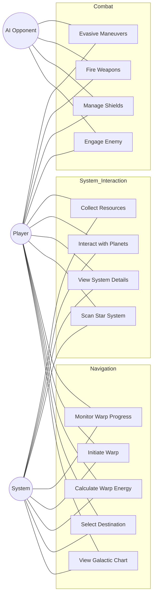

### Component Diagram
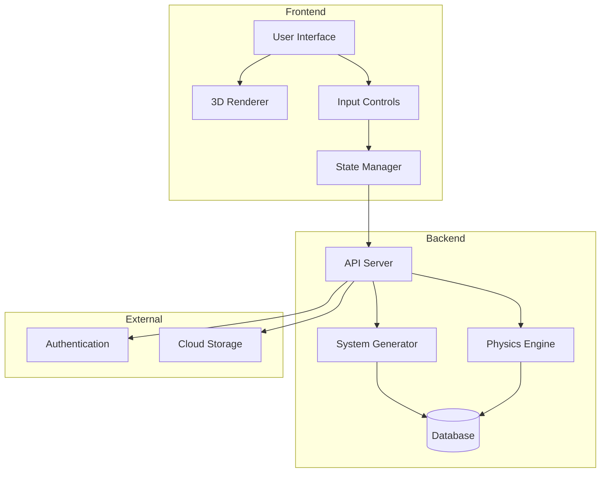

### Data Flow Diagram
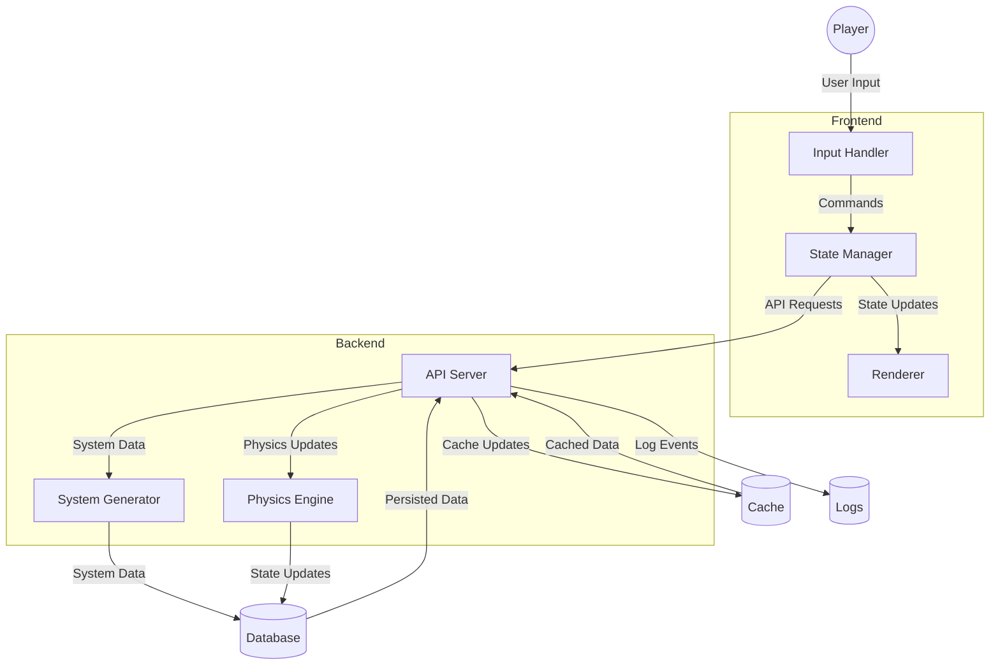

## Technical Specifications

### Frontend Architecture

#### Core Components
1. **ViewManager**
   - Manages different views (galactic, system, combat)
   - Handles view transitions and state
   - Coordinates between different UI components

2. **StarfieldManager**
   - Renders and manages the starfield
   - Handles star movement and effects
   - Manages view transitions

3. **WarpDriveManager**
   - Controls warp drive functionality
   - Manages energy consumption
   - Handles warp effects and transitions

4. **SystemGenerator**
   - Generates star systems based on sector coordinates
   - Manages celestial body placement
   - Handles system persistence

#### State Management
- Centralized state management through ViewManager
- Real-time updates for ship position and system state
- Efficient state synchronization between components

### Backend Architecture

#### API Endpoints
1. **System Generation**
   - `/api/generate_star_system`
   - `/api/get_system_data`
   - `/api/update_system_state`

2. **Navigation**
   - `/api/calculate_warp_energy`
   - `/api/initiate_warp`
   - `/api/update_position`

3. **Game State**
   - `/api/get_game_state`
   - `/api/update_game_state`
   - `/api/save_game`

#### Database Schema
1. **Star Systems**
   ```sql
   CREATE TABLE star_systems (
       id SERIAL PRIMARY KEY,
       sector VARCHAR(2),
       seed INTEGER,
       created_at TIMESTAMP,
       updated_at TIMESTAMP
   );
   ```

2. **Celestial Bodies**
   ```sql
   CREATE TABLE celestial_bodies (
       id SERIAL PRIMARY KEY,
       system_id INTEGER,
       type VARCHAR(20),
       position_x FLOAT,
       position_y FLOAT,
       position_z FLOAT,
       properties JSONB
   );
   ```

3. **Game State**
   ```sql
   CREATE TABLE game_state (
       id SERIAL PRIMARY KEY,
       player_id INTEGER,
       current_sector VARCHAR(2),
       ship_energy FLOAT,
       last_updated TIMESTAMP
   );
   ```

### Performance Considerations

#### Frontend Optimization
1. **Rendering**
   - Use of WebGL for efficient 3D rendering
   - Level of detail (LOD) system for distant objects
   - Efficient particle systems for effects

2. **State Updates**
   - Batched state updates to minimize re-renders
   - Efficient event handling and propagation
   - Optimized collision detection

#### Backend Optimization
1. **System Generation**
   - Cached system generation results
   - Efficient seed-based generation
   - Optimized database queries

2. **Real-time Updates**
   - WebSocket for real-time communication
   - Efficient state synchronization
   - Optimized physics calculations

### Security Considerations

1. **Authentication**
   - JWT-based authentication
   - Secure session management
   - Role-based access control

2. **Data Protection**
   - Encrypted communication
   - Secure storage of game state
   - Input validation and sanitization

3. **Anti-Cheat Measures**
   - Server-side validation
   - Rate limiting
   - State verification

## Implementation Guidelines

### Code Organization

#### Frontend Structure
```
frontend/
├── static/
│   ├── js/
│   │   ├── views/
│   │   ├── components/
│   │   └── utils/
│   ├── css/
│   └── assets/
└── templates/
```

#### Backend Structure
```
backend/
├── api/
│   ├── routes/
│   ├── models/
│   └── services/
├── utils/
└── config/
```

### Development Workflow

1. **Setup**
   ```bash
   # Frontend
   npm install
   npm run dev

   # Backend
   python -m venv venv
   source venv/bin/activate
   pip install -r requirements.txt
   python app.py
   ```

2. **Testing**
   ```bash
   # Frontend
   npm run test

   # Backend
   pytest
   ```

3. **Deployment**
   ```bash
   # Frontend
   npm run build

   # Backend
   gunicorn app:app
   ```

### Best Practices

1. **Code Style**
   - Follow PEP 8 for Python
   - Use ESLint for JavaScript
   - Maintain consistent naming conventions

2. **Documentation**
   - JSDoc for JavaScript functions
   - Docstrings for Python functions
   - Keep README up to date

3. **Version Control**
   - Feature branch workflow
   - Meaningful commit messages
   - Regular code reviews

## Future Considerations

### Scalability
- Horizontal scaling of backend services
- Load balancing for API servers
- CDN integration for static assets

### Feature Expansion
- Multiplayer support
- Additional star system types
- Enhanced combat mechanics

### Performance Optimization
- WebAssembly integration
- Advanced caching strategies
- Optimized asset loading

### Ship Systems Architecture

#### Ship Class Diagram
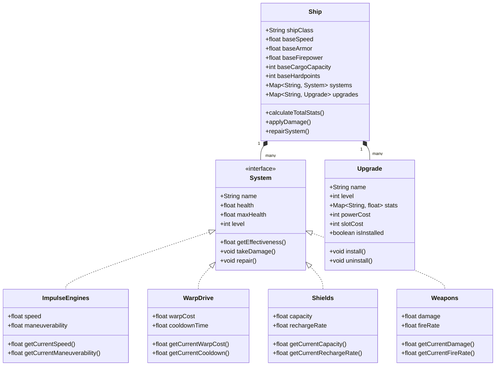

**Design Notes:**
1. **Ship Class**
   - Core container for all ship-related functionality
   - Maintains base stats that are modified by systems and upgrades
   - Uses composition over inheritance for systems and upgrades
   - Implements observer pattern for system state changes
   - Handles power grid management and slot allocation

2. **System Interface**
   - Defines common interface for all ship systems
   - Enforces consistent health/damage tracking
   - Provides standardized effectiveness calculation
   - Supports level-based progression
   - Implements state pattern for operational states

3. **Upgrade System**
   - Manages upgrade installation and removal
   - Tracks power consumption and slot usage
   - Handles upgrade compatibility checks
   - Supports upgrade stacking with diminishing returns
   - Maintains upgrade history for repair costs

4. **Concrete Systems**
   - Each system implements specific behavior
   - Systems can affect other systems (e.g., damaged engines affect shield recharge)
   - Systems maintain their own state and effectiveness calculations
   - Systems can be temporarily disabled or permanently destroyed
   - Systems support both automatic and manual control modes

#### Ship Damage State Diagram
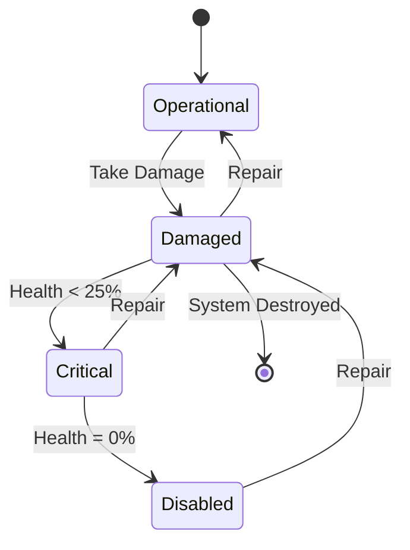

**Design Notes:**
1. **State Transitions**
   - Damage thresholds trigger state changes (25%, 50%, 75%, 100%)
   - Each state has unique visual and audio feedback
   - State changes can trigger cascading effects on other systems
   - Repair effectiveness varies by state
   - Critical state has chance of system failure

2. **Operational State**
   - System functioning at 100% effectiveness
   - Normal power consumption
   - No performance penalties
   - Can take damage from various sources
   - Supports all normal operations

3. **Damaged State**
   - Effectiveness reduced proportionally to damage
   - Increased power consumption
   - Visual and audio warnings
   - Can be repaired with kits or at station
   - May affect related systems

4. **Critical State**
   - Severe performance penalties
   - High power consumption
   - Constant warning indicators
   - Risk of cascading failures
   - Limited repair options

5. **Disabled State**
   - System completely non-functional
   - No power consumption
   - Requires station repair
   - May affect ship class capabilities
   - Can be replaced if destroyed

#### Ship Upgrade Sequence Diagram
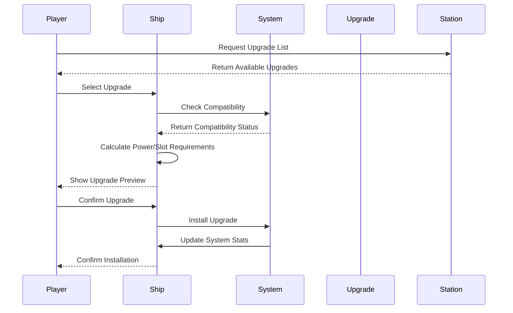

**Design Notes:**
1. **Upgrade Selection**
   - Upgrades filtered by ship class and current systems
   - Cost and requirements clearly displayed
   - Preview of stat changes available
   - Compatibility checks performed
   - Power grid impact calculated

2. **Installation Process**
   - Validates power grid capacity
   - Checks slot availability
   - Handles upgrade conflicts
   - Manages upgrade dependencies
   - Updates system stats

3. **Station Interaction**
   - Station maintains upgrade inventory
   - Prices vary by faction and reputation
   - Installation time scales with complexity
   - Supports upgrade removal and replacement
   - Handles upgrade storage

4. **System Integration**
   - Updates affected system stats
   - Recalculates ship performance
   - Updates UI elements
   - Triggers appropriate animations
   - Saves upgrade state

#### Ship Repair Activity Diagram
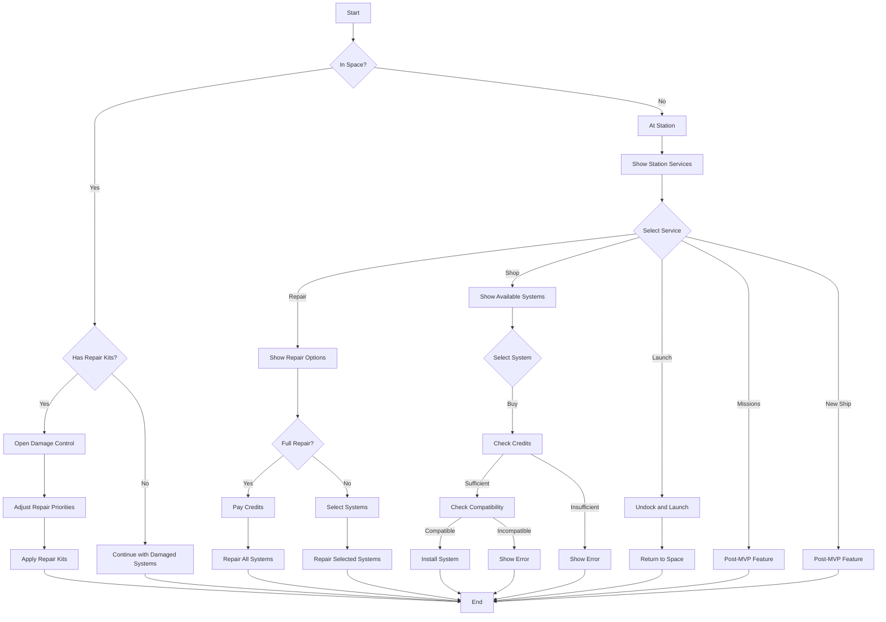

**Design Notes:**
1. **In-Space Repairs**
   - Limited by available repair kits
   - Repair effectiveness based on kit level
   - Can prioritize critical systems
   - Takes time to complete
   - May require power management

2. **Station Services**
   - Clear menu interface for all services
   - Easy navigation between options
   - Quick access to critical functions
   - Missions placeholder for future expansion
   - New Ship feature for post-MVP
   - Consistent UI across all services

3. **Station Repairs**
   - Full system restoration available
   - Cost scales with damage and ship class
   - Time required based on damage level
   - Can repair specific systems
   - May require faction standing

4. **System Shop**
   - Browse available systems
   - Compare with current systems
   - Check compatibility
   - View cost and requirements
   - Preview performance changes
   - System slot management
   - Power grid requirements
   - Upgrade paths

5. **Launch Sequence**
   - Quick undock process
   - Return to previous space state
   - Maintain ship configuration
   - Preserve repair progress
   - Update system status

6. **Damage Control**
   - Real-time system status display
   - Repair priority management
   - Power allocation controls
   - System isolation options
   - Emergency repair protocols

7. **Repair Kits**
   - Different levels of effectiveness
   - Limited inventory space
   - Can be purchased or looted
   - Specialized kits for different systems
   - Degrade with use

#### Ship System Component Diagram
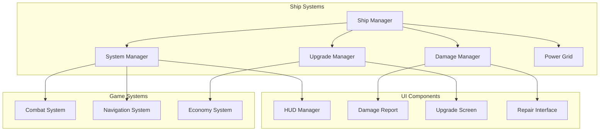

**Design Notes:**
1. **Ship Manager**
   - Central coordination of all ship systems
   - Handles system interactions
   - Manages power distribution
   - Coordinates damage events
   - Maintains ship state

2. **System Manager**
   - Individual system controllers
   - System-specific behavior
   - Performance calculations
   - State management
   - Event handling

3. **Damage Manager**
   - Damage calculation and application
   - System state tracking
   - Repair coordination
   - Damage effects
   - Failure handling

4. **Upgrade Manager**
   - Upgrade installation
   - Compatibility checking
   - Power management
   - Slot allocation
   - Upgrade effects

5. **UI Components**
   - Real-time status display
   - Damage visualization
   - Upgrade interface
   - Repair controls
   - System monitoring

6. **Game Systems Integration**
   - Combat system interaction
   - Navigation system effects
   - Economy system integration
   - Faction system impact
   - Mission system requirements

### UI Mockups

#### Ship Systems HUD
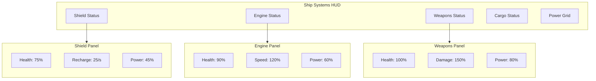

**Design Notes:**
1. **Layout**
   - Minimalist design with clear status indicators
   - Color-coded health states (green, yellow, red)
   - Power usage shown as percentage bars
   - System effectiveness shown as percentage
   - Quick access to detailed views

2. **Visual Elements**
   - Circular health indicators
   - Linear power bars
   - Pulsing effects for critical systems
   - Warning indicators for damaged systems
   - System icons with status overlays

3. **Interaction**
   - Click to expand system details
   - Hover for quick stats
   - Drag to reorder systems
   - Right-click for quick actions
   - Double-click for full control

#### Damage Report Screen
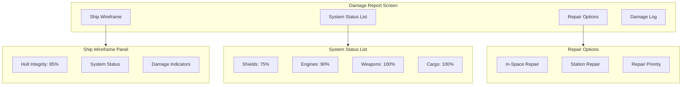

**Design Notes:**
1. **Ship Wireframe**
   - 3D wireframe model of ship
   - Color-coded damage indicators
   - Interactive system selection
   - Rotating view option
   - Zoom capability

2. **System Status**
   - Detailed health percentages
   - Damage type indicators
   - Repair requirements
   - System dependencies
   - Performance impacts

3. **Repair Interface**
   - Repair kit inventory
   - Station repair costs
   - Repair time estimates
   - Priority setting
   - Resource requirements

#### System Upgrade Interface
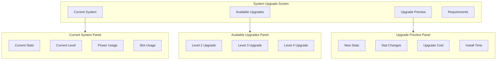

**Design Notes:**
1. **Current System Display**
   - Current level and stats
   - Power and slot usage
   - System limitations
   - Upgrade history
   - Performance metrics

2. **Upgrade Selection**
   - Filtered by compatibility
   - Sorted by level/effectiveness
   - Cost comparison
   - Power impact
   - Slot requirements

3. **Preview Panel**
   - Stat change visualization
   - Cost breakdown
   - Installation time
   - Power grid impact
   - Compatibility check

#### Power Grid Interface
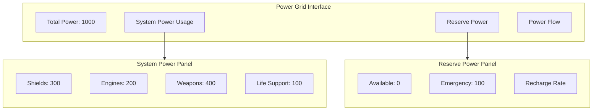

**Design Notes:**
1. **Power Distribution**
   - Real-time power allocation
   - System priority settings
   - Power flow visualization
   - Emergency power reserves
   - Power efficiency metrics

2. **System Power Management**
   - Individual system controls
   - Power priority settings
   - Power saving modes
   - Overload protection
   - Power routing options

3. **Reserve Power**
   - Emergency power allocation
   - Recharge rate control
   - Power conservation modes
   - System shutdown options
   - Power grid stability

#### Warp Drive Sequence Diagram
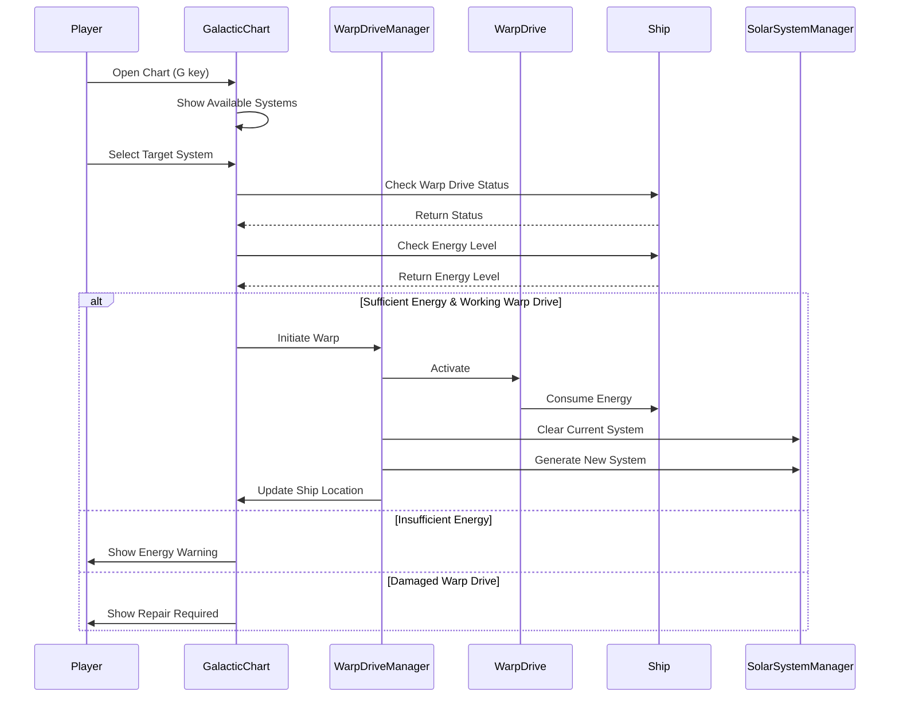

#### Damage Control Sequence Diagram
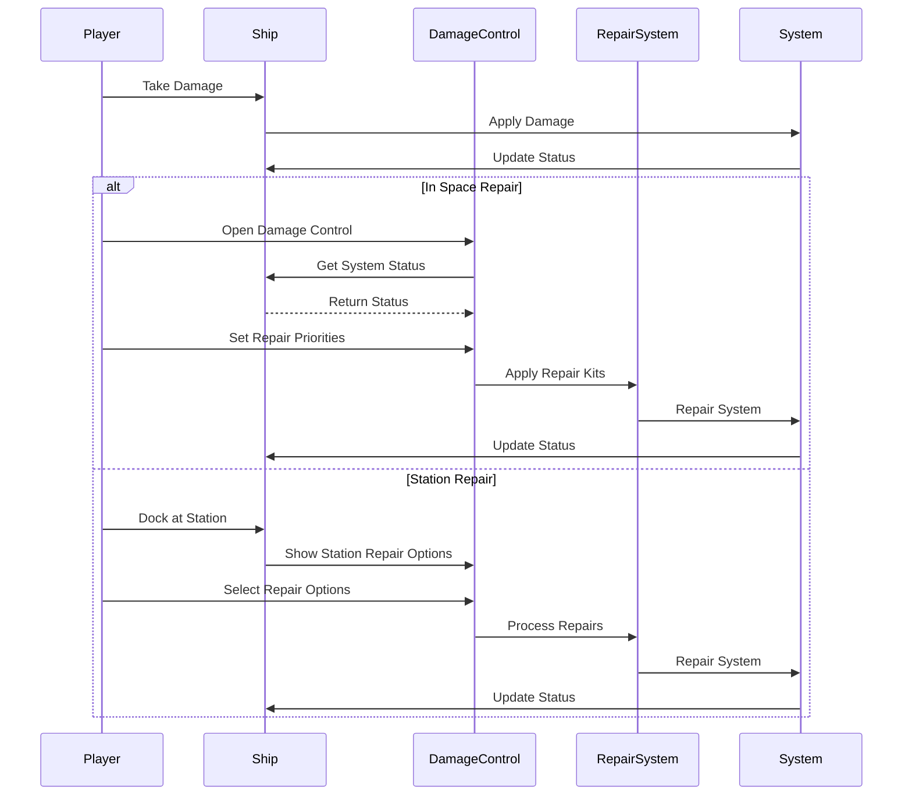

#### Station Interaction Sequence Diagram
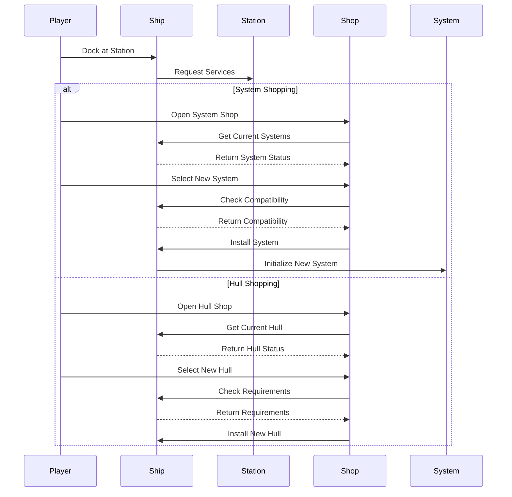

#### System Shop Sequence Diagram
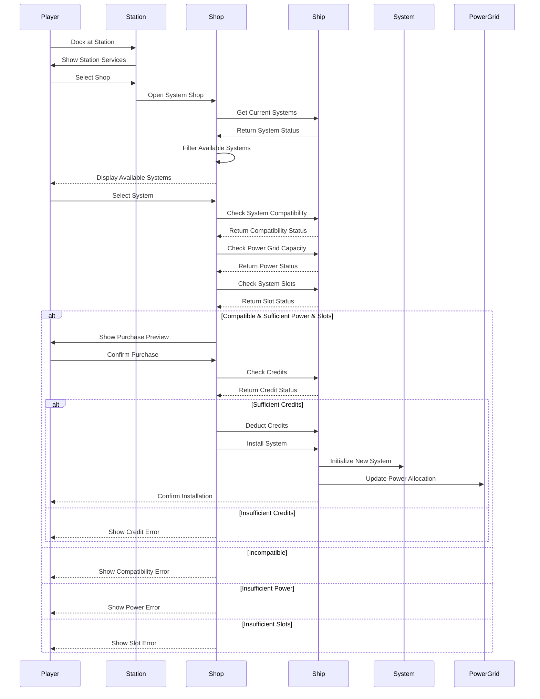

**Design Notes:**
1. **Shop Initialization**
   - Loads available systems based on station type
   - Filters systems by compatibility
   - Checks current ship configuration
   - Updates available systems list
   - Maintains purchase history

2. **System Selection**
   - Shows system specifications
   - Displays compatibility status
   - Shows power requirements
   - Lists slot requirements
   - Provides performance preview

3. **Compatibility Check**
   - Verifies system type compatibility
   - Checks power grid capacity
   - Validates system slots
   - Ensures upgrade path compatibility
   - Maintains system dependencies

4. **Purchase Process**
   - Validates credit balance
   - Handles credit transaction
   - Manages system installation
   - Updates power grid
   - Confirms successful installation

5. **Error Handling**
   - Clear error messages
   - Specific failure reasons
   - Suggested solutions
   - Alternative options
   - Help documentation

6. **System Installation**
   - Graceful system integration
   - Power grid adjustment
   - Performance calibration
   - State initialization
   - UI updates
