# Technical Design Document

## Core Use Cases

### 1. Star System Generation and Management
- Generate a new star system with random seed
- Create and manage celestial bodies (star, planets, moons)
- Apply realistic orbital mechanics using Kepler's laws
- Handle gravitational interactions between bodies
- Manage spatial partitioning for efficient physics calculations

### 2. Celestial Body Visualization
- Render star with appropriate color and light emission
- Generate and render planets with procedural terrain
- Create and render moons with appropriate properties
- Apply atmospheric effects to planets
- Add cloud layers to planets
- Implement ocean rendering with wave effects

### 3. Camera and View Controls
- Free camera movement in normal mode
- Orbit controls for focused viewing
- Camera roll functionality (Option+Command+Drag)
- Zoom controls with mouse wheel
- Touch controls for mobile devices

### 4. Debug and Edit Modes

#### 4.1 Debug Mode (CTRL+D)
- Toggle debug information display
- Show FPS counter
- Display celestial body statistics
- Show debug helpers (axes, grid)
- Update debug panel in real-time

#### 4.2 Edit Mode (CTRL+E)
- Toggle edit panel
- Initialize GUI container
- Create property controls
- Add terraforming tools
- Handle input validation
- Update visual feedback
- Manage camera controls
- Handle touch interactions

#### 4.3 Tab Cycling in Edit Mode

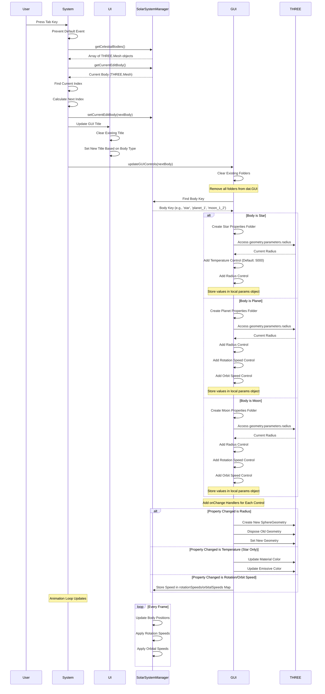

### 5. Planet Customization
- Select planet type (Class-M, Class-L, Class-H, etc.)
- Adjust terrain parameters:
  - Height
  - Noise scale
  - Octaves
  - Persistence
  - Lacunarity
- Modify surface properties:
  - Roughness
  - Detail scale
- Configure atmosphere:
  - Color
  - Rayleigh scattering
  - Mie coefficient
  - Scale
- Adjust ocean settings:
  - Enable/disable
  - Depth
  - Wave properties
  - Foam effects
- Configure cloud layers:
  - Coverage
  - Density
  - Speed
  - Turbulence
  - Color

### 6. Performance Optimization
- Spatial partitioning for physics calculations
- Chunk-based terrain generation
- Level of detail management
- Efficient rendering techniques
- Memory management for celestial bodies

### 7. User Interface
- Responsive design
- Modal dialogs for settings
- Tooltips for controls
- Keyboard shortcuts
- Touch interface support
- Debug information display
- Edit mode controls

### 8. Data Management
- Star system data structure
- Celestial body properties
- Orbital elements storage
- Physics parameters
- User preferences
- System state management

## Use Case Diagram

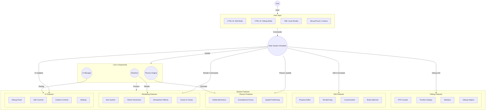

## Class Diagrams

### Core System Classes

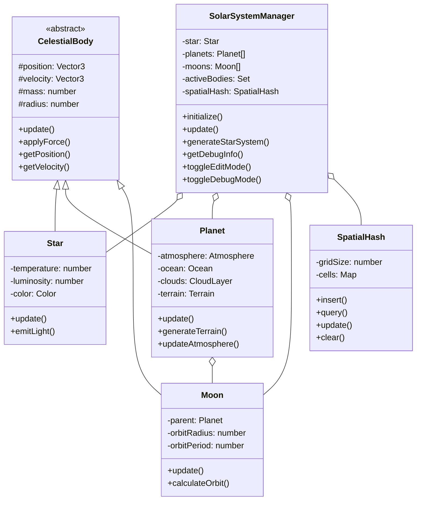

### Physics and Rendering Classes

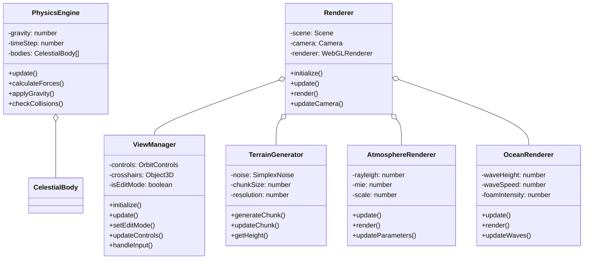

### UI and Input Classes

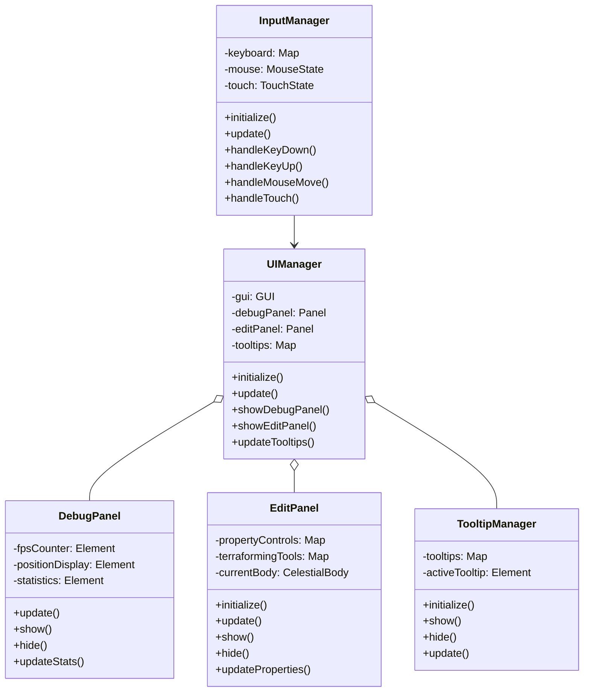

## Sequence Diagrams

### 1. Star System Generation and Management

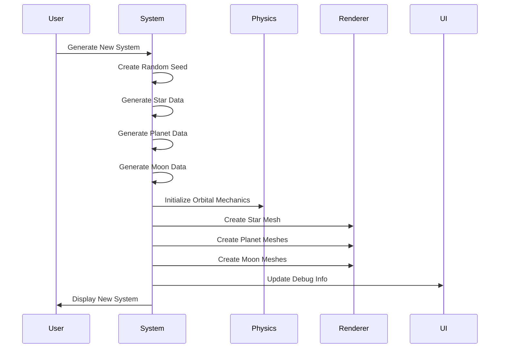

### 2. Celestial Body Visualization

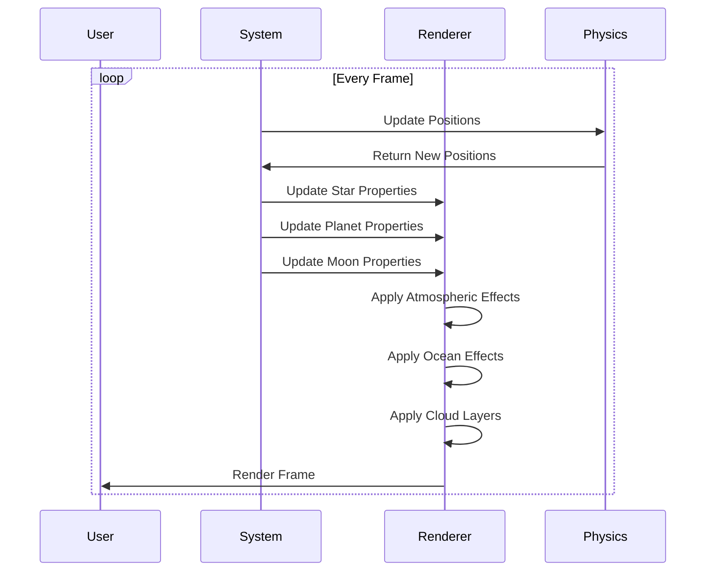

### 3. Camera and View Controls

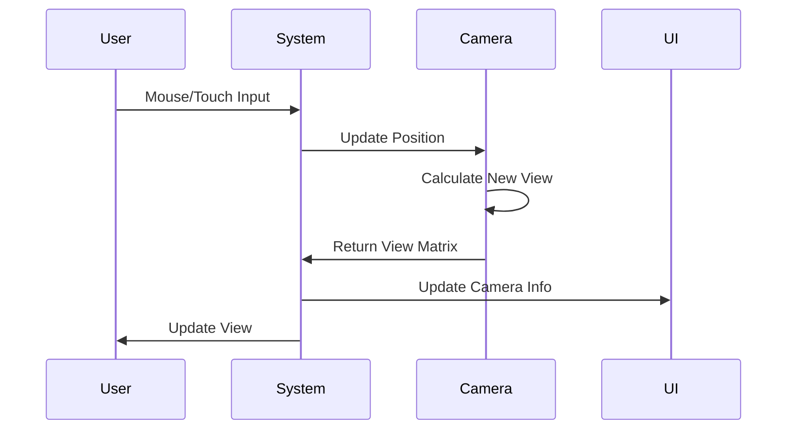

### 4. Debug and Edit Modes

#### 4.1 Debug Mode (CTRL+D)

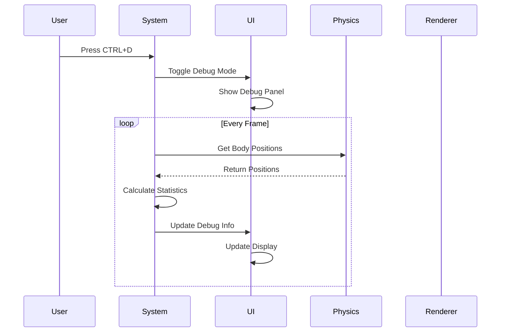

#### 4.2 Edit Mode (CTRL+E)

```mermaid
sequenceDiagram
    participant User
    participant System
    participant UI
    participant Physics
    participant Renderer
    participant ViewManager

    User->>System: Press CTRL+E
    System->>ViewManager: Set Edit Mode
    ViewManager->>ViewManager: Hide Crosshairs
    ViewManager->>ViewManager: Enable Orbit Controls
    ViewManager->>ViewManager: Set Target to Origin
    System->>System: Show Debug Helpers
    System->>System: Add Edit Mode Class
    System->>UI: Toggle Edit Mode
    UI->>UI: Show Edit Panel
    UI->>UI: Initialize GUI Container
    UI->>UI: Create Title Element
    UI->>UI: Add Property Controls
    UI->>UI: Add Terraforming Tools
    UI->>UI: Add Save/Cancel Buttons
    UI->>UI: Position Panel Elements
    UI->>UI: Add Event Listeners
    UI->>UI: Initialize Tooltips
    UI->>UI: Setup Input Validation
    UI->>UI: Update Display

    System->>System: Get Celestial Bodies
    System->>System: Set Current Edit Body
    System->>System: Cycle Bodies
    System->>UI: Update Body Info
    UI->>UI: Update Title
    UI->>UI: Update Property Fields
    UI->>UI: Update Terraforming Tools
    UI->>UI: Validate Current Values
    UI->>UI: Update Tooltips
    UI->>UI: Update Display

    loop Animation Loop
        System->>ViewManager: Update Controls
        System->>System: Update Starfield
        System->>System: Update Solar System
        System->>System: Update Waves
        System->>System: Update Clouds
        System->>System: Update Atmosphere
        System->>System: Update Chunk Manager
        System->>UI: Update Debug Info
        System->>Renderer: Render Frame
    end

    User->>UI: Input Property Value
    UI->>UI: Validate Input
    alt Valid Input
        UI->>UI: Update Field Display
        UI->>UI: Show Success Indicator
    else Invalid Input
        UI->>UI: Show Error Message
        UI->>UI: Highlight Invalid Field
    end
    UI->>System: Submit Valid Changes
    System->>Physics: Update Body Properties
    Physics->>Renderer: Update Visual Properties
    Renderer->>Renderer: Update Display
    System->>UI: Update Display
    UI->>UI: Update Property Fields
    UI->>UI: Update Terraforming Tools
    UI->>UI: Update Tooltips
    UI->>UI: Update Display

    User->>UI: Use Terraforming Tool
    UI->>UI: Update Brush Preview
    UI->>UI: Show Tool Settings
    UI->>UI: Update Cursor
    UI->>UI: Update Display

    Note over User, Renderer: Camera Controls
    Note right of ViewManager: - Option+Drag: Orbit
    Note right of ViewManager: - Command+Drag: Pan
    Note right of ViewManager: - Option+Command+Drag: Roll
    Note right of ViewManager: - Two-finger drag: Zoom

    Note over User, Renderer: Event Prevention
    Note right of System: - Prevent default browser behaviors
    Note right of System: - Stop event propagation
    Note right of System: - Handle modifier keys
    Note right of System: - Prevent context menu

    Note over User, Renderer: Debug Helpers
    Note right of System: - Show axes helper
    Note right of System: - Show grid helper
    Note right of System: - Update debug info

    Note over User, Renderer: Touch Controls
    Note right of System: - Two-finger pinch: Zoom
    Note right of System: - Touch duration tracking
    Note right of System: - Distance calculation
```

#### 4.3 Tab Cycling in Edit Mode

### 5. Planet Customization

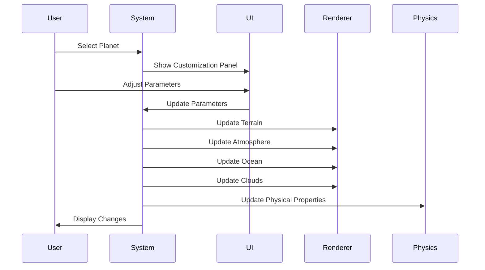

### 6. Performance Optimization

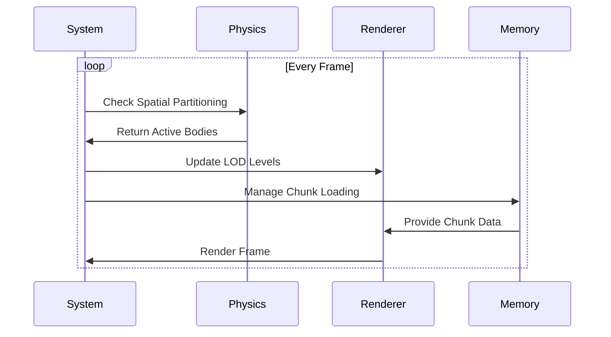

### 7. User Interface Management

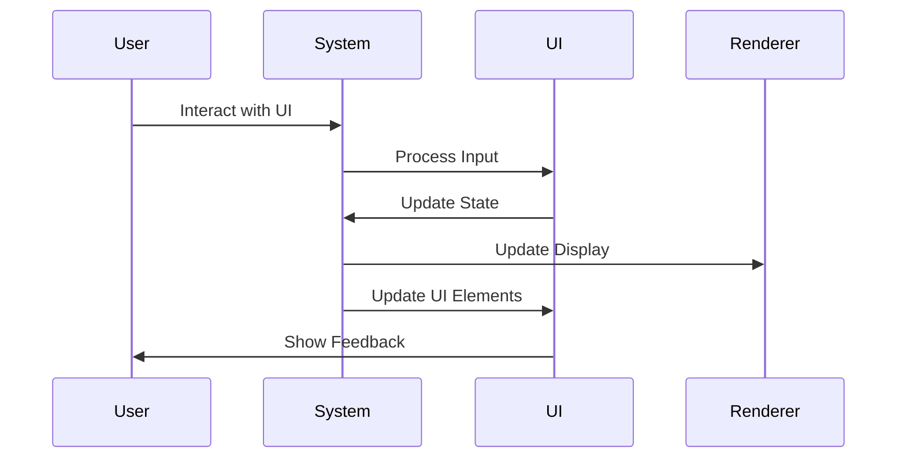

### 8. Data Management

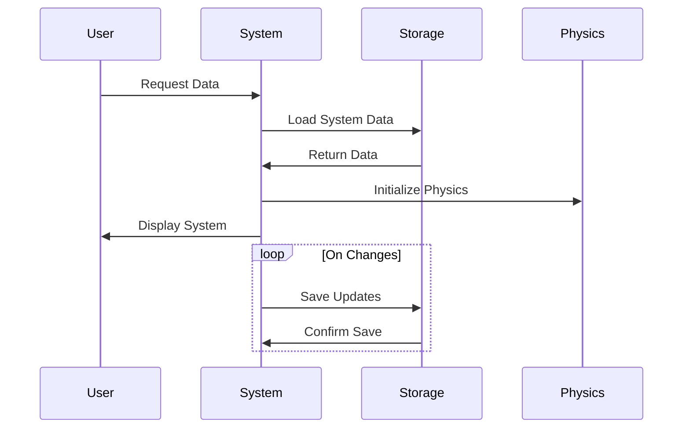

## Technical Considerations

### Performance
- Efficient physics calculations
- Optimized rendering pipeline
- Memory management
- Chunk loading/unloading
- Level of detail system

### Scalability
- Support for multiple star systems
- Extensible body type system
- Modular component architecture
- Configurable parameters

### Maintainability
- Clear code organization
- Modular design
- Consistent naming conventions
- Comprehensive documentation
- Debug tools and logging

### User Experience
- Intuitive controls
- Responsive interface
- Clear feedback
- Helpful tooltips
- Consistent behavior 