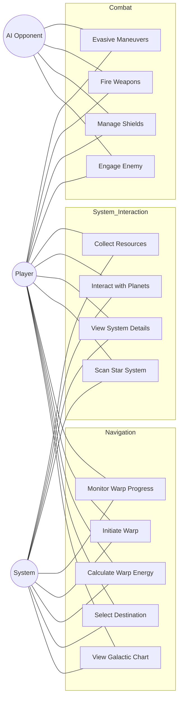
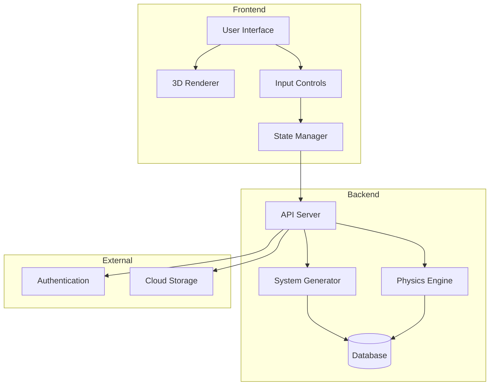
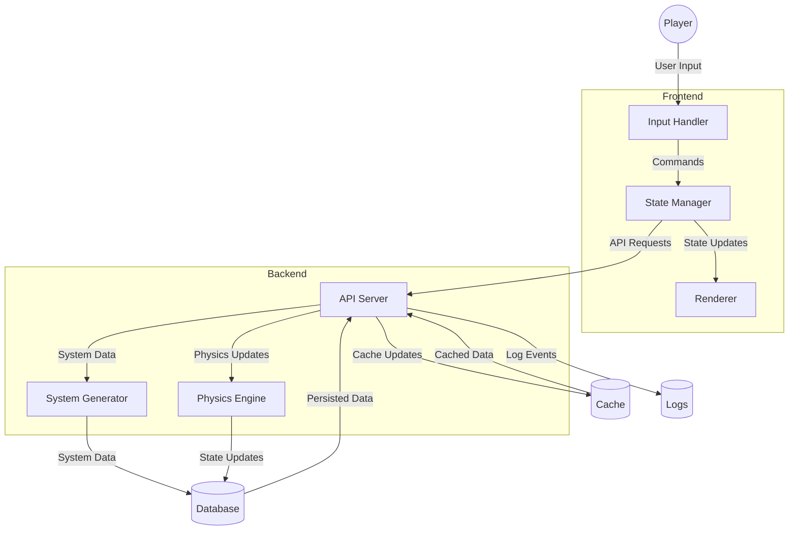

# Technical Design Document

## System Architecture

### High-Level Overview
The system follows a client-server architecture with the following components:

1. **Frontend (Client)**
   - Web-based interface using Three.js for 3D rendering
   - Real-time visualization of star systems and navigation
   - Interactive controls for ship movement and system interaction

2. **Backend (Server)**
   - Python-based API server
   - Star system generation and management
   - Game state persistence
   - Real-time updates and synchronization

### Use Case Diagram


### Component Diagram


### Data Flow Diagram


## Technical Specifications

### Frontend Architecture

#### Core Components
1. **ViewManager**
   - Manages different views (galactic, system, combat)
   - Handles view transitions and state
   - Coordinates between different UI components

2. **StarfieldManager**
   - Renders and manages the starfield
   - Handles star movement and effects
   - Manages view transitions

3. **WarpDriveManager**
   - Controls warp drive functionality
   - Manages energy consumption
   - Handles warp effects and transitions

4. **SystemGenerator**
   - Generates star systems based on sector coordinates
   - Manages celestial body placement
   - Handles system persistence

#### State Management
- Centralized state management through ViewManager
- Real-time updates for ship position and system state
- Efficient state synchronization between components

### Backend Architecture

#### API Endpoints
1. **System Generation**
   - `/api/generate_star_system`
   - `/api/get_system_data`
   - `/api/update_system_state`

2. **Navigation**
   - `/api/calculate_warp_energy`
   - `/api/initiate_warp`
   - `/api/update_position`

3. **Game State**
   - `/api/get_game_state`
   - `/api/update_game_state`
   - `/api/save_game`

#### Database Schema
1. **Star Systems**
   ```sql
   CREATE TABLE star_systems (
       id SERIAL PRIMARY KEY,
       sector VARCHAR(2),
       seed INTEGER,
       created_at TIMESTAMP,
       updated_at TIMESTAMP
   );
   ```

2. **Celestial Bodies**
   ```sql
   CREATE TABLE celestial_bodies (
       id SERIAL PRIMARY KEY,
       system_id INTEGER,
       type VARCHAR(20),
       position_x FLOAT,
       position_y FLOAT,
       position_z FLOAT,
       properties JSONB
   );
   ```

3. **Game State**
   ```sql
   CREATE TABLE game_state (
       id SERIAL PRIMARY KEY,
       player_id INTEGER,
       current_sector VARCHAR(2),
       ship_energy FLOAT,
       last_updated TIMESTAMP
   );
   ```

### Performance Considerations

#### Frontend Optimization
1. **Rendering**
   - Use of WebGL for efficient 3D rendering
   - Level of detail (LOD) system for distant objects
   - Efficient particle systems for effects

2. **State Updates**
   - Batched state updates to minimize re-renders
   - Efficient event handling and propagation
   - Optimized collision detection

#### Backend Optimization
1. **System Generation**
   - Cached system generation results
   - Efficient seed-based generation
   - Optimized database queries

2. **Real-time Updates**
   - WebSocket for real-time communication
   - Efficient state synchronization
   - Optimized physics calculations

### Security Considerations

1. **Authentication**
   - JWT-based authentication
   - Secure session management
   - Role-based access control

2. **Data Protection**
   - Encrypted communication
   - Secure storage of game state
   - Input validation and sanitization

3. **Anti-Cheat Measures**
   - Server-side validation
   - Rate limiting
   - State verification

## Implementation Guidelines

### Code Organization

#### Frontend Structure
```
frontend/
├── static/
│   ├── js/
│   │   ├── views/
│   │   ├── components/
│   │   └── utils/
│   ├── css/
│   └── assets/
└── templates/
```

#### Backend Structure
```
backend/
├── api/
│   ├── routes/
│   ├── models/
│   └── services/
├── utils/
└── config/
```

### Development Workflow

1. **Setup**
   ```bash
   # Frontend
   npm install
   npm run dev

   # Backend
   python -m venv venv
   source venv/bin/activate
   pip install -r requirements.txt
   python app.py
   ```

2. **Testing**
   ```bash
   # Frontend
   npm run test

   # Backend
   pytest
   ```

3. **Deployment**
   ```bash
   # Frontend
   npm run build

   # Backend
   gunicorn app:app
   ```

### Best Practices

1. **Code Style**
   - Follow PEP 8 for Python
   - Use ESLint for JavaScript
   - Maintain consistent naming conventions

2. **Documentation**
   - JSDoc for JavaScript functions
   - Docstrings for Python functions
   - Keep README up to date

3. **Version Control**
   - Feature branch workflow
   - Meaningful commit messages
   - Regular code reviews

## Future Considerations

### Scalability
- Horizontal scaling of backend services
- Load balancing for API servers
- CDN integration for static assets

### Feature Expansion
- Multiplayer support
- Additional star system types
- Enhanced combat mechanics

### Performance Optimization
- WebAssembly integration
- Advanced caching strategies
- Optimized asset loading
