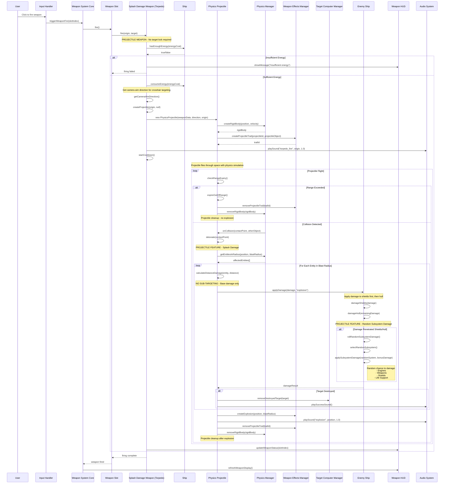

# Torpedo Weapon System - UML Sequence Diagram

This diagram shows the complete flow of torpedo weapon firing from user input through physics-based projectile simulation to damage application and HUD updates. Torpedoes are **projectile weapons** that do NOT require target lock and do NOT support sub-targeting, but can cause random subsystem damage.

## Key Features of Projectile Weapons (Torpedoes):

### **🚀 Physics-Based Projectiles**
- **Real Physics**: Projectiles have mass, velocity, and collision detection
- **Travel Time**: Realistic flight time to target
- **Range Limiting**: Projectiles expire at maximum range if no collision

### **💥 Splash Damage System**
- **Area of Effect**: Damage all entities within blast radius
- **Distance-Based Damage**: Damage decreases with distance from impact
- **Multiple Target Hits**: Can damage multiple enemies simultaneously

### **🎯 Free-Aim Targeting**
- **No Target Lock Required**: Fire toward crosshairs direction
- **Camera-Based Direction**: Uses camera quaternion for aim direction
- **Manual Aiming**: Player skill-based targeting system

### **🎲 Random Subsystem Damage**
- **Penetration Bonus**: When damage penetrates shields/hull, chance for subsystem damage
- **Random Target Selection**: Engines, Weapons, Shields, Life Support systems
- **Lucky Hits**: Simulates realistic combat where projectiles can hit critical components
- **No Precision Targeting**: Unlike beam weapons, cannot deliberately target subsystems

### **🔋 Energy-Based System**
- **Energy Consumption**: Uses ship's energy reserves
- **Energy Validation**: Comprehensive pre-fire energy checking
- **HUD Feedback**: Clear messaging for insufficient energy

### **⏱️ Projectile Lifecycle**
- **Creation**: Physics body created with initial velocity
- **Flight**: Continuous physics simulation and range checking
- **Collision**: Detection and immediate detonation
- **Expiry**: Range-based cleanup if no collision occurs
- **Cleanup**: Proper removal from physics world and scene 