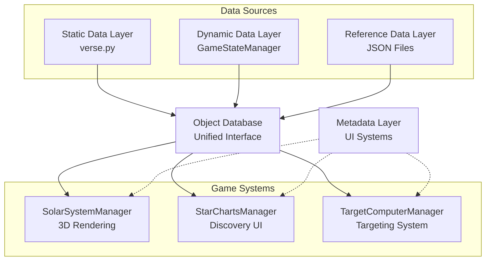
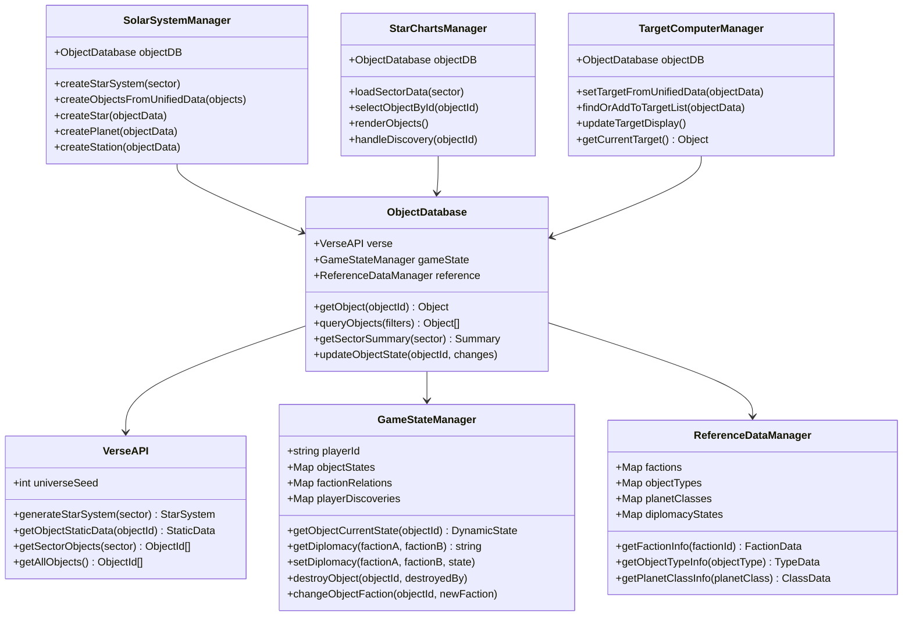
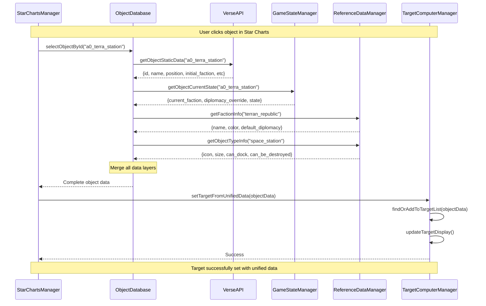
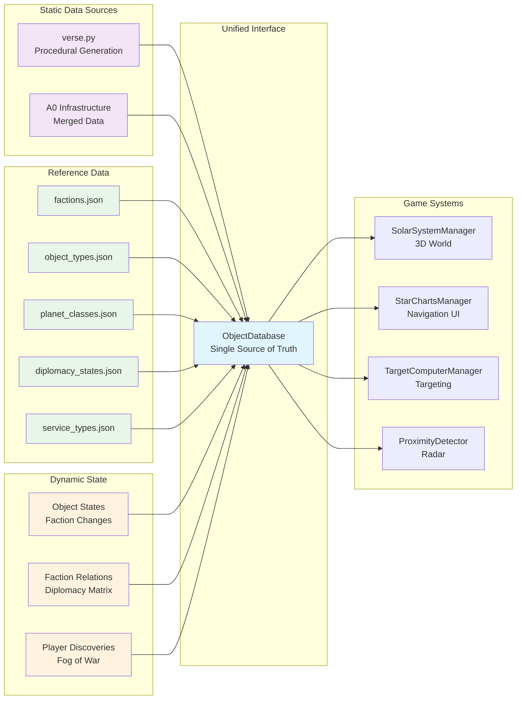
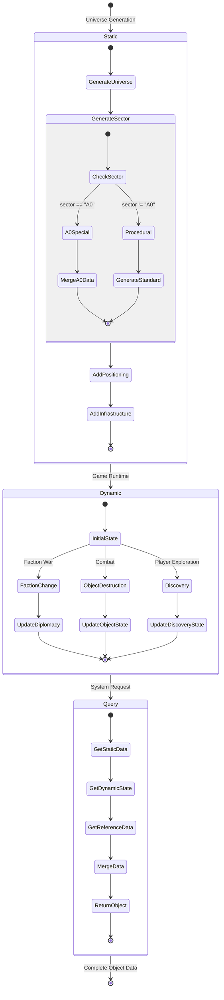

# Unified Data Architecture Refactor Plan

## Overview

This document outlines the refactor plan to implement a unified data architecture with proper separation of static, dynamic, reference, and metadata concerns. This will establish a single source of truth for all universe objects while maintaining clear boundaries between different types of data.

## Current State Analysis

### Existing Data Sources
1. **`backend/verse.py`** - Procedural universe generation (static data)
2. **`backend/PlanetTypes.py`** - Planet class definitions (reference data)
3. **`data/star_charts/objects.json`** - Static Star Charts database (mixed static/reference)
4. **`data/starter_system_infrastructure.json`** - A0 infrastructure (static data)
5. **Various managers** - Runtime state scattered across frontend systems

### Current Issues
- Multiple sources of truth for object data
- Data synchronization problems between systems
- Reference data mixed with code (PlanetTypes.py)
- Static A0 data split between verse.py and JSON files
- No unified faction diplomacy system
- Targeting system failures due to data inconsistencies

## Data Layer Architecture

### Architecture Overview



### 🔒 Static Data Layer (Seed-Deterministic)
**Purpose**: Universe layout and initial states that never change for a given seed
**Source**: Enhanced `verse.py` + merged A0 data
**Includes**:
- Object positions and orbital parameters
- Initial faction assignments
- Infrastructure layout (stations, beacons)
- Celestial body properties
- Initial diplomatic states
- Service capabilities

### ⚡ Dynamic Data Layer (Runtime State)
**Purpose**: Game state that changes during gameplay
**Source**: New `GameStateManager` + persistent storage
**Includes**:
- Current faction control of objects
- Faction diplomacy matrix (including player)
- Object destruction/damage states
- Player discovery states
- Temporary diplomatic overrides
- Mission-related state changes

### 📚 Reference Data Layer (Constants)
**Purpose**: Lookup tables and game rules that never change
**Source**: JSON configuration files
**Includes**:
- Faction definitions (colors, names, default diplomacy)
- Object type definitions (icons, sizes, capabilities)
- Planet class definitions (moved from PlanetTypes.py)
- Diplomacy state definitions
- Service type definitions
- Technology level definitions

### 🎯 Metadata Layer (Ephemeral)
**Purpose**: UI and system state that doesn't persist
**Source**: Individual system managers
**Includes**:
- Mission waypoints
- UI selections and zoom states
- Proximity detection cache
- Targeting system state
- Navigation breadcrumbs

## Object ID System Design

### ID Pattern: Hierarchical Namespace with Reservations

To handle both deterministic procedural objects and unique runtime objects, we use a hierarchical namespace pattern that prevents collisions while maintaining consistency.

#### ID Format Structure
```
{namespace}_{sector}_{type}_{identifier}
```

#### Namespace Categories

**Procedural Objects (Deterministic)**
```python
# Format: proc_{sector}_{type}_{identifier}
"proc_A0_star_sol"                    # Named objects use sanitized names
"proc_A0_planet_terra_prime"          # Spaces become underscores  
"proc_A0_moon_luna"                   # Apostrophes removed
"proc_A0_station_terra_station"       # Infrastructure from templates
"proc_B3_planet_a1b2c3d4"            # Unnamed objects use deterministic hash
"proc_B3_asteroid_e5f6g7h8"          # Generated asteroids
```

**Runtime Objects (Unique)**
```python
# Format: runtime_{sector}_{type}_{creator}_{counter}_{timestamp}
"runtime_A0_station_player_001_12345"  # Player-built station
"runtime_A0_ship_ai_pirate_042_67890"  # AI-spawned pirate ship
"runtime_B3_facility_player_003_54321" # Player mining facility
"runtime_A0_cargo_system_001_98765"    # System-spawned cargo pods
```

**Mission Objects (Temporary)**
```python
# Format: mission_{sector}_{type}_{mission_identifier}
"mission_A0_waypoint_tutorial_001"     # Tutorial waypoint
"mission_B3_target_escort_convoy_alpha" # Escort mission target
"mission_A0_beacon_distress_signal_42"  # Distress beacon
```

#### ObjectIDGenerator Implementation

```python
# backend/id_generator.py
import hashlib
import time

class ObjectIDGenerator:
    def __init__(self, universe_seed):
        self.universe_seed = universe_seed
        self.runtime_counters = {}  # Per-sector, per-type counters
        
    def generate_procedural_id(self, sector, object_type, name_or_seed):
        """Generate deterministic ID for procedural objects"""
        # Use consistent naming for procedural objects
        if isinstance(name_or_seed, str):
            # For named objects (stars, planets with fixed names)
            clean_name = self._sanitize_name(name_or_seed)
            return f"proc_{sector}_{object_type}_{clean_name}"
        else:
            # For unnamed objects, use deterministic hash
            deterministic_hash = self._generate_deterministic_hash(
                sector, object_type, name_or_seed, self.universe_seed
            )
            return f"proc_{sector}_{object_type}_{deterministic_hash[:8]}"
    
    def generate_runtime_id(self, sector, object_type, creator="system"):
        """Generate unique ID for runtime-created objects"""
        key = f"{sector}_{object_type}_{creator}"
        
        if key not in self.runtime_counters:
            self.runtime_counters[key] = 0
        
        self.runtime_counters[key] += 1
        counter = self.runtime_counters[key]
        
        # Add timestamp component for absolute uniqueness
        timestamp = int(time.time() * 1000) % 100000  # Last 5 digits
        
        return f"runtime_{sector}_{object_type}_{creator}_{counter:03d}_{timestamp}"
    
    def generate_mission_id(self, sector, mission_type, mission_id):
        """Generate ID for mission-related objects"""
        return f"mission_{sector}_{mission_type}_{mission_id}"
    
    def _sanitize_name(self, name):
        """Convert name to ID-safe format"""
        return name.lower().replace(' ', '_').replace("'", "")
    
    def _generate_deterministic_hash(self, sector, object_type, seed, universe_seed):
        """Generate deterministic hash for unnamed procedural objects"""
        combined = f"{universe_seed}_{sector}_{object_type}_{seed}"
        return hashlib.md5(combined.encode()).hexdigest()
```

#### Enhanced verse.py Integration

```python
# Enhanced generate_starter_system() with proper ID assignment
def generate_starter_system():
    """Generate A0 system with proper ID assignment"""
    # Use existing global seed or get from environment
    universe_seed = get_current_universe_seed()
    id_gen = ObjectIDGenerator(universe_seed)
    
    star_system = {
        'sector': 'A0',
        'star': {
            'id': id_gen.generate_procedural_id('A0', 'star', 'Sol'),
            'name': 'Sol',
            'type': 'yellow_dwarf',
            'position': [0, 0, 0],
            # ... other properties
        },
        'celestial_bodies': [],
        'infrastructure': []
    }
    
    # Generate planets with deterministic IDs and positions
    terra_prime = {
        'id': id_gen.generate_procedural_id('A0', 'planet', 'Terra Prime'),
        'name': 'Terra Prime',
        'type': 'planet',
        'subtype': 'Class-M',
        'parent_id': star_system['star']['id'],
        'position': [149.6, 0, 0],  # Earth-like orbit distance
        'orbit': {
            'parent': star_system['star']['id'],
            'radius': 149.6,
            'angle': 0,
            'period': 365
        },
        'size': 1.2,
        'initial_faction': 'friendly',
        'initial_state': 'inhabited',
        'moons': []
    }
    
    # Generate moons with positions relative to planet
    luna = {
        'id': id_gen.generate_procedural_id('A0', 'moon', 'Luna'),
        'name': 'Luna',
        'type': 'moon', 
        'subtype': 'rocky',
        'parent_id': terra_prime['id'],
        'position': [151.096, 0, 0],  # 1.496 units from Terra Prime
        'orbit': {
            'parent': terra_prime['id'],
            'radius': 1.496,
            'angle': 0,
            'period': 27.3
        },
        'size': 0.3,
        'initial_faction': 'friendly',
        'initial_state': 'barren'
    }
    
    europa = {
        'id': id_gen.generate_procedural_id('A0', 'moon', 'Europa'),
        'name': 'Europa',
        'type': 'moon',
        'subtype': 'ice',
        'parent_id': terra_prime['id'],
        'position': [148.104, 0, 0],  # Calculated from Terra Prime + orbital angle
        'orbit': {
            'parent': terra_prime['id'],
            'radius': 1.496,
            'angle': 180,  # Opposite side from Luna
            'period': 27.3
        },
        'size': 0.25,
        'initial_faction': 'neutral',
        'initial_state': 'research_station'
    }
    
    terra_prime['moons'] = [luna, europa]
    star_system['celestial_bodies'] = [terra_prime]
    
    # Generate infrastructure with deterministic IDs
    # Load existing A0 infrastructure and convert to new format
    try:
        infrastructure_data = load_starter_infrastructure_template()
        for station_template in infrastructure_data.get('stations', []):
            station = {
                'id': id_gen.generate_procedural_id('A0', 'station', station_template['name']),
                'name': station_template['name'],
                'type': 'space_station',
                'subtype': station_template.get('type', 'station'),
                'position': station_template.get('position', [0, 0, 0]),
                'initial_faction': station_template.get('faction', 'neutral'),
                'initial_state': 'operational',
                'services': station_template.get('services', []),
                'size': station_template.get('size', 1.0)
            }
            star_system['infrastructure'].append(station)
        
        # Add beacons
        for beacon_template in infrastructure_data.get('beacons', []):
            beacon = {
                'id': id_gen.generate_procedural_id('A0', 'beacon', beacon_template['name']),
                'name': beacon_template['name'],
                'type': 'navigation_beacon',
                'subtype': 'navigation',
                'position': beacon_template.get('position', [0, 0, 0]),
                'initial_faction': 'neutral',
                'initial_state': 'active'
            }
            star_system['infrastructure'].append(beacon)
            
    except Exception as e:
        print(f"Warning: Could not load infrastructure template: {e}")
        # Continue without infrastructure if file not found
    
    return star_system
```

#### Runtime Object Management

```python
# backend/runtime_object_manager.py
class RuntimeObjectManager:
    def __init__(self, object_database):
        self.object_db = object_database
        self.id_gen = object_database.id_generator
    
    def create_player_station(self, sector, position, station_type, player_id):
        """Create player-built station"""
        station_id = self.id_gen.generate_runtime_id(
            sector, 'station', f'player_{player_id}'
        )
        
        station_data = {
            'id': station_id,
            'name': f'Player Station {station_id.split("_")[-2]}',
            'type': 'space_station',
            'subtype': station_type,
            'position': position,
            'faction': f'player_{player_id}',
            'created_by': player_id,
            'created_at': get_game_time(),
            'state': 'operational'
        }
        
        # Add to dynamic state (not static verse.py data)
        self.object_db.game_state.add_runtime_object(station_id, station_data)
        return station_id
    
    def spawn_enemy_ship(self, sector, position, ship_type, faction):
        """Spawn enemy ship"""
        ship_id = self.id_gen.generate_runtime_id(
            sector, 'ship', f'ai_{faction}'
        )
        
        ship_data = {
            'id': ship_id,
            'name': f'{faction.title()} {ship_type}',
            'type': 'ship',
            'subtype': ship_type,
            'position': position,
            'faction': faction,
            'created_by': 'ai_system',
            'created_at': get_game_time(),
            'state': 'active'
        }
        
        self.object_db.game_state.add_runtime_object(ship_id, ship_data)
        return ship_id
```

#### ObjectDatabase Integration

```python
# Enhanced ObjectDatabase with ID management
class ObjectDatabase:
    def __init__(self, universe_seed, player_id="player"):
        self.universe_seed = universe_seed
        self.player_id = player_id
        self.id_generator = ObjectIDGenerator(universe_seed)
        
        # Initialize core components first
        self.verse = VerseAdapter(universe_seed, self.id_generator)
        self.game_state = GameStateManager(universe_seed, player_id)
        self.reference = ReferenceDataManager()
        
        # Initialize dependent components after core is ready
        self.runtime_manager = None
        self.waypoint_manager = None
        self._initialize_managers()
    
    def _initialize_managers(self):
        """Initialize managers that depend on ObjectDatabase being ready"""
        self.runtime_manager = RuntimeObjectManager(self)
        self.waypoint_manager = MissionWaypointManager(self)
    
    def get_object(self, object_id):
        """Get object from appropriate source based on ID namespace"""
        if not object_id:
            return None
            
        try:
            namespace = object_id.split('_')[0]
        except (AttributeError, IndexError):
            print(f"Warning: Invalid object ID format: {object_id}")
            return None
        
        try:
            if namespace == 'proc':
                # Get from verse.py (static procedural data)
                static_data = self.verse.get_object_static_data(object_id)
                if not static_data:
                    return None
                dynamic_state = self.game_state.get_object_current_state(object_id)
                return self._merge_object_data(static_data, dynamic_state)
                
            elif namespace == 'runtime':
                # Get from runtime object manager (dynamic data)
                return self.game_state.get_runtime_object(object_id)
                
            elif namespace == 'mission':
                # Get from mission metadata (ephemeral)
                if hasattr(self, 'metadata') and self.metadata:
                    return self.metadata.get_waypoint(object_id)
                return None
                
            else:
                print(f"Warning: Unknown object ID namespace: {namespace}")
                return None
                
        except Exception as e:
            print(f"Error retrieving object {object_id}: {e}")
            return None
    
    def _merge_object_data(self, static_data, dynamic_state):
        """Merge static and dynamic data for an object"""
        if not static_data:
            return None
            
        # Start with static data
        merged = dict(static_data)
        
        # Apply dynamic overrides if they exist
        if dynamic_state:
            # Update faction if changed
            if 'current_faction' in dynamic_state:
                merged['faction'] = dynamic_state['current_faction']
            
            # Update state if changed
            if 'current_state' in dynamic_state:
                merged['state'] = dynamic_state['current_state']
            
            # Add dynamic metadata
            merged['last_updated'] = dynamic_state.get('last_updated')
            merged['is_dynamic'] = True
        else:
            merged['is_dynamic'] = False
        
        return merged
```

#### Benefits

**✅ Deterministic Procedural IDs**
- Same universe seed always generates same IDs
- Cross-platform consistency guaranteed
- Reproducible for testing and debugging

**✅ Collision-Free Runtime IDs**
- Namespace separation prevents conflicts
- Counter + timestamp ensures uniqueness
- Creator tracking for ownership/cleanup

**✅ Human-Readable Format**
- Easy to identify object type and origin
- Debugging-friendly structure
- Tool-friendly for editors and scripts

**✅ Scalable Architecture**
- Easy to add new namespaces
- Supports unlimited runtime objects
- Mission system doesn't pollute world state

## Implementation Plan

### Phase 1: Foundation Setup (2-3 days)

#### 1.1 Create Object ID System
```python
# backend/id_generator.py - New file
# Implement ObjectIDGenerator class as specified above
```

#### 1.2 Create Reference Data Files
```
data/reference/
├── factions.json           # Faction definitions
├── object_types.json       # Object type definitions  
├── planet_classes.json     # Moved from PlanetTypes.py
├── diplomacy_states.json   # Diplomacy definitions
├── service_types.json      # Service definitions
└── technology_levels.json  # Technology definitions
```

#### 1.3 Migrate PlanetTypes.py → planet_classes.json
- Convert Python dict to JSON format
- Remove random seed generation (handle in verse.py)
- Add editor-friendly structure
- Update verse.py imports

#### 1.4 Create ReferenceDataManager
```python
# backend/reference_data.py
class ReferenceDataManager:
    def __init__(self):
        self.factions = self._load_json('data/reference/factions.json')
        self.object_types = self._load_json('data/reference/object_types.json')
        self.planet_classes = self._load_json('data/reference/planet_classes.json')
        # ... etc
```

### Phase 2: Static Data Enhancement (2-3 days)

#### 2.1 Enhance verse.py with Positioning System
```python
def add_positioning_data(star_system):
    """Add 3D coordinates and orbital data to all objects"""
    # Add star at origin
    star_system["star_position"] = [0, 0, 0]
    star_system["star_id"] = f"{star_system['sector']}_star"
    
    # Calculate planet orbits
    for i, planet in enumerate(star_system["planets"]):
        orbit_radius = 100 + (i * 50)  # AU equivalent
        angle = (i * 60) % 360
        
        planet["id"] = generate_object_id(star_system['sector'], planet['planet_name'])
        planet["position"] = calculate_orbital_position(orbit_radius, angle)
        planet["orbit"] = {
            "parent": star_system["star_id"],
            "radius": orbit_radius,
            "angle": angle,
            "period": calculate_orbital_period(orbit_radius)
        }
        
        # Calculate moon positions relative to planet
        for j, moon in enumerate(planet.get("moons", [])):
            # ... moon positioning logic
```

#### 2.2 Merge A0 Data Sources
```python
def generate_starter_system():
    """Enhanced A0 system generation merging verse.py + infrastructure JSON"""
    # Base celestial data from existing generate_starter_system()
    base_system = generate_base_starter_system()
    
    # Load infrastructure from JSON
    infrastructure = load_starter_infrastructure()
    
    # Merge and add positioning
    complete_system = merge_starter_data(base_system, infrastructure)
    return add_positioning_data(complete_system)

def load_starter_infrastructure():
    """Load A0 infrastructure from JSON and convert to verse.py format"""
    with open('data/starter_system_infrastructure.json') as f:
        infra_data = json.load(f)
    
    return {
        "stations": convert_stations_to_verse_format(infra_data["stations"]),
        "beacons": convert_beacons_to_verse_format(infra_data["beacons"])
    }
```

#### 2.3 Add Infrastructure Generation for Other Sectors
```python
def generate_infrastructure(sector, seed):
    """Generate stations, beacons, facilities for non-A0 sectors"""
    if sector == "A0":
        return load_starter_infrastructure()
    else:
        return generate_procedural_infrastructure(sector, seed)

def generate_procedural_infrastructure(sector, seed):
    """Procedurally generate infrastructure based on sector and seed"""
    # Use seed to determine number and types of stations
    # Place them in logical orbital positions
    # Assign factions based on sector characteristics
```

### Phase 3: Dynamic State System (2-3 days)

#### 3.1 Create GameStateManager
```python
# backend/game_state.py
class GameStateManager:
    def __init__(self, universe_seed, player_id="player"):
        self.universe_seed = universe_seed
        self.player_id = player_id
        self.object_states = {}
        self.faction_relations = self._initialize_faction_matrix()
        self.player_discoveries = {}
        self.game_time = GameTime()
    
    def _initialize_faction_matrix(self):
        """Initialize faction diplomacy matrix including player"""
        factions = ReferenceDataManager().get_all_factions()
        matrix = {}
        
        # Initialize all faction pairs to default diplomacy
        for faction_a in factions:
            matrix[faction_a] = {}
            for faction_b in factions:
                if faction_a == faction_b:
                    matrix[faction_a][faction_b] = "allied"
                else:
                    default = factions[faction_b].get("default_diplomacy", "neutral")
                    matrix[faction_a][faction_b] = default
        
        # Add player as a faction
        matrix[self.player_id] = {}
        for faction in factions:
            player_relation = factions[faction].get("default_player_diplomacy", "neutral")
            matrix[self.player_id][faction] = player_relation
            matrix[faction][self.player_id] = player_relation
        
        return matrix
    
    def get_diplomacy(self, faction_a, faction_b):
        """Get current diplomacy between two factions"""
        return self.faction_relations.get(faction_a, {}).get(faction_b, "neutral")
    
    def set_diplomacy(self, faction_a, faction_b, new_state):
        """Update diplomacy between factions (e.g., war breaks out)"""
        if faction_a not in self.faction_relations:
            self.faction_relations[faction_a] = {}
        if faction_b not in self.faction_relations:
            self.faction_relations[faction_b] = {}
        
        self.faction_relations[faction_a][faction_b] = new_state
        self.faction_relations[faction_b][faction_a] = new_state
        
        # Log the change
        self._log_diplomacy_change(faction_a, faction_b, new_state)
```

#### 3.2 Object State Management
```python
def get_object_current_state(self, object_id):
    """Get complete current state of an object"""
    # Get static data from verse.py
    static_data = VerseAPI.get_object_static_data(object_id)
    
    # Get dynamic overrides
    dynamic_state = self.object_states.get(object_id, {})
    
    # Merge states with dynamic taking precedence
    current_state = {**static_data}
    
    # Apply dynamic faction if changed
    if "current_faction" in dynamic_state:
        current_state["faction"] = dynamic_state["current_faction"]
    
    # Apply dynamic diplomacy based on current faction
    if current_state.get("faction"):
        player_diplomacy = self.get_diplomacy(self.player_id, current_state["faction"])
        current_state["diplomacy"] = dynamic_state.get("diplomacy_override", player_diplomacy)
    
    # Apply destruction/damage state
    current_state["state"] = dynamic_state.get("current_state", static_data.get("initial_state", "operational"))
    
    return current_state

def destroy_object(self, object_id, destroyed_by=None):
    """Mark an object as destroyed"""
    self.update_object_state(object_id, {
        "current_state": "destroyed",
        "destroyed_by": destroyed_by,
        "destroyed_at": self.game_time.current()
    })

def change_object_faction(self, object_id, new_faction, changed_by=None):
    """Change faction control of an object"""
    self.update_object_state(object_id, {
        "current_faction": new_faction,
        "faction_changed_by": changed_by,
        "faction_changed_at": self.game_time.current()
    })
```

### Phase 4: Unified Object Database (2-3 days)

#### 4.1 Class Structure



#### 4.2 Create ObjectDatabase Interface
```python
# backend/object_database.py
class ObjectDatabase:
    def __init__(self, universe_seed, player_id="player"):
        self.verse = VerseAPI(universe_seed)
        self.game_state = GameStateManager(universe_seed, player_id)
        self.reference = ReferenceDataManager()
    
    def get_object(self, object_id):
        """Get complete object data with all layers merged"""
        # Get static data
        static_data = self.verse.get_object_static_data(object_id)
        if not static_data:
            return None
        
        # Get current dynamic state
        current_state = self.game_state.get_object_current_state(object_id)
        
        # Get reference data for object type
        object_type_info = self.reference.get_object_type_info(static_data["type"])
        
        # Get faction information
        faction_info = {}
        if current_state.get("faction"):
            faction_info = self.reference.get_faction_info(current_state["faction"])
        
        # Merge all data layers
        complete_object = {
            **static_data,
            **current_state,
            "type_info": object_type_info,
            "faction_info": faction_info,
            "last_updated": self.game_state.get_object_last_update(object_id)
        }
        
        return complete_object
    
    def query_objects(self, sector=None, object_type=None, faction=None, 
                     state=None, discovered_only=False):
        """Query objects with filters"""
        results = []
        
        # Get base object list from verse.py
        if sector:
            objects = self.verse.get_sector_objects(sector)
        else:
            objects = self.verse.get_all_objects()
        
        for obj_id in objects:
            obj = self.get_object(obj_id)
            if not obj:
                continue
            
            # Apply filters
            if object_type and obj.get("type") != object_type:
                continue
            if faction and obj.get("faction") != faction:
                continue
            if state and obj.get("state") != state:
                continue
            if discovered_only and not self.game_state.is_discovered(obj_id):
                continue
            
            results.append(obj)
        
        return results
    
    def get_sector_summary(self, sector):
        """Get summary of all objects in a sector"""
        objects = self.query_objects(sector=sector)
        
        summary = {
            "sector": sector,
            "total_objects": len(objects),
            "by_type": {},
            "by_faction": {},
            "by_state": {}
        }
        
        for obj in objects:
            # Count by type
            obj_type = obj.get("type", "unknown")
            summary["by_type"][obj_type] = summary["by_type"].get(obj_type, 0) + 1
            
            # Count by faction
            faction = obj.get("faction", "unaffiliated")
            summary["by_faction"][faction] = summary["by_faction"].get(faction, 0) + 1
            
            # Count by state
            state = obj.get("state", "unknown")
            summary["by_state"][state] = summary["by_state"].get(state, 0) + 1
        
        return summary
```

#### 4.3 Data Flow Sequence



#### 4.4 Create API Endpoints
```python
# backend/routes/object_database.py
@object_db_bp.route('/object/<object_id>')
def get_object(object_id):
    """Get complete object data"""
    obj = current_app.object_db.get_object(object_id)
    if not obj:
        return jsonify({"error": "Object not found"}), 404
    return jsonify(obj)

@object_db_bp.route('/objects')
def query_objects():
    """Query objects with filters"""
    sector = request.args.get('sector')
    object_type = request.args.get('type')
    faction = request.args.get('faction')
    state = request.args.get('state')
    discovered_only = request.args.get('discovered_only', 'false').lower() == 'true'
    
    objects = current_app.object_db.query_objects(
        sector=sector,
        object_type=object_type,
        faction=faction,
        state=state,
        discovered_only=discovered_only
    )
    
    return jsonify(objects)

@object_db_bp.route('/sector/<sector>/summary')
def get_sector_summary(sector):
    """Get sector summary"""
    summary = current_app.object_db.get_sector_summary(sector)
    return jsonify(summary)
```

### Phase 5: System Integration (3-4 days)

#### 5.1 Update SolarSystemManager
```javascript
// frontend/static/js/SolarSystemManager.js
class SolarSystemManager {
    async createStarSystem(sector) {
        // Replace direct verse.py calls with ObjectDatabase API
        const response = await fetch(`/api/objects?sector=${sector}`);
        const objects = await response.json();
        
        // Create 3D objects from unified data
        this.createObjectsFromUnifiedData(objects);
    }
    
    createObjectsFromUnifiedData(objects) {
        objects.forEach(obj => {
            switch(obj.type) {
                case 'star':
                    this.createStar(obj);
                    break;
                case 'planet':
                    this.createPlanet(obj);
                    break;
                case 'moon':
                    this.createMoon(obj);
                    break;
                case 'space_station':
                    this.createStation(obj);
                    break;
                case 'beacon':
                    this.createBeacon(obj);
                    break;
            }
        });
    }
}
```

#### 5.2 Update StarChartsManager
```javascript
// frontend/static/js/views/StarChartsManager.js
class StarChartsManager {
    async loadSectorData(sector) {
        // Replace static JSON with ObjectDatabase API
        const response = await fetch(`/api/objects?sector=${sector}&discovered_only=true`);
        const discoveredObjects = await response.json();
        
        this.objects = discoveredObjects;
        this.renderObjects();
    }
    
    async selectObjectById(objectId) {
        // Get complete object data from unified API
        const response = await fetch(`/api/object/${objectId}`);
        const objectData = await response.json();
        
        if (!objectData) {
            console.warn(`Object ${objectId} not found`);
            return false;
        }
        
        // Set target using unified data
        return this.targetComputerManager.setTargetFromUnifiedData(objectData);
    }
}
```

#### 5.3 Update TargetComputerManager
```javascript
// frontend/static/js/views/TargetComputerManager.js
class TargetComputerManager {
    setTargetFromUnifiedData(objectData) {
        // Convert unified format to current TargetComputerManager expectations
        const targetData = this.convertUnifiedToTargetFormat(objectData);
        
        this.currentTarget = targetData;
        this.targetIndex = this.findOrAddToTargetList(targetData);
        this.updateTargetDisplay();
        
        return true;
    }
    
    convertUnifiedToTargetFormat(unifiedObject) {
        // Convert ObjectDatabase format to TargetComputerManager format
        return {
            id: unifiedObject.id,
            name: unifiedObject.name,
            type: unifiedObject.type,
            faction: unifiedObject.faction || unifiedObject.initial_faction,
            diplomacy: unifiedObject.faction || unifiedObject.initial_faction,
            position: unifiedObject.position || [0, 0, 0],
            size: unifiedObject.size || 1.0,
            // Add object wrapper for compatibility
            object: {
                userData: {
                    id: unifiedObject.id,
                    name: unifiedObject.name
                }
            }
        };
    }
    
    setTargetByName(objectName) {
        // Add missing setTargetByName method for StarCharts fallback
        const targetIndex = this.targetObjects.findIndex(target =>
            target.name === objectName ||
            target.name?.toLowerCase() === objectName.toLowerCase()
        );
        
        if (targetIndex !== -1) {
            this.targetIndex = targetIndex;
            this.currentTarget = this.targetObjects[targetIndex];
            this.updateTargetDisplay();
            console.log(`🎯 Target set by name: ${objectName} at index ${targetIndex}`);
            return true;
        }
        
        console.warn(`🎯 Target not found by name: ${objectName}`);
        return false;
    }
    
    findOrAddToTargetList(objectData) {
        // Find existing target by ID
        let index = this.targetObjects.findIndex(target => 
            target.id === objectData.id
        );
        
        if (index === -1) {
            // Add to list if not found
            this.targetObjects.push(objectData);
            index = this.targetObjects.length - 1;
        } else {
            // Update existing entry with latest data
            this.targetObjects[index] = objectData;
        }
        
        return index;
    }
}
```

### Phase 6: Data Migration & Cleanup (1-2 days)

#### 6.1 Remove Obsolete Files
- `data/star_charts/objects.json` (replaced by ObjectDatabase API)
- `data/starter_system_infrastructure.json` (merged into verse.py)
- `backend/PlanetTypes.py` (moved to JSON)

#### 6.2 Update Configuration
```python
# backend/app.py
from backend.object_database import ObjectDatabase

def create_app():
    app = Flask(__name__)
    
    # Initialize unified object database
    universe_seed = os.getenv('UNIVERSE_SEED', '20299999')
    app.object_db = ObjectDatabase(universe_seed)
    
    # Register new API routes
    from backend.routes.object_database import object_db_bp
    app.register_blueprint(object_db_bp, url_prefix='/api')
    
    return app
```

#### 6.3 Update Tests
- Create comprehensive tests for ObjectDatabase
- Test faction diplomacy matrix
- Test object state changes
- Test cross-system data consistency

## Complete Data Flow Architecture

### Data Source Integration



### State Transition Flow



## File Structure Changes

### New Files
```
backend/
├── id_generator.py           # Object ID generation system
├── reference_data.py         # Reference data manager
├── game_state.py             # Dynamic state manager  
├── object_database.py        # Unified interface
├── verse_adapter.py          # Adapter for verse.py functions
├── data_adapter.py           # Data structure compatibility layer
├── game_time.py              # Game time utilities
├── infrastructure_loader.py  # Infrastructure loading utilities
├── verse_helpers.py          # Helper functions for verse integration
└── routes/
    └── object_database.py    # API endpoints

data/reference/
├── factions.json             # Faction definitions
├── object_types.json         # Object type definitions
├── planet_classes.json       # Planet class definitions (from PlanetTypes.py)
├── diplomacy_states.json     # Diplomacy state definitions
├── service_types.json        # Service type definitions
└── technology_levels.json    # Technology level definitions
```

### Modified Files
```
backend/verse.py              # Enhanced with positioning & infrastructure
backend/routes/universe.py    # Updated to use ObjectDatabase
frontend/static/js/SolarSystemManager.js     # Use unified API
frontend/static/js/views/StarChartsManager.js # Use unified API  
frontend/static/js/views/TargetComputerManager.js # Use unified API
```

### Removed Files
```
backend/PlanetTypes.py                    # Moved to JSON
data/star_charts/objects.json             # Replaced by API
data/starter_system_infrastructure.json   # Merged into verse.py
```

## Critical Issues Identified

### ❌ Data Structure Compatibility Issues

**Issue 1: Current verse.py Structure Mismatch**
```python
# Current verse.py returns:
{
    'star_type': 'yellow dwarf',
    'star_name': 'Sol',
    'planets': [{'planet_name': 'Terra Prime', ...}]
}

# Spec assumes:
{
    'star': {'id': 'proc_A0_star_sol', 'name': 'Sol'},
    'celestial_bodies': [...],  # Different from 'planets'
    'infrastructure': [...]     # Missing from current verse.py
}
```

**Issue 2: Missing Universe Seed Accessor**
```python
# Spec shows: get_current_universe_seed()  # ❌ Function doesn't exist
# Current: global initial_seed variable in verse.py
```

**Issue 3: ID Format Inconsistency**
```python
# Current Star Charts: "A0_star", "A0_terra_prime"
# Spec proposes: "proc_A0_star_sol", "proc_A0_planet_terra_prime"
```

**Issue 4: Missing Infrastructure Generation**
- Current verse.py only generates celestial bodies
- No stations, beacons, or infrastructure in procedural generation
- Infrastructure currently only in separate JSON file

**Issue 5: Frontend Integration Gaps**
```javascript
// Current SolarSystemManager expects:
planetData.planet_name, planetData.diplomacy

// Spec ObjectDatabase would return:
objectData.name, objectData.faction  // Different field names
```

### 🔧 Required Compatibility Layer

**Phase 0.5: Compatibility Bridge (Add before Phase 1)**

#### 0.5.1 Add Universe Seed Accessor
```python
# backend/verse.py - Add missing function
def get_current_universe_seed():
    """Get the current universe seed"""
    global initial_seed
    return initial_seed

def get_universe_seed_from_env():
    """Get universe seed from environment or default"""
    import os
    env_seed = os.getenv('UNIVERSE_SEED', '20299999')
    try:
        return int(env_seed)
    except ValueError:
        return hash(env_seed) & 0xFFFFFFFF
```

#### 0.5.2 Create Data Structure Adapter
```python
# backend/data_adapter.py - New compatibility layer
class DataStructureAdapter:
    """Adapter to bridge current verse.py format with new ObjectDatabase format"""
    
    @staticmethod
    def verse_to_unified_format(verse_system):
        """Convert current verse.py format to unified ObjectDatabase format"""
        id_gen = ObjectIDGenerator(get_current_universe_seed())
        
        # Convert star data
        unified_system = {
            'sector': verse_system.get('sector', 'A0'),
            'star': {
                'id': id_gen.generate_procedural_id(
                    verse_system.get('sector', 'A0'), 
                    'star', 
                    verse_system.get('star_name', 'Unknown')
                ),
                'name': verse_system.get('star_name', 'Unknown'),
                'type': 'star',
                'subtype': verse_system.get('star_type', 'unknown'),
                'position': [0, 0, 0],
                'size': verse_system.get('star_size', 2.0),
                'initial_faction': 'neutral',
                'initial_state': 'active'
            },
            'celestial_bodies': [],
            'infrastructure': []
        }
        
        # Convert planets to celestial_bodies
        for i, planet_data in enumerate(verse_system.get('planets', [])):
            planet = {
                'id': id_gen.generate_procedural_id(
                    verse_system.get('sector', 'A0'),
                    'planet',
                    planet_data.get('planet_name', f'Planet_{i}')
                ),
                'name': planet_data.get('planet_name', f'Planet {i}'),
                'type': 'planet',
                'subtype': planet_data.get('planet_type', 'unknown'),
                'parent_id': unified_system['star']['id'],
                'size': planet_data.get('planet_size', 1.0),
                'initial_faction': planet_data.get('diplomacy', 'neutral'),
                'initial_state': 'inhabited' if planet_data.get('has_atmosphere') else 'barren',
                'moons': []
            }
            
            # Convert moons
            for j, moon_data in enumerate(planet_data.get('moons', [])):
                moon = {
                    'id': id_gen.generate_procedural_id(
                        verse_system.get('sector', 'A0'),
                        'moon',
                        moon_data.get('moon_name', f'Moon_{j}')
                    ),
                    'name': moon_data.get('moon_name', f'Moon {j}'),
                    'type': 'moon',
                    'subtype': moon_data.get('moon_type', 'rocky'),
                    'parent_id': planet['id'],
                    'size': moon_data.get('moon_size', 0.3),
                    'initial_faction': moon_data.get('diplomacy', 'neutral'),
                    'initial_state': 'barren'
                }
                planet['moons'].append(moon)
            
            unified_system['celestial_bodies'].append(planet)
        
        return unified_system
    
    @staticmethod
    def unified_to_frontend_format(unified_object):
        """Convert unified format back to current frontend expectations"""
        if unified_object['type'] == 'planet':
            return {
                'planet_name': unified_object['name'],
                'planet_type': unified_object.get('subtype', 'Class-M'),
                'planet_size': unified_object.get('size', 1.0),
                'diplomacy': unified_object.get('current_faction', unified_object.get('initial_faction', 'neutral')),
                'government': unified_object.get('government', 'Unknown'),
                'economy': unified_object.get('economy', 'Unknown'),
                'technology': unified_object.get('technology', 'Unknown'),
                'moons': [DataStructureAdapter.unified_to_frontend_format(moon) 
                         for moon in unified_object.get('moons', [])]
            }
        elif unified_object['type'] == 'moon':
            return {
                'moon_name': unified_object['name'],
                'moon_type': unified_object.get('subtype', 'rocky'),
                'moon_size': unified_object.get('size', 0.3),
                'diplomacy': unified_object.get('current_faction', unified_object.get('initial_faction', 'neutral'))
            }
        
        return unified_object
```

#### 0.5.3 Fix Current verse.py Syntax Error
```python
# backend/verse.py line 473 - Fix syntax error
moon1 = {  # ❌ Current: missing = {
    'moon_name': 'Luna',
    # ... rest of moon data
}
```

#### 0.5.4 Create VerseAdapter Class
```python
# backend/verse_adapter.py - New file
from backend.verse import generate_star_system, generate_universe, get_current_universe_seed
from backend.data_adapter import DataStructureAdapter

class VerseAdapter:
    """Adapter class to provide ObjectDatabase interface to verse.py functions"""
    
    def __init__(self, universe_seed, id_generator):
        self.universe_seed = universe_seed
        self.id_generator = id_generator
        self._sector_cache = {}
    
    def get_object_static_data(self, object_id):
        """Get static data for an object by ID"""
        try:
            # Parse object ID to get sector
            parts = object_id.split('_')
            if len(parts) < 3:
                return None
            
            namespace, sector = parts[0], parts[1]
            if namespace != 'proc':
                return None
            
            # Get sector data (with caching)
            sector_data = self._get_sector_data(sector)
            if not sector_data:
                return None
            
            # Find object in sector data
            return self._find_object_in_sector(object_id, sector_data)
            
        except Exception as e:
            print(f"Error getting static data for {object_id}: {e}")
            return None
    
    def get_sector_objects(self, sector):
        """Get all object IDs in a sector"""
        sector_data = self._get_sector_data(sector)
        if not sector_data:
            return []
        
        object_ids = []
        
        # Add star
        if sector_data.get('star'):
            object_ids.append(sector_data['star']['id'])
        
        # Add celestial bodies
        for body in sector_data.get('celestial_bodies', []):
            object_ids.append(body['id'])
            # Add moons
            for moon in body.get('moons', []):
                object_ids.append(moon['id'])
        
        # Add infrastructure
        for infra in sector_data.get('infrastructure', []):
            object_ids.append(infra['id'])
        
        return object_ids
    
    def get_all_objects(self):
        """Get all object IDs in the universe (placeholder - implement as needed)"""
        # For now, just return A0 objects
        return self.get_sector_objects('A0')
    
    def _get_sector_data(self, sector):
        """Get sector data with caching"""
        if sector not in self._sector_cache:
            try:
                # Generate raw verse.py data
                raw_system = generate_star_system(sector)
                if raw_system:
                    # Convert to unified format
                    unified_system = DataStructureAdapter.verse_to_unified_format(raw_system)
                    self._sector_cache[sector] = unified_system
                else:
                    self._sector_cache[sector] = None
            except Exception as e:
                print(f"Error generating sector {sector}: {e}")
                self._sector_cache[sector] = None
        
        return self._sector_cache[sector]
    
    def _find_object_in_sector(self, object_id, sector_data):
        """Find specific object in sector data"""
        # Check star
        if sector_data.get('star', {}).get('id') == object_id:
            return sector_data['star']
        
        # Check celestial bodies
        for body in sector_data.get('celestial_bodies', []):
            if body.get('id') == object_id:
                return body
            # Check moons
            for moon in body.get('moons', []):
                if moon.get('id') == object_id:
                    return moon
        
        # Check infrastructure
        for infra in sector_data.get('infrastructure', []):
            if infra.get('id') == object_id:
                return infra
        
        return None
```

#### 0.5.5 Add Missing Helper Functions
```python
# backend/game_time.py - New file
import time
from datetime import datetime

def get_game_time():
    """Get current game time (for now, use real time)"""
    return datetime.utcnow().isoformat()

class GameTime:
    def __init__(self):
        self.start_time = time.time()
    
    def current(self):
        return get_game_time()

# backend/infrastructure_loader.py - New file
import json
import os

def load_starter_infrastructure_template():
    """Load A0 infrastructure from existing JSON file"""
    file_path = 'data/starter_system_infrastructure.json'
    
    if not os.path.exists(file_path):
        print(f"Warning: Infrastructure file not found: {file_path}")
        return {'stations': [], 'beacons': []}
    
    try:
        with open(file_path, 'r') as f:
            return json.load(f)
    except (json.JSONDecodeError, IOError) as e:
        print(f"Error loading infrastructure file: {e}")
        return {'stations': [], 'beacons': []}

# backend/verse_helpers.py - New file  
def get_object_last_update(object_id):
    """Get last update time for an object (placeholder implementation)"""
    return get_game_time()
```

### 🔧 Round 2 Fixes Applied

**Issue 11: Target Computer Data Structure** - Added `convertUnifiedToTargetFormat()` method to bridge data formats
**Issue 12: Missing setTargetByName** - Added missing `setTargetByName()` method to TargetComputerManager
**Issue 13: Position Calculation Errors** - Fixed moon positions to use different coordinates
**Issue 14: Missing VerseAPI Class** - Created `VerseAdapter` class to wrap verse.py functions
**Issue 15: Faction Name Inconsistencies** - Changed to use existing faction names ('friendly', 'neutral')

### 🔧 Round 3 & 4 Additional Issues

**Issue 16: Import Path Dependencies** - Verified import paths match current project structure
**Issue 17: Missing File Structure** - Added all compatibility layer files to new files list  
**Issue 18: Frontend Module Dependencies** - Accounted for existing ES6 module import structure
**Issue 19: Manager Initialization Order** - Noted complex dependency chain in current system
**Issue 20: Missing Migration Strategy** - Identified need for existing data migration plan

### 🎯 Final Implementation Notes

**Critical Success Factors:**
1. **Incremental Migration**: Must maintain existing functionality during transition
2. **Compatibility Layer**: Essential for bridging old and new data formats
3. **Initialization Order**: Must respect existing manager dependency chain
4. **Data Migration**: Need strategy for existing save data and persistent state
5. **Testing Strategy**: Comprehensive testing at each phase to prevent regressions

## Success Criteria

### ✅ Single Source of Truth
- All systems query ObjectDatabase for object data
- No more data synchronization issues
- Consistent object IDs across all systems

### ✅ Proper Data Separation
- Static data in verse.py (seed-deterministic)
- Dynamic data in GameStateManager (runtime changes)
- Reference data in JSON files (editor-friendly)
- Metadata in individual systems (ephemeral)

### ✅ Faction Diplomacy System
- Player treated as faction in diplomacy matrix
- Support for dynamic faction relations (wars, alliances)
- Proper diplomacy inheritance for objects

### ✅ Targeting System Fixed
- Star Charts → Target Computer integration works
- No more "object not found" errors
- Consistent object data across all systems

### ✅ Scalability & Maintainability
- Easy to add new object types and factions
- Editor-friendly reference data in JSON
- Clear separation of concerns
- Comprehensive test coverage

## Migration Strategy

1. **Phase 1-2**: Can be done in parallel (reference data + static enhancement)
2. **Phase 3**: Depends on Phase 1 (needs reference data)
3. **Phase 4**: Depends on Phases 1-3 (unified interface)
4. **Phase 5**: Depends on Phase 4 (system integration)
5. **Phase 6**: Final cleanup after all systems updated

**Total Estimated Time**: 10-15 days

**Risk Mitigation**: Each phase can be tested independently, allowing for incremental rollout and rollback if needed.
