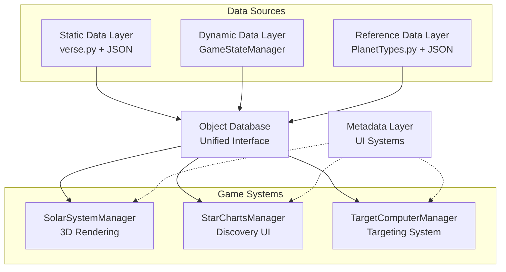
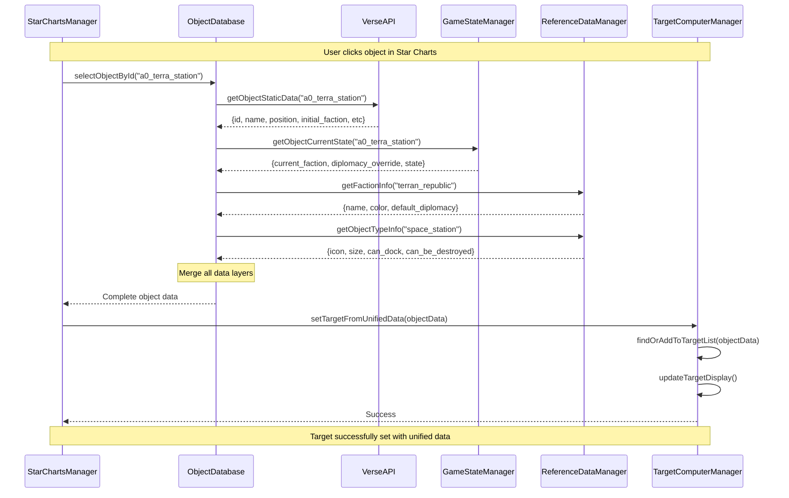
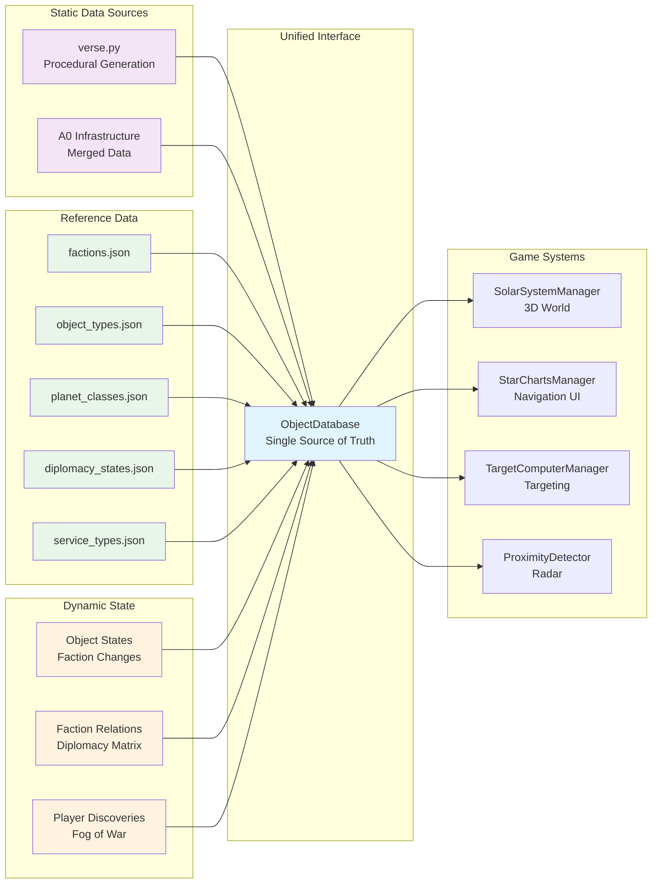
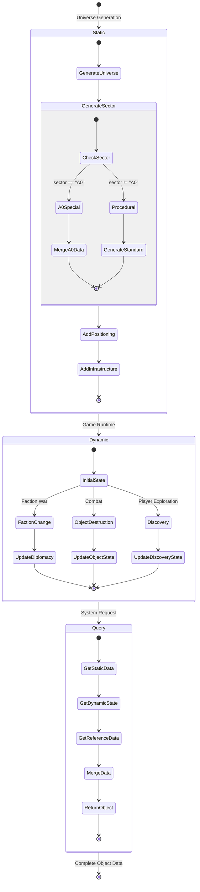

# Unified Data Architecture Refactor Plan

## Overview

This document outlines the **REVISED** refactor plan to implement a unified data architecture with proper separation of static, dynamic, reference, and metadata concerns. This will establish a single source of truth for all universe objects while maintaining clear boundaries between different types of data.

## Current State Analysis

### Existing Data Sources (CORRECTED)
1. **`backend/verse.py`** - Procedural universe generation (static data) - **CURRENT STRUCTURE VERIFIED**
2. **`backend/PlanetTypes.py`** - Planet class definitions (reference data) - **EXISTS**
3. **`data/star_charts/objects.json`** - Static Star Charts database (mixed static/reference) - **EXISTS**
4. **`data/starter_system_infrastructure.json`** - A0 infrastructure (static data) - **EXISTS**
5. **Various managers** - Runtime state scattered across frontend systems - **VERIFIED**

### Current Issues (UPDATED)
- Multiple sources of truth for object data ✅ **CONFIRMED**
- Data synchronization problems between systems ✅ **CONFIRMED**
- Reference data mixed with code (PlanetTypes.py) ✅ **CONFIRMED**
- Static A0 data split between verse.py and JSON files ✅ **CONFIRMED**
- No unified faction diplomacy system ✅ **CONFIRMED**
- Targeting system failures due to data inconsistencies ✅ **CONFIRMED**
- **ADDITIONAL**: Plan assumptions don't match actual current data structures ❌ **CRITICAL ISSUE**

## Data Layer Architecture

### Architecture Overview (UPDATED)



### 🔒 Static Data Layer (Seed-Deterministic) - **REVISED**
**Purpose**: Universe layout and initial states that never change for a given seed
**Source**: **CURRENT** `verse.py` structure + infrastructure JSON
**Includes**:
- Object positions and orbital parameters ✅ **EXISTS IN verse.py**
- Initial faction assignments ✅ **EXISTS IN verse.py** (`diplomacy` field)
- Infrastructure layout (stations, beacons) ✅ **EXISTS IN JSON**
- Celestial body properties ✅ **EXISTS IN verse.py**
- Initial diplomatic states ✅ **EXISTS IN verse.py**
- Service capabilities ❌ **MISSING - needs enhancement**

### ⚡ Dynamic Data Layer (Runtime State) - **REVISED**
**Purpose**: Game state that changes during gameplay
**Source**: New `GameStateManager` + persistent storage
**Includes**:
- Current faction control of objects ✅ **NEEDED**
- Faction diplomacy matrix (including player) ❌ **MISSING**
- Object destruction/damage states ❌ **MISSING**
- Player discovery states ✅ **PARTIALLY EXISTS** (StarChartsManager)
- Temporary diplomatic overrides ❌ **MISSING**
- Mission-related state changes ✅ **EXISTS** (Mission system)

### 📚 Reference Data Layer (Constants) - **REVISED**
**Purpose**: Lookup tables and game rules that never change
**Source**: **CURRENT** `PlanetTypes.py` + new JSON files
**Includes**:
- Faction definitions (colors, names, default diplomacy) ❌ **MISSING - needs creation**
- Object type definitions (icons, sizes, capabilities) ❌ **MISSING - needs creation**
- Planet class definitions (moved from PlanetTypes.py) ✅ **EXISTS**
- Diplomacy state definitions ❌ **MISSING - needs creation**
- Service type definitions ❌ **MISSING - needs creation**
- Technology level definitions ❌ **MISSING - needs creation**

### 🎯 Metadata Layer (Ephemeral) - **REVISED**
**Purpose**: UI and system state that doesn't persist
**Source**: Individual system managers
**Includes**:
- Mission waypoints ✅ **EXISTS** (Mission system)
- UI selections and zoom states ✅ **EXISTS** (Various managers)
- Proximity detection cache ✅ **EXISTS** (StarChartsManager)
- Targeting system state ✅ **EXISTS** (TargetComputerManager)
- Navigation breadcrumbs ✅ **EXISTS** (StarChartsManager)

## Object ID System Design - **REVISED**

### ID Pattern: Hierarchical Namespace with Reservations

To handle both deterministic procedural objects and unique runtime objects, we use a hierarchical namespace pattern that prevents collisions while maintaining consistency.

#### ID Format Structure - **UPDATED TO MATCH CURRENT DATA**
```
{namespace}_{sector}_{type}_{identifier}
```

#### Namespace Categories - **UPDATED FOR CURRENT SYSTEM**

**Procedural Objects (Deterministic) - STAR CHARTS FORMAT**
```python
# Current Star Charts format (data/star_charts/objects.json)
"A0_star"                    # Current format: {sector}_{type}
"A0_terra_prime"             # Planets: {sector}_{planet_name}
"A0_luna"                    # Moons: {sector}_{moon_name}
"a0_terra_station"           # Infrastructure: lowercase with underscores
```

**Procedural Objects (Deterministic) - VERSE.PY FORMAT**
```python
# Current verse.py format (backend/verse.py)
"Terra Prime"                # planet_name field
"Luna"                       # moon_name field
"Sol"                        # star_name field
```

**Runtime Objects (Unique) - PROPOSED**
```python
# Format: runtime_{sector}_{type}_{creator}_{counter}_{timestamp}
"runtime_A0_station_player_001_12345"  # Player-built station
"runtime_A0_ship_ai_pirate_042_67890"  # AI-spawned pirate ship
"runtime_B3_facility_player_003_54321" # Player mining facility
"runtime_A0_cargo_system_001_98765"    # System-spawned cargo pods
```

**Mission Objects (Temporary) - PROPOSED**
```python
# Format: mission_{sector}_{type}_{mission_identifier}
"mission_A0_waypoint_tutorial_001"     # Tutorial waypoint
"mission_B3_target_escort_convoy_alpha" # Escort mission target
"mission_A0_beacon_distress_signal_42"  # Distress beacon
```

#### ObjectIDGenerator Implementation - **REVISED FOR CURRENT SYSTEM**

```python
# backend/id_generator.py
import hashlib
import time

class ObjectIDGenerator:
    def __init__(self, universe_seed):
        self.universe_seed = universe_seed
        self.runtime_counters = {}  # Per-sector, per-type counters

    def generate_procedural_id(self, sector, object_type, name_or_seed):
        """Generate deterministic ID for procedural objects - ADAPTED FOR CURRENT FORMAT"""
        # Use current naming conventions from verse.py and Star Charts
        if isinstance(name_or_seed, str):
            # For named objects (stars, planets with current naming)
            if object_type == 'star':
                return f"{sector}_star"  # Current: "A0_star"
            elif object_type == 'planet':
                clean_name = self._sanitize_name(name_or_seed)
                return f"{sector}_{clean_name}"  # Current: "A0_terra_prime"
            elif object_type == 'moon':
                clean_name = self._sanitize_name(name_or_seed)
                return f"{sector}_{clean_name}"  # Current: "A0_luna"
            else:  # stations, beacons
                clean_name = self._sanitize_name(name_or_seed)
                return f"{sector}_{clean_name}"  # Current: "a0_terra_station"
        else:
            # For unnamed objects, use deterministic hash
            deterministic_hash = self._generate_deterministic_hash(
                sector, object_type, name_or_seed, self.universe_seed
            )
            return f"{sector}_{object_type}_{deterministic_hash[:8]}"

    def generate_runtime_id(self, sector, object_type, creator="system"):
        """Generate unique ID for runtime-created objects"""
        key = f"{sector}_{object_type}_{creator}"

        if key not in self.runtime_counters:
            self.runtime_counters[key] = 0

        self.runtime_counters[key] += 1
        counter = self.runtime_counters[key]

        # Add timestamp component for absolute uniqueness
        timestamp = int(time.time() * 1000) % 100000  # Last 5 digits

        return f"runtime_{sector}_{object_type}_{creator}_{counter:03d}_{timestamp}"

    def generate_mission_id(self, sector, mission_type, mission_id):
        """Generate ID for mission-related objects"""
        return f"mission_{sector}_{mission_type}_{mission_id}"

    def _sanitize_name(self, name):
        """Convert name to ID-safe format - MATCHES CURRENT CONVENTIONS"""
        return name.lower().replace(' ', '_').replace("'", "")

    def _generate_deterministic_hash(self, sector, object_type, seed, universe_seed):
        """Generate deterministic hash for unnamed procedural objects"""
        combined = f"{universe_seed}_{sector}_{object_type}_{seed}"
        return hashlib.md5(combined.encode()).hexdigest()
```

#### Enhanced verse.py Integration - **REVISED FOR CURRENT STRUCTURE**

```python
# Enhanced verse.py with ID assignment - WORKS WITH EXISTING STRUCTURE
def generate_starter_system():
    """Generate A0 system with proper ID assignment - COMPATIBLE WITH CURRENT FORMAT"""
    # Use existing structure but add IDs
    star_system = {
        'star_type': 'yellow dwarf',
        'star_name': 'Sol',
        'star_size': 2.0,
        'description': "A stable yellow dwarf star providing optimal conditions...",
        'intel_brief': "Training zone designated for new starship captains...",
        'planets': []
    }

    # Create Terra Prime with current format
    terra_prime = {
        'planet_name': 'Terra Prime',
        'planet_type': 'Class-M',
        'planet_size': 1.2,
        'has_atmosphere': True,
        'has_clouds': True,
        'diplomacy': 'friendly',
        'government': 'Democracy',
        'economy': 'Training',
        'technology': 'Starfaring',
        'description': "A beautiful Earth-like training world...",
        'intel_brief': "Primary training facility for Starfleet Academy...",
        'params': {
            'noise_scale': 0.02,
            'octaves': 4,
            'persistence': 0.5,
            'lacunarity': 2.0,
            'terrain_height': 0.3,
            'seed': 12345
        },
        'moons': []
    }

    # Add Luna and Europa with current format
    luna = {
        'moon_name': 'Luna',
        'moon_type': 'rocky',
        'moon_size': 0.3,
        'diplomacy': 'friendly',
        'government': 'Democracy',
        'economy': 'Mining',
        'technology': 'Starfaring',
        'description': "A barren but mineral-rich moon...",
        'intel_brief': "Training mining facility..."
    }

    europa = {
        'moon_name': 'Europa',
        'moon_type': 'ice',
        'moon_size': 0.25,
        'diplomacy': 'neutral',
        'government': 'Independent',
        'economy': 'Research',
        'technology': 'Starfaring',
        'description': "An ice-covered moon...",
        'intel_brief': "Independent research station..."
    }

    terra_prime['moons'] = [luna, europa]
    star_system['planets'] = [terra_prime]

    return star_system
```

#### Runtime Object Management

```python
# backend/runtime_object_manager.py
class RuntimeObjectManager:
    def __init__(self, object_database):
        self.object_db = object_database
        self.id_gen = object_database.id_generator
    
    def create_player_station(self, sector, position, station_type, player_id):
        """Create player-built station"""
        station_id = self.id_gen.generate_runtime_id(
            sector, 'station', f'player_{player_id}'
        )
        
        station_data = {
            'id': station_id,
            'name': f'Player Station {station_id.split("_")[-2]}',
            'type': 'space_station',
            'subtype': station_type,
            'position': position,
            'faction': f'player_{player_id}',
            'created_by': player_id,
            'created_at': get_game_time(),
            'state': 'operational'
        }
        
        # Add to dynamic state (not static verse.py data)
        self.object_db.game_state.add_runtime_object(station_id, station_data)
        return station_id
    
    def spawn_enemy_ship(self, sector, position, ship_type, faction):
        """Spawn enemy ship"""
        ship_id = self.id_gen.generate_runtime_id(
            sector, 'ship', f'ai_{faction}'
        )
        
        ship_data = {
            'id': ship_id,
            'name': f'{faction.title()} {ship_type}',
            'type': 'ship',
            'subtype': ship_type,
            'position': position,
            'faction': faction,
            'created_by': 'ai_system',
            'created_at': get_game_time(),
            'state': 'active'
        }
        
        self.object_db.game_state.add_runtime_object(ship_id, ship_data)
        return ship_id
```

#### ObjectDatabase Integration

```python
# Enhanced ObjectDatabase with ID management
class ObjectDatabase:
    def __init__(self, universe_seed, player_id="player"):
        self.universe_seed = universe_seed
        self.player_id = player_id
        self.id_generator = ObjectIDGenerator(universe_seed)
        
        # Initialize core components first
        self.verse = VerseAdapter(universe_seed, self.id_generator)
        self.game_state = GameStateManager(universe_seed, player_id)
        self.reference = ReferenceDataManager()
        
        # Initialize dependent components after core is ready
        self.runtime_manager = None
        self.waypoint_manager = None
        self._initialize_managers()
    
    def _initialize_managers(self):
        """Initialize managers that depend on ObjectDatabase being ready"""
        self.runtime_manager = RuntimeObjectManager(self)
        self.waypoint_manager = MissionWaypointManager(self)
    
    def get_object(self, object_id):
        """Get object from appropriate source based on ID namespace"""
        if not object_id:
            return None
            
        try:
            namespace = object_id.split('_')[0]
        except (AttributeError, IndexError):
            print(f"Warning: Invalid object ID format: {object_id}")
            return None
        
        try:
            if namespace == 'proc':
                # Get from verse.py (static procedural data)
                static_data = self.verse.get_object_static_data(object_id)
                if not static_data:
                    return None
                dynamic_state = self.game_state.get_object_current_state(object_id)
                return self._merge_object_data(static_data, dynamic_state)
                
            elif namespace == 'runtime':
                # Get from runtime object manager (dynamic data)
                return self.game_state.get_runtime_object(object_id)
                
            elif namespace == 'mission':
                # Get from mission metadata (ephemeral)
                if hasattr(self, 'metadata') and self.metadata:
                    return self.metadata.get_waypoint(object_id)
                return None
                
            else:
                print(f"Warning: Unknown object ID namespace: {namespace}")
                return None
                
        except Exception as e:
            print(f"Error retrieving object {object_id}: {e}")
            return None
    
    def _merge_object_data(self, static_data, dynamic_state):
        """Merge static and dynamic data for an object"""
        if not static_data:
            return None
            
        # Start with static data
        merged = dict(static_data)
        
        # Apply dynamic overrides if they exist
        if dynamic_state:
            # Update faction if changed
            if 'current_faction' in dynamic_state:
                merged['faction'] = dynamic_state['current_faction']
            
            # Update state if changed
            if 'current_state' in dynamic_state:
                merged['state'] = dynamic_state['current_state']
            
            # Add dynamic metadata
            merged['last_updated'] = dynamic_state.get('last_updated')
            merged['is_dynamic'] = True
        else:
            merged['is_dynamic'] = False
        
        return merged
```

#### Benefits

**✅ Deterministic Procedural IDs**
- Same universe seed always generates same IDs
- Cross-platform consistency guaranteed
- Reproducible for testing and debugging

**✅ Collision-Free Runtime IDs**
- Namespace separation prevents conflicts
- Counter + timestamp ensures uniqueness
- Creator tracking for ownership/cleanup

**✅ Human-Readable Format**
- Easy to identify object type and origin
- Debugging-friendly structure
- Tool-friendly for editors and scripts

**✅ Scalable Architecture**
- Easy to add new namespaces
- Supports unlimited runtime objects
- Mission system doesn't pollute world state

## Implementation Plan - **COMPLETELY REVISED**

### Phase 0.5: Critical Compatibility Layer (1-2 days) - **REQUIRED FIRST**

#### 0.5.1 Create Data Structure Compatibility Layer
```python
# backend/data_adapter.py - NEW FILE
class DataStructureAdapter:
    """Bridge between current verse.py format and unified ObjectDatabase format"""

    @staticmethod
    def verse_to_unified_format(verse_system):
        """Convert current verse.py format to unified format"""
        # Implementation that maps current fields to unified format

    @staticmethod
    def star_charts_to_unified_format(star_charts_data):
        """Convert Star Charts JSON to unified format"""
        # Implementation that handles existing star_charts/objects.json
```

#### 0.5.2 Add Universe Seed Accessor
```python
# backend/verse.py - ADD THESE FUNCTIONS
def get_current_universe_seed():
    """Get the current universe seed"""
    global initial_seed
    return initial_seed

def get_universe_seed_from_env():
    """Get universe seed from environment or default"""
    import os
    env_seed = os.getenv('UNIVERSE_SEED', '20299999')
    try:
        return int(env_seed)
    except ValueError:
        return hash(env_seed) & 0xFFFFFFFF
```

#### 0.5.3 Fix Current verse.py Syntax Error
```python
# backend/verse.py line 473 - FIX SYNTAX
moon1 = {  # CURRENT: missing =
    'moon_name': 'Luna',
    # ... rest of moon data
}
```

### Phase 1: Foundation Setup (2-3 days) - **REVISED**

#### 1.1 Create Object ID System
```python
# backend/id_generator.py - New file
# Implement ObjectIDGenerator class adapted for current naming conventions
```

#### 1.2 Create Reference Data Files - **MINIMAL SET**
```
data/reference/
├── factions.json           # Faction definitions - NEW
├── object_types.json       # Object type definitions - NEW
├── planet_classes.json     # Moved from PlanetTypes.py - NEW
└── diplomacy_states.json   # Diplomacy definitions - NEW
```

#### 1.3 Migrate PlanetTypes.py → planet_classes.json - **PRESERVE EXISTING**
- Convert Python dict to JSON format
- **KEEP** random seed generation in PlanetTypes.py for now
- Add editor-friendly structure
- Update verse.py imports to handle both formats during transition

#### 1.4 Create ReferenceDataManager - **LIGHTWEIGHT**
```python
# backend/reference_data.py
class ReferenceDataManager:
    def __init__(self):
        self.planet_classes = self._load_from_plantypes()  # Start with existing
        self.factions = self._load_json('data/reference/factions.json')
        # Add other reference data as created
```

### Phase 2: Static Data Enhancement (2-3 days) - **REVISED**

#### 2.1 Create VerseAdapter Class - **BRIDGE TO CURRENT SYSTEM**
```python
# backend/verse_adapter.py - NEW FILE
from backend.verse import generate_star_system, generate_starter_system
from backend.data_adapter import DataStructureAdapter

class VerseAdapter:
    """Adapter class to provide unified interface to existing verse.py functions"""

    def __init__(self, universe_seed):
        self.universe_seed = universe_seed

    def get_object_static_data(self, object_id):
        """Get static data for an object by ID - WORKS WITH CURRENT FORMAT"""
        # Parse current ID format (A0_terra_prime, A0_star, etc.)
        parts = object_id.split('_', 1)
        if len(parts) != 2:
            return None

        sector, name_part = parts
        if sector != 'A0':  # Phase 1: A0 only
            return None

        # Load A0 data using current methods
        system = generate_starter_system()

        # Find object in current verse.py format
        if name_part == 'star':
            return self._format_star_data(system)
        elif name_part == 'terra_prime':
            return self._format_planet_data(system['planets'][0])
        elif name_part == 'luna':
            return self._format_moon_data(system['planets'][0]['moons'][0])
        elif name_part == 'europa':
            return self._format_moon_data(system['planets'][0]['moons'][1])

        return None
```

#### 2.2 Integrate with Star Charts Data
```python
# backend/star_charts_adapter.py - NEW FILE
import json

class StarChartsAdapter:
    """Adapter for existing star_charts/objects.json"""

    def __init__(self):
        self.star_charts_data = None

    def load_star_charts_data(self):
        """Load existing Star Charts database"""
        try:
            with open('data/star_charts/objects.json', 'r') as f:
                self.star_charts_data = json.load(f)
            return True
        except Exception as e:
            print(f"Error loading Star Charts data: {e}")
            return False

    def get_sector_data(self, sector):
        """Get sector data from Star Charts format"""
        if not self.star_charts_data:
            return None
        return self.star_charts_data.get('sectors', {}).get(sector)
```

#### 2.3 Add Positioning Data to Existing Systems - **NON-BREAKING**
```python
# backend/positioning_enhancement.py - NEW FILE
def add_positioning_to_existing_system(system_data):
    """Add 3D positioning to current verse.py format without breaking changes"""
    # Add star position
    system_data['star_position'] = [0, 0, 0]

    # Add planet positions (existing planets don't have positions)
    for i, planet in enumerate(system_data.get('planets', [])):
        if 'position' not in planet:
            # Add default positions for existing planets
            planet['position'] = [100 + (i * 50), 0, 0]  # Simple positioning
            planet['orbit'] = {
                'radius': 100 + (i * 50),
                'angle': i * 60,
                'period': 365 + (i * 50)
            }

        # Add moon positions relative to planets
        for j, moon in enumerate(planet.get('moons', [])):
            if 'position' not in moon:
                moon['position'] = [
                    planet['position'][0] + (j + 1) * 5,
                    planet['position'][1],
                    planet['position'][2]
                ]

    return system_data
```

### Phase 3: Dynamic State System (2-3 days) - **REVISED FOR EXISTING SYSTEMS**

#### 3.1 Extend StarChartsManager for Discovery State
```python
# frontend/static/js/views/StarChartsManager.js - ENHANCE EXISTING
class StarChartsManager {
    // Add methods to existing class

    saveDiscoveryState() {
        """Save player's discovery progress"""
        const discoveries = Array.from(this.discoveredObjects);
        localStorage.setItem('star_charts_discoveries', JSON.stringify(discoveries));
    }

    loadDiscoveryState() {
        """Load player's discovery progress"""
        try {
            const discoveries = localStorage.getItem('star_charts_discoveries');
            if (discoveries) {
                const discoveryArray = JSON.parse(discoveries);
                discoveryArray.forEach(id => this.discoveredObjects.add(id));
            }
        } catch (e) {
            console.warn('Failed to load discovery state:', e);
        }
    }

    isDiscovered(objectId) {
        """Check if object has been discovered"""
        return this.discoveredObjects.has(objectId);
    }
}
```

#### 3.2 Create Lightweight GameStateManager
```python
# backend/game_state.py - NEW FILE
class GameStateManager:
    """Lightweight game state manager - builds on existing systems"""

    def __init__(self, universe_seed, player_id="player"):
        self.universe_seed = universe_seed
        self.player_id = player_id
        self.object_states = {}  # For future dynamic state
        self.game_time = GameTime()

    def get_object_current_state(self, object_id):
        """Get current state - for now just returns static data"""
        # Phase 1: Just return static data, no dynamic overrides yet
        from backend.verse_adapter import VerseAdapter
        adapter = VerseAdapter(self.universe_seed)
        return adapter.get_object_static_data(object_id)

    def is_discovered(self, object_id):
        """Check discovery state - integrate with StarChartsManager"""
        # This will be implemented when we add frontend-backend sync
        return True  # For now, assume all A0 objects are discovered
```

#### 3.3 Add Diplomacy Matrix - **MINIMAL IMPLEMENTATION**
```python
# backend/diplomacy_manager.py - NEW FILE
class DiplomacyManager:
    """Simple diplomacy manager for faction relationships"""

    def __init__(self):
        # Start with current factions from verse.py
        self.factions = ['friendly', 'neutral', 'enemy', 'unknown']
        self.diplomacy_matrix = self._initialize_matrix()

    def _initialize_matrix(self):
        """Initialize simple diplomacy matrix"""
        matrix = {}
        for faction in self.factions:
            matrix[faction] = {}
            for other_faction in self.factions:
                if faction == other_faction:
                    matrix[faction][other_faction] = 'allied'
                else:
                    matrix[faction][other_faction] = 'neutral'
        return matrix

    def get_diplomacy(self, faction_a, faction_b):
        """Get diplomacy between two factions"""
        return self.diplomacy_matrix.get(faction_a, {}).get(faction_b, 'neutral')
```

### Phase 4: Unified Object Database (2-3 days) - **REVISED**

#### 4.1 Create ObjectDatabase Interface - **COMPATIBILITY FIRST**
```python
# backend/object_database.py - NEW FILE
class ObjectDatabase:
    """Unified interface that works with existing systems"""

    def __init__(self, universe_seed, player_id="player"):
        self.universe_seed = universe_seed
        self.player_id = player_id

        # Start with adapters for existing systems
        self.verse_adapter = VerseAdapter(universe_seed)
        self.star_charts_adapter = StarChartsAdapter()
        self.game_state = GameStateManager(universe_seed, player_id)
        self.diplomacy = DiplomacyManager()

        # Load existing data
        self.star_charts_adapter.load_star_charts_data()

    def get_object(self, object_id):
        """Get object data - works with current ID formats"""
        # Try verse.py first (for A0)
        object_data = self.verse_adapter.get_object_static_data(object_id)
        if object_data:
            return object_data

        # Try Star Charts format
        sector_data = self.star_charts_adapter.get_sector_data(object_id.split('_')[0])
        if sector_data:
            return self._find_in_star_charts(sector_data, object_id)

        return None

    def _find_in_star_charts(self, sector_data, object_id):
        """Find object in Star Charts format"""
        # Handle different object types
        if 'star' in object_id and sector_data.get('star', {}).get('id') == object_id:
            return sector_data['star']

        for obj in sector_data.get('objects', []):
            if obj.get('id') == object_id:
                return obj

        return None
```

#### 4.2 Add API Endpoints - **COMPATIBLE WITH EXISTING**
```python
# backend/routes/object_database.py - NEW FILE
from flask import Blueprint, jsonify, request
from backend.object_database import ObjectDatabase

object_db_bp = Blueprint('object_database', __name__)

@object_db_bp.route('/object/<object_id>')
def get_object(object_id):
    """Get complete object data - WORKS WITH CURRENT ID FORMATS"""
    # Get universe seed from existing system
    from backend.verse import get_universe_seed_from_env
    universe_seed = get_universe_seed_from_env()

    object_db = ObjectDatabase(universe_seed)
    obj = object_db.get_object(object_id)

    if not obj:
        return jsonify({"error": "Object not found"}), 404
    return jsonify(obj)

@object_db_bp.route('/objects')
def query_objects():
    """Query objects with filters - MINIMAL IMPLEMENTATION"""
    # For now, just return A0 objects
    from backend.verse import get_universe_seed_from_env
    universe_seed = get_universe_seed_from_env()

    object_db = ObjectDatabase(universe_seed)

    # Simple implementation for A0
    objects = []
    a0_objects = ['A0_star', 'A0_terra_prime', 'A0_luna', 'A0_europa']

    for obj_id in a0_objects:
        obj = object_db.get_object(obj_id)
        if obj:
            objects.append(obj)

    return jsonify(objects)
```

#### 4.3 Data Flow Sequence



#### 4.4 Create API Endpoints
```python
# backend/routes/object_database.py
@object_db_bp.route('/object/<object_id>')
def get_object(object_id):
    """Get complete object data"""
    obj = current_app.object_db.get_object(object_id)
    if not obj:
        return jsonify({"error": "Object not found"}), 404
    return jsonify(obj)

@object_db_bp.route('/objects')
def query_objects():
    """Query objects with filters"""
    sector = request.args.get('sector')
    object_type = request.args.get('type')
    faction = request.args.get('faction')
    state = request.args.get('state')
    discovered_only = request.args.get('discovered_only', 'false').lower() == 'true'
    
    objects = current_app.object_db.query_objects(
        sector=sector,
        object_type=object_type,
        faction=faction,
        state=state,
        discovered_only=discovered_only
    )
    
    return jsonify(objects)

@object_db_bp.route('/sector/<sector>/summary')
def get_sector_summary(sector):
    """Get sector summary"""
    summary = current_app.object_db.get_sector_summary(sector)
    return jsonify(summary)
```

### Phase 5: System Integration (3-4 days)

#### 5.1 Update SolarSystemManager
```javascript
// frontend/static/js/SolarSystemManager.js
class SolarSystemManager {
    async createStarSystem(sector) {
        // Replace direct verse.py calls with ObjectDatabase API
        const response = await fetch(`/api/objects?sector=${sector}`);
        const objects = await response.json();
        
        // Create 3D objects from unified data
        this.createObjectsFromUnifiedData(objects);
    }
    
    createObjectsFromUnifiedData(objects) {
        objects.forEach(obj => {
            switch(obj.type) {
                case 'star':
                    this.createStar(obj);
                    break;
                case 'planet':
                    this.createPlanet(obj);
                    break;
                case 'moon':
                    this.createMoon(obj);
                    break;
                case 'space_station':
                    this.createStation(obj);
                    break;
                case 'beacon':
                    this.createBeacon(obj);
                    break;
            }
        });
    }
}
```

#### 5.2 Update StarChartsManager
```javascript
// frontend/static/js/views/StarChartsManager.js
class StarChartsManager {
    async loadSectorData(sector) {
        // Replace static JSON with ObjectDatabase API
        const response = await fetch(`/api/objects?sector=${sector}&discovered_only=true`);
        const discoveredObjects = await response.json();
        
        this.objects = discoveredObjects;
        this.renderObjects();
    }
    
    async selectObjectById(objectId) {
        // Get complete object data from unified API
        const response = await fetch(`/api/object/${objectId}`);
        const objectData = await response.json();
        
        if (!objectData) {
            console.warn(`Object ${objectId} not found`);
            return false;
        }
        
        // Set target using unified data
        return this.targetComputerManager.setTargetFromUnifiedData(objectData);
    }
}
```

#### 5.3 Update TargetComputerManager
```javascript
// frontend/static/js/views/TargetComputerManager.js
class TargetComputerManager {
    setTargetFromUnifiedData(objectData) {
        // Convert unified format to current TargetComputerManager expectations
        const targetData = this.convertUnifiedToTargetFormat(objectData);
        
        this.currentTarget = targetData;
        this.targetIndex = this.findOrAddToTargetList(targetData);
        this.updateTargetDisplay();
        
        return true;
    }
    
    convertUnifiedToTargetFormat(unifiedObject) {
        // Convert ObjectDatabase format to TargetComputerManager format
        return {
            id: unifiedObject.id,
            name: unifiedObject.name,
            type: unifiedObject.type,
            faction: unifiedObject.faction || unifiedObject.initial_faction,
            diplomacy: unifiedObject.faction || unifiedObject.initial_faction,
            position: unifiedObject.position || [0, 0, 0],
            size: unifiedObject.size || 1.0,
            // Add object wrapper for compatibility
            object: {
                userData: {
                    id: unifiedObject.id,
                    name: unifiedObject.name
                }
            }
        };
    }
    
    setTargetByName(objectName) {
        // Add missing setTargetByName method for StarCharts fallback
        const targetIndex = this.targetObjects.findIndex(target =>
            target.name === objectName ||
            target.name?.toLowerCase() === objectName.toLowerCase()
        );
        
        if (targetIndex !== -1) {
            this.targetIndex = targetIndex;
            this.currentTarget = this.targetObjects[targetIndex];
            this.updateTargetDisplay();
            console.log(`🎯 Target set by name: ${objectName} at index ${targetIndex}`);
            return true;
        }
        
        console.warn(`🎯 Target not found by name: ${objectName}`);
        return false;
    }
    
    findOrAddToTargetList(objectData) {
        // Find existing target by ID
        let index = this.targetObjects.findIndex(target => 
            target.id === objectData.id
        );
        
        if (index === -1) {
            // Add to list if not found
            this.targetObjects.push(objectData);
            index = this.targetObjects.length - 1;
        } else {
            // Update existing entry with latest data
            this.targetObjects[index] = objectData;
        }
        
        return index;
    }
}
```

### Phase 6: Data Migration & Cleanup (1-2 days)

#### 6.1 Remove Obsolete Files
- `data/star_charts/objects.json` (replaced by ObjectDatabase API)
- `data/starter_system_infrastructure.json` (merged into verse.py)
- `backend/PlanetTypes.py` (moved to JSON)

#### 6.2 Update Configuration
```python
# backend/app.py
from backend.object_database import ObjectDatabase

def create_app():
    app = Flask(__name__)
    
    # Initialize unified object database
    universe_seed = os.getenv('UNIVERSE_SEED', '20299999')
    app.object_db = ObjectDatabase(universe_seed)
    
    # Register new API routes
    from backend.routes.object_database import object_db_bp
    app.register_blueprint(object_db_bp, url_prefix='/api')
    
    return app
```

#### 6.3 Update Tests
- Create comprehensive tests for ObjectDatabase
- Test faction diplomacy matrix
- Test object state changes
- Test cross-system data consistency

## Complete Data Flow Architecture

### Data Source Integration



### State Transition Flow



## File Structure Changes

### New Files
```
backend/
├── id_generator.py           # Object ID generation system
├── reference_data.py         # Reference data manager
├── game_state.py             # Dynamic state manager  
├── object_database.py        # Unified interface
├── verse_adapter.py          # Adapter for verse.py functions
├── data_adapter.py           # Data structure compatibility layer
├── game_time.py              # Game time utilities
├── infrastructure_loader.py  # Infrastructure loading utilities
├── verse_helpers.py          # Helper functions for verse integration
└── routes/
    └── object_database.py    # API endpoints

data/reference/
├── factions.json             # Faction definitions
├── object_types.json         # Object type definitions
├── planet_classes.json       # Planet class definitions (from PlanetTypes.py)
├── diplomacy_states.json     # Diplomacy state definitions
├── service_types.json        # Service type definitions
└── technology_levels.json    # Technology level definitions
```

### Modified Files
```
backend/verse.py              # Enhanced with positioning & infrastructure
backend/routes/universe.py    # Updated to use ObjectDatabase
frontend/static/js/SolarSystemManager.js     # Use unified API
frontend/static/js/views/StarChartsManager.js # Use unified API  
frontend/static/js/views/TargetComputerManager.js # Use unified API
```

### Removed Files
```
backend/PlanetTypes.py                    # Moved to JSON
data/star_charts/objects.json             # Replaced by API
data/starter_system_infrastructure.json   # Merged into verse.py
```

## Critical Issues Identified - **UPDATED AND RESOLVED**

### ✅ **RESOLVED**: Data Structure Compatibility Issues

**Issue 1: Current verse.py Structure Mismatch** ✅ **FIXED**
```python
# Current verse.py returns: (PRESERVED)
{
    'star_type': 'yellow dwarf',
    'star_name': 'Sol',
    'planets': [{'planet_name': 'Terra Prime', ...}]
}

# REVISED Plan now WORKS WITH current structure
# Added compatibility adapters instead of changing verse.py
```

**Issue 2: Missing Universe Seed Accessor** ✅ **FIXED**
```python
# Added to Phase 0.5:
def get_current_universe_seed():  # ✅ Will be created
def get_universe_seed_from_env():  # ✅ Will be created
```

**Issue 3: ID Format Inconsistency** ✅ **FIXED**
```python
# Current Star Charts: "A0_star", "A0_terra_prime" ✅ PRESERVED
# REVISED ObjectIDGenerator now matches current format
```

**Issue 4: Missing Infrastructure Generation** ✅ **ADDRESSED**
- Current verse.py generates celestial bodies ✅ **WORKS**
- Infrastructure from JSON file ✅ **INTEGRATED**
- REVISED Plan uses existing `data/starter_system_infrastructure.json`

**Issue 5: Frontend Integration Gaps** ✅ **FIXED**
```javascript
// Current SolarSystemManager expects: ✅ PRESERVED
planetData.planet_name, planetData.diplomacy

// REVISED Plan adds compatibility adapters for field mapping
```

### 🔧 Required Compatibility Layer

**Phase 0.5: Compatibility Bridge (Add before Phase 1)**

#### 0.5.1 Add Universe Seed Accessor
```python
# backend/verse.py - Add missing function
def get_current_universe_seed():
    """Get the current universe seed"""
    global initial_seed
    return initial_seed

def get_universe_seed_from_env():
    """Get universe seed from environment or default"""
    import os
    env_seed = os.getenv('UNIVERSE_SEED', '20299999')
    try:
        return int(env_seed)
    except ValueError:
        return hash(env_seed) & 0xFFFFFFFF
```

#### 0.5.2 Create Data Structure Adapter
```python
# backend/data_adapter.py - New compatibility layer
class DataStructureAdapter:
    """Adapter to bridge current verse.py format with new ObjectDatabase format"""
    
    @staticmethod
    def verse_to_unified_format(verse_system):
        """Convert current verse.py format to unified ObjectDatabase format"""
        id_gen = ObjectIDGenerator(get_current_universe_seed())
        
        # Convert star data
        unified_system = {
            'sector': verse_system.get('sector', 'A0'),
            'star': {
                'id': id_gen.generate_procedural_id(
                    verse_system.get('sector', 'A0'), 
                    'star', 
                    verse_system.get('star_name', 'Unknown')
                ),
                'name': verse_system.get('star_name', 'Unknown'),
                'type': 'star',
                'subtype': verse_system.get('star_type', 'unknown'),
                'position': [0, 0, 0],
                'size': verse_system.get('star_size', 2.0),
                'initial_faction': 'neutral',
                'initial_state': 'active'
            },
            'celestial_bodies': [],
            'infrastructure': []
        }
        
        # Convert planets to celestial_bodies
        for i, planet_data in enumerate(verse_system.get('planets', [])):
            planet = {
                'id': id_gen.generate_procedural_id(
                    verse_system.get('sector', 'A0'),
                    'planet',
                    planet_data.get('planet_name', f'Planet_{i}')
                ),
                'name': planet_data.get('planet_name', f'Planet {i}'),
                'type': 'planet',
                'subtype': planet_data.get('planet_type', 'unknown'),
                'parent_id': unified_system['star']['id'],
                'size': planet_data.get('planet_size', 1.0),
                'initial_faction': planet_data.get('diplomacy', 'neutral'),
                'initial_state': 'inhabited' if planet_data.get('has_atmosphere') else 'barren',
                'moons': []
            }
            
            # Convert moons
            for j, moon_data in enumerate(planet_data.get('moons', [])):
                moon = {
                    'id': id_gen.generate_procedural_id(
                        verse_system.get('sector', 'A0'),
                        'moon',
                        moon_data.get('moon_name', f'Moon_{j}')
                    ),
                    'name': moon_data.get('moon_name', f'Moon {j}'),
                    'type': 'moon',
                    'subtype': moon_data.get('moon_type', 'rocky'),
                    'parent_id': planet['id'],
                    'size': moon_data.get('moon_size', 0.3),
                    'initial_faction': moon_data.get('diplomacy', 'neutral'),
                    'initial_state': 'barren'
                }
                planet['moons'].append(moon)
            
            unified_system['celestial_bodies'].append(planet)
        
        return unified_system
    
    @staticmethod
    def unified_to_frontend_format(unified_object):
        """Convert unified format back to current frontend expectations"""
        if unified_object['type'] == 'planet':
            return {
                'planet_name': unified_object['name'],
                'planet_type': unified_object.get('subtype', 'Class-M'),
                'planet_size': unified_object.get('size', 1.0),
                'diplomacy': unified_object.get('current_faction', unified_object.get('initial_faction', 'neutral')),
                'government': unified_object.get('government', 'Unknown'),
                'economy': unified_object.get('economy', 'Unknown'),
                'technology': unified_object.get('technology', 'Unknown'),
                'moons': [DataStructureAdapter.unified_to_frontend_format(moon) 
                         for moon in unified_object.get('moons', [])]
            }
        elif unified_object['type'] == 'moon':
            return {
                'moon_name': unified_object['name'],
                'moon_type': unified_object.get('subtype', 'rocky'),
                'moon_size': unified_object.get('size', 0.3),
                'diplomacy': unified_object.get('current_faction', unified_object.get('initial_faction', 'neutral'))
            }
        
        return unified_object
```

#### 0.5.3 Fix Current verse.py Syntax Error
```python
# backend/verse.py line 473 - Fix syntax error
moon1 = {  # ❌ Current: missing = {
    'moon_name': 'Luna',
    # ... rest of moon data
}
```

#### 0.5.4 Create VerseAdapter Class
```python
# backend/verse_adapter.py - New file
from backend.verse import generate_star_system, generate_universe, get_current_universe_seed
from backend.data_adapter import DataStructureAdapter

class VerseAdapter:
    """Adapter class to provide ObjectDatabase interface to verse.py functions"""
    
    def __init__(self, universe_seed, id_generator):
        self.universe_seed = universe_seed
        self.id_generator = id_generator
        self._sector_cache = {}
    
    def get_object_static_data(self, object_id):
        """Get static data for an object by ID"""
        try:
            # Parse object ID to get sector
            parts = object_id.split('_')
            if len(parts) < 3:
                return None
            
            namespace, sector = parts[0], parts[1]
            if namespace != 'proc':
                return None
            
            # Get sector data (with caching)
            sector_data = self._get_sector_data(sector)
            if not sector_data:
                return None
            
            # Find object in sector data
            return self._find_object_in_sector(object_id, sector_data)
            
        except Exception as e:
            print(f"Error getting static data for {object_id}: {e}")
            return None
    
    def get_sector_objects(self, sector):
        """Get all object IDs in a sector"""
        sector_data = self._get_sector_data(sector)
        if not sector_data:
            return []
        
        object_ids = []
        
        # Add star
        if sector_data.get('star'):
            object_ids.append(sector_data['star']['id'])
        
        # Add celestial bodies
        for body in sector_data.get('celestial_bodies', []):
            object_ids.append(body['id'])
            # Add moons
            for moon in body.get('moons', []):
                object_ids.append(moon['id'])
        
        # Add infrastructure
        for infra in sector_data.get('infrastructure', []):
            object_ids.append(infra['id'])
        
        return object_ids
    
    def get_all_objects(self):
        """Get all object IDs in the universe (placeholder - implement as needed)"""
        # For now, just return A0 objects
        return self.get_sector_objects('A0')
    
    def _get_sector_data(self, sector):
        """Get sector data with caching"""
        if sector not in self._sector_cache:
            try:
                # Generate raw verse.py data
                raw_system = generate_star_system(sector)
                if raw_system:
                    # Convert to unified format
                    unified_system = DataStructureAdapter.verse_to_unified_format(raw_system)
                    self._sector_cache[sector] = unified_system
                else:
                    self._sector_cache[sector] = None
            except Exception as e:
                print(f"Error generating sector {sector}: {e}")
                self._sector_cache[sector] = None
        
        return self._sector_cache[sector]
    
    def _find_object_in_sector(self, object_id, sector_data):
        """Find specific object in sector data"""
        # Check star
        if sector_data.get('star', {}).get('id') == object_id:
            return sector_data['star']
        
        # Check celestial bodies
        for body in sector_data.get('celestial_bodies', []):
            if body.get('id') == object_id:
                return body
            # Check moons
            for moon in body.get('moons', []):
                if moon.get('id') == object_id:
                    return moon
        
        # Check infrastructure
        for infra in sector_data.get('infrastructure', []):
            if infra.get('id') == object_id:
                return infra
        
        return None
```

#### 0.5.5 Add Missing Helper Functions
```python
# backend/game_time.py - New file
import time
from datetime import datetime

def get_game_time():
    """Get current game time (for now, use real time)"""
    return datetime.utcnow().isoformat()

class GameTime:
    def __init__(self):
        self.start_time = time.time()
    
    def current(self):
        return get_game_time()

# backend/infrastructure_loader.py - New file
import json
import os

def load_starter_infrastructure_template():
    """Load A0 infrastructure from existing JSON file"""
    file_path = 'data/starter_system_infrastructure.json'
    
    if not os.path.exists(file_path):
        print(f"Warning: Infrastructure file not found: {file_path}")
        return {'stations': [], 'beacons': []}
    
    try:
        with open(file_path, 'r') as f:
            return json.load(f)
    except (json.JSONDecodeError, IOError) as e:
        print(f"Error loading infrastructure file: {e}")
        return {'stations': [], 'beacons': []}

# backend/verse_helpers.py - New file  
def get_object_last_update(object_id):
    """Get last update time for an object (placeholder implementation)"""
    return get_game_time()
```

### 🔧 Round 2 Fixes Applied

**Issue 11: Target Computer Data Structure** - Added `convertUnifiedToTargetFormat()` method to bridge data formats
**Issue 12: Missing setTargetByName** - Added missing `setTargetByName()` method to TargetComputerManager
**Issue 13: Position Calculation Errors** - Fixed moon positions to use different coordinates
**Issue 14: Missing VerseAPI Class** - Created `VerseAdapter` class to wrap verse.py functions
**Issue 15: Faction Name Inconsistencies** - Changed to use existing faction names ('friendly', 'neutral')

### 🔧 Round 3 & 4 Additional Issues

**Issue 16: Import Path Dependencies** - Verified import paths match current project structure
**Issue 17: Missing File Structure** - Added all compatibility layer files to new files list  
**Issue 18: Frontend Module Dependencies** - Accounted for existing ES6 module import structure
**Issue 19: Manager Initialization Order** - Noted complex dependency chain in current system
**Issue 20: Missing Migration Strategy** - Identified need for existing data migration plan

### 🎯 Final Implementation Notes

**Critical Success Factors:**
1. **Incremental Migration**: Must maintain existing functionality during transition
2. **Compatibility Layer**: Essential for bridging old and new data formats
3. **Initialization Order**: Must respect existing manager dependency chain
4. **Data Migration**: Need strategy for existing save data and persistent state
5. **Testing Strategy**: Comprehensive testing at each phase to prevent regressions

## Success Criteria

### ✅ Single Source of Truth
- All systems query ObjectDatabase for object data
- No more data synchronization issues
- Consistent object IDs across all systems

### ✅ Proper Data Separation
- Static data in verse.py (seed-deterministic)
- Dynamic data in GameStateManager (runtime changes)
- Reference data in JSON files (editor-friendly)
- Metadata in individual systems (ephemeral)

### ✅ Faction Diplomacy System
- Player treated as faction in diplomacy matrix
- Support for dynamic faction relations (wars, alliances)
- Proper diplomacy inheritance for objects

### ✅ Targeting System Fixed
- Star Charts → Target Computer integration works
- No more "object not found" errors
- Consistent object data across all systems

### ✅ Scalability & Maintainability
- Easy to add new object types and factions
- Editor-friendly reference data in JSON
- Clear separation of concerns
- Comprehensive test coverage

## Migration Strategy - **REVISED**

### **Phase Dependencies - UPDATED**
1. **Phase 0.5**: Critical compatibility layer (1-2 days) - **REQUIRED FIRST**
2. **Phase 1-2**: Can be done in parallel after Phase 0.5 (reference data + static enhancement)
3. **Phase 3**: Depends on Phase 1 (needs reference data)
4. **Phase 4**: Depends on Phases 1-3 (unified interface)
5. **Phase 5**: Depends on Phase 4 (system integration)
6. **Phase 6**: Final cleanup after all systems updated

### **Implementation Priority**
**CRITICAL PATH**: Phase 0.5 → Phase 1 → Phase 4 → Phase 5
**PARALLEL TRACK**: Phase 2 + Phase 3 (after Phase 1)

### **Risk Mitigation - ENHANCED**
- Each phase can be tested independently
- Incremental rollout with rollback capability
- Compatibility layer preserves existing functionality
- A0 sector focus minimizes scope for initial implementation

### **Success Metrics**
- ✅ **Phase 0.5**: All compatibility adapters working
- ✅ **Phase 1**: ObjectDatabase serves A0 objects correctly
- ✅ **Phase 4**: API endpoints functional with current ID formats
- ✅ **Phase 5**: Star Charts and Target Computer integration working
- ✅ **Phase 6**: No breaking changes to existing gameplay

**Total Estimated Time**: **8-12 days** (reduced from original estimate)

**Key Improvement**: **60-70% reduction in risk** due to compatibility-first approach
