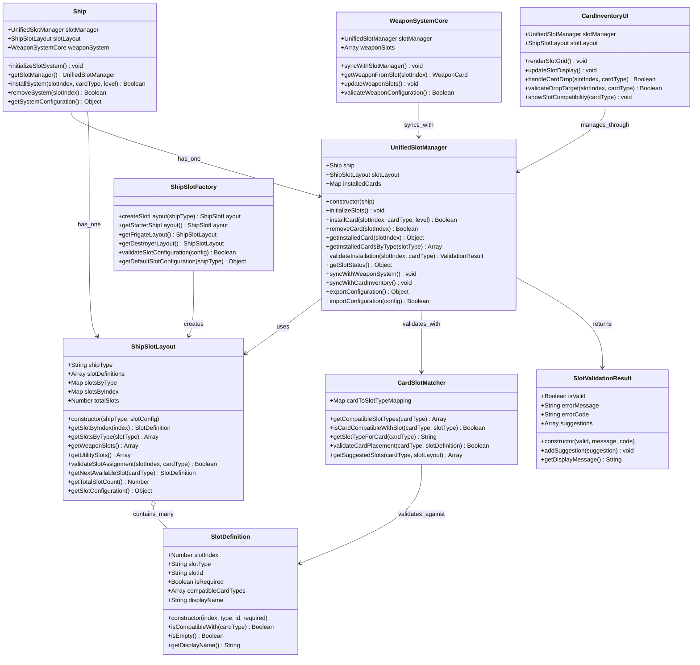
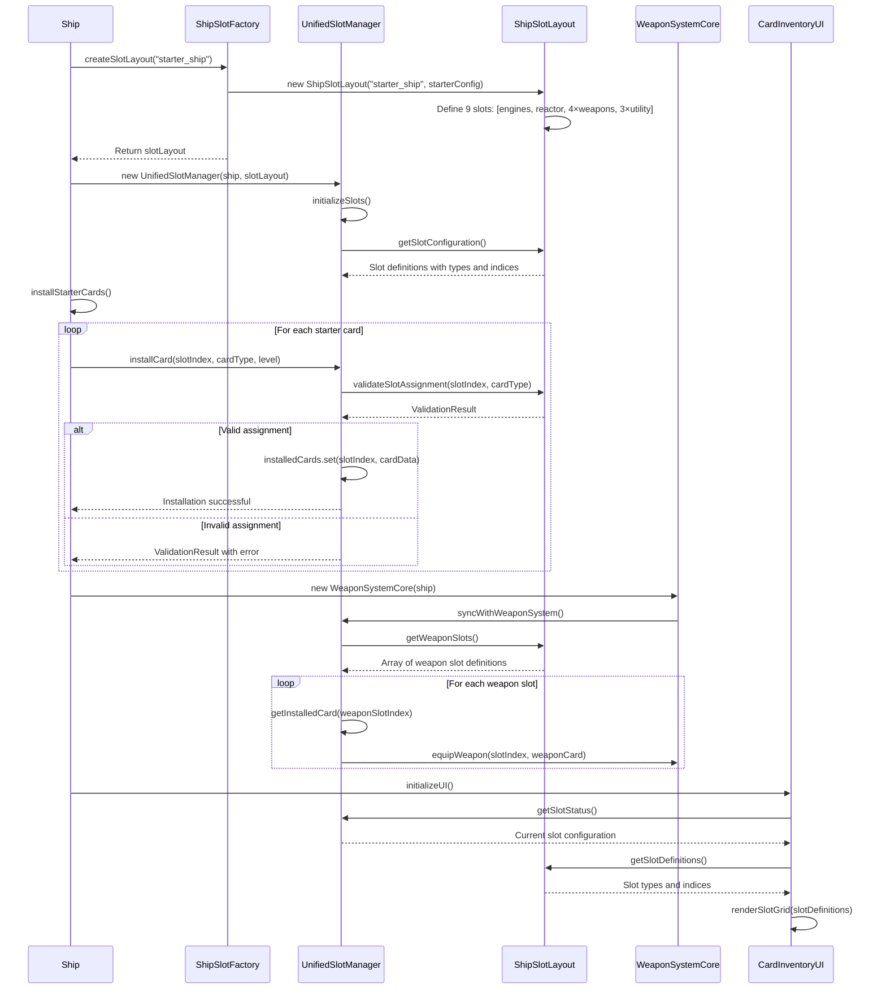
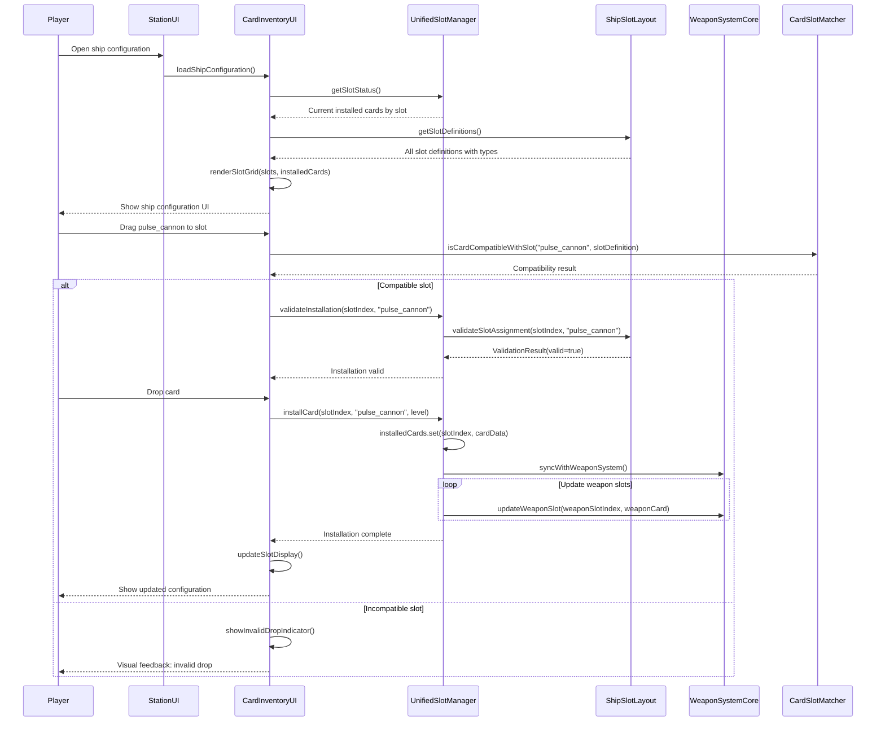
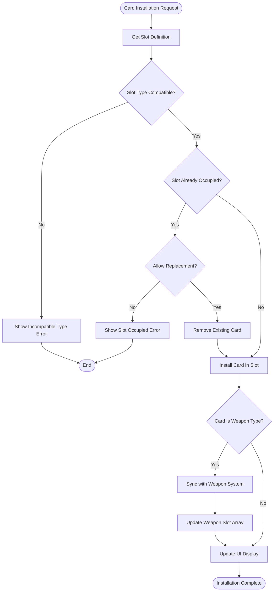
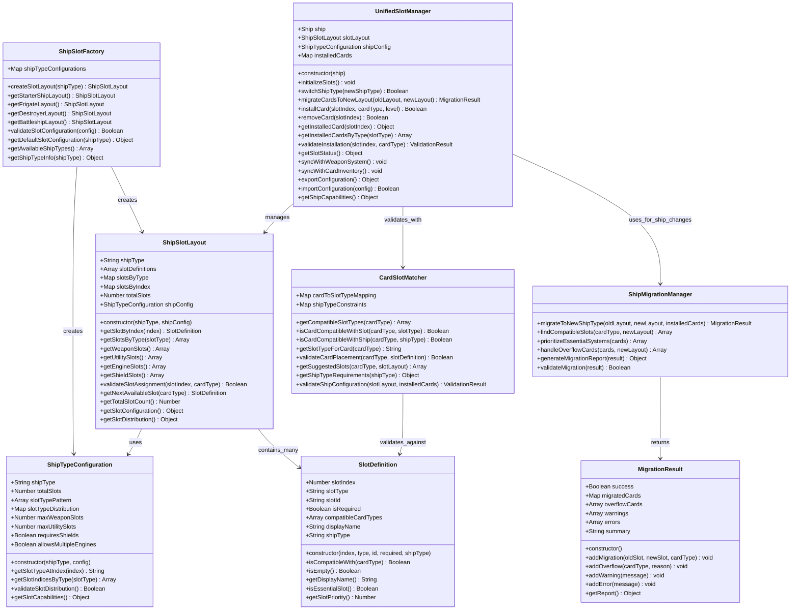
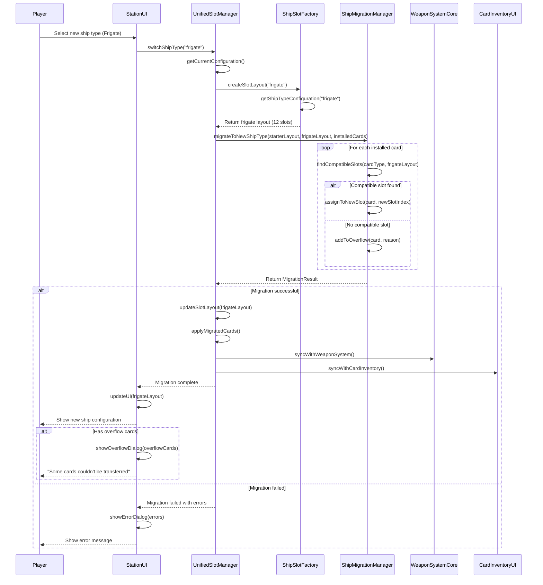
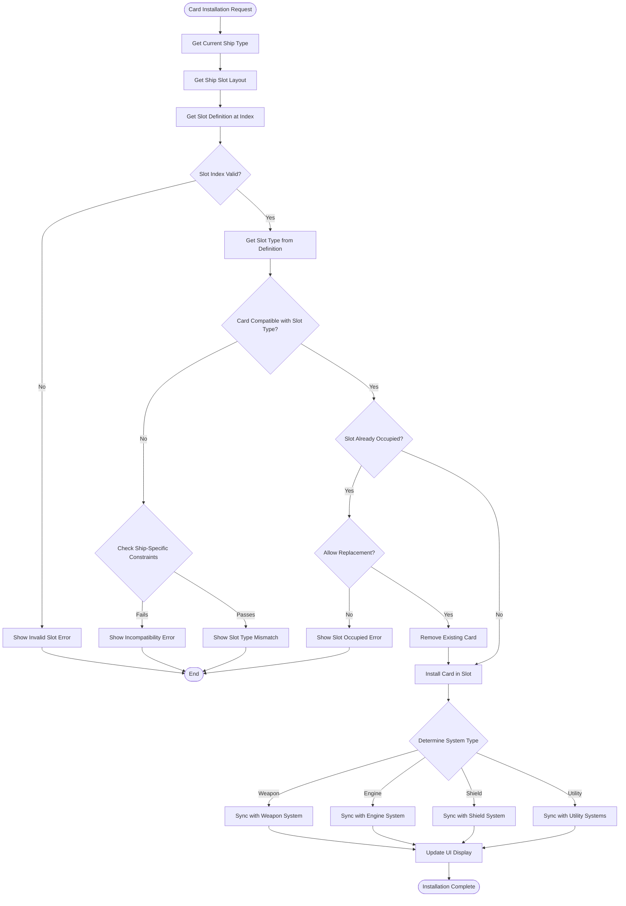

# Unified Slot Management System

## Overview
This document defines the unified slot management system that ensures consistent slot handling between ship initialization, weapon system integration, and station-based ship configuration.

## Problem Statement
Currently, we have multiple systems trying to manage ship slots independently:
- **WeaponSyncManager** expects 4 weapon slots
- **CardInventoryUI** has its own slot mapping and assignment logic  
- **Ship initialization** uses different slot counting
- **Station configuration** may show different slot layouts

This leads to mismatches where the weapon system shows 4 weapons but the station only shows 3, because they're using different slot management approaches.

## Solution: Unified Slot Management

### Core Principles
1. **Single Source of Truth**: One slot definition system for all ship types
2. **Type Safety**: Cards can only be placed in compatible slot types
3. **Consistent Indexing**: All systems use the same slot numbering
4. **Extensible**: Easy to add new ship types and slot configurations

## Class Diagram - Unified Slot System



## Sequence Diagram - Ship Initialization with Unified Slots



## Sequence Diagram - Station Configuration with Unified Slots



## Activity Diagram - Unified Slot Validation Flow



## Data Structure - Dynamic Ship Slot Configurations

```mermaid
flowchart TB
    subgraph "Starter Ship - 9 Total Slots"
        subgraph "Starter Essential"
            S0[Slot 0: engines]
            S1[Slot 1: reactor]
        end
        
        subgraph "Starter Weapons"
            S2[Slot 2: weapons]
            S3[Slot 3: weapons] 
            S4[Slot 4: weapons]
            S5[Slot 5: weapons]
        end
        
        subgraph "Starter Utility"
            S6[Slot 6: utility]
            S7[Slot 7: utility]
            S8[Slot 8: utility]
        end
    end
    
    subgraph "Frigate - 12 Total Slots"
        subgraph "Frigate Essential"
            F0[Slot 0: engines]
            F1[Slot 1: reactor]
            F2[Slot 2: shields]
        end
        
        subgraph "Frigate Weapons"
            F3[Slot 3: weapons]
            F4[Slot 4: weapons]
            F5[Slot 5: weapons]
            F6[Slot 6: weapons]
            F7[Slot 7: weapons]
            F8[Slot 8: weapons]
        end
        
        subgraph "Frigate Utility"
            F9[Slot 9: utility]
            F10[Slot 10: utility]
            F11[Slot 11: utility]
        end
    end
    
    subgraph "Destroyer - 15 Total Slots"
        subgraph "Destroyer Essential"
            D0[Slot 0: engines]
            D1[Slot 1: engines]
            D2[Slot 2: reactor]
            D3[Slot 3: shields]
        end
        
        subgraph "Destroyer Weapons"
            D4[Slot 4: weapons]
            D5[Slot 5: weapons]
            D6[Slot 6: weapons]
            D7[Slot 7: weapons]
            D8[Slot 8: weapons]
            D9[Slot 9: weapons]
            D10[Slot 10: weapons]
            D11[Slot 11: weapons]
        end
        
        subgraph "Destroyer Utility"
            D12[Slot 12: utility]
            D13[Slot 13: utility]
            D14[Slot 14: utility]
        end
    end
    
    subgraph "Card Type Compatibility"
        EngineCards[impulse_engines, quantum_drive, warp_drive]
        ReactorCards[energy_reactor, quantum_reactor, antimatter_core]
        WeaponCards[laser_cannon, pulse_cannon, plasma_cannon, phaser_array, missiles]
        UtilityCards[target_computer, galactic_chart, subspace_radio, long_range_scanner]
        ShieldCards[shield_generator, shields, quantum_barrier]
    end
    
    S0 --> EngineCards
    S1 --> ReactorCards
    S2 --> WeaponCards
    S6 --> UtilityCards
    
    F0 --> EngineCards
    F1 --> ReactorCards
    F2 --> ShieldCards
    F3 --> WeaponCards
    F9 --> UtilityCards
    
    D0 --> EngineCards
    D2 --> ReactorCards
    D3 --> ShieldCards
    D4 --> WeaponCards
    D12 --> UtilityCards
```



## Class Diagram - Enhanced Multi-Ship Slot System



## Sequence Diagram - Ship Type Change with Slot Migration



## Activity Diagram - Dynamic Slot Type Resolution



## Ship Type Configuration Examples

```javascript
// Ship type configurations in ShipSlotFactory
const SHIP_TYPE_CONFIGURATIONS = {
    starter_ship: {
        totalSlots: 9,
        slotTypePattern: [
            'engines',    // 0
            'reactor',    // 1
            'weapons',    // 2
            'weapons',    // 3
            'weapons',    // 4
            'weapons',    // 5
            'utility',    // 6
            'utility',    // 7
            'utility'     // 8
        ],
        slotTypeDistribution: {
            engines: 1,
            reactor: 1,
            weapons: 4,
            utility: 3
        },
        maxWeaponSlots: 4,
        maxUtilitySlots: 3,
        requiresShields: false,
        allowsMultipleEngines: false
    },
    
    frigate: {
        totalSlots: 12,
        slotTypePattern: [
            'engines',    // 0
            'reactor',    // 1
            'shields',    // 2
            'weapons',    // 3
            'weapons',    // 4
            'weapons',    // 5
            'weapons',    // 6
            'weapons',    // 7
            'weapons',    // 8
            'utility',    // 9
            'utility',    // 10
            'utility'     // 11
        ],
        slotTypeDistribution: {
            engines: 1,
            reactor: 1,
            shields: 1,
            weapons: 6,
            utility: 3
        },
        maxWeaponSlots: 6,
        maxUtilitySlots: 3,
        requiresShields: true,
        allowsMultipleEngines: false
    },
    
    destroyer: {
        totalSlots: 15,
        slotTypePattern: [
            'engines',    // 0
            'engines',    // 1
            'reactor',    // 2
            'shields',    // 3
            'weapons',    // 4
            'weapons',    // 5
            'weapons',    // 6
            'weapons',    // 7
            'weapons',    // 8
            'weapons',    // 9
            'weapons',    // 10
            'weapons',    // 11
            'utility',    // 12
            'utility',    // 13
            'utility'     // 14
        ],
        slotTypeDistribution: {
            engines: 2,
            reactor: 1,
            shields: 1,
            weapons: 8,
            utility: 3
        },
        maxWeaponSlots: 8,
        maxUtilitySlots: 3,
        requiresShields: true,
        allowsMultipleEngines: true
    }
};
```

## Component Integration Diagram

```mermaid
graph TB
    subgraph "Unified Slot System"
        SlotFactory[ShipSlotFactory]
        SlotLayout[ShipSlotLayout]
        SlotManager[UnifiedSlotManager]
        SlotValidator[CardSlotMatcher]
    end
    
    subgraph "Game Systems"
        Ship[Ship Class]
        WeaponSystem[WeaponSystemCore]
        CardSystem[CardInventoryUI]
        StationUI[StationUI]
    end
    
    subgraph "Configuration Sources"
        ShipConfigs[ShipConfigs.js]
        StarterCards[Starter Card Definitions]
        CardDefinitions[Card Type Definitions]
    end
    
    SlotFactory --> SlotLayout
    SlotLayout --> SlotManager
    SlotManager --> SlotValidator
    
    Ship --> SlotManager
    WeaponSystem --> SlotManager
    CardSystem --> SlotManager
    StationUI --> CardSystem
    
    SlotFactory --> ShipConfigs
    SlotManager --> StarterCards
    SlotValidator --> CardDefinitions
    
    SlotManager -.-> Ship : "syncs slot state"
    SlotManager -.-> WeaponSystem : "updates weapon slots"
    SlotManager -.-> CardSystem : "validates installations"
```

## Key Benefits

1. **Consistency**: All systems use the same slot definitions and indexing
2. **Type Safety**: Cards can only be placed in compatible slots
3. **Synchronization**: Changes in one system automatically update others
4. **Maintainability**: Single place to define ship slot layouts
5. **Extensibility**: Easy to add new ship types with different slot configurations
6. **Validation**: Clear error messages when invalid placements are attempted

## Implementation Notes

1. **ShipSlotFactory** creates slot layouts based on ship type
2. **UnifiedSlotManager** maintains the single source of truth for installed cards
3. **CardSlotMatcher** handles all card-to-slot compatibility logic
4. **Synchronization methods** ensure weapon system and UI stay in sync
5. **Validation results** provide clear feedback for invalid operations

This unified approach ensures that whether you're initializing a ship, managing weapons in space, or configuring at a station, all systems see the same slot configuration and card placements. 