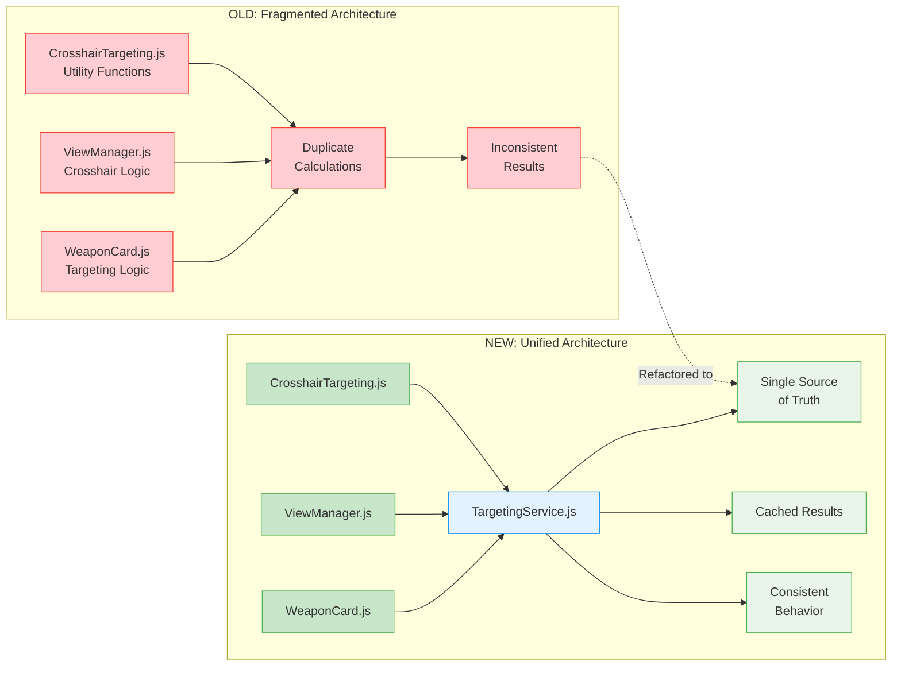
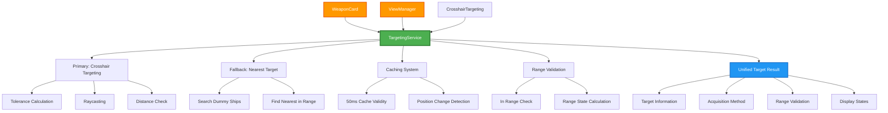
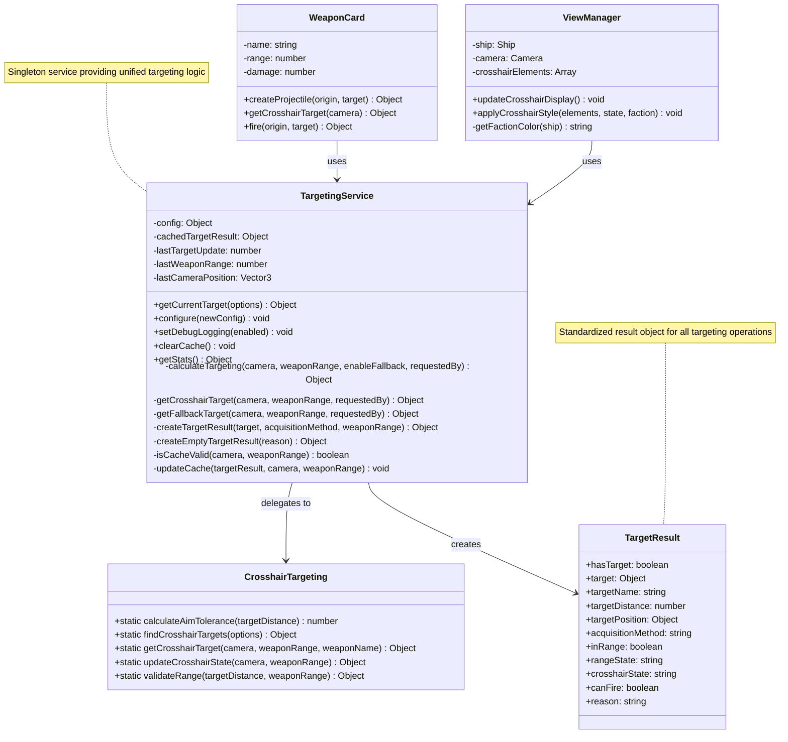
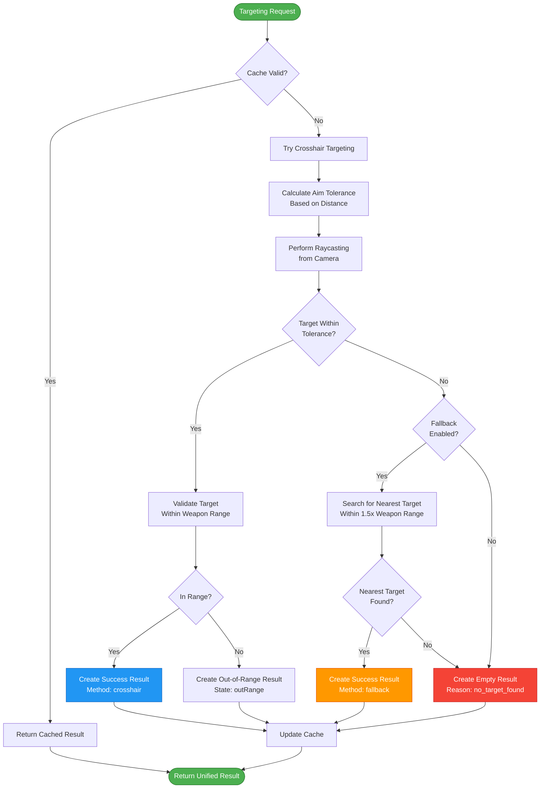
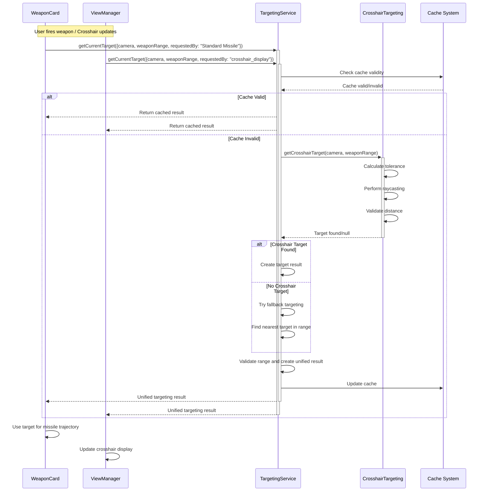

# Unified Targeting Architecture

## Overview

The Planetz game now uses a unified targeting system that ensures perfect synchronization between crosshair display and weapon firing logic. This eliminates the previous issues where the crosshair would show a valid target but missiles would miss.

## Architecture

### Architecture Overview



### Before: Fragmented Targeting
```
❌ OLD ARCHITECTURE:
├── CrosshairTargeting.js     # Tolerance calculation, raycasting
├── WeaponCard.js            # Duplicate targeting + fallback logic  
├── ViewManager.js           # Separate crosshair display logic
└── WeaponSystemCore.js      # Active weapon management

PROBLEMS:
- Duplicate calculations in multiple places
- Inconsistent targeting between crosshair and weapons
- Hard to maintain when targeting rules change
- Different fallback strategies in different systems
```

### After: Unified Targeting Service
```
✅ NEW ARCHITECTURE:
└── TargetingService.js       # Single source of truth
    ├── Crosshair Display     # ViewManager uses TargetingService
    ├── Weapon Firing         # WeaponCard uses TargetingService
    ├── Fallback Logic        # Unified fallback strategy
    └── Caching System        # Performance optimization

BENEFITS:
- Single source of truth for all targeting
- Perfect crosshair/weapon synchronization
- Consistent fallback behavior
- Performance optimized with caching
- Easy to maintain and debug
```

## System Architecture Diagram



## Key Components

### 1. TargetingService (`/services/TargetingService.js`)

The core service that handles all targeting operations:

- **Primary Method**: `getCurrentTarget(options)` - Returns unified targeting result
- **Crosshair Targeting**: Uses existing CrosshairTargeting utility for precision
- **Fallback Targeting**: Finds nearest target when crosshair fails
- **Caching**: Avoids redundant calculations (50ms cache validity)
- **Debug Support**: Comprehensive logging and statistics

### 2. Unified Target Result Object

All targeting operations return a standardized result:

```javascript
{
  // Target information
  hasTarget: boolean,
  target: Object,
  targetName: string,
  targetDistance: number,
  targetPosition: {x, y, z},
  targetShip: Object,
  targetMesh: Object,
  
  // Acquisition information
  acquisitionMethod: 'crosshair' | 'fallback' | 'none',
  acquisitionTime: timestamp,
  
  // Range validation
  inRange: boolean,
  rangeState: 'none' | 'inRange' | 'closeRange' | 'outRange',
  rangeRatio: number,
  weaponRange: number,
  
  // Display states
  crosshairState: string,  // For ViewManager
  canFire: boolean,        // For WeaponCard
  
  // Metadata
  reason: string
}
```

### 3. Class Relationships



### 4. Integration Points

#### WeaponCard Integration
```javascript
// OLD: Duplicate targeting logic with fallback
const crosshairTarget = this.getCrosshairTarget(camera);
// ... 30+ lines of fallback logic ...

// NEW: Single unified call
const targetingResult = targetingService.getCurrentTarget({
  camera: camera,
  weaponRange: this.range,
  requestedBy: this.name,
  enableFallback: true
});
```

#### ViewManager Integration
```javascript
// OLD: Separate crosshair logic
const crosshairState = CrosshairTargeting.updateCrosshairState(camera, weaponRangeMeters);

// NEW: Unified targeting service
const targetingResult = targetingService.getCurrentTarget({
  camera: camera,
  weaponRange: weaponRangeMeters,
  requestedBy: 'crosshair_display',
  enableFallback: false // Crosshair only shows precise targets
});
```

## Targeting Process Flow



## Sequence Diagram



## Configuration

The TargetingService can be configured:

```javascript
targetingService.configure({
  fallbackEnabled: true,
  fallbackRangeMultiplier: 1.5,  // Search within 1.5x weapon range
  enableCaching: true,
  cacheValidityMs: 50,
  enableDebugLogging: false
});
```

## Performance Optimizations

### 1. Intelligent Caching
- Results cached for 50ms to avoid redundant calculations
- Cache invalidated when camera moves >10m or weapon range changes
- Separate cache tracking for position and weapon range

### 2. Selective Fallback
- Crosshair display: `enableFallback: false` (only precise targets)
- Weapon firing: `enableFallback: true` (includes nearby targets)

### 3. Request Identification
- Each targeting request tagged with `requestedBy` for debugging
- Performance timing logged for optimization

## Debugging

### Global Access
```javascript
// Available in browser console
window.targetingService.getStats()
window.targetingService.setDebugLogging(true)
window.targetingService.clearCache()
```

### Debug Logging
When enabled, shows detailed targeting information:
```
🎯 TARGETING SUCCESS [Standard Missile]: Target Dummy 2 via fallback (12.3km, inRange) [1.2ms]
🎯 TARGETING FAILED [crosshair_display]: no_target_found [0.8ms]
```

## Migration Impact

### Files Modified
- ✅ `WeaponCard.js` - Now uses TargetingService
- ✅ `ViewManager.js` - Now uses TargetingService  
- ✅ `CrosshairTargeting.js` - Enhanced tolerance calculations
- ✅ Added `TargetingService.js` - New unified service

### Backwards Compatibility
- All existing APIs maintained for compatibility
- CrosshairTargeting utility still available for legacy code
- No breaking changes to weapon definitions or ship systems

## Expected Results

With unified targeting, you should see:

1. **✅ Perfect Synchronization**: Crosshair display exactly matches weapon hit probability
2. **✅ Consistent Behavior**: All weapons use identical targeting logic
3. **✅ Better Performance**: Cached targeting reduces redundant calculations
4. **✅ Easier Debugging**: Single place to debug all targeting issues
5. **✅ Maintainable Code**: Changes to targeting logic only need to be made in one place

## Future Enhancements

The unified architecture enables easy addition of:
- Predictive targeting for moving targets
- Advanced weapon-specific targeting modes
- AI-assisted targeting suggestions
- Multi-target weapon systems
- Dynamic targeting based on ship systems status

## Testing

Test the unified targeting by:
1. Firing missiles - should hit when crosshair shows valid target
2. Checking console logs - should show unified targeting messages
3. Weapon switching - crosshair should immediately reflect new weapon range
4. Target movement - should maintain consistent targeting across all systems