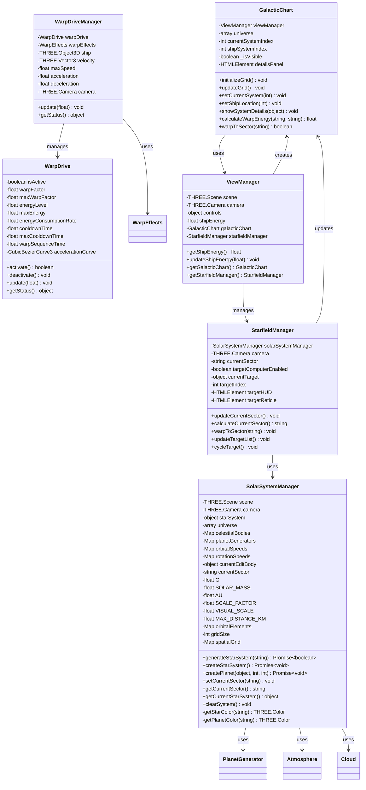
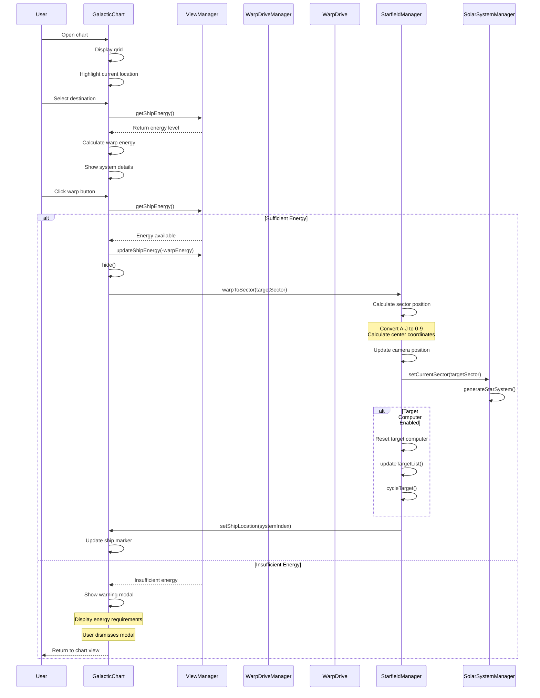
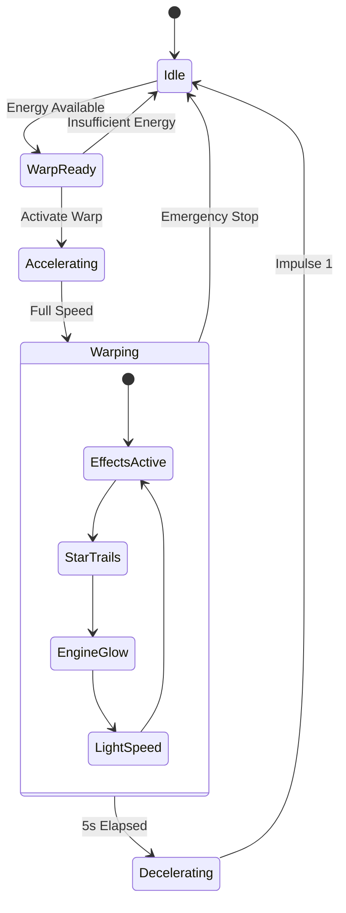

# Warp Drive and Galactic Chart Specification

## Overview
This document outlines the specifications for the warp drive system and galactic chart functionality in the space simulation application. The system provides sector-based navigation through a procedurally generated universe with energy management and visual feedback.

## User Experience Flow

### 1. Galactic Chart Navigation
1. User opens galactic chart
   - Modal window appears with grid layout
   - Current location highlighted
   - Available systems displayed
   - Energy cost tooltips shown

2. User selects destination
   - System details panel appears
   - Shows star information
   - Displays planet count
   - Shows required warp energy
   - Warp button enabled if sufficient energy

3. User initiates warp
   - Galactic chart UI dismissed
   - Ship begins acceleration sequence
   - Visual effects activate
   - Energy cost deducted

### 2. Warp Drive Sequence
1. Pre-warp Phase
   - Ship accelerates from current speed
   - Starfield begins to stretch
   - Engine effects intensify
   - Energy consumption begins

2. Warp Phase (5 seconds)
   - Star Wars-style light speed effect
   - Starfield trails visible
   - Engine effects at maximum
   - Ship position updates

3. Post-warp Phase
   - Warp effects taper off
   - Ship decelerates to impulse 1
   - New sector loads
   - System generation completes

### 3. Error Handling
1. Insufficient Energy
   - Warning modal appears
   - Shows required energy
   - Displays current energy
   - Galactic chart remains visible
   - User can select new destination

## Core Components

### 1. Warp Drive System
- **Energy Management**
  - Energy cost calculation based on Manhattan distance
  - Formula: (distance²) * 50 energy units
  - Energy validation before warp
  - Energy deduction after successful warp
  - Energy recharge system

- **Warp Mechanics**
  - Sector-based navigation
  - 5-second warp sequence
  - Acceleration/deceleration curves
  - Position calculation and validation
  - Impulse to warp transition

- **Visual Effects**
  - Star Wars light speed effect
  - Starfield stretching
  - Engine trail effects
  - Speed transition animations
  - Energy level indicators

### 2. Galactic Chart
- **Grid System**
  - 10x9 grid (A-J rows, 0-8 columns)
  - Sector coordinates (e.g., 'A0', 'B1')
  - Visual grid representation
  - Cell highlighting and selection

- **System Information**
  - Star system details
  - Planet count display
  - Faction information
  - Economy type
  - Technology level
  - Government type

- **Navigation Features**
  - Current location tracking
  - Sector selection
  - Distance calculation
  - Energy cost display
  - Warp validation

## Technical Specifications

### 1. Coordinate System
```javascript
// Sector size in game units
const SECTOR_SIZE = 100000;

// Sector coordinate calculation
const calculateSector = (x, z) => {
    const col = Math.max(0, Math.min(8, x + 4));
    const row = Math.max(0, Math.min(9, z + 5));
    return `${String.fromCharCode(65 + row)}${col}`;
};
```

### 2. Energy System
```javascript
// Energy cost calculation
const calculateWarpEnergy = (currentSector, targetSector) => {
    const distance = calculateManhattanDistance(currentSector, targetSector);
    return Math.pow(distance, 2) * 50;
};

// Energy recharge rate
const ENERGY_RECHARGE_RATE = 0.05; // 5% per second
```

### 3. Warp Drive State
```javascript
class WarpDrive {
    constructor() {
        this.isActive = false;
        this.warpFactor = 1.0;
        this.maxWarpFactor = 9.9;
        this.energyLevel = 100;
        this.maxEnergy = 100;
        this.energyConsumptionRate = 0.1;
        this.cooldownTime = 0;
        this.maxCooldownTime = 5000; // 5 seconds
        this.warpSequenceTime = 5000; // 5 seconds
        this.accelerationCurve = new CubicBezierCurve3(
            new THREE.Vector3(0, 0, 0),
            new THREE.Vector3(0.2, 0.8, 0),
            new THREE.Vector3(0.8, 1, 0),
            new THREE.Vector3(1, 1, 0)
        );
    }

    activate() {
        if (this.energyLevel > 0 && this.cooldownTime <= 0) {
            this.isActive = true;
            return true;
        }
        return false;
    }

    deactivate() {
        this.isActive = false;
        this.cooldownTime = this.maxCooldownTime;
    }

    setWarpFactor(factor) {
        if (factor >= 1.0 && factor <= this.maxWarpFactor) {
            this.warpFactor = factor;
            return true;
        }
        return false;
    }

    update(deltaTime) {
        if (this.isActive) {
            this.energyLevel = Math.max(0, this.energyLevel - 
                (this.energyConsumptionRate * this.warpFactor * deltaTime));
            if (this.energyLevel <= 0) {
                this.deactivate();
            }
        } else if (this.cooldownTime > 0) {
            this.cooldownTime = Math.max(0, this.cooldownTime - deltaTime);
        }
    }

    getStatus() {
        return {
            isActive: this.isActive,
            warpFactor: this.warpFactor,
            energyLevel: this.energyLevel,
            cooldownTime: this.cooldownTime
        };
    }
}
```

### 4. Warp Drive Manager
```javascript
class WarpDriveManager {
    constructor(camera) {
        this.warpDrive = new WarpDrive();
        this.ship = new THREE.Object3D();
        this.ship.position = new THREE.Vector3(0, 0, 0);
        this.velocity = new THREE.Vector3(0, 0, 0);
        this.maxSpeed = 1000;
        this.acceleration = 50;
        this.deceleration = 30;
        this.camera = camera;
    }

    update(deltaTime) {
        this.warpDrive.update(deltaTime);
        
        if (this.warpDrive.isActive) {
            // Apply warp speed
            const targetSpeed = this.maxSpeed * this.warpDrive.warpFactor;
            this.velocity.z = -targetSpeed; // Moving forward in -Z direction
            
            // Update ship position
            this.ship.position.add(this.velocity.clone().multiplyScalar(deltaTime));
            
            // Sync camera position with ship
            if (this.camera) {
                this.camera.position.copy(this.ship.position);
            }
        } else {
            // Normal deceleration
            if (this.velocity.length() > 0) {
                const decel = this.deceleration * deltaTime;
                if (this.velocity.length() <= decel) {
                    this.velocity.set(0, 0, 0);
                } else {
                    this.velocity.normalize().multiplyScalar(this.velocity.length() - decel);
                }
                this.ship.position.add(this.velocity.clone().multiplyScalar(deltaTime));
                
                // Sync camera position with ship
                if (this.camera) {
                    this.camera.position.copy(this.ship.position);
                }
            }
        }
    }
}
```

### 5. Visual Effects
```javascript
class WarpEffects {
    constructor(scene) {
        this.starTrails = new StarTrailSystem();
        this.engineGlow = new EngineGlowEffect();
        this.lightSpeedEffect = new LightSpeedEffect();
    }

    update(deltaTime, warpFactor) {
        this.starTrails.update(deltaTime, warpFactor);
        this.engineGlow.update(deltaTime, warpFactor);
        this.lightSpeedEffect.update(deltaTime, warpFactor);
    }
}
```

### 6. Star System Generation
```javascript
class SolarSystemManager {
    constructor(scene, camera) {
        this.scene = scene;
        this.camera = camera;
        this.starSystem = null;
        this.universe = null;
        this.celestialBodies = new Map();
        this.planetGenerators = new Map();
        this.orbitalSpeeds = new Map();
        this.rotationSpeeds = new Map();
        this.currentEditBody = null;
        this.currentSector = 'A0';
        
        // Physics constants
        this.G = 6.67430e-11;
        this.SOLAR_MASS = 1.989e30;
        this.AU = 149.6e9;
        this.SCALE_FACTOR = 1e-9;
        
        // Visual settings
        this.VISUAL_SCALE = 200.0;
        this.MAX_DISTANCE_KM = 3.2e6;
        
        // Spatial organization
        this.gridSize = 20;
        this.spatialGrid = new Map();
        this.orbitalElements = new Map();
    }

    async generateStarSystem(sector) {
        if (!this.universe) {
            console.error('No universe data available');
            return false;
        }

        this.starSystem = this.universe.find(system => system.sector === sector);
        
        if (!this.starSystem) {
            console.error('No star system data found for sector:', sector);
            return false;
        }

        try {
            await this.createStarSystem();
            return true;
        } catch (error) {
            console.error('Failed to generate star system:', error);
            return false;
        }
    }
}
```

## Testing Specifications

### 1. Warp Drive Tests
```javascript
describe('WarpDrive', () => {
    test('should initialize with default values', () => {
        expect(warpDrive.isActive).toBe(false);
        expect(warpDrive.warpFactor).toBe(1.0);
        expect(warpDrive.energyLevel).toBe(100);
    });

    test('should activate when energy is available', () => {
        expect(warpDrive.activate()).toBe(true);
        expect(warpDrive.isActive).toBe(true);
    });

    test('should not activate when energy is depleted', () => {
        warpDrive.energyLevel = 0;
        expect(warpDrive.activate()).toBe(false);
        expect(warpDrive.isActive).toBe(false);
    });

    test('should deactivate and start cooldown', () => {
        warpDrive.activate();
        warpDrive.deactivate();
        expect(warpDrive.isActive).toBe(false);
        expect(warpDrive.cooldownTime).toBe(warpDrive.maxCooldownTime);
    });

    test('should update energy level during warp', () => {
        warpDrive.activate();
        const initialEnergy = warpDrive.energyLevel;
        warpDrive.update(1000);
        expect(warpDrive.energyLevel).toBeLessThan(initialEnergy);
    });
});
```

### 2. Energy System Tests
```javascript
describe('Warp Drive Energy Tests', () => {
    test('Warp energy calculation is correct', () => {
        // Test A0 to E4 (Manhattan distance = 9)
        const energy = galacticChart.calculateWarpEnergy(0, 40);
        expect(energy).toBe(4050); // (9^2 * 50)
    });

    test('Insufficient energy prevents warp', () => {
        viewManager.updateShipEnergy(-9000); // Set energy to low level
        expect(galacticChart.warpToSector('E4')).toBe(false);
    });

    test('Successful warp deducts correct energy', () => {
        const initialEnergy = viewManager.getShipEnergy();
        galacticChart.warpToSector('E4');
        const finalEnergy = viewManager.getShipEnergy();
        expect(finalEnergy).toBe(initialEnergy - 4050);
    });
});
```

## User Interface

### 1. Galactic Chart Display
- Modal window with grid layout
- System information panel
- Action buttons (Warp/Probe)
- Energy cost tooltips
- Current location indicator

### 2. Warp Controls
- Warp activation button
- Energy level display
- Warning messages
- Visual feedback

### 3. Warp Effects
- Star field stretching
- Engine trails
- Light speed effect
- Speed transition animations

## Task List

### Phase 1: Core Implementation
- [ ] Implement basic warp drive mechanics
  - [ ] Create WarpDrive class
  - [ ] Implement energy management
  - [ ] Add acceleration curves
  - [ ] Implement warp sequence timing

- [ ] Develop galactic chart grid
  - [ ] Create grid layout
  - [ ] Implement sector coordinates
  - [ ] Add cell highlighting
  - [ ] Implement selection system

### Phase 2: Visual Effects
- [ ] Implement warp effects
  - [ ] Create star trail system
  - [ ] Add engine glow effects
  - [ ] Implement light speed effect
  - [ ] Add transition animations

- [ ] Add UI feedback
  - [ ] Create warning modals
  - [ ] Add energy indicators
  - [ ] Implement progress feedback
  - [ ] Add visual cues

### Phase 3: Navigation
- [ ] Implement sector navigation
  - [ ] Add position calculation
  - [ ] Implement warp sequence
  - [ ] Add location tracking
  - [ ] Create navigation feedback

- [ ] Add system generation
  - [ ] Implement sector seeding
  - [ ] Add star system generation
  - [ ] Create planet generation
  - [ ] Add system information

### Phase 4: User Interface
- [ ] Create galactic chart UI
  - [ ] Design grid layout
  - [ ] Add system details panel
  - [ ] Implement tooltips
  - [ ] Add action buttons

- [ ] Implement warp controls
  - [ ] Add warp activation
  - [ ] Create energy display
  - [ ] Implement warnings
  - [ ] Add visual feedback

### Phase 5: Testing and Optimization
- [ ] Add unit tests
  - [ ] Test warp mechanics
  - [ ] Test energy system
  - [ ] Test navigation
  - [ ] Test UI components

- [ ] Performance optimization
  - [ ] Optimize calculations
  - [ ] Improve rendering
  - [ ] Add caching
  - [ ] Optimize state updates

## Implementation Notes

### 1. Warp Drive
- Ensure smooth acceleration/deceleration
- Implement proper visual effects
- Add appropriate feedback
- Handle edge cases

### 2. Galactic Chart
- Maintain consistent grid layout
- Ensure accurate sector tracking
- Provide clear system information
- Handle navigation edge cases

### 3. Energy System
- Validate energy requirements
- Provide clear feedback
- Handle energy depletion
- Implement recharge mechanics

### 4. Visual Effects
- Create smooth transitions
- Optimize performance
- Handle edge cases
- Provide clear feedback

### 5. Testing
- Test all edge cases
- Verify energy calculations
- Validate navigation
- Check UI responsiveness

## Future Enhancements
1. Advanced warp effects
2. Multiple warp drive types
3. Sector scanning system
4. Advanced navigation features
5. Enhanced system information
6. Improved visual feedback
7. Additional energy sources
8. Warp drive upgrades

## Dependencies
- Three.js for 3D rendering
- Custom physics engine
- Procedural generation system
- State management system
- UI framework
- Testing framework

## System Architecture

### Class Diagram


### Sequence Diagrams

#### Warp Drive Process Interaction


### State Diagram

