# Warp System Sequence Diagram

This diagram shows the complete flow of player warping from one sector to another in PlanetZ.

```mermaid
sequenceDiagram
    participant Player
    participant GalacticChart
    participant ViewManager
    participant WarpDriveManager
    participant SectorNavigation
    participant WarpDrive
    participant WarpEffects
    participant WarpFeedback
    participant SolarSystemManager
    participant StarfieldManager
    participant TargetComputerManager
    participant StarChartsManager
    participant OpsHUD

    Note over Player: Player presses G key to open Galactic Chart
    Player->>GalacticChart: G key pressed
    GalacticChart->>GalacticChart: show()
    GalacticChart->>GalacticChart: canActivate() check
    GalacticChart-->>Player: Display galactic chart interface

    Note over Player: Player selects destination and clicks WARP button
    Player->>GalacticChart: Click WARP button
    GalacticChart->>GalacticChart: Warp validation starts
    
    Note over GalacticChart: Validation Phase
    GalacticChart->>ViewManager: Check warp drive cards
    ViewManager-->>GalacticChart: hasWarpCards result
    
    alt No warp cards
        GalacticChart->>WarpFeedback: showWarning("Warp Drive Cards Missing")
        WarpFeedback-->>Player: Display warning modal
        Note over Player: Warp blocked - player needs warp cards
    else Has warp cards
        GalacticChart->>ViewManager: getShipEnergy()
        ViewManager-->>GalacticChart: currentEnergy
        GalacticChart->>GalacticChart: Calculate required energy
        
        alt Insufficient energy
            GalacticChart->>WarpFeedback: showWarning("Insufficient Energy")
            WarpFeedback-->>Player: Display energy warning
            Note over Player: Warp blocked - need more energy
        else Sufficient energy
            Note over GalacticChart: All validations passed
            GalacticChart->>GalacticChart: hide()
            GalacticChart->>WarpDriveManager: navigateToSector(targetSector)
        end
    end

    Note over WarpDriveManager: Warp Initiation Phase
    WarpDriveManager->>StarfieldManager: Store target computer state
    WarpDriveManager->>StarfieldManager: clearTargetComputer()
    WarpDriveManager->>ViewManager: getStarSystemForSector(targetSector)
    ViewManager-->>WarpDriveManager: destinationSystem
    WarpDriveManager->>WarpEffects: showAll(destinationSystem)
    WarpDriveManager->>SectorNavigation: startNavigation(targetSector)

    Note over SectorNavigation: Navigation Start
    SectorNavigation->>SectorNavigation: Energy validation
    SectorNavigation->>StarfieldManager: clearTargetComputer()
    SectorNavigation->>StarfieldManager: Deactivate proximity radar
    SectorNavigation->>SolarSystemManager: clearSystem()
    SectorNavigation->>SectorNavigation: Set navigation parameters
    SectorNavigation->>WarpDrive: activate()
    
    Note over WarpDrive: Warp Drive Activation
    WarpDrive->>WarpDrive: canActivateWarp() check
    WarpDrive->>WarpDrive: Calculate energy cost
    WarpDrive->>WarpDrive: Set isWarping = true
    WarpDrive->>WarpFeedback: showAll()
    WarpDrive->>WarpFeedback: Auto-show OPS HUD
    WarpFeedback->>OpsHUD: updateWarpStatus(0, "Warp Navigation", true)
    WarpDrive->>WarpDriveManager: onWarpStart callback
    WarpDriveManager->>WarpEffects: showAll()
    
    Note over SectorNavigation: Set view to FORE
    SectorNavigation->>StarfieldManager: setView('FORE')
    SectorNavigation->>WarpFeedback: showAll()
    SectorNavigation->>WarpFeedback: updateProgress(0, "Warp Navigation")

    Note over SectorNavigation: Navigation Loop (12 seconds total)
    loop Every frame during warp
        SectorNavigation->>SectorNavigation: update(deltaTime)
        SectorNavigation->>SectorNavigation: Calculate progress
        
        alt Before arrival (0-8 seconds)
            SectorNavigation->>SectorNavigation: Accelerate to arrival point
            SectorNavigation->>WarpDrive: setWarpFactor(increasing)
            SectorNavigation->>SectorNavigation: Update camera position
        else At arrival (8 seconds)
            SectorNavigation->>SectorNavigation: _hasArrived = true
            SectorNavigation->>SectorNavigation: currentSector = targetSector
            SectorNavigation->>SectorNavigation: camera.position = targetPosition
            SectorNavigation->>ViewManager: galacticChart.setShipLocation()
        else After arrival (8-12 seconds)
            SectorNavigation->>SectorNavigation: Hold position
            SectorNavigation->>WarpDrive: setWarpFactor(max)
        end
        
        SectorNavigation->>WarpFeedback: updateProgress(percentage, phase)
        WarpFeedback->>OpsHUD: updateWarpStatus(percentage, phase, true)
    end

    Note over SectorNavigation: Navigation Complete (12 seconds)
    SectorNavigation->>SectorNavigation: completeNavigation()
    
    Note over SectorNavigation: Force Reset Navigation Systems
    SectorNavigation->>StarfieldManager: Reset target computer
    StarfieldManager->>TargetComputerManager: hideTargetHUD()
    StarfieldManager->>TargetComputerManager: hideTargetReticle()
    StarfieldManager->>StarfieldManager: Clear wireframes
    SectorNavigation->>StarChartsManager: currentSector = newSector
    
    Note over SectorNavigation: Complete warp sequence
    SectorNavigation->>WarpFeedback: hideAll()
    WarpFeedback->>OpsHUD: hideWarpStatus()
    SectorNavigation->>WarpDrive: deactivate()
    
    Note over WarpDrive: Warp Drive Deactivation
    WarpDrive->>WarpDrive: isWarping = false
    WarpDrive->>WarpDrive: Start cooldown
    WarpDrive->>WarpFeedback: updateProgress(100, "Warp Cooldown")
    WarpFeedback->>OpsHUD: updateWarpStatus(100, "Warp Cooldown", true)
    WarpDrive->>WarpDriveManager: onWarpEnd callback (if connected)
    
    Note over WarpDriveManager: System Generation (Parallel to cooldown)
    alt WarpDriveManager.handleWarpEnd() called
        WarpDriveManager->>WarpEffects: hideAll()
        WarpDriveManager->>SolarSystemManager: setCurrentSector(newSector)
        WarpDriveManager->>SolarSystemManager: generateStarSystem(newSector)
        WarpDriveManager->>ViewManager: galacticChart.setShipLocation()
        WarpDriveManager->>StarfieldManager: Restore target computer if enabled
    end
    
    Note over SectorNavigation: Final cleanup
    SectorNavigation->>SectorNavigation: isNavigating = false
    
    Note over StarfieldManager: Update target list for new sector
    StarfieldManager->>StarfieldManager: updateTargetList()
    StarfieldManager->>StarfieldManager: cycleTarget()
    
    Note over Player: Warp complete - player now in new sector
    Player->>TargetComputerManager: Press T key (target computer)
    TargetComputerManager-->>Player: Shows objects from NEW sector
    Player->>StarChartsManager: Press C key (star charts)
    StarChartsManager-->>Player: Shows objects from NEW sector
    
    Note over WarpFeedback: Cooldown complete
    WarpFeedback->>WarpFeedback: hideAll() after cooldown
    WarpFeedback->>OpsHUD: hideWarpStatus()
```

## Key Components

### Core Warp System Classes
- **GalacticChart**: User interface for sector selection and warp initiation
- **WarpDriveManager**: Coordinates warp process and system generation
- **SectorNavigation**: Handles actual navigation, timing, and position updates
- **WarpDrive**: Manages warp drive state, energy consumption, and callbacks
- **WarpEffects**: Visual effects during warp (stars, rings, etc.)
- **WarpFeedback**: Progress display and OPS HUD integration

### Navigation System Classes
- **StarfieldManager**: Central coordinator for all navigation systems
- **TargetComputerManager**: Target selection and tracking
- **StarChartsManager**: Discovery-based navigation with fog of war
- **SolarSystemManager**: Generates and manages star system objects

### Support Classes
- **ViewManager**: Camera and view management
- **OpsHUD**: Operations interface showing warp progress

## Timing Breakdown

| Phase | Duration | Description |
|-------|----------|-------------|
| **Validation** | Instant | Check warp cards, energy, calculate requirements |
| **Initiation** | ~100ms | Clear systems, set parameters, activate warp drive |
| **Acceleration** | 0-8 seconds | Accelerate to arrival point, update position |
| **Arrival** | 8 seconds | Update sector, set final position |
| **Deceleration** | 8-12 seconds | Hold position, maintain max warp factor |
| **Completion** | 12 seconds | Reset navigation systems, deactivate warp |
| **Cooldown** | Variable | Warp drive cooldown period |

## Critical Fix Points

1. **SectorNavigation.completeNavigation()** - Primary warp completion handler
2. **Force reset navigation systems** - Ensures target computer and star charts show correct sector
3. **OPS HUD integration** - Warp progress shown in operations interface
4. **Energy validation** - Prevents warp without sufficient energy
5. **System generation** - Creates new star system objects for destination sector
