# Waypoints System Specification

## 🎯 **System Overview**

The Waypoints System provides dynamic mission guidance through virtual navigation markers that exist only in the game's HUD and targeting systems. Unlike physical celestial objects, waypoints are ephemeral mission-specific markers that guide players through complex mission sequences and provide contextual actions when reached.

### **Core Design Principles**

1. **Virtual Navigation**: Waypoints exist only as HUD elements - no physical presence in 3D space
2. **Mission-Driven**: Created and managed by the mission system for specific objectives
3. **Action-Oriented**: Each waypoint can trigger multiple actions when reached
4. **Sequential Flow**: Support for waypoint chains and branching mission paths
5. **User-Friendly**: Clear visual indicators and intuitive interaction patterns

## 🎮 **User Experience Overview**

### **Player Interaction Flow**

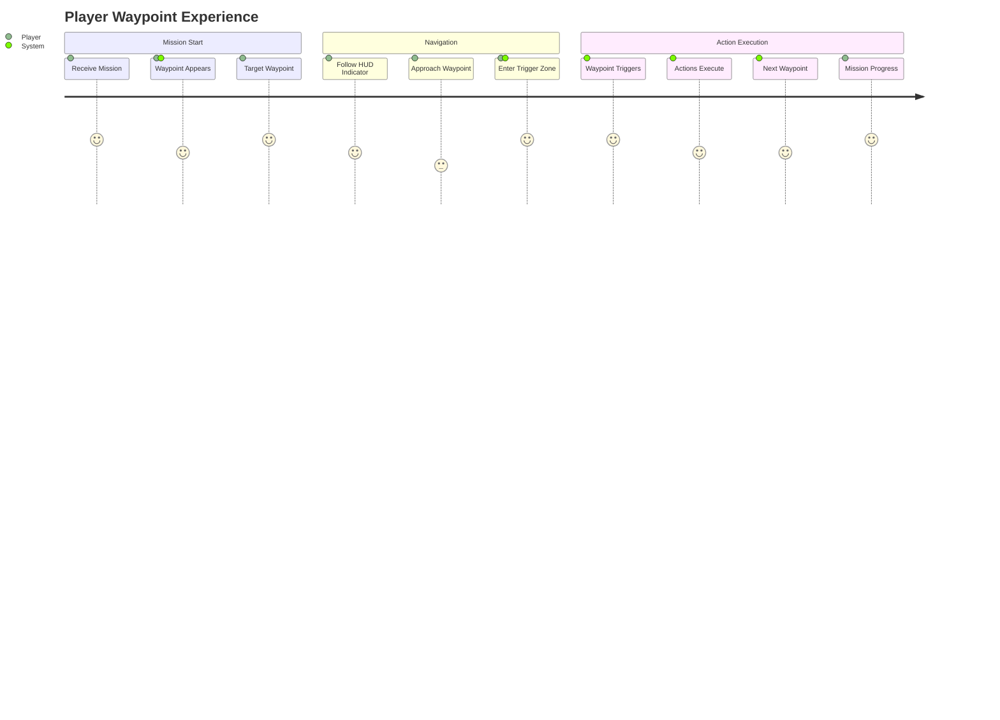

### **Visual Experience**

- **HUD Indicator**: Rotating 3D wireframe diamond visible in cockpit view
- **Target Computer**: Waypoint appears as selectable target with distance/bearing
- **Star Charts**: Waypoint visible as mission marker with distinct iconography
- **Audio Feedback**: Confirmation sounds when waypoints are reached and triggered

## 📊 **System Architecture**

### **Core Components**

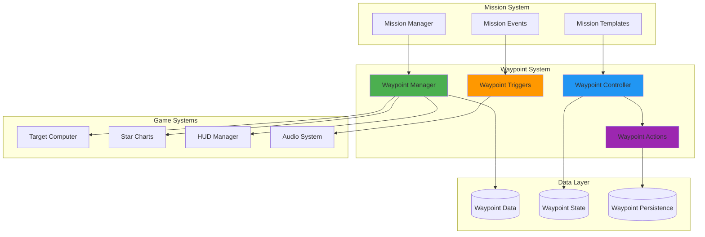

### **Data Model**

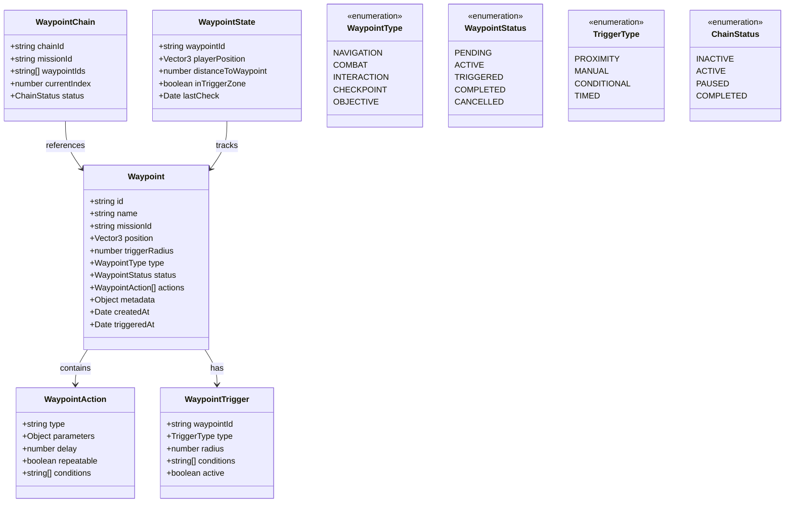

## 🎯 **User Interaction Patterns**

### **1. Waypoint Discovery & Targeting**

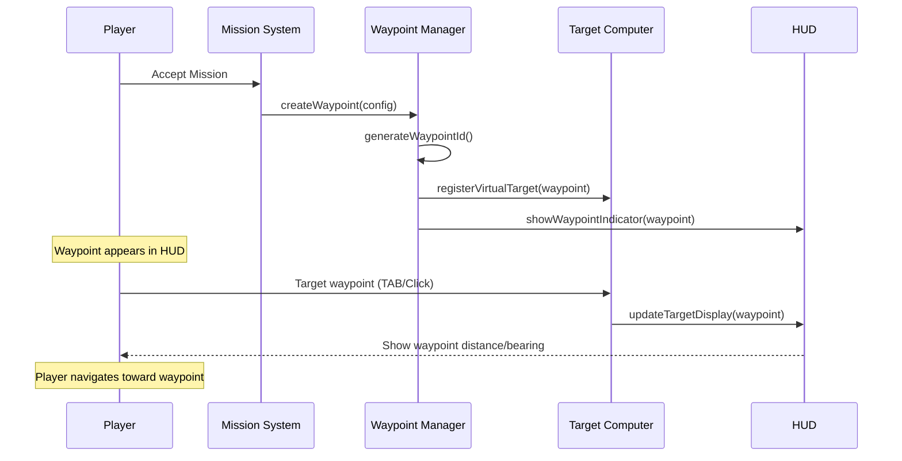

### **2. Waypoint Approach & Triggering**

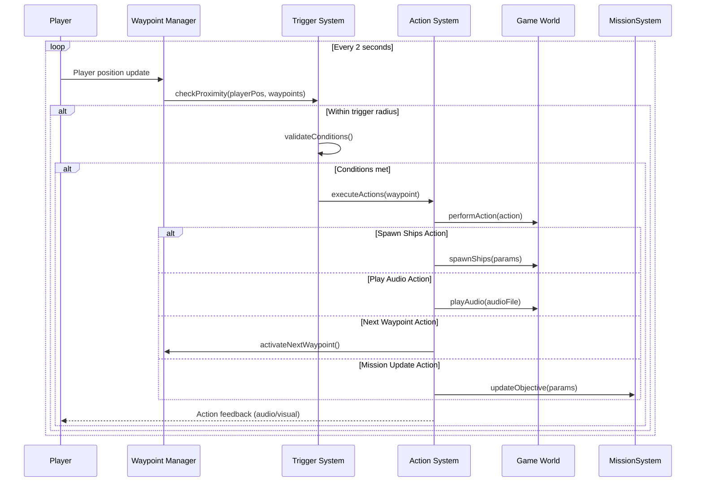

### **3. Waypoint Chain Management**

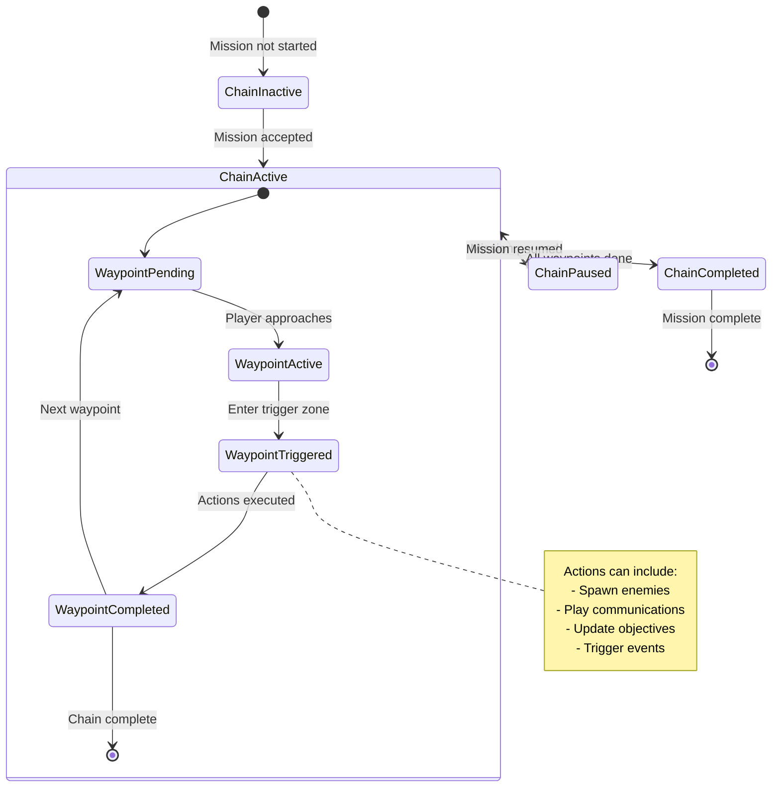

## 🎮 **User Interface Integration**

### **HUD Integration**

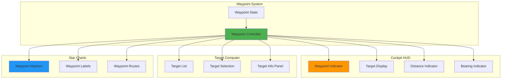

### **Visual Design Specifications**

#### **Waypoint Indicator (3D HUD)**
- **Shape**: Rotating wireframe diamond
- **Color**: Mission-specific (default: cyan #00FFFF)
- **Animation**: Slow rotation (1 revolution per 4 seconds)
- **Size**: Scales with distance (larger when closer)
- **Transparency**: 70% opacity to avoid blocking view

#### **Target Computer Display**
- **Name Format**: "Mission Waypoint #N" or custom name
- **Distance**: Real-time distance in kilometers
- **Bearing**: Relative bearing from ship's heading
- **Status**: "ACTIVE" | "APPROACHING" | "IN RANGE"

#### **Star Charts Integration**
- **Icon**: Diamond shape with mission color
- **Label**: Waypoint name with mission context
- **Route Lines**: Dashed lines connecting waypoint sequence
- **Zoom Behavior**: Always visible regardless of zoom level

## 🔧 **Technical Implementation**

### **Waypoint Manager Class**

```javascript
class WaypointManager {
    constructor() {
        this.activeWaypoints = new Map();
        this.waypointChains = new Map();
        this.triggerCheckInterval = 2000; // 2 seconds
        this.lastTriggerCheck = 0;
    }

    /**
     * Create a new waypoint for mission guidance
     */
    createWaypoint(config) {
        const waypoint = {
            id: this.generateWaypointId(),
            name: config.name || `Mission Waypoint #${this.getNextWaypointNumber()}`,
            missionId: config.missionId,
            position: config.position,
            triggerRadius: config.triggerRadius || 10.0,
            type: config.type || 'NAVIGATION',
            status: 'PENDING',
            actions: config.actions || [],
            metadata: config.metadata || {},
            createdAt: new Date()
        };

        this.activeWaypoints.set(waypoint.id, waypoint);
        this.registerWithTargetComputer(waypoint);
        this.updateHUDDisplay(waypoint);
        
        return waypoint.id;
    }

    /**
     * Check for waypoint triggers based on player proximity
     */
    checkWaypointTriggers() {
        const now = Date.now();
        if (now - this.lastTriggerCheck < this.triggerCheckInterval) {
            return;
        }

        const playerPosition = this.getPlayerPosition();
        
        for (const [waypointId, waypoint] of this.activeWaypoints) {
            if (waypoint.status === 'ACTIVE') {
                const distance = this.calculateDistance(playerPosition, waypoint.position);
                
                if (distance <= waypoint.triggerRadius) {
                    this.triggerWaypoint(waypointId);
                }
            }
        }

        this.lastTriggerCheck = now;
    }

    /**
     * Execute waypoint actions when triggered
     */
    async triggerWaypoint(waypointId) {
        const waypoint = this.activeWaypoints.get(waypointId);
        if (!waypoint || waypoint.status !== 'ACTIVE') {
            return;
        }

        waypoint.status = 'TRIGGERED';
        waypoint.triggeredAt = new Date();

        // Execute all waypoint actions
        for (const action of waypoint.actions) {
            await this.executeWaypointAction(action, waypoint);
        }

        waypoint.status = 'COMPLETED';
        this.onWaypointCompleted(waypoint);
    }

    /**
     * Execute individual waypoint action
     */
    async executeWaypointAction(action, waypoint) {
        switch (action.type) {
            case 'spawn_ships':
                await this.spawnShips(action.parameters);
                break;
            
            case 'play_comm':
                await this.playCommunication(action.parameters);
                break;
            
            case 'next_waypoint':
                this.activateNextWaypoint(waypoint.missionId);
                break;
            
            case 'mission_update':
                await this.updateMissionStatus(action.parameters);
                break;
            
            case 'custom_event':
                await this.triggerCustomEvent(action.parameters);
                break;
            
            default:
                console.warn(`Unknown waypoint action type: ${action.type}`);
        }
    }

    /**
     * Create a chain of waypoints for complex missions
     */
    createWaypointChain(missionId, waypointConfigs) {
        const chainId = `${missionId}_chain`;
        const waypointIds = [];

        // Create all waypoints in the chain
        for (const config of waypointConfigs) {
            config.missionId = missionId;
            const waypointId = this.createWaypoint(config);
            waypointIds.push(waypointId);
        }

        // Create chain management object
        const chain = {
            chainId,
            missionId,
            waypointIds,
            currentIndex: 0,
            status: 'INACTIVE'
        };

        this.waypointChains.set(chainId, chain);
        
        // Activate first waypoint
        this.activateWaypointChain(chainId);
        
        return chainId;
    }

    /**
     * Activate waypoint chain and first waypoint
     */
    activateWaypointChain(chainId) {
        const chain = this.waypointChains.get(chainId);
        if (!chain) return;

        chain.status = 'ACTIVE';
        
        // Activate first waypoint
        if (chain.waypointIds.length > 0) {
            const firstWaypointId = chain.waypointIds[0];
            this.activateWaypoint(firstWaypointId);
        }
    }

    /**
     * Advance to next waypoint in chain
     */
    activateNextWaypoint(missionId) {
        const chain = Array.from(this.waypointChains.values())
            .find(c => c.missionId === missionId && c.status === 'ACTIVE');
        
        if (!chain) return;

        chain.currentIndex++;
        
        if (chain.currentIndex < chain.waypointIds.length) {
            // Activate next waypoint
            const nextWaypointId = chain.waypointIds[chain.currentIndex];
            this.activateWaypoint(nextWaypointId);
        } else {
            // Chain completed
            chain.status = 'COMPLETED';
            this.onWaypointChainCompleted(chain);
        }
    }
}
```

### **Integration Points**

#### **Target Computer Integration**

```javascript
// TargetComputerManager.js enhancement
class TargetComputerManager {
    // Existing methods...

    /**
     * Set virtual waypoint as target
     */
    setVirtualTarget(waypointId) {
        const waypoint = window.waypointManager?.getWaypoint(waypointId);
        if (!waypoint) {
            console.warn(`Waypoint not found: ${waypointId}`);
            return false;
        }

        // Create virtual target object
        const virtualTarget = {
            id: waypointId,
            name: waypoint.name,
            type: 'waypoint',
            position: waypoint.position,
            isVirtual: true,
            missionId: waypoint.missionId,
            userData: {
                waypointType: waypoint.type,
                triggerRadius: waypoint.triggerRadius
            }
        };

        this.currentTarget = virtualTarget;
        this.updateTargetDisplay();
        
        debug('TARGETING', `Virtual target set: ${waypoint.name}`);
        return true;
    }

    /**
     * Check if current target is a waypoint
     */
    isCurrentTargetWaypoint() {
        return this.currentTarget && 
               this.currentTarget.type === 'waypoint' && 
               this.currentTarget.isVirtual;
    }
}
```

#### **Star Charts Integration**

```javascript
// StarChartsUI.js enhancement
class StarChartsUI {
    // Existing methods...

    /**
     * Render waypoints on star charts
     */
    renderWaypoints() {
        if (!window.waypointManager) return;

        const activeWaypoints = window.waypointManager.getActiveWaypoints();
        
        for (const waypoint of activeWaypoints) {
            this.renderWaypointMarker(waypoint);
        }
    }

    /**
     * Render individual waypoint marker
     */
    renderWaypointMarker(waypoint) {
        const screenPos = this.worldToScreen(waypoint.position);
        if (!screenPos) return;

        // Create waypoint marker
        const marker = document.createElementNS('http://www.w3.org/2000/svg', 'g');
        marker.setAttribute('class', 'waypoint-marker');
        marker.setAttribute('transform', `translate(${screenPos.x}, ${screenPos.y})`);

        // Diamond shape
        const diamond = document.createElementNS('http://www.w3.org/2000/svg', 'polygon');
        diamond.setAttribute('points', '0,-8 8,0 0,8 -8,0');
        diamond.setAttribute('fill', 'none');
        diamond.setAttribute('stroke', this.getWaypointColor(waypoint));
        diamond.setAttribute('stroke-width', '2');
        diamond.setAttribute('class', 'waypoint-diamond');

        // Label
        const label = document.createElementNS('http://www.w3.org/2000/svg', 'text');
        label.setAttribute('x', '0');
        label.setAttribute('y', '20');
        label.setAttribute('text-anchor', 'middle');
        label.setAttribute('fill', this.getWaypointColor(waypoint));
        label.setAttribute('font-size', '10');
        label.textContent = waypoint.name;

        marker.appendChild(diamond);
        marker.appendChild(label);
        
        // Add click handler
        marker.addEventListener('click', () => {
            this.selectWaypoint(waypoint.id);
        });

        this.svg.appendChild(marker);
    }

    /**
     * Handle waypoint selection
     */
    selectWaypoint(waypointId) {
        // Set as target in Target Computer
        if (window.targetComputerManager) {
            window.targetComputerManager.setVirtualTarget(waypointId);
        }

        // Update UI feedback
        this.updateSelectedWaypoint(waypointId);
    }
}
```

## 🎯 **Waypoint Action Types**

### **Core Action Types**

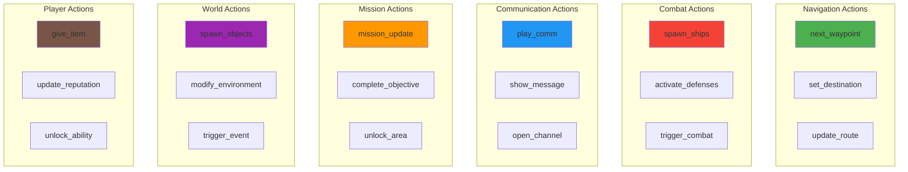

### **Action Configuration Examples**

```javascript
// Navigation waypoint with ship spawning
const combatWaypoint = {
    name: "Ambush Point Alpha",
    position: [150, 25, 75],
    triggerRadius: 15.0,
    type: 'COMBAT',
    actions: [
        {
            type: 'spawn_ships',
            parameters: {
                shipType: 'enemy_fighter',
                count: 3,
                formation: 'triangle',
                faction: 'pirates',
                spawnRadius: 20.0,
                behavior: 'aggressive'
            }
        },
        {
            type: 'play_comm',
            parameters: {
                audioFile: 'mission_ambush_warning.mp3',
                subtitle: "Warning: Enemy ships detected!",
                duration: 3000
            }
        },
        {
            type: 'next_waypoint',
            parameters: {
                delay: 5000 // Wait 5 seconds before activating next waypoint
            }
        }
    ]
};

// Checkpoint waypoint with mission update
const checkpointWaypoint = {
    name: "Checkpoint Bravo",
    position: [200, 0, 100],
    triggerRadius: 10.0,
    type: 'CHECKPOINT',
    actions: [
        {
            type: 'mission_update',
            parameters: {
                objectiveId: 'reach_checkpoint_bravo',
                status: 'completed',
                message: "Checkpoint Bravo reached. Proceeding to final objective."
            }
        },
        {
            type: 'give_item',
            parameters: {
                itemType: 'upgrade_module',
                itemId: 'shield_booster_mk2',
                quantity: 1,
                message: "Shield booster acquired from supply cache."
            }
        }
    ]
};

// Communication waypoint
const commWaypoint = {
    name: "Comm Relay Station",
    position: [75, 50, 0],
    triggerRadius: 12.0,
    type: 'INTERACTION',
    actions: [
        {
            type: 'open_channel',
            parameters: {
                channelId: 'mission_control',
                npcId: 'commander_hayes',
                dialogueTree: 'mission_briefing_update'
            }
        },
        {
            type: 'show_message',
            parameters: {
                title: "Mission Update",
                message: "New intelligence received. Updating mission parameters.",
                duration: 5000,
                priority: 'high'
            }
        }
    ]
};
```

## 🎮 **User Experience Scenarios**

### **Scenario 1: Escort Mission with Multiple Waypoints**

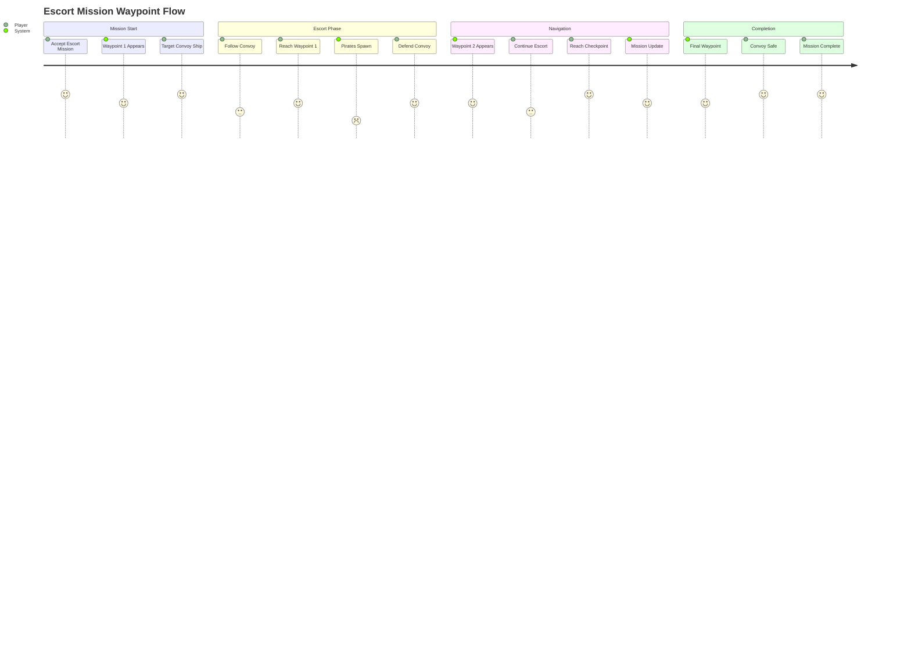

### **Scenario 2: Exploration Mission with Discovery Waypoints**

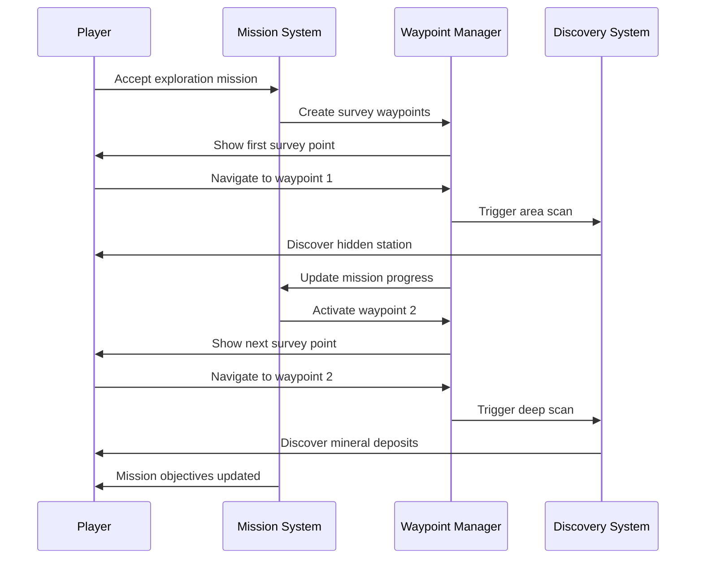

### **Scenario 3: Combat Mission with Dynamic Waypoints**

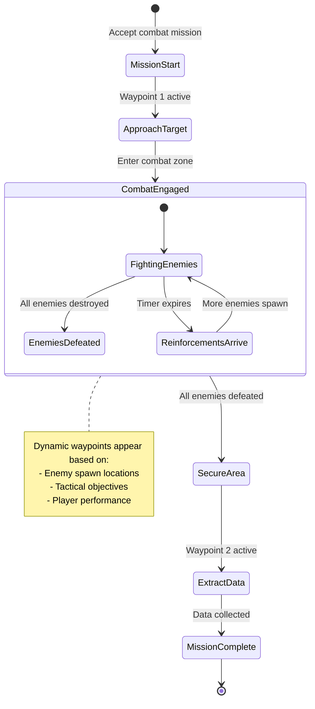

## 🔧 **Advanced Features**

### **Conditional Waypoints**

```javascript
// Waypoint that only appears under certain conditions
const conditionalWaypoint = {
    name: "Emergency Extraction Point",
    position: [300, 100, 50],
    triggerRadius: 20.0,
    type: 'CONDITIONAL',
    conditions: [
        {
            type: 'hull_damage',
            operator: 'greater_than',
            value: 75 // Appears when hull damage > 75%
        },
        {
            type: 'mission_timer',
            operator: 'less_than',
            value: 300 // And less than 5 minutes remaining
        }
    ],
    actions: [
        {
            type: 'emergency_extraction',
            parameters: {
                extractionShip: 'rescue_transport',
                safetyRadius: 50.0
            }
        }
    ]
};
```

### **Branching Waypoint Paths**

```javascript
// Mission with multiple possible paths
const branchingMission = {
    missionId: 'diplomatic_crisis',
    waypointChains: [
        {
            chainId: 'peaceful_resolution',
            condition: 'reputation_high',
            waypoints: [
                { name: "Diplomatic Meeting", position: [100, 0, 0] },
                { name: "Treaty Signing", position: [150, 0, 0] }
            ]
        },
        {
            chainId: 'military_intervention',
            condition: 'reputation_low',
            waypoints: [
                { name: "Military Staging Area", position: [100, 50, 0] },
                { name: "Combat Zone", position: [200, 50, 0] },
                { name: "Secure Territory", position: [250, 50, 0] }
            ]
        }
    ]
};
```

### **Timed Waypoints**

```javascript
// Waypoint that expires after a certain time
const timedWaypoint = {
    name: "Rendezvous Point",
    position: [175, 25, 25],
    triggerRadius: 15.0,
    type: 'TIMED',
    timeLimit: 600000, // 10 minutes
    onExpiry: {
        type: 'mission_failure',
        parameters: {
            reason: 'Failed to reach rendezvous in time',
            allowRetry: true
        }
    },
    actions: [
        {
            type: 'meet_contact',
            parameters: {
                contactId: 'informant_delta',
                intel: 'enemy_fleet_positions'
            }
        }
    ]
};
```

## 📊 **Performance Considerations**

### **Optimization Strategies**

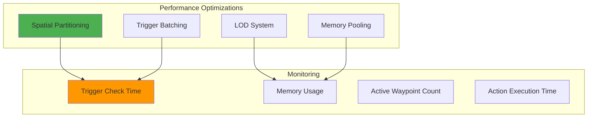

### **Performance Targets**

```javascript
const PERFORMANCE_TARGETS = {
    triggerCheckTime: '< 2ms per check cycle',
    maxActiveWaypoints: '< 50 simultaneous waypoints',
    memoryUsage: '< 10MB for waypoint system',
    actionExecutionTime: '< 5ms per action',
    uiUpdateTime: '< 1ms per frame'
};
```

## 🧪 **Testing Strategy**

### **Test Scenarios**

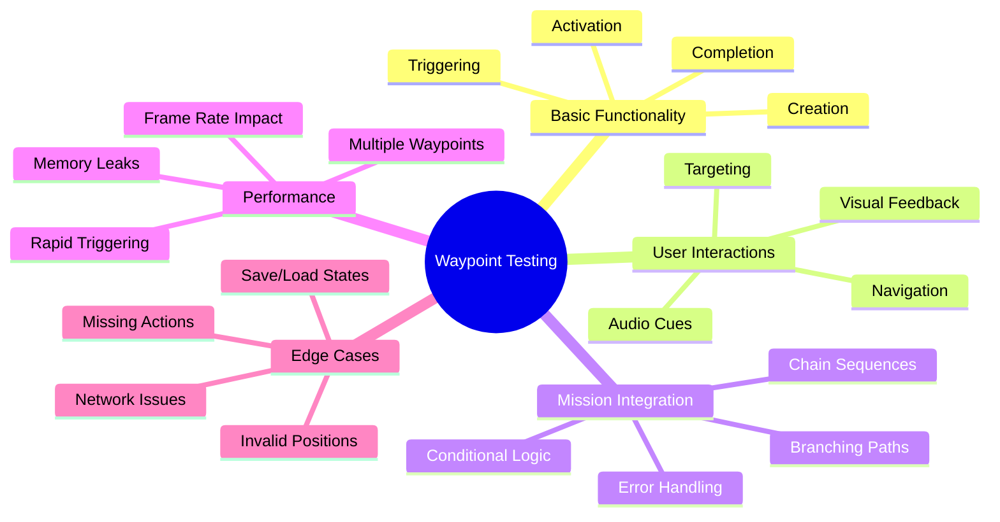

### **Automated Test Suite**

```javascript
// Example test cases for waypoint system
describe('Waypoint System', () => {
    describe('Waypoint Creation', () => {
        it('should create waypoint with valid configuration', () => {
            const config = {
                name: 'Test Waypoint',
                position: [100, 0, 0],
                triggerRadius: 10.0,
                actions: [{ type: 'next_waypoint' }]
            };
            
            const waypointId = waypointManager.createWaypoint(config);
            expect(waypointId).toBeDefined();
            expect(waypointManager.getWaypoint(waypointId)).toBeTruthy();
        });
    });

    describe('Proximity Triggering', () => {
        it('should trigger waypoint when player enters radius', () => {
            const waypointId = createTestWaypoint([100, 0, 0], 10.0);
            
            // Simulate player movement
            setPlayerPosition([95, 0, 0]); // Within trigger radius
            waypointManager.checkWaypointTriggers();
            
            const waypoint = waypointManager.getWaypoint(waypointId);
            expect(waypoint.status).toBe('TRIGGERED');
        });
    });

    describe('Action Execution', () => {
        it('should execute all waypoint actions in sequence', async () => {
            const actions = [
                { type: 'play_comm', parameters: { audioFile: 'test.mp3' } },
                { type: 'spawn_ships', parameters: { count: 2 } },
                { type: 'next_waypoint' }
            ];
            
            const waypointId = createTestWaypoint([100, 0, 0], 10.0, actions);
            await waypointManager.triggerWaypoint(waypointId);
            
            // Verify all actions were executed
            expect(mockAudioSystem.playAudio).toHaveBeenCalledWith('test.mp3');
            expect(mockSpawnSystem.spawnShips).toHaveBeenCalledWith({ count: 2 });
            expect(waypointManager.getNextActiveWaypoint()).toBeTruthy();
        });
    });
});
```

## 🔄 **Waypoint Interruption & Re-targeting System**

### **Problem Statement**

During missions, players frequently need to abandon their current waypoint target to handle immediate threats or opportunities:
- **Combat Interruptions**: Enemy ships require immediate targeting
- **Resource Management**: Low fuel/shields require targeting refueling stations
- **Opportunity Targeting**: Valuable cargo or rare objects need investigation
- **Emergency Situations**: Distress calls or critical events demand attention

After handling these interruptions, players must be able to **seamlessly return** to their mission waypoint without losing progress or context.

### **Interruption Use Cases**

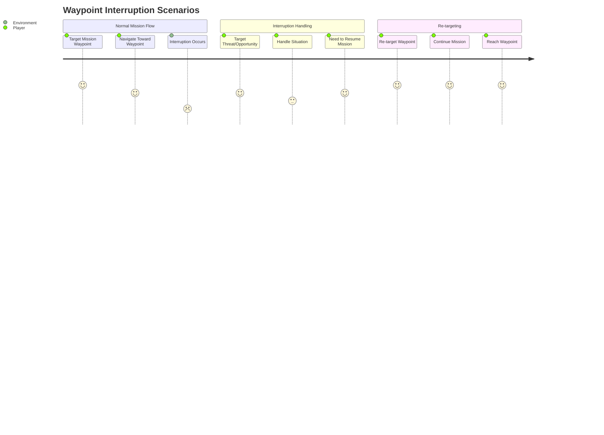

#### **Scenario 1: Combat Interruption**
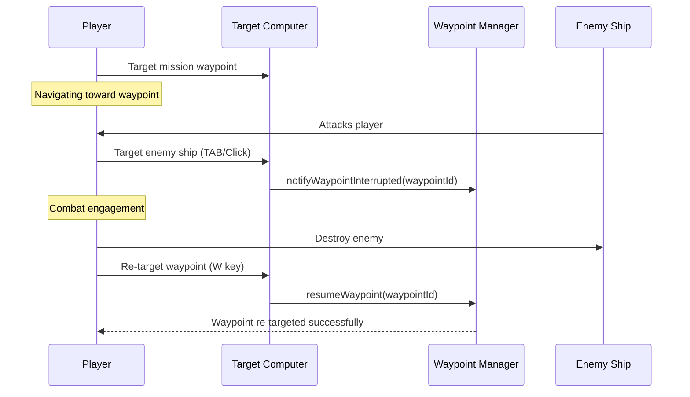

#### **Scenario 2: Resource Management Interruption**
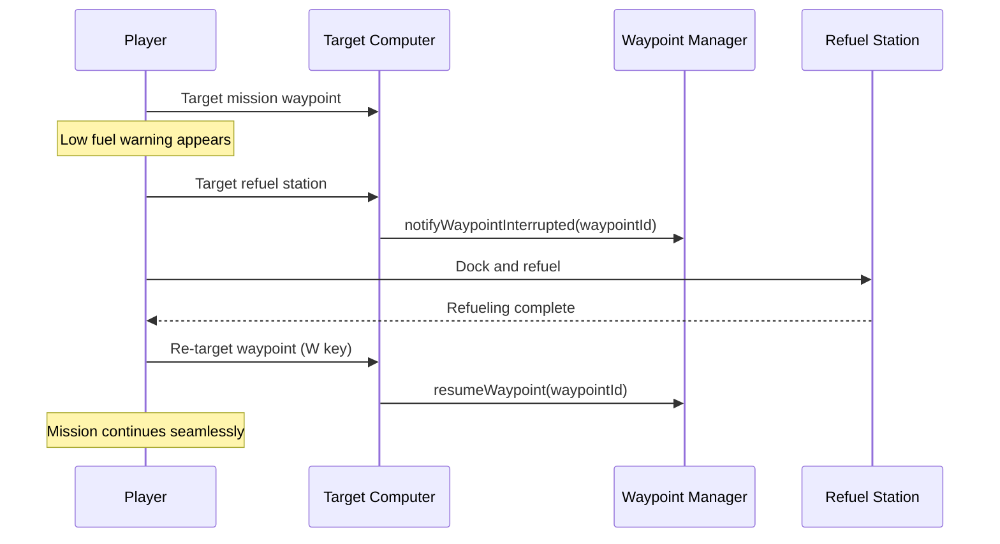

### **Re-targeting Mechanisms**

#### **1. Dedicated Waypoint Key (W Key)**
```javascript
// Keyboard shortcut for quick waypoint re-targeting
class WaypointReTargeting {
    constructor() {
        this.lastActiveWaypoint = null;
        this.interruptionTime = null;
    }

    handleWaypointKey() {
        if (this.lastActiveWaypoint && this.lastActiveWaypoint.status === 'INTERRUPTED') {
            // Re-target the interrupted waypoint
            this.resumeWaypoint(this.lastActiveWaypoint.id);
            
            debug('WAYPOINTS', `Re-targeting waypoint: ${this.lastActiveWaypoint.name}`);
            
            // Show confirmation feedback
            this.showReTargetingFeedback(this.lastActiveWaypoint);
        } else {
            // No interrupted waypoint - target next active waypoint
            const nextWaypoint = this.getNextActiveWaypoint();
            if (nextWaypoint) {
                this.targetWaypoint(nextWaypoint.id);
            }
        }
    }

    showReTargetingFeedback(waypoint) {
        // Visual feedback for waypoint re-targeting
        this.showNotification(`Resuming: ${waypoint.name}`, 'waypoint_resume');
        this.highlightWaypointInHUD(waypoint.id);
    }
}
```

#### **2. Target Computer Integration**
```javascript
// Enhanced Target Computer with waypoint interruption tracking
class TargetComputerManager {
    constructor() {
        // Existing properties...
        this.interruptedWaypoint = null;
        this.waypointInterruptionTime = null;
    }

    setTarget(newTarget) {
        // Check if current target is a waypoint
        if (this.isCurrentTargetWaypoint() && newTarget.type !== 'waypoint') {
            // Store interrupted waypoint for later resumption
            this.interruptedWaypoint = {
                ...this.currentTarget,
                status: 'INTERRUPTED',
                interruptedAt: new Date(),
                interruptedBy: newTarget.type
            };
            
            debug('WAYPOINTS', `Waypoint interrupted: ${this.currentTarget.name} by ${newTarget.type}`);
            
            // Notify waypoint manager
            if (window.waypointManager) {
                window.waypointManager.notifyWaypointInterrupted(this.currentTarget.id);
            }
        }

        // Set new target normally
        this.currentTarget = newTarget;
        this.updateTargetDisplay();
    }

    resumeInterruptedWaypoint() {
        if (this.interruptedWaypoint) {
            const waypoint = this.interruptedWaypoint;
            
            // Clear interruption state
            this.interruptedWaypoint = null;
            this.waypointInterruptionTime = null;
            
            // Re-target the waypoint
            this.setVirtualTarget(waypoint.id);
            
            // Update waypoint status
            if (window.waypointManager) {
                window.waypointManager.resumeWaypoint(waypoint.id);
            }
            
            return true;
        }
        return false;
    }

    hasInterruptedWaypoint() {
        return this.interruptedWaypoint !== null;
    }
}
```

#### **3. Star Charts Quick Re-targeting**
```javascript
// Star Charts integration for waypoint re-targeting
class StarChartsUI {
    // Existing methods...

    renderWaypointMarkers() {
        const activeWaypoints = window.waypointManager?.getActiveWaypoints() || [];
        const interruptedWaypoint = window.targetComputerManager?.interruptedWaypoint;

        for (const waypoint of activeWaypoints) {
            this.renderWaypointMarker(waypoint);
        }

        // Highlight interrupted waypoint with special styling
        if (interruptedWaypoint) {
            this.renderInterruptedWaypointMarker(interruptedWaypoint);
        }
    }

    renderInterruptedWaypointMarker(waypoint) {
        const marker = this.createWaypointMarker(waypoint);
        
        // Add interrupted waypoint styling
        marker.classList.add('waypoint-interrupted');
        marker.setAttribute('stroke-dasharray', '5,5'); // Dashed border
        marker.setAttribute('stroke', '#FFD700'); // Gold color for interrupted
        
        // Add pulsing animation
        const pulseAnimation = document.createElementNS('http://www.w3.org/2000/svg', 'animate');
        pulseAnimation.setAttribute('attributeName', 'opacity');
        pulseAnimation.setAttribute('values', '0.5;1;0.5');
        pulseAnimation.setAttribute('dur', '2s');
        pulseAnimation.setAttribute('repeatCount', 'indefinite');
        marker.appendChild(pulseAnimation);

        // Double-click to resume
        marker.addEventListener('dblclick', () => {
            this.resumeInterruptedWaypoint(waypoint.id);
        });
    }

    resumeInterruptedWaypoint(waypointId) {
        if (window.targetComputerManager) {
            window.targetComputerManager.resumeInterruptedWaypoint();
        }
    }
}
```

### **Waypoint State Management**

#### **Enhanced Waypoint Status System**
```javascript
// Extended waypoint status to handle interruptions
const WaypointStatus = {
    PENDING: 'pending',           // Created but not yet active
    ACTIVE: 'active',             // Currently active and targetable
    TARGETED: 'targeted',         // Currently targeted by player
    INTERRUPTED: 'interrupted',   // Was targeted but player switched to other target
    TRIGGERED: 'triggered',       // Player reached trigger radius
    COMPLETED: 'completed',       // Actions executed successfully
    CANCELLED: 'cancelled'        // Waypoint cancelled or mission aborted
};
```

#### **Interruption Tracking**
```javascript
class WaypointManager {
    // Existing methods...

    notifyWaypointInterrupted(waypointId) {
        const waypoint = this.activeWaypoints.get(waypointId);
        if (!waypoint) return;

        waypoint.status = WaypointStatus.INTERRUPTED;
        waypoint.interruptedAt = new Date();
        
        // Track interruption metrics
        this.trackInterruption(waypoint);
        
        debug('WAYPOINTS', `Waypoint interrupted: ${waypoint.name}`);
    }

    resumeWaypoint(waypointId) {
        const waypoint = this.activeWaypoints.get(waypointId);
        if (!waypoint || waypoint.status !== WaypointStatus.INTERRUPTED) {
            return false;
        }

        waypoint.status = WaypointStatus.TARGETED;
        waypoint.resumedAt = new Date();
        
        // Calculate interruption duration for metrics
        const interruptionDuration = waypoint.resumedAt - waypoint.interruptedAt;
        waypoint.interruptionDuration = interruptionDuration;
        
        debug('WAYPOINTS', `Waypoint resumed: ${waypoint.name} (interrupted for ${interruptionDuration}ms)`);
        
        return true;
    }

    getInterruptedWaypoint() {
        for (const [id, waypoint] of this.activeWaypoints) {
            if (waypoint.status === WaypointStatus.INTERRUPTED) {
                return waypoint;
            }
        }
        return null;
    }

    trackInterruption(waypoint) {
        // Track interruption analytics
        this.interruptionMetrics = this.interruptionMetrics || [];
        this.interruptionMetrics.push({
            waypointId: waypoint.id,
            missionId: waypoint.missionId,
            interruptedAt: waypoint.interruptedAt,
            waypointType: waypoint.type
        });
    }
}
```

### **User Interface Enhancements**

#### **HUD Interruption Indicators**
```javascript
// Enhanced HUD to show waypoint interruption state
class WaypointHUD {
    updateWaypointDisplay() {
        const currentTarget = window.targetComputerManager?.currentTarget;
        const interruptedWaypoint = window.targetComputerManager?.interruptedWaypoint;

        // Show current target normally
        if (currentTarget) {
            this.displayCurrentTarget(currentTarget);
        }

        // Show interrupted waypoint indicator
        if (interruptedWaypoint) {
            this.displayInterruptedWaypointIndicator(interruptedWaypoint);
        }
    }

    displayInterruptedWaypointIndicator(waypoint) {
        // Create small indicator for interrupted waypoint
        const indicator = document.createElement('div');
        indicator.className = 'interrupted-waypoint-indicator';
        indicator.innerHTML = `
            <div class="indicator-icon">⏸</div>
            <div class="indicator-text">${waypoint.name}</div>
            <div class="indicator-hint">Press W to resume</div>
        `;
        
        // Position in corner of HUD
        indicator.style.position = 'absolute';
        indicator.style.top = '10px';
        indicator.style.right = '10px';
        indicator.style.background = 'rgba(255, 215, 0, 0.8)';
        indicator.style.padding = '5px';
        indicator.style.borderRadius = '3px';
        indicator.style.fontSize = '12px';
        
        // Add click handler for quick resume
        indicator.addEventListener('click', () => {
            window.targetComputerManager?.resumeInterruptedWaypoint();
        });

        document.getElementById('hud-container').appendChild(indicator);
    }
}
```

#### **Keyboard Shortcuts**
```javascript
// Enhanced keyboard handling for waypoint operations
class WaypointKeyboardHandler {
    constructor() {
        this.setupKeyboardListeners();
    }

    setupKeyboardListeners() {
        document.addEventListener('keydown', (event) => {
            switch (event.key.toLowerCase()) {
                case 'w':
                    this.handleWaypointKey(event);
                    break;
                case 'shift+w':
                    this.handleNextWaypointKey(event);
                    break;
            }
        });
    }

    handleWaypointKey(event) {
        event.preventDefault();
        
        // Try to resume interrupted waypoint first
        if (window.targetComputerManager?.hasInterruptedWaypoint()) {
            const resumed = window.targetComputerManager.resumeInterruptedWaypoint();
            if (resumed) {
                this.showFeedback('Waypoint resumed', 'success');
                return;
            }
        }

        // Otherwise target next active waypoint
        const nextWaypoint = window.waypointManager?.getNextActiveWaypoint();
        if (nextWaypoint) {
            window.targetComputerManager?.setVirtualTarget(nextWaypoint.id);
            this.showFeedback(`Targeting: ${nextWaypoint.name}`, 'info');
        } else {
            this.showFeedback('No active waypoints', 'warning');
        }
    }

    handleNextWaypointKey(event) {
        event.preventDefault();
        
        // Cycle through all active waypoints
        const activeWaypoints = window.waypointManager?.getActiveWaypoints() || [];
        if (activeWaypoints.length === 0) {
            this.showFeedback('No active waypoints', 'warning');
            return;
        }

        const currentTarget = window.targetComputerManager?.currentTarget;
        let nextIndex = 0;

        if (currentTarget && currentTarget.type === 'waypoint') {
            const currentIndex = activeWaypoints.findIndex(w => w.id === currentTarget.id);
            nextIndex = (currentIndex + 1) % activeWaypoints.length;
        }

        const nextWaypoint = activeWaypoints[nextIndex];
        window.targetComputerManager?.setVirtualTarget(nextWaypoint.id);
        this.showFeedback(`Targeting: ${nextWaypoint.name}`, 'info');
    }

    showFeedback(message, type) {
        // Show temporary feedback message
        const feedback = document.createElement('div');
        feedback.className = `waypoint-feedback waypoint-feedback-${type}`;
        feedback.textContent = message;
        feedback.style.cssText = `
            position: fixed;
            top: 50%;
            left: 50%;
            transform: translate(-50%, -50%);
            background: rgba(0, 0, 0, 0.8);
            color: white;
            padding: 10px 20px;
            border-radius: 5px;
            z-index: 9999;
            font-size: 14px;
        `;

        document.body.appendChild(feedback);

        // Remove after 2 seconds
        setTimeout(() => {
            document.body.removeChild(feedback);
        }, 2000);
    }
}
```

### **Mission Flow Integration**

#### **Interruption-Aware Mission Design**
```javascript
// Mission templates that account for likely interruptions
const missionTemplates = {
    escort_mission: {
        waypoints: [
            {
                name: "Rendezvous Point",
                position: [100, 0, 0],
                type: 'CHECKPOINT',
                interruptionTolerant: true, // Can be safely interrupted
                actions: [
                    { type: 'spawn_convoy', parameters: { ships: 3 } }
                ]
            },
            {
                name: "Escort Route Alpha",
                position: [200, 50, 25],
                type: 'NAVIGATION',
                interruptionExpected: true, // Interruptions likely (combat)
                actions: [
                    { type: 'monitor_convoy_health' },
                    { type: 'spawn_pirates_conditional', parameters: { probability: 0.7 } }
                ]
            },
            {
                name: "Safe Harbor Station",
                position: [300, 0, 0],
                type: 'OBJECTIVE',
                interruptionTolerant: false, // Should not be interrupted near completion
                actions: [
                    { type: 'complete_escort_mission' },
                    { type: 'reward_player', parameters: { credits: 5000 } }
                ]
            }
        ]
    }
};
```

### **Analytics & Optimization**

#### **Interruption Metrics**
```javascript
const INTERRUPTION_METRICS = {
    interruptionFrequency: 'Average interruptions per waypoint',
    interruptionDuration: 'Average time between interruption and resumption',
    resumptionRate: 'Percentage of interrupted waypoints that are resumed',
    interruptionCauses: 'Most common reasons for waypoint interruption',
    missionCompletionImpact: 'Effect of interruptions on mission completion rate'
};

class WaypointAnalytics {
    trackInterruption(waypoint, interruptionCause) {
        this.metrics.interruptions.push({
            waypointId: waypoint.id,
            missionId: waypoint.missionId,
            cause: interruptionCause,
            timestamp: new Date(),
            waypointType: waypoint.type
        });
    }

    trackResumption(waypoint, resumptionMethod) {
        const interruption = this.metrics.interruptions.find(
            i => i.waypointId === waypoint.id && !i.resumed
        );
        
        if (interruption) {
            interruption.resumed = true;
            interruption.resumptionMethod = resumptionMethod; // 'W_key', 'star_charts', 'manual'
            interruption.resumptionTime = new Date();
            interruption.interruptionDuration = interruption.resumptionTime - interruption.timestamp;
        }
    }

    generateInterruptionReport() {
        return {
            totalInterruptions: this.metrics.interruptions.length,
            averageInterruptionDuration: this.calculateAverageInterruptionDuration(),
            resumptionRate: this.calculateResumptionRate(),
            commonCauses: this.getCommonInterruptionCauses(),
            recommendedImprovements: this.generateRecommendations()
        };
    }
}
```

### **Testing Scenarios**

#### **Interruption Test Cases**
```javascript
describe('Waypoint Interruption System', () => {
    describe('Combat Interruption', () => {
        it('should preserve waypoint when targeting enemy', () => {
            const waypointId = createTestWaypoint('Combat Zone', [100, 0, 0]);
            targetComputer.setVirtualTarget(waypointId);
            
            // Simulate enemy attack
            const enemy = createTestEnemy([90, 0, 0]);
            targetComputer.setTarget(enemy);
            
            // Verify waypoint is preserved as interrupted
            expect(targetComputer.interruptedWaypoint).toBeTruthy();
            expect(targetComputer.interruptedWaypoint.id).toBe(waypointId);
        });

        it('should resume waypoint after combat', () => {
            // Setup interrupted waypoint scenario
            setupInterruptedWaypoint();
            
            // Simulate W key press
            simulateKeyPress('w');
            
            // Verify waypoint is resumed
            expect(targetComputer.currentTarget.type).toBe('waypoint');
            expect(targetComputer.interruptedWaypoint).toBeNull();
        });
    });

    describe('Resource Management Interruption', () => {
        it('should handle refueling station targeting', () => {
            const waypointId = createTestWaypoint('Mission Objective', [200, 0, 0]);
            targetComputer.setVirtualTarget(waypointId);
            
            // Simulate low fuel and station targeting
            const station = createTestStation([150, 0, 0], 'refuel');
            targetComputer.setTarget(station);
            
            // Verify interruption tracking
            expect(targetComputer.interruptedWaypoint.interruptedBy).toBe('station');
        });
    });

    describe('Multiple Waypoint Management', () => {
        it('should cycle through waypoints with Shift+W', () => {
            const waypoint1 = createTestWaypoint('Waypoint 1', [100, 0, 0]);
            const waypoint2 = createTestWaypoint('Waypoint 2', [200, 0, 0]);
            
            // Target first waypoint
            targetComputer.setVirtualTarget(waypoint1);
            
            // Simulate Shift+W to cycle
            simulateKeyPress('w', { shiftKey: true });
            
            // Verify second waypoint is targeted
            expect(targetComputer.currentTarget.id).toBe(waypoint2);
        });
    });
});
```

## 🎯 **Success Metrics**

### **User Experience Metrics**

```javascript
const UX_METRICS = {
    waypointDiscovery: 'Time from waypoint creation to player targeting',
    navigationEfficiency: 'Direct path vs actual path taken to waypoint',
    triggerAccuracy: 'Percentage of intended waypoint triggers',
    missionCompletion: 'Mission completion rate with waypoint guidance',
    userSatisfaction: 'Player feedback on waypoint usefulness',
    
    // Interruption-specific metrics
    interruptionRecovery: 'Time from interruption to waypoint resumption',
    resumptionSuccess: 'Percentage of interrupted waypoints successfully resumed',
    interruptionFrustration: 'Player difficulty in re-targeting waypoints',
    waypointRetention: 'How often players remember to resume interrupted waypoints',
    keyboardShortcutUsage: 'Adoption rate of W key for waypoint re-targeting'
};
```

### **Technical Metrics**

```javascript
const TECHNICAL_METRICS = {
    systemPerformance: 'Frame rate impact of waypoint system',
    memoryEfficiency: 'Memory usage per active waypoint',
    triggerLatency: 'Time from proximity to trigger execution',
    actionReliability: 'Success rate of waypoint action execution',
    systemStability: 'Uptime without waypoint-related crashes'
};
```

## 🚀 **Implementation Roadmap**

### **Phase 1: Core Infrastructure** (Week 1-2)
- ✅ Waypoint data model and basic manager
- ✅ Proximity detection and triggering system
- ✅ Basic action execution framework
- ✅ Target Computer integration

### **Phase 2: User Interface** (Week 3-4)
- ✅ HUD waypoint indicators
- ✅ Star Charts waypoint markers
- ✅ Target Computer waypoint display
- ✅ Visual feedback and animations

### **Phase 3: Mission Integration** (Week 5-6)
- ✅ Mission system waypoint creation
- ✅ Waypoint chain management
- ✅ Action type implementations
- ✅ Persistence and save/load

### **Phase 4: Advanced Features** (Week 7-8)
- ✅ Conditional waypoints
- ✅ Branching mission paths
- ✅ Timed waypoints
- ✅ Performance optimizations

### **Phase 5: Testing & Polish** (Week 9-10)
- ✅ Comprehensive testing suite
- ✅ Performance optimization
- ✅ User experience refinements
- ✅ Documentation completion

## 📋 **Integration Checklist**

### **System Dependencies**
- [ ] **Mission System**: Waypoint creation and management APIs
- [ ] **Target Computer**: Virtual target support and display
- [ ] **Star Charts**: Waypoint marker rendering and interaction
- [ ] **HUD System**: 3D waypoint indicator display
- [ ] **Audio System**: Waypoint trigger and completion sounds
- [ ] **Save System**: Waypoint state persistence

### **Data Requirements**
- [ ] **Waypoint Database**: Storage for active and completed waypoints
- [ ] **Mission Templates**: Waypoint configurations for each mission type
- [ ] **Action Definitions**: Available actions and their parameters
- [ ] **Performance Metrics**: Monitoring and optimization data

### **Testing Requirements**
- [ ] **Unit Tests**: Core waypoint functionality
- [ ] **Integration Tests**: Cross-system compatibility
- [ ] **Performance Tests**: Frame rate and memory impact
- [ ] **User Tests**: Navigation and interaction usability

## 🎮 **Final User Experience**

The Waypoints System transforms mission navigation from abstract objectives into concrete, interactive guidance that enhances player immersion and reduces confusion. Players will experience:

1. **Clear Direction**: Always know where to go next in complex missions
2. **Interactive Guidance**: Waypoints respond to player actions and mission state
3. **Contextual Actions**: Each waypoint provides relevant actions for the current situation
4. **Visual Consistency**: Waypoints integrate seamlessly with existing UI systems
5. **Mission Flow**: Smooth progression through complex multi-stage missions

This system provides the foundation for sophisticated mission design while maintaining the intuitive, accessible gameplay that defines the Planetz experience.
