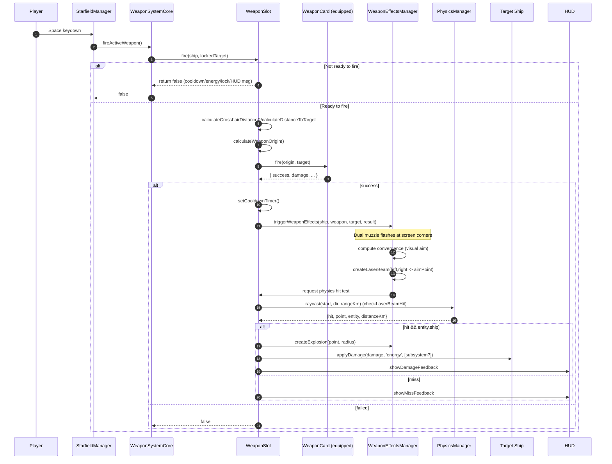
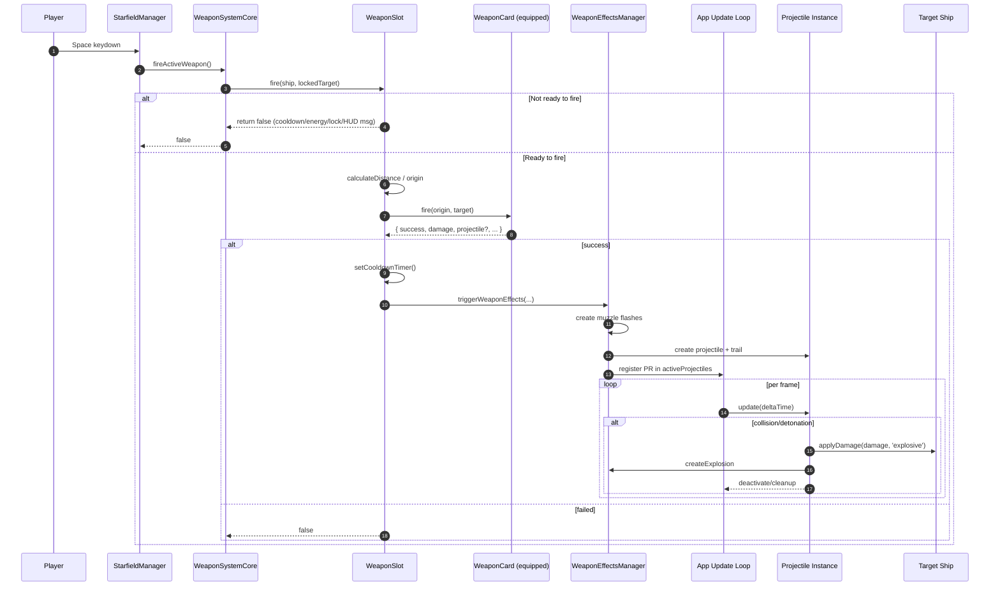

## Weapon Firing System – Current Flow (Hit-scan and Projectile)

This document reflects the current behavior in code for both hit-scan (laser) and projectile weapons.

### Hit-scan (Laser) firing sequence

Notes:
- Input path: `StarfieldManager` keydown → `WeaponSystemCore.fireActiveWeapon()` → active `WeaponSlot.fire()`.
- Range enforcement: blocks firing when target/crosshair distance > weapon.range (km).
- Physics raycast: performed by `WeaponSlot.checkLaserBeamHit()`; world units are kilometers.
- Filtering: current logic skips stars/planets/moons; accepts any non‑celestial entity (ships, stations, beacons, friendlies).
- On hit, damage is applied via `hitEntity.ship.applyDamage(...)`; HUD feedback is shown.

### Projectile weapon firing sequence

Key implementation points (as of codebase):
- Input and control: `frontend/static/js/views/StarfieldManager.js` (Space fires).
- Weapon orchestration: `frontend/static/js/ship/systems/WeaponSystemCore.js` → `WeaponSlot.fire()`.
- Hit‑scan specifics: `WeaponSlot.triggerWeaponEffects()` + `checkLaserBeamHit()` + `PhysicsManager.raycast()`.
- Damage application: `hitEntity.ship.applyDamage(...)` on successful physics hit.
- Projectiles: effects/trail handled by `WeaponEffectsManager`; update loop processes active projectiles.

