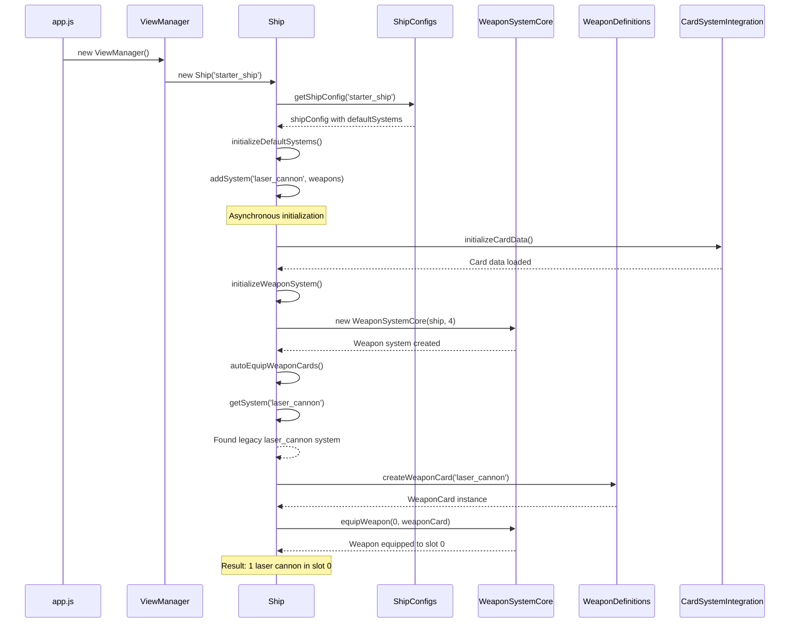
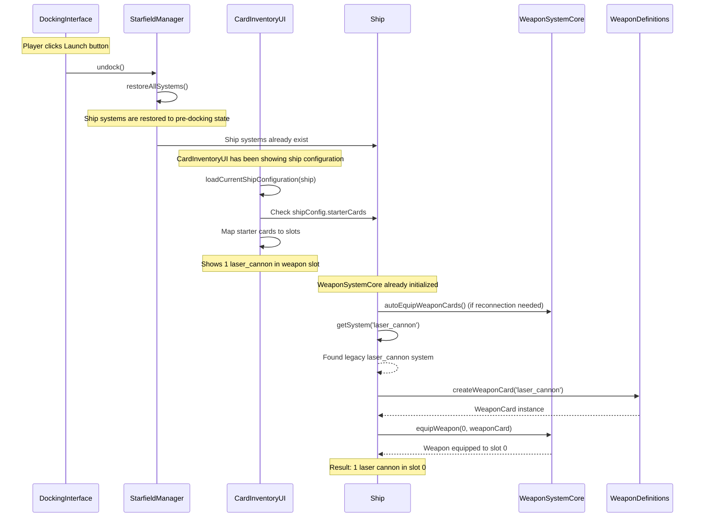
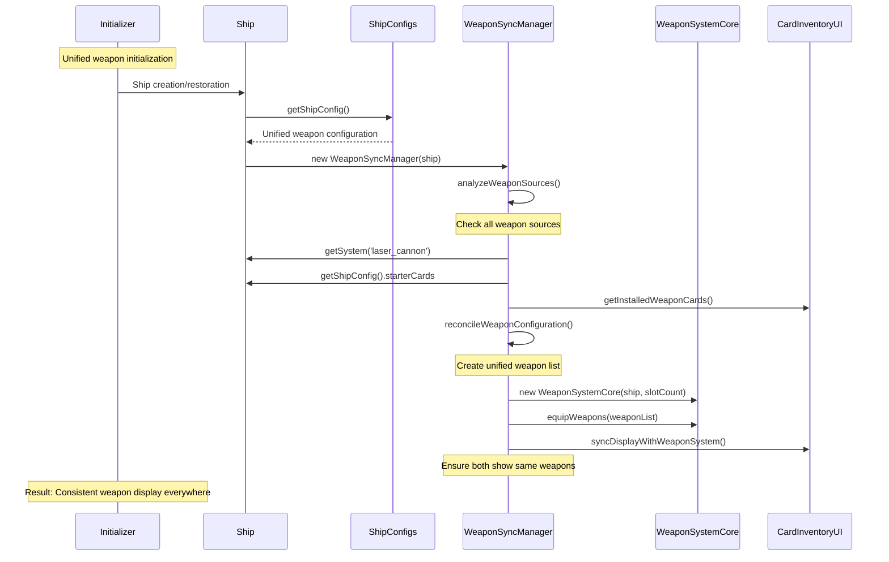

# Weapon System Setup - UML Sequence Diagrams

## Scenario 1: Game Start (New Ship Initialization)



## Scenario 2: Launch from Station (Existing Ship Configuration)



## Current Issues Identified

### 1. **Inconsistent Weapon Slot Configuration**
- **Game Start**: Ship configured with 4 weapon slots in WeaponSystemCore
- **Docking Interface**: Shows only 1 weapon slot from starterCards
- **Result**: Mismatch between display and actual weapon system

### 2. **Multiple Weapon Loading Paths**
- **StarterCards**: Used by CardInventoryUI for docking interface display
- **Ship Systems**: Used by WeaponSystemCore for actual weapon loading
- **Card Inventory**: Used as fallback by autoEquipWeaponCards()

### 3. **Initialization Timing Issues**
- WeaponSystemCore initializes before ship systems are fully loaded
- CardInventoryUI loads separately from weapon system
- No synchronization between docking interface and weapon system

## Proposed Unified Solution



## Implementation Strategy

### Phase 1: Create WeaponSyncManager
```javascript
class WeaponSyncManager {
    constructor(ship) {
        this.ship = ship;
        this.weaponSystem = null;
        this.cardInventoryUI = null;
    }
    
    async initializeWeapons() {
        // 1. Analyze all weapon sources
        const weapons = await this.gatherAllWeapons();
        
        // 2. Create weapon system with correct slot count
        const slotCount = Math.max(weapons.length, 1); // At least 1 slot
        this.weaponSystem = new WeaponSystemCore(this.ship, slotCount);
        
        // 3. Equip weapons to system
        await this.equipWeaponsToSystem(weapons);
        
        // 4. Sync with card inventory display
        await this.syncWithCardInventory(weapons);
    }
}
```

### Phase 2: Update ShipConfigs for Consistency
```javascript
// Make starter ship weapon slots dynamic based on actual weapons
starterCards: {
    weapon_1: { cardType: 'laser_cannon', level: 1 }
    // Add more weapons here to test 4-weapon setup
},
slotConfig: {
    weapons: 'dynamic' // Calculate based on starterCards
}
```

### Phase 3: Unified Initialization Entry Point
```javascript
Ship.prototype.initializeWeaponSystem = async function() {
    this.weaponSyncManager = new WeaponSyncManager(this);
    await this.weaponSyncManager.initializeWeapons();
    this.weaponSystem = this.weaponSyncManager.weaponSystem;
}
```

## Benefits of Unified Approach

1. **Consistency**: Docking interface and weapon system always show same weapons
2. **Flexibility**: Easy to add/remove weapons and have both systems sync
3. **Single Source of Truth**: WeaponSyncManager manages all weapon configuration
4. **Debugging**: Clear centralized place to troubleshoot weapon issues
5. **Testing**: Can easily test with different weapon configurations

## Testing Configuration for 4 Weapons

To test with 4 weapon slots as requested:

```javascript
// ShipConfigs.js - starter_ship
starterCards: {
    utility_1: { cardType: 'target_computer', level: 1 },
    engine_1: { cardType: 'impulse_engines', level: 1 },
    power_1: { cardType: 'energy_reactor', level: 1 },
    weapon_1: { cardType: 'laser_cannon', level: 1 },
    weapon_2: { cardType: 'pulse_cannon', level: 1 },
    weapon_3: { cardType: 'plasma_cannon', level: 1 },
    weapon_4: { cardType: 'phaser_array', level: 1 }
},
slotConfig: {
    weapons: 4  // Now matches actual weapon count
}
```

This will ensure both the docking interface and weapon system show exactly 4 weapons consistently. 